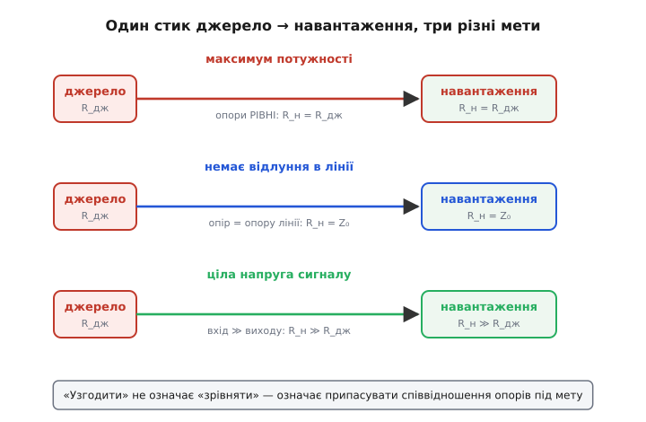
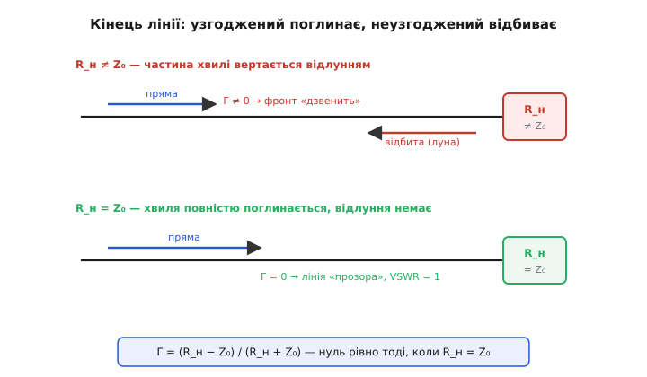
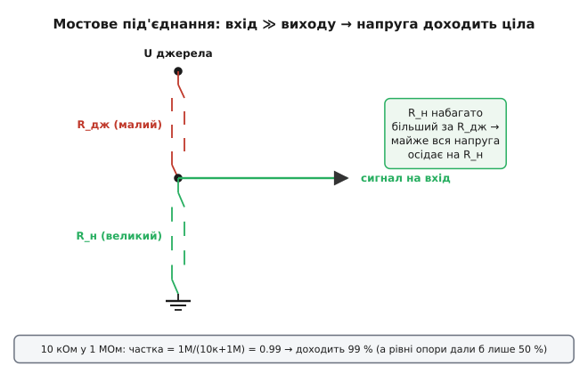

# Узгодження опорів

Будь-який сигнал у схемі завжди проходить через стик: одна частина його **віддає** (джерело — мікрофон, антена, попередній каскад), друга **приймає** (навантаження — підсилювач, динамік, наступний каскад). І на цьому стику завжди стоїть просте, але прикре питання: яким зробити вхідний опір приймача супроти вихідного опору віддавача? Здавалося б, дрібниця — а від неї залежить, чи дійде сигнал цілим, скільки потужності перейде й чи не повернеться частина назад відлунням. **Узгодження опорів** (англ. *impedance matching* — припасування імпедансів) — це і є свідомий вибір цього співвідношення під ту мету, яка вам зараз потрібна.

Слово «узгодження» збиває з пантелику, бо натякає на одне-єдине правильне значення — «зрівняти». Насправді мет три, і вони тягнуть у різні боки. Хочеш максимум потужності — роби опори **рівними**. Хочеш, щоб сигнал не відбився від кінця лінії, — роби опір навантаження рівним опору **лінії**. Хочеш передати напругу сигналу цілою — роби вхідний опір приймача **набагато більшим** за вихідний опір джерела. Одна назва, три різні рецепти. Розберімося, звідки кожен береться й коли який потрібен — тоді «узгодження» перестане бути магічним заклинанням і стане інженерним рішенням.


*Та сама пара «джерело з вихідним опором — навантаження» дає три несумісні рецепти залежно від того, що ви хочете зняти зі стику: всю потужність, чистий сигнал без відлуння чи цілу напругу. Це головна думка теми: узгодження — не «зрівняти», а «припасувати під мету».*

## Звідки взагалі береться проблема

Жодне реальне джерело сигналу не віддає його «з нуля опору». Усередині нього завжди сидить власний [внутрішній опір](book:electronics/internal-resistance) — а на змінному струмі ширше, власний **імпеданс** (опір разом із реактивністю котушок і ємностей). Мікрофон має свій, антена свій, вихід підсилювача свій. І щойно до цього джерела чіпляють навантаження з власним опором, два опори утворюють [дільник](book:electronics/voltage-divider): сигнал ділиться між «внутрішнім» опором джерела та опором навантаження. Скільки дістанеться навантаженню — залежить винятково від співвідношення цих двох.

> 🔧 **Навіщо це.** У реальній платі це питання спливає на кожному стику. Підключаєте давач до входу мікроконтролера — і якщо вхід «висить» надто низьким опором, він просідає сигнал давача й показання брешуть. Тягнете тактовий сигнал доріжкою на іншу мікросхему — і якщо кінець доріжки не узгоджений, фронт відбивається й «дзвенить», аж до помилкових перемикань. Виводите радіосигнал на антену — і неузгодження вертає половину потужності назад у вихідний каскад, гріє його й калічить дальність. Усе це — одна й та сама проблема стику, розв'язана по-різному.

Тут одразу видно: відповіді на «що робити з опорами» немає, поки не сказано, **що саме** ви хочете зі стику зняти. Тому розглянемо три мети окремо.

## Мета перша: максимум потужності — опори рівні

Уявіть джерело з вихідним опором R_дж, до якого ввімкнено навантаження R_н. Уся напруга джерела ділиться між ними. Якщо R_н зробити дуже малим — крізь коло піде великий струм, але майже вся напруга осяде на внутрішньому R_дж, і навантаженню дістанеться крихта потужності. Якщо R_н зробити дуже великим — на ньому буде майже вся напруга, зате струм майже нульовий, і потужність знов мала. Десь посередині лежить максимум.

Цей максимум припадає рівно на **рівність опорів**: R_н = R_дж. Це і є зміст [теореми про максимальну передачу потужності](book:electronics/power-matching) — на резистивних опорах потужність у навантаженні найбільша, коли його опір дорівнює внутрішньому опору джерела. На змінному струмі правило точніше: опір навантаження має бути **комплексно спряженим** до опору джерела (англ. *complex conjugate* — спряжене значення), тобто активна частина зрівняна, а реактивна — протилежного знаку, щоб котушка джерела й конденсатор навантаження взаємно скомпенсувалися. Тоді вони «розв'язують руки» одне одному, і вся потужність іде в активну частину.

> 🔧 **Навіщо це.** Узгодження на максимум потужності критичне там, де потужності сигналу мало, а кожна її частка дорога: вхід радіоприймача (антена віддає мікровати — гріх половину втратити), вихід радіопередавача в антену, узгодження п'єзодавача. Там, де сигнал слабкий і підсилити його без шуму важко, спершу витискають з нього всю потужність — і лише потім підсилюють.

Але в рівності опорів сидить розплата, про яку часто забувають. Коли R_н = R_дж, рівно стільки ж потужності, скільки йде в навантаження, **марно гріється** на внутрішньому опорі джерела. Корисний коефіцієнт корисної дії — рівно 50%. Половина енергії — у грубку. Для слабкого сигналу це байдуже (нам важлива не економія, а абсолютний максимум корисних мікроватів), але для силового кола це катастрофа.

**Worked-приклад: куди йде потужність при узгодженні на максимум.** Джерело 10 В із внутрішнім опором 50 Ом, навантаження теж 50 Ом. Порахуймо струм, потужність у навантаженні й потужність втрат:

```
I       = U / (R_дж + R_н)  = 10 / (50 + 50) = 0.1 А
P_н     = I² · R_н          = 0.1² · 50      = 0.5 Вт   ← у навантаженні
P_втрат = I² · R_дж         = 0.1² · 50      = 0.5 Вт   ← гріє джерело
ККД     = P_н / (P_н + P_втрат)              = 50 %
```

Половина потужності назавжди втрачена в самому джерелі — це ціна максимуму. Саме тому в живленні опори навмисно **не** узгоджують: блок живлення має малесенький вихідний опір супроти навантаження, щоб віддавати майже всю потужність у корисне коло, а не в себе. Цю саму пастку колись не зрозумів навіть фізик Джеймс Джоуль: вирішив, що електромотор від батареї фізично не може мати ККД понад 50%. Помилку згодом спростували — справа не в узгодженні, а в зменшенні внутрішнього опору джерела; цю історію [варто простежити окремо](book:electronics/impedance-matching/hist-jacobi-matching.md), бо вона добре показує, як легко сплутати «максимум потужності» з «максимумом ефективності».

## Мета друга: ніякого відлуння — опір лінії

Друга мета з'являється, коли провід між джерелом і навантаженням стає **довгим** — настільки, що сигнал не встигає миттю долетіти до кінця, а котиться вздовж нього хвилею. Тоді провід поводиться вже не як шматок дроту, а як **лінія передачі** (англ. *transmission line*): у неї є власний характеристичний опір Z₀, що залежить лише від геометрії — погонної індуктивності L та ємності C на одиницю довжини:

```
Z₀ = √(L / C)
```

Цей опір — не опір самого матеріалу проводу (мідь майже не гріється), а опір, який «відчуває» хвиля, поки біжить. Коаксіальний кабель має Z₀ = 50 Ом, телевізійний — 75 Ом, кручена пара — близько 100 Ом. І ось головне: коли хвиля добігає до кінця лінії й бачить навантаження, опір якого **не дорівнює** Z₀, частина її енергії **відбивається назад** — як луна від стіни.

Чому відбивається? Бо на стику двох опорів хвиля мусить водночас задовольнити умови з обох боків: і співвідношення напруги до струму, яке диктує лінія (саме Z₀), і те, яке диктує навантаження (R_н). Якщо ці співвідношення різні, одна хвиля їх примирити не може — і народжується друга, відбита, яка котиться назад, щоб баланс зійшовся. Розмір цього відлуння задає **коефіцієнт відбиття** Γ (грец. літера «гамма»):

```
Γ = (R_н − Z₀) / (R_н + Z₀)
```

Коли R_н = Z₀, чисельник нуль — Γ = 0, відлуння немає, вся хвиля йде в навантаження. Це і є узгодження лінії: **зробити опір навантаження рівним характеристичному опору лінії**, а не опору джерела. Якщо ж кінець закоротити (R_н = 0) або лишити обірваним (R_н → ∞), Γ дорівнює −1 чи +1 — хвиля відбивається повністю, лінія вщент укрита стоячими хвилями.


*Зверху: навантаження не дорівнює Z₀, частина хвилі відбивається назад і накладається на пряму — фронт «дзвенить». Знизу: навантаження = Z₀, відлуння немає, лінія «прозора». Узгодження тут означає не максимум потужності, а тишу від відбиттів.*

> 🔧 **Навіщо це.** Це та сама причина, чому швидкі цифрові доріжки на платі (тактові сигнали, шини пам'яті DDR, USB) ведуть із контрольованим Z₀ і ставлять на кінці резистор-узгоджувач — щоб фронт не відбивався й не плодив фальшивих перемикань. І та сама причина, чому радіокабель не можна лишати з обірваним кінцем: уся потужність повернеться назад. Параметр, яким міряють якість такого узгодження, — коефіцієнт стоячої хвилі.

Наскільки добре узгоджена лінія, на практиці міряють не самим Γ, а **коефіцієнтом стоячої хвилі** (англ. *voltage standing wave ratio*, VSWR) — відношенням найбільшої амплітуди вздовж лінії до найменшої. Він прямо випливає з Γ:

```
VSWR = (1 + |Γ|) / (1 − |Γ|)
```

Ідеальне узгодження дає VSWR = 1 (немає ні горбів, ні западин — хвиля рівна). Що гірший стик, то більший VSWR; обрив чи коротке дають нескінченність. Антенник, що крутить налаштування за приладом «КСХ-метр», саме й заганяє цю одиницю якомога ближче до одиниці.

## Мета третя: ціла напруга — опір приймача великий

Третя мета — найпоширеніша в сучасній малосигнальній електроніці, і вона геть протилежна першій. Часто-густо нам не потрібна **потужність** сигналу взагалі; нам потрібне лише його **значення** — напруга, яку далі підсилять або оцифрують. Тоді найгірше, що можна зробити, — зрівняти опори: при R_н = R_дж навантаження з'їдає рівно половину напруги джерела на дільнику, і сигнал одразу слабшає вдвічі (−6 дБ), ще й спотворюється, бо вихідний опір джерела часто залежить від частоти.

Рецепт протилежний: вхідний опір приймача роблять **набагато більшим** за вихідний опір джерела — у десятки й сотні разів. Тоді на дільнику майже вся напруга осідає на навантаженні, а джерело майже не навантажене. Це називають **мостовим** під'єднанням (англ. *impedance bridging* — місткове припасування, на противагу matching): не зрівнюємо опори, а навмисно розводимо їх якнайдалі, щоб передати напругу цілою.

**Worked-приклад: скільки напруги доходить при мостовому під'єднанні.** Давач має вихідний опір R_дж = 10 кОм. Підключаємо його до входу з опором R_н = 1 МОм (типовий високоомний вхід). Скільки сигналу дійде?

```
коефіцієнт передачі = R_н / (R_дж + R_н)
                     = 1 000 000 / (10 000 + 1 000 000)
                     = 0.990   →  доходить 99 % напруги
```

Майже все. А якби ми «узгодили» опори (R_н = 10 кОм), дійшло б рівно 50% — половина сигналу зникла б ще на вході. Ось чому правило для напруги протилежне правилу для потужності.

Перевірити цю логіку зручно прямо в коді — коли мікроконтролер читає давач через свій АЦП, корисно заздалегідь оцінити, чи не просяде вхід сигнал:

```c
// Яка частка напруги джерела дійде до високоомного входу.
// r_src — вихідний опір джерела, r_in — вхідний опір приймача (Ом).
float bridging_ratio(float r_src, float r_in)
{
    return r_in / (r_src + r_in);   // дільник: частка на навантаженні
}
// bridging_ratio(10e3f, 1e6f) -> 0.990  (доходить 99 % — добре)
// bridging_ratio(10e3f, 10e3f) -> 0.500  (узгодили опори — втратили половину!)
```


*Мостове під'єднання очима дільника напруги: коли опір приймача набагато більший за опір джерела, верхнє плече дільника майже не «краде» напругу, і на вхід приходить майже повний сигнал. Це протилежність узгодженню на потужність — і саме так стикують каскади в сучасній малосигнальній техніці.*

> 🔧 **Навіщо це.** Саме на цьому правилі стоїть уся сучасна аналогова стиковка. [Повторювач напруги на операційному підсилювачі](book:electronics/voltage-follower) має майже нескінченний вхідний і майже нульовий вихідний опір — його ставлять буфером саме щоб «розв'язати» високоомне джерело від низькоомного навантаження й передати напругу цілою. Лінійний вхід звукової карти має 10–47 кОм проти ~100 Ом виходу плеєра — навмисне мостове під'єднання. Коли ви тицяєте щуп осцилографа з опором 1 МОм у схему — це теж воно: щуп майже не вантажить точку, яку міряє.

## Чому колись усе узгоджували на потужність

Цікаво, що мостове під'єднання — здобуток порівняно недавній, а сто років тому майже все узгоджували саме на потужність, рівністю опорів. Причина проста й повчальна: **не було чим відновлювати втрачений сигнал**. Рання телефонія й звукотехніка стояли на трансформаторах і пасивних фільтрах, без дешевих підсилювачів; перші електронні лампи коштували дорого й майже не підсилювали. Тож кожен стик намагалися зробити так, щоб витиснути з джерела максимум потужності — звідси й знаменитий телефонний стандарт 600 Ом, де джерело й навантаження зрівнювали навмисно.

Щойно з'явилися дешеві підсилювачі (спершу лампові, тоді транзисторні), логіка перевернулася: підсилити сигнал стало легко, тож берегти треба не потужність, а **точність форми** напруги — і всі перейшли на мостове під'єднання «низький вихід у високий вхід». Сьогодні рівністю опорів узгоджують лише там, де хвильова природа лінії або слабкість сигналу не лишають вибору: радіочастоти, довгі швидкі лінії, антени. У решті схем панує мостовий принцип. Тобто вибір рецепта — це завжди питання, чи дорога вам потужність, чи форма, і чи встигає сигнал стати хвилею.

## Як примирити опори, коли вони різні

Що робити, коли мета вимагає рівних опорів, а вони різні від природи — скажімо, антена має 35 Ом, а кабель 50? Поставити просто резистор не можна: він зрівняв би опори, але спалив би половину й без того дорогого сигналу. Тому в радіотехніці узгоджують **реактивними** елементами — котушками й конденсаторами, які потужності не споживають, а лише перетворюють опір. Найпростіша така ланка — два реактивні елементи буквою «Г» (англ. *L-network*): один послідовно, один паралельно. Підібравши їхні номінали, перетворюють будь-який активний опір на будь-який інший на **одній** частоті — без втрат, самим лише обміном енергії між полем котушки й полем конденсатора.

Платою за відсутність втрат є вузькосмуговість: реактивна ланка дає ідеальний збіг лише на тій частоті, на яку розрахована, бо [опір котушки й конденсатора](book:electronics/reactance) залежить від частоти. Для радіо це якраз добре — там працюють у вузькій смузі біля несної. Для широкосмугового сигналу беруть або трансформатор (він перетворює опір у відношенні квадрата витків і не прив'язаний до частоти), або складніші багатоланкові узгоджувачі. Загальна ідея незмінна: **узгодження опорів — це не обов'язково додати опір, а часто навпаки — перетворити його, нічого не спаливши.**

## Що з цього лишається в голові

Узгодження опорів — не одне правило, а **вибір рецепта під мету стику**. Хочеш усю потужність зі слабкого джерела — зрівнюй опори (а на змінному струмі бери спряжене значення) і змирися з 50% ККД. Тягнеш сигнал довгою лінією — зрівнюй опір навантаження з характеристичним опором лінії Z₀, щоб не було відлуння, і міряй якість коефіцієнтом стоячої хвилі. Передаєш напругу слабкого сигналу далі — навпаки, роби вхід приймача якомога вищим за вихід джерела, щоб дільник не з'їв сигнал. Три мети, три рецепти, які тягнуть у різні боки, — і інженерне мистецтво в тому, щоб щоразу спитати себе, **що саме** ти хочеш зняти з цього стику, перш ніж чіпати опори.
