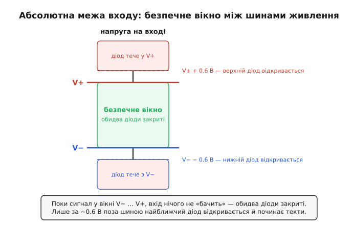
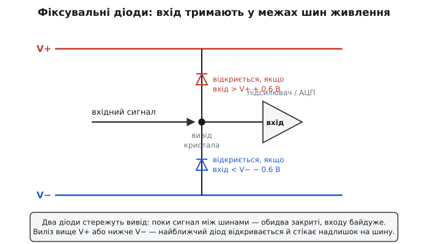
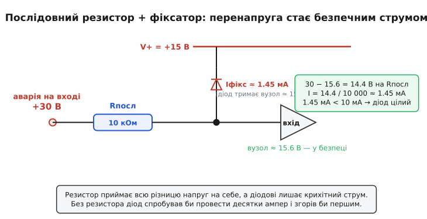
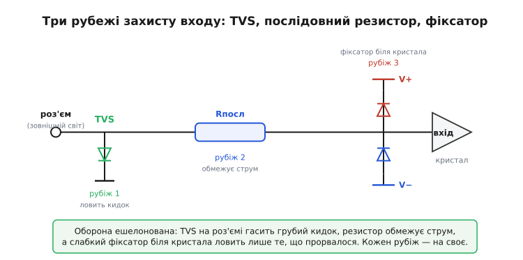

# Захист аналогового входу: чому крихітний вивід виживає, коли в нього б'є зовнішній світ

Вхід підсилювача чи АЦП — це найтонше місце всього приладу. Усередині за ним стоїть транзистор із затвором завтовшки в кілька десятків атомів окису, розрахований на сигнали в кілька вольтів. А ззовні до того виводу тягнеться дріт, що йде в реальний світ: до давача за кілька метрів кабелю, до роз'єму, якого торкається палець, до клеми, куди хтось колись приєднає не той блок живлення. Світ за роз'ємом не знає й не хоче знати, що там усередині — і час від часу подає на цей ніжний вивід те, чого той ніяк не очікував: статичний розряд із пальця, кидок при ввімкненні, проста людська помилка з полярністю. Питання захисту входу — це питання, **як зробити, щоб ніжний кристал пережив грубість зовнішнього світу**.

Захист аналогового входу — це набір прийомів, які **не пускають на вивід кристала напругу й струм, більші за ті, що він витримує**, відводячи надлишок убік раніше, ніж той дістанеться до вразливого транзистора. Не «зробити вхід міцнішим» — кристал змінити не можна, — а **поставити перед ним вартових**, які приймуть удар на себе. Уся справа стоїть на одному простому спостереженні: транзистор на вході гине не від напруги взагалі, а від напруги **поза вузькими межами**, у яких його зроблено працювати. Тримай сигнал у цих межах — і вхід цілий, хоч би що творилося на дроті.

> 🔧 **Навіщо це.** Без захисту входу прилад живе рівно до першого необережного дотику. Промисловий вимірювач, у який заводять сигнал із цеху; плата, що стирчить роз'ємом назовні; будь-що, до чого тягнеться рука людини або довгий кабель, — усе це гине без вартових на вході. Інженер, який спроєктував бездоганний підсилювач, але забув про захист входу, отримає партію приладів, що мруть у полі від статики й переплутаних дротів. Захист входу — це різниця між «працює на столі» і «працює там, куди його привезли».

## Перше: з чим саме б'ється вхід

Перш ніж ставити вартових, треба знати ворога. Чотири різні напасті чигають на вхідний вивід, і кожна вимагає свого вартового — змішувати їх не можна.

**Перенапруга** (англ. *overvoltage*) — найпростіша й найчастіша. На вхід приходить напруга **вища за дозволену**: переплутали полярність живлення, давач видав на виході більше, ніж очікувалось, на клему сів сигнал не того рівня. Сигнал лізе вище додатної шини або нижче від'ємної — і транзистор, зроблений працювати **між** шинами, опиняється під напругою, на яку не розрахований.

**Статичний розряд** (англ. *electrostatic discharge*, ESD) — найпідступніший, бо невидимий. Людина, пройшовшись синтетичним килимом, накопичує на собі **кілька кіловольтів**; торкнувшись роз'єму, вона за частку наносекунди зливає цей заряд у вивід. Напруга колосальна, але енергії мало й триває все мізерну мить — проте цієї миті досить, щоб пробити тонкий окис затвора наскрізь. Розряд із пальця має фронт **менш як наносекунду** і вкладає майже всю енергію в перші десятки наносекунд — тому вартовий проти ESD мусить бути **дуже швидким**.

**Кидок при ввімкненні** (англ. *inrush*, *power-up transient*) — коли в системі вмикається живлення, напруги на різних вузлах злітають не одночасно, і на вході може на мить опинитися напруга, якої в усталеному режимі не буває. Сюди ж — комутаційні викиди від реле й двигунів поряд, наведені в кабель.

**Зворотна напруга й перевантаження струмом** — окремий випадок перенапруги, коли джерело здатне ще й **влити струм**: не просто підняти напругу на вході, а й прокачати крізь нього амперами. Тут мало відвести напругу — треба ще й обмежити струм, бо саме струм палить.

Спільна нитка в усіх чотирьох одна: десь поза вузьким діапазоном, у якому вхід зроблено працювати, з'являється напруга — і якщо їй дати дістатися кристала, вона його вб'є. Тому весь захист зводиться до двох дій: **не пустити напругу за межі** і **не пустити струм понад дозволений**. Розгляньмо спершу, звідки беруться ці межі.

## Звідки межі: абсолютна гранична напруга

У даташиті будь-якої аналогової мікросхеми є розділ, який читають **першим**, хоч надрукований він дрібним, — «абсолютні граничні параметри» (англ. *absolute maximum ratings*). Це не робочі значення, а **межа виживання**: напруги й струми, перевищення яких пристрій уже **псує**, нехай навіть не одразу. І найважливіший рядок там — допустима напруга на вході.

Майже завжди вона записана дивною на перший погляд формулою: вхідна напруга не має виходити за межі **(V− − 0.5 В) … (V+ + 0.5 В)**. Тобто вхід вільно ходить між шинами живлення й трошки за них — рівно на пів вольта. Чому така межа й чому саме пів вольта? Бо всередині майже кожного аналогового кристала вивід уже захищений — і захищений саме **діодами на шини живлення**. Поки сигнал між шинами, ці діоди закриті й їх ніби немає. Щойно сигнал лізе вище V+ (або нижче V−) приблизно на пів вольта — діод відкривається. Цей пів вольта в даташиті — і є натяк, що всередині сидять діоди й що з ними слід рахуватися.

> 🔧 **Навіщо це.** Рядок «absolute maximum» — це контракт із виробником: тримай вхід у цих межах, і кристал житиме; вийди за них — і гарантій більше немає. Він не каже «тут пристрій працює добре» (для цього є інший рядок, «робочий діапазон»). Він каже «за цією рискою я починаю вмирати». Весь захист входу — це інженерна обіцянка ніколи не дати сигналу на виводі переступити цю риску, хоч би що подавав зовнішній світ.


*Поки напруга на вході в зеленому вікні між V− і V+, обидва внутрішні діоди закриті — вхід їх «не бачить». Лише за ~0.6 В поза шиною найближчий діод відкривається й починає текти струм. Абсолютна межа з даташита проводить риску трохи далі за це вікно.*

## Перший вартовий: фіксувальні діоди на шини

Найприродніший спосіб не пустити напругу за межі вже придумали — і вбудували в самі мікросхеми. Ідея проста до краси. Поставимо від вхідного виводу **два діоди**: один — катодом до додатної шини V+, другий — анодом до від'ємної шини V−. Тепер прослідкуймо, що вони роблять.

Поки сигнал на вході десь **між** шинами — а так і має бути в нормальній роботі, — обидва діоди під зворотною напругою й **закриті**. Вони ніби відсутні: входу до них байдуже, сигнал тече собі в підсилювач. Та щойно напруга на виводі полізла **вище** V+ приблизно на 0.6 В (пряме падіння діода), верхній діод **відкривається** — і починає стікати надлишок струму просто в шину V+. Вузол ніби «пришпилюється» до V+: вище за шину плюс пів вольта він піднятися вже не може, бо весь зайвий струм іде в діод. Так само знизу: полізла напруга нижче V− — відкривається нижній діод і **підтягує** вузол із шини V−, не даючи провалитися глибше. Тому ці діоди й звуть **фіксувальними** (англ. *clamp* — затиск, *clamping diodes*): вони **затискають** напругу на виводі в коридорі «трохи ширшому за шини».


*Поки сигнал між шинами, обидва діоди закриті й входу байдуже. Виліз вище V+ — верхній діод відкривається й стікає надлишок у плюсову шину; провалився нижче V− — нижній підтягує вузол із мінусової. Напруга на виводі фізично не може вийти за коридор «шина ± 0.6 В».*

Тут криється тонкість, яку легко проґавити: ці діоди стоять у кристалі **не випадково й часто не навмисно**. Сама технологія виготовлення мікросхеми створює на кожному виводі паразитні p-n переходи на підкладку — і вони працюють як готові фіксувальні діоди, хочемо ми того чи ні. Виробник це знає й часто **доповнює** їх спеціальними діодами захисту від статики. Тому майже в кожної аналогової мікросхеми вхід **уже захищений** від помірної перенапруги — самим фактом, що він зроблений із кремнію. Залишається одне питання, і воно вирішальне.

## Чому самих діодів мало: вони горять від струму

Діод чудово тримає **напругу** — пришпилює вузол до шини, і вище не пустить. Але прийміть до уваги, **скільки струму** при цьому крізь нього тече. Уявімо, що на вхід через помилку сіли +30 В, а шина V+ = +15 В. Верхній діод відкрився й пришпилив вузол до ~15.6 В. Чудово, напруга в межах. Але куди дівається різниця **30 − 15.6 = 14.4 В**? Вона падає на тому, що стоїть **перед** діодом. А якщо перед діодом нічого немає — лише дріт із мізерним опором, — то за законом Ома крізь діод піде струм, обмежений лиш опором дроту й джерела: десятки **ампер**. Тонкий внутрішній діод, зроблений на струм у кілька міліампер, згорить миттєво — і вузол лишиться без захисту.

Ось у чому суть: внутрішні фіксувальні діоди витримують **дуже малий струм**. У даташитах це записано як абсолютна гранична межа вхідного струму — типово **±10 мА** (а коли в даташиті її немає, інженери беруть за правило не перевищувати **5 мА**). Цей рядок — теж натяк: якщо допустимий вхідний струм виміряний кількома міліамперами, значить, усередині сидять діоди, і їх легко спалити. Діод сам по собі скаже «напрузі — стоп», але не скаже «струму — стоп». А палить саме струм.

> 🔧 **Навіщо це.** Це найголовніша й найменш очевидна думка всього захисту входу: **діод обмежує напругу, але не обмежує струм** — струм мусить обмежити щось інше. Інженер-початківець бачить «на вході є захисні діоди» й заспокоюється. Дарма. Якщо джерело здатне влити струм, голі діоди не врятують — вони згорять першими, бо весь струм піде крізь них. Захист входу майже ніколи не зводиться до самих діодів; майже завжди поряд мусить стояти той, хто **тримає струм**.

## Другий вартовий: послідовний резистор

Якщо діод не обмежує струм, поставмо перед ним того, хто обмежить. Найпростіший такий — **резистор у розрив дроту**, послідовно з входом. Подивімося, що змінюється.

Резистор за законом Ома перетворює **різницю напруг** на **струм**: яка напруга на ньому впала, такий струм крізь нього й тече. Поставимо перед фіксатором послідовний резистор Rпосл і повернімося до нашої аварії: на вхід сіли +30 В, шина +15 В, діод пришпилив вузол до ~15.6 В. Тепер різниця 30 − 15.6 = 14.4 В падає **на резисторі**, а не женеться крізь діод нестримно. Струм виходить керований:

```
Iфікс = (Uаварія − Uфікс) / Rпосл
Iфікс = (30 − 15.6) / 10 000 = 14.4 / 10 000 ≈ 1.45 мА
```

Півтора міліампера — діод і не помітить (його межа 10 мА). Резистор узяв увесь удар напруги на себе й лишив діодові тільки безпечну цівку струму. Ось і весь прийом: **послідовний резистор обмежує струм, фіксувальний діод обмежує напругу** — удвох вони закривають обидві дірки, яких поодинці не закрити.


*Резистор приймає всю різницю напруг на себе (14.4 В), а діодові лишає крихітний струм (≈ 1.45 мА), що той легко витримує. Без резистора діод спробував би провести десятки ампер і згорів би першим. Вузол лишається пришпиленим до ≈ 15.6 В — у безпеці.*

Розмір резистора — компроміс, і компроміс повчальний. Чим резистор **більший**, тим менший аварійний струм і надійніший захист. Та водночас цей самий резистор стоїть **послідовно з корисним сигналом** — і в нормальній роботі він не зникає. Якщо вхід підсилювача споживає хоч трохи струму (вхідний струм зміщення), резистор створить на ньому **похибку напруги**: U = I·R, і чим R більший, тим більша похибка. А ще резистор разом із вхідною ємністю кристала утворює [фільтр низьких частот](topic:electronics/rc-low-pass), що **завалює** швидкі сигнали: завеликий R — і вхід перестане встигати за швидкою формою. Тому Rпосл беруть **рівно стільки, щоб обмежити аварійний струм до безпечного**, і ні ома більше. Для входу з межею 10 мА і можливою аварією до 30 В понад шину досить кількох кілоомів — вони обмежать струм і майже не зіпсують сигнал.

> 🔧 **Навіщо це.** Послідовний резистор — найдешевший і найнадійніший вартовий входу: одна копійчана деталь, що рятує кристал від спаленого діода. Та його не можна ставити «з запасом побільше»: він псує точність і швидкість. Уся майстерність — у виборі величини: достатньо великий, щоб удержати аварійний струм, достатньо малий, щоб не зіпсувати вимір. Цей баланс — типова інженерна задача, де надмірна обережність шкодить не менше за недбалість.

## Чому аналоговий вхід вимагає особливої обачності

У цифрового входу теж є фіксувальні діоди й та сама межа струму — то чим аналоговий особливий? Двома речами, і обидві варто розуміти.

Перша: аналоговий вхід **мусить лишатися точним**. Цифрі байдуже, чи на вході 3.2 В, чи 3.4 В — однаково «одиниця». Аналоговому входу не байдуже: кожен зайвий міліампер витоку крізь привідкритий захисний діод, кожен зайвий ом послідовного резистора **спотворює вимір**. Тому захист аналогового входу не може бути грубим — він мусить стерегти кристал, **не псуючи сигнал**. Звідси вічний компроміс: міцніший захист — гірша точність, і навпаки. Та сама причина, чому в прецизійних входах фіксатори роблять із діодів **з малим витоком**, а не беруть перший-ліпший.

Друга, тонша й небезпечніша: коли крізь внутрішній діод входу тече надмірний струм, у кристалі прокидається паразитна структура — **тиристор-засувка** (англ. *latch-up*). У будь-якій КМОН-мікросхемі поряд лежать переходи, що утворюють паразитний чотиришаровий p-n-p-n прилад — по суті **тиристор** (SCR). У нормі він спить. Але влий у вивід достатній струм крізь захисний діод — і цей паразитний тиристор може **ввімкнутися**, замкнувши живлення накоротко просто всередині кристала. Мікросхема перетворюється на коротке замикання й **згорає від власного струму живлення**, навіть коли зовнішня перенапруга вже зникла. Це найпідступніший спосіб убити вхід: не сама перенапруга вбиває, а тиристор, який вона **розбудила**.

> 🔧 **Навіщо це.** Засувка пояснює, чому межу вхідного струму треба шанувати **свято**, а не «приблизно». Можна подумати: «діод витримає 10 мА, а я дам 15 — нічого, він міцний». Можливо, діод і витримає. Але 15 мА можуть розбудити паразитний тиристор — і кристал згорить не від діода, а зсередини, від короткого по живленню. Тому послідовний резистор тут не «про всяк випадок», а **обов'язковий вартовий**: він тримає струм нижче порога, за яким прокидається засувка. У промисловому вході, куди заводять сигнали з довгих кабелів, нехтувати цим — значить мати партію приладів, що тихо мруть у полі.

## Третій вартовий: TVS проти швидких кидків

Резистор із діодами чудово тримають **повільну** перенапругу — переплутану полярність, завищений сигнал. Та проти статичного розряду їх замало: ESD б'є **кіловольтами** за **частку наносекунди**, і доки сигнал дійде крізь резистор до внутрішнього діода, фронт удару вже встигне пробити кристал. Проти таких блискавичних кидків ставлять окремого вартового — **обмежувальний діод** (англ. *transient voltage suppressor*, TVS).

TVS — це діод, зроблений саме для удару: великий, здатний на коротку мить пропустити крізь себе **десятки ампер**, із дуже швидкою реакцією. Його ставлять **паралельно** входу, від дроту на землю (або між шинами), якомога ближче до роз'єму — туди, де кидок заходить. У нормі TVS закритий і не заважає. Та щойно на дроті стрибає напруга вище його порога — TVS відкривається за **частки наносекунди** й **відводить весь струм кидка на землю**, не пускаючи його далі в плату. Кидок гасне на TVS, а до ніжного кристала доходить лише обрізана, безпечна верхівка.

Тонкість TVS — у виборі його **робочої** напруги проти **фіксувальної**. Робоча (англ. *working voltage*) — це напруга, до якої TVS ще спокійно закритий; вона має бути **вище** за найбільший нормальний сигнал, інакше TVS відкриватиметься в робочому режимі й спотворюватиме вимір. Фіксувальна (англ. *clamping voltage*) — це напруга, до якої TVS пришпилює вузол під час удару; вона має бути **нижче** за те, що витримує кристал, інакше захист спізниться. Класична пастка: узяти TVS із зависоким порогом — тоді під час удару кристал **пробивається раніше**, ніж TVS устигне відкритися, і захисту наче й немає. Тому TVS добирають так, щоб його фіксувальна напруга з певним запасом сиділа **нижче** абсолютної межі входу.

Усе це разом дає звичну для надійного входу картину — **ешелоновану оборону** в три рубежі.


*Оборона ешелонована: TVS на роз'ємі гасить грубий швидкий кидок, послідовний резистор обмежує струм, а слабкий внутрішній фіксатор біля кристала ловить лише те, що прорвалося крізь перші два рубежі. Кожен вартовий — на свою напасть; разом вони закривають усе.*

Логіка трьох рубежів струнка. **TVS на роз'ємі** першим зустрічає грубий кидок ззовні й бере на себе більшу частину енергії — на нього розраховують саме як на жертовний щит. **Послідовний резистор** за ним обмежує те, що лишилось, перетворюючи рештки перенапруги на безпечний струм. **Внутрішній фіксатор біля кристала** ловить лише дрібну верхівку, що прослизнула крізь перші два, — і йому цього вистачає, бо основне вже зрізане. Так слабкий вартовий усередині не лишається сам проти всього світу: перед ним стоять міцніші. Окремий узагальнений клас цих жертовних деталей — обмежувальні діоди й діодні збірки для входів — розібрано як [компонент захисту входу](topic:electronics/input-protection-analog/comp-input-clamp-array.md): який спад, яку енергію тримає, як його добирати під робочу й фіксувальну напругу.

## Скільки це в числах

Абстракція стає відчутною, щойно порахувати конкретний резистор. Це найчастіший розрахунок захисту входу — і він короткий.

**Резистор для захисту входу АЦП від +30 В.** Вхід мікросхеми живиться від +15 В, його абсолютна межа вхідного струму 10 мА, а в аварії на вхід можуть сісти +30 В. Який послідовний резистор гарантує, що внутрішній фіксувальний діод не перевищить межі?

:::tabs
```cpp
// Мінімальний послідовний резистор, щоб струм фіксатора не перевищив межі
constexpr double Vfault = 30.0;     // найгірша аварійна напруга на вході, В
constexpr double Vrail  = 15.0;     // напруга шини, до якої пришпилює діод, В
constexpr double Vf     = 0.6;      // пряме падіння фіксувального діода, В
constexpr double Imax   = 10.0e-3;  // абсолютна межа вхідного струму, А

constexpr double Vclamp = Vrail + Vf;                 // вузол пришпилений до 15.6 В
constexpr double Rmin   = (Vfault - Vclamp) / Imax;   // (30 - 15.6) / 0.01 = 1440 Ом
```
```c
// Мінімальний послідовний резистор, щоб струм фіксатора не перевищив межі
float Vfault = 30.0f;     // найгірша аварійна напруга на вході, В
float Vrail  = 15.0f;     // напруга шини, до якої пришпилює діод, В
float Vf     = 0.6f;      // пряме падіння фіксувального діода, В
float Imax   = 10.0e-3f;  // абсолютна межа вхідного струму, А

float Vclamp = Vrail + Vf;                 // вузол пришпилений до 15.6 В
float Rmin   = (Vfault - Vclamp) / Imax;   // (30 - 15.6) / 0.01 = 1440 Ом
```
:::

Виходить **1440 Ом** як абсолютний мінімум. На практиці беруть із запасом — скажімо, 10 кОм: тоді при тих самих +30 В струм фіксатора лише 1.45 мА, удесятеро нижче межі, і є запас на ще гіршу аварію. Запас тут не примха: аварійна напруга буває й вища за очікувану, а діод не любить ходити по самому краю.

А тепер протилежний бік компромісу — про що різко нагадає точність:

**Похибка від послідовного резистора.** Той самий вхід має вхідний струм зміщення 1 нА (типово для входу з польовим транзистором). Яку похибку напруги внесе наш захисний резистор 10 кОм у нормальній роботі?

:::tabs
```cpp
// Похибка зміщення, яку послідовний резистор додає до виміру
constexpr double Rseries = 10.0e3;   // захисний резистор, Ом
constexpr double Ibias   = 1.0e-9;   // вхідний струм зміщення, А

constexpr double Verr = Ibias * Rseries;   // 1e-9 * 10e3 = 1e-5 В = 10 мкВ
```
```c
// Похибка зміщення, яку послідовний резистор додає до виміру
float Rseries = 10.0e3f;   // захисний резистор, Ом
float Ibias   = 1.0e-9f;   // вхідний струм зміщення, А

float Verr = Ibias * Rseries;   // 1e-9 * 10e3 = 1e-5 В = 10 мкВ
```
:::

Десять мікровольтів похибки — для більшості входів дрібниця, але в прецизійному вимірі вже відчутно. Звідси й видно живий компроміс: 10 кОм дають чудовий захист (струм аварії вдесятеро нижче межі) ціною 10 мкВ похибки. Хочеш менше похибки — менший резистор, але слабший захист; хочеш міцніший захист — більший резистор, але гірша точність. Інженер крутить саме цю ручку, добираючи її під те, що для конкретного входу болючіше — пробій чи похибка.

## Що варто винести

Захист аналогового входу стоїть на одній простій думці: ніжний транзистор на вході гине не від напруги взагалі, а від напруги **поза вузькими межами**, у яких його зроблено працювати, — тож весь захист зводиться до того, щоб **не пустити сигнал за ці межі**. Межі задає рядок «absolute maximum» у даташиті: вхід вільний між шинами живлення й трохи за них, а формула «±0.5 В за шину» сама виказує, що всередині сидять фіксувальні діоди на V+ і V−. Ці діоди пришпилюють напругу до коридору «шина ± 0.6 В» — але тримають лише **напругу**, не струм, і згорають від кількох зайвих міліампер. Тому поряд із ними мусить стояти той, хто **тримає струм**: послідовний резистор, що за законом Ома приймає всю різницю напруг на себе й лишає діодові безпечну цівку. Удвох вони закривають обидві дірки — напругу й струм, — яких поодинці не закрити. Аналоговий вхід вимагає тут особливої обачності з двох причин: захист не сміє псувати точність (звідси компроміс величини резистора), і надмірний струм крізь діод може розбудити паразитний тиристор-засувку, що спалить кристал зсередини. Проти швидких кидків — статики й комутаційних викидів — ставлять окремого, жертовного вартового, TVS, паралельно входу й ближче до роз'єму, добираючи його робочу напругу вище сигналу, а фіксувальну — нижче межі кристала. Разом ці троє дають ешелоновану оборону: TVS гасить грубий кидок, резистор обмежує струм, внутрішній фіксатор ловить дрібну верхівку. Хто розуміє, що діод стереже напругу, а резистор — струм, і чому межу струму треба шанувати свято, той будує входи, які виживають там, куди прилад привезли, а не лише на лабораторному столі.
