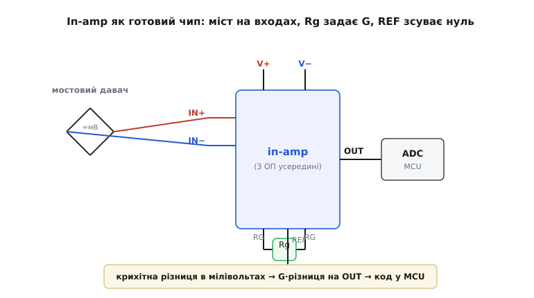

# 🔌 Інструментальний підсилювач на платі: чип, ноги, прошивка

> Компонентна вставка про [інструментальний підсилювач](book:electronics/instrumentation-amp) — погляд **з боку плати**: in-amp як готовий чип, його ноги, як до нього під'єднати мостовий давач, скільки треба CMRR для конкретного АЦП і як перевести код АЦП у фізичну величину в прошивці. Як саме така схема ріже синфазну заваду і звідки беруться формули підсилення та CMRR, виводить сусідня 🧮-вставка [«Чому саме три ОП»](book:electronics/instrumentation-amp/math-inamp-cmrr.md).

### Що це за пристрій

**Інструментальний підсилювач** (*instrumentation amplifier*, in-amp) — це не один операційний підсилювач, а готовий **диференційний** вузол: підсилює лише **різницю** двох входів і майже не реагує на спільний для них рівень. Усередині — три ОП і п'ять точних резисторів, підігнаних ще на заводі. Зовні ж це звичайна 8-вивідна мікросхема, у якій підсилення задається **одним** зовнішнім резистором Rg.

### Розпіновка й підключення

Подивімося, які ноги цей чип виставляє назовні й що до кожної підключають.


*Типове ввімкнення in-amp. Мостовий давач (тензоміст або RTD) дає крихітну різницю в мілівольтах на тлі великого спільного рівня; вона заходить на IN+/IN−. Один зовнішній Rg між двома виводами RG задає підсилення G. Живлення +V/−V, вивід REF підпирає «нуль» виходу під вхід ADC, а OUT іде на АЦП мікроконтролера.*

Вісім ніг типового in-amp розподілені просто:

- **IN+ / IN−** (*inputs*) — два диференційні входи; різницю між ними й підсилюємо.
- **RG · RG** (*gain set*) — два виводи під **зовнішній** резистор Rg; його опір задає підсилення (звідси й одна «ручка» G).
- **OUT** (*output*) — вихід.
- **REF** (*reference*) — опорна нога: вихід відлічується **від неї**, а не від землі.
- **V+ / V−** (*supply*) — живлення (двополярне ±, або однополярне з «віртуальною землею» на REF).

### Перший байт: як зняти показ

Послідовність «оживлення» завжди однакова. Подаємо живлення на V+/V− і коротко — на сам міст. Ставимо Rg під потрібне підсилення (його значення дає [формула з даташита](book:electronics/instrumentation-amp/math-inamp-cmrr.md)). Вхід REF саджаємо туди, де має бути **нуль** виходу: на землю при двополярному живленні або на половину опорної напруги АЦП при однополярному — тоді сигнал обох знаків влізе в діапазон АЦП. Виходить **аналоговий** ланцюг: ніякого «байта» по шині немає — «перший показ» знімає АЦП мікроконтролера, читаючи напругу на OUT. Здоровий стан перевіряють так: замкнули обидва входи разом — OUT має сісти рівно на рівень REF; розбалансували міст на дрібну величину — OUT має зрушити на цю величину, помножену на G.

> 🔧 **Навіщо це.** In-amp — стандартний «передпідсилювач» між давачем і АЦП там, де корисний сигнал мікроскопічний, а навколо — шум: [тензоваги](book:electronics/load-cell), RTD-термометри, [шунтові давачі струму](book:electronics/current-monitor), ЕКГ-електроди. Без нього мілівольти моста просто потонули б у [синфазній заваді](book:electronics/instrumentation-amp).

### Скільки CMRR треба під конкретний АЦП

Високий CMRR — не самоціль, його кількість диктує **роздільність АЦП**. Логіка проста: просочка п'єдесталу на вихід не повинна перевищувати молодший біт (LSB) перетворювача, інакше завада з'їдає реальну точність. Порахуймо для тих самих тензоваг: in-amp із G = 400, синфазний рівень на входах 2.5 В, АЦП 12-бітний зі шкалою 5 В.

```formula
Молодший біт АЦП (на виході):
    LSB = V_шкали / 2^N = 5 В / 4096 ≈ 1.22 мВ

Той самий LSB, зведений до входу in-amp:
    LSB_вх = 1.22 мВ / G = 1.22 мВ / 400 ≈ 3.05 мкВ

П'єдестал на вході = 2.5 В; щоб його просочка була < LSB_вх:
    CMRR ≥ 2.5 В / 3.05 мкВ ≈ 820 000   →   20·log₁₀(820000) ≈ 118 дБ
```

Виходить близько **118 дБ** — рівень, який трисхемна топологія дає природно, а простий віднімач (≈ 54 дБ) і близько не тягне. Це і є практична причина брати in-amp: щоб спільні 2.5 В не зіпсували навіть молодшого біта 12-бітного перетворювача.

### Окремі ОП проти готового чипа

Усі три ОП можна спаяти й самому — постає закономірне питання, навіщо тоді платити за окрему мікросхему. Відповідь видно, щойно порівняти обидва варіанти поруч.


*Чому платять за чип. Зібраний уручну in-amp вимагає трьох ОП і п'яти **підігнаних** резисторів; точність придушення синфазної завади (CMRR) дорівнює тому, наскільки точно ці резистори збіглися. На звичайних 0.1%-резисторах CMRR виходить лише ~60–66 дБ. У мікросхемі резистори підрізані лазером прямо на кристалі, тож CMRR ~90–130 дБ дається «з коробки» — лишається поставити один Rg.*

Головна причина брати готовий in-amp, а не три ОП — це **узгодженість резисторів**. Придушення синфазної завади тримається на тому, що пари резисторів у різницевому каскаді ідеально рівні; будь-який розбаланс «протікає» синфазним сигналом на вихід. Зібрати таку рівність із дискретних 0.1%-резисторів важко, а температурний дрейф ще її псує. На кристалі ж резистори лежать поруч, дрейфують **разом** і підрізані лазером — звідси CMRR на десятки децибел кращий, ніж у саморобки, при одній зовнішній деталі.

### Прошивка: від коду АЦП до фізичної величини

Сам по собі in-amp дає лише напругу на OUT — переводить її у вагу вже прошивка. Ось як могло б виглядати читання тих самих тензоваг: АЦП мікроконтролера 12 біт, опорна 5.000 В, in-amp із G = 400.

:::tabs
```cpp
// Тензоваги: in-amp із G = 400, АЦП 12 біт, опорна 5.000 В.
// Чутливість моста 2 мВ/В при 5 В живлення → повна шкала = 4.000 В на виході.
constexpr float kAdcRefV   = 5.0f;
constexpr float kAdcMax    = 4095.0f;
constexpr float kInampGain = 400.0f;
constexpr float kBridgeFsV = 0.010f;   // 10 мВ диференційного при повній шкалі
constexpr float kScaleFsKg = 20.0f;    // повна шкала терезів, кг

constexpr float weight_kg(std::uint16_t adc_code)
{
    const float v_out  = (adc_code / kAdcMax) * kAdcRefV;  // напруга на виході in-amp
    const float v_diff = v_out / kInampGain;               // зведено до входу (диф.)
    const float frac   = v_diff / kBridgeFsV;              // частка повної шкали
    return frac * kScaleFsKg;                              // вага
}
```
```c
// Тензоваги: in-amp із G = 400, АЦП 12 біт, опорна 5.000 В.
// Чутливість моста 2 мВ/В при 5 В живлення → повна шкала = 4.000 В на виході.
#define ADC_REF_V     5.0f
#define ADC_MAX       4095.0f
#define INAMP_GAIN    400.0f
#define BRIDGE_FS_V   0.010f     // 10 мВ диференційного при повній шкалі
#define SCALE_FS_KG   20.0f      // повна шкала терезів, кг

float weight_kg(uint16_t adc_code)
{
    float v_out  = (adc_code / ADC_MAX) * ADC_REF_V;   // напруга на виході in-amp
    float v_diff = v_out / INAMP_GAIN;                  // зведено до входу (диф.)
    float frac   = v_diff / BRIDGE_FS_V;               // частка повної шкали
    return frac * SCALE_FS_KG;                          // вага
}
```
:::

Тут видно роль кожного числа: підсилення G повертає виміряну на виході напругу до справжніх мілівольтів давача, а чутливість моста переводить мілівольти у фізичну величину. Якщо змінити Rg (а отже G), у коді міняється одна стала INAMP_GAIN — решта тракту лишається тією самою.

### Типові граблі

- **Забули REF — поплив нуль.** Нога REF мусить бути на твердому низькоомному потенціалі. Підвісили її чи завели через дільник із великим опором — нуль виходу «гуляє», і весь CMRR псується.
- **Немає шляху для вхідних струмів зміщення.** Якщо обидва входи бачать давач лише через високий опір, крихітний струм зміщення нікуди стікати — вихід тихо впирається в шину. Завжди потрібен шлях постійного струму на «землю» входів.
- **Rg занадто малий.** Дуже велике підсилення множить і власний дрейф нуля in-amp, тож вихід може зашкалити ще до сигналу. Часто частину підсилення лишають уже після АЦП.
- **Зміщення нуля множиться на G.** Власний вхідний зсув ОП виходить помноженим на підсилення разом із сигналом; для слабких давачів бери чип із малим зсувом або передбач калібрування нуля в прошивці.
- **Вийшли за діапазон живлення.** Спільний рівень входів і розмах виходу мусять лишатися всередині V+/V− (у «rail-to-rail» — близько до них, але не за ними). Для шунта high-side, де синфазне дорівнює повній напрузі шини, окремо перевіряй дозволений діапазон входу.

### Варіації класу

Класична схема на трьох ОП — не єдина: під одну назву «in-amp» збирають кілька різновидів. Бувають **триоповий** in-amp (та сама класика) і компактніший **двооповий** — дешевший, але з гіршим CMRR на високих частотах. Окремий підклас — **цифрові** (programmable-gain) in-amp, де G перемикають не резистором, а командою по шині. А коли треба ще й гальванічна розв'язка (медицина, висока напруга), беруть **ізольований** in-amp, де вхід і вихід живляться окремо й сигнал переходить бар'єр без спільної землі.
