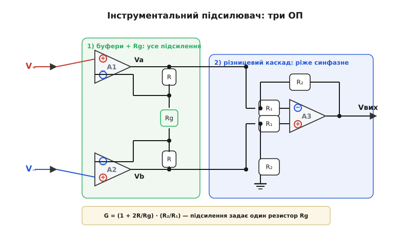
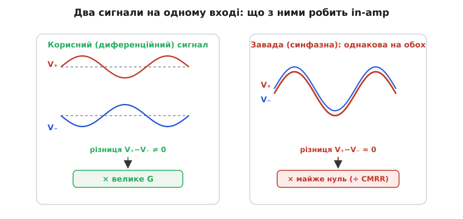

# 🧮 Чому саме три ОП: підсилення інструментального підсилювача й CMRR

> Задача [інструментального підсилювача](topic:electronics/instrumentation-amp) словами проста: треба піймати кілька мілівольтів корисного сигналу, що сидять на кількох вольтах однакової для обох дротів завади. Тут — **числа**: звідки береться формула підсилення з одним резистором Rg, що таке CMRR кількісно, і чому одного різницевого підсилювача мало, а три ОП — у самий раз.

### Означення: дві напруги, два підсилення

У будь-якого підсилювача з двома входами сигнал розкладається на дві частини. **Диференційна** (*differential*) — це **різниця** входів, корисне: V_д = V₊ − V₋. **Синфазна** (*common-mode*) — це їхнє **спільне** значення, найчастіше завада: V_с = (V₊ + V₋)/2. Реальний підсилювач підсилює обидві, кожну зі своїм коефіцієнтом: вихід = A_д·V_д + A_с·V_с. Мрія — підсилити лише різницю (A_д велике) і викинути спільне (A_с → 0).

**Коефіцієнт ослаблення синфазного сигналу** (*common-mode rejection ratio*, **CMRR**) — це відношення двох підсилень, тобто наскільки сильніше схема реагує на різницю, ніж на спільне:

```
CMRR = A_д / A_с        (у разах)
CMRR(дБ) = 20·log₁₀(A_д / A_с)
```

Запис у [децибелах](topic:electronics/decibels) стискає величезний діапазон у зручні числа. Що більший CMRR, то чистіше різниця відділена від завади:

```
   60 дБ  →  у 1 000 разів
   80 дБ  →  у 10 000 разів
  100 дБ  →  у 100 000 разів
  120 дБ  →  у 1 000 000 разів
```

Коефіцієнт перед логарифмом тут саме **20**, а не 10, бо CMRR — це відношення двох **амплітуд** напруги (підсилень), а не потужностей; для амплітуд децибел означається як 20·log₁₀. Звідси й зручне правило: кожні +20 дБ — це рівно десятикратне ослаблення завади, тож різниця між пристроєм на 80 і на 100 дБ не «на чверть краще», а **вдесятеро** чистіше відкинута синфазна напруга. Саме тому за кожні 20 дБ і воюють: лінійно невелика на вигляд цифра ховає за собою порядок величини. Ця ж логарифмічна шкала пояснює, чому корисно тримати в голові кілька опорних точок (60, 100, 120 дБ) — за ними миттєво читається, у скільки разів пригнічено спільне, без щоразового піднесення десятки до степеня.

### Інтуїція: чому простий різницевий підсилювач не тягне

Найпростіший «віднімач» — один ОП із чотирма резисторами, [різницевий підсилювач](topic:electronics/summing-difference-amp), — у теорії має A_с = 0. Але рівно нуль виходить, **лише якщо чотири резистори ідеально узгоджені**. У житті вони з допуском, і саме розбіжність народжує паразитне A_с. Виведемо межу. Хай віднімач має диференційне підсилення A_д = R₂/R₁, а кожен із чотирьох резисторів лежить у межах ±t від номіналу (відносний допуск t). У найгіршому розкладі похибки чотирьох резисторів складаються, і гранична оцінка CMRR така:

```
CMRR ≈ (1 + A_д) / (4·t)
```

Звідки тут кожен доданок. Чисельник (1 + A_д) — це повний коефіцієнт передачі плеча віднімача (одиниця від прямого шляху плюс A_д від підсиленого); чим більше підсилення, тим менше відносно нього важить розбаланс. Знаменник 4·t — це сумарний внесок чотирьох резисторів, кожен з яких «гуляє» на ±t і тим відкриває синфазному сигналу шлях на вихід. Підставимо реальність: одиничне підсилення (A_д = 1) на дорогих резисторах 0.1 % (t = 0.001):

```
CMRR ≈ (1 + 1) / (4·0.001) = 500   →   20·log₁₀(500) ≈ 54 дБ
```

Лише **54 дБ** — і це за дорогих 0.1-відсоткових резисторів. До того ж вхід такого віднімача низькоомний (через R₁ навантажує джерело), а давач часто високоомний. Виходить дві біди заразом — поганий CMRR і низький вхідний опір, — і саме тому простий віднімач не тягне.

### Апарат: що додають перші два ОП

Обидві біди лікують **перші два** ОП, додані перед віднімачем. Сигнал спершу заходить на **два буфери** A1 і A2 прямо в неінвертуючі входи — вхідний опір одразу величезний, джерело не просідає. А між їхніми інвертуючими входами стоїть один-єдиний резистор **Rg**, обабіч якого — два однакові R зворотного зв'язку.


*Перший каскад (зелене) — два буфери, з'єднані ланцюгом R–Rg–R; він задає диференційне підсилення одним резистором Rg. Другий каскад (синє) — різницевий підсилювач на A3, що віднімає Va−Vb і ріже синфазну заваду. Загальне підсилення — добуток двох.*

Уся хитрість у тому, як ланцюг R–Rg–R бачить два типи сигналу. Завдяки властивості [від'ємного зворотного зв'язку](topic:electronics/negative-feedback) («віртуальне коротке») напруги на кінцях Rg повторюють входи V₊ і V₋, тож на Rg падає **різниця** V_д, і крізь нього (а отже й крізь обидва R) тече струм i = V_д/Rg. Цей струм піднімає виходи буферів на i·R кожен, тому диференційне підсилення першого каскаду:

```
A_д1 = (R + Rg + R) / Rg = 1 + 2R/Rg
```

А тепер ключове. Для **синфазного** сигналу обидва входи однакові, різниці на Rg немає, струм нульовий — буфери просто повторюють спільну напругу. Тобто **A_с1 = 1**: перший каскад підсилює різницю в (1 + 2R/Rg) разів, а заваду — в один раз. Перемноживши на CMRR другого каскаду, дістаємо виграш: CMRR_перший ≈ A_д1, і він **множить** ослаблення віднімача.

Повне підсилення — добуток каскадів (другий дає R₂/R₁):

```
G = (1 + 2R/Rg) · (R₂/R₁)
```

Підсилення задає **один резистор Rg** — змінив його, і змінилося все підсилення, причому симетрія двох R збереглася. У промислових мікросхемах (AD620-клас) це зашито формулою на кшталт G = 1 + 49.4 кОм/Rg.

### Чому це працює: число для CMRR

Складемо разом. Хай перший каскад дає A_д1 = 100, а віднімач — ті самі 54 дБ (тобто у 500 разів):

```
CMRR_сист ≈ A_д1 · CMRR_віднімача = 100 · 500 = 50 000
20·log₁₀(50 000) ≈ 94 дБ
```

Два вхідні ОП додали +20·log₁₀(100) = 40 дБ «згори» — і замість жалюгідних 54 дБ маємо **94 дБ**. Ось чому ОП саме три: два піднімають вхідний опір і додають CMRR-виграш, третій — віднімає й узгоджує. Жоден поодинці цього не дає.

Варто пам'ятати, що всі ці числа — для **постійного** й повільного сигналу. Реальний CMRR не сталий: він найвищий на нулі частоти й спадає, щойно частота завади росте. Винні дві речі — скінченне власне підсилення ОП, що падає з частотою, і паразитні ємності, через які синфазний сигнал просочується в обхід резисторів. Тому в даташитах CMRR подають не одним числом, а **кривою від частоти**: на постійному струмі може бути 120 дБ, а на мережевих 50 Гц уже, скажімо, 100, на кілогерцах — ще менше. Для практики це означає просту річ: коли завада, яку треба відкинути, — це саме мережеві 50 Гц, дивитися треба на CMRR **на цій частоті**, а не на красиву цифру з постійного струму.


*Ліворуч — корисний диференційний сигнал: дроти гойдаються протифазно, різниця V₊−V₋ ≠ 0, її підсилюють у G разів. Праворуч — синфазна завада: обидва дроти ходять разом, різниця ≈ 0, і її душить CMRR. In-amp розрізняє ці два сценарії апаратно.*

### На чому це тримається

Уся механіка тут — це [операційний підсилювач](topic:electronics/opamp) у дії: «віртуальне коротке» дало струм через Rg, [від'ємний зворотний зв'язок](topic:electronics/negative-feedback) тримає підсилення на резисторах, а різницевий каскад — це [суматор-віднімач](topic:electronics/summing-difference-amp). Логарифм у [децибелах](topic:electronics/decibels) перетворює відношення підсилень на зручні дБ. А практичний бік — давачі, що дають мілівольти на тлі вольтів (тензоміст, термопара), — це і є та сама задача, заради якої in-amp узагалі будують.

> 🔧 **Навіщо це.** Тримайте в голові два рядки: **G = (1 + 2R/Rg)·(R₂/R₁)** і **CMRR_сист ≈ (підсилення front-end)·(CMRR віднімача)**. Перший каже, що все підсилення крутиться одним резистором Rg. Другий — чому in-amp б'є простий віднімач: front-end не лише підсилює різницю, а ще й множить ослаблення завади. Тому для слабкого сигналу на тлі великої синфазної напруги беруть саме інструментальний підсилювач, а не один ОП.
