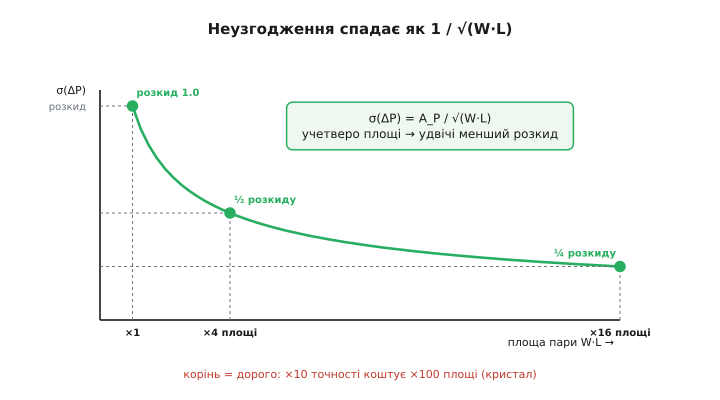
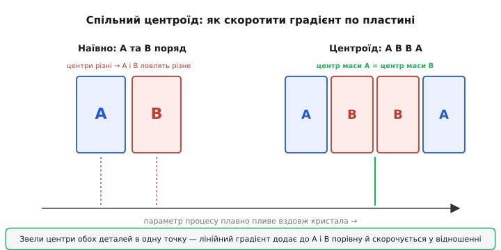

# 🧮 Математика узгодження сусідів

Той самий резистор на кристалі гуляє на ±20 % від запуску до запуску — а пара таких резисторів поряд тримає своє відношення з точністю до десятої частки відсотка. Різниця у двісті разів, і вона не випадкова й не «пощастило»: за нею стоїть проста математика, яку варто розписати до кінця. Бо саме з неї випливає весь стиль аналогового проєктування на кремнії — чому схему будують на пропорціях, а не на номіналах, і чому, коли узгодження все-таки замало, інженер просто **збільшує деталь** і знає наперед, у скільки разів стане краще.

Розберемо це від першопричини: спершу — звідки взагалі береться розкид; тоді — чому одна його частина пливе разом і скорочується у відношенні, а інша ні; тоді — закон, за яким ця друга частина спадає з площею; і нарешті — як перевести все це в число похибки для дільника, дзеркала й диференційної пари просто в коді.

## Звідки береться розкид: два різні джерела

Уявімо, що ми хочемо зробити резистор на 10 кОм. У кремнії резистор — це смужка слабко легованого матеріалу; його опір задають три речі: геометрія смужки (довжина й ширина рисунка), товщина легованого шару й концентрація домішки в ньому. Кожну з них процес відтворює лише **приблизно**.

Тут і ховається ключ. Усі ці «приблизно» поділяються на два сорти, геть різні за поведінкою.

**Перший сорт — спільне зміщення (систематика).** Піч цього запуску нагрілася на два градуси гарячіше, ніж минулого; струмінь домішки цього разу трохи густіший; шар наростив на відсоток товще. Усе це діє **на всю пластину разом** — на кожен резистор, кожен транзистор, що народжуються в цьому процесі. Це не «шум окремої деталі», а зсув цілої партії: усі деталі поїхали в один бік на приблизно однакову величину. Саме спільне зміщення й дає той жахливий абсолютний допуск ±20 % — від запуску до запуску значення плаває широко, бо плавають умови самого процесу.

**Другий сорт — випадкове неузгодження (англ. mismatch, неспівпадіння).** Навіть у межах однієї пластини, навіть для двох сусідніх деталей, є дрібні відмінності, які **нічому спільному не підкоряються**. Домішка входить у кремній не суцільним морем, а окремими атомами; у крихітному об'ємі під затвором їх злічена кількість — скажімо, кілька сотень, — і де їх випадково на десяток більше, а де на десяток менше. Край рисунка проявився світлом не ідеально рівним, а з мікроскопічними зубцями, і в кожної деталі вони свої. Це не зсуває партію — це робить **кожну окрему деталь трішки інакшою за сусідку**, причому в непередбачуваний бік. Ось це і є неузгодження: випадкова, локальна, своя-для-кожного відмінність.

> 🔧 **Навіщо це.** Розрізняти ці два сорти — не теорія заради теорії, а робочий інструмент. Систематику можна **скоротити геометрією** (поставити деталі поряд, так щоб спільне зміщення вийшло однаковим). Випадкове неузгодження геометрією не прибрати — його можна лише **придушити розміром** (зробити деталь більшою). Тобто два сорти розкиду лікуються двома різними ліками, і плутати їх — означає лікувати не те.

Тепер подивимось, що з цими двома сортами робить **відношення** двох сусідів — бо саме у відношенні й ховається вся магія.

## Чому відношення скорочує систематику

Візьмемо два резистори, R₁ і R₂, вирощені поряд на одному кристалі, тим самим процесом. Запишемо кожен як «ідеальне значення, помножене на спільний коефіцієнт зсуву партії». Скажімо, цього запуску шар вийшов на 8 % товщий, ніж задумано, — тоді обидва резистори стали меншими (товстіший провідний шар = менший опір) приблизно на ті самі 8 %:

```
R₁ = R₁₀ · (1 + δ)
R₂ = R₂₀ · (1 + δ)
```

Тут R₁₀, R₂₀ — значення, які були б за ідеального процесу, а δ — спільний відносний зсув цього запуску (для нашого прикладу δ ≈ −0.08). Головне: δ **один і той самий** для обох, бо це зсув умов процесу, а він діє на сусідів однаково.

А тепер відношення:

```
R₁     R₁₀ · (1 + δ)     R₁₀
─── = ─────────────── = ───
R₂     R₂₀ · (1 + δ)     R₂₀
```

Множник (1 + δ) **скоротився повністю**. Відношення сусідів узагалі не знає про δ — про те, гаряча була піч чи холодна, густий струмінь чи рідкий. Уся систематика, увесь страшний абсолютний допуск ±20 % випав із результату, бо діяв на чисельник і знаменник **однаково**. Сусіди не знають своїх абсолютних значень — але точно знають своє відношення, бо те, чого вони обидва не знають, у них **спільне**.

Це і є серце справи. Систематичний розкид — це спільна для пари невідома; у відношенні спільне скорочується. Лишається тільки те, що **в пари різне**, — а це вже другий сорт, випадкове неузгодження.

Зробімо це строгіше, бо точна оцінка похибки нам ще знадобиться. Нехай у відношенні x = R₁/R₂ кожен резистор має **свій** малий додатковий збій: R₁ = R(1 + ε₁), R₂ = R(1 + ε₂), де ε₁, ε₂ — незалежні випадкові відхилення кожної деталі (саме неузгодження; спільне δ ми вже винесли й скоротили). Тоді

```
R₁     1 + ε₁
─── = ─────── ≈ (1 + ε₁)(1 − ε₂) ≈ 1 + (ε₁ − ε₂)
R₂     1 + ε₂
```

(розклали 1/(1+ε₂) ≈ 1 − ε₂ і відкинули добуток двох малих — для ε порядку 0.001 це похибка порядку 10⁻⁶, цілком знехтовна). Відносна похибка відношення дорівнює **різниці** двох індивідуальних збоїв, ε₁ − ε₂. Ось чому інженери говорять не про розкид однієї деталі, а про розкид **різниці** пари — Δ між близнюками. Саме цю Δ і описує закон, до якого ми переходимо.

## Закон Пелгрома: неузгодження спадає з площею

Лишилось випадкове неузгодження — те ε₁ − ε₂, що у відношенні не скорочується. Питання: від чого воно залежить і як його придушити? Відповідь дав 1989 року голландський інженер Марсел Пелгром із колегами Дуінмайєром і Велберсом у компанії Philips; їхня стаття «Matching properties of MOS transistors» (IEEE Journal of Solid-State Circuits, том 24, № 5) стала класикою — на неї досі спираються, проєктуючи будь-який прецизійний аналог. (Усталений факт; це найцитованіша робота з цієї теми.)

Інтуїцію закону можна вивести майже на пальцях, не запам'ятовуючи формулу. Звідки взагалі береться випадкова відмінність двох сусідів? З того, що в малому об'ємі деталі **злічена** кількість випадкових дрібниць — атомів домішки, зерен краю, дефектів. А поведінка злічених випадкових речей — це закон великих чисел.

Уявімо, що значення деталі визначається сумою N незалежних мікроскопічних внесків (кожен атом домішки додає свою крихту провідності, кожен зубчик краю — свою крихту до геометрії). Якщо в середньому внесків N, то за статистикою таких випадкових сум **абсолютна** хитавиця кількості — порядку √N (стандартне відхилення суми N незалежних однакових доданків росте як корінь із N). А **відносна** хитавиця — це хитавиця, поділена на саму величину:

```
відносний розкид ~ √N / N = 1 / √N
```

Тепер ключовий крок: скільки тих внесків N? Воно пропорційне **об'єму** активної деталі, а при сталій товщині шару — її **площі**. Подвоїли площу — удвічі більше атомів домішки під затвором, удвічі більше зерен на краю, тобто N → 2N. А відносний розкид при цьому впав як 1/√N:

```
σ(відносна похибка) ∝ 1/√N ∝ 1/√(площа) = 1/√(W · L)
```

де W — ширина деталі, L — її довжина. Ось і весь закон Пелгрома: **випадкове неузгодження спадає обернено до кореня з площі**. Це не підгонка під дані — це прямий наслідок того, що неузгодження народжується зі злічених випадкових мікровнесків, а їх кількість росте з площею.


*Чому площу доводиться брати з запасом. Розкид справді падає з розміром деталі — але по кореневій кривій, не по прямій: щоб зменшити неузгодження вдвічі, площу збільшують учетверо, а щоб у десять разів — у сто. Точність на кремнії купується квадратично дорого, і ця крива — та сама межа, об яку впирається будь-який прецизійний вузол.*

Записують закон зазвичай через дисперсію (квадрат стандартного відхилення) різниці деякого параметра P між двома сусідами:

```
σ²(ΔP) = A_P² / (W · L)
```

Тут σ(ΔP) — стандартне відхилення різниці параметра між двома однаковими деталями; W·L — площа активної ділянки; A_P — **коефіцієнт узгодження** цього параметра, число, що залежить лише від технології (від того, наскільки «брудний» процес, скільки в ньому випадковості). Через дисперсію — бо σ² від незалежних доданків додаються, і так зручно складати внески різних причин. Корінь повертає нас до самого σ:

```
σ(ΔP) = A_P / √(W · L)
```

> 🔧 **Навіщо це.** Цей закон — лінійка, якою інженер міряє компроміс. Бачите в моделюванні, що зсув нуля підсилювача вдвічі завеликий? Закон каже точно, що робити: щоб зменшити випадкове неузгодження **вдвічі**, площу пари треба збільшити **вчетверо** (бо √4 = 2). Не «трохи побільше», не «на око» — рівно вчетверо. І навпаки: дізнавшись A_P для свого процесу з даташита технології, ви ще до жодного транзистора на екрані знаєте, яку площу заклáсти під задану точність.

Зверніть увагу на ціну, яку диктує корінь. Площа коштує грошей (кристал тим дорожчий, чим більший), а виграш від неї — лише **квадратний корінь**. Хочете в десять разів краще узгодження — готуйте в сто разів більшу деталь. Тому прецизійний аналог завжди дорогий за площею: точність купується квадратично дорого. Це фундаментальна межа, а не вада конкретної технології.

## Найважливіший параметр: поріг транзистора

Для резисторів параметр P — це сам опір, і неузгодження видно прямо. Але серце аналогу — транзистори, і там найболючіший параметр — **порогова напруга** (англ. threshold voltage, V_th): та напруга на затворі, з якої транзистор починає по-справжньому проводити. Два транзистори в парі ніколи не мають точно однакового порога, і саме ця різниця ΔV_th псує життя.

Для порога закон Пелгрома записують так:

```
σ(ΔV_th) = A_VT / √(W · L)
```

Коефіцієнт A_VT — головне число матчингу будь-якої технології, його наводять у мілівольтах на мікрометр (мВ·мкм). Типові значення для сучасних КМОН-процесів — близько 3–5 мВ·мкм: для вузла 130 нм A_VT ≈ 3.5 мВ·мкм, для 65 нм ≈ 3.3–4 мВ·мкм (n- і p-канальні трохи різняться). Цікавий факт історії технології: від вузла 180 нм до 45 нм розмір транзистора зменшився вчетверо, а коефіцієнт A_VT покращився лише десь удвічі — узгодження дрібних транзисторів дається дедалі важче, бо в малому об'ємі лишається все менше атомів домішки, і їхня випадковість важить усе сильніше. (Числа й тенденція — з опублікованих характеризацій процесів; усталено.)

Подивимось, що це означає на дотик. Хай A_VT = 4 мВ·мкм, і ми робимо пару транзисторів площею W·L = 1 мкм × 1 мкм = 1 мкм²:

```
σ(ΔV_th) = 4 мВ·мкм / √(1 мкм²) = 4 мВ
```

Чотири міліволти випадкового розходу порогів — для багатьох схем це забагато. Збільшимо пару до 4 мкм × 4 мкм = 16 мкм²:

```
σ(ΔV_th) = 4 мВ·мкм / √(16 мкм²) = 4 / 4 = 1 мВ
```

Площа зросла в 16 разів — неузгодження впало в 4 рази, рівно як корінь. Ось закон Пелгрома в одному рядку обчислень: щоб зняти зайвий розкид порога, платиш площею квадратично.

## Куди дівається систематика насправді: спільний центр

Ми сказали, що систематичне зміщення скорочується у відношенні, бо діє на сусідів однаково. Але є тонкість: «однаково» воно діє лише доти, доки сусіди **справді поруч**. Якщо умови процесу плавно змінюються вздовж пластини — а вони змінюються (температура печі вища в центрі, шар трохи товщий з одного краю), — то дві деталі, рознесені на відстань, ловлять **різні** значення цього плавного зсуву. Тоді систематика вже не зовсім спільна й у відношенні не скорочується повністю.

Тому повна форма закону Пелгрома має **другий доданок** — за відстанню між деталями:

```
σ²(ΔP) = A_P² / (W · L)  +  S_P² · D²
```

Перший доданок — той самий випадковий, спадає з площею. Другий — систематичний градієнт: D — відстань між центрами двох деталей, S_P — коефіцієнт того, як круто параметр пливе по пластині. Він росте з відстанню: що далі сусіди один від одного, то менш «спільна» в них систематика й то гірше вони узгоджені.

З цього доданка випливає головний геометричний прийом усієї прецизійної верстки — **спільний центроїд** (англ. common centroid). Якщо градієнт лінійний уздовж пластини, його можна знищити, розклавши кожну з двох деталей на дві половинки навхрест: половину A — ліворуч і половину A — праворуч, так само B, щоб **центр маси** обох деталей припав на одну точку. Тоді плавний градієнт додає до A рівно стільки ж, скільки до B (бо їхні центри збіглися), і знову скорочується у відношенні. Класична верстка пари — «A B B A»: чотири однакові секції, центри A і B в одній точці.


*Як занулити лінійний градієнт без жодного збільшення площі. Поставиш A і B просто поряд — їхні центри сидять у різних точках плавного зсуву, і градієнт у відношення проліз. Розкладеш кожну на дві секції навхрест, A B B A, так щоб центри маси A і B збіглися, — і той самий градієнт додає до обох порівну, тож у відношенні скорочується. Площа бере випадкову частину розкиду, центроїд — систематичну.*

> 🔧 **Навіщо це.** Ось чому верстку прецизійної пари ніколи не роблять «два транзистори поряд» — їх завжди б'ють на парну кількість секцій навхрест, спільним центроїдом. Це не марновірство верстальника, а пряма боротьба з доданком S_P²·D²: зводячи центри деталей в одну точку, ви занулюєте лінійний градієнт і лишаєте тільки те, що придушується площею. Площа бере перший доданок, центроїд — другий; разом вони й дають ту узгодженість 0.1 %.

Є й третя складова, про яку варто знати, хоч у формулу її зазвичай не пишуть, — **механічна напруга**. Кристал приклеєний у корпус, корпус гнеться від нагрівання й вологи, і ця механіка тисне на кремній нерівномірно, зсуваючи параметри сильніше за крайові, ніж за центральні деталі. Тому прецизійні вузли садять ближче до центра кристала, подалі від країв і кутів, де напруга найбільша. Це теж частина «систематики», тільки родом не з процесу, а з механіки складання.

## Як це перевести в похибку схеми: три приклади

Тепер головне для практики: маючи σ(ΔV_th) і σ резисторного неузгодження, як порахувати реальну похибку дільника, дзеркала, пари? Розберемо три класичні вузли, бо саме на них тримається весь аналог.

**Дільник напруги — найпростіший.** Двома однаковими резисторами ділимо напругу. Як ми вже вивели, відносна похибка відношення дорівнює різниці індивідуальних збоїв ε₁ − ε₂, а її стандартне відхилення — це і є резисторне неузгодження σ(ΔR/R) = A_R/√(W·L). Тобто точність дільника визначає **не** допуск номіналу (±20 % просто скорочується), а допуск **узгодження** пари — типово десяті частки відсотка.

**Дзеркало струмів — головний клієнт.** [Дзеркало струмів](topic:electronics/current-mirror) копіює струм парою однакових транзисторів: на обох — та сама напруга затвор-витік, тож в ідеалі й струм той самий. Псує копію саме ΔV_th. Наскільки — підкаже крутість транзистора, його провідність переходу g_m (на скільки ампер міняється струм на кожен вольт зсуву затвора). Малий зсув порога ΔV_th діє точно як зайва напруга на затворі, тож похибка струму:

```
ΔI ≈ g_m · ΔV_th
ΔI/I ≈ (g_m/I) · ΔV_th
```

Відношення g_m/I (крутість на одиницю струму) — зручна міра «чутливості» транзистора до напруги; у типового режиму воно порядку 10…20 на вольт. Підставимо чесні числа: пара площею, що дає σ(ΔV_th) = 1 мВ, і g_m/I = 15 В⁻¹:

```
σ(ΔI/I) ≈ 15 В⁻¹ · 0.001 В = 0.015 = 1.5 %
```

Півтора відсотка розкиду копії струму від самого лише неузгодження порогів. Хочете 0.5 % — або збільшуйте пару (щоб упав σ(ΔV_th)), або працюйте при меншому g_m/I (більший перепад на транзисторі робить його менш чутливим до ΔV_th — звідси прийом «довгі транзистори з запасом напруги» у точних дзеркалах).

**Диференційна пара — те саме, але видно як зсув нуля.** [Диференційна пара](topic:electronics/opamp-input-stage) відкидає синфазну заваду тим, що дві її половини **тотожні**. Їхнє неузгодження порога ΔV_th виходить назовні як **зсув нуля** (англ. input offset voltage) — паразитна напруга на вході, яку доводиться долати, щоб вирівняти пару. І тут зв'язок найпрямолінійніший з усіх: вхідний зсув **дорівнює** неузгодженню порогів пари (плюс менший внесок від неузгодження струмового дзеркала-навантаження, та головне — поріг):

```
σ(V_offset) ≈ σ(ΔV_th) = A_VT / √(W · L)
```

Ось чому в даташиті прецизійного підсилювача зсув нуля — десятки мікровольт, і ось чому такі підсилювачі мають **великі** вхідні транзистори: щоб загнати σ(ΔV_th) у формулі під потрібні мікровольти, площу беруть із запасом. Коли бачите «V_os = 25 мкВ» — це прямий слід закону Пелгрома: хтось порахував потрібне W·L під цю цифру.

## Усе разом — короткою оцінкою в C

Зведімо три приклади в одну робочу функцію прошивки. Тут немає окремих чисел «з повітря» — кожне випливає з формул вище; код рахує очікувану похибку вузла з трьох вхідних даних: коефіцієнта технології, площі пари й чутливості (для дзеркала). Це саме та оцінка, яку інженер тримає в голові, обираючи розмір деталі.

:::tabs
```cpp
#include <cmath>

// Закон Пелгрома: σ(ΔVth) = A_VT / sqrt(W·L).
// Усе в узгоджених одиницях: A_VT у В·мкм, W,L у мкм → σ у вольтах.
float sigma_vth(float a_vt_V_um, float W_um, float L_um) {
    return a_vt_V_um / std::sqrt(W_um * L_um);   // стандартне відхилення розкиду порогів пари
}

// Дзеркало струмів: відносна похибка копії ≈ (gm/ID)·σ(ΔVth).
float mirror_current_error(float a_vt, float W, float L, float gm_over_id) {
    return gm_over_id * sigma_vth(a_vt, W, L);   // частка (1.0 = 100 %)
}

// Диференційна пара: вхідний зсув нуля ≈ σ(ΔVth) самої пари.
float input_offset_V(float a_vt, float W, float L) {
    return sigma_vth(a_vt, W, L);                 // у вольтах
}

// Скільки разів збільшити ПЛОЩУ, щоб поліпшити узгодження у factor разів.
// Корінь у законі → площа росте як КВАДРАТ бажаного виграшу.
float area_growth_for(float factor) {
    return factor * factor;                       // хочеш удвічі краще — учетверо більша деталь
}

// Приклад прикидки для типового процесу.
void estimate() {
    constexpr float A_VT = 0.004f;   // 4 мВ·мкм — типовий коефіцієнт КМОН
    constexpr float W = 4.0f, L = 4.0f; // пара 4×4 мкм → площа 16 мкм²
    constexpr float gm_id = 15.0f;   // крутість на струм, типово 10…20 В⁻¹

    const float s_vth  = sigma_vth(A_VT, W, L);                 // ≈ 0.001 В = 1 мВ
    const float i_err  = mirror_current_error(A_VT, W, L, gm_id); // ≈ 0.015 = 1.5 %
    const float v_os   = input_offset_V(A_VT, W, L);           // ≈ 0.001 В = 1 мВ зсуву
    const float grow4x = area_growth_for(2.0f);                // = 4: удвічі краще = ×4 площі
    (void)s_vth; (void)i_err; (void)v_os; (void)grow4x;
}
```
```c
#include <math.h>

// Закон Пелгрома: σ(ΔVth) = A_VT / sqrt(W·L).
// Усе в узгоджених одиницях: A_VT у В·мкм, W,L у мкм → σ у вольтах.
float sigma_vth(float a_vt_V_um, float W_um, float L_um) {
    return a_vt_V_um / sqrtf(W_um * L_um);   // стандартне відхилення розкиду порогів пари
}

// Дзеркало струмів: відносна похибка копії ≈ (gm/ID)·σ(ΔVth).
float mirror_current_error(float a_vt, float W, float L, float gm_over_id) {
    return gm_over_id * sigma_vth(a_vt, W, L);   // частка (1.0 = 100 %)
}

// Диференційна пара: вхідний зсув нуля ≈ σ(ΔVth) самої пари.
float input_offset_V(float a_vt, float W, float L) {
    return sigma_vth(a_vt, W, L);                 // у вольтах
}

// Скільки разів збільшити ПЛОЩУ, щоб поліпшити узгодження у factor разів.
// Корінь у законі → площа росте як КВАДРАТ бажаного виграшу.
float area_growth_for(float factor) {
    return factor * factor;                       // хочеш удвічі краще — учетверо більша деталь
}

// Приклад прикидки для типового процесу.
void estimate(void) {
    const float A_VT = 0.004f;     // 4 мВ·мкм — типовий коефіцієнт КМОН
    const float W = 4.0f, L = 4.0f; // пара 4×4 мкм → площа 16 мкм²
    const float gm_id = 15.0f;      // крутість на струм, типово 10…20 В⁻¹

    float s_vth  = sigma_vth(A_VT, W, L);                 // ≈ 0.001 В = 1 мВ
    float i_err  = mirror_current_error(A_VT, W, L, gm_id); // ≈ 0.015 = 1.5 %
    float v_os   = input_offset_V(A_VT, W, L);            // ≈ 0.001 В = 1 мВ зсуву
    float grow4x = area_growth_for(2.0f);                 // = 4: удвічі краще = ×4 площі
    (void)s_vth; (void)i_err; (void)v_os; (void)grow4x;
}
```
:::

Зверніть увагу, як мало входів треба, щоб усе передбачити: один коефіцієнт технології A_VT, площа пари — і вже відомі і зсув нуля, і похибка дзеркала, і ціна поліпшення в площі. Жодного абсолютного номіналу деталі у формулах немає — і це не випадково: він **випав**, бо схему ми будуємо на відношеннях сусідів, де спільне зміщення скорочується. Лишилось рівно те, що в пари різне, — випадкове неузгодження, а воно живе під коренем із площі.

## Суть в одному погляді

Розкид на кристалі — це два різні звірі. **Систематичне зміщення** (гаряча піч, густий струмінь, товстий шар) б'є на всю партію разом, дає страшний абсолютний допуск ±20 % — і **повністю скорочується у відношенні сусідів**, бо діє на них однаково; рознесення сусідів псує цю спільність, тож проти нього є геометрія — спільний центроїд. **Випадкове неузгодження** (злічені атоми домішки, нерівний край) робить кожну деталь трохи інакшою за сусідку, у відношенні **не** скорочується — і спадає тільки з розміром, за законом Пелгрома σ(ΔP) = A_P/√(W·L): учетверо більша площа = удвічі менший розкид. Звідси весь стиль аналогу на кремнії: точними роблять **пропорції однакових сусідів**, а не номінали; коли пропорції замало — деталь збільшують і знають наперед, у скільки разів стане краще. Уся прецизійна аналогова техніка — дзеркала, дільники, диференційні пари, опори — стоїть на цій одній математиці.
