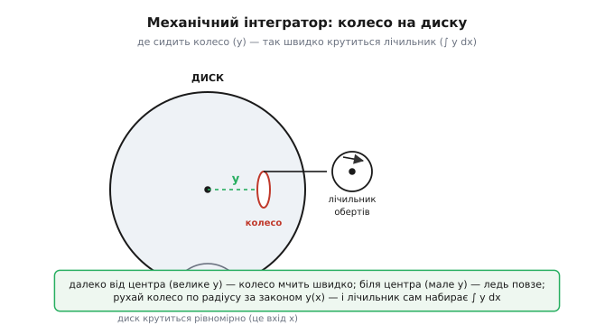

# 📜 Як інтегратор став цеглиною аналогового обчислення

Коли [операційний підсилювач із конденсатором у зворотному зв'язку](book:electronics/integrator-differentiator) видає на виході чесний інтеграл вхідної напруги, він завершує історію, що тяглася майже вісімдесят років. Бо думка, яка за нею стоїть — примусити **фізичну річ саму виконувати математичну дію**, замість того щоб рахувати її на папері, — старша за електроніку, старша за саму лампу. Спершу тією фізичною річчю було крутне колесо, притиснуте до крутного диска. Потім — вал із шестернями. І аж наприкінці — струм, що заряджає конденсатор. Ім'я «інтегратор» переходило з однієї машини на іншу, ставало дедалі меншим і швидшим, аж поки не вмістилося в один трикутник із двома входами.

Простежмо той шлях: що людей бентежило, хто перший здогадався, як механічний інтеграл десятиліттями чекав, поки з'явиться сила його розкрутити, і як війна нарешті виштовхнула ідею з металу в електрони. Історія тут справжня, з датами й іменами, перевіреними за джерелами; де щось лишається спірним чи легендою — я так і кажу.

## Задача, з якої все почалося: порахувати те, що не рахується

Аби зрозуміти, навіщо взагалі будувати машину, що інтегрує, треба відчути, як безнадійно це виглядало без машини. Візьмімо приплив. Море піднімається й опадає не за однією простою хвилею, а за сумішшю багатьох: Місяць тягне з одним періодом, Сонце — з іншим, форма затоки додає своїх обертонів. Кожна складова — своя синусоїда зі своєю висотою й швидкістю. Щоб передбачити, коли в конкретному порту буде повна вода наступного вівторка, треба **скласти десяток синусоїд** і подивитися, де їхня сума злетить угору.

На папері це пекло. Кожну синусоїду порахуй по точках, додай стовпчики, і так на кожну годину на роки вперед. Помилишся в одному стовпчику — попливе весь розклад, а від нього залежать кораблі, що заходять у порт по великій воді. У другій половині XIX століття це була не академічна забавка, а щоденна морська потреба Британської імперії, чиї гавані годувалися припливом.

Отут і народжується сама ідея аналогової машини. А що, коли не рахувати синусоїди, а **побудувати механізм, який фізично рухається так само**, як рухається море? Хай кожна складова буде колесом на своєму валу, що крутиться зі своєю швидкістю; з'єднай їх так, щоб їхні рухи склалися, — і перо, причеплене до суми, само намалює криву припливу. Машина не рахує число за числом; вона **стає** тією математикою своїм рухом. Ось стрижень усього, що буде далі: знайти фізичну систему, чия природа збігається з потрібною дією, і дати їй працювати.

## Колесо на диску: перша річ, що вміла інтегрувати

Найважча з потрібних дій — саме інтегрування. Складати синусоїди механічно нескладно (з'єднай осі), а от **накопичити площу під довільною кривою** — тобто взяти інтеграл — довго не давалося, бо для цього треба пристрій, чия швидкість щомиті слухається зовнішнього числа.

Розв'язок знайшов **Джеймс Томсон** (англ. James Thomson) — інженер і математик, старший брат славетнішого Вільяма Томсона, майбутнього лорда Кельвіна. Тут варто одразу бути точним щодо ідентичності, бо про братів часто пишуть недбало. Родина Томсонів — **ольстерські шотландці** (Ulster Scots): шотландські пресвітеріани-ковенантери, яких у XVII столітті витіснили з Ершира до півночі Ірландії. Джеймс і Вільям народилися в Белфасті, де їхній батько (теж Джеймс Томсон) викладав математику, згодом перебравшись на кафедру до Ґлазґо. Отже коректно: етнічно — шотландці, місце народження — Ірландія (Белфаст), інституційно — британська наука. Не просто «британці» й тим паче не «англійці» (усталений біографічний факт).

1876 року Джеймс Томсон описав механізм, який назвав інтегруючою машиною з новим кінематичним принципом (*On an Integrating Machine having a new Kinematic Principle*, доповідь Королівському товариству — усталений факт). Принцип геніально простий, і його варто розжувати, бо саме він — прабатько всього.

Уявіть плаский диск, що рівномірно обертається — це наш «хід часу», незалежна змінна x. На диск зверху спирається невелике колесо (радше ролик-ребро), причому воно може **ковзати по радіусу** диска — сидіти ближче до центра чи далі. Диск обертає це колесо тертям. І ось уся хитрість: **швидкість колеса залежить від того, де воно стоїть**. Біля самого центра диск під ним майже не рухається — колесо ледь повзе. На краю диска та сама кутова швидкість дає велику лінійну — колесо мчить. Постав колесо на відстані y від центра — і за один оберт диска воно проходить шлях, пропорційний y.

*Серце всякого механічного інтегратора. Диск крутиться рівномірно — це хід незалежної змінної x. Колесо притиснуте до диска й може посуватися по радіусу: близько до центра воно повзе, на краю — мчить, а швидкість щомиті пропорційна відстані y. Тепер рухайте колесо по радіусу за законом y(x) — і сумарний кут повороту колеса сам собою стає ∫ y dx. Річ фізично виконує інтеграл.*

Тепер зробімо останній крок думки. Хай якийсь інший механізм постійно посуває наше колесо по радіусу так, що відстань y весь час дорівнює значенню функції, яку ми хочемо проінтегрувати. Тоді за малесенький поворот диска dx колесо провернеться на величину, пропорційну y·dx — тобто на смужку площі під кривою. А накопичений кут повороту колеса, який ми знімаємо лічильником, є **сумою всіх цих смужок** — рівно інтегралом ∫ y dx. Колесо не «рахує» інтеграл; воно ним **обертається**. Математична дія стала механічним рухом — точно та сама філософія, що згодом оживе в конденсаторі.

Брат Джеймса, **Вільям Томсон** (Кельвін), одразу вхопив, що з цієї цеглинки можна будувати. 1872–73 років він зібрав машину-передбачувач припливів (tide-predicting machine): десяток складових-синусоїд, з'єднаних спільним валом, сумувалися в один рух пера, що малювало розклад води на місяці вперед (усталений факт). А 1876-го та 1878-го з'явилися більші машини на тому ж принципі. А ще Кельвін збудував гармонічний аналізатор (harmonic analyser) — машину, що робить обернене: бере готову криву припливу й **розкладає** її на складові синусоїди, використовуючи для цього саме інтегратор брата (усталений факт). Одна фізична дія — накопичення площі — годувала обидві машини.

## Пів століття ідея чекала на силу

І тут історія робить драматичну паузу, дуже повчальну. Кельвін хотів більшого. Він розумів, що коли з'єднати кілька інтеграторів у ланцюг — вихід одного посуває колесо наступного, — можна розв'язувати не лише приплив, а справжні диференціальні рівняння: рівняння руху, теплопровідності, будь-що. Він навіть описав таку схему у 1880-х. Але зіткнувся зі стіною, і стіна була суто фізична.

Проблема — у **слабкості колеса**. Момент, який колесо-інтегратор може передати далі, обмежений тертям між ним і диском, а тертя навмисне тримали малим (гладкі бронзові поверхні), щоб колесо ковзало точно й не заїдало. Виходить зачароване коло: щоб інтеграл був точним, зчеплення має бути легким; але легке зчеплення означає кволий вихід, якого **не вистачає, щоб посунути колесо наступного інтегратора**. Один інтегратор працює чудово; спробуй з'єднати два — і перший просто не має сили керувати другим, крива спотворюється, точність гине (усталений факт).

Тут корисно зупинитися на мить, бо це один із найясніших уроків усієї історії техніки. **Ідея була цілком правильна й повністю сформульована — за півстоліття до того, як її вдалося втілити.** Бракувало не думки, а однієї приземленої речі: способу підсилити кволий механічний сигнал, не зіпсувавши його. Точнісінько те саме повториться згодом з електронікою: конденсатор умів інтегрувати завжди, але чесний інтеграл дала лише поява підсилювача, здатного тримати [віртуальну землю](book:electronics/virtual-ground). Хоч механіка, хоч електрика — сама лічильна цеглинка була, а бракувало **підсилення**.

> Що треба знати про віртуальну землю: коли неінвертуючий вхід ОП посаджено на нуль, а зворотний зв'язок замикається на інвертуючий вхід, підсилювач утримує цей вхід рівно на 0 В — будь-яке відхилення дало б величезний вихід, який через зворотний зв'язок це відхилення й прибирає. У входи ОП струм не тече, тож увесь струм, що влився у вузол, виходить лише крізь зворотний зв'язок — саме це й робить електронний інтеграл чесним.

Розв'язок для механіки прийшов збоку й не від математиків. 1925 року **Генрі Німен** (англ. Henry W. Nieman) з металургійної компанії Bethlehem Steel запатентував підсилювач крутного моменту (torque amplifier) — по суті механічний слідкувальний привід. Пристрій ловить слабке обертання й **відтворює його потужним**: два барабани-капстани крутяться назустріч, а слабкий вхід лише злегка притискає до них стрічку, і вже потужний мотор капстанів дає на виході той самий рух, але із силою у стократ більшою (усталений факт). Німен робив його для важких верстатів, і гадки не маючи про інтеграли. Ось знову колективність винаходу в чистому вигляді: ключову деталь дала галузь, далека від математики.

## Диференціальний аналізатор Буша: машина з шести інтеграторів

Ланка, яка з'єднала Кельвінову мрію з Німеновим підсилювачем, — **Ванневар Буш** (англ. Vannevar Bush), професор інженерії Массачусетського технологічного інституту (MIT). У 1928–1931 роках він зі студентами (серед них Гарольд Гейзен, англ. Harold Hazen) збудував машину, яку назвав диференціальним аналізатором (differential analyzer) — і 1931 року описав її у праці *The differential analyzer. A new machine for solving differential equations* (усталений факт).

Осердя лишилося тим самим — **колесо на диску**, майже незмінене від Джеймса Томсона. Аналізатор мав шість таких інтеграторів, з'єднаних лісом валів, шестерень і пасів, які крутили електромотори; шість інтеграторів означали, що машина бере рівняння аж до шостого порядку (усталений факт). Але ключ, який відімкнув усе, — саме Німенів підсилювач моменту. Гейзен здогадався поставити його **на вихід кожного інтегратора**: тепер кволе колесо не мусило само тягти наступну ланку — воно лише вказувало напрям, а силу давав підсилювач. Зачароване коло, об яке розбився Кельвін, нарешті розімкнулося (усталений факт).

Погляньмо, як така машина розв'язувала рівняння, бо це проливає світло й на те, що робитимуть згодом операційні підсилювачі. Кожна величина в задачі — це кут повороту якогось вала. Хочеш проінтегрувати — заведи вал у колесо-на-диску, знімеш інтеграл. Хочеш скласти дві величини — з'єднай два вали через диференціал (той самий, що в автомобільному мосту). Хочеш помножити на сталу — підбери передавальне число шестерень. З цих дій, як з цеглин, ти **фізично збираєш саме рівняння**: скручуєш вали так, щоб їхні рухи задовольняли потрібне співвідношення, вмикаєш мотор — і машина котиться до розв'язку, малюючи криву пером. Рівняння руху розв'язується не обчисленням, а рухом.

Тут корисно побачити майбутнє наскрізь. Заміни в цьому описі «кут повороту вала» на «напругу на дроті», «колесо-на-диску» на «конденсатор в ОП», «диференціал» на «підсумовуючий вузол на віртуальній землі» — і дістанеш електронний аналоговий обчислювач слово в слово. Буш працював зі сталлю й бронзою, важив тонни, а машина займала кімнату й налаштовувалася гайковим ключем годинами. Але **логіка обчислення** вже була точнісінько та, що житиме в наступному поколінні. Мінявся носій, не спосіб думки.

Диференціальні аналізатори швидко розійшлися світом — їх будували в університетах і арміях, ними рахували балістичні таблиці й задачі електромереж аж до Другої світової. Вони працювали. Але лишалися повільними, велетенськими й вимагали фізично перезбирати вали під кожну нову задачу. Напрошувалося питання: чи не можна робити те саме **без жодної рухомої частини**?

## Стрибок у метал електронів: інтеграл без шестерень

Тут ідея перестрибує з механіки в електроніку — і, як не раз бувало у XX столітті, поштовхом стала війна. Причому сталося це у двох місцях майже водночас і незалежно, що само собою показує: час ідеї настав.

Перше місце — Німеччина. Молодий інженер **Гельмут Гельцер** (нім. Helmut Hölzer) ще студентом Дармштадтського технічного вишу близько 1935 року міркував, як виміряти власну швидкість над землею на планері, і додумався: якщо прискорення подати напругою, то **електронна схема може його проінтегрувати** й видати швидкість — без жодної механіки (усталений факт). Цю думку він доніс до ракетного колективу Вернера фон Брауна в Пенемюнде і 1941 року побудував пристрій, який згодом назвуть Mischgerät («мішалка») — прилад, що в реальному часі розв'язував рівняння стійкості ракети A-4 (тієї, яку пропаганда назве V-2) під час активного польоту. Це вважають **першим цілком електронним аналоговим обчислювачем** — його серцем був електронний інтегратор на лампах (усталений факт).

Тут потрібна чесність історика. Розповідь про Гельцера тісно сплетена з нацистською зброєю масового вбивства й з ракетами, які будували працею в'язнів концтаборів. Технічний факт — «перший електронний інтегратор» — від цього не зникає, але й не варто підносити його як чистий тріумф інженерії: це водночас памʼятка про те, кому й чому вперше знадобилося рахувати траєкторії так швидко. Статус самого технічного першенства — **правдоподібно усталений**, хоча «перший у світі» тут завжди трохи умовне, бо друге місце працювало паралельно й потай.

Друге місце — США, лабораторії Bell (Bell Labs). Там на зламі 1940-х група під орудою **Кларенса Лавелла** (англ. Clarence Lovell) і **Девіда Паркінсона** (англ. David Parkinson) будувала директор зенітної стрільби M9 (M9 gun director) — електричну машину, що наводила гармати на літаки, у реальному часі інтегруючи напруги-координати (усталений факт; Лавелл, Паркінсон і Дж. Кун 1947 року дістали за це Медаль за заслуги). Осердям була нова річ: **підсилювач постійного струму зі зворотним зв'язком**. Схему такого підсилювача розробив у Bell Labs **Карл Сварцель** (англ. Karl D. Swartzel Jr.) близько 1941 року — і саме конденсатор у його зворотному зв'язку робив електронне інтегрування, замінивши колесо-на-диску струмом і ємністю (усталений факт).

Ось де інтегратор нарешті скинув останню шестерню. Те, що в машині Буша було колесом на бронзовому диску з підсилювачем моменту позаду, стало конденсатором у зворотному зв'язку лампового підсилювача з великим коефіцієнтом. Дія — та сама (накопичити вхід за часом). Фізика-носій — інша (заряд замість тертя). А підсилення, якого так бракувало Кельвіну, тепер дає не барабан із мотором, а сама лампа: величезний коефіцієнт підсилювача тримає той кінець конденсатора незрушним, роблячи інтеграл чесним. *(Чому саме велике підсилення інвертуючого каскаду «прибиває» вхід до нуля — і чому через це інтегратор носить ім'я [Міллера](book:electronics/opamp-integrator-differentiator/hist-miller-integrator.md) — окрема історія про ефект, який спершу був ворогом лампи.)*

## Хто ж придумав операційний підсилювач — і звідки назва

Тепер найтонше місце всієї розповіді, де легко з'їхати в міф про одного генія. Не було одного винахідника операційного підсилювача. Була **естафета**, і кожен доклав своє.

*Пів століття дозрівання. Механічна гілка (угорі) знайшла, як фізично інтегрувати колесом, але довго не мала сили з'єднати інтегратори в ланцюг; підсилювач моменту цю силу дав, і машина Буша розв'язувала рівняння валами. Електронна гілка (унизу) замінила колесо конденсатором, а силу — коефіцієнтом лампового підсилювача. Ім'я «операційний» причепилося вже наприкінці, до готового.*

Розкладімо внески чесно, як вимагає історія техніки, що завжди колективна:

- **Механічний інтеграл** — Джеймс Томсон (1876): колесо на диску, сама ідея фізичного інтегрування.
- **Машина з ланцюга інтеграторів** — Вільям Томсон (Кельвін) задумав, Ванневар Буш здійснив (1931), а зробив можливим підсилювач моменту Генрі Німена (1925).
- **Електронний інтегратор** — Гельмут Гельцер (Німеччина, 1941) і незалежно колектив Bell Labs (Сварцель, Лавелл, Паркінсон, ~1941) замінили механіку на лампу з конденсатором.
- **Диференціальний вхід** — **Лоуб Джулі** (англ. Loebe Julie), 1943, у Колумбійському університеті: він зробив підсилювач із двома входами, «плюс» і «мінус» (довгохвоста пара тріодів). Саме ця дрібниця — два входи замість одного — і є та риса, що робить сучасний ОП сучасним ОП (усталений факт). Джулі часто лишається в тіні, тож його варто назвати прямо.
- **Назва** — **Джон Раґаззіні** (англ. John Ragazzini) разом із **Робертом Рендоллом** (Robert Randall) і **Фредеріком Расселлом** (Frederick Russell), Колумбійський університет, стаття *Analysis of Problems in Dynamics by Electronic Circuits* у *Proceedings of the IRE*, том 35, сторінки 444–452, травень 1947 року (усталений факт). Вони назвали підсилювач **операційним** саме тому, що з кількома деталями він виконує математичні **операції** — складає, множить на сталу, інтегрує, диференціює.

Зверніть увагу на порядок. Спершу річ **збудували й пустили в діло** (машини M9 і Mischgerät воювали з 1941-го), і лише через кілька років їй дали **ім'я** (1947). Так буває в техніці постійно: назва наздоганяє вже готове. І назва промовиста — вона фіксує не форму приладу, а його **призначення бути арифметичним вузлом**. Операційний — значить той, що виконує операції над числом-напругою. Саме тому інтегратор тут не одна з функцій серед багатьох, а **головна**: майже все, що розв'язував аналоговий обчислювач, — це диференціальні рівняння, а їх розв'язують інтегруванням.

## Філбрик і коробка за двадцять два долари

Лишалося вивести ідею з військових і університетських лабораторій на стіл до звичайного інженера. Це зробив **Джордж Філбрик** (англ. George A. Philbrick) — постать, яку варто знати, бо він і раніше йшов до тієї самої мети.

Ще 1937–38 років, працюючи у Foxboro Company над математикою систем керування, Філбрик зібрав електронний аналоговий симулятор, який жартома назвав «Поліфем» (Polyphemus) — на честь одноокого циклопа, бо машина мала єдиний «око»-осцилограф. На кількох лампових каскадах вона в реальному часі відтворювала поведінку промислового регулятора з процесом — по суті ранній спеціалізований аналоговий обчислювач (усталений факт). Тобто Філбрик мислив підсилювачами-як-обчислювачами ще до війни, паралельно до всіх інших.

Після війни його компанія George A. Philbrick Researches (скорочено GAP/R) зробила крок, що змінив усе: перетворила операційний підсилювач із деталі всередині якоїсь машини на **окремий товар**. 1952 року вони розробили, а на початку 1953-го випустили модель **K2-W** — перший серійний операційний підсилювач, готову «чорну скриньку» на восьмиконтактній ламповій панельці, за ціною близько **22 долари** (усталений факт; часто пишуть просто «1952», точніше — розроблено 1952, у продажу з січня 1953). Усередині — пара подвійних тріодів 12AX7, дібраних за високим коефіцієнтом підсилення μ.

Що це змінило по суті? K2-W перетворив збирання аналогового обчислювача на **гру в цеглинки прямо на лабораторному столі**. Тобі більше не треба було проєктувати ламповий підсилювач із нуля чи скручувати вали, як у Буша. Береш готовий K2-W, вішаєш йому в зворотний зв'язок резистор — маєш суматор; вішаєш конденсатор — маєш інтегратор; кілька входів через резистори в один вузол — і той вузол складає їх із вагами й інтегрує суму. Саме ця легкість і зробила ОП тим універсальним будівельним блоком, яким він лишається дотепер. Мрія Кельвіна про ланцюг з'єднаних інтеграторів нарешті стала чимось, що вміщується в руці й коштує як гарна вечеря.

Кумедний гак наостанок, що замикає велике коло. Усередині самого K2-W теж сидів маленький конденсатор між входом і виходом — але вже **не як обчислювальний елемент**, а за старим, ще ламповим призначенням: приборкати підсилювач, щоб не збуджувався. Тобто в одній коробці та сама фізична дрібниця водночас служила математиці (як інтегратор ззовні) і корилася своїй давній ролі перешкоди, яку приручають (усередині). Ефект, що півстоліття був ворогом лампи, і дія, що півстоліття шукала собі носія, зійшлися в одному корпусі — і поїхали разом далі, уже під ім'ям «операційний».

## Що лишається з цієї історії

Не дати й прізвища тут головне, а одна наскрізна думка, що пронизує всі вісімдесят років. **Інтегрувати — означає знайти фізичну річ, чия природа збігається з накопиченням, і дати їй працювати.** Спершу такою річчю було колесо на диску: його швидкість слухалася відстані до центра, тож сумарний оберт ставав площею під кривою. Кельвін хотів з'єднати такі колеса в машину для рівнянь, але вони були заслабкі, і ідея півстоліття чекала на підсилення — спершу механічне (підсилювач моменту Німена, що врятував аналізатор Буша), потім електронне (лампа з конденсатором, що прийшла з війною). А коли Раґаззіні з колегами назвали цей підсилювач операційним, вони лише дали ім'я тому, що вже воювало й рахувало: приладу, чиє покликання — виконувати дії над числом-напругою, і серед них найважливіша дія — інтеграл. Конденсатор у зворотному зв'язку ОП, який сьогодні тихо накопичує напругу, — прямий нащадок того бронзового колеса, тільки без єдиної рухомої частини й у мільйон разів менший.
