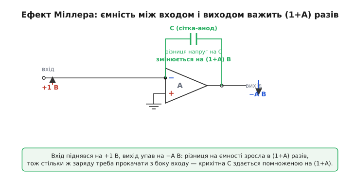
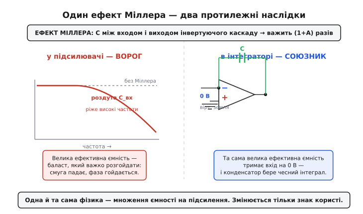

# 📜 Чому інтегратор зветься Міллеровим

Майже в кожному довіднику інвертуючий інтегратор на операційному підсилювачі підписаний двома словами: «інтегратор Міллера». Дивно вже те, що ім'я причеплене саме до цієї схеми, а не до сотні інших, де теж є конденсатор у зворотному зв'язку. А ще дивніше, що сам Джон Мілтон Міллер (англ. John Milton Miller) ніякого інтегратора не будував і про операційні підсилювачі не чув — він помер у тому десятилітті, коли ці схеми лише виходили з військових лабораторій. Він узагалі займався протилежним: боровся з ефектом, який потім, через сорок років, інженери навмисно вивернули навиворіт і зробили серцем аналогового обчислювача.

Це історія про те, як одна й та сама фізична дрібниця спершу була ворогом, а тоді стала найкращим другом — і як її ім'я переїхало разом з нею.

## Людина, що зміряла невидимого ворога лампи

Джон Мілтон Міллер народився 22 червня 1882 року в містечку Ганновер, штат Пенсильванія (англ. Hanover, Pennsylvania), у Сполучених Штатах. Закінчив Єльський університет — бакалавр 1904-го, магістр 1907-го, а 1915-го захистив там докторську з фізики. На той час він уже працював у Національному бюро стандартів США (англ. National Bureau of Standards), куди прийшов 1907 року. Це усталені біографічні факти — Міллер добре задокументована постать, аж до того, що 1953 року дістав найвищу інженерну відзнаку, Медаль пошани IEEE (англ. IEEE Medal of Honor), переважно за згаданий ефект і за свої схеми кварцових генераторів.

Щоб зрозуміти, що його непокоїло, треба згадати, з чим тоді працювали. Підсилювали сигнал не транзистором — транзистора ще не існувало, — а тріодною радіолампою (англ. triode): скляна колба, всередині розжарена нитка-катод, що сипле електронами, анод (по-старому — пластина, англ. plate), що ці електрони збирає, і між ними дротяна сітка (англ. grid), напругою на якій керують потоком. Маленька напруга на сітці — великий струм через лампу: ось і підсилення.

Біда в тім, що сітка з анодом — це два провідники, розділені порожнечею. А два провідники поряд завжди утворюють конденсатор, хай і крихітний, на частки пікофарада. Ця паразитна ємність сітка-анод (її звуть міжелектродною, англ. interelectrode capacitance) ні для чого не призначена — вона просто є, бо геометрія лампи така. І здавалося б, частка пікофарада — дрібниця, про яку не варто й думати.

Міллер показав, що це зовсім не дрібниця. Він узяв і поміряв, **який вхідний опір має тріод залежно від того, що навішано на анод** — і виявив, що крихітна ємність сітка-анод поводиться так, ніби вона в багато разів більша. Результат він виклав у праці 1920 року: *Dependence of the Input Impedance of a Three-Electrode Vacuum Tube upon the Load in the Plate Circuit* («Залежність вхідного опору триелектродної електронної лампи від навантаження в колі анода»), що вийшла в збірнику *Scientific Papers of the Bureau of Standards*, том 15, № 351, сторінки 367–385. Назва праці, дата й авторство — усталений факт; саме з цієї статті й пішов термін.

## Чому маленька ємність прикидається великою

Ось серце всієї історії, і його варто розжувати повільно, бо саме воно потім поверне нам інтегратор.

Тріод — інвертуючий підсилювач: підняли напругу на сітці — струм через лампу зріс — більше падіння на анодному навантаженні — напруга на аноді **впала**. Тобто коли вхід (сітка) йде вгору, вихід (анод) іде вниз, та ще й у багато разів сильніше. Якщо підсилення за модулем дорівнює A, то на кожен вольт угору на сітці анод відповідає A вольтами вниз.

Тепер придивімося до тієї паразитної ємності, що з'єднує сітку й анод. Конденсатор реагує не на абсолютну напругу, а на **різницю** напруг на своїх обкладках — і саме ця різниця визначає, скільки заряду в нього треба влити. Підніму напругу на сітці на 1 вольт. Сітка пішла на +1 В, але анод тієї ж миті пішов на −A вольтів. Різниця напруг на конденсаторі змінилася не на 1 вольт, а на (1 + A) вольтів — мій один вольт на сітці плюс A вольтів, на які втік анод у протилежний бік.

А заряд — це ємність на напругу, Q = C·U. Якщо різниця напруг змінилася в (1 + A) разів сильніше, то й заряду крізь ємність довелося прокачати в (1 + A) разів більше. Але звідки цей заряд приходить? З боку сітки, тобто з мого входу. Виходить, джерело сигналу мусить улити в крихітну ємність стільки заряду, наче вона в (1 + A) разів більша:

```
C_вх = C_сітка-анод · (1 + A)
```

Ось і весь ефект Міллера: ємність, увімкнена між входом і виходом інвертуючого каскаду, **здається з боку входу помноженою на (1 + A)**, де A — підсилення каскаду за модулем. Доля пікофарада за підсилення в сотню обертається сотнею пікофарад на вході — а це вже величина, що геть псує роботу на високих частотах: завалює смугу, гойдає фазу, гробить налаштування контура. Те, що мало б бути непомітним, стає головним обмеженням.

> 🔧 **Навіщо це.** Ефект Міллера й сьогодні — перший підозрюваний, коли підсилювач несподівано «не тягне» високі частоти. У будь-якому інвертуючому каскаді (на біполярному транзисторі це ємність база-колектор, на польовому — затвор-стік) ємність зворотного ходу множиться на підсилення й непомітно з'їдає смугу. Тому в довідкових даних окремо вказують цю ємність, а схемотехніки виганяють її каскодом чи іншими хитрощами. Той самий механізм, що дав нам зручний інтегратор, у звичайному підсилювачі лишається ворогом номер один.

Тонкість, яку Міллер теж бачив: помножена ємність — не просто більший конденсатор, бо вона тягне струм через **вихід**, а вихід має своє запізнення й свій опір. Тому строго кажучи з'являється не чиста ємність, а ще й активна складова вхідного опору, що залежить від навантаження на аноді, — про що, власне, й каже назва його статті. Але для нашої розповіді головне просте ядро: **між входом і виходом інвертуючого каскаду ємність важить у (1 + A) разів більше, ніж сама собою.**


*Серце ефекту Міллера. Малий стрибок на вході спричиняє великий протилежний стрибок на виході; різниця напруг на ємності зворотного ходу зростає в (1+A) разів, тож стільки ж заряду доводиться прокачати з боку входу — і крихітна C здається помноженою на підсилення.*

## Та сама ємність, але тепер бажана

Сорок років фізики й інженери ставилися до цього множення як до прокляття. А потім настала пора аналогових обчислювачів — і виявилося, що те саме множення можна вивернути на користь.

Згадаймо, чого хоче інтегратор. Конденсатор сам собою — ідеальний накопичувач: напруга на ньому є проінтегрованим струмом. Проблема пасивної схеми лише в тому, що поки конденсатор заряджається, напруга на ньому росте й сама гальмує власне заряджання — інтеграл псується. Хочеться конденсатора, який накопичує заряд, але **на вході при цьому майже не зрушується з місця**, щоб не заважати притоку струму.

І це рівно те, що дає ефект Міллера, прочитаний навпаки. Поставмо конденсатор у зворотний зв'язок інвертуючого каскаду з величезним підсиленням — а саме таким і є операційний підсилювач, у якого власне підсилення A сягає сотень тисяч. Тоді з боку входу цей конденсатор здається помноженим на (1 + A), тобто фактично нескінченно великим. Точка входу — інвертуючий вхід — заледве ворухнеться, хоч би скільки заряду натекло в конденсатор: адже всю напругу бере на себе вихід, що хитнувся в (1 + A) разів сильніше. Ту майже непорушну точку входу й називають [віртуальною землею](topic:electronics/virtual-ground) — вона тримається на нулі не дротом, а зусиллям зворотного зв'язку.

> Що треба знати про віртуальну землю: коли неінвертуючий вхід ОП посаджено на землю, а зворотний зв'язок іде на інвертуючий вхід, підсилювач утримує цей вхід рівно на 0 В — найменше відхилення дало б величезний вихід, який через зворотний зв'язок це відхилення й прибирає. Струм у входи ОП не тече, тож увесь струм, що приходить на вузол, мусить піти у зворотний зв'язок.

Подивімося, як це одне й те саме явище під двома іменами. У ламповому підсилювачі ми лаяли множення ємності, бо вхід **мусив** прокачувати в (1 + A) разів більше заряду, ніж очікував, — і це гальмувало сигнал. В інтеграторі ми тому самому множенню радіємо: воно означає, що конденсатор «всмоктує» весь вхідний струм, а сам вузол входу стоїть незрушно. У першому випадку велика ефективна ємність — це баласт, який важко розгойдати; у другому — це саме те, що тримає вхід прибитим до нуля й робить інтеграл чесним. Фізика тотожна, змінився лише знак користі.

Через це інвертуючий ОП-інтегратор і назвали **інтегратором Міллера**: він працює завдяки ефекту, який Міллер описав, — ємності у зворотному зв'язку інвертуючого каскаду, що завдяки великому підсиленню важить незмірно більше, ніж сама собою. Ім'я переїхало від людини, що з тим ефектом боролася, до схеми, що ним живе. Сам Міллер до інтегратора непричетний — це данина механізму, а не винахіднику конкретної схеми; статус тут такий: назва **усталена за традицією**, а не зафіксована якимось одним патентом чи статтею.


*Те саме множення ємності на підсилення, двічі. У підсилювачі воно небажане — роздута вхідна ємність ріже високі частоти. В інтеграторі воно бажане — та сама роздута ємність робить вузол входу віртуальною землею, і конденсатор накопичує чесний інтеграл. Одна фізика, протилежна користь.*

## Як ефект переїхав від лампи до обчислювача

Лишилося пройти останній місток: коли і навіщо комусь узагалі знадобилося навмисно ставити конденсатор у зворотний зв'язок підсилювача з гігантським коефіцієнтом.

Поштовхом, як це часто буває, стала війна. На зламі 1940-х у Bell Labs група інженерів під орудою Кларенса Лавелла (англ. Clarence Lovell) і Девіда Паркінсона (англ. David Parkinson) будувала електричну машину, що мала наводити зенітні гармати на літаки — пристрій, який згодом став відомий як директор стрільби M9 (англ. M9 gun director). Щоб вести ціль, машині треба було в реальному часі додавати, віднімати й, головне, **інтегрувати** напруги, що відповідали координатам і швидкостям. Підсилювач постійного струму з конденсатором у зворотному зв'язку робив це точно й без механіки — і саме там підсилювач уперше став обчислювальною цеглинкою, а не просто гучномовцем для сигналу.

Сам термін «операційний підсилювач» (англ. operational amplifier) з'явився трохи згодом, 1947 року, у праці Джона Рагаззіні (англ. John Ragazzini) *Analysis of Problems in Dynamics by Electronic Circuits* — «операційний» саме тому, що підсилювач виконував математичні операції: складав, інтегрував, диференціював. Інтегратор Міллера був серед цих операцій найважливіший, бо більшість рівнянь, які розв'язував аналоговий обчислювач, — це диференціальні рівняння, а їх розв'язують саме інтегруванням.

Далі ідея вийшла з військових лабораторій на ринок. 1952 року компанія Джорджа Філбрика (англ. George A. Philbrick) випустила K2-W — перший серійний операційний підсилювач, на двох подвійних тріодах, ціною двадцять два долари. Його продавали інженерам як готову «чорну скриньку», з якої можна збирати аналогові обчислювачі просто на столі: обвісив зворотний зв'язок резистором — маєш суматор, конденсатором — маєш інтегратор Міллера. Цікавий гак історії: всередині самого K2-W теж стояв маленький конденсатор Міллера — але вже не як обчислювальний елемент, а за старим, ламповим призначенням, щоб приборкати підсилювач і не дати йому збуджуватися. Той самий ефект усередині однієї коробки водночас і боровся сам із собою, і служив математиці.

Так замкнулося коло. Ємність зворотного ходу, яку Міллер 1920 року виявив як прикру перешкоду в радіолампах, через покоління перетворилася на навмисний прийом: її величезне ефективне значення тепер тримало віртуальну землю й робило аналогове інтегрування точним. А разом з ефектом переїхало й ім'я — і інвертуючий інтегратор досі носить прізвище людини, що першою виміряла, як маленька ємність прикидається великою.

## Що лишається з цієї історії

Варто запам'ятати не дату й не прізвище, а одну наскрізну думку: **ємність між входом і виходом інвертуючого каскаду важить у (1 + A) разів більше, ніж сама собою.** Це і є ефект Міллера, і він байдужий до того, радіємо ми йому чи ні. У підсилювачі він — ворог: роздуває вхідну ємність і ріже смугу. В інтеграторі — друг: робить вузол входу віртуальною землею, тож конденсатор накопичує чесний інтеграл без гальмування. Фізика одна, користь протилежна — і саме тому, що схема живе цим ефектом, вона носить ім'я Міллера, хоч сам він її й не будував.
