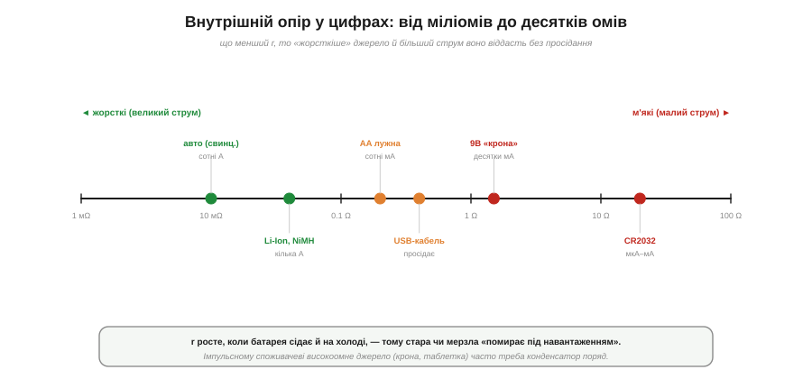
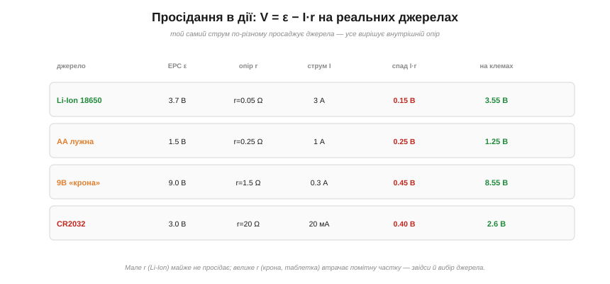

# 🔌 Внутрішній опір у цифрах: AA, «крона», Li-Ion, USB-порт

> Реальне джерело — це ЕРС послідовно з [внутрішнім опором](book:electronics/internal-resistance) r, тож під струмом напруга просідає за правилом V = ε − I·r. Тут — **реальні числа** для джерел, які ви тримаєте в руках щодня: скільки в них того r і що це означає на практиці. Маючи цю шпаргалку, ви наперед скажете, чи просяде джерело під вашим струмом і яке з них обрати.

### Шпаргалка внутрішніх опорів

*Рис. Внутрішній опір поширених джерел — від міліомів (автоакумулятор, Li-Ion) до десятків омів (CR2032). Що лівіше (менше r), то «жорсткіше» джерело й більший струм воно дасть без просідання; що правіше, то «м'якше».*

Орієнтовні значення (свіже джерело, кімнатна температура):

- **Автомобільний свинцевий акумулятор** — ~5–20 **мΩ**. Звідси сотні ампер стартеру.
- **Li-Ion 18650 / NiMH AA** — ~30–100 **мΩ** (потужні комірки <30 мΩ). Кілька ампер — тому на них працюють інструмент, дрони, електромобілі.
- **AA лужна** — ~0.15–0.3 Ω свіжа. Сотні міліампер тримає, амперами вже помітно просідає.
- **USB-порт + кабель** — сам порт низькоомний, та **кабель** додає ~0.1–0.5 Ω (тонкий і довгий — більше); саме він просаджує напругу на пристрої.
- **9-вольтова «крона»** — ~1–2 **Ω**! Усередині шість дрібних елементів із крихітними електродами, тож попри високу напругу струму вона дає мало — лише десятки міліампер.
- **CR2032 (літієва «таблетка»)** — ~10–40 **Ω**. Тільки для мікро- й міліамперних споживачів: годинник, RTC, пам'ять.

### Просідання в дії

*Рис. Те саме правило V = ε − I·r на реальних числах. Li-Ion при 3 А просідає лише на 0.15 В; AA лужна при 1 А — уже на 0.25 В (17 %!); «крона» при 0.3 А — на 0.45 В; CR2032 при 20 мА — на 0.4 В. Мале r майже не просідає, велике — втрачає помітну частку напруги.*

Числа одразу показують головне. Свіжа **AA** на 1.5 В при струмі 1 А втрачає на своєму r = 0.25 Ω аж 0.25 В — це 17 % напруги, забагато для тривалої роботи. **«Крона»** при якихось 0.3 А просідає на 0.45 В, а спробуйте взяти з неї пів-ампера — впаде на 0.75 В. А **Li-Ion** при 3 А втрачає лиш 0.15 В — тому й тягне потужне навантаження. Просте правило: множте свій струм на r джерела — і якщо спад I·r підбирається до кільканадцяти відсотків від ЕРС, джерело для такого струму **затісне**.

### Типові граблі

- **Таблетка + радіопередавач.** CR2032 живить датчик роками на мікроамперах, та коли радіомодуль на мить бере десятки міліампер, її величезний r просаджує напругу — і мікроконтролер **перезавантажується**. Рятунок — конденсатор поряд із джерелом, що віддає імпульс.
- **Тонкий чи довгий USB-кабель.** Опір кабелю просаджує 5 В на пристрої: зарядка повзе, а то й brownout. Товщий і коротший кабель — менше падіння.
- **Міф «9 В — це потужно».** Ні: висока напруга, але великий r, тож струму «крона» дає мало. Для потужного беруть низькоомні Li-Ion чи AA, а не «крону».
- **r не стале.** Воно **росте**, коли батарея сідає, і на **холоді** — тому стара чи мерзла батарея «жива» на вольтметрі, але «мертва» під навантаженням (виміряти r можна [двоточковим методом](book:electronics/internal-resistance)).

Підсумок простий: напруга на етикетці — це лише пів-історії; друга половина — **внутрішній опір**, який і вирішує, скільки струму джерело справді віддасть. Тримайте ці порядки величин у голові — і жодне джерело вас не здивує просіданням.
