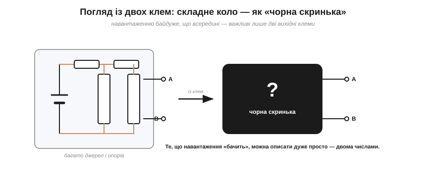
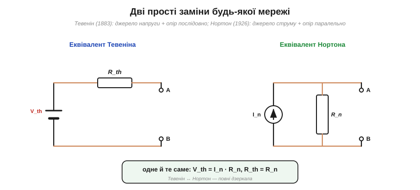
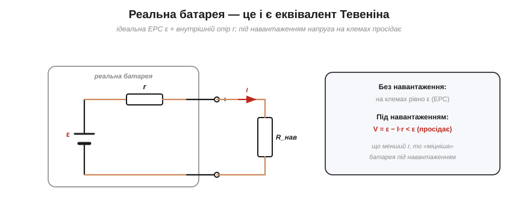
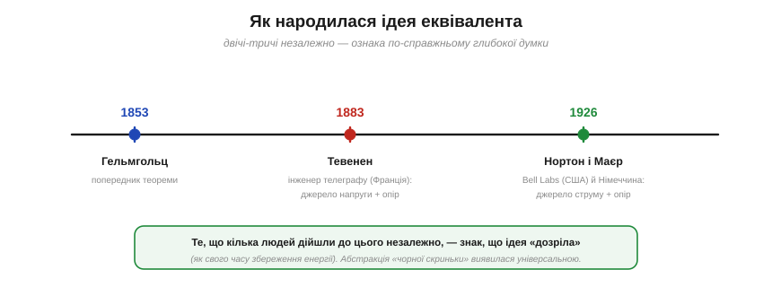

# 📜 Тевенін і Нортон: як цілу мережу замінити одним джерелом

> Маючи [метод розрахунку кола](book:electronics/circuit-analysis), можна знайти кожен струм і кожну напругу всередині мережі. Та часто це й не потрібно: нас цікавить лише, як мережа поводиться **з двох клем**, до яких приєднуємо навантаження. Двоє інженерів — француз **Тевенін** і американець **Нортон** — показали приголомшливу річ: будь-яку, хоч яку заплутану, лінійну мережу з цих двох клем можна замінити **одним джерелом і одним опором**. Це історія про силу **абстракції** — і про те, чому реальна батарея насправді є таким еквівалентом.

---

## Погляд із двох клем замість повного розрахунку

Уявімо складний блок — джерело живлення, давач, цілу плату — з якого виходять **дві клеми**. До них ми приєднаємо навантаження (лампу, мотор, вхід мікроконтролера) і хочемо знати: яка буде напруга, який потече струм. Розв'язувати щоразу всю внутрішню мережу [повним методом аналізу кола](book:electronics/circuit-analysis) — занадто марудно, та й навіщо?

*Рис. Хоч яке складне коло всередині, навантаження «бачить» лише **дві клеми** A і B. Тож із цих клем мережу можна вважати «чорною скринькою» — і, як виявилось, описати її геть просто, лише двома числами.*

Адже навантаженню **байдуже**, що там усередині — скільки джерел, скільки резисторів, як вони сплетені. Воно «відчуває» лише дві клеми: яку напругу вони пропонують і як вона просідає під струмом. А отже, усю внутрішню складність можна сховати за простим **інтерфейсом** із двох виводів. Лишалося знайти, чим саме цей інтерфейс описати.

---

## Тевенін (1883): мережа = джерело напруги + опір

Відповідь дав 1883 року **Леон Шарль Тевенін** (*Léon Charles Thévenin*, 1857–1926), інженер французького поштово-телеграфного відомства. Його **теорема Тевеніна** стверджує: будь-яку лінійну мережу з джерел та опорів, якщо дивитися на неї з двох клем, можна замінити **одним джерелом напруги** V_th **послідовно** з **одним опором** R_th.

*Рис. Ліворуч — еквівалент Тевеніна: джерело напруги V_th послідовно з опором R_th. Праворуч — еквівалент Нортона: джерело струму I_n паралельно з опором R_n. Обидва описують ту саму «чорну скриньку», і вони пов'язані: V_th = I_n·R_n, R_th = R_n.*

Лишалося тільки знайти ці два числа — і це теж виявилось просто (докладно — у темі [«Як знайти еквівалент Тевеніна»](book:electronics/thevenin-equivalent)). **V_th** — це напруга на розімкнених клемах (коли навантаження ще не приєднане, «холостий хід»). **R_th** — це опір самої мережі, якщо подумки «вимкнути» всі її джерела. Два числа — і ціла плата зведена до елементарної схемки з двох елементів. Варто, одначе, чесно сказати: Тевенін був тут **не першим**. Той самий результат ще 1853 року — за тридцять років до нього — вивів великий німецький фізик **Герман фон Гельмгольц** (*Hermann von Helmholtz*); Тевенін дійшов до нього незалежно, та теорема закріпилася саме за його ім'ям (так показав історик техніки Дон Джонсон).

---

## Нортон (1926): дзеркало — джерело струму + опір

Минуло сорок із гаком років, і 1926 року американський інженер **Едвард Лорі Нортон** (*Edward Lawry Norton*, 1898–1983) із легендарних **Bell Labs** дав **дзеркальну** версію. Його **теорема Нортона**: ту саму мережу можна так само замінити **одним джерелом струму** I_n **паралельно** з опором R_n.

Це повна **двоїстість** [послідовного й паралельного з'єднань](book:electronics/parallel-connection): де в Тевеніна джерело напруги послідовно з опором, у Нортона — джерело струму паралельно з опором. Обидві схеми описують **ту саму** чорну скриньку й легко переводяться одна в одну: V_th = I_n·R_n, а опір у них узагалі однаковий, R_th = R_n. Який еквівалент брати — питання зручності: для послідовних з'єднань природніший Тевенін, для паралельних — Нортон.

Цікаво, що Нортон навіть **не опублікував** свій результат як статтю — він лишився коротким згадуванням у **внутрішній технічній записці** Bell Labs, і теорему назвали його іменем уже згодом. А німець **Ганс Фердинанд Маєр** (*Hans Ferdinand Mayer*, 1895–1980) того ж 1926 року **опублікував** той самий результат і **докладно** його виклав — тож, за справедливістю, теорему правильніше звати **Маєра — Нортона**.

---

## Чому це революція: абстракція «чорної скриньки»

Може здатися, що це лише зручний трюк для розрахунків. Та насправді тут — одна з найглибших інженерних ідей узагалі: **абстракція**, приховування складного за простим інтерфейсом.

> 🔧 **Навіщо це.** Принцип «чорної скриньки» — наскрізний для всієї техніки. Вам не треба знати схему блока живлення, щоб ним користуватися, — досить його **еквівалента**: яку напругу він дає і який має вихідний опір. Точно так само програміст користується функцією, не знаючи її нутрощів; інженер з'єднує модулі за їхніми «інтерфейсами». Теорема Тевеніна — це математичний дозвіл так робити з **будь-яким** лінійним колом: хоч яка складність усередині, назовні вона виглядає як просте «джерело + опір». Опанувавши цю звичку — описувати вузол його еквівалентом, — ви думатимете як інженер, а не загрузнете в деталях.

Саме тому еквіваленти Тевеніна й Нортона — не другорядний трюк, а **спосіб мислення**. Вони дозволяють розбити велику систему на блоки, кожен з яких описано двома числами, і складати їх, не тримаючи в голові всю внутрішню кухню кожного.

---

## Наш випадок: реальна батарея — це і є Тевенін

А тепер найприземленіше — і найважливіше. **Реальна батарея — це буквально еквівалент Тевеніна.** Зазвичай джерело уявляють ідеальним: батарея на 12 В завжди дає рівно 12 В. Та насправді всередині неї, крім «ідеальної» електрорушійної сили (**ЕРС**, *EMF*) ε, сидить ще й **внутрішній опір** r — послідовно, точнісінько як R_th у Тевеніна.

*Рис. Реальна батарея — це ідеальна ЕРС ε послідовно з внутрішнім опором r (еквівалент Тевеніна). Без навантаження на клемах рівно ε; під навантаженням напруга просідає до V = ε − I·r, бо частина гине на самому r.*

Наслідок видно в житті щокроку. Без навантаження («холостий хід») на клемах рівно ε. Та щойно потече струм I, частина напруги губиться на внутрішньому опорі, і на клемах лишається **менше**: V = ε − I·r. Ось чому фари тьмяніють, коли заводиш двигун (стартер бере величезний струм, і навіть малий r дає помітне просідання); чому стара батарейка «під навантаженням мертва», хоч вольтметр на холостому ході показує норму (її r виріс); чому потужний підсилювач не запустиш від кволого блока живлення. Уся суть зводиться до одного: **реальне джерело = ідеальне джерело + внутрішній опір**, і це — Тевенін у чистому вигляді. Те саме видно й у [дільнику напруги](book:electronics/voltage-divider): його «вихідний опір» (R₁∥R₂) — то теж R_th.

---

## Хто були Тевенін і Нортон

*Рис. Ідея визрівала десятиліттями й народжувалась незалежно: Гельмгольц (1853) як попередник, Тевенін (1883) у французькому телеграфі, Нортон і Маєр (1926) у Bell Labs та Німеччині.*

Обидва герої — **інженери-практики**, а не кабінетні теоретики, і це не випадково: теореми про еквіваленти народилися з потреби рахувати **реальні** телеграфні й телефонні мережі, велетенські та заплутані. **Тевенін** усе життя працював у телеграфному відомстві Франції, викладав і вивів свою теорему мимохідь, удосконалюючи методи розрахунку ліній. **Нортон** служив у **Bell Labs** — кузні XX століття, що дала світові транзистор, інформаційну теорію Шеннона й безліч іншого; він займався теорією мереж і фільтрами, а свою теорему лишив у скромній службовій записці.

І ще одна повчальна деталь. Ту саму ідею незалежно сформулювали кілька людей: **Гельмгольц** ще 1853 року (тому теорему Тевеніна іноді звуть теоремою **Гельмгольца — Тевеніна**), а дуальну — Нортон і Маєр одночасно. Коли до того самого результату доходять різні люди в різний час і в різних країнах, це певна ознака: ідея **дозріла** й була неминуча — як свого часу [закон збереження енергії](book:physics/electric-power), до якого Джоуль, Маєр і Гельмгольц (той самий!) теж дійшли незалежно.

---

## Чим це відгукнулося

З потреби рахувати телеграфні мережі народилася ідея, що пронизує всю інженерію:

- **Теорема Тевеніна** — будь-яка лінійна мережа з двох клем = джерело напруги V_th + опір R_th послідовно.
- **Теорема Нортона** — дзеркало: джерело струму I_n + опір R_n паралельно; V_th = I_n·R_n, R_th = R_n.
- Це і є **абстракція «чорної скриньки»**: складне ховається за простим інтерфейсом із двох чисел.
- Найближчий приклад — **реальне джерело**: ЕРС + внутрішній опір, через що напруга просідає під навантаженням.

Хоч яким заплутаним є плетиво дротів усередині, з двох клем воно завжди зводиться до простого, зрозумілого еквівалента — джерела й опору. Саме це й робить теореми Тевеніна та Нортона наскрізним способом мислення, а не вузьким розрахунковим трюком.
