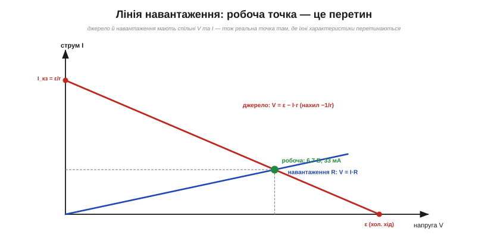
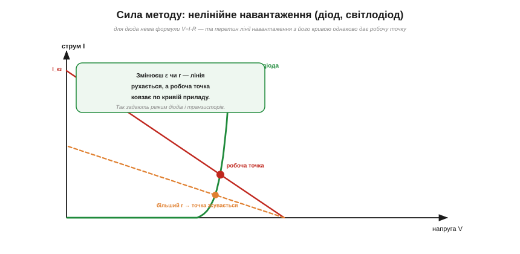

# 🧮 Лінія навантаження: графічний розв'язок на площині V–I

> Числова вставка про графічний метод робочої точки. У [реального джерела](book:electronics/internal-resistance) є характеристика V = ε − I·r, і робочу точку дає її **перетин** із лінією навантаження. Для резистора це проста алгебра. Та справжню силу цей графічний метод показує там, де алгебра безсила, — на **нелінійному** навантаженні (діод, світлодіод, транзистор). Розберімо його як слід.

### Дві характеристики на одній площині

Джерело й навантаження з'єднані, тож у них **спільні** V та I. Намалюймо на площині «напруга V (вісь x) — струм I (вісь y)» обидві характеристики разом.

*Рис. Характеристика джерела V = ε − I·r — пряма від (ε, 0) (холостий хід) до (0, ε/r) (коротке замикання), з нахилом −1/r. Лінійне навантаження R — пряма з початку координат, V = I·R. Їхній перетин — робоча точка (тут 6.7 В, 33 мА для ε=10 В, r=100 Ω, R=200 Ω).*

- **Джерело** — це пряма V = ε − I·r. Її легко провести за двома точками: холостий хід (I = 0, V = ε) і коротке замикання (V = 0, I = ε/r). Нахил — −1/r. Історично саме цю пряму звуть **лінією навантаження** (*load line*).
- **Навантаження** — своя характеристика. Резистор R: пряма з початку координат, V = I·R (нахил 1/R). А діод чи світлодіод — крива з «коліном».

### Робоча точка — це перетин

Оскільки обидва елементи мусять мати **однакові** V та I, справжня робоча точка — там, де дві характеристики **перетинаються**. Один перетин — одна відповідь. Для лінійного навантаження це можна було б розв'язати й алгеброю (підставити V = I·R у V = ε − I·r), і графік лише підтверджує: для ε = 10 В, r = 100 Ω, R = 200 Ω перетин дає V ≈ 6.7 В, I ≈ 33 мА. Та для нелінійного приладу алгебри вже немає — і тут метод незамінний.

### Сила методу: нелінійне навантаження

*Рис. Світлодіод не має формули V=I·R — лише круту вольт-амперну криву з коліном. Та робоча точка однаково знаходиться як перетин лінії навантаження джерела з цією кривою. Змінивши r (інший нахил, штрихова лінія), бачимо, як точка ковзає по кривій приладу.*

У світлодіода чи діода немає простого [V = I·R](book:electronics/ohms-law) — лише крута крива з коліном. Підставити нема що, ітерувати руками довго. А графічний метод дає відповідь **одним перетином**: накресли криву приладу, проведи лінію навантаження джерела — точка їхнього перетину і є робочою. Саме так задають режим діодів, світлодіодів і транзисторів — це базовий інструмент аналогової схемотехніки.

### Інтуїція: рухаємо лінію — ковзає точка

Графік не лише дає число, а й **показує**, як усе пов'язано. Зміниш **ε** — лінія зсувається паралельно вздовж осі напруг; зміниш **r** — лінія нахиляється, обертаючись навколо точки (ε, 0). А робоча точка при цьому **ковзає** по нерухомій кривій приладу. Так одразу видно, як «міцність» джерела впливає на режим навантаження: жорстке джерело (мале r, майже горизонтальна лінія) тримає струм; м'яке (велике r) — просідає. До речі, режим [**максимальної передачі потужності**](book:electronics/power-matching) (R = r) — це теж конкретна точка на цій лінії.

### Де працює

Графічний метод потрібен щоразу, коли навантаження або джерело **нелінійні**. Найперше — обмежувальний резистор світлодіода й зміщення транзисторів. А гарний приклад нелінійного **джерела** — **сонячна панель**: її [вольт-амперна крива](book:electronics/panel-iv-mpp) далеко не пряма, і робочу точку знаходять саме перетином із лінією навантаження. Більше того, є особлива точка цієї кривої — **точка максимальної потужності** (MPP), де панель віддає найбільше; саме її [«вистежують» контролери сонячних систем](book:electronics/real-sun-mppt), по суті, підбираючи нахил лінії навантаження. Складна нелінійна задача зводиться до простого «знайди, де перетинаються дві криві», — у цьому й уся принада методу лінії навантаження.
