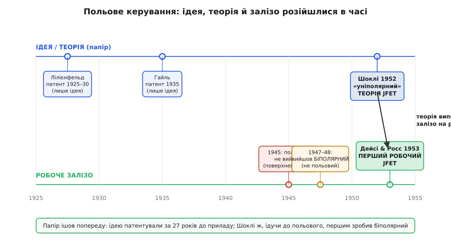

# 📜 Як теорія JFET випередила залізо

Є винаходи, де спершу хтось щось майструє на столі, воно несподівано працює, і вже потім люди десятиліттями розбираються, *чому*. JFET — протилежний випадок. Тут спершу на папері з'явилася бездоганна теорія приладу, з формулами й передбаченнями, а робоче залізо наздогнало її аж за рік. Ба більше: людина, яка цю теорію вивершила, спочатку йшла зовсім до іншого — намагалася зробити **польовий** транзистор, раз за разом упиралася в стіну, а вийшов у неї натомість **біполярний**, геть інакший прилад. JFET же — той, до якого вона цілилася від самого початку, — народився останнім, коли стіну нарешті обійшли збоку.

Ця історія варта того, щоб її розповісти повільно, бо в ній видно, як насправді робиться наука: не «осяяло — зробив», а довга боротьба з тим, чого не розумієш, кружний шлях, чужі здогади, що раптом стають на місце, і момент, коли давня ідея нарешті лягає в робочий метал.

## Ідея, яку не було з чого зробити

Сама думка керувати струмом у напівпровіднику **полем збоку**, нічого не вмикаючи в розрив, — стара. Вона старша за весь транзистор як такий на двадцять із гаком років.

Першим її записав і запатентував **Юліус Едґар Лілієнфельд** (нім. Julius Edgar Lilienfeld). Тут варто бути точним з тим, ким він був, бо побіжно його часто звуть просто «австрійцем» чи «німцем», а це затирає справжню картину. Лілієнфельд народився 18 квітня 1882 року в **Лемберзі** — це сьогоднішній **Львів**, а тоді столиця Галичини в австрійській частині Австро-Угорщини. За походженням він був німецькомовним ашкеназьким євреєм; підданство мав спершу австро-угорське, по тому польське, а 1934 року став громадянином США. Фізику вивчав у Берліні (Friedrich-Wilhelms-Universität, докторат 1905), потім багато років викладав у Лейпцигу й лише 1926-го остаточно перебрався за океан. Тобто «винахідник ідеї польового транзистора» — це людина з львівським корінням, єврейської культури, німецької освіти й американського громадянства; жоден один ярлик її не описує, і чесно сказати саме так.

Що ж він придумав? У канадському, а тоді й американському патенті Лілієнфельд описав прилад із трьох електродів, де на тонкий шар напівпровідника діє **поперечне електричне поле** третього електрода й тим керує провідністю шару між двома іншими. Ключові дати, перевірені за патентними записами (статус — усталено):

```
Лілієнфельд, US Patent 1,745,175
  «Method and Apparatus for Controlling Electric Currents»
  подано:   8 жовтня 1926 (канадська заявка — 22 жовтня 1925)
  видано:   28 січня 1930

Другий патент, US 1,900,018
  «Device for Controlling Electric Current»
  подано:   28 березня 1928, видано: 7 березня 1933
```

Це і є, по суті, ідея польового транзистора, записана за два десятиліття до того, як хтось зумів його зробити. Але «записана» — не означає «зроблена». Лілієнфельд **жодного робочого приладу не збудував** і, наскільки знають історики, навіть не намагався всерйоз: на той час просто не існувало напівпровідників потрібної чистоти, а він до того ж нічого не публікував у наукових журналах. Тож його патент лежав майже невідомим — пізніші винахідники транзистора про нього або не знали, або дізналися згодом.

Другим ту саму думку незалежно записав **Оскар Гайль** (нім. Oskar Heil), німецький інженер, що тоді працював у Кембриджі. Його британський патент (статус — усталено):

```
Гайль, British Patent 439,457
  «Improvements in or relating to electrical amplifiers
   and other control arrangements and devices»
  подано:   березень 1935 (у Кембриджі)
  видано:   6 грудня 1935
```

Гайль описав керування струмом у тонкому шарі напівпровідника через **ємнісно зв'язаний** електрод — по суті, ізольований затвор. Знов-таки: чиста ідея, **без робочого приладу**. Жодних доказів, що Гайль або Лілієнфельд побудували щось діюче, не збереглося.

> 🔧 **Навіщо це.** Тут важлива не дата, а урок, що тримається до сьогодні: **патент на ідею — це ще не винахід**. Між «я придумав, як це мало б працювати» і «ось воно працює в металі» лежить прірва, і саме її доводиться долати інженерові. Лілієнфельд мав правильну ідею на двадцять років раніше — і вона нічого не дала світу, бо не було ні матеріалу, ні розуміння фізики поверхні, щоб її втілити. Коли в технічній історії бачите «вперше запатентовано в такому-то році», завжди питайте наступне: а коли вперше **запрацювало** — і хто це зробив?

Розрізнімо чітко, бо це наскрізна нитка всієї історії. **Ідея** польового керування — Лілієнфельд (1925–30) і Гайль (1935). **Теорія** конкретного робочого приладу — попереду. **Робоча реалізація** — ще далі попереду. Це три різні речі, і плутати їх — означає переписувати історію.

## Шоклі цілився в польовий — а влучив у біполярний

Тепер головний поворот, той самий «цікавий кут» усієї розповіді.

Коли по Другій світовій у Bell Labs зібрали групу твердотільної фізики, її очолив **Вільям Шоклі** (англ. William Shockley). І перше, що Шоклі захотів зробити навесні 1945 року, — це саме **польовий** підсилювач: брусок напівпровідника, поряд керівна пластина, поле з пластини керує провідністю бруска. Та сама ідея Лілієнфельда й Гайля, тільки тепер за неї взялися всерйоз, із наміром довести до робочого приладу. Шоклі навіть прикинув, який має бути ефект, — і він мав вийти добре помітним.

А прилад **не працював**. Поле подавали — провідність майже не мінялася. Ефект був у десятки разів слабший за розрахований, наче поле кудись зникало, не доходячи до носіїв у глибині напівпровідника. Це була справжня стіна: теорія каже «має бути», а прилад уперто мовчить.

Розгадку дав не сам Шоклі, а **Джон Бардін** (англ. John Bardeen) — теоретик тієї ж групи. 1946 року він висунув ідею **поверхневих станів** (англ. *surface states*): на самій поверхні напівпровідника електрони сидять у пастках особливих станів і утворюють тонкий заряджений шар, який **екранує** зовнішнє поле. Поле затвора впирається в цей поверхневий заряд і просто не проникає в товщу — ось чому ефект такий мізерний. Стіна дістала пояснення.

І ось іронія долі. Замість того щоб одразу пробити цю стіну й зробити польовий прилад, Бардін із **Волтером Браттейном** (англ. Walter Brattain) почали досліджувати самі ці поверхневі стани — як вони поводяться, як їх обійти. І в цьому дослідженні 16 грудня 1947 року вони натрапили на **зовсім інший** спосіб підсилювати: приклали два близькі золоті вістря до шматочка чистого германію — і отримали підсилення. Це був **точковий транзистор** (англ. *point-contact transistor*), а працював він не на полі, а на **інжекції носіїв** через контакти — принципово інакша фізика. Прилад, по суті, біполярний.

Шоклі, дізнавшись про це, за кілька тижнів напруженої роботи (легенда каже — почасти із заздрості, що ключове відкриття зробили без нього) вивів теорію надійнішого **площинного транзистора** на двох p-n переходах — це і є класичний [біполярний транзистор](book:electronics/transistor-idea) (англ. *bipolar junction transistor*), той, що з базою, емітером і колектором. Його й стали робити; за нього Шоклі, Бардін і Браттейн дістали Нобелівську премію 1956 року.

> 🔧 **Навіщо це.** Простежте ланцюжок причин, бо він повчальний. Шоклі **хотів польовий** → польовий **не вийшов** через поверхневі стани → щоб зрозуміти поверхневі стани, Бардін із Браттейном полізли їх вивчати → і **випадково** натрапили на точковий (біполярний) транзистор → Шоклі з того вивів площинний біполярний. Тобто весь перший транзистор — біполярний — народився як **побічний продукт невдалої спроби** зробити польовий. Людина цілилася в одне, а світ отримав інше. У техніці так буває частіше, ніж здається: невдача на головному напрямі відкриває бічні двері, за якими лежить зовсім інший винахід.


*Верхня доріжка — ідея на папері (патенти Лілієнфельда й Гайля, тоді теорія Шоклі 1952), нижня — робоче залізо. Видно дві речі одразу: ідею польового приладу записали за двадцять із гаком років до першого робочого JFET, а на доріжці заліза Шоклі, прямуючи до польового (1945, не вийшло), першим отримав біполярний (1947–48) — і лише потім, 1953-го, Дейсі та Росс зробили той польовий, до якого все й ішло.*

Отже, станом на кінець 1940-х маємо парадокс. Польовий транзистор — простіша й давніша **ідея**, з неї все почалося, — досі не працює. А складніший біполярний — той, якого ніхто спершу не планував, — уже працює і йде в серію. Польовий лишився боргом, який ще треба було віддати.

## 1952: «уніполярний» — теорія, що обійшла стіну

Цей борг Шоклі віддав на папері 1952 року. У статті з промовистою назвою він дав повну, струнку теорію робочого польового транзистора — і головне, придумав, як **обійти** ту саму поверхневу стіну, об яку розбився 1945-го.

Стаття (статус — усталено):

```
W. Shockley, «A Unipolar Field-Effect Transistor»
  Proceedings of the IRE, том 40, листопад 1952, с. 1365–1376
```

Хитрість — у тому, *де* зробити затвор. У невдалій спробі 1945 року й у патентах Лілієнфельда та Гайля затвор діяв **крізь поверхню**: керівне поле мусило пройти зовнішню грань напівпровідника, а там на нього й чекали поверхневі стани. Шоклі ж запропонував керувати каналом **зворотно зміщеним p-n переходом усередині самого тіла** напівпровідника. Тоді керівна дія — це розширення збідненої області переходу в **глибині** кристала, а не поле, що силкується проникнути ззовні. Поверхневі стани сидять на грані й цій внутрішній збідненій області майже не заважають. Стіну не пробили — її **обійшли збоку**.

Звідси й термін, який Шоклі ввів навмисне і який живе досі: **уніполярний** (англ. *unipolar* — лат. *unus* «один» + *polus* «полюс»). Думка проста й глибока. У точковому й площинному транзисторах струм несуть **обидва** типи носіїв одразу — і електрони, і дірки; через те Шоклі назвав їх **біполярними** (два типи носіїв). А в його новому приладі струм каналу несе лише **один** тип носіїв — самі електрони в n-каналі (або самі дірки в p-каналі), а затвор-перехід ними тільки керує збоку, нічого в струм не вкидаючи. Один тип носіїв → «уніполярний». Саме звідси пішов цей поділ, яким користуються донині: польові транзистори — уніполярні, звичайні транзистори з переходами — біполярні.

> 🔧 **Навіщо це.** Слова «уніполярний» і «біполярний» у довідниках по транзисторах — не випадкові ярлики, а точна вказівка на фізику. **Біполярний** означає: працює інжекцією, струм несуть носії обох знаків, керування іде струмом бази й цей струм треба віддавати. **Уніполярний** (польовий) означає: працює полем, струм несе один тип носіїв, керування іде напругою затвора майже без струму. Коли ви читаєте, що JFET — «уніполярний прилад», за цим стоїть уся причина, чому в нього такий високий вхідний опір і чому ним керують напругою, а не струмом. Термін придумав Шоклі рівно для того, щоб одним словом сказати цю різницю.

Стаття 1952 року була **повна теорія**: Шоклі вивів, як збіднена область з'їдає переріз каналу, що таке защемлення, чому в насиченні струм застигає, і дав ту саму квадратичну залежність струму від напруги затвора, яку тепер звуть законом Шоклі. Усе передбачено наперед, із числами. Бракувало одного — щоб хтось зробив це в металі й перевірив, що теорія не бреше.

Тут і криється та особливість, з якої ми почали: на цей момент польовий транзистор існував **як бездоганна теорія, але ще не як прилад**. Теорія була готова до останньої формули; робочого зразка не було. Папір випередив залізо.

## 1953: Дейсі та Росс роблять перший робочий JFET

Залізо наздогнало теорію наступного року, і зробили це двоє молодших співробітників Шоклі в Bell Labs — **Джордж Клемент Дейсі** (англ. George Clement Dacey) та **Іан Манро Росс** (англ. Ian Munro Ross).

Знов розрізнімо їхні постаті точно, без злиття в безлике «команда Шоклі». **Дейсі** — американець, народився 1921 року в штаті Іллінойс, освіту здобув в Іллінойському університеті, докторат із фізики — у Каліфорнійському технологічному (Caltech, 1951), а до Bell Labs прийшов після того, як почув там семінар Шоклі й загорівся твердотільною темою. **Росс** — англієць, народився в Саутпорті, інженерну освіту й докторат дістав у Кембриджі (Gonville and Caius College, докторат 1952), і того ж 1952 року Шоклі взяв його до Bell Labs займатися напівпровідниками. Тобто перший JFET зробили американський фізик і англійський інженер — двоє різних людей із різних шкіл, а не абстрактна «лабораторія».

Що саме вони зробили (статус — усталено): узяли теорію Шоклі й **побудували діючий уніполярний польовий транзистор** із керівним p-n переходом — той самий JFET, — а тоді виміряли його й показали, що він підсилює і що його поведінка лягає на передбачення теорії. Це і є перший **робочий** JFET. Їхні публікації:

```
G. C. Dacey, I. M. Ross, «Unipolar Field-Effect Transistor»
  Proceedings of the IRE, том 41, серпень 1953, с. 970–979

G. C. Dacey, I. M. Ross, «The Field Effect Transistor»
  Bell System Technical Journal, том 34, 1955, с. 1149
  (повніший, докладний виклад приладу)
```

Зверніть увагу на дати поряд: теорія Шоклі — листопад 1952, перша публікація про робочий прилад Дейсі й Росса — серпень 1953. Між готовою теорією й готовим залізом — менше року. Для приладу, ідею якого записали ще 1925-го, цей фінальний ривок виявився коротким — щойно теорія показала, *де* робити затвор, реалізація знайшлася швидко.

Дороги обох винахідників потім розійшлися широко, і це теж частина чесної історії, а не просто виноска. Росс згодом став шостим **президентом Bell Labs** (1979–1991) і провів лабораторію крізь розпад телефонної монополії Bell. Дейсі дослужився до директора з твердотільної електроніки в Bell Labs, а пізніше очолив корпорацію Sandia. Тобто перший JFET зробили на початку кар'єри двоє людей, які згодом самі стали керівниками великої науки.

## Чому ця історія важить

Складімо нитку докупи, бо в ній — три уроки, що виходять далеко за межі одного транзистора.

**Перший: ідея, теорія й реалізація — це три різні події, часто на роки одна від одної.** Ідею польового керування записали Лілієнфельд (1925) і Гайль (1935) — і вона лежала мертвою, бо не було ні матеріалу, ні розуміння фізики поверхні. Теорію робочого приладу дав Шоклі (1952). Робочий прилад зробили Дейсі та Росс (1953). Сказати «JFET винайшов Лілієнфельд» — груба неправда: він мав ідею, але не прилад. Сказати «JFET винайшов Шоклі» — теж неточно: Шоклі дав теорію, але в металі його втілили інші двоє. Винахід тут **колективний і розтягнутий у часі**, і кожному належить рівно його частка — не більша й не менша.

**Другий: головний шлях буває не той, яким приходить винахід.** Шоклі цілився в польовий транзистор — а першим зробив біполярний, бо польовий тоді не давався. Весь біполярний транзистор, на якому виросла половина електроніки, народився як побічний результат невдачі з польовим. А польовий — той, з якого все починалося, — дочекався свого втілення лише тоді, коли Шоклі здогадався сховати затвор у глибину кристала, подалі від поверхневих станів.

**Третій, суто про сам JFET: тут теорія справді випередила залізо.** Це рідкісний для техніки порядок подій — зазвичай майструють перше, пояснюють потім. А з JFET вийшло навпаки: готова теорія з формулами чекала рік, поки під неї зроблять прилад, і прилад точно ліг на передбачення. Власне тому JFET — концептуально найчистіший із транзисторів: він не випадкова знахідка на столі, а ідея, доведена на папері до кінця й аж тоді втілена в метал.

Усе це варто тримати в голові, коли мова заходить про «хто винайшов транзистор» чи «хто винайшов польовий прилад». Правильна відповідь — не одне ім'я й не одна дата, а ланцюжок: давня ідея без приладу, кружний шлях через чужу невдачу, теорія, що обійшла стіну, і двоє людей, які нарешті зробили те, до чого все йшло понад чверть століття.
