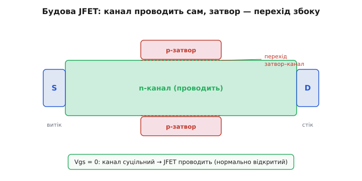
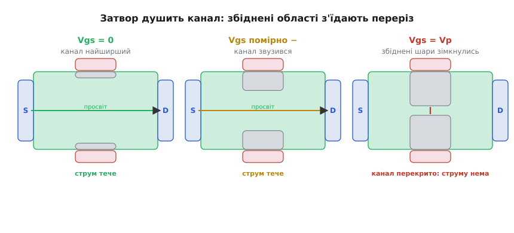
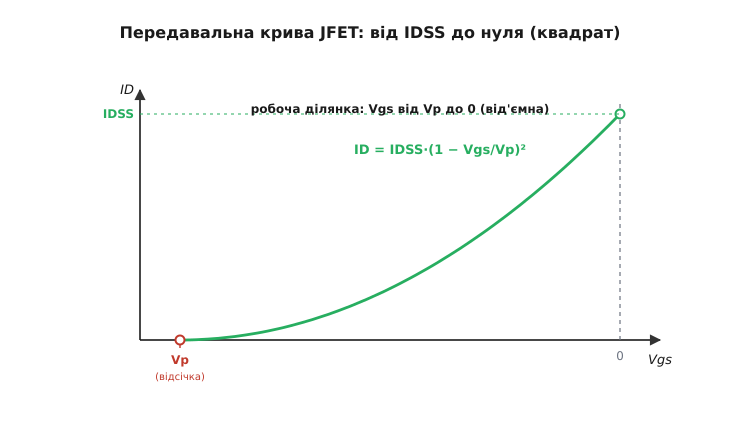
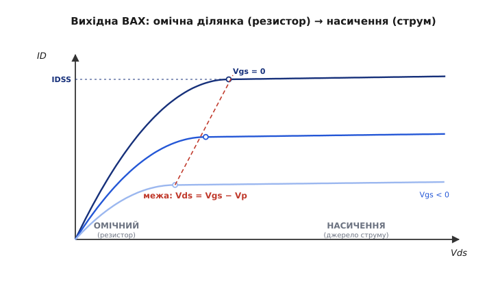

# JFET

Уявімо найпростіший спосіб керувати струмом, який лиш можна вигадати. Беремо брусок напівпровідника, з одного кінця заганяємо струм, з іншого знімаємо — він тече собі вільно, бо весь брусок провідний. Тепер питання: як цей струм **притиснути**, не торкаючись самих носіїв, не вмикаючи нічого в розрив, а лише **звузивши дорогу**, якою вони біжать? Виявляється, для цього є гарний фокус. Якщо обкласти брусок з боків і подати на ці боки напругу так, щоб вона **вижала** з країв каналу всі вільні носії, то провідним лишиться тільки вузький струмочок посередині. Дужче напруга — вужчий струмочок — менший струм. Так працює **JFET** — польовий транзистор із керівним переходом (англ. *Junction Field-Effect Transistor*).

Це найдавніший і концептуально найчистіший польовий транзистор: тут немає ні скла-ізолятора під затвором, ні наростання каналу. Канал тут — просто шматок напівпровідника, що проводить **завжди**, а затвор лише **звужує** його збоку електричним полем, нічого не вмикаючи й майже не споживаючи струму. Розберімо, як саме поле звужує канал, чому це дає керований напругою прилад, і де JFET досі незамінний, попри панування MOSFET.

### Канал, який проводить сам

Почнемо з того, чого в JFET немає, бо саме це його й вирізняє. У [MOSFET](book:electronics/mosfet-modes) затвор відділений від каналу тонким шаром скла, і поле крізь те скло **створює** канал з нічого. У JFET скла немає зовсім. Затвор тут — це другий шматок напівпровідника **протилежного типу**, притиснутий до каналу впритул, так що між ними утворюється p-n перехід — той самий перехід, що в звичайному діоді.

Канал — це, скажімо, тонка смужка n-напівпровідника (легованого, з вільними електронами). З одного її кінця висновок звуть **витоком** (англ. *source* — джерело, звідки електрони входять), з іншого — **стоком** (англ. *drain* — стік, куди вони витікають). Збоку до каналу прилягає область p-типу — це **затвор** (англ. *gate* — ворота, заслінка). Поки ми нічого не подаємо на затвор, канал — суцільний провідний n-брусок, і струм крізь нього тече вільно, як крізь звичайний резистор. JFET **нормально відкритий**: у спокої він проводить.


*N-канал тягнеться від витоку до стоку; з боків до нього прилягає p-область затвора. Межа між ними — звичайний p-n перехід. Поки затвор не зміщено, канал суцільний і проводить, як резистор. Уся гра — у тому, як перехід з боків з'їдатиме переріз каналу.*

Ось перша глибока думка: **керівний електрод тут не торкається струму**. Затвор і канал розділені переходом, а перехід, увімкнений у зворотному напрямі, струму не пропускає. Тому затвор діє **тільки полем** — як заряджена пластина поряд, що своїм полем розштовхує носіїв у каналі, але сама в той струм не лізе. Звідси й слово «польовий» у назві: керує **поле**, а не струм керування.

### Як перехід з'їдає канал

Тепер найважливіше — як саме затвор звужує канал. Усе тримається на одній властивості p-n переходу: довкола межі між p та n є **збіднена область** (англ. *depletion region* — спустошена) — тонкий прошарок, з якого носії пішли, тож він не проводить. Це наче ізолювальна плівка вздовж самого переходу. І ширина цієї плівки **залежить від напруги**: що сильніше перехід [зміщено у зворотному напрямі](book:electronics/diode-bias), то ширша збіднена область — вона **розповзається** в обидва боки від межі. (Зворотне зміщення — це коли мінус прикладено до p-області, а плюс до n: носіїв відтягує від межі, перехід струму не пускає, а збіднений шар ширшає тим більше, чим вища напруга.)

У JFET ми навмисне зміщуємо перехід затвор–канал **у зворотному напрямі**. Для n-канального приладу це означає подати на затвор напругу **від'ємну** відносно витоку (мінус на p-затвор, плюс на n-канал — це і є зворотне зміщення). Що робить це зворотне зміщення? Розширює збіднену область, і та **вгризається в канал з боків**, з'їдаючи його провідний переріз. Канал звужується. А вужчий канал — це більший опір, отже менший струм при тій самій напрузі стоку.


*Збіднені області (сірі) ростуть із боків каналу зі зворотним зміщенням затвора. При Vgs=0 канал широкий — малий опір. Від'ємніший затвор — товщі збіднені шари — вужчий провідний просвіт посередині — більший опір. Поле затвора душить струм, нічого в нього не вмикаючи.*

> 🔧 **Навіщо це.** Ось чому затвор JFET майже не споживає струму: ним керує **зворотно зміщений** перехід, а крізь зворотний перехід тече лише крихітний струм витоку — наноампери. Це означає, що джерело сигналу, яке керує затвором, не мусить **віддавати** майже жодного струму: воно лише **виставляє напругу**. Для давачів із величезним власним опором — скляних pH-електродів, п'єзокристалів, фотодіодів у режимі вимірювання заряду — це вирішальна перевага: JFET «слухає» їхню напругу, не навантажуючи й не спотворюючи її. Саме тому вхідні каскади найточніших підсилювачів десятиліттями будували на JFET.

Доведімо це звуження до краю. Робімо затвор усе від'ємнішим — збіднені області з обох боків ростуть назустріч одна одній і нарешті **змикаються** посередині. Провідного просвіту не лишається зовсім: канал **перекрито**. Ту напругу затвора, за якої канал змикається повністю й струм спадає (майже) до нуля, звуть **напругою відсічки** (англ. *pinch-off* — защемлення; позначають Vp або V_GS(off)). Для n-канального JFET вона від'ємна — скажімо, −3 В. Подали на затвор −3 В — канал зачинено, струму немає. Це природний «вимкнено» для JFET.

А що при нульовому затворі? Канал найширший, опір найменший, і крізь нього тече найбільший струм, який цей прилад узагалі дає при даній напрузі стоку. Цей струм має власну назву — **IDSS** (струм стік–витік при закороченому затворі, тобто при Vgs = 0). Між цими двома межами — від повного струму IDSS при Vgs = 0 до нуля при Vgs = Vp — і живе вся керівна дія JFET.

### Скільки струму: квадратичний закон

Як саме струм спадає від IDSS до нуля, поки затвор іде від 0 до Vp? Не лінійно. Збіднена область росте з напругою не прямо пропорційно (вона ширшає як корінь зі зміщення), а провідний переріз залежить від того, скільки каналу лишилось, — у підсумку струм виходить **квадратичною** функцією напруги затвора. У робочому, насиченому режимі (про нього — за мить) це знаменита формула Шоклі:

```
ID = IDSS · (1 − Vgs/Vp)²
```

Розберімо її на крайніх точках, бо саме там видно сенс. При Vgs = 0 дужка дорівнює (1 − 0) = 1, квадрат теж 1, і ID = IDSS — повний струм, як і має бути при відкритому навстіж каналі. При Vgs = Vp дужка дорівнює (1 − 1) = 0, і ID = 0 — канал перекрито, струму немає. Між ними струм пливе по параболі: спершу спадає повільно, далі дедалі крутіше, доганяючи нуль біля відсічки.


*Струм стоку залежно від напруги затвор–витік. При Vgs=0 струм найбільший — IDSS. Робимо затвор від'ємнішим — струм спадає по параболі й сягає нуля при напрузі відсічки Vp. JFET живе на цій кривій ліворуч від нуля: керують ним лише від'ємною (для n-каналу) напругою.*

Помітьте дуже важливу річ: уся робоча ділянка JFET лежить при Vgs **між Vp і нулем** — тобто при **від'ємній** (для n-каналу) напрузі затвора. Додатну напругу на затвор подавати **не можна**: вона змістила б перехід затвор–канал у **прямому** напрямі, той відкрився б, як звичайний діод, і крізь затвор ринув би струм — керування зникло б, а прилад міг би й згоріти. Тому JFET завжди керують у вузькому віконці від'ємних напруг, і це віконце задано наперед: від 0 до Vp.

> 🔧 **Навіщо це.** Квадратична крива — не просто формула для розрахунку, а характер приладу як підсилювача. Її **похила** ділянка означає, що мала зміна напруги затвора дає пропорційну зміну струму стоку — це і є підсилення. Крутість цієї кривої в робочій точці звуть **крутістю** характеристики (англ. *transconductance*, позначають gm) — скільки міліампер струму стоку додає кожен вольт на затворі. Що ближче робоча точка до Vgs = 0, то крива крутіша й підсилення більше; що ближче до відсічки — то крива пологіша й підсилення менше. Обираючи, де на цій кривій посадити транзистор, інженер задає підсилення каскаду.

**Приклад. JFET із IDSS = 10 мА і Vp = −4 В. Який струм стоку при Vgs = −1 В і при Vgs = −2 В?**
```
При Vgs = −1 В:
  1 − Vgs/Vp = 1 − (−1)/(−4) = 1 − 0.25 = 0.75
  ID = 10 мА · 0.75² = 10 · 0.5625 = 5.6 мА

При Vgs = −2 В:
  1 − Vgs/Vp = 1 − (−2)/(−4) = 1 − 0.5 = 0.5
  ID = 10 мА · 0.5² = 10 · 0.25 = 2.5 мА
```
Зсунули затвор на 1 В вниз — струм упав з 10 до 5.6 мА. Ще на 1 В — до 2.5 мА. Половина шляху до відсічки за напругою дає лише чверть струму: ось вона, квадратичність. Це повне виведення формули Шоклі — від ширини збідненого шару до інтеграла вздовж каналу — винесено в [окрему математичну вставку](book:electronics/jfet/math-shockley-law.md).

### Два режими каналу: змінний резистор і джерело струму

Дотепер ми дивилися лише на затвор. Та струм залежить ще й від напруги **стік–витік** (Vds) — від того, наскільки сильно ми «тягнемо» струм крізь канал. І тут, як у будь-якого польового приладу, відкривається, що канал має **два різні режими**, залежно від Vds.

Поки напруга стоку **мала**, JFET поводиться просто як **резистор**, опором якого керує затвор. Більша Vds — пропорційно більший струм; від'ємніший затвор — вужчий канал — більший опір. Цей режим звуть **омічним** (або тріодним): транзистор тут — це **керований напругою опір**. І це, до речі, окрема цінна роль JFET: вийшов готовий змінний резистор без рухомих частин, опором якого крутить напруга на затворі.

Чому омічний режим триває не вічно? Бо напруга вздовж каналу не однакова. Струм тече крізь опір каналу, тож від витоку до стоку потенціал **наростає** — біля стоку він вищий. А виходить, що зворотне зміщення переходу затвор–канал біля стоку **більше**: там до напруги самого затвора додається ще й піднятий потенціал каналу. Отже, збіднена область біля стоку **товща**, і канал там вужчий — він стає схожий на клин, тонкий з боку стоку.

Підіймаймо Vds далі. Канал біля стоку звужується дедалі сильніше, і за певної Vds він там **защемлюється** — переріз біля стоку падає майже до нуля. Можна було б думати, що це обірве струм, — але стається протилежне: струм **застигає на сталому рівні** й далі майже не росте з Vds. Це режим **насичення**. Носії, дійшовши до защемленої точки, не зникають — їх підхоплює сильне поле збідненої області й переносить до стоку; а вся напруга, що ми додаємо понад точку защемлення, падає на тій короткій защемленій ділянці, тоді як на провідній частині каналу лишається та сама напруга. Канал «бачить» сталу напругу — і жене сталий струм.


*Струм стоку від напруги стік–витік для кількох значень Vgs. Зліва, поки Vds мала, — омічний режим: струм круто росте (канал як резистор). Праворуч — насичення: струм виходить на майже горизонтальну поличку (джерело струму). Що ближче затвор до нуля, то вища полиця. Верхня крива (Vgs=0) виходить рівно на IDSS.*

Отже, **той самий** JFET — це два різні прилади. В омічному режимі він — **керований резистор**; у насиченні — **кероване напругою джерело струму**, і саме там його ставлять підсилювати сигнал, бо там струм стоку слухається затвора й майже не залежить від напруги навантаження.

> 🔧 **Навіщо це.** Найвдячніше застосування насичення в JFET — найпростіше у світі **джерело сталого струму**. З'єднайте затвор просто з витоком (Vgs = 0) — і JFET у насиченні жене струм IDSS, ні від чого не залежний: ні від напруги живлення, ні від навантаження, поки вистачає Vds. Виходить двовивідне джерело струму всього з одного транзистора — без жодного зовнішнього зміщення. На цьому принципі роблять готові двовивідні «струмові діоди» (англ. *current-limiting diode*), що тримають заданий струм у широкому діапазоні напруг. Звичайному [MOSFET](book:electronics/mosfet-switch) такого не зробити одним приладом — він нормально закритий і сам по собі не проводить.

### Чим JFET відрізняється від MOSFET — і чому досі живий

Зведімо різницю, бо вона визначає, де кожен працює. І JFET, і MOSFET керуються [полем](book:electronics/field-control), і обидва мають дуже високий вхідний опір. Але влаштовані вони протилежно в одному: **звідки береться канал**.

У MOSFET (збагаченого, а таких більшість) каналу спершу немає, і поле крізь скло-ізолятор його **створює** — прилад нормально **закритий**. У JFET канал є з заводу, а перехід затвора його лиш **звужує** — прилад нормально **відкритий**. Тому JFET за духом ближчий не до звичайного MOSFET, а до рідкісного [збіднювального MOSFET](book:electronics/mosfet-modes): обидва проводять у спокої й закриваються від'ємною напругою. Різниця між цими двома — у тому, як зроблено затвор: у збіднювального MOSFET це ізольований затвор за склом, у JFET — зворотно зміщений p-n перехід.

З цієї однієї відмінності випливає все інше:

- **Затвор не пробити статикою.** У MOSFET тонке скло затвора легко проколює статичний заряд — звідси вічна морока з ESD. У JFET затвор — це перехід, а не плівка скла; пробити його статикою набагато важче, тож JFET витриваліший до необережного поводження.
- **Майже нульовий шум і струм затвора.** Зворотний перехід дає мізерний струм витоку й дуже **тихий** вхід. Тому JFET — улюблений прилад для входу [малошумних підсилювачів](book:electronics/lna-low-noise-amplifier) і вимірювальних каскадів, де важить кожен мікровольт шуму.
- **Тільки збіднення, лише від'ємний затвор.** JFET не можна «підкрутити» додатною напругою понад IDSS — перехід відкриється. MOSFET у цьому гнучкіший, тож у цифровій логіці й силових ключах панує саме він.

Тому поділ ролей такий. Уся цифрова мікроелектроніка й силова комутація — на MOSFET: там потрібен нормально-закритий ключ, який вмикають напругою, і мільярди таких на кристалі. А JFET лишився там, де його властивості незамінні: **вхідні каскади** точних і малошумних аналогових підсилювачів, **давачі** з гігантським власним опором, прості **джерела струму**, високочастотні аналогові вузли. Найкраще двох поєднує гібрид: вхід на JFET (тихий, високоомний), решта — на біполярних чи КМОН-транзисторах; так влаштовані класичні «BiFET» операційні підсилювачі.

Думку про те, хто, коли й як винайшов цей прилад, винесено в [історичну вставку](book:electronics/jfet/hist-shockley-dacey-ross.md): теорію JFET дав Шоклі 1952 року, а перший робочий прилад зробили Дейсі та Росс у 1953-му — і це окрема цікава історія про те, як теорія випередила залізо.

### Складімо все докупи

JFET — це брусок напівпровідника-каналу, що проводить **сам**, і притиснутий до нього збоку p-n перехід затвора, який електричним полем **звужує** цей канал, нічого в нього не вмикаючи. Зворотне зміщення затвора розширює збіднену область, та з'їдає переріз каналу; при напрузі відсічки Vp канал змикається й струм зникає, при Vgs = 0 канал найширший і дає струм IDSS. Між цими межами струм іде по квадратичній кривій Шоклі. За малої напруги стоку JFET — керований резистор, за великої — кероване джерело струму; межа між ними там, де канал защемлюється біля стоку.

А вся його неповторність — в одному рішенні: зробити затвор **переходом**, а не ізолятором. Звідси й нормально-відкритий канал, і мізерний струм затвора, і низький шум, і стійкість до статики, і заборона на додатний затвор — усе це наслідки тієї єдиної ідеї керувати каналом збоку, зворотно зміщеним переходом.
