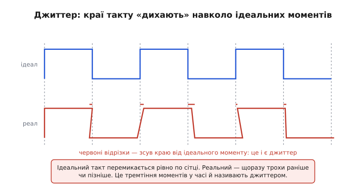
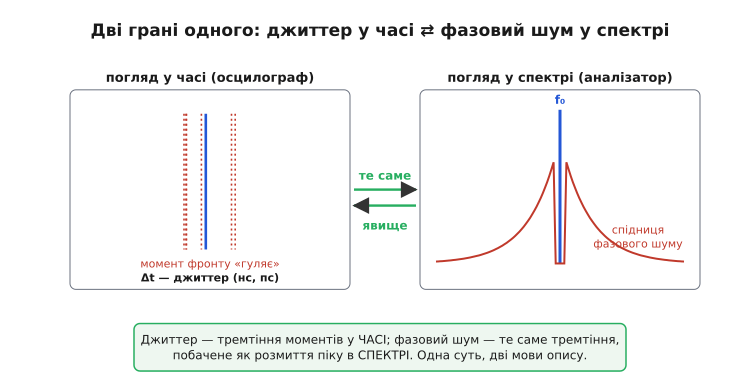
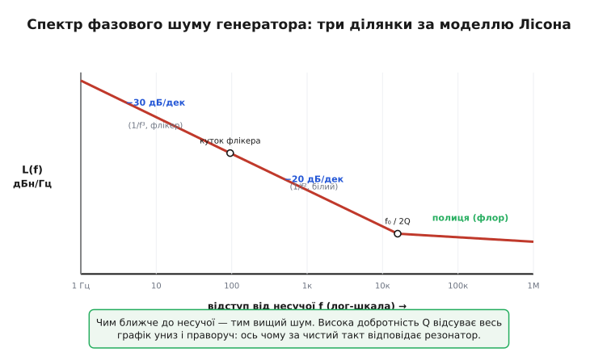
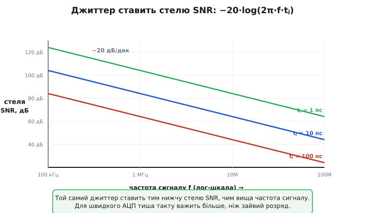

# Джиттер і фазовий шум: чому ідеального такту не існує і чим його тремтіння міряти

Намалюйте на папері ідеальний тактовий сигнал: рівні сходинки, фронти рівно через мільйонну частку секунди, такт у такт, без кінця. А тепер під'єднайте до виходу справжнього кварцового генератора найкращий осцилограф і ввімкніть «післясвічення», щоб екран накладав сотні розгорток одну на одну. Малюнок попливе. Фронт, що мав ставати рівно в свій момент, щоразу стає трохи раніше або трохи пізніше — і там, де на папері була тонка вертикаль, на екрані з'явиться розмита смуга. Той ідеальний такт ніде не живе. Будь-яке реальне джерело частоти трясе моменти своїх переходів дрібно й випадково, і це тремтіння має дві назви — залежно від того, з якого боку на нього дивитись.

Подивитися можна **з боку часу**: наскільки кожен край зсунутий від свого ідеального моменту. Цю міру звуть **джиттер** (англ. *jitter* — тремтіння, сіпання) і вимірюють у секундах — найчастіше в пікосекундах. Можна подивитися й **з боку частоти**: ідеальна синусоїда дала б у спектрі одну-єдину нескінченно тонку лінію на своїй частоті, а реальна розмазує її в «спідницю» обабіч. Цю міру звуть **фазовий шум** (*phase noise*) і вимірюють у децибелах відносно несучої на герц смуги. Два слова, два прилади, дві одиниці — а під ними одне фізичне явище: фаза сигналу не стоїть, де належить, а дрейфує.

> 🔧 **Навіщо це.** Тремтіння такту — не академічна тонкість, а те, що ставить стелю цілим класам пристроїв. Швидкий АЦП із чудовою розрядністю видасть шум гірший за дешевий, якщо тактувати його брудним генератором: момент вибірки «гуляє», і кожен відлік береться трохи не там, де треба. Радіоприймач із зашумленим гетеродином не розрізнить сусідні канали — спідниця фазового шуму одного забиває сигнал іншого. Послідовний інтерфейс на гігабітах «зачинить око» діаграми, якщо фронти приходять не вчасно. Хто вміє читати джиттер і фазовий шум, той знає, скільки реально варта «частота» в даташиті й де вона зіпсує систему.

## Спершу — що саме тремтить

Корисно одразу відділити, **що** дрейфує, від того, **як сильно**. Візьмімо чисту синусоїду й запишімо її чесно, з усіма недосконалостями:

```
v(t) = A · sin(2π·f₀·t + φ(t))
```

Тут A — амплітуда, f₀ — номінальна частота, а φ(t) — **миттєва фаза-домішка**: маленьке випадкове число, що в ідеалі дорівнювало б нулю, але насправді весь час совається. Саме оце φ(t) і є джерело всього. Амплітуда A теж буває нестабільна (амплітудний шум), та для тактів і несучих вона майже завжди другорядна: схеми, що ловлять момент переходу через нуль, на висоту хвилі майже не зважають, а на її фазу — повністю. Тому домовмося: говоримо про **фазу**, амплітуду лишаємо осторонь.

Тепер ключовий місток, що зв'язує дві назви воєдино. Фаза й час на схилі синусоїди жорстко зчеплені: коли хвиля проходить через нуль, вона рухається з певною крутістю, і зсув фази на Δφ радіан означає зсув моменту переходу на Δt секунд. Скільки саме? Повний оберт 2π радіан хвиля проходить за один період 1/f₀, тож пропорція пряма:

```
Δt = Δφ / (2π·f₀)
```

Ось і вся таємниця двох імен. **Джиттер Δt** — це фаза-домішка φ(t), переведена з радіанів у секунди через дільник 2π·f₀. **Фазовий шум** — це та сама φ(t), розкладена за частотами свого дрейфу. Одне число у часі, один спектр у частоті, а посередині — проста ділянка на 2π·f₀. Звідси одразу видно й те, що збиватиме з пантелику пізніше: **той самий фазовий дрейф на вищій частоті дає менший джиттер у секундах** — бо період коротший, і ті самі радіани займають менше часу. Запам'ятайте цю асиметрію, вона ще повернеться.


*Зверху ідеальний меандр: фронти точно на пунктирній сітці. Знизу реальний: кожен край зсунутий на дрібну випадкову величину (червоні відрізки). Це тремтіння моментів переходу й називають джиттером; міряють його в секундах — зазвичай пікосекундах.*

## Дві грані одного: тремтіння в часі ⇄ спідниця в спектрі

Чому одне явище взагалі описують двома способами, а не одним? Бо два прилади бачать його по-різному, і кожен погляд зручний для свого. Поставте сигнал на **осцилограф** із синхронізацією по самому ж сигналу — фронт «дихатиме» туди-сюди, і ви прямо зміряєте розкид моментів у пікосекундах. Це джиттер: природна мова для цифрового світу, де все вирішується тим, чи встиг край у своє вікно.

Поставте той самий сигнал на **аналізатор спектра** — і побачите не лінію, а пік зі схилами. Якби фаза стояла мертво, уся енергія сиділа б в одній нескінченно вузькій лінії на f₀. Але φ(t) повільно совається, і кожне її коливання з якоюсь частотою «розмазує» частину енергії несучої на сусідню частоту — рівно настільки вбік, наскільки швидко дрейфує фаза. Сума всіх цих дрейфів і малює спідницю обабіч піку. Це фазовий шум: природна мова радіо, де поряд із вашою несучою стоїть чужий канал, і важить, наскільки ваша спідниця в нього залазить.


*Ліва панель — погляд осцилографа: момент фронту «гуляє», розкид Δt і є джиттер. Права — погляд аналізатора спектра: ідеальна несуча була б тонкою лінією, реальна обростає спідницею фазового шуму. Одне явище, дві мови опису, пов'язані переходом Δt = Δφ/(2π·f₀).*

Міру фазового шуму позначають L(f) (читають «скрипт-ел від еф») і подають **у децибелах відносно несучої, на герц смуги** — скорочено дБн/Гц (англ. *dBc/Hz*, *c* — *carrier*, несуча). Запис «L(10 кГц) = −110 дБн/Гц» читається так: на відступі 10 кГц убік від несучої, у смузі шириною 1 Гц, потужність шуму на 110 дБ нижча за потужність самої несучої. Логарифмічна шкала тут не примха: шум коло несучої й далеко від неї різниться на багато порядків, і лінійна вісь їх не вмістить — точно з тих самих міркувань, що скрізь, де [децибел](book:electronics/decibels) рятує від дев'яти порядків на одній осі.

> Чому шум вимірюють саме «на герц смуги» (спектральна щільність), звідки в дБн/Гц з'являється цей «на герц», і чому ширша смуга вимірювання дає більше шуму, — те саме поняття шумової спектральної щільності, з якого виростає й [шумова смуга](book:electronics/noise-bandwidth) у звичайних підсилювачах. Тут ми беремо дБн/Гц як готову мову й читаємо в ній рівні фазового шуму.

## Звідки береться спідниця: модель генератора

Чому взагалі фаза не стоїть на місці? Бо всередині будь-якого генератора сидять джерела шуму — теплове тремтіння електронів у резисторах, дробовий шум переходів, фліковий («1/f») шум транзисторів. Цей шум підмішується до сигналу й совається його фазу. Але форма спідниці не випадкова: вона має характерні ділянки, і їхнє пояснення дав ще 1966 року американський інженер Девід Лісон у короткій статті «Проста модель спектра шуму генератора зі зворотним зв'язком».

Картина Лісона — усталений результат, на який спираються досі. Чим ближче до несучої, тим вищий шум; із віддаленням він спадає сходинками різної крутості:

```
далеко від f₀:   плоска полиця         — білий шум, фаза просто «підмішана»
ближче:          спад −20 дБ/декаду    — той самий шум, але резонатор його накопичує
ще ближче:       спад −30 дБ/декаду    — флікер-шум (1/f) активного приладу
```

Чому коло несучої шум круто росте, а не лишається плоским? Бо резонатор генератора (кварц, LC-контур) поводиться як вузький фільтр-маховик: повільні дрейфи фази він **накопичує**, а не гасить, тоді як швидкі — давить. Що повільніший дрейф (менший відступ від несучої), то сильніше резонатор дає йому накопичитися — звідси підйом до центру. А найповільніший, найпідліший флікер-шум активного приладу додає ще крутіший схил у самісінькій близькості до f₀.


*Три ділянки спектра фазового шуму за моделлю Лісона. Біля несучої панує флікер-шум (−30 дБ/декаду), далі — білий шум, накопичений резонатором (−20 дБ/декаду), ще далі — плоска шумова полиця. Куток між схилами на f₀/2Q: чим вища добротність Q, тим увесь графік нижчий і зсунутий до несучої.*

Звідси випливає головна інженерна важіль-ручка чистоти: **добротність резонатора**. У формулу Лісона добротність [Q](book:electronics/quality-factor) входить так, що подвоєння Q опускає всю криву фазового шуму вчетверо (на 6 дБ) у вирішальній ділянці. Ось чому кварц із Q у десятки тисяч дає такт у тисячі разів чистіший за RC-генератор із Q близьким до одиниці, і чому за по-справжньому тихий сигнал завжди відповідає високодобротний резонатор, а не сам по собі підсилювач.

> Звідки точно береться форма L(f), як добротність, потужність сигналу й коефіцієнт шуму активного приладу входять у формулу Лісона, чому злам стоїть саме на f₀/2Q і за яких умов модель перестає працювати — в історичній вставці [як Лісон пояснив спектр генератора](book:electronics/jitter-phase-noise/hist-leeson-1966.md). Тут досить картини трьох ділянок і ролі Q.

Сам механізм, що породжує й **утримує** стабільну частоту — підсилювач, охоплений резонатором у петлю зі зворотним зв'язком, — це окрема велика тема; як збирають такий вузол на кварці, описано в темі про [генератор П'єрса](book:electronics/pierce-oscillator), а як готову опорну частоту вибирають для системи — у темі про [опорну частоту](book:electronics/reference-frequency). Фазовий шум — це міра того, наскільки добре цей вузол тримає фазу.

## Від спектра до пікосекунд: як порахувати джиттер

Радіоінженер живе зі спідницею L(f), цифровий — із пікосекундами джиттера. Між ними є точний міст, і його варто розуміти, бо саме він з'являється в даташитах генераторів рядком «RMS jitter, integrated 12 kHz–20 MHz».

Логіка прямо випливає з того, що φ(t) і час пов'язані дільником 2π·f₀. Спектр L(f) каже, скільки фазового тремтіння припадає на кожну частоту дрейфу. Щоб дістати **повне** середньоквадратичне тремтіння фази, треба скласти внески з усіх частот — тобто проінтегрувати L(f) по смузі, яка нас цікавить. Корінь із цієї суми дає середньоквадратичний дрейф фази в радіанах, а діл на 2π·f₀ переводить його в секунди:

```
σt = (1 / 2π·f₀) · √( ∫ 2·10^(L(f)/10) df )
```

Множник 2 під коренем — бо спідниця має два боки (вище й нижче несучої), а інтегруємо ми один; степінь 10^(L/10) — звичайний перехід від децибелів назад до разів. Головне тут не сама формула, а її наслідок: **джиттер залежить від того, у якій смузі ви його рахуєте.** Назвати «джиттер 1 пс» без меж інтегрування — те саме, що назвати відстань без одиниць. Тому в даташитах завжди стоять межі: «12 кГц – 20 МГц» — це домовлена смуга, у якій інтегрують фазовий шум, щоб числа різних виробників можна було чесно зіставити.

> Покрокове виведення цього інтеграла — чому площа під L(f) дає дисперсію фази, звідки береться множник 2, як від спектральної щільності перейти до радіанів і далі до секунд, і чому без меж смуги число джиттера беззмістовне — у математичній вставці [як зі спектра фазового шуму дістати джиттер у секундах](book:electronics/jitter-phase-noise/math-phase-noise-to-jitter.md).

## Чому це болить найдужче на швидкому АЦП

Тепер найважливіший практичний наслідок — той, заради якого джиттер узагалі потрапляє в специфікації. Коли [АЦП](book:electronics/adc) бере відлік, він замикає вибірку в момент, заданий тактовим фронтом. Якщо фронт прийшов на Δt раніше чи пізніше, перетворювач спіймає сигнал **не в той момент** — а отже, не те значення. На скільки помилиться? Рівно настільки, наскільки сигнал устиг змінитися за час Δt. Для повільного сигналу це дрібниця; для швидкого — катастрофа, бо за ті самі пікосекунди він проходить велику частину розмаху.

Запишімо це чесно. Швидкість зміни синусоїди — її похідна; найбільша вона на переході через нуль і дорівнює 2π·f·A. Помилка вибірки — швидкість, помножена на тремтіння часу:

```
Δv = (2π·f·A) · Δt
```

Звідси видно одразу: помилка від джиттера росте **прямо пропорційно частоті сигналу f**. Подвоїли частоту входу — подвоїли шум від того самого джиттера. Переведемо це у відношення сигнал/шум — і дістанемо одну з найвживаніших формул швидкої техніки, **стелю SNR, яку ставить джиттер**:

```
SNR[дБ] = −20 · log₁₀(2π · f · tj)
```

де f — частота вхідного сигналу, tj — середньоквадратичний джиттер такту в секундах. Це **усталений результат**, що його наводять усі довідники з перетворювачів. Він жорстокий: SNR падає на 20 дБ за кожну декаду частоти. Той самий генератор, що дає бездоганний звук на 20 кГц, на 200 МГц обмежить АЦП до десятка ефективних розрядів — не через розрядність перетворювача, а через тремтіння такту.


*Кожна пряма — гранична стеля SNR для свого рівня джиттера, як функція частоти вхідного сигналу. Стеля спадає на 20 дБ за декаду: що швидший сигнал, то нижчий SNR від того самого тремтіння. Для високочастотного АЦП тиша такту важить більше, ніж зайвий розряд перетворювача.*

**Стеля SNR від джиттера на проміжній частоті.** Тактуємо АЦП генератором із джиттером 1 пс (RMS) і подаємо на вхід синусоїду 10 МГц. Який SNR щонайбільше можливий — навіть якби сам перетворювач був ідеальний?

:::tabs
```cpp
#include <cmath>
#include <numbers>

// Стеля SNR, яку ставить тремтіння такту (джиттер).
// f  — частота вхідного сигналу, Гц;  tj — RMS-джиттер, с.
float jitter_snr_db(float f, float tj) {
    return -20.0f * std::log10(2.0f * std::numbers::pi_v<float> * f * tj);
}

float f  = 10.0e6f;     // 10 МГц вхід
float tj = 1.0e-12f;    // 1 пс RMS джиттер такту

float snr = jitter_snr_db(f, tj);
// 2π·f·tj = 6.2832 · 1e7 · 1e-12 = 6.283e-5
// SNR = -20·log10(6.283e-5) ≈ 84.0 дБ
```
```c
#include <math.h>

// Стеля SNR, яку ставить тремтіння такту (джиттер).
// f  — частота вхідного сигналу, Гц;  tj — RMS-джиттер, с.
float jitter_snr_db(float f, float tj) {
    return -20.0f * log10f(2.0f * 3.14159265f * f * tj);
}

float f  = 10.0e6f;     // 10 МГц вхід
float tj = 1.0e-12f;    // 1 пс RMS джиттер такту

float snr = jitter_snr_db(f, tj);
// 2π·f·tj = 6.2832 · 1e7 · 1e-12 = 6.283e-5
// SNR = -20·log10(6.283e-5) ≈ 84.0 дБ
```
:::

Вісімдесят чотири децибели — це стеля приблизно чотирнадцяти ефективних розрядів. Поставите 16-розрядний АЦП — два його старші розряди втопить джиттер, і платити за них немає сенсу, поки не зробите такт тихішим. А підніміть вхід до 100 МГц — стеля впаде до 64 дБ, ніби ви викинули ще три розряди, хоча в перетворювачі не змінилось нічого. Ось чому в швидких системах за тактовий генератор б'ються не менше, ніж за сам АЦП: тиша такту прямо перетворюється на розряди.

> 🔧 **Навіщо це.** Ця формула — перше, що рахують, обираючи генератор для швидкого АЦП. Спочатку з потрібного SNR і максимальної частоти сигналу знаходять допустимий джиттер tj, а вже тоді шукають генератор, чий інтегрований джиттер у робочій смузі вкладається в цей бюджет. Пропустити цей крок — типова дорога помилка: купують прецизійний перетворювач, тактують його абияким кварцом і не розуміють, чому ефективних розрядів удвічі менше за паспортні. Джиттер не «десь там у радіо» — він прямо з'їдає ваші біти.

## Джиттер буває різний: випадковий і детермінований

Дотепер ми мовчки вважали тремтіння суто випадковим — гаусовим шумом, що однаково сіпає край в обидва боки. Такий **випадковий джиттер** (*random jitter*) справді породжується тепловим і флікер-шумом, він не має меж (теоретично колись трапиться скільзавгодно великий викид) і тому його описують середньоквадратичним значенням та статистикою, а не «розмахом».

Та на практиці край часто зсуває й цілком **детермінований джиттер** (*deterministic jitter*) — не випадковий, а прив'язаний до чогось конкретного. Наводка від сусідньої шини живлення на частоті 50 Гц чи від імпульсного перетворювача períodично штовхає фазу туди-сюди — це джиттер, що повторюється. Залишки сусіднього цифрового сигналу, що пролазять через перехресну ємність, зсувають край залежно від того, які біти йдуть поруч. Невідповідність опорів лінії відбиває фронт і змішує його з наступним. У такого джиттера є **межа розмаху** (він не росте безмежно), зате він має структуру — і часто його можна вистежити й прибрати, на відміну від випадкового, який лишається тільки давити тишею джерела.

Розрізняти їх важливо, бо міряють їх по-різному. Випадковий характеризують середньоквадратичним числом і екстраполюють на рідкісні викиди; детермінований — розмахом «від краю до краю». Сумарний джиттер на діаграмі ока цифрового каналу складається з обох, і саме їхня сума вирішує, чи «зачиниться» око на потрібній швидкості. Плутати їх — означає або дарма ганятися за тишею джерела там, де насправді винна наводка, або навпаки, екранувати наводку там, де межу ставить чистий тепловий шум.

## Як із цим борються

Розуміння природи джиттера прямо підказує важелі. Перший і головний — **високодобротний резонатор**: оскільки фазовий шум падає з квадратом Q, перехід від RC-генератора до кварцу, а від кварцу до термостатованого чи атомного стандарту щоразу опускає спідницю на порядки. Другий — **чисте живлення генератора**: будь-яке тремтіння напруги живлення модулює частоту й підмішується у фазовий шум, тому тихий генератор завжди живлять окремо й ретельно фільтрують. Третій — **тримати такт подалі від цифрового бруду**: коротка лінія, узгоджений опір, екран, окрема земля, щоб сусідні сигнали не зсували фронт наводкою.

А коли потрібну частоту треба не просто мати, а **синтезувати** з опорної (скажімо, дістати 2.4 ГГц із 25 МГц кварцу), у гру входить ціла схема — фазове автопідстроювання частоти. Вона множить частоту, та разом із нею множить і фазовий шум опорного джерела, і ще домішує власний — тож проєктування синтезатора великою мірою і є боротьба за фазовий шум на виході.

> Як працює петля, що ловить фазу опорного сигналу й переносить його чистоту на іншу частоту, чому вона множить фазовий шум опори на квадрат коефіцієнта ділення й де в ній стоїть власне джерело джиттера, — у темі [фазове автопідстроювання частоти (PLL)](book:electronics/phase-locked-loop). Тут досить знати, що синтез частоти — це окрема арена тієї самої боротьби за тишу фази.

## Що варто винести

Джиттер і фазовий шум — два імені одного явища: фаза реального сигналу не стоїть, де належить, а дрейфує. **Джиттер** дивиться на цей дрейф **з боку часу** (розкид моментів переходу, у пікосекундах), **фазовий шум** — **з боку частоти** (спідниця обабіч несучої, у дБн/Гц); зв'язує їх простий перехід Δt = Δφ/(2π·f₀), і звідси випливає, що той самий фазовий дрейф на вищій частоті дає менший джиттер у секундах. Спектр фазового шуму має характерні ділянки (флікер, білий, полиця), а головна ручка його чистоти — добротність резонатора: шум падає з квадратом Q, тому за тихий такт відповідає кварц чи кращий резонатор, а не підсилювач. Щоб перейти від спектра до пікосекунд, фазовий шум інтегрують по смузі — і без меж цієї смуги число джиттера беззмістовне. Найболючіший практичний наслідок — стеля SNR швидкого АЦП: SNR = −20·log(2π·f·tj) падає на 20 дБ за декаду частоти входу, тож на високих частотах тиша такту прямо з'їдає ефективні розряди. Нарешті, джиттер буває випадковий (тепловий, без меж, давиться лише тишею джерела) і детермінований (наводки, відбиття — зі структурою, який часто можна вистежити). Хто бачить такт очима фазового шуму, той знає: «частота» в даташиті варта рівно стільки, наскільки тихо вона тримає свою фазу.

---
