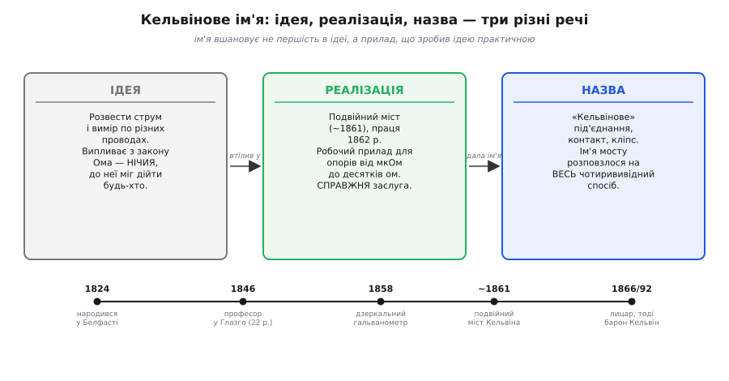

# 📜 Кельвін і вимір дрібних опорів

Назва «Кельвінове під'єднання» носить ім'я конкретної людини — і це не данина моді чи випадковий ярлик. За ним стоїть реальний фізик, реальна задача, що його мучила, і реальний прилад, який він зібрав, щоб цю задачу здолати. Варто пройти цей шлях по-справжньому, бо тоді стає видно тонку, але важливу річ: ім'я Кельвіна закріпилося не за **ідеєю** розвести струм і вимір — ця думка проста й нікому конкретному не належить, — а за **мостом**, який він побудував, і вже від мосту перейшло на весь чотирививідний спосіб. Розрізнити ідею, реалізацію й пізню назву — і є головний урок цієї історії.

## Хто такий Вільям Томсон

Людину, чиє ім'я ми вимовляємо щоразу, кажучи «кельвінові кліпси» чи «чотири дроти по-кельвіну», звали **Вільям Томсон** (*William Thomson*). «Кельвін» — це титул, який він дістав аж під кінець життя; а народився він просто Томсоном, **26 червня 1824 року в Белфасті**, на півночі Ірландії. Це усталений факт, звірений за кількома незалежними життєписами.

Тут варто бути точним щодо ідентичності, бо її часто стискають до одного слова. Томсон — **ірландсько-шотландський** фізик: ірландець за місцем народження (Белфаст), але майже все доросле життя й усю наукову кар'єру він провів у **Шотландії**, в Університеті Глазго. Батько його, **Джеймс Томсон** (*James Thomson*), сам математик, перебрався з родиною до Глазго викладати, коли Вільям був ще хлопчиком, — і відтоді доля Вільяма зрослася з цим містом. Тож «ірландський» і «шотландський» тут не суперечать одне одному, а називають різні виміри: де народжений і де працював. Британським підданим він був за громадянством — але звести його просто до «британця» означало б стерти і ірландський корінь, і шотландське середовище, у якому він став собою.

Як науковець Томсон був дитям-вундеркіндом у буквальному сенсі. До університету Глазго він вступив у **десять років** (тоді туди брали й таких юних на загальні студії), а **1846 року, у двадцять два**, його одностайно обрали **професором натурфілософії** (так у ті часи звали фізику — від грецького кореня, «філософія природи») того ж таки Університету Глазго. На цій кафедрі він просидів **п'ятдесят три роки** — фактично до кінця століття, рідкісне за тривалістю професорство. Усе це — звірені, усталені дати.

> 🔧 **Навіщо це.** Знати, що за терміном стоїть жива людина зі своєю задачею, — не порожня ерудиція. Це рятує від частої помилки думати, ніби «Кельвінове під'єднання» — якесь окреме хитре явище природи. Ні: це інженерний прийом, придуманий конкретним фізиком під конкретну біду. Зрозумієте біду — і прийом стане очевидним, а не магічним.

Натурфілософом у вузькому сенсі Томсон не лишився. Він був і теоретиком, і практиком водночас — поєднання нечасте. З одного боку, його ім'я стоїть біля самих основ **термодинаміки**: він був серед тих, хто сформулював її перший і другий закони, і саме його іменем названо **абсолютну шкалу температури** — ту, де нуль лежить при −273.15 °C, а одиниця зветься **кельвін**. З іншого боку, він був інженером до кінчиків пальців: винаходив прилади, брав патенти, керував практичними проєктами. Саме цей другий, інженерний бік і привів його до задачі про дрібні опори.

## Чому його взагалі турбували малі опори: телеграф через океан

Щоб зрозуміти, **навіщо** Томсонові знадобилося точно міряти крихітні опори, треба згадати найбільший інженерний проєкт його доби — **трансатлантичний телеграфний кабель**. У середині XIX століття Європу й Америку взялися з'єднати телеграфом, проклавши мідний провідник по дну океану, через тисячі кілометрів солоної води. Томсон був головним науковим розумом цієї затії.

А кабель завдовжки в тисячі кілометрів — це сам по собі ланцюг опору, ємності й витоків, де кожна дрібниця множиться на величезну довжину. Сигнал, що приходив на інший бік океану, був **мізерним** — ледь відрізнявся від нуля. Щоб його впіймати, Томсон винайшов **дзеркальний гальванометр** (*mirror galvanometer*, 1858): крихітне дзеркальце на нитці з магнітом, що від найслабшого струму поверталося й кидало промінь світла на шкалу, разюче підсилюючи кволий сигнал. Згодом він додав **сифонний самописець** (*siphon recorder*), що чорнилом записував коливання сигналу на стрічку. Ключові частини цієї системи він запатентував 1858 року.

Уся ця робота навчила Томсона однієї речі назубок: **на великих відстанях і малих сигналах кожен зайвий ом, кожне кепське з'єднання — ворог**. Опір самого провідника, опір місць паяння й контактів, опір стиків — усе це доводилося знати **точно**, бо від цього залежало, чи пройде сигнал крізь океан узагалі. А провідники телеграфу були товсті, з опором у частки ома на ділянку — рівно та область, де звичайні методи виміру брехали.

Заслуги Томсона на цьому терені визнали гучно. **1866 року**, за роботу над трансатлантичним кабелем, його **посвятили в лицарі** — він став сером Вільямом Томсоном. А ще пізніше, **1892 року**, дістав **баронський титул і став бароном Кельвіном** (*Baron Kelvin of Largs*) — на честь річки **Кельвін** (*Kelvin*), що тече повз Університет Глазго. Ось звідки, нарешті, взялося ім'я «Кельвін»: не з самого приладу, а з річечки біля його університету, що дала титул людині, яка той прилад зробила. Відтоді Вільяма Томсона світ і знає переважно як **лорда Кельвіна**.

> 🔧 **Навіщо це.** Зверніть увагу на ланцюг причин: реальна, велика інженерна задача (телеграф через океан) → гостра потреба точно знати малі опори → інструмент, що цю потребу закриває. Так народжується більшість техніки. Кельвінове під'єднання — не теоретична забаганка, а відповідь на конкретний промисловий виклик своєї доби. І сьогодні воно потрібне з тієї ж причини: усюди, де сигнал малий, а опір з'єднань співмірний з вимірюваним.

Принагідно Томсон занурився і в **еталони опору** як такі. На початку 1860-х він публікував праці про абсолютний вимір електричного опору й працював у комітетах Британської асоціації сприяння науці (*BAAS*), що саме тоді встановлювали стандартну одиницю — попередницю сучасного **ома**. Людина, що допомагає **визначити сам ом**, неминуче впирається в питання: а як точно зміряти його дрібні частки? Звичайні методи тут підводили — і Томсон узявся це виправити.

## У чому була пастка звичайного мосту

Щоб оцінити, що саме зробив Томсон, треба знати, з чим він працював. Найточнішим способом міряти опір у ті часи був **міст** — схема, де невідомий опір порівнюють із відомим через рівновагу чотирьох плечей. Тут варто на хвильку спинитися й віддати належне справжнім авторам, бо з назвою цієї схеми сталася повчальна історична несправедливість.

Схему, яку весь світ зве **мостом Вітстона** (*Wheatstone bridge*), насправді придумав **не Вітстон**. Її вперше описав **Семюел Гантер Крісті** (*Samuel Hunter Christie*) у своїй доповіді ще **1833 року**. Та опис Крісті лишився майже непоміченим. А **десять років по тому, 1843-го**, на схему натрапив куди відоміший **Чарлз Вітстон** (*Charles Wheatstone*), оцінив її й голосно про неї розповів — і відтоді ім'я приклеїлося до нього. Що показово, **сам Вітстон чесно вказував, що винахід належить Крісті**, — назва закріпилася не через його несумлінність, а просто через його славу й те, що він був на видноті. Це класичний приклад того, як винахід дістає ім'я не першовідкривача, а **популяризатора** — і добрий привід пам'ятати, що історія техніки рясніє такими зсувами. (Статус: усталено, звірено.)

То в чому ж була проблема цього мосту — байдуже, чий він — на малих опорах? Уявімо, що ми хочемо порівняти невідомий малий опір із відомим зразковим у плечах мосту. Доки опори великі — кілооми, — усе гаразд. Але щойно вони стають **дрібними**, у гру вступає те, що раніше можна було знехтувати:

```
на малому опорі співмірними стають:
  • опір з'єднувальних проводів і клем
  • опір КОРОТКОЇ перемички між зразковим і невідомим опором
  • перехідні опори самих контактів
```

Перемичка, що з'єднує невідомий опір зі зразковим у струмовій гілці, має свій власний крихітний опір. Доки в плечах кілооми, цей опір — ніщо. Та коли в плечах **міліоми**, опір перемички й контактів стає **співмірним з вимірюваним** — і вмішується в рівновагу, псуючи результат. Міст показує не чистий невідомий опір, а суміш його з опором перемичок і з'єднань. Точно та сама хвороба, що й у двопровідного виміру взагалі: паразитний опір з'єднань залазить туди, де його бути не повинно.

Томсон знав цю біду не з підручника, а з рук — з телеграфних провідників, чиї опори в частки ома він мусив міряти достеменно. Звичайний міст тут був безсилий. І Томсон зробив те, що відрізняє інженера від того, хто лише нарікає: **перебудував саму схему так, щоб шкідливий опір з неї випав**.

## Народження подвійного мосту

Думка Томсона була тонка й гарна. Якщо опір перемички й з'єднань псує баланс — треба зробити так, щоб **струм, який тече через ці шкідливі ділянки, обходив точку виміру**. Для цього він додав до звичайного мосту **другу пару плечей**.

Звичайний міст має одну пару плечей відношення, які знімають напругу й живлять детектор рівноваги. Томсон додав **ще дві гілки** — другу пару плечей, — що оточили саме ту перемичку між зразковим і невідомим опором, де ховалася біда. Ця друга пара відводить через себе рівно стільки струму, щоб у рівнянні балансу **опір перемички скоротився сам собою**, зник із відповіді. У рівновазі лишається чиста формула — невідомий опір через зразковий і відношення плечей — але тепер вона **чесна навіть для тисячних часток ома**, де звичайний міст давно б збився.

Так **близько 1861 року** народився **Кельвінів подвійний міст** (*Kelvin double bridge*; його ще звуть просто мостом Кельвіна, а подекуди — мостом Томсона). «Подвійний» — саме через ту другу пару плечей: міст усередині мосту. Свій винахід Томсон детально описав у праці **1862 року** під назвою «**Нові електродинамічні ваги для опорів коротких стрижнів чи дротів**» (*New Electrodynamic Balance for the resistances of short bars or wires*) — уже з самої назви видно задачу: міряти опір **коротких товстих провідників**, тобто якраз дрібні опори телеграфного штибу. (Дати — близько 1861-го винахід, 1862-го публікація — звірено за кількома джерелами; статус: усталено.)

Чого цей міст досягав на практиці? Він **відкрив для точного виміру цілу область, доти неприступну**, — опори **менші за один ом**, аж до **мікроомів**. У зрілих, серійних приладах робочий діапазон Кельвінового мосту — приблизно від **1 мкОм до 25 Ом** (1 мкОм = 10⁻⁶ Ω). Це область шунтів, обмоток, зварних і паяних з'єднань, відрізків товстого провідника — усього, де звичайний міст безпорадний. На десятиліття Кельвінів подвійний міст став **головним знаряддям метрології** дрібних опорів: ним повіряли еталонні шунти, калібрували зразкові резистори, міряли провідники в лабораторіях стандартів. (Діапазон 1 мкОм–25 Ω — звірено; статус: усталено.)

> 🔧 **Навіщо це.** Той самий принцип «друга пара плечей відводить струм від точки виміру» — і є чотирививідна ідея, тільки втілена в мостовій схемі. Зрозумівши подвійний міст, ви бачите Кельвінове під'єднання в його історично першій, найповнішій формі. А сучасні цифрові мікроомметри, що прийшли мостам на зміну, усередині роблять рівно те саме чотирививідне порівняння — лише плечі й детектор у них електронні, а не з котушок і гальванометра.

## Як ім'я перейшло з мосту на чотири проводи

Тепер — найважливіша для чесності частина, заради якої й варто розрізняти три речі: **ідею**, **реалізацію** і **назву**.

**Ідея** розвести струм і вимір по різних провідниках — сама по собі проста й давня. Її суть («хай одна пара несе струм, а інша, по якій струм майже не тече, знімає напругу прямо з тіла зразка») випливає з елементарного закону Ома й нікому конкретному «не належить» як винахід: це природна думка, до якої міг дійти будь-хто, хто вперся в опір з'єднань. Приписувати **саму ідею** Кельвіну було б перебільшенням.

**Реалізація** — інша річ. Томсон не просто висловив думку — він **побудував працюючий прилад**, подвійний міст, що цю думку втілював, описав його в науковій праці, обґрунтував математикою балансу й довів до робочого інструмента метрології. Ось **це** — справжня, конкретна, документована заслуга Кельвіна: не «здогад», а **діюча система** для виміру дрібних опорів, що десятиліттями працювала в лабораторіях.

**Назва** ж народилася з реалізації й розповзлася далі, ніж сам міст. Оскільки саме Кельвінів подвійний міст став взірцевим, найвідомішим утіленням чотирививідного принципу для малих опорів, **його ім'ям почали звати весь спосіб**. Так з'явилися «**Кельвінове під'єднання**» (*Kelvin connection*), «**чотирививідне за Кельвіном**» (*Kelvin / four-terminal sensing*), «**кельвінів контакт**» і «**кельвінів кліпс**» (*Kelvin clip* — здвоєний затискач, де силовий і чутливий контакти притиснуті в одній точці). Ім'я людини перейшло спершу на її прилад, а тоді — на цілий клас прийомів, що з того приладу виросли.


*Три різні речі під одним ім'ям. Ідею «струм окремо, вимір окремо» дає вже закон Ома — вона нічия. Конкретна заслуга Кельвіна — побудований близько 1861 року подвійний міст (праця 1862-го), що цю ідею втілив у робочий прилад для опорів від мікроомів до десятків ом. А вже від слави цього мосту ім'я «кельвінів» перейшло на весь спосіб: під'єднання, контакт, кліпс. Назва вшановує не першість в ідеї, а реалізацію, що зробила ідею практичною.*

Чи справедливо це? Цілком — якщо розуміти, **за що** саме вшановують. Назва «кельвінів» — не про те, що Томсон «перший придумав» розводити струм і вимір (це було б хибно). Вона про те, що він **перший зробив із цієї ідеї точний працюючий інструмент** для дрібних опорів і тим відкрив для них метрологію. У техніці ім'я нерідко дістає не той, хто першим **подумав**, а той, хто першим **побудував і довів до діла** — і випадок Кельвіна тут зразковий, чесний приклад такого підпису.

## Що з цього лишилося нам

Минуло півтораста років. Сам подвійний міст із його котушками, гальванометром і ручним балансуванням майже зник із лабораторій — його витіснили цифрові мікроомметри й прецизійні джерела-вимірювачі (*source-measure units*), де порівняння й рівновагу рахує електроніка. Та принцип не зник нікуди: ці прилади **усередині** роблять те саме чотирививідне порівняння, що й міст Кельвіна, — женуть струм однією парою, знімають напругу іншою.

І ім'я лишилося живим. Коли інженер сьогодні бере **чотирививідний шунт** із чотирма лапами замість двох, чіпляє на деталь **кельвінів кліпс** із двома контактами в одній точці, ставить у схему **давач струму** з окремими силовими й чутливими виводами чи міряє опір зварного шва **мікроомметром** — він користується прямим спадком тієї роботи, яку Вільям Томсон зробив під свій трансатлантичний кабель. Терміни «Kelvin sensing», «Kelvin contact», «4-wire» у будь-якому теперішньому каталозі чи довіднику — це відлуння річки Кельвін під вікнами Університету Глазго й людини, що дала тій річці прославити своє ім'я.

Тож наступного разу, кажучи «під'єднай по-кельвіну», згадайте: за цими словами — не абстрактна формула, а ірландець із Белфаста, що півстоліття професорував у Глазго, тягнув телеграф через океан, допомагав визначити сам ом і, упершись у безсилля звичайного мосту на дрібних опорах, **додав другу пару плечей** — і тим назавжди вписав своє ім'я в кожен точний вимір малого опору.
