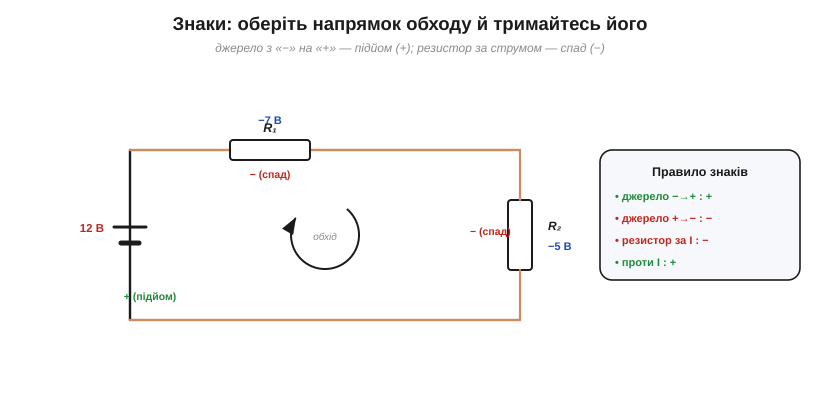
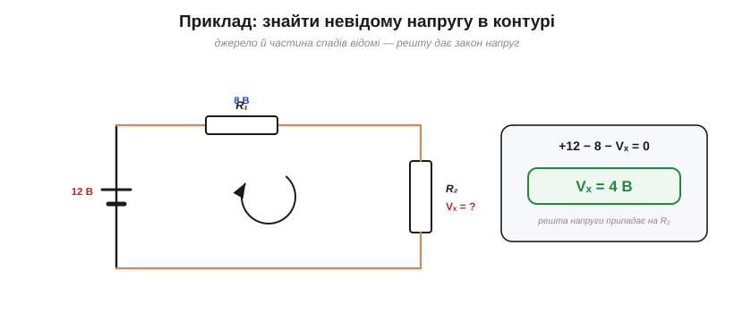
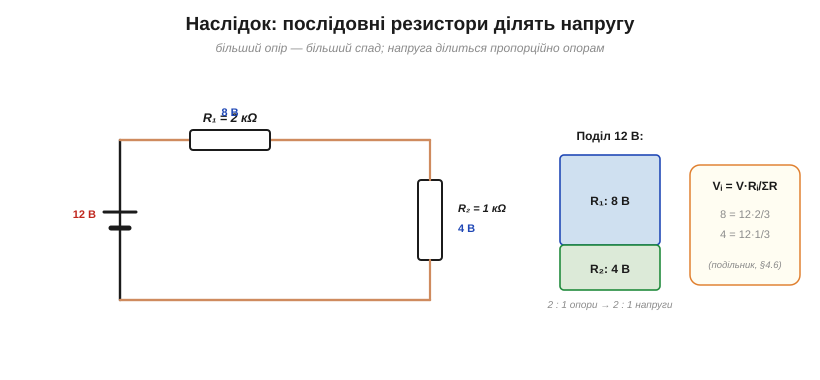

# Закон напруг Кірхгофа (KVL)

Другий закон Кірхгофа — **закон напруг** (*Kirchhoff's Voltage Law*, KVL) — стосується **контурів**. Він простий і надійний, бо спирається на закон збереження — цього разу **енергії**. [Історія розділу](book:electronics/nodes-branches-loops/hist-kirchhoff.md) показує, як до нього прийшли; тут формалізуймо суть і навчімося застосовувати.

### Формулювання: ΣV = 0 у контурі

Закон каже: **обходячи будь-який замкнений контур і повертаючись у вихідну точку, алгебрична сума всіх змін напруги дорівнює нулю**. Рівнозначне формулювання, часто наочніше: **сума підйомів напруги (на джерелах) дорівнює сумі спадів (на резисторах)**.


*Рис. Закон напруг у контурі: обходячи петлю, на джерелі потенціал піднімається (+12 В), а на резисторах спадає (−7 В і −5 В). Сума підйомів дорівнює сумі спадів (12 = 7 + 5), тобто алгебрична сума напруг по контуру — нуль.*

У нашому прикладі джерело піднімає напругу на 12 В, а два резистори «з'їдають» її по 7 і 5 В. Підйом дорівнює сумі спадів: 12 = 7 + 5. Те саме як ΣV = 0: +12 − 7 − 5 = 0. Напруга джерела повністю **розподіляється** між елементами контуру — жодного вольта не зникає й не з'являється зайвого.

### Чому: однозначний потенціал

Звідки ця певність? З того, що **потенціал у кожній точці кола однозначний**: точці відповідає одне значення напруги (відносно вибраної опорної точки). А отже, обійшовши замкнену петлю й повернувшись у **ту саму** точку, ми мусимо повернутись і до **того самого** потенціалу — тож усі зміни вздовж шляху взаємно скасовуються. (Тут є тиха умова: крізь контур не повинен проходити **змінний магнітний потік**. Якщо пронизує — за законом Фарадея в петлі наводиться додаткова ЕРС, потенціал перестає бути однозначним, і цю наведену ЕРС у KVL додають окремим доданком. У звичайних колах без трансформаторного зв'язку цим нехтують — і KVL точний.)


*Рис. Той самий обхід як «сходинки потенціалу»: джерело піднімає на +12 В, кожен резистор опускає (−7, −5), і наприкінці ми повертаємось точно на стартовий рівень. Саме ця однозначність потенціалу (повернувся в ту саму точку — той самий потенціал) і є суттю KVL.*

Якнайкраще це видно на «сходинках»: ідучи контуром, потенціал піднімається на джерелі й опускається на кожному резисторі, але після повного обходу обов'язково повертається на **стартовий рівень**. За цим стоїть **збереження енергії**: напруга — це [енергія на одиницю заряду](book:physics/volt), і якби заряд, обійшовши петлю, повертався з іншою енергією, ми б діставали (чи втрачали) енергію з нічого — вічний двигун, якого не буває. Джерело **дає** заряду енергію, резистори її **забирають** (на тепло), і баланс завжди сходиться в нуль.

Та сама ідея — як прогулянка пагорбами: хоч скільки вгору-вниз ви йшли, повернувшись додому, ви опиняєтесь на тій самій висоті, з якої вийшли. Висота — однозначна функція місця, як потенціал — однозначна функція точки кола. Тому правило «обійшов петлю — повернувся до того самого» однаково чинне і для гір, і для напруги.

### Знаки: підйоми й спади

Щоб писати рівняння без помилок, оберіть **напрямок обходу** контуру (будь-який) і дотримуйтесь його. Тоді знаки розставляються за простим правилом.


*Рис. Знаки: оберіть напрямок обходу. Перетин джерела з «−» на «+» — підйом (+); перетин резистора за напрямком струму — спад (−). Тоді ΣV = 0 по всьому контуру.*

Правило таке: проходячи **джерело** від «−» до «+» — це **підйом** (беремо зі знаком +), а від «+» до «−» — **спад** (−); проходячи **резистор за напрямком струму** — це **спад** (−), а проти струму — підйом (+). Розставивши так знаки й прирівнявши суму до нуля, дістаємо рівняння контуру. Як і з першим законом, напрямок обходу — наш вільний вибір; аби лише застосувати правило послідовно.

Перевірмо на нашому контурі (обхід за годинниковою стрілкою): джерело проходимо з «−» на «+» — це +12; далі R₁ за напрямком струму — це −7; далі R₂ за струмом — це −5. Сума: +12 − 7 − 5 = 0. Сходиться, як і має бути. Якби ми обрали зворотний обхід, усі знаки змінилися б на протилежні (−12 + 7 + 5 = 0) — і рівняння лишилося б правдивим.

### Приклад: знайти невідому напругу

Найчастіше KVL застосовують так: у контурі відомі джерело й частина спадів — і закон одразу дає останній.

**Приклад. У контурі джерело 12 В і два резистори; на R₁ спадає 8 В. Скільки спаде на R₂?**

```
Закон напруг:  ΣV = 0 по контуру
Обхід:         +12 − 8 − Vₓ = 0
Розв'язуємо:   Vₓ = 12 − 8  = 4 В
```


*Рис. Якщо в контурі відомі джерело й частина спадів, решту дає закон напруг: Vₓ = 12 − 8 = 4 В.*

Уся напруга джерела (12 В) розподілилася: 8 В на R₁ і 4 В на R₂. Це не випадковість, а загальне правило послідовного кола — до нього й перейдемо.

### Послідовні джерела додаються

KVL стосується не лише спадів, а й **джерел**. Якщо в контурі їх кілька, ми просто додаємо їхні підйоми з відповідними знаками. Увімкнені **узгоджено** (плюс одного до мінуса наступного), джерела **додають** напруги: чотири батарейки по 1.5 В дають 6 В — саме так працює відсік для батарейок у ліхтарику чи пульті. А якщо одну вставити **навпаки**, її підйом обернеться спадом, і загальна напруга **впаде** (1.5 + 1.5 + 1.5 − 1.5 = 3 В). Тому полярність батарейок — не дрібниця: закон напруг рахує саме **алгебричну** суму, з урахуванням напрямку кожного джерела.

### Наслідок: послідовні резистори ділять напругу

З KVL випливає одна з найкорисніших речей у всій електроніці. У **послідовному** колі напруга джерела **ділиться** між резисторами, причому **пропорційно їхнім опорам**: на більшому опорі — більший спад.


*Рис. Послідовні резистори ділять напругу джерела пропорційно опорам: на більшому опорі більший спад. Тут 12 В діляться як 8 В і 4 В (R₁:R₂ = 2:1). Це — [подільник напруги](book:electronics/voltage-divider).*

Чому пропорційно? Бо крізь послідовні резистори тече **той самий струм** I (це [закон струмів](book:electronics/kcl)), а спад на кожному — за законом Ома V = I·R. Однаковий струм, помножений на різні опори, дає спади **в тій самій пропорції, що й опори**. Звідси формула: на резисторі Rᵢ спадає Vᵢ = V · Rᵢ / (R₁ + R₂ + …). У прикладі 2 кΩ і 1 кΩ ділять 12 В як 8 і 4 В (пропорція 2:1). Ця конструкція — **[подільник напруги](book:electronics/voltage-divider)** (*voltage divider*), і вона настільки важлива, що їй присвячено окрему тему.

Подільники — усюди: ними задають **опорні напруги**, зчитують положення повзунка **потенціометра** (ручки гучності чи яскравості), узгоджують рівні сигналів, підмішують напругу для давачів. Щойно ви бачите два послідовні резистори, між якими знято напругу, — це подільник, і його частку рахують саме за щойно виведеною пропорцією.

> 🔧 **Навіщо це.** KVL — другий щоденний інструмент. Він каже, що напруги послідовних джерел **додаються** (так із кількох батарейок складають потрібну напругу), а на послідовних навантаженнях — **діляться** ([подільник](book:electronics/voltage-divider)). Він же — основа перевірки проєкту: усі спади в контурі **мусять** скластися в напругу живлення; якщо у вас не сходиться — десь помилка. І він нагадує: у тій самій точці кола не може бути двох різних напруг. Питання «скільки напруги лишилося?» завжди має відповідь — і дає її саме другий закон Кірхгофа.

---

Коротко: **закон напруг** (KVL) — обходячи будь-який контур, алгебрична сума напруг дорівнює нулю, або сума підйомів дорівнює сумі спадів. Це **збереження енергії** й **однозначність потенціалу**: повернувшись у ту саму точку, повертаємось до того самого потенціалу. Знаки розставляють за обраним напрямком обходу. Закон дає невідому напругу в контурі, а його прямий наслідок — **поділ напруги** послідовними резисторами пропорційно опорам.

---
