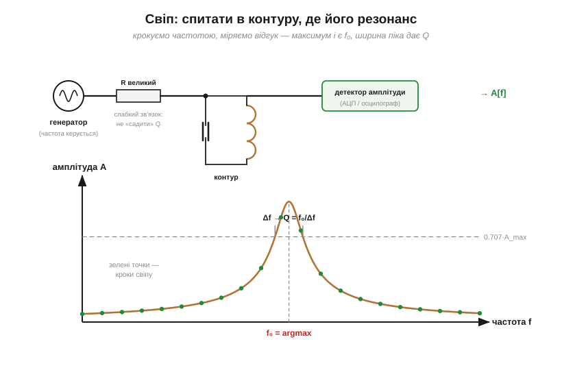
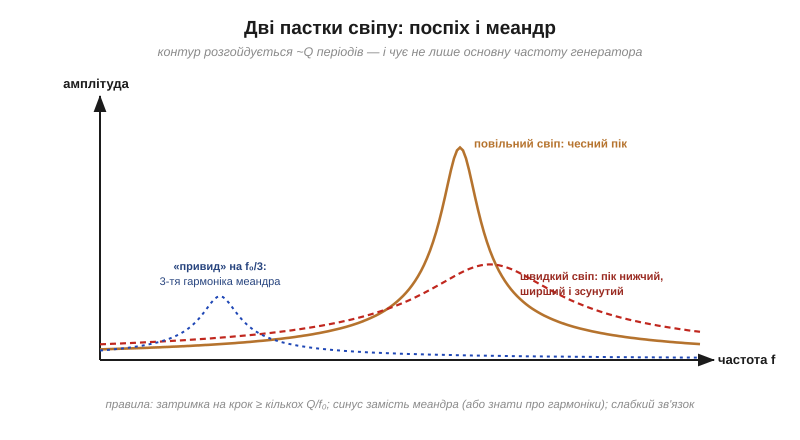

# ⚙️ Знайти резонанс свіпом: генератор, вимірювання амплітуди, пошук максимуму

> Це алгоритмічна вставка до теми [«LC-резонанс»](book:electronics/lc-resonance). Формула Томсона каже, де резонанс *має бути*; реальний контур із паразитними ємностями, насиченням і розкидом номіналів відгукується трохи інакше. Найчесніший спосіб дізнатися правду — спитати в самого контуру: пройтися частотою і подивитися, де відгук найбільший. Цей прийом зветься **свіпом** (*frequency sweep*) і працює для будь-чого резонансного — від LC-контуру до антени.

### Задача

Дано: досліджуваний контур (чи інший резонатор), генератор сигналу з керованою частотою (підійде й вивід мікроконтролера з таймером) і вимірювач амплітуди — АЦП із детектором або осцилограф. Знайти справжні f₀ і Q.

### Ідея

Крокувати частоту від f_min до f_max; на кожному кроці дати контуру **встановитися**, виміряти амплітуду відгуку, записати. Максимум кривої — f₀; ширина піка на рівні 0.707 від максимуму — смуга Δf, з якої [Q = f₀/Δf](book:electronics/quality-factor).


*Рис. Генератор під'єднано до контуру слабко — через великий резистор, щоб не «садити» добротність; детектор знімає амплітуду. Унизу — результат: кожна зелена точка — один крок свіпу; максимум дає f₀, ширина на 0.707·A_max — добротність.*

### Псевдокод

```
для f від f_min до f_max кроком Δf_крок:
    встановити частоту генератора f
    зачекати T_встан ≈ (кілька)·Q/f        # контур розгойдується не миттєво!
    A[f] ← виміряна амплітуда (усереднити кілька разів)
f₀ ← частота максимуму A
знайти f₁ і f₂, де A = 0.707·A_max   →   Q = f₀ / (f₂ − f₁)
```

Складність — O(N) вимірювань. Економна стратегія — **два проходи**: грубий свіп рідкою сіткою по всьому діапазону, далі тонкий — вузько навколо знайденого горба.

### Головна пастка: час встановлення

Контур із добротністю Q розгойдується (і заспокоюється) приблизно **Q періодів** — це прямий наслідок [енергетичного означення Q](book:electronics/quality-factor/math-q-factor.md). Якщо свіпати швидше, контур просто не встигає відгукнутися на повну: пік виходить **нижчим, ширшим і зсунутим** у бік руху свіпу. Що добротніший об'єкт, то повільніше треба йти — фундаментальна плата за гострий резонанс, та сама пара «час ↔ частота».


*Рис. Суцільна крива — чесний пік повільного свіпу. Штрихова червона — той самий контур, свіпнутий поспіхом: пік занижений і зсунутий. Синій «привид» на f₀/3 — слід третьої гармоніки, якщо генератором служить меандр.*

**Приклад (план свіпу).** Контур з [вставки про Томсона](math-thomson-formula.md): 10 мГн + 10 мкФ, очікувано f₀ ≈ 503 Гц, Q ≈ 30:

```
T_встан ≈ 3·Q/f₀ = 3·30/503 ≈ 0.18 с на крок
грубий свіп: 250–1000 Гц кроком 25 Гц = 30 точок ≈ 6 с
тонкий свіп: ±40 Гц навколо горба кроком 2 Гц
```

Крок тонкого проходу беруть не більшим за Δf/5 (тут Δf = f₀/Q ≈ 17 Гц → крок 2–3 Гц), щоб на пік припало кілька точок.

### Як міряти амплітуду без осцилографа

Найпростіше — **піковий детектор**: [діод плюс конденсатор](book:electronics/rectification) перетворюють змінний відгук на повільну постійну напругу «висотою з пік», яку спокійно читає АЦП. Альтернатива — семплити швидко й брати розмах (max − min) за кілька періодів. Обидва способи дають саме те, що потрібно алгоритму, — одне число «наскільки сильно дзвенить».

### Пастки

- **Свіп без затримки** — головна, розібрана вище.
- **Засильний сигнал.** Великий розмах на [котушці з осердям](book:electronics/inductor-types) підмагнічує його: L «пливе» з амплітудою, і f₀ їде разом із нею. Міряти на малому сигналі.
- **Тісний зв'язок.** Генератор із низьким внутрішнім опором, увімкнений прямо в контур, демпфує його — виміряєте Q з'єднання, а не контуру. Під'єднуйтеся слабко: великий резистор або крихітна ємність. Те саме стосується вимірювача: щуп — це теж [ємність](book:electronics/capacitor), і вона детюнить контур.
- **Меандр замість синуса.** Прямокутник частоти f містить і 3f, 5f… ([несинусоїдні форми — суміші синусоїд](book:electronics/phase-shift/math-sine-derivative.md)). Коли третя гармоніка влучає в f₀, на графіку виростає «привид» на f₀/3. Або беріть синус, або знайте своїх привидів в обличчя.
- **Шум.** Кілька вимірів на точку з усередненням — дешева страховка.

### Де ще працює

Цей самий цикл «частота → відгук → максимум» налаштовує [антени](book:communications/resonance-dipole), перевіряє п'єзорезонатори, підстроює бездротову зарядку і взагалі знімає будь-яку [частотну характеристику](book:electronics/frequency-response) — для роботи з фільтрами свіп стає головним вимірювальним інструментом. А пара «гострий пік ↔ повільне вимірювання» — ще один прояв зв'язку часу й частоти, який тепер можна і рахувати, і обходити.
