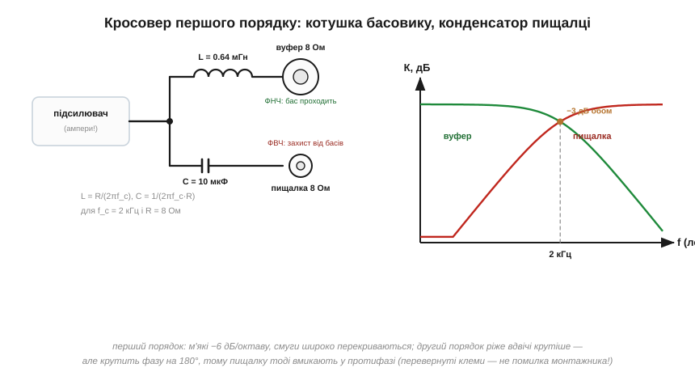
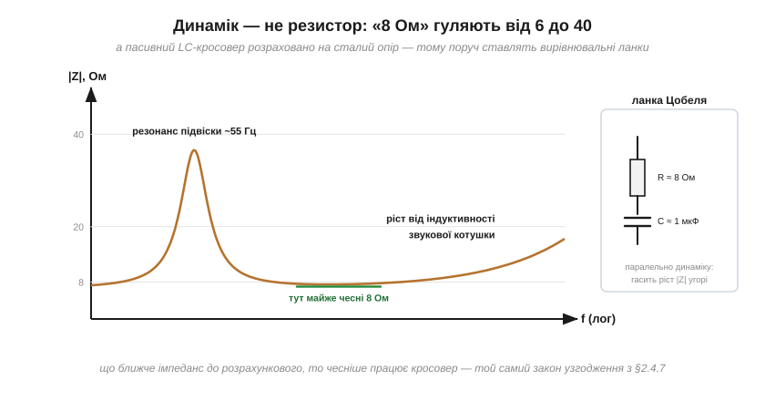

# 🔌 Кросовер у колонці: LC-фільтри ділять звук між динаміками

Усе, що відомо про [LC-фільтри](book:electronics/lc-rlc-filters) — «не гріються, а відбивають», порядок і крутість спаду, чутливість до опору навантаження, — працює в кожній двосмуговій колонці на вашому столі. Розкрутіть її: між клемами і динаміками сидить **кросовер** — пара пасивних фільтрів, що ділить музику на «низ» і «верх» на повній потужності й без жодного живлення.

### Навіщо ділити звук

Один динамік не вміє відтворити все. Великому дифузору басовика не вистачає легкості для верхніх частот — він фізично не встигає коливатися двадцять тисяч разів на секунду. А маленька **пищалка** (твітер) має протилежну біду: баси вимагають великого ходу дифузора, і повна потужність низів просто розірве чи спалить її тендітну котушку. Тож для пищалки ФВЧ — питання **виживання**, а для басовика ФНЧ — питання якості: верхи, які він однаково не відтворить, лише засмічували б його рух.

### Чому саме пасивний LC

Кросовер стоїть **після** підсилювача, і крізь нього течуть ампери. Резисторний фільтр на такому місці працював би пічкою — а ідеальні L і C не розсіюють нічого: непотрібну смугу вони просто **відбивають** назад. Звідси і вибір компонентів у реальній колонці: повітряні [котушки без осердя](book:electronics/inductor-types) (нічому насичуватися) і плівкові або неполярні електролітичні конденсатори.

### Перший порядок: дві деталі на всю колонку

Найпростіший кросовер — одна котушка і один конденсатор:


*Рис. Послідовна котушка пропускає до басовика лише низ (ФНЧ), послідовний конденсатор до пищалки — лише верх (ФВЧ). На частоті розділу обидві гілки на −3 дБ; нижнім плечем кожного фільтра працює сам динамік.*

```
f_c = 2 кГц, динаміки по 8 Ом:
котушка басовика:   L = R/(2π·f_c) = 8/(2π·2000)  ≈ 0.64 мГн
конденсатор пищалки: C = 1/(2π·f_c·R)             ≈ 10 мкФ
```

Зверніть увагу на роль динаміка: він сам — нижнє плече дільника. Спад першого порядку — пологі −6 дБ/октаву (−20 дБ/декаду), тож смуги широко перекриваються, і пищалці навіть за октаву під частотою розділу дістається чимало потужності. Тому в потужніших системах ріжуть крутіше.

### Другий порядок і перевернута пищалка

Додайте в кожну гілку другу деталь (котушці — конденсатор у землю, конденсатору — котушку в землю) — і вийде пара фільтрів другого порядку: −12 дБ/октаву, перекриття вузьке, пищалка живе довше. Але два полюси крутять [фазу](book:electronics/bode-plot) до 180° — на частоті розділу гілки опиняються у **протифазі** й замість суми дали б провал. Тому в класичному кросовері другого порядку пищалку підключають **перевернутими клемами** — побачите в колонці «мінус на плюсі», не поспішайте лагодити: так задумано.

### Динамік — не резистор

Уся арифметика вище вдає, що динамік — чесні 8 Ом. Насправді його імпеданс гуляє по частоті:


*Рис. Горб на резонансі підвіски (десятки герців, |Z| до 30–40 Ом) і плавний ріст угорі від індуктивності звукової котушки. «8 Ом» на наклейці — лише номінал у зручній точці.*

А пасивний LC розраховано під **конкретний** опір: на «гуляючому» навантаженні частота розділу їде, а коліно дзвенить чи провисає. Тому в серйозних кросоверах поруч із фільтрами живуть вирівнювальні ланки: **ланка Цобеля** (резистор із конденсатором паралельно динаміку) гасить ріст імпедансу від індуктивності котушки, а RLC-пастка може притиснути резонансний горб. Іронія інженерії: щоб LC-фільтр працював як на папері, до нього додають ще RC — котрий нічого не фільтрує, а лише «вдає» рівний опір.

### Інший шлях: поділити до підсилювача

Пасивний кросовер ділить **потужний** сигнал — і платить за це габаритами котушок, втратами на вирівнювальних ланках і чутливістю до примх динаміків. Студійні монітори й сабвуфери йдуть навпаки: ділять **слабкий** сигнал до підсилення (активним фільтром на ОП або цифровою обробкою) і дають кожній смузі власний підсилювач. Жодних потужних котушок, частоту розділу можна крутити, фази вирівнювати точно. Ціна — кілька підсилювачів замість одного. Вибір завжди той самий: пасивний LC панує там, де течуть ампери, активні схеми — де сигнал ще малий.

Підсумок: кросовер — це LC-фільтри у найчистішому вигляді: ФНЧ+ФВЧ із спільною частотою розділу, порядок як компроміс між захистом пищалки і кількістю деталей, протифаза другого порядку, і обов'язкова поправка на те, що реальне навантаження — не резистор. Розкрутите стару колонку — тепер упізнаєте на платі кожну деталь.
