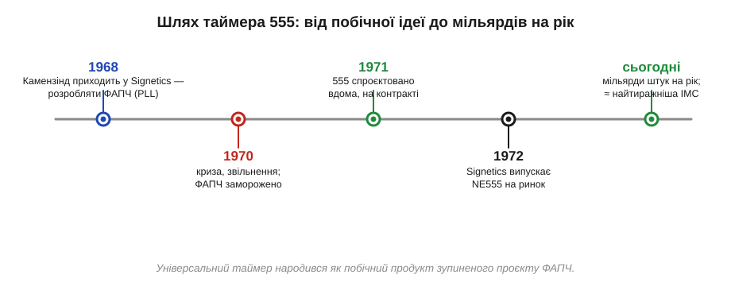
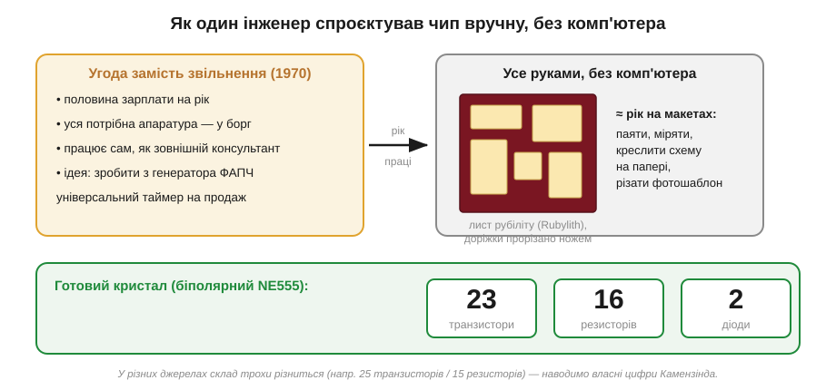

# 📜 Ганс Камензінд і таймер 555: чип, що його спроєктували вдома

**Таймер 555** — чи не найвідоміша інтегральна схема в історії: її випускають мільярдами штук на рік, нею роблять генератори, затримки, звукові пищалки, миготіння світлодіодів — і вона досі продається, хоча їй за п'ятдесят. А спроєктувала її **одна людина**, фактично на самоті, олівцем на папері та ножем по плівці, без жодного комп'ютера — і то як **побічний продукт** проєкту, який щойно закрили. Ця історія про те, як з уламків зупиненої розробки народилася найтиражніша мікросхема світу.

Більшість легенд електроніки — це плід великих лабораторій: транзистор виношували в Bell Labs, мікросхему — у Fairchild і Texas Instruments, операційний підсилювач доводила до товарного вигляду ціла низка інженерів. Таймер 555 — рідкісний виняток. За ним стоїть **один автор** і дуже людська історія: економічна криза, звільнення, ризикова угода й рік копіткої ручної праці. Її варто знати ще й тому, що навколо 555 наросло кілька **міфів** — і найвідоміший із них, про походження самої назви, ми тут спокійно розберемо.

*Дорога 555. Камензінд прийшов у Signetics 1968 року розробляти схему фазового автопідстроювання частоти (ФАПЧ); криза 1970-го зупинила той проєкт; із його генератора він 1971 року спроєктував універсальний таймер, який Signetics випустила на ринок 1972-го — і той став, імовірно, найтиражнішою мікросхемою всіх часів.*

---

## Швейцарець у Кремнієвій долині

Героя цієї історії звали **Ганс Камензінд** *(Hans Camenzind)*. Народився й виріс він у Цюриху, Швейцарія, 1934 року, а 1960-го перебрався до Сполучених Штатів — туди, де саме розгорталася напівпровідникова революція. В Америці він здобув ступінь магістра з електротехніки в Північно-Східному університеті *(Northeastern University)*, а згодом — ще й магістра з управління *(MBA)* в Університеті Санта-Клари, у самому серці майбутньої Кремнієвої долини. Поєднання інженера й людини з діловою хваткою ще зіграє свою роль: Камензінд мислив не лише схемами, а й тим, що **продаватиметься**.

1968 року він улаштувався в молоду компанію **Signetics** — одного з перших у світі виробників, що зробив ставку саме на інтегральні схеми (сама назва — від *signal network electronics*). Завдання Камензінда стосувалося зовсім не таймерів: він мав розробляти схеми **фазового автопідстроювання частоти** (ФАПЧ; *phase-locked loop*, PLL) — вузли, що вміють «чіплятися» за частоту вхідного сигналу й триматися за неї. Це складна аналогова техніка, серцем якої є керований генератор. І саме цей генератор, виношений для зовсім іншої задачі, виявиться зерном, з якого виросте 555.

> 🔧 **Навіщо це.** Варто бути точним з ідентичністю авторів, а не клеїти всіх під один ярлик «американський інженер». Камензінд — **швейцарець** *(Swiss-American)*, який привіз свій вишкіл до Каліфорнії; долина 1960-х узагалі трималася на приїжджих з усього світу. Це не дрібниця для нашого курсу: за майже кожною мікросхемою стоїть конкретна людина з конкретним життям, а не безлика «фірма».

---

## Криза, що звільнила інженера — і ідею

1970 рік приніс електронній промисловості важку рецесію. Signetics, як і багато хто, **скоротила половину працівників** і позаморожувала «необов'язкові» розробки — серед них і проєкт ФАПЧ, над яким сидів Камензінд. Інженер опинився перед вибором: піти на половину платні або піти зовсім.

Він зробив крок, який і визначив усю історію. Замість того щоб скніти над замороженою темою, Камензінд **запропонував** керівництву іншу річ: дайте мені довести до пуття одну ідею. Він давно крутив у голові думку, що з генератора, який він робив для ФАПЧ, можна зліпити **окрему, універсальну мікросхему** — простий таймер, який інженери розхапають для тисячі дрібних задач. На відміну від примхливої ФАПЧ, таку «цеглинку» легко зрозуміти й легко продати.

Угода вийшла незвичайною. Камензінд звільнився й заснував власну фірму-консультанта **InterDesign**, а 555 розробляв **на контракті** із Signetics — фактично як зовнішній виконавець. Платою була половина його колишньої річної зарплати плюс право **взяти в борг усю потрібну апаратуру** — паяльники, прилади, генератори. Жодної команди, жодної лабораторії на повну ставку: один інженер, позичене обладнання й рік часу. Звідси й крилата характеристика цього чипа — **«спроєктований удома»**: не в корпоративному R&D-центрі з сотнею людей, а майже наодинці, силами однієї голови й однієї пари рук.

Чому саме з ФАПЧ виріс **таймер** — не випадковість, а підмічений зв'язок. У схемі фазового автопідстроювання серцем є **керований напругою генератор** *(voltage-controlled oscillator, VCO)*: вузол, що видає коливання, частоту яких задає вхідна напруга. Камензінд побачив, що коли від цього генератора відняти всю «ловильну» обв'язку ФАПЧ і лишити саму його основу — заряд і розряд конденсатора між двома порогами, — то вийде проста й самодостатня річ: схема, яка **відмірює час**. Адже відрізок часу й частота — два боки однієї монети (період — це обернена частота), тож генератор частоти й таймер за своєю суттю той самий механізм. Те, що для ФАПЧ було лише внутрішньою деталлю, окремою мікросхемою ставало універсальним інструментом. У цьому й полягала інженерна здогадка: не винайти нове з нуля, а **впізнати** в уже зробленому вузлі зародок чогось значно ширшого.

---

## Рік олівця, паяльника й ножа

Сьогодні мікросхему «малюють» у спеціальних програмах, а транзистори розставляє й перевіряє комп'ютер. У 1970–71 роках Камензінд не мав нічого з цього. Він згадував коротко й влучно: **«Усе робилося руками, без комп'ютера»** *(«It was all done by hand, no computer»)*.

Виглядало це так. Майже **рік** він збирав на макеті *(breadboard)* варіанти схеми, **паяв і міряв**, підбирав номінали, дивився, як поводиться генератор за різних температур і напруг живлення. Коли схема нарешті влаштовувала його, треба було перенести її на кремній — а для цього накреслити **топологію** кристала. Камензінд робив це теж вручну: малював компоненти на папері, а тоді **різав ножем листи рубіліту** *(Rubylith)* — двошарової червоної самоклейної плівки. Вирізаєш у верхньому шарі «вікна» потрібної форми, знімаєш — і отримуєш величезний, у багато разів збільшений «негатив» одного шару майбутнього чипа. Цей малюнок потім фотографічно зменшували й переносили на пластину. Кожна доріжка, кожен резистор, кожен транзистор у топології 555 був спершу **прорізаний рукою** на плівці.

*«Спроєктовано вдома». Зліва — угода 1970 року: половина платні, апаратура в борг, робота наодинці. У центрі — ремесло: близько року на макетах, схема на папері, топологія прорізана ножем по червоному рубіліту. Справа — підсумок: готовий біполярний кристал містив, за словами самого Камензінда, 23 транзистори, 16 резисторів і 2 діоди (у різних джерелах цифри трохи різняться).*

Підсумок цієї праці — на диво **скромний** за нашими мірками кристал. За словами самого Камензінда, остаточна схема містила **23 транзистори, 16 резисторів і 2 діоди** *(23 transistors, 16 resistors, 2 diodes)*. (У деяких довідниках, зокрема в англійській «Вікіпедії», наводять трохи інші числа — близько 25 транзисторів і 15 резисторів; розбіжність дрібна й, найімовірніше, від того, що саме рахувати «транзистором». Ми наводимо цифри автора.) Усю функціональність — два компаратори, перемикач-засувку й дільник напруги — він уклав у цей мінімум елементів, із яких і складається [внутрішня будова 555](topic:electronics/555-internals).

> 🔧 **Навіщо це.** Тут схований урок про **ощадливість** аналогового проєктувальника. На єдиному кристалі не поставиш ні точного резистора, ні великого конденсатора — тож хороша схема обходиться малим і спирається на **відношення** елементів, а не на їхні абсолютні значення. Саме тому дільник 555 — це три **однакові** резистори: важливо не яке в них значення, а що вони рівні між собою. Той самий прийом тримає й нутрощі [операційного підсилювача](topic:electronics/ideal-opamp), де все будується на узгоджених парах елементів.

---

## Звідки взялася назва «555» — і чому це не про резистори

Тепер — про найживучіший міф цього чипа. Майже в кожному другому пості й навіть у поважних книжках можна прочитати «красиве» пояснення: мовляв, мікросхему назвали **555** тому, що всередині неї **три резистори по 5 кОм**. Пояснення спокусливе — і всередині 555 справді сидить дільник із трьох резисторів по 5 кОм. Збіг ідеальний. Тільки це не причина назви, а **зворотне домислення** — історія, придумана вже постфактум під готову цифру.

Сам Камензінд ставив крапку гранично чітко. На запитання про назву він відповідав, що її **обрали просто навмання**: «Її взяли довільно. Це **Арт Ф'юрі** *(Art Fury)*, наш маркетолог, який вірив, що схема піде нарозхват, вибрав назву „555“» *(«It was just arbitrarily chosen… Art Fury… picked the name '555'»)*. Тобто три п'ятірки — це **маркетинговий хід**, назва, яка просто добре звучала й легко запам'ятовувалася, а не код внутрішньої будови. А три резистори по 5 кОм усередині — чистий **збіг**, на який згодом і «повісили» вигадане пояснення.

Ця історія — маленький, але показовий приклад того, як **народжуються міфи про техніку**. Бачимо красиву відповідність («три п'ятірки» ↔ «три по 5 кОм») — і мозок радо приймає її за причину, хоча насправді це випадковість. Те саме, до речі, стосується й самого авторства: 555 — рідкісний випадок, коли автор справді **один**, і його легко назвати; куди частіше історія розмазана між кількома людьми, і тоді спокуса приписати все одному «генієві» особливо небезпечна. Тут ми маємо щасливий збіг: і автор відомий, і він сам спростував головний міф про свій виріб.

> 🔧 **Навіщо це.** Звичка перепитувати «звідки ми це знаємо?» рятує не лише в історії, а й у щоденній інженерії. Гарний збіг цифр — ще не доказ причинного зв'язку; красива легенда про походження назви чи параметра — ще не факт. Тут нам пощастило мати **пряме свідчення автора**, і воно переважує будь-яку «логічну» вигадку про п'ять кілоом.

---

## Чому 555 пережив усе

Випущений Signetics на ринок 1972 року (а «прогримів» уже 1971-го, щойно зразки пішли в інженерні руки), таймер 555 став **сенсацією** — і відтоді вже не сходив зі сцени. Сьогодні його, за різними оцінками, випускають **мільярдами штук на рік**, і його цілком заслужено називають **імовірно найтиражнішою інтегральною схемою в історії**. Чому саме він?

Перша причина — **універсальність за копійки**. Той самий чип, залежно від кількох зовнішніх резисторів і конденсаторів, працює то [генератором прямокутних імпульсів](topic:electronics/555-astable), то [формувачем одиночного імпульсу](topic:electronics/555-monostable) заданої тривалості, то схемою затримки. Одна дешева деталь — і ціла бібліотека застосувань. Це та сама ідея «гнучкої цеглинки», що зробила безсмертним і операційний підсилювач.

Друга причина — **друге джерело постачання** *(second source)*. Signetics не тримала 555 під замком: схему стали **легально випускати десятки інших виробників** — Texas Instruments, Intersil, Maxim, Fairchild, STMicroelectronics і багато інших. Для інженера це означало головне: деталь **завжди є в продажу**, від кількох незалежних постачальників, за передбачуваною ціною. Компонент, який не зникне й не подорожчає вдесятеро через одного монополіста, варто закладати в схему — і так 555 потрапляв у проєкт за проєктом, десятиліттями. Чому [«перевіреність» і доступність](topic:electronics/legendary-ics) часом важливіші за технічну досконалість — це окрема велика тема.

Згодом до біполярного оригіналу додалася **КМОН-версія** *(CMOS)* — на польових транзисторах, ощадливіша до струму й тихіша під час перемикання (зокрема Intersil ICM7555 і Texas Instruments TLC555). Стара й нова версії живуть пліч-о-пліч і досі, а різниця між ними помітна вже у [внутрішній будові 555](topic:electronics/555-internals). Сам факт, що схему півстолітньої давнини й сьогодні штампують у новому техпроцесі, найкраще говорить про її довговічність.

Є й третя, неочевидна причина довголіття — **культурна**. 555 став улюбленою «навчальною» мікросхемою кількох поколінь: на ньому показують, що таке генератор, поріг, заряд конденсатора, шпаруватість; з нього починають тисячі радіоаматорів і студентів. До чипа, який усі знають змалку й уміють «прикинути в голові», інженер тягнеться першим — і так навчальна звичка теж підживлює тираж. Не дивно, що журнал *IEEE Spectrum* увів NE555 до свого «Залу слави мікросхем» *(Chip Hall of Fame)* — поруч із процесорами й пам'яттю, що змінили світ. Скромний таймер на 23 транзистори стоїть в одному ряду з ними не за складність, а за **всюдисущість**.

---

## Людина, яка зробила набагато більше

Було б несправедливо звести Ганса Камензінда до «автора однієї славетної мікросхеми». 555 був не вершиною, а радше **початком**. За свою кар'єру він спроєктував, за власним підрахунком до 2006 року, близько **140 стандартних і замовних інтегральних схем** — величезний доробок для однієї людини. Його фірма InterDesign розвивала ідею **напівзамовних** мікросхем (коли клієнт замовляє чип під свою задачу, а виробник збирає його зі стандартних заготовок) — підхід, що передбачив пізніший розквіт цієї індустрії; згодом InterDesign придбала компанія Ferranti.

А ще Камензінд багато **навчав**. Він написав кілька книжок, серед яких — «Designing Analog Chips» («Проєктування аналогових мікросхем»), де простою мовою пояснював саме те ремесло, яким володів сам: як із транзисторів, дзеркал струму й дільників народжується робоча аналогова схема. Цю книжку він зрештою виклав у вільний доступ, щоб нею могли скористатися всі охочі. Помер Ганс Камензінд **8 серпня 2012 року** в Сан-Франциско, лишивши по собі і найтиражніший чип світу, і ціле покоління інженерів, що вчилися аналоговій схемотехніці за його текстами.

> 🔧 **Навіщо це.** Історія 555 — це нагадування, що велике не завжди народжується у великих стінах. Іноді достатньо однієї впертої голови, позиченого паяльника й року терпіння — а ще тверезого розуміння, що саме **знадобиться іншим** і добре продаватиметься. Камензінд поєднав інженера й людину з ринковим чуттям, і саме на цьому стику виросла мікросхема, яку ми й досі вмикаємо в свої схеми.

---

## Підсумок

Отже, за легендарним таймером стоїть конкретна людина, ризикова угода й рік ручної праці — а ще пара корисних уроків: чому однакові резистори надійніші за «точні», чому доступність деталі часом важливіша за її досконалість і як обережно слід вірити «красивим» поясненням на кшталт «трьох по п'ять кілоом». Уся хитрість 555 — у тому, як два [компаратори](topic:electronics/comparator), [засувка](topic:electronics/sr-latch) й дільник напруги разом складаються в простий, але напрочуд живучий таймер.
