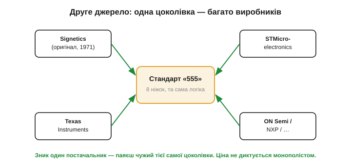

# Чому деякі мікросхеми живуть 50 років

Електроніка — галузь, де все старіє блискавично. Процесор п'ятирічної давнини вважають музейним експонатом, а телефон трирічної — приводом для співчуття. На цьому тлі дивовижно, що в каталозі будь-якого постачальника досі лежать мікросхеми, розроблені тоді, коли ще не було ні персонального комп'ютера, ні мобільного зв'язку. Той самий таймер, той самий здвоєний операційний підсилювач, той самий лінійний стабілізатор. Їх не просто **тримають** для ремонту старого — їх **проєктують у нові** вироби, щойно сьогодні намальовані. Чому одні кремнієві кристали живуть кілька місяців, а інші — кілька десятиліть?

Відповідь не в тому, що «старе зроблено міцніше». Відповідь у тому, що ці мікросхеми — **стандартні цеглинки**, а не вироби. І в цьому є глибока інженерна логіка, варта окремої розмови.

### Цеглинка проти продукту

Розгляньмо різницю між двома типами мікросхем. Є **продукт** — наприклад, чип конкретного бездротового модуля чи відеокодека. Він прив'язаний до стандарту, до ринку, до моди; зміниться стандарт зв'язку — і чип стане непотрібним. А є **цеглинка** — компонент, який виконує елементарну, **вічну** функцію: затримати сигнал на задану мить, утримати стабільну напругу, підсилити різницю двох входів, перемкнути аналоговий сигнал. Ці функції не залежать від моди, бо вони — частина самої **фізики розробки**. Поки інженери будують схеми, їм будуть потрібні затримки, опорні напруги й підсилювачі.


*Кілька аналогових цеглинок, що пережили свою епоху. Операційний підсилювач, таймер, лінійний стабілізатор, опорна напруга, аналогові ключі — усі народилися в 1968–1978 роках і досі у виробництві. Спільна риса: кожна виконує елементарну, незмінну функцію розробки, а не прив'язана до минущого стандарту.*

Цеглинка має ще одну рису: вона **проста й самодостатня**. Її поведінку можна описати кількома числами в даташиті, її легко зрозуміти, легко перевірити, легко вставити в будь-яку схему. Складний продукт мусить старіти разом зі своєю екосистемою; проста цеглинка — ні, бо їй нема з чим старіти. Саме тому довговічними стають насамперед **аналогові** ІМС: аналоговий світ — це напруги, струми, час і температура, а вони не змінюються від покоління до покоління.

Варто додумати цю думку до кінця, бо вона пояснює, **чому** цифрові вироби старіють, а аналогові цеглинки — ні. Складна цифрова мікросхема живе не сама по собі, а в **павутині залежностей**: вона спирається на конкретний стандарт зв'язку, на конкретний формат даних, на драйвери в конкретній операційній системі, на швидкість сусідньої пам'яті, на тонкий технологічний процес, який сам застаріває. Достатньо одній ниточці цієї павутини обірватися — змінився стандарт, припинили підтримку драйвера, — і чип стає непотрібним, навіть якщо фізично справний. Він прив'язаний до **контексту**, а контекст рухається. Аналогова ж цеглинка контексту майже не має: вона робить одну фізичну операцію над напругою чи струмом, і ця операція ні від чого зовнішнього не залежить. Закон Ома, експонента заряду конденсатора, поріг компаратора — усе це таке саме, як було, і таке саме, як буде. Старіти просто нема чому.

Звідси й парадокс, який спершу дивує новачка: чим **простіша** функція компонента, тим **довше** він живе. Складність — це коротке життя; елементарність — це вічність. Аналогові цеглинки виживають саме тому, що нічого зайвого в них немає: лише та функція, яка завжди потрібна. І коли інженер бачить у каталозі мікросхему з датою розробки «1971», це не ознака відсталості — це знак, що функцію вгадали настільки правильно, що за півстоліття її не довелося переробляти.

Які ж функції виявилися «вічними»? Перелік на диво короткий і повторюється з підручника в підручник. **Підсилити** слабкий сигнал — звідси [операційний підсилювач](book:electronics/ideal-opamp), що живе з кінця 1960-х. **Порівняти** дві напруги — компаратор. **Відмірити час** — таймер, ім'я якого знає кожен схемотехнік. **Утримати стабільну напругу** — лінійний стабілізатор і опорне джерело. **Перемкнути сигнал** — аналоговий ключ. **Підсилити різницю на тлі завади** — інструментальний підсилювач. Кожна з цих операцій — не примха епохи, а **базова дія** над електричним сигналом, без якої не обходиться жодна схема, байдуже, якого вона року. Тому й цеглинки, що ці дії втілюють, не старіють — кожна з них варта окремого знайомства, де видно, як «вічна» функція зроблена в кремнії.

> 🔧 **Навіщо це.** Розрізняти цеглинку й продукт — практична навичка проєктувальника. Коли ви будуєте пристрій, який має жити роками й випускатися тисячами, ви свідомо тяжієте до **стандартних цеглинок**: їх не знімуть із виробництва завтра, їх легко замінити, їх знають усі. А коли ви женетеся за найкращими характеристиками сьогодні — берете свіжий «продуктовий» чип, погоджуючись, що за три роки доведеться його перепроєктовувати. Це усвідомлений компроміс, і починається він із питання: ця функція — вічна чи минуща?

### Друге джерело: чому це питання життя і смерті

Тепер — головна причина, чому інженери **люблять** старі стандартні цеглинки, і вона суто практична. Уявіть, що ваш виріб залежить від мікросхеми, яку випускає **один-єдиний** виробник. Він підняв ціну вдвічі — ви платите. Він припинив випуск — ваш виріб зупинився, і ви терміново перепроєктовуєте плату під щось інше. Він затримав постачання на півроку — ваш конвеєр стоїть. Залежати від одного постачальника — це тримати ніж біля власного горла.

Тому в серйозній розробці діє правило: **друге джерело постачання** (*second source*). Компонент мусить випускатися **кількома незалежними** виробниками, причому в **однаковому корпусі з однаковою цоколівкою** (*pinout*) і сумісною поведінкою. Зник один — паяєш чужий, тієї самої цоколівки, і плата навіть не помічає різниці.


*Друге джерело постачання. Стандартна цеглинка (тут — таймер «555») випускається багатьма незалежними виробниками з тією самою цоколівкою й логікою. Зник один постачальник — паяєш чужий тієї самої цоколівки. Монополіст не може диктувати ціну, бо поруч завжди є альтернатива.*

Саме легендарні ІМС — чемпіони другого джерела. Таймер 555 випускають десятки фабрик у світі; лінійний стабілізатор класу 78xx — теж; здвоєний операційний підсилювач — теж. Ви можете замовити їх у п'яти різних виробників, і всі п'ять стануть на одне місце на платі. Ця **взаємозамінність** робить такі компоненти безпечними для масового виробництва — і саме вона тримає їх у каталогах десятиліттями. Чим більше виробників випускає цеглинку, тим довше вона живе, бо жоден із них не може її «вбити» поодинці.

> 🔧 **Навіщо це.** Обираючи компонент для виробу, який житиме довго, перевіряйте: чи є **друге джерело**? Один рядок у даташиті — «pin-compatible with…» — або наявність того самого позначення в кількох виробників означає, що вас не тримають за горло. Для прототипу це байдуже; для серії — критично. Багато досвідчених інженерів свідомо тримаються старих стандартних цеглинок саме тому, що їх не зніме з виробництва раптове рішення єдиного постачальника.

### Ціна перевіреності

Є й третя причина довговічності, м'якша, але важлива: **перевіреність**. Мікросхема, яку випускають п'ятдесят років і застосували в мільярдах виробів, **відома до останньої дрібниці**. Усі її граблі задокументовано, усі її дивацтва описано в сотнях статей, усі типові схеми ввімкнення перевірено практикою. Коли ви берете таку цеглинку, ви не наражаєтеся на сюрпризи — усе, що могло піти не так, уже пішло не так у когось іншого, і про це написано.

Нова мікросхема, навпаки, — це завжди ризик: errata (список помилок) ще неповний, типові схеми ще не вилизані, рідкісні режими відмови ще не виявлені. За свіжі характеристики платять часом на «вилов» проблем. А перевірена цеглинка цей податок уже сплатила — і тому вона **дешева не лише в грошах, а й у нервах**. Інженер, що бере 555 чи 78xx, точно знає, що отримає; це знання — теж цінність.

Є й зворотний бік перевіреності — **навчальний**. Навколо легендарних цеглинок наросла величезна культура: підручники, типові схеми, тисячі прикладів, готові розрахунки. Новачок, що береться за 555 чи операційний підсилювач, не блукає наосліп — він спирається на півстоліття чужого досвіду. Це робить старі цеглинки ще й найкращим **матеріалом для навчання**: на них видно загальні принципи в чистому вигляді, без випадкових ускладнень. Саме тому ми вивчаємо їх не як музейні експонати, а як живий інструмент, яким користуються й сьогодні.

Розшифрувати самі **назви** цих компонентів — окрема корисна навичка: префікси на кшталт NE, LM, TL, CD чи 74 несуть інформацію про походження й тип, а суфікси кажуть про корпус ([🔌 розшифровка назв ІМС](comp-ic-naming.md)). Опанувавши цю «граматику», ви читатимете маркування мікросхем майже як осмислений текст — і впізнаватимете в чужій схемі знайому цеглинку з першого погляду.

> 🔧 **Навіщо це.** Перевіреність — це прихована, але реальна стаття вартості розробки. Час інженера коштує дорого; кожен тиждень, витрачений на «вилов» дивацтв свіжого чипа, — це гроші. Беручи перевірену цеглинку, ви наперед знаєте її поведінку й типові граблі, тож проєктування йде швидше й передбачуваніше. Для одиничного хобі-проєкту це неважливо, а для виробу, який треба випустити вчасно й без сюрпризів, перевіреність часто переважує кращі «паперові» характеристики новинки.

**Приклад (вартість компонента впродовж життя виробу).** Уявімо виріб, який планують випускати 10 років тиражем 20 000 штук на рік. Порівняймо два сценарії вибору таймера: перевірена цеглинка з кількома джерелами проти свіжого «модного» чипа від одного виробника.

```
Перевірена цеглинка (≥3 виробники):
  ціна за штуку       ≈ 0.20 у.о. (конкуренція тримає низько)
  ризик зняття з виробництва за 10 років — низький
  перепроєктування плати       — не очікується

Свіжий чип (1 виробник):
  ціна за штуку       ≈ 0.35 у.о. (монополіст, дорожче)
  ризик зняття з виробництва за 10 років — помітний
  якщо знімуть на 5-му році → перепроєктування + перевипробування:
     разові витрати       ≈ 40 000 у.о. (праця інженерів, сертифікація)
     розкид на решту 5 років · 20 000 шт = 100 000 шт:
        +40 000 / 100 000 = +0.40 у.о. на штуку

Підсумкова ціна штуки (грубо):
  перевірена:   0.20 у.о.
  свіжа з ризиком: 0.35 + (ймовірний) 0.40 ≈ 0.75 у.о.
```

Навіть якщо свіжий чип сам по собі дешевший за функцією, ризик зняття з виробництва й вимушеного перепроєктування може зробити його **в рази дорожчим** на дистанції життя виробу. Ось чому в серійній розробці так цінують довговічні цеглинки з другим джерелом: вони купують не лише функцію, а й **спокій** на роки вперед. Зауважте: ці числа орієнтовні й залежать від ринку, але сам механізм незмінний — рідкісний разовий ризик, помножений на великі наслідки, легко переважує невелику щоденну економію. Саме так мислять інженери, що відповідають за виріб не на тиждень, а на десятиліття.

Отже, аналогова цеглинка живе півстоліття не тому, що зроблена з кращого кремнію, а тому, що (1) виконує вічну функцію розробки, (2) має багато незалежних джерел постачання й (3) перевірена до дрібниць. Ці три властивості й роблять компонент «легендарним» — і пояснюють, чому той самий [таймер «555»](book:electronics/555-internals), лінійний стабілізатор 78xx чи здвоєний операційний підсилювач досі стоять у нових схемах поряд із найсвіжішим кремнієм.
