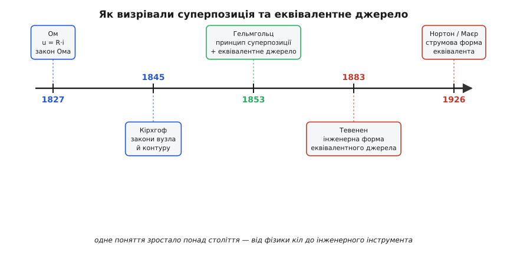

# 📜 Як суперпозиція й еквівалентне джерело прийшли в теорію кіл

Сьогодні «вимкнути по черзі всі джерела, крім одного, скласти внески» здається настільки очевидним, що важко уявити час, коли цього не вміли. Але кожен прийом теорії кіл колись був відкриттям — і не одного винахідника, а ланцюжка людей, що тяглися понад століття. Принцип суперпозиції й еквівалентне джерело — гарний приклад того, як ідея визріває повільно: спершу хтось дає закон для одного резистора, потім інший — правила для розгалуженого кола, потім фізик помічає, що з цих законів випливає накладання, і аж наприкінці інженер перетворює фізичну теорему на зручне правило для робочого столу. Жоден з них не «придумав суперпозицію» сам — кожен доклав свій шар.

Варто пройти цей шлях, бо він показує важливе: те, що ми звемо «теоремою Тевенена» чи «методом суперпозиції», — не осяяння однієї голови, а спільний доробок, у якому легко переплутати, хто що насправді зробив. А ще тут є повчальна історія про те, як ім'я на теоремі дістається не завжди тому, хто був першим.

*Понад століття від першого закону кола до інженерного інструмента. Синім — ті, хто заклав алгебру кіл; зеленим — фізик, що першим сформулював і принцип, і еквівалентне джерело; червоним — інженери, що дали практичні форми. Жодна ланка не зайва.*

## Перш ніж було що складати: Ом і алгебра одного кола

Щоб узагалі говорити про «складання внесків напруги», треба спершу мати рівняння, які зв'язують напругу й струм. До початку XIX століття такого зв'язку просто не існувало — електрику вміли спостерігати, але не рахувати.

Перший камінь поклав **Георг Симон Ом** (нім. *Georg Simon Ohm*, 1789–1854), баварський учитель фізики з Кельна. У травні 1827 року він видав книжку «Die galvanische Kette, mathematisch bearbeitet» («Гальванічне коло, опрацьоване математично»), де сформулював те, що ми звемо законом Ома: напруга на ділянці кола — це добуток струму на опір цієї ділянки. Дрібниця для нас, переворот для тодішньої науки: уперше електричне коло стало предметом, який можна порахувати наперед, а не лише поміряти. (Статус: твердо встановлений факт; дату й назву праці підтверджують і книгознавчі каталоги першовидань, і архівні сканограми.)

> 🔧 **Навіщо це.** Суперпозиція складає **напруги й струми**. Поки немає рівняння u = R·i, складати нема чого — сама ідея «внеску джерела» не має числового виразу. Ом дав ту цеглину, без якої вся подальша будівля теорії кіл не стоїть.

Прикметно, що сучасники зустріли Ома глузуванням. Його праця суперечила тодішнім розпливчастим уявленням, і визнання прийшло аж за десятиліття. Це теж частина історії: фундамент, на якому потім виросте суперпозиція, спершу мало хто вважав за фундамент.

## Кірхгоф: правила для розгалуженого кола

Закон Ома описує одну ділянку. Але реальне коло — це вузли, де сходяться кілька гілок, і контури, що замикаються в кільця. Як рахувати **таке**? Відповідь дав студент.

**Густав Роберт Кірхгоф** (нім. *Gustav Robert Kirchhoff*, 1824–1887) сформулював свої два закони у 1845 році, ще навчаючись в університеті Кенігсберга — як семінарську вправу, що згодом лягла в дисертацію. Перший закон (правило вузла): алгебрична сума струмів, що входять у вузол і виходять із нього, дорівнює нулю — це пряме відлуння збереження заряду. Другий (правило контуру): алгебрична сума напруг уздовж замкненого контуру — нуль, що відбиває збереження енергії. Працю надруковано в «Annalen der Physik und Chemie» (том 64); пізніше, 1847 року, Кірхгоф виклав ці закони ще загальніше. (Статус: твердо встановлений факт; рік 1845, журнал і вік автора підтверджують біографічні джерела.)

Зверни увагу на слово, яке тут двічі повторюється: **алгебрична**. Закони Кірхгофа — це по суті правила додавання зі знаком. А додавання — лінійна операція. Тобто вже в 1845 році вся арифметика кола виявилася лінійною: і означальне рівняння Ома (пряма пропорційність), і обидва правила Кірхгофа (суми зі знаком). Звідси до суперпозиції — лише один крок усвідомлення, і його зробить фізик, який про електричні кола думав радше як про модель живої тканини, ніж як про телеграф.

## Гельмгольц 1853: принцип названо — і відразу еквівалентне джерело

Тут історія робить несподіваний поворот. Людина, що першою чітко проголосила принцип суперпозиції для електричних кіл, шукала зовсім не теорію кіл. Вона досліджувала, як тече струм у живій тканині.

**Герман фон Гельмгольц** (нім. *Hermann von Helmholtz*, 1821–1894) — один із найуніверсальніших умів XIX століття: фізик, фізіолог, лікар за освітою. У 1853 році він друкує в Поггендорфових «Annalen der Physik» працю з довгою назвою «Ueber einige Gesetze der Vertheilung elektrischer Ströme in körperlichen Leitern…» — «Про деякі закони розподілу електричних струмів у об'ємних провідниках, із застосуванням до тваринно-електричних дослідів» (том 165). Його цікавили «об'ємні провідники» — м'язи, нерви, тканина, — а не дроти й резистори.

І саме в цій праці він дає те загальне формулювання, якого доти ніхто не публікував: якщо в системі провідників діють електрорушійні сили в різних місцях, то напруга в кожній точці, через яку йде струм, дорівнює **алгебричній сумі** тих напруг, що кожна з електрорушійних сил створила б **окремо, незалежно від інших**. Це і є принцип суперпозиції, сказаний прямо. (Статус: твердо встановлений факт; рік, журнал, том і зміст підтверджені за першоджерелом і фаховими оглядами історії теорії кіл.)

Цікава деталь чесності Гельмгольца. Сам поштовх він приписав не собі, а другові — фізіологові **Емілю дю Буа-Реймону** (нім. *Emil du Bois-Reymond*, 1818–1896). Тут варто бути точним з ідентичністю, бо прізвище збиває з пантелику: дю Буа-Реймон — **німецький** фізіолог, народжений і прожитий у Берліні, попри французьке звучання імені. Його батько був небагатим переселенцем із Невшателя (Швейцарія), мати — берлінкою гугенотського роду; а брат Поль став відомим математиком. Саме дю Буа-Реймон, засновник сучасної електрофізіології, показав, що кожна найдрібніша збудлива частинка м'яза здатна породжувати електричний струм, — і ці його спостереження Гельмгольц прямо назвав джерелом своєї узагальненої постановки. (Статус: твердо встановлений факт; дати життя, місце народження й гугенотське походження підтверджені біографічно.)

> 🔧 **Навіщо це.** Принцип суперпозиції — не «зручний трюк», а формальна властивість, яку треба було **довести** з означальних рівнянь, а не просто оголосити. Гельмгольц зробив саме це: показав, що з лінійності законів кола випливає накладання внесків. Хто захоче побачити, як та сама властивість виводиться сьогоднішньою мовою — означення лінійності, однорідність плюс адитивність, — це окремо розписано в [виведенні суперпозиції з лінійних рівнянь](book:electronics/linear-circuit/math-superposition.md).

Але Гельмгольц зробив у тій-таки праці й більше — і це часто губиться. Він вивів те, що ми тепер звемо **еквівалентним джерелом**: будь-який лінійний провідник, хоч який складний усередині, можна замінити одним джерелом з певною електрорушійною силою й певним опором. Тобто **і принцип суперпозиції, і ідея еквівалентного джерела** з'явилися разом, у тій самій праці 1853 року, за тридцять років до того, як ім'я Тевенена прив'язали до другої з цих ідей. (Статус: твердо встановлений факт; що результат Гельмгольца «по суті той самий», що й пізніший Тевенена, прямо стверджують фахові джерела.)

## Тевенен 1883: фізична теорема стає інженерним правилом

Якщо Гельмгольц уже все вивів, чому ж теорема носить інше ім'я? Бо наукове відкриття й інженерний інструмент — не одне й те саме, а праця Гельмгольца «загубилася» серед фізіології й широкого розголосу не дістала.

**Леон Шарль Тевенен** (фр. *Léon Charles Thévenin*, 30 березня 1857 — 21 вересня 1926) народився в містечку Мо (фр. *Meaux*) під Парижем. У 1876 році він вступив до Політехнічної школи (École polytechnique), закінчив її 1878-го й пішов служити в Корпус інженерів-телеграфістів — установу, що згодом стала французькою поштово-телеграфною службою (PTT). Спершу він тягнув далекі підземні телеграфні лінії, а з 1882 року, ставши викладачем-інспектором у Вищій телеграфній школі, усе глибше занурювався в задачі вимірювань у колах. (Статус: твердо встановлений факт; дати, місце народження й послужний шлях підтверджені біографічно.)

Саме вивчаючи закони Кірхгофа й закон Ома, Тевенен у **1883 році** сформулював свою теорему — і опублікував її двічі того ж року: спершу в «Annales Télégraphiques» під назвою «Extension de la loi d'Ohm aux circuits électromoteurs complexes» («Поширення закону Ома на складні електрорушійні кола»), а потім у «Comptes rendus» Академії наук. Сама назва видає суть його внеску: не нова фізика, а **поширення вже відомого** — практичне правило, що дозволяло рахувати струми в складних колах так само легко, як закон Ома рахує струм в одному резисторі. (Статус: твердо встановлений факт; рік 1883, обидва видання й точні назви підтверджені.)

Тут треба бути точним, бо бриф легко прочитати хибно: **1857–1926 — це роки життя Тевенена, а не дата теореми**. Теорему він дав у 1883-му, у тридцять із чимось років, через три десятиліття після Гельмгольца — і, судячи з усього, не знаючи про його працю. Це не плагіат, а **незалежне перевідкриття**: звичайна річ у науці, коли результат назрів, а попередня публікація лишилася непоміченою. (Статус: твердо встановлений факт незалежності; «apparently unaware of Helmholtz's work» — формулювання фахових джерел.)

Чому ж тоді ім'я закріпилося за Тевененом, а не за Гельмгольцом? Із двох причин, що накладаються. Перша: праця Гельмгольца, схована в фізіологічному контексті «тваринно-електричних дослідів», не стала широко відомою серед інженерів. Друга, важливіша: доведення Тевенена **ближче духом до інженерної практики** — це готове правило для людини з паяльником і вимірювачем, а не загальна фізична теорема. Інженери взяли те, чим зручно користуватися щодня, і назвали його іменем того, від кого почули. (Статус: усталене пояснення історіографії теорії кіл.)

> 🔧 **Навіщо це.** Розрізнення тут не педантизм, а суть ремесла. Гельмгольц **сформулював принцип і вивів еквівалентне джерело** як фізик; Тевенен **дав інженерну форму**, придатну для столу. Ом і Кірхгоф **заклали алгебру**, без якої ні те, ні те неможливе. Чотири різні внески — і жоден не «винайшов теорему» сам. Коли наступного разу кажеш «згорнемо до Тевенена», варто пам'ятати, що згортаєш доробок щонайменше чотирьох людей за шістдесят років.

Була, до речі, й суперечка про саму **правильність** теореми Тевенена: не всі сучасники одразу повірили, що складне коло справді зводиться до одного джерела з одним опором. Сумніви розвіялися, теорема ввійшла в кожен підручник, а сам Тевенен — людина небуденна: скрипаль, завзятий рибалка, неодружений; за власним заповітом його поховали в рідному Мо, поклавши на труну єдину троянду.

## Луна 1926-го: струмова форма й знову двоє незалежних

Історія повторила свій візерунок ще раз, уже у XX столітті, — і це найкраще доводить, що йдеться не про геніїв-одинаків, а про ідеї, що визрівають і «спливають» у кількох головах одразу.

Еквівалентне джерело Гельмгольца — Тевенена має напругову форму: джерело напруги плюс послідовний опір. Але є дзеркальна, **струмова** форма: джерело струму плюс паралельний опір. Її 1926 року описав **Едвард Лоурі Нортон** (англ. *Edward Lawry Norton*) — інженер Bell Labs — у внутрішньому технічному меморандумі (службовий звіт TM26-0-1860). Він її **ніколи не опублікував** — ні в статтях, ні серед своїх двадцяти патентів; вона лишилася внутрішнім робочим записом. (Статус: твердо встановлений факт; номер меморандуму й те, що Нортон не публікував результату, підтверджені історичним дослідженням Bell Labs.)

А того **самого місяця** ту саму струмову форму надрукував німецький інженер зв'язку **Ганс Фердинанд Маєр** (нім. *Hans Ferdinand Mayer*). Тому в Європі еквівалент звуть **Маєра — Нортона**, а не лише Нортона. Знову двоє людей, незалежно, майже день у день — як Гельмгольц і Тевенен, тільки розрив не тридцять років, а тридцять днів. (Статус: твердо встановлений факт; «published the same result in the same month» — формулювання фахового джерела.)

Цей повтор — не випадковість. Коли загальна основа дозріла (а тут основою була вся лінійна теорія кіл), правильний наступний крок стає майже неминучим, і його роблять кілька людей одночасно, кожен зі свого боку. Тому шукати єдиного «винахідника еквівалентного джерела» — означає ставити неправильне питання.

## Що з цієї історії взяти

Ланцюжок вийшов довгий, тож варто стягнути його в одну думку. Те, чим аналоговик користується щодня — суперпозиція, згортка до еквівалентного джерела, — стоїть на чіткій послідовності внесків, де кожен робив **своє**:

- **Ом (1827)** дав рівняння одного кола — пряму пропорційність u = R·i, без якої складати нема чого.
- **Кірхгоф (1845/1847)** дав алгебру розгалуженого кола — правила вузла й контуру, обидва лінійні (суми зі знаком).
- **Гельмгольц (1853)** першим **чітко сформулював принцип суперпозиції** і там-таки **вивів еквівалентне джерело**, чесно вказавши на поштовх від дю Буа-Реймона; працював як фізик над живою тканиною.
- **Тевенен (1883)** дав **інженерну форму** еквівалентного джерела — незалежно, не знаючи про Гельмгольца; його ім'я закріпилося, бо форма зручніша для практики.
- **Нортон і Маєр (1926)** незалежно дали **струмову** форму того ж еквівалента.

І головний урок, що тримає всю цю історію: **розрізняй рівні внеску**. Одна річ — закласти основу (Ом, Кірхгоф), інша — сформулювати принцип і довести його (Гельмгольц), ще інша — дати робочий інструмент (Тевенен), і ще інша — знайти дзеркальну форму (Нортон, Маєр). Ім'я на теоремі — це часто не «хто перший», а «від кого почули» чи «чия форма зручніша». Тому коли наступного разу побачиш у підручнику «теорема Тевенена», знай: це коротка етикетка на шарі праці, де першим був німецький фізик, що думав про м'язи, а підказку йому дав фізіолог з гугенотським прізвищем і берлінською вдачею. Теорії кіл, як і всякій техніці, винаходять не одинаки — її нарощують поколіннями.
