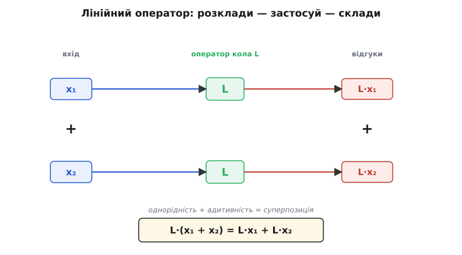

# 🧮 Чому з лінійних означальних рівнянь випливає суперпозиція

Коли кажуть «коло лінійне, тож працює суперпозиція», легко сприйняти це як два окремі факти, поставлені поруч. Насправді другий **виводиться** з першого, причому строго — це теорема, а не спостереження. Уся сила тут у тому, щоб простежити ланцюжок до самого низу: означальні рівняння трьох пасивних елементів лінійні → закони Кірхгофа лінійні → отже, система рівнянь усього кола лінійна → а для лінійної системи суперпозиція доводиться кількома рядками. Пройдемо цей шлях так, щоб у кінці суперпозиція виглядала не дивом, а неминучістю, і щоб стало зрозуміло, **чому саме** метод вимикання джерел дає правильну відповідь — а не просто «так роблять».

Спершу домовимося про мову. Без точного означення «лінійного» решта повисне, бо саме воно — той гвинт, на якому все тримається.

## Лінійний оператор: точне означення

Назвемо **оператором** будь-яке правило L, що бере вхід (функцію, число чи набір чисел) і повертає вихід. У теорії кіл вхід — це джерела (їхні напруги й струми як функції часу), а вихід — якась цікава нам величина: напруга на вузлі, струм у гілці. Запис L·x читаємо як «оператор L, застосований до входу x» (це не звичайне множення, хоч для блока-числа й збігається з ним).

Оператор L звуть **лінійним**, якщо він задовольняє дві умови — і обидві разом, бо кожна сама по собі недостатня.

**Однорідність** (англ. *homogeneity*, від гр. *homós* — однаковий): для будь-якого числа a
```
L·(a·x) = a·(L·x)
```
Масштаб входу виходить таким самим масштабом на виході. Подвоїв вхід — рівно подвоївся вихід; узяв із мінусом — вихід змінив знак.

**Адитивність** (лат. *additivus* — той, що додається): для будь-яких двох входів x₁ і x₂
```
L·(x₁ + x₂) = L·x₁ + L·x₂
```
Реакція на суму дорівнює сумі реакцій на кожен доданок окремо.

Ці дві умови зручно злити в одну, що зветься **умовою лінійності**: для будь-яких чисел a, b і входів x₁, x₂
```
L·(a·x₁ + b·x₂) = a·(L·x₁) + b·(L·x₂)
```
Поклади a = b = 1 — дістанеш адитивність; поклади b = 0 — дістанеш однорідність. Тобто одне рівняння тримає в собі обидві вимоги, і саме його ми перевірятимемо для кожної цеглинки кола. А якщо воно справджується для двох доданків, то індукцією — і для будь-якої скінченної суми:
```
L·(a₁·x₁ + a₂·x₂ + … + aₙ·xₙ) = a₁·(L·x₁) + a₂·(L·x₂) + … + aₙ·(L·xₙ)
```
Це вже і є суперпозиція в загальному вигляді: будь-яку комбінацію входів оператор «пропускає крізь себе» пододанково. Уся подальша робота — показати, що оператор реального кола саме такий.

> 🔧 **Навіщо це.** Означення дає робочий критерій-перевірку, а не настрій. Сумніваєшся, чи можна застосувати суперпозицію до якогось вузла? Спитай у нього два питання: масштабую вхід — масштабується вихід? подаю суму — складаються відгуки? Якщо обидва «так» — увесь апарат теорії кіл твій; якщо хоч одне «ні» — жоден зі звичних прийомів тут не гарантує правильної відповіді.



*Скелет суперпозиції в одній картинці. Той самий оператор кола L діє на кожну складову входу незалежно; сума окремих відгуків дорівнює відгуку на суму. Рівність унизу — L·(x₁+x₂) = L·x₁ + L·x₂ — це і є означення лінійного оператора, прочитане як обіцянка «розкладай і складай».*

## Чому афінне зі зсувом не лінійне — і чому це не дрібниця

Найкорисніше означення перевіряти на тому, що ним **не** є, бо саме там воно показує зуби. Візьмемо правило, яке на графіку — ідеальна пряма, але не лінійне:
```
A·x = k·x + c,    де c ≠ 0
```
Це **афінне** перетворення (лат. *affinis* — суміжний): пряма з нахилом k, зсунута на сталу c, тож вона **не проходить через нуль**. Інженери кажуть «лінійне зі зсувом», і саме це формулювання збиває з пантелику — перевірмо за означенням, чи воно справді лінійне.

Однорідність:
```
A·(2x) = k·(2x) + c = 2k·x + c
2·(A·x) = 2·(k·x + c) = 2k·x + 2c
```
Праві частини різняться на c. Рівність є лише за c = 0. Однорідність **провалена**.

Адитивність:
```
A·(x₁ + x₂) = k·(x₁ + x₂) + c = k·x₁ + k·x₂ + c       — один зсув c
(A·x₁) + (A·x₂) = (k·x₁ + c) + (k·x₂ + c) = k·x₁ + k·x₂ + 2c   — два зсуви c
```
Знову розбіжність на c: складаючи два окремі відгуки, ти двічі прихоплюєш сталу добавку, а коло-оригінал додає її лише раз. Адитивність **провалена**.

Корінь обох провалів той самий — стала c. Однорідність і адитивність обидві мовчазно вимагають, щоб **нульовий вхід давав нульовий вихід**: поклади x = 0 в однорідність (a = 0) — дістанеш L·0 = 0. Афінне правило цього не вміє: A·0 = c ≠ 0. Пряма, що не проходить через початок, лінійною бути не може **в принципі**, хоч би якою рівною вона була. Ось чому «лінійне» в строгому сенсі — вужче за «має графік-пряму»: воно вимагає ще й проходження через нуль.

Це не педантизм. Сталий зсув у колі — це реальна фізична річ: напруга зміщення на виході підсилювача, постійна складова сигналу, опорна напруга. Якби такий зсув входив у «лінійну» частину, суперпозиція давала б **систематичну похибку**, рівно кратну кількості складових, на які ти розбив задачу: розбив на дві — отримав зайвий зсув один раз, на десять — дев'ять разів. Тому в розрахунках сталу складову завжди **відокремлюють** і рахують нарізно, а суперпозицію застосовують лише до справді лінійної частини. Розбіжність «один c проти n·c» — це не абстракція, а саме та помилка, що вилізе в числі, якщо знехтувати означенням.

## Означальне рівняння резистора лінійне

Тепер опускаємося до заліза. Найпростіший елемент — резистор, його [закон Ома](topic:electronics/ohms-law) пов'язує миттєві напругу й струм прямою пропорційністю:
```
u(t) = R · i(t),   R — стала, від сигналу не залежить
```
Тут вхід — струм i, вихід — напруга u, а оператор — «помнож на R». Перевіримо умову лінійності прямо за означенням. Хай через резистор пропускаємо комбінацію двох струмів a·i₁ + b·i₂:
```
u = R · (a·i₁ + b·i₂) = a·(R·i₁) + b·(R·i₂) = a·u₁ + b·u₂
```
Усе зійшлося в один рядок — множення на сталу розкривається через дужку дослівно. Резистор лінійний.

Але зверніть увагу на застереження «R стала». Уся лінійність трималася на тому, що R можна було винести за дужку як спільний множник. Якби опір залежав від струму — R(i) — винесення зламалося б: R(a·i₁ + b·i₂) — це вже не a·R(i₁), бо опір при сумарному струмі інший, ніж при кожному поодинці. Саме тому розжарена лампа (опір нитки росте з температурою, а температура — зі струмом) **нелінійна**, хоч і складена ніби з «резистора»: її R не стала, і пропорційність u = R·i для неї не виконується. Лінійність елемента — це не про його назву, а про **сталість коефіцієнта**.

## Означальне рівняння конденсатора лінійне

Конденсатор зв'язує струм зі **швидкістю зміни** напруги:
```
i(t) = C · du/dt,   C — стала ємність
```
Тепер у формулу входить похідна — і вся справа в тому, що **диференціювання саме є лінійним оператором**. Це властивість математики, не електроніки: похідна суми дорівнює сумі похідних, а сталий множник виноситься за знак похідної. Запишемо це й застосуємо. Хай напруга на конденсаторі — комбінація a·u₁ + b·u₂:
```
i = C · d/dt (a·u₁ + b·u₂)
  = C · (a · du₁/dt + b · du₂/dt)      — лінійність похідної
  = a · (C·du₁/dt) + b · (C·du₂/dt)    — виносимо сталі C, a, b
  = a · i₁ + b · i₂
```
Знову точна умова лінійності. Конденсатор лінійний — бо лінійні обидві операції в його рівнянні: і множення на сталу C, і диференціювання. Композиція двох лінійних операцій лінійна, тож і весь оператор «струм із напруги» лінійний.

Тут теж критична **сталість C**. У конденсаторах із сегнетоелектричною керамікою (клас X7R і подібні) ємність помітно падає під прикладеною напругою — C(u). Така залежність робить елемент нелінійним: сталу за дужку вже не винесеш, бо при сумі напруг ємність інша. Тому в точних лінійних колах беруть діелектрики з малою залежністю (C0G/NP0), де C тримається сталою в робочому діапазоні, і лінійність зберігається.

## Означальне рівняння котушки лінійне

Котушка — дзеркальна конденсаторові: напруга пропорційна швидкості зміни струму:
```
u(t) = L · di/dt,   L — стала індуктивність
```
Структура рівняння та сама — стала на похідну, — тож і висновок той самий. Для комбінації струмів a·i₁ + b·i₂:
```
u = L · d/dt (a·i₁ + b·i₂)
  = L · (a · di₁/dt + b · di₂/dt)
  = a · (L·di₁/dt) + b · (L·di₂/dt)
  = a · u₁ + b · u₂
```
Котушка лінійна. І знову — лише поки L стала. Котушка з феромагнітним осердям **насичується**: коли струм великий, осердя вже не може намагнічуватися сильніше, індуктивність падає — L(i). За насиченням пропорційність ламається, і суперпозиція до такої котушки незастосовна. У лінійних розрахунках або тримаються нижче насичення, або беруть осердя без нього (повітряне, з розподіленим зазором).

Підіб'ємо проміжний підсумок трьох елементів. Усі три означальні рівняння мають однакову будову: **стала** (R, C або L) помножена на **лінійну операцію** над сигналом — пряме значення (резистор) або похідну (конденсатор, котушка). А добуток сталої на лінійну операцію — знову лінійна операція. Звідси й береться лінійність на рівні окремого елемента; усе інше коло складеться з цих цеглинок.

> 🔧 **Навіщо це.** Звідси видно межу застосовності всього апарата одним поглядом: лінійні методи чесні рівно доти, доки R, C, L можна вважати сталими. Гріється резистор, садиться під напругою керамічний конденсатор, входить в насичення дросель — будь-яка з цих подій робить відповідний коефіцієнт залежним від сигналу, і суперпозиція в цьому місці перестає давати правильну відповідь. Інженер мусить знати, який елемент першим вийде з лінійного вікна, бо саме він задасть стелю розмаху сигналу.

## Закони Кірхгофа лінійні

Окремі елементи лінійні, але коло — це ще й **спосіб їх з'єднання**, який задають два закони Кірхгофа. Якщо вони лінійні, то лінійним буде й усе зібране докупи; якщо ні — зв'язки могли б усе зіпсувати. Перевіримо.

Перший закон ([струмів](topic:electronics/kcl), KCL): сума струмів, що збігаються у вузлі, дорівнює нулю —
```
i₁ + i₂ + … + iₙ = 0
```
Це **однорідне лінійне** рівняння: ліворуч — лише сума величин із коефіцієнтами ±1, праворуч — нуль. Помнож усі струми на a — рівняння помножиться на a й залишиться правильним (0·a = 0). Додай до набору струмів інший набір, що теж задовольняє закон, — сума двох нулів є нуль. Жодної сталої добавки, ніякого зсуву — закон сам по собі тягне рішення через нуль.

Другий закон ([напруг](topic:electronics/kvl), KVL): сума напруг уздовж замкненого контуру дорівнює нулю —
```
u₁ + u₂ + … + uₘ = 0
```
Так само однорідне лінійне рівняння — та сама будова, той самий висновок. Обидва закони Кірхгофа — це просто твердження «певна сума дорівнює нулю», а немає нічого лінійнішого за суму, прирівняну до нуля.

Чому це так важливо саме тут? Бо означальні рівняння елементів описують **кожен елемент окремо**, а закони Кірхгофа — **як вони пов'язані**. Щоб лінійність кола трималася, лінійними мають бути обидва шари: і поведінка цеглинок, і правила їх стикування. Ми щойно показали, що обидва шари лінійні — отже, нічого нелінійного в систему не закрадається ні звідки.

## Складаємо коло: система лінійних рівнянь

Тепер зберемо все докупи й побачимо, як з лінійних шматків постає лінійна система. Опишемо коло, наприклад, методом вузлових потенціалів: запишемо KCL для кожного незалежного вузла, виразивши струми кожної гілки через означальні рівняння елементів і потенціали вузлів. Що вийде?

Кожен струм гілки — це лінійна операція над потенціалами (різниця потенціалів, поділена на R, або помножена на C·d/dt, тощо). KCL складає ці струми й прирівнює до струму, який нагнітають у вузол **джерела**. Збираючи все, дістаємо систему рівнянь такого вигляду (для кола лише з резисторів — суто алгебричну, з матрицею провідностей G, вектором вузлових потенціалів v і вектором струмів джерел s):
```
G · v = s
```
де **ліворуч** — лінійна операція над невідомими (потенціалами вузлів), а **праворуч** — внесок джерел. Коли в колі є конденсатори й котушки, замість чисел у матриці стоять лінійні операції з похідними, і система стає системою **лінійних диференціальних рівнянь** — але вона все одно лінійна: невідомі входять у першому степені, без добутків невідомих між собою, без функцій від невідомих, без сталих доданків, не пов'язаних із джерелами.

Ключове спостереження: **джерела стоять у правій частині**, окремо від оператора кола ліворуч. Саме джерела — це наш «вхід» x, а потенціали й струми — «вихід». Оператор кола (усе, що ліворуч: топологія плюс R, L, C) — лінійний, бо складений виключно з лінійних означальних рівнянь і лінійних законів Кірхгофа. А це рівно та ситуація, у якій ми вміємо доводити суперпозицію.

> 🔧 **Навіщо це.** Поділ «оператор кола ліворуч — джерела праворуч» — це і є каркас будь-якого числового розв'язувача кіл (того ж SPICE). Матриця G описує саму схему й не залежить від того, які саме джерела ввімкнені; вектор s — це збудження. Можна один раз обернути оператор, а потім швидко рахувати реакцію на різні набори джерел — саме тому що система лінійна й оператор від збудження не залежить.

## Суперпозиція як теорема: виведення

Усе готове, щоб довести головне. Маємо лінійну систему, що схематично записується як
```
L · y = s
```
де L — лінійний оператор кола, y — шукана реакція (потенціали, струми), s — збудження від джерел. Питання: що буде, якщо джерел кілька?

Запишемо повне збудження як суму внесків окремих джерел:
```
s = s₁ + s₂ + … + sₙ
```
(джерело k діє лише у своєму місці схеми, тож sₖ — це вектор, ненульовий тільки там). Тепер розв'яжемо **n окремих задач**, у кожній лишивши тільки одне джерело:
```
L · y₁ = s₁
L · y₂ = s₂
…
L · yₙ = sₙ
```
yₖ — це реакція кола, якби діяло **лише** джерело k. А тепер складемо ці окремі реакції й перевіримо, чи їхня сума розв'язує повну задачу. Застосуємо оператор L до суми y₁ + … + yₙ і скористаємося його **лінійністю** (адитивність + однорідність дозволяють розкрити оператор пододанково):
```
L · (y₁ + y₂ + … + yₙ) = L·y₁ + L·y₂ + … + L·yₙ
                       = s₁ + s₂ + … + sₙ
                       = s
```
Отже, сума окремих реакцій **задовольняє повне рівняння** L·y = s. А оскільки розв'язок лінійної системи єдиний (за коректних умов — реальне коло з втратами їх задовольняє), ця сума **і є** шуканою повною реакцією:
```
y = y₁ + y₂ + … + yₙ
```
Ось і вся суперпозиція. Повна реакція кола на всі джерела дорівнює сумі реакцій на кожне джерело окремо — і це не правило, прийняте на віру, а наслідок, **витягнутий з лінійності оператора** єдиним кроком L·(сума) = сума(L). Прибери лінійність — і середній рядок виведення впаде: L·(y₁+y₂) перестане дорівнювати L·y₁ + L·y₂, сума окремих реакцій перестане задовольняти повне рівняння, і весь метод втратить підставу. Уся теорема тримається рівно на тій одній властивості, яку ми по цеглинці зібрали з означальних рівнянь.

## Чому вимикання джерел означає саме «дріт» і «розрив»

Лишилося замкнути коло міркування на практику: виведення каже «лишити тільки джерело k», а на схемі треба знати, **що фізично зробити з рештою джерел**. Відповідь випливає з означення ідеального джерела — і знову не з угоди, а з логіки.

Коли ми розв'язуємо часткову задачу L·yₖ = sₖ, ми зануляємо всі компоненти збудження, крім k-го: у векторі s лишається тільки sₖ, решта sⱼ = 0. Тепер питання — що таке «джерело з нульовим збудженням» фізично.

**Ідеальне джерело напруги** силоміць тримає на своїх виводах задану напругу, хоч би що робив струм. Прирівняти його збудження до нуля — означає зробити цю напругу нульовою: «джерело 0 В». А двополюсник, на якому за будь-якого струму завжди 0 В, — це **ідеальний провідник**, тобто **дріт** (коротке замикання). Тому вимкнене джерело напруги заміняють дротом — не тому що «так домовилися», а тому що джерело 0 В **тотожне** шматку дроту: обидва тримають нуль вольт незалежно від струму.

**Ідеальне джерело струму** силоміць проганяє заданий струм, хоч би яка була напруга. Прирівняти його збудження до нуля — означає зробити цей струм нульовим: «джерело 0 А». А двополюсник, крізь який за будь-якої напруги тече рівно 0 А, — це **розрив** (обрив кола): тільки там, де немає шляху, струм гарантовано нуль за будь-якої напруги. Тому вимкнене джерело струму заміняють розривом — бо джерело 0 А **тотожне** обриву.

Симетрія тут не випадкова: напруга й струм — спряжена пара, і «вимкнути» для кожного означає занулити **свою** величину, лишивши другу вільною. Джерело напруги тримає напругу — нуль напруги при вільному струмі дає дріт. Джерело струму тримає струм — нуль струму при вільній напрузі дає розрив. Переплутати заміни (закоротити струмове чи розірвати напругове) — означає занулити не ту величину й дістати геть інше коло; помилка вилізе негайно, бо часткові внески складуться у відверту дурницю.

Один наслідок варто проговорити окремо, бо на ньому часто спотикаються: **внутрішні опори джерел залишаються на місці**. Заміна стосується лише *ідеальної* частини джерела (того самого s у правій частині). Якщо реальне джерело напруги моделюють як ідеальне ЕРС послідовно з внутрішнім опором, то «вимкнути» його — це занулити саме ЕРС (замінити дротом), а внутрішній опір **лишити** в схемі, бо він — частина лінійного оператора L (лівої частини), а не збудження. Те саме з паралельним опором джерела струму: ідеальну частину розриваємо, опір лишаємо. Плутати ці дві ролі — означає викинути з оператора те, що до нього належить, і знову зіпсувати відповідь.

## Один тонкий виняток: залежні джерела

Чесність вимагає назвати межу. Усе виведення мовчазно припускало, що джерела **незалежні** — їхнє збудження задане ззовні й не залежить від того, що коїться в колі. Бувають іще [залежні (керовані) джерела](topic:electronics/dependent-sources), чия величина пропорційна якійсь напрузі чи струму **всередині** самого кола (так моделюють підсилювальні властивості транзисторів). Чи ламають вони лінійність?

Ні — і це варто зрозуміти точно. Залежне джерело, чия величина **пропорційна** (з постійним коефіцієнтом) керівній величині, саме є лінійним елементом: його рівняння виду «вихід = стала × керівна величина» — це та сама пряма пропорційність, що й у резистора. Тому коло із залежними джерелами лишається лінійним, і суперпозиція для нього **діє**. Тонкість в іншому: залежне джерело — частина оператора L (лівої частини), а не зовнішнього збудження s. Тому при суперпозиції його **не вимикають**: воно має лишатися активним у кожній частковій задачі, бо реагує на внутрішній стан кола, який у кожній частковій задачі свій. Вимикають — почергово — лише **незалежні** джерела; залежні весь час лишаються в схемі, як і резистори. Сплутати їх із незалежними й «вимкнути» — груба помилка: це викинуло б шматок оператора, і часткові внески перестали б складатися в правду.

(Сам факт «хто й коли вперше чітко сформулював цей принцип» — окрема історія: загальне формулювання для розгалужених кіл дав Герман фон Гельмгольц у 1853 році, а тридцять років по тому інженерну форму еквівалентного джерела незалежно перевідкрив Леон Тевенен — *усталений факт*. Деталі того, як народжувалися ці ідеї, винесено в [історичну вставку теми](topic:electronics/linear-circuit/hist-superposition.md).)

## Що з цього випливає для всього апарата

Тепер видно, чому суперпозиція — не один трюк серед багатьох, а **корінь**, із якого ростуть решта методів теорії кіл. Кожен із них — це та сама рівність L·(сума) = сума(L), повернена іншим боком.

[Еквівалентні джерела Тевенена й Нортона](topic:electronics/thevenin-equivalent) існують саме тому, що залежність напруги на виводах від витягнутого струму — **пряма лінія** (наслідок лінійності), а пряму задають два числа. Комплексні опори й частотні характеристики працюють тому, що реакцію на суму синусоїд можна порахувати посинусоїдно й скласти — знову суперпозиція, тільки складові вибрано частотні. [Передавальні функції](topic:electronics/transfer-function) та перетворення Лапласа зводять лінійні диференціальні рівняння до алгебричних рівно тому, що лінійність дозволяє розкласти сигнал на елементарні складові, обробити кожну окремо й зібрати назад. Один корінь, багато плодів.

І та сама лінійність пояснює, чому лінійне коло **не породжує нових частот**: подаси синусоїду — оператор може змінити її розмах і фазу, але створити частоту, якої не було, не може, бо це порушило б суперпозицію над частотним розкладом. Поява нових частот ([гармонік](topic:electronics/harmonic-distortion)) — однозначна ознака того, що десь у колі рівняння перестало бути лінійним: коефіцієнт поплив із сигналом, характеристика зігнулася. Лінійність і породження частот — речі взаємовиключні, і тепер зрозуміло чому: одне є запереченням тієї самої рівності, на якій стоїть друге.

Звідси й остаточна думка. Уся зручність аналогового аналізу — право розбити складне на прості незалежні частини, розв'язати кожну окремо й скласти без поправок на взаємодію — це не властивість заліза сама по собі, а **логічний наслідок** двох куценьких рівнянь: однорідності й адитивності оператора. Виконуються вони — і складна задача розпадається на прості; зникають — і частини починають впливати одна на одну, сума перестає дорівнювати цілому, а разом із нею зникає й увесь апарат, що на ній тримався.
