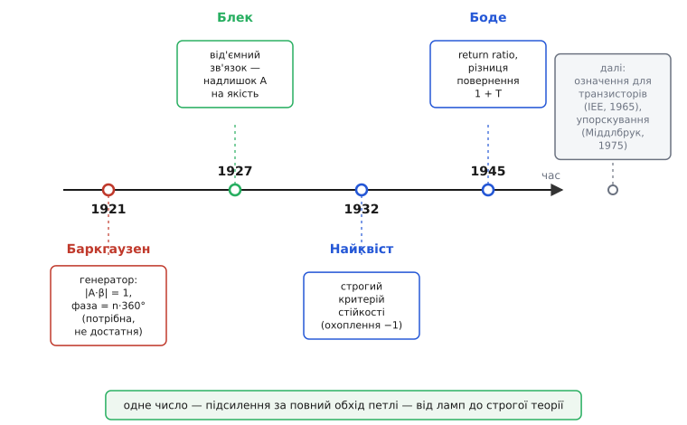

# 📜 Звідки взялося «підсилення в контурі»: від ламп, що самі свистіли, до строгого 1+T

Сьогодні інженер пише `T = A·β` так само звично, як `U = I·R`, і не задумується, що ця маленька формула — підсумок чвертьстолітньої боротьби з явищем, яке спершу здавалося просто капостю апаратури. Лампові схеми ні з того ні з сього починали свистіти. Підсилювач, зібраний за всіма правилами, замість того щоб тихо підсилювати, видавав на виході чисту синусоїду, якої ніхто на вхід не подавав. Телефонна лінія з підсилювачами вила. І довго ніхто не міг сказати наперед, **коли** схема засвистить, а коли — ні. Поняття «підсилення в контурі» народилося саме як спроба перетворити цю невловиму капость на число, яке можна порахувати ще до того, як паяти.

Історія тут не одна, а дві, і вони йдуть назустріч одна одній. Одна починається з людей, які свист **хотіли** — будівників генераторів, яким незатухна синусоїда була метою, а не лихом. Друга — з людей, які свист **ненавиділи**: телефонних інженерів, для яких та сама синусоїда означала зіпсований дзвінок. Перші дали поняттю критерій. Другі — строгу теорію. А зустрілися вони на одному й тому самому добутку `A·β`, бо фізика свисту в генераторі й у підсилювачі — буквально та сама фізика, тільки бажаний бік медалі різний.


*Поняття складалося з двох боків. Бік генератора — Баркгаузен: коли коло саме себе розгойдує. Бік підсилювача — Блек, Найквіст, Боде: як не дати колу розгойдатися й водночас вичавити з нього користь. Зійшлися на одному числі — підсиленні за повний обхід петлі.*

## Дрезден, 1921: фізик, який слухав залізо

Почнімо з людини, чиє ім'я носить найперший критерій. **Гайнріх Ґеорґ Баркгаузен** (нім. Heinrich Georg Barkhausen, 1881–1956) — німецький фізик, народжений у Бремені в родині окружного судді. Шлях у науку він пройшов не книжний: перш ніж вступити до інженерної школи, півроку відробив практикантом у депо ремонту залізниці — звичка спершу торкнутися заліза руками, а вже потім писати про нього формули, лишилася з ним назавжди. Він навчався по черзі в Мюнхені, Берліні, знову Мюнхені, а докторат здобув 1907 року в Ґеттінґені — і вже сама тема його дисертації віщувала все подальше: **«Проблема породження коливань»** (нім. *Das Problem der Schwingungserzeugung*). Питання «що змушує систему саму себе розгойдувати» стало справою його життя.

> 📌 Дати й факти біографії звірено за енциклопедичними джерелами (Britannica, ETHW — Engineering and Technology History Wiki, наукові біографічні словники); вони збігаються між собою. Статус: усталений факт.

1911 року, у двадцять дев'ять, Баркгаузен став професором у Вищій технічній школі Дрездена (нім. Technische Hochschule Dresden) — і обійняв **першу у світі кафедру цього профілю** (слабкострумова, високочастотна техніка). Це не дрібниця для нашої історії: він стояв біля самих витоків дисципліни, де лампа була новинкою, а її поведінка — здебільшого загадкою. Саме там, 1919 року, він зробив відкриття, яке й донині носить його ім'я поза всякою теорією зв'язку: **ефект Баркгаузена**. Він намагнічував залізо, обмотане котушкою, під'єднаною через підсилювач до гучномовця — і чув у динаміку тріск. Не плавне наростання, а саме тріск, шурхіт. Це були чутні стрибки: магнітні домени в залізі перемикалися не плавно, а різкими скоками. Людина буквально **почула** дискретність намагнічування. Цей епізод варто тримати в голові, бо він пояснює стиль Баркгаузена: він довіряв тому, що можна виміряти й почути, і шукав за явищем просту кількісну умову.

> 🔧 **Навіщо це.** Те, що першу умову коливань вивів саме експериментатор-лампник, а не чистий математик, лишило на критерії відбиток на сто років уперед: критерій Баркгаузена простий, наочний і **інженерно зручний** — його видно прямо на колі. Але та сама простота — його межа: він каже, де коливання **можуть** жити, та не гарантує, що вони там оселяться. Тому інженер, який ним користується, мусить знати рівно те, що знав Баркгаузен: це умова-вказівник, а не присуд.

## Умова незатухних коливань: |A·β| = 1 і фаза, кратна 360°

Чим займався Баркгаузен у Дрездені впритул до нашого поняття — це ламповими **генераторами**. Генератор — це підсилювач, якому навмисне повернули частину виходу на вхід **у фазі**, щоб він підхоплював власний сигнал і розгойдував його сам. Питання, яке стояло перед кожним, хто такий генератор будував: за якої умови коливання **встановляться** — не згаснуть і не розженуться в нескінченність, а триматимуться рівними, незатухними?

Баркгаузен сформулював цю умову 1921 року, у своєму чотиритомнику **«Підручник електронних ламп та їх технічних застосувань»** (нім. *Lehrbuch der Elektronenröhren und ihrer technischen Anwendungen*), що почав виходити в Ляйпциґу того року. У розділі про самозбудження (нім. *Selbsterregung*) він записав загальну умову, з якої давніша, вужча «формула самозбудження» виходила окремим випадком. Суть її — про той самий добуток, навколо якого крутиться вся наша тема. Незатухні коливання живуть там, де сигнал, обійшовши петлю **повне коло**, повертається сам у себе **точнісінько** таким, яким вийшов: ні більшим (бо тоді б розганявся), ні меншим (бо тоді б згасав), і **в тій самій фазі** (бо інакше підкручував би сам себе не туди). Двома рядками:

```
|A · β| = 1            модуль: за один обхід — рівно як було, без приросту й утрати
∠(A · β) = n · 360°    фаза:  повертається точно у фазу, n — ціле (0, 360°, 720°…)
```

Ось воно — **критерій Баркгаузена**. Зверніть увагу: тут уже стоїть наш `A·β`, добуток прямого підсилення на зворотну частку, хоч самого слова «loop gain» Баркгаузен англійською, звісно, не вживав — він писав про коефіцієнт самозбудження. Геометричний зміст кришталево простий: уявіть, що сигнал — це людина, яка йде по кільцевій доріжці. Щоб крокувати вічно по тому самому колу, вона має після повного оберту опинитися рівно там, звідки вийшла (фаза кратна 360°), і не змінитися в зрості (модуль 1). Стане трохи вищою за оберт — роздметься; трохи нижчою — зійде нанівець.

> 🔧 **Навіщо це.** Це той самий критерій, яким сьогодні **запобігають** свисту в підсилювачах — тільки навиворіт. Будівник генератора виводить коло **на** `|A·β| = 1`, щоб воно співало. Будівник підсилювача тримає коло **подалі** від цієї межі на критичній частоті, щоб воно мовчало. Одна формула — дві протилежні мети. Хто це вловив, той розуміє, чому стійкість підсилювача й робота генератора — це одне й те саме питання, поставлене з різних боків.

## Тонкість, яку треба сказати чесно: потрібна, але не достатня

Тепер — найважливіше застереження, і воно мусить прозвучати на повний голос, бо його століттями переказують неточно. Критерій Баркгаузена — це умова **необхідна, але не достатня**. Простими словами: якщо коло генерує незатухну синусоїду, то воно цю умову задовольняє — інакше й бути не може. Але навпаки **не** працює: коло може задовольняти `|A·β| = 1` і фазову умову — і при цьому **не** генерувати.

Чому так? Бо реальне коло — не одна-єдина точка на одній-єдиній частоті. Підсилення й фаза `A·β` міняються по всьому діапазону частот, і те, що умова виконалась на якійсь одній частоті, ще не каже, **як коло поводиться навколо** неї. Може статися, що крапка `|A·β| = 1` досягнута, та коло однаково сповзає до стійкого спокою, бо загальна картина його туди тягне. Критерій дивиться в одну точку — а доля коливань вирішується всім ходом кривої.

> 📌 «Необхідна, але не достатня» — не пізніше уточнення педантів, а визнаний факт теорії коливань: існують кола, що формально задовольняють критерій Баркгаузена й не генерують. Компактного критерію, який був би водночас і необхідним, і достатнім, у такій простій формі **не існує**. Статус: усталений факт (узгоджені формулювання в довідкових джерелах із теорії коливань).

Це не вада Баркгаузена — це чесна межа простої умови. Він дав інженерові надійний **вказівник**: «шукай коливання там, де модуль одиниця, а фаза кратна 360°». Вказівник показує напрям правильно. Але присуд «оселяться вони тут чи ні» вимагав глибшого інструменту — і той інструмент уже визрівав, тільки за океаном і з зовсім іншого приводу.

## Інша історія: телефонна лінія, що вила

Поки Баркгаузен у Дрездені виводив коло **на** коливання, по той бік Атлантики інженери відчайдушно **тікали** від них. Причина була суто практична й величезна за грошима: телефонні дзвінки на далеку відстань. Сигнал у мідній лінії згасає, тож через кожні десятки кілометрів його доводиться підсилювати. На лінії Нью-Йорк — Сан-Франциско таких підсилювачів — сотні поспіль. І тут вилазить лихо: лампа з часом міняє підсилення, кожен підсилювач трохи спотворює, а на сотнях каскадів ці дрібні спотворення накопичуються в нерозбірливе хрипіння. Потрібен був підсилювач, чиє підсилення **не пливе** й майже не спотворює, — а лампа сама по собі такого дати не могла.

Розв'язок прийшов 1927 року й увійшов у легенду буквально на клаптику газети. **Гарольд Стівен Блек** (англ. Harold Stephen Black, 1898–1983), інженер компанії Bell Telephone Laboratories, плив уранці поромом через Гудзон на роботу — і його осяяла думка: а що, як **навмисне** повернути частину виходу на вхід **у протифазі** й відняти? Підсилення впаде — але натомість схема сама себе виправлятиме. Не маючи під рукою паперу, він накидав ідею на газеті *The New York Times*, підписав і поставив дату — 2 серпня 1927 року. Так народився **від'ємний зворотний зв'язок** (англ. *negative feedback*).

> 📌 Дату й обставини «начерку на газеті» звірено за біографічними джерелами Bell Labs / IEEE (ETHW, історичні нариси). Епізод із поромом і газетою задокументував сам Блек; статус: усталений факт із поправкою, що деталі переказують у трохи різних версіях, але дата 2 серпня 1927 й суть незмінні.

Геніальність ідеї Блека — рівно та, яку розкриває наше поняття `T`: він **обміняв надлишок підсилення на якість**. Лампа дає підсилення з величезним запасом — то віддаймо цей запас на сталість і чистоту. Але разом із даром Блек приніс і прокляття: повертаючи сигнал на вхід, він замкнув **петлю**. А петля на якійсь частоті може накрутити зайвих 180° фази — і тоді віднімання обертається на додавання, від'ємний зв'язок стає додатним, і вся та сотня підсилювачів дружно зривається у виття. Блек **зробив** від'ємний зв'язок, але **передбачити**, коли він зірветься, ще не вмів. Бракувало строгого критерію стійкості. І ось тут на сцену виходить наступна постать.

## Найквіст, 1932: строгий присуд про стійкість

Поки патентне бюро роками вовтузилося із заявкою Блека, його колега по Bell Labs **Гаррі Найквіст** (швед. Harry Nyquist, 1889–1976; народжений у Швеції, емігрував до США підлітком) узявся за питання, яке Блек лишив відкритим: за якої точно умови підсилювач із петлею **лишається стійким**, а коли зривається? 1932 року Найквіст дав відповідь — строгу, повну, математично бездоганну. Те, що тепер звуть **критерієм Найквіста**.

Його ідея глибша за Баркгаузенову саме там, де Баркгаузенова не діставала. Найквіст не дивиться в одну точку `|A·β| = 1`. Він бере **всю** криву `A·β` по всіх частотах, малює її на комплексній площині як замкнену лінію — і дивиться, **охоплює** ця лінія фатальну точку −1 чи ні. Якщо охоплює — схема зірветься; якщо обходить стороною — стійка. Це вже не вказівник, а **присуд**: він враховує весь хід кривої навколо критичної точки, а не саму крапку. Саме тому критерій Найквіста відповідає на питання, на яке Баркгаузенів відповісти не міг: «оселяться коливання чи ні».

> 📌 Рік (1932) і авторство Найквіста звірено; Блек сам посилався на роботу Найквіста у своїй класичній статті **«Stabilized Feed-Back Amplifiers»** (1934). Походження Найквіста: народжений у Швеції (Нільсбю), емігрував до США 1907 року — не «американець за народженням». Статус: усталений факт.

Варто чітко покласти поряд два критерії, щоб не плутати їх повік:

```
Баркгаузен (1921):  дивиться в ОДНУ точку |A·β| = 1; умова НЕОБХІДНА.
                    Зручний для генераторів. Каже, ДЕ коливання можливі.

Найквіст (1932):    дивиться на ВСЮ криву A·β навколо точки −1; присуд ПОВНИЙ.
                    Розв'язує стійкість підсилювача. Каже, ЧИ зірветься.
```

Обидва крутяться навколо того самого `A·β`. Але Найквіст показав, що про долю петлі говорить не одне значення цього добутку, а **вся його поведінка** як функції частоти. Це підняло `A·β` зі статусу «зручної формули для лампового генератора» до статусу **головного об'єкта теорії зворотного зв'язку**. Лишалося одне: дати цьому об'єктові строге, однозначне означення. Бо тут ховалася підступна неясність, якої доти ніхто гостро не ставив.

## Підступне питання: а де закінчується A і починається β?

Уявіть реальну схему — не книжкову картинку з акуратними блоками «A» і «β», а сплетіння ламп, резисторів, конденсаторів. Ви хочете порахувати `T = A·β`. І раптом виявляється: **ніхто не підписав, де в цьому сплетінні пряме підсилення A, а де зворотна частка β.** Поділ петлі на «підсилювач» і «ланку зв'язку» — це наша зручна вигадка, а не фізична межа. У справжньому колі зворотний зв'язок часто протікає й «не туди»: трохи сигналу йде назад крізь сам підсилювач, ланка β трохи підсилює, межа розмазана.

А якщо межа умовна, то й `A`, і `β` окремо — величини умовні: проведеш межу трохи інакше — отримаєш інші `A` і `β`. Виходить, начебто й сам їхній добуток `T` залежить від того, де ми **вирішили** розрізати петлю? Це нестерпно для теорії: фізична доля схеми — зірветься вона чи ні — не може залежати від того, де інженер подумки провів олівцем рисочку. Потрібне було означення підсилення в контурі, **не прив'язане** до штучної межі «тут A, там β». Таке, що дає одне й те саме число, хоч як ділиш петлю — бо взагалі **не** питає, як її ділити.

> 🔧 **Навіщо це.** Це не схоластика, а щоденний головний біль того, хто міряє стійкість на реальній платі. Якщо `T` залежить від того, «де розрізати», то два інженери на одній схемі отримають два різні запаси стійкості — і обидва будуть «праві». Строге означення `T`, незалежне від місця розрізу, — це те, що робить запас стійкості **об'єктивним числом схеми**, а не справою смаку. Без нього вся практика вимірювання петлі висіла б у повітрі.

## Bell Labs, 1945: Боде дає строге означення — return ratio і 1 + T

Людиною, яка закрила це питання, став ще один колега Блека й Найквіста по Bell Labs — **Гендрик Вейд Боде** (англ. Hendrik Wade Bode, 1905–1982; американець голландського роду, народжений у Медісоні, штат Вісконсин; прізвище правильно вимовляти близько до «Бо́де», а не «Боуд»). Боде прийшов у Bell Labs 1926 року математиком, починав із проєктування фільтрів і вирівнювачів, а далі очолив групу, що перетворила винахід Блека з мистецтва на інженерну науку. Підсумок цієї роботи — його класична книга 1945 року **«Network Analysis and Feedback Amplifier Design»** («Аналіз кіл і проєктування підсилювачів зі зворотним зв'язком»). Книга народилася з неформального курсу, який Боде читав колегам у позаробочі години, — і стала на десятиліття головним текстом про зворотний зв'язок.

Що Боде туди вклав — це і є остаточне народження нашого поняття у строгій формі. Він увів дві пов'язані величини, які **обходять** усю плутанину з межею «де A, де β».

Перша — **співвідношення повернення** (англ. *return ratio*), позначмо `T`. Означення хитре й красиве: воно не ділить петлю на блоки, а чіпляється за саме джерело підсилення в колі (за залежне джерело, яким моделюють лампу чи транзистор). Подумки прибираємо це джерело й ставимо натомість незалежне пробне; дивимося, який сигнал **повернеться** до того місця, обійшовши коло; беремо відношення поверненого до пробного зі знаком мінус. Це відношення й є `T`. Жодного слова про те, «де A, де β» — означення питає лише: «що повернеться до джерела». А на це питання коло дає однозначну відповідь, хоч як ви потім захочете подумки ділити петлю.

Друга, ще універсальніша — **різниця повернення** (англ. *return difference*):

```
F = 1 + T
```

Те саме `(1 + T)`, що в основній статті ділить вихідний опір, гасить спотворення й тримає підсилення на `1/β`. Боде показав, що **саме ця величина** — справжня міра «скільки зворотного зв'язку працює», і вона визначена строго, через співвідношення повернення, без жодної опори на штучну межу. Замкнене підсилення, чутливість, вихідний опір — усе виражається через `F = 1 + T`, і всі ці вирази тепер мали **однозначний** зміст, бо `T` нарешті означене однозначно.

> 🔧 **Навіщо це.** Ось чому в строгих текстах кажуть не «loop gain», а «return ratio», і не «(1+Aβ)», а «return difference». Це не педантизм: коли петля проста (один блок A, один блок β, сигнал тече тільки в один бік), обидві мови збігаються, `T = A·β`. Але щойно коло складніше — зворотний потік крізь підсилювач, двобічні елементи — наївне `A·β` починає брехати, а Бодове означення через повернення лишається правильним. `T = A·β` — це **окремий випадок** строгого `T`, той, у якому нам пощастило з простою петлею.

Тут варто чесно розрізнити внески, щоб не злити трьох людей в одного. **Баркгаузен** дав **критерій** — умову, коли коло генерує (необхідну). **Найквіст** дав строгий **присуд про стійкість** — коли коло НЕ зірветься. **Боде** дав строге **означення самого поняття** `T` і `1+T`, незалежне від поділу петлі, і звів навколо нього всю інженерну теорію проєктування. Це три різні цеглини: умова, присуд, означення. Разом вони й склали те, що ми тепер коротко звемо «підсилення в контурі».

> 📌 Авторство, рік (1945), назва книги й роль Боде в теорії зворотного зв'язку звірено за бібліографічними й історичними джерелами Bell Labs / IEEE. Походження: американець голландського роду (англ. *of Dutch ancestry*), не «голландець» і не безіменний «західний учений». Статус: усталений факт.

## Що було далі: транзистори й упорскування в живу петлю

Історія на Боде не спинилася — бо змінилася сама елементна база, і поняття довелося переозначити заново. Боде писав про лампи. А коли світ перейшов на **транзистори**, виявилося, що тут поділ на «A» і «β» ще підступніший, ніж у лампах: транзистор двобічніший, зворотні шляхи всередині нього помітніші, і наївна картинка «підсилювач → ланка → назад» бреше частіше.

Тому 1965 року в трудах британського Інституту інженерів-електриків (англ. Institution of Electrical Engineers, IEE; журнал *Proceedings of the IEE*, том 112) вийшла спеціальна праця Р. Ф. Госкінса (англ. R. F. Hoskins) **«Definition of loop gain and return difference in transistor feedback amplifiers»** — «Означення підсилення в контурі й різниці повернення в транзисторних підсилювачах зі зворотним зв'язком». Її гострий висновок повертає нас до Бодової думки й заточує її: означати `T` через буквальний «сигнал, що тече реальними замкненими петлями», у транзисторних колах не лише не обов'язково, а часом **просто оманливо**. Правильний шлях — строге означення через повернення до залежного джерела, як у Боде, а не наївна картинка петлі.

> 📌 Праця, рік (1965), журнал (*Proceedings of the IEE*, т. 112) і її теза звірені за бібліографією IEE / IET. Статус: усталений факт.

Останній великий крок — уже про **вимірювання**, не лише означення. Як зміряти `T` на реальній платі, не розриваючи петлю фізично (бо розрив збиває режим)? 1975 року американський інженер **Р. Девід Міддлбрук** (англ. R. David Middlebrook, 1929–2010, Каліфорнійський технологічний інститут) описав **метод упорскування** (англ. *injection method*): у живу, замкнену петлю вганяють крихітний пробний сигнал у спеціальну точку й міряють відношення напруг (чи струмів) по обидва боки цієї точки. Це дає `T` **без** фізичного розриву й без потреби знати, «де A, де β». Аби впоратися з колами, де зворотний потік не нехтовний, Міддлбрук додав **подвійне упорскування** (напруги і струму), а згодом, 2006 року, узагальнив усе в **загальній теоремі зворотного зв'язку** (англ. *General Feedback Theorem*), що враховує й неідеальний зворотний хід.

> 📌 Метод упорскування Міддлбрука датовано 1975 роком (стаття про вимірювання підсилення в контурі); узагальнення (General Feedback Theorem) — 2006 рік (IEEE Microwave Magazine). Роки й авторство звірено. Статус: усталений факт.

Так замкнулося коло самого поняття. Те, що Баркгаузен побачив як «коефіцієнт самозбудження» лампового генератора, Боде означив строго через повернення, Госкінс переніс на транзистори, а Міддлбрук навчив **міряти** в живій схемі — і саме цей метод упорскування стоїть сьогодні в кожному симуляторі, коли інженер натискає «зняти петлеве підсилення».

## Що з цього винести

Поняття «підсилення в контурі» — не чиясь одинока вигадка, а злиття двох потоків думки навколо одного добутку `A·β`. **Гайнріх Баркгаузен** у Дрездені 1921 року, будуючи лампові генератори, дав першу умову незатухних коливань — `|A·β| = 1` і фаза, кратна 360°, — необхідну, але **не** достатню: вона показує, де коливання можливі, та не присуджує, що вони настануть. **Гарольд Блек** 1927-го винайшов від'ємний зворотний зв'язок, обмінявши надлишок підсилення на якість, але приніс із ним загрозу свисту. **Гаррі Найквіст** 1932-го дав строгий присуд про стійкість, поглянувши на **всю** криву `A·β` навколо точки −1. А **Гендрик Боде** 1945-го закрив головну неясність: означив `T` (співвідношення повернення) і `1 + T` (різницю повернення) строго, через повернення до джерела, **не** питаючи, де штучна межа «тут A, там β», — і саме це зробило аналіз зворотного зв'язку об'єктивним. Далі поняття переозначили для транзисторів (IEE, 1965) і навчилися міряти в живій петлі впорскуванням (Міддлбрук, 1975). Тому коли ви пишете `T = A·β` — пам'ятайте, що це зручний окремий випадок строгого Бодового означення, а за маленькою формулою стоїть чвертьстоліття праці над тим, щоб капость, від якої лампи свистіли, стала числом, яке рахують ще до паяння.
