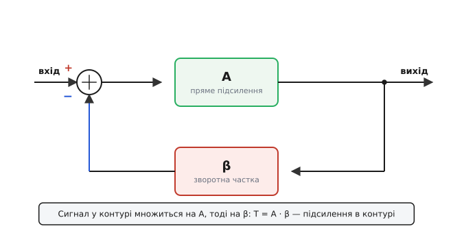
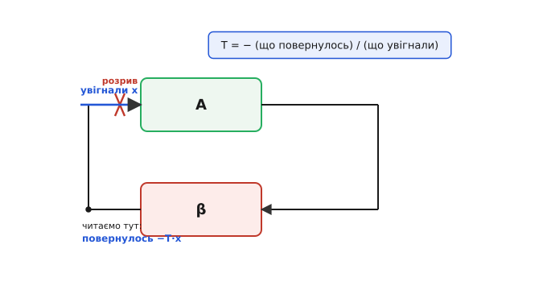
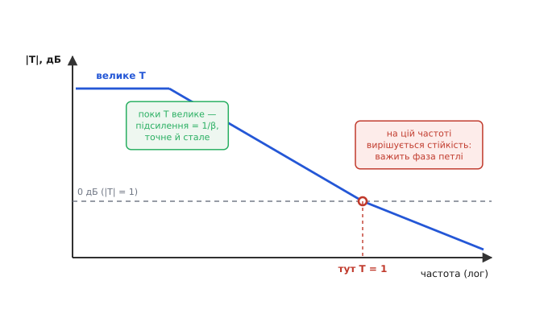

# Підсилення в контурі: одне число, що вирішує, наскільки добрий зворотний зв'язок

Візьміть операційний підсилювач. Сам по собі він майже непридатний: його підсилення гуляє від екземпляра до екземпляра в кілька разів, повзе з температурою, з частотою валиться. А обплетіть його двома резисторами в коло зі зворотним зв'язком — і раптом він точний, передбачуваний, стабільний: підсилення задається відношенням двох резисторів і не залежить майже ні від чого. Та сама мікросхема, чий «голий» характер ненадійний, у схемі поводиться зразково. Що саме перетворює капризну деталь на точний прилад — і **наскільки** перетворює?

Відповідь — одне число. Воно зветься **підсилення в контурі** (англ. *loop gain*), і це той множник, на який сигнал виростає, обійшовши петлю зворотного зв'язку повне коло. Чим він більший, тим повніше зворотний зв'язок придушує всі вади підсилювача — і тим точніше схема робить те, що задумано. Майже все добре, що дає [від'ємний зворотний зв'язок](book:electronics/negative-feedback) — сталість підсилення, лінійність, низький вихідний опір, широка смуга, — масштабується саме цим числом. А все небезпечне — насамперед загроза самозбудження — теж вирішується ним, точніше тим, чому воно дорівнює на критичній частоті.

> 🔧 **Навіщо це.** Підсилення в контурі — це лінійка, якою міряють, «скільки зворотного зв'язку» в схемі насправді є. Інженер не питає «чи є зворотний зв'язок» — він питає «яке T на робочій частоті». Бо саме T каже, у скільки разів схема точніша за голий підсилювач, наскільки нижчий її вихідний опір, де її смуга й чи не зірветься вона в генерацію. Хто мислить у термінах T, той не дивується, чому стабілізатор «дзвенить» на півмегагерца або чому точність підсилювача падає на високих частотах: він читає це прямо з графіка T.

### Що таке «контур» і чому в ньому множать

Уявімо найпростіший зворотний зв'язок наочно. Сигнал заходить, потрапляє на **суматор** — вузол, де віднімаються два внески. Далі — підсилювач із прямим підсиленням **A** (англ. *forward gain*): він бере різницю на своєму вході й роздуває її. Вихід підсилювача — це вже вихід усієї схеми. Але частина того виходу не йде назовні, а вертається назад: проходить крізь **ланку зворотного зв'язку** з коефіцієнтом **β** (зазвичай це звичайний дільник напруги з резисторів, що віддає назад якусь частку виходу) і подається на той самий суматор — із мінусом. Підсилювач весь час бачить різницю між тим, що йому веліли видати, і тим, що повернулося. Він підкручує вихід, поки ця різниця не стане крихітною. У цьому й уся ідея: ланка стежить за виходом і змушує його триматися заданого.


*Сигнал заходить у суматор, підсилюється в A разів, частина виходу вертається крізь β з мінусом. Обійшовши петлю повне коло, сигнал множиться на A·β — це й є підсилення в контурі T.*

Тепер головне питання: а скільки разів сигнал збільшиться, обійшовши петлю **повне коло**? Пройдемо подумки по колу. Хай на вході підсилювача з'явилася якась напруга. Помножилась на A — стала в A разів більшою на виході. Пішла крізь ланку β — помножилась іще на β. І повернулась на вхід суматора. Отже, за один повний оберт сигнал помножився на добуток:

```
T = A · β
```

Це і є **підсилення в контурі**. Назва буквальна: підсилення, набране за один обхід контуру. Множення тут не випадкове, а суть справи: ланки стоять одна за одною, а коли сигнал іде крізь послідовні ланки, їхні коефіцієнти перемножуються — так само, як два каскади підсилення дають добуток підсилень. Тому T — це **добуток** прямого підсилення на зворотну частку, а не сума й не щось хитріше.

Тонкість, яку важливо вловити одразу: T — це **не** підсилення схеми. Підсилення схеми (його звуть **замкненим**, англ. *closed-loop gain*) — це скільки разів вихід більший за вхід, цифра на кшталт ×10. А T — це окрема, внутрішня величина: наскільки виріс би сигнал, якби ми пустили його по самій петлі. Вона буває величезною — мільйон і більше — там, де замкнене підсилення лишається скромним ×10. Саме цей розрив між велетенським T і скромним виходом і є джерелом усієї користі.

### Чому велике T робить підсилення точним

Тепер виведемо на очах те, заради чого все затівалося: чому при великому T підсилення схеми перестає залежати від капризного A і визначається самою лиш ланкою β. Це найважливіша формула теми, і вона варта того, щоб прожити її повільно.

Позначмо вхід схеми Uвх, вихід Uвих. Підсилювач бачить на своєму вході різницю між входом і тим, що повернулося: (Uвх − β·Uвих). Цю різницю він множить на A. Результат — це і є вихід:

```
Uвих = A · (Uвх − β · Uвих)
```

Розкриваємо й збираємо Uвих в одне місце:

```
Uвих = A · Uвх − A · β · Uвих
Uвих + A · β · Uвих = A · Uвх
Uвих · (1 + A · β) = A · Uвх
```

Звідси замкнене підсилення — відношення виходу до входу:

```
            Uвих         A
Gзамк  =  ─────────  =  ─────────
            Uвх          1 + A · β
```

Це **центральна формула зворотного зв'язку**. Сама по собі вона ще нічого дивовижного не показує — поки ми не подивимось, що буде при **великому** A·β, тобто при великому T. Якщо T = A·β набагато більше за одиницю, то в знаменнику одиницею можна знехтувати: 1 + T ≈ T. І тоді:

```
        A          A         A      1
Gзамк ≈ ──── = ─────── = ─────── = ───
         T       A · β     A · β    β
```

A скоротилось. Дивіться, що сталося: замкнене підсилення стало дорівнювати **1/β** — і в ньому **більше немає A**. Те саме капризне, нестабільне, плавуче підсилення підсилювача зникло з відповіді. Лишилась тільки ланка β — а її ми робимо з двох точних резисторів, які не пливуть ні з температурою, ні з частотою, ні від екземпляра до екземпляра. Ось чому обплетений резисторами операційний підсилювач точний: при великому T його власне підсилення вже не вирішує, вирішує відношення резисторів у ланці β.

> 🔧 **Навіщо це.** Звідси випливає робоче правило проєктування: **точність схеми зі зворотним зв'язком — це точність ланки β, помножена на «майже-ідеальність» від великого T.** Хочеш підсилювач із похибкою 0.1% — постав резистори 0.1% у ланку й переконайся, що T на робочій частоті хоча б у тисячу разів більше за одиницю. Голий підсилювач може мати розкид підсилення ×3 — байдуже, якщо T велике: його розкид ділиться на T і зникає. Тому в даташиті операційного підсилювача підсилення без зворотного зв'язку (open-loop gain) подають величезним — 100 дБ і вище — саме щоб T вистачало з запасом.

### Скільки саме «майже»: повертаємось до 1+T

Наближення Gзамк ≈ 1/β зручне, але воно ховає те, наскільки точно схема тримає це 1/β. А ховається це в множнику (1 + T), який ми відкинули. Він має власне ім'я — **різниця повернення** (англ. *return difference*) — і це найуніверсальніша міра «скільки зворотного зв'язку насправді працює». Перепишімо точну формулу так, щоб 1/β і поправка стояли поряд:

```
        A           1        A · β        1         T
Gзамк = ───── = ─── · ───────── = ─── · ─────────
        1 + T        β    1 + A · β       β     1 + T
```

Множник T/(1+T) — це і є та сама «майже одиниця». Коли T = 1000, він дорівнює 1000/1001 = 0.999 — підсилення відхиляється від ідеального 1/β лише на 0.1%. Коли T падає до 10, множник стає 10/11 = 0.909 — і вже похибка цілих 9%. Видно прямо: **відносна похибка підсилення — це приблизно 1/T**. Удесятеро більше T — удесятеро точніше тримається 1/β.

Та сама (1 + T) керує не лише точністю підсилення. Вона **ділить** усе погане, що йде від підсилювача всередині петлі:

```
вихідний опір       Rвих(голий)
у схемі         =   ───────────
                      1 + T

спотворення         спотворення(голого)
у схемі         =   ───────────────────
                      1 + T
```

Чому так — варто відчути механізм на вихідному опорі, бо це чистий приклад того, як петля бореться зі збуренням. Хай на вихід схеми хтось «штовхнув» струмом — навантаження смикнуло напругу. Ланка β миттю помічає, що вихід зрушив, передає це зрушення на суматор, підсилювач у A разів сильніше відштовхує назад — і повертає вихід майже на місце. Зовні це виглядає так, ніби вихід має **дуже малий** опір: будь-яке збурення майже без сліду гаситься. Наскільки малий? Рівно в (1 + T) разів менший за «голий». Підсилювач із вихідним опором 100 Ом, охоплений зв'язком із T = 1000, показує назовні 100/1001 ≈ 0.1 Ом. Те саме (1 + T) гасить нелінійність: спотворення, що народжуються в підсилювачі, ланка «бачить» на виході й змушує підсилювач їх передкомпенсувати — тож назовні вони виходять ослабленими в (1 + T) разів.

> Це не випадковий збіг, що скрізь з'являється одне й те саме (1 + T). Чому **той самий** множник одночасно стабілізує підсилення, занижує вихідний опір, піднімає вхідний і лінеаризує каскад — і як це строго вивести для всіх чотирьох випадків — у вставці [різниця повернення 1+T як універсальний важіль зворотного зв'язку](book:electronics/loop-gain/math-return-difference.md). Там показано, звідки береться T/(1+T) у кожному з них від першопричини.

Звідси чесний висновок без прикрас: **зворотний зв'язок не дає нічого задарма — він обмінює надлишок підсилення на якість.** Голого A в підсилювачі сила-силенна (×100000), а назовні нам треба скромне ×10. Цей надлишок — у (1 + T) разів — і є та валюта, якою куплено точність, лінійність і малий опір. Велике T = багатий обмін; мале T = бідний. Уся гра зводиться до того, скільки T у тебе є на потрібній частоті.

**Чисельна перевірка: наскільки точно тримається підсилення.** Голий підсилювач з A = 200000, ланка β = 0.1 (тобто ціль — підсилення 1/β = ×10). Який вихід насправді й наскільки він відхиляється від ідеальних ×10?

:::tabs
```cpp
// Точна формула замкненого підсилення проти ідеалу 1/β
constexpr float A    = 200000.0f;  // голе підсилення
constexpr float beta = 0.1f;       // зворотна частка (резистивний дільник)

constexpr float T     = A * beta;         // підсилення в контурі = 20000
constexpr float Gid   = 1.0f / beta;      // ідеал = 10.0
constexpr float Greal = A / (1.0f + T);   // точне = 200000 / 20001 ≈ 9.9995

constexpr float err   = (Gid - Greal) / Gid; // відносна похибка ≈ 1/T = 5e-5 = 0.005%
```
```c
// Точна формула замкненого підсилення проти ідеалу 1/β
float A    = 200000.0f;   // голе підсилення
float beta = 0.1f;        // зворотна частка (резистивний дільник)

float T     = A * beta;            // підсилення в контурі = 20000
float Gid   = 1.0f / beta;         // ідеал = 10.0
float Greal = A / (1.0f + T);      // точне = 200000 / 20001 ≈ 9.9995

float err   = (Gid - Greal) / Gid; // відносна похибка ≈ 1/T = 5e-5 = 0.005%
```
```python
# Точна формула замкненого підсилення проти ідеалу 1/β
A    = 200000.0   # голе підсилення
beta = 0.1        # зворотна частка (резистивний дільник)

T     = A * beta          # підсилення в контурі = 20000
Gid   = 1.0 / beta        # ідеал = 10.0
Greal = A / (1.0 + T)     # точне = 200000 / 20001 ≈ 9.9995

err   = (Gid - Greal) / Gid  # відносна похибка ≈ 1/T = 5e-5 = 0.005%
```
:::

T = 20000, тож похибка ≈ 1/20000 = 0.005% — підсилення тримається ×10 з точністю краще соту відсотка, попри те що голе A величезне й розкидане. А тепер уявіть, що A впало вдвічі (нагрілось, постаріло): T стало 10000, похибка зросла до 0.01% — все одно мізер. Ось вона, нечутливість до A в дії: щоб похибка стала помітною, T має впасти на порядки.

### Як підсилення в контурі взагалі вимірюють

Поки T жило у формулах. Та інженеру треба його **зміряти** — на реальній платі, де ніхто не підписав, де там A, а де β. Прийом прямий і повчальний: **розірвати петлю** в одному місці, увігнати в розрив пробний сигнал і подивитися, що повернеться з іншого боку розриву. У скільки разів повернулося — стільки й T.


*Петлю розривають в одній точці. У вхід підсилювача вганяють пробний сигнал x, а на іншому боці розриву читають те, що обійшло коло й повернулось: воно дорівнює −T·x. Відношення й дає підсилення в контурі.*

Логіка проста. Розірвали петлю перед входом підсилювача. Увігнали туди пробу x. Вона пройшла A, пройшла β і повернулась до розриву — стала T·x за величиною. А мінус — бо зв'язок від'ємний, ланка повертає сигнал у протифазі. Отже:

```
                що повернулось
T = −  ───────────────────────
                що увігнали
```

Знак мінус тут — не формальність, а вся суть від'ємного зв'язку: повернений сигнал **протилежний** увігнаному, тому й гасить, а не роздуває. На практиці петлю рідко ріжуть фізично — це збиває режим схеми. Натомість упорскують крихітний змінний сигнал у спеціальну точку (часто через малий резистор у зворотній гілці) і міряють відношення напруг по обидва боки точки впорскування — це дає T, не розриваючи кола по постійному струму. Так знімають **усю криву T від частоти**, а не одне число, — і саме ця крива розповідає про схему найбільше.

> Як коректно ввести сигнал у працюючу петлю, не зачепивши робочого режиму, чому міряють відношення двох напруг навколо точки впорскування й чому це дає правильне T навіть коли межу «де A, де β» провести неможливо — це окрема техніка (метод Міддлбрука). Її серце: точне означення T через **співвідношення повернення** (return ratio), не залежне від того, де саме розрізати петлю.

### Найважче: T змінюється з частотою

Досі ми мовчки вважали T сталим. Насправді ні. Підсилення A падає з частотою — у будь-якого реального підсилювача воно велике на постійному струмі й валиться вгору по частоті (так влаштований [добуток підсилення на смугу](book:electronics/gain-bandwidth-product): що вища частота, то менше підсилення лишається). А разом з A падає й T = A·β. І це міняє все: на низьких частотах T величезне — зворотний зв'язок працює на повну, схема точна; на високих T мізерне — зв'язок майже не діє, і схема знов поводиться як голий підсилювач з усіма його вадами.


*Поки |T| високе (ліворуч), замкнене підсилення тримається точно на 1/β. З частотою |T| падає й перетинає рівень 0 дБ (|T| = 1). Саме на цій частоті — частоті одиничного підсилення в контурі — вирішується, стійка схема чи зірветься в генерацію.*

Звідси два висновки. Перший: **точність схеми не однакова на всіх частотах**. Та сама формула Gзамк ≈ 1/β справедлива, лише поки T велике. Де T опустилось до десятків, похибка вже відчутна; де T дійшло до одиниці — від зворотного зв'язку не лишилось майже нічого, і про точність годі говорити. Тому, коли в даташиті обіцяють підсилення з похибкою 0.01%, це завжди обіцянка **на низьких частотах**, де T ще багатий.

Другий висновок — найгостріший, і він про **виживання схеми**. Згадаймо: повернений сигнал гасить, бо він у протифазі — зсунутий на 180°. Але ж кожна ланка, кожен конденсатор, кожен каскад додає сигналу свій [зсув фази](book:electronics/phase-shift), і чим вища частота, тим більше набігає того зсуву. Уявіть, що на якійсь частоті петля накрутила зайвих 180° зверху. Тоді «протифаза» обернулась на «синфазу»: сигнал, що мав гаситися, тепер **додається сам до себе**. І якщо в цей момент T ще не встигло впасти нижче одиниці — петля підхоплює власний сигнал, роздуває його коло за колом, і схема зривається в **самозбудження**: на виході виникає синусоїда, якої ніхто не подавав. Стабілізатор «дзвенить», підсилювач свистить, давач шумить.

Ось чому критична частота — та, де **|T| = 1** (нуль децибелів). Це межа: вище неї петля вже безсила розгойдати себе, бо повернений сигнал слабший за вихідний. А весь ризик зосереджено саме в точці |T| = 1 — і питання лише одне: **скільки зайвої фази встигло набігти до цієї частоти.** Якщо до перетину нуля петля накрутила менше 180° — вертається ще «гальмівний» сигнал, схема стійка. Якщо встигла накрутити 180° раніше, ніж |T| впало до одиниці, — вертається підкручувальний сигнал, і схема генерує. Скільки фазового запасу лишилось до фатальних 180° на частоті |T| = 1 — це **запас фази**, головна цифра стійкості.

> Цей критерій — «дивись на фазу петлі в точці |T| = 1» — уперше чітко сформулював 1921 року німецький фізик [Гайнріх Баркгаузен](book:electronics/loop-gain/hist-barkhausen-bode.md), розбираючись із ламповими генераторами: незатухна синусоїда живе там, де підсилення в контурі рівне одиниці за модулем, а повний зсув фази кратний 360°. Той самий контур, що в генераторі **навмисне** виводять на |T| = 1 заради коливань, у підсилювачі **тримають подалі** від цієї межі заради тиші.

> Скільки саме градусів запасу треба лишати (звідки беруться канонічні 45° і 60°), як це читають на [діаграмі Боде](book:electronics/bode-plot) і що буде зі схемою при різному запасі — у темі [запас підсилення і запас фази](book:electronics/stability-margins). Корінь у неї точно тут: усе вирішується тим, чому дорівнюють модуль і фаза T на критичній частоті.

**Чисельна перевірка: де схема перетинає |T| = 1.** Підсилювач має на постійному струмі A₀ = 100000 і єдиний спад −20 дБ/декаду від частоти зламу 10 Гц (типова внутрішня компенсація). Ланка β = 0.01 (підсилення ×100). На якій частоті |T| впаде до одиниці?

:::tabs
```cpp
// |A(f)| ≈ A0 / (f/f0) на високих частотах (однополюсний спад)
// |T(f)| = |A(f)| * beta = 1  →  шукаємо частоту перетину
constexpr float A0   = 100000.0f;  // голе підсилення на постійному струмі
constexpr float f0   = 10.0f;      // частота зламу A, Гц
constexpr float beta = 0.01f;      // зворотна частка (ціль ×100)

constexpr float T0      = A0 * beta;   // T на постійному струмі = 1000
// |T| = T0 * f0 / f = 1  →  f = T0 * f0
constexpr float f_cross = T0 * f0;     // 1000 * 10 = 10000 Гц = 10 кГц
```
```c
// |A(f)| ≈ A0 / (f/f0) на високих частотах (однополюсний спад)
// |T(f)| = |A(f)| * beta = 1  →  шукаємо частоту перетину
float A0   = 100000.0f;   // голе підсилення на постійному струмі
float f0   = 10.0f;       // частота зламу A, Гц
float beta = 0.01f;       // зворотна частка (ціль ×100)

float T0      = A0 * beta;         // T на постійному струмі = 1000
// |T| = T0 * f0 / f = 1  →  f = T0 * f0
float f_cross = T0 * f0;           // 1000 * 10 = 10000 Гц = 10 кГц
```
```python
# |A(f)| ≈ A0 / (f/f0) на високих частотах (однополюсний спад)
# |T(f)| = |A(f)| * beta = 1  →  шукаємо частоту перетину
A0   = 100000.0   # голе підсилення на постійному струмі
f0   = 10.0       # частота зламу A, Гц
beta = 0.01       # зворотна частка (ціль ×100)

T0      = A0 * beta   # T на постійному струмі = 1000
# |T| = T0 * f0 / f = 1  →  f = T0 * f0
f_cross = T0 * f0     # 1000 * 10 = 10000 Гц = 10 кГц
```
:::

T на постійному струмі — цілих 1000 (схема там точна до 0.1%), але до 10 кГц воно зсихається до одиниці. Вище 10 кГц зворотного зв'язку фактично немає. І саме біля цих 10 кГц вирішується, стійка схема чи ні: якщо однополюсний спад єдиний, фаза петлі там лише −90°, запас аж 90° — спокій; а додай у петлю другий злам (ємність навантаження, повільний другий каскад) — фаза підкрадеться до −180°, запас з'їсться, і на тих самих 10 кГц схема засвистить.

### Що варто винести

Підсилення в контурі T = A·β — це множник, на який сигнал виростає за один повний обхід петлі зворотного зв'язку; не плутати із замкненим підсиленням схеми, яке лишається скромним там, де T велетенське. Уся користь від'ємного зв'язку масштабується **різницею повернення (1 + T)**: замкнене підсилення = (1/β)·T/(1+T), тож при великому T воно дорівнює 1/β й більше не залежить від капризного A — звідси точність; вихідний опір і спотворення діляться на (1 + T) — звідси низький опір і лінійність. Відносна похибка підсилення ≈ 1/T: удесятеро більше T — удесятеро ближче до ідеалу. Зворотний зв'язок нічого не дає задарма — він міняє надлишок голого підсилення на якість, і валюта обміну — це (1 + T). Виміряти T можна, розірвавши петлю (чи впорснувши пробу) і подивившись, у скільки разів вона повертається. Та головне: T падає з частотою разом з A, тож точність живе лише там, де T ще велике, а на частоті, де **|T| = 1**, вирішується доля схеми — стійка вона чи зірветься в генерацію, і вирішує це фаза, набігла в петлі до цієї частоти. Хто читає схему очима T, той знає водночас, наскільки вона точна й наскільки близька до краю.

---
