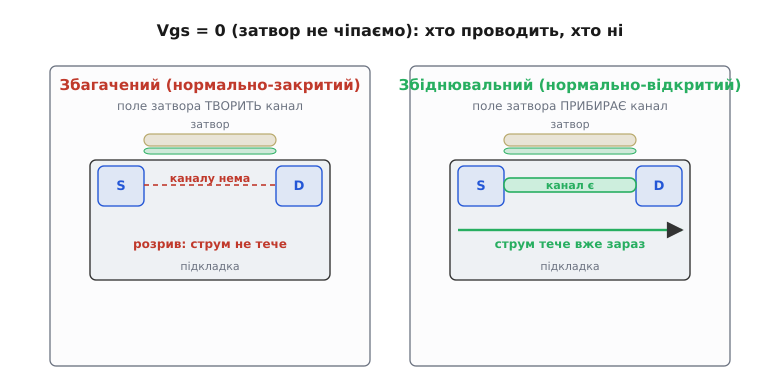
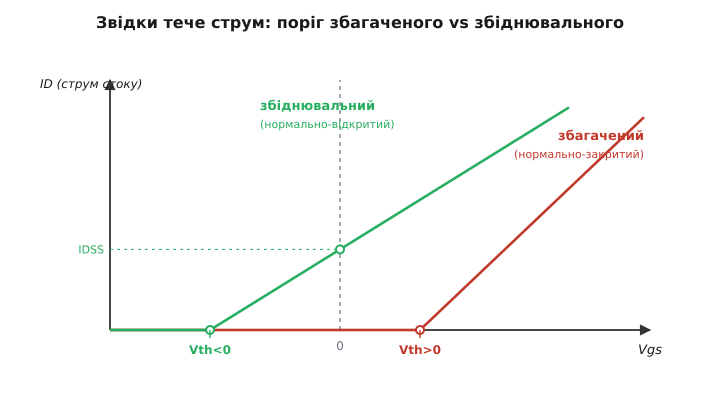
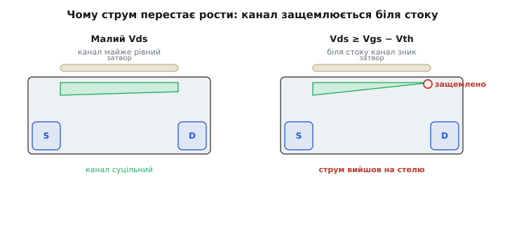
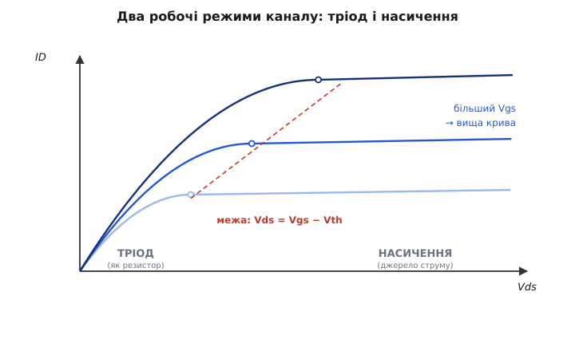

# MOSFET: збагачений і збіднювальний режим

У польового транзистора напругою на затворі керують [полем](topic:electronics/field-control), а поле задає, скільки струму пройде каналом «витік → стік». Та лишається питання, з якого все починається: **а що там у каналі, поки затвор не чіпаємо?** Відповідь розколює всі MOSFET на два роди. В одних при нульовій напрузі затвора каналу **немає** — і поле мусить його **створити**, щоб транзистор провів. В інших канал **уже є** з заводу — і поле, навпаки, потрібне, щоб його **прибрати** й транзистор закрити. Перший рід звуть **збагаченим** (англ. *enhancement* — збагачувати, нарощувати), другий — **збіднювальним** (англ. *depletion* — спустошувати, збіднювати). Самі назви кажуть про дію поля на канал: одне його **збагачує** носіями, друге **збіднює**.

Ця різниця — не дрібний нюанс будови, а те, від чого залежить уся поведінка: чи транзистор за замовчуванням **закритий** і його треба відкривати, чи **відкритий** і його треба закривати. Розберімо обидва роди, а тоді — два робочі режими каналу (тріод і насичення), що однакові для них обох.

### Два старти: канал з заводу чи канал від поля

Уявімо ту саму будову, що в будь-якого MOSFET: брусок напівпровідника-підкладки, на ньому два сильнолеговані острівці (витік і стік), а зверху — затвор, відділений від підкладки тонким шаром скла-ізолятора. Уся гра — у тоненькій смужці прямо під затвором, між витоком і стоком. Саме там виникає (чи не виникає) провідний **канал**.

У **збагаченого** транзистора цю смужку лишають такою, як підкладка, — без каналу. При нульовій напрузі затвора витік і стік розділені суцільним напівпровідником протилежного типу, який струму між ними не пускає: це наче два діоди назустріч. Транзистор **закритий**. Щоб його відкрити, на затвор подають напругу потрібного знаку: її поле притягує під скло носії з підкладки, і там, де їх збереться досить, простягається провідна доріжка від витоку до стоку. Поле **наростило** канал з нічого — звідси й «збагачений».

У **збіднювального** транзистора ту саму смужку під затвором **легують заздалегідь** так, щоб провідний канал стояв там **сам**, ще до будь-якої напруги. При нульовому затворі струм уже тече — транзистор **відкритий**. Щоб його закрити, на затвор подають напругу **протилежного** знаку: її поле **виштовхує** носіїв із готового каналу, той рідшає, опір росте, і за певної напруги канал **збіднюється** настільки, що зникає зовсім. Поле тут не творить, а **спустошує** — звідси «збіднювальний».


*При нульовій напрузі затвора. Ліворуч — збагачений: між витоком і стоком розрив, струм не тече (нормально-закритий). Праворуч — збіднювальний: канал улаштований з заводу, струм тече вже зараз (нормально-відкритий). Поле затвора одному додає канал, іншому — прибирає.*

Ось чому ці два роди по-різному звуть ще й **нормально-закритий** і **нормально-відкритий**: слово «нормально» тут означає «у спокої, без сигналу на затворі». Збагачений нормально закритий — як вимикач, що сам стоїть розімкнений; збіднювальний нормально відкритий — як вимикач, що сам стоїть замкнений, поки його не розмикнеш.

> 🔧 **Навіщо це.** Перше, що треба знати про незнайомий MOSFET, — нормально він закритий чи відкритий, бо від цього залежить безпека всієї схеми. Якщо ви ставите ключ між живленням і мотором, нормально-закритий збагачений транзистор у разі обриву керування **сам відключить** мотор — безпечно. Нормально-відкритий збіднювальний за того самого обриву **сам увімкне** навантаження на повну — і це може бути аварія. Тому переважна більшість силових і цифрових MOSFET — саме збагачені: «нема сигналу — вимкнено» закладено у фізику.

### Поріг: де починається струм

Грань між «закрито» і «відкрито» задає одне число — **порогова напруга** (англ. *threshold* — поріг; позначають Vth або V_GS(th)). Це та напруга затвор–витік, з якої канал саме починає проводити. І весь контраст двох родів зводиться до **знаку** цього порога.

У збагаченого N-канального транзистора поріг **додатний** (Vth > 0). Поки Vgs нижча за поріг, каналу нема, струм нульовий; перевищили поріг — канал виник, пішов струм. Щоб відкрити — треба **додати** напруги до порога.

У збіднювального N-канального транзистора поріг **від'ємний** (Vth < 0). При Vgs = 0 канал уже відкритий і тече помітний струм (його при нульовому затворі позначають IDSS). Щоб закрити такий транзистор, треба подати **від'ємну** напругу — опустити Vgs аж до від'ємного порога, де канал спустошиться.

Найкраще це видно на **передавальній кривій** — як струм стоку залежить від напруги на затворі.


*Струм стоку від напруги затвор–витік. Збагачений (червоний) до свого додатного порога мовчить, далі росте — його треба «вмикати». Збіднювальний (зелений) при Vgs=0 уже дає струм IDSS, а закривається аж від'ємною напругою — його треба «вимикати». Уся різниця двох родів — у тому, по який бік нуля сидить поріг.*

Помітьте: крива **форму** має ту саму — мовчання до порога, тоді ріст; зсунута лише точка порога. Збіднювальний — це наче збагачений, у якого криву **посунули ліворуч за нуль**, так що при Vgs = 0 ми вже сидимо на похилій ділянці. Тому збіднювальний транзистор уміє більше: на нього можна подавати напругу **обох знаків**. Додатна напруга на затворі ще **підсилить** його канал (притягне більше носіїв, струм зросте над IDSS), від'ємна — **збіднить** (струм упаде до нуля). Один прилад працює і на збагачення, і на збіднення — звідси, до речі, і друга назва збагаченого режиму, **підсилювальний**: подаючи напругу того знаку, що нарощує канал, поле «підсилює» провідність.

> 🔧 **Навіщо це.** Знак порога вирішує, як ви керуєте затвором. Щоб надійно тримати збагачений N-MOSFET **закритим**, досить стягнути затвор до витоку (Vgs = 0) — а це робиться простим резистором на землю. Збіднювальний так не закриєш: щоб його вимкнути, треба десь узяти **від'ємну** напругу відносно витоку, а це окрема морока зі схемою зміщення. Тому в простій логіці й силових ключах майже завжди беруть збагачений: його «вимкнено» дається задарма.

Для повноти: усе сказане про N-канальні транзистори дзеркально справджується для [P-канальних](topic:electronics/nmos-pmos) — там носії та знаки протилежні, тож збагачений P-MOSFET має від'ємний поріг, а збіднювальний — додатний. Логіка та сама, лише полярності перевернуті.

### Звідки в каналі струм: рівняння в насиченні

Коли канал уже відкритий (байдуже, наростило його поле чи він стояв з заводу), скільки ж струму він несе? Тут є проста й глибока думка. Що дужче поле затвора перевищує поріг, то густіший канал і то більший струм. Цей «надлишок над порогом» так і звуть — **напруга перекриття** (англ. *overdrive* — наднапруга):

```
V_ov = Vgs − Vth        (наскільки затвор перевищив поріг)
```

Саме від V_ov, а не від самої Vgs, залежить, наскільки відкрито канал. У робочому, насиченому режимі (про нього — далі) струм стоку зростає з перекриттям **квадратично**:

```
ID = (k / 2) · (Vgs − Vth)²
```

де k — коефіцієнт, що збирає в собі геометрію транзистора й властивості матеріалу (ширину каналу, товщину скла, рухливість носіїв). Квадрат тут не випадковий, а має ясну причину: більше перекриття водночас і **згущує** канал носіями, і **сильніше тягне** їх до стоку — два множники ростуть разом, тому струм іде як квадрат. Це закон зовсім інший, ніж у [біполярного транзистора](topic:electronics/bjt-operation), де струм від керівної напруги залежить **експонентно**; ця відмінність форми кривої й визначає, чим MOSFET відрізняється як підсилювач. Докладне виведення квадратичного закону — від заряду в каналі до інтеграла вздовж нього — винесено в [окрему математичну вставку](topic:electronics/mosfet-modes/math-square-law.md).

Для збіднювального транзистора формула та сама, лише поріг від'ємний. Підставивши Vgs = 0, дістаємо струм спокою:

```
IDSS = (k / 2) · (0 − Vth)² = (k / 2) · Vth²        (струм при нульовому затворі)
```

— той самий струм, з яким збіднювальний транзистор стоїть відкритим, поки його не чіпають.

**Приклад. Збагачений N-MOSFET: Vth = 2 В, k = 0.5 А/В². Який струм у насиченні при Vgs = 5 В?**
```
V_ov = Vgs − Vth = 5 − 2 = 3 В
ID   = (k/2)·V_ov² = (0.5/2)·3² = 0.25·9 = 2.25 А
```
Перекриття 3 В дає 2.25 А. Підняли б Vgs до 6 В (перекриття 4 В) — струм стрибнув би до 0.25·16 = 4 А: на третину більша напруга, майже вдвічі більший струм. Ось вона, квадратичність у дії.

### Канал — це конденсатор, і в нього не тече струм

Перш ніж розбирати робочі режими, варто закріпити, **чому** затвор керує каналом, нічого не споживаючи. Затвор разом із каналом — це обкладки [конденсатора](topic:electronics/capacitive-reactance), між якими тонке скло-ізолятор. Подаючи на затвор напругу, ми **заряджаємо** цей конденсатор; накопичений заряд своїм полем дивиться крізь скло в напівпровідник і задає густину носіїв у каналі. А заряджений конденсатор у спокої струму не пропускає — тому, поки ми **тримаємо** напругу на затворі, у нього струму **не тече зовсім**.

Це справджується для обох родів однаково. У збагаченого поле затвора стягує носіїв під скло й **будує** канал; у збіднювального поле виштовхує носіїв із готового каналу й **руйнує** його, — але в обох випадках це робить нерухомий заряд на ізольованій обкладці, без жодного постійного струму керування. Звідси й [колосальний вхідний опір](topic:electronics/transconductance) MOSFET: затвор «слухає» напругу, нічого з неї не відбираючи.

> 🔧 **Навіщо це.** «Канал є конденсатор» пояснює одразу дві речі. По-перше, чому в статиці затвор не споживає струму — заряджений конденсатор не пропускає. По-друге, чому **перемикання** все ж потребує струму — щоб **перезарядити** цю ємність, як будь-який конденсатор; саме [ємність затвора](topic:electronics/switching-transients) обмежує, як швидко MOSFET вмикається. Тримати стан — задарма; швидко міняти — раз у раз заливати-зливати заряд у затвор.

### Два режими каналу: тріод і насичення

Дотепер ми дивилися лише на затвор. Та струм каналу залежить ще й від напруги **витік–стік** (Vds) — від того, наскільки сильно ми «тягнемо» струм крізь канал. І тут відкривається, що відкритий канал має **два різні режими роботи**, залежно від Vds. Це справедливо для обох родів, бо щойно канал виник, далі вже неважливо, як він виник.

Поки Vds **мала**, канал поводиться просто як **резистор**, опором якого керує затвор. Більша напруга стік–витік — пропорційно більший струм; більше перекриття на затворі — менший опір каналу. Цей режим звуть **тріодним** (або лінійним, омічним): транзистор тут — це керований напругою резистор. Подвоїли Vds — майже подвоївся струм.

Але так триває не завжди. Підіймаймо Vds далі. Уся хитрість у тому, що канал тоненький, і напруга вздовж нього **спадає** від стоку до витоку. Біля витоку повна напруга затвора згущує канал; а біля стоку, де потенціал каналу вже піднявся ближче до Vds, **різниця** між затвором і каналом меншає — отже, поле там слабшає, і канал біля стоку **рідшає**. Коли Vds сягає рівня перекриття (Vds = Vgs − Vth), різниця між затвором і каналом біля самого стоку падає до порога, і канал у цій точці **защемлюється** — звужується до нуля.


*Канал — клин: біля витоку товстий, біля стоку тонший, бо там поле затвора слабше. При малому Vds канал майже рівний (ліворуч). Коли Vds доростає до Vgs − Vth, канал біля стоку защемлюється (праворуч) — і струм виходить на стелю.*

Можна було б подумати, що защемлення обірве струм, — але ні, стається протилежне: струм **застигає на сталому рівні** й далі майже не росте з Vds. Це режим **насичення**. Чому струм не падає до нуля? Бо носії, дійшовши до защемленої точки, не зникають — їх **підхоплює сильне поле** області стоку й переносить далі. А чому й не росте? Бо вся напруга, що ми додаємо понад точку защемлення, падає на короткій збідненій ділянці біля стоку, а на самому провідному каналі лишається та сама напруга (рівно перекриття). Канал «бачить» сталу напругу — тож і жене сталий струм, незалежно від того, наскільки високо ми задерли Vds.

Ось і виходить, що **той самий** транзистор у двох режимах — два різні прилади. У тріоді він — **керований резистор**, у насиченні — **кероване джерело струму**.


*Струм стоку від напруги стік–витік для кількох значень Vgs. Зліва, поки Vds мала, — тріод: струм круто росте (канал як резистор). Праворуч від межі Vds = Vgs − Vth — насичення: струм виходить на майже горизонтальну поличку (джерело струму). Що більше перекриття на затворі, то вища полиця.*

> 🔧 **Навіщо це.** Ці два режими — це два геть різні застосування того самого транзистора, і їх не можна плутати. Хочете **ключ** — заганяйте MOSFET глибоко в **тріод**: там його опір малий і сталий (десятки міліом), падіння напруги крихітне, тепла мало. Хочете **підсилювач** — тримайте його в **насиченні**: там він джерело струму, кероване напругою затвора, і вірно відтворює форму сигналу. Той самий прилад: у ключі його тиснуть у тріод, у підсилювачі — у насичення. Сплутати режими означає або підсилювач, що гріється як ключ, або ключ, що падає на собі вольти замість міліовольтів.

Зведімо. Транзистор у насиченні, якщо Vds ≥ Vgs − Vth (канал защемлено, струм сталий, джерело струму). У тріоді, якщо Vds < Vgs − Vth (канал суцільний, струм росте з Vds, керований резистор). А чи відкритий канал узагалі — вирішує поріг: Vgs має перевищити Vth (для збагаченого — додатний поріг, для збіднювального — від'ємний).

### Де який рід працює

Складімо все докупи й погляньмо, кому який рід дістався в реальній техніці.

**Збагачений** (нормально-закритий) захопив майже все. Уся цифрова мікроелектроніка — процесори, пам'ять, [КМОН-логіка](topic:electronics/cmos) — стоїть на збагачених транзисторах: ключ, що сам стоїть вимкненим, поки на затвор не подали напругу, — це природна «нула» для логіки, і мільярди таких ключів на кристалі в спокої струму не тягнуть. Силові ключі — драйвери моторів, перетворювачі живлення — теж майже всі збагачені: «нема керування — вимкнено» тут питання безпеки.

**Збіднювальний** (нормально-відкритий) лишився в небагатьох, але влучних нішах. Його головна цінність — що він **проводить сам, без жодного зміщення**. Це робить його ідеальним [джерелом стабільного струму](topic:electronics/current-source): з'єднайте затвор із витоком (Vgs = 0), і транзистор жене сталий IDSS, ні від чого не залежний, — найпростіше двовивідне джерело струму, без жодного живлення для керування. Така ж властивість дає «нормально-замкнені» реле, що проводять при знеструмленому керуванні, і знаходить застосування у [високочастотних каскадах](topic:electronics/transconductance), де нормально-відкритий прилад зручний для зміщення. Збіднювальні транзистори рідкісніші й дорожчі, тож беруть їх саме там, де властивість «відкритий за замовчуванням» справді потрібна.

І збагачений, і збіднювальний — це той самий [польовий принцип](topic:electronics/field-control): напруга на затворі полем керує провідністю каналу. Уся їхня відмінність — у єдиному виборі при виготовленні: лишити канал порожнім (хай поле його **будує**) чи закласти канал заздалегідь (хай поле його **прибирає**). Один вибір — а з нього випливає і знак порога, і чи прилад нормально-закритий, і де він знайде собі роботу. А щойно канал відкрито, обидва живуть за одними правилами: тріод під малою напругою стоку, насичення — під великою, межа між ними — там, де канал защемлюється.
