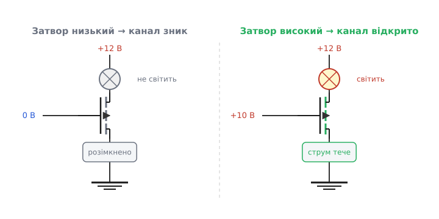
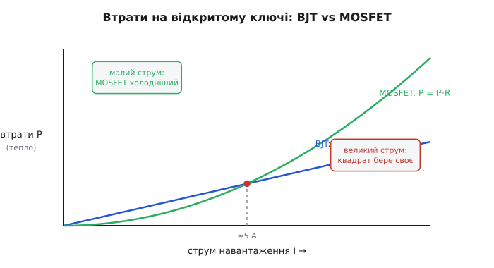
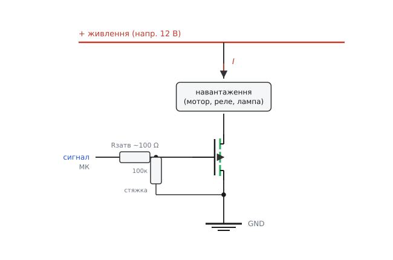

# MOSFET як ключ

Найчастіше польовий транзистор у схемах роблять не підсилювачем, а **ключем** (англ. *switch* — вимикач): крихітна напруга на затворі або **замикає** шлях для великого струму, або **розмикає** його. Подав на затвор «плюс» — навантаження ввімкнено; прибрав — вимкнено. Так керують мотором, реле, світлодіодною стрічкою, нагрівачем — усім, що треба клацати з виводу мікроконтролера, але що сам вивід не тягне. Це та сама роль, що й у [біполярного транзистора-ключа](topic:electronics/bjt-switch), але виконана іншим приладом — і саме «іншим» тут найцікавіше, бо MOSFET клацає чистіше й гріється менше.

### Чому саме ключ, і чому MOSFET

Вивід мікроконтролера видає логічний рівень — нуль або 3.3/5 В, — але **струму** дає мало, десятки міліампер на межі. Світлодіод він засвітить, а реле (десятки мА), мотор (ампери) чи нагрівач — уже ні: або вивід перегріється, або просто бракне сили. Потрібен підсилювач струму — щось, що від кволого сигналу пропустить крізь себе потужний струм окремого джерела. Це і є ключ: слабка команда керує сильним струмом.

Чому для цього беруть [польовий транзистор](topic:electronics/field-control), а не біполярний? Через **спосіб керування**. Біполярний відмикається струмом: щоб тримати його відкритим, у базу мусить безперервно текти свій, менший струм. MOSFET відмикається **полем** від напруги на затворі, а затвор — це фактично [крихітний конденсатор за шаром скла](topic:electronics/mosfet-structure): зарядив його раз — і він тримає канал відкритим **задарма**, струму на утримання майже не питаючи. Для ключа це подвійний виграш: по-перше, вивід мікроконтролера керує затвором напряму, не витрачаючи струму; по-друге — і це головне — відкритий MOSFET поводиться як **малесенький опір**, а не як діод із фіксованим падінням, тож на великих струмах гріється куди менше. Саме тому в силовій комутації MOSFET майже витіснив біполярний.

> 🔧 **Навіщо це.** «Керує напругою, а не струмом» — не академічна тонкість, а практична свобода. Вивід мікроконтролера, що віддає лічені міліампери, не годен **тримати** відкритим потужний біполярний ключ без додаткового підсилення, а затвор MOSFET він тримає легко — бо в усталеному стані затвор струму не бере взагалі. Один резистор між виводом і затвором — і ви комутуєте амперами, не навантажуючи вивід ні на йоту.

### Дві крайні точки: відкрито навстіж або закрито

Ключ живе лише у **двох** станах, проміжного уникає. Подивімося, від чого вони залежать.

У збагаченого n-канального MOSFET канал з'являється, лише коли напруга затвор–витік перевищує **порогову** (англ. *threshold*, познач. V_GS(th)). Нижче порога каналу нема — між стоком і витоком обрив, струм не тече. Це стан **закрито**. Підняли напругу затвора помітно **вище** порога — канал відкривається широко, і його опір падає до часток ома. Це стан **відкрито**: струм тече майже без перешкоди, на ключі падає мізер.


*Дві крайні точки ключа. Затвор низький (нижче порога) — каналу нема, шлях розімкнено, навантаження знеструмлено. Затвор високий (помітно вище порога) — канал відкрито навстіж, струм тече, навантаження працює. Між цими станами ключ проскакує якнайшвидше.*

Чому саме крайні стани, а не «трохи відкритий»? З тієї ж причини, що й у біполярного: у крайніх точках ключ майже не гріється. У закритому струму нема — тепла нема. У відкритому струм є, але падіння напруги на ключі мізерне (струм × малий опір), тож добуток U·I — мала потужність. А «напіввідкритий» транзистор тримав би на собі і відчутну напругу, і відчутний струм заразом — і розсіював би велику потужність, гріючись. Тому ключ перескакує середину блискавично: клац — і вже в іншому стані.

Тут і криється головна відмінність від біполярного ключа. У насиченому біполярному між колектором і емітером лишається майже **стале** падіння — десь Uce(sat) ≈ 0.2 В, хоч який струм. У відкритого MOSFET натомість падає не фіксовані вольти, а **опір помножений на струм**: U = I · R_DS(on). Цей опір відкритого каналу — R_DS(on) (англ. *drain–source on-resistance*, опір стік–витік у відкритому стані) — і є той параметр, заради якого MOSFET у ключах люблять найбільше.

### R_DS(on): опір відкритого ключа

R_DS(on) — це опір, який MOSFET показує між стоком і витоком, **повністю відкрившись**. У звичайних силових приладів він мізерний — від кількох міліом до десятих частки ома. І саме від нього залежить, скільки тепла виділить ключ.

**Приклад. Ключ веде струм 5 А; R_DS(on) = 30 мОм. Скільки на ньому падає й гріє?**
```
U = I · R_DS(on) = 5 А · 0.03 Ω      = 0.15 В
P = I² · R_DS(on) = 5² · 0.03         = 0.75 Вт
```
На ключі падає лише 0.15 В, а гріється він на 0.75 Вт — небагато, дрібний радіатор або й сама плата впораються.

Порівняймо з біполярним на тому самому струмі: у нього падало б ≈0.2 В завжди, тобто P = I · Uce(sat) = 5 · 0.2 = 1.0 Вт — більше, і ця цифра не падає від кращого приладу, бо діод-перехід має своє вперте падіння. MOSFET же можна взяти з меншим R_DS(on) — і тепло впаде пропорційно. Звідси правило вибору: **дивись на R_DS(on)** — що менший, то холодніший ключ.

Але зверни увагу на квадрат у формулі P = I² · R_DS(on). Удвічі більший струм — учетверо більше тепла. Тому на дуже великих струмах навіть малий опір кусається, і там MOSFET ставлять кілька паралельно або беруть прилад із R_DS(on) у одиниці міліом. Чому квадрат і де перевага MOSFET над біполярним перевертається — варто побачити на одній картинці.


*Тепло на відкритому ключі залежно від струму. У біполярного P = Uce·I — пряма (падіння стале). У MOSFET P = I²·R_DS(on) — парабола: на малих і середніх струмах нижча за пряму (ключ холодніший), та з ростом струму квадрат бере своє, і вище точки перетину MOSFET уже не вигідніший. Точку перетину зсувають донизу, беручи менший R_DS(on).*

> 🔧 **Навіщо це.** R_DS(on) — перше число, на яке дивляться, добираючи ключ. Воно прямо каже, скільки ват ключ перетворить на тепло, тобто чи потрібен радіатор і чи не згорить прилад. На струмах до кількох ампер MOSFET із десятками міліом гріється так мало, що працює голим; а під десятки ампер уже рахують P = I²·R і ставлять радіатор або кілька приладів паралельно. [Чому втрати квадратичні, як паралеляться ключі, і де крива MOSFET перетинає пряму біполярного](topic:electronics/mosfet-switch/math-rdson-heat.md) — варте окремого розбору.

### Ключ нижнього плеча на n-MOSFET

Найпростіший і найпоширеніший ключ збирають на **n-канальному** транзисторі в **нижньому плечі** (англ. *low-side* — біля землі). Логіка та сама, що й у NPN-ключа, лише замість бази — затвор.

- **Навантаження** вмикають між плюсом живлення й **стоком**.
- **Витік** саджають на землю.
- **Затвор** ведуть від сигналу — через невеликий резистор.

Сигнал високий → напруга затвор–витік вища за поріг → канал відкрито → струм тече від плюса крізь навантаження й транзистор на землю. **Увімкнено.** Сигнал низький → затвор на нулі, нижче порога → канал закрито → навантаження знеструмлено. **Вимкнено.**


*Класичний n-канальний ключ нижнього плеча. Навантаження — між «+» і стоком; витік — на землі; затвор — від сигналу через резистор, плюс стяжка-резистор затвор–витік. Транзистор замикає або розмикає шлях навантаження на землю.*

Чому n-канал саме внизу — питання зручності керування. Щоб відкрити n-MOSFET, затвор має бути **вищим** за витік на кілька вольтів. У нижньому плечі витік сидить на землі (0 В), тож «затвор вищий за витік» означає просто «подати на затвор плюс» — а це рівно те, що видає вивід мікроконтролера. Усе сходиться природно: вивід дає плюс — ключ відкривається.

Тепер про дрібниці, без яких ключ працює гірше або зовсім зрадить.

**Резистор у затворі (десятки–сотні ом).** На відміну від біполярного, тут резистор стоїть **не** для обмеження сталого струму — його ж нема. Затвор — це конденсатор, і в перші наносекунди перемикання вивід мусить його **зарядити чи розрядити**; без резистора цей кидок струму разом із паразитними індуктивностями виводу дає дзвін і викид. Резистор у кілька десятків ом **притишує** перемикання — гасить дзвін, м'якшить фронти. Він не обов'язковий для повільної логіки, але хороша звичка.

**Стяжка затвор–витік (десятки–сотні кілоом).** Поки мікроконтролер скидається чи вивід ще не налаштовано на вихід, лінія затвора «висить у повітрі». Затвор-конденсатор тримає на собі будь-який наведений заряд **дуже довго** (струму витоку майже нема!), тож випадкова наводка могла б самочинно прочинити ключ і смикнути навантаження. Резистор-стяжка надійно тримає затвор біля витоку (нуля), коли сигналу нема. Для MOSFET ця стяжка важливіша, ніж аналогічна для біполярного: затвор сам не розрядиться, його треба **активно** притягти до нуля.

### Поріг і «логічний рівень»: чи відкриє вивід ключ повністю

Найпоширеніша пастка n-канального ключа: транзистор начебто відкривається, а гріється, мов праска. Причина — **недовідкритий канал**, і корінь її в пороговій напрузі.

Поріг V_GS(th) каже лише, **коли канал з'являється**, — це ще не «повністю відкрито». Щоб R_DS(on) упав до паспортного мінімуму, на затвор треба подати помітно більше за поріг. У звичайних силових MOSFET порог 2–4 В, а повне відкриття настає аж при 10 В на затворі. Якщо такий прилад керувати п'ятьма вольтами (а тим паче 3.3 В) логіки, канал відчиниться лише **наполовину**: струм піде, але R_DS(on) буде в рази більший за паспортний, ключ перегріється й може згоріти. Класична помилка — взяти «перший-ліпший» MOSFET і керувати ним просто з виводу.

Розв'язок — брати прилади з позначкою **«логічного рівня»** (англ. *logic-level*): у них канал повністю відкривається вже при 2.5–4.5 В на затворі, тож 5-вольтова (а часто й 3.3-вольтова) логіка відмикає їх навстіж. Паспорт таких приладів подає R_DS(on) **саме при V_GS = 2.5 чи 4.5 В**, а не при 10 — на це й треба дивитися. Якщо ж під рукою лише «стандартний» MOSFET, а логіка слабка, ставлять **драйвер затвора** — мікросхему, що від логічного входу видає на затвор повні 10–12 В.

> 🔧 **Навіщо це.** Поплутати поріг із повним відкриттям — найдорожча помилка в темі: ключ працює на стенді (струм малий, недовідкритий канал ще терпить), а в навантаженні згоряє. Правило просте: керуєш MOSFET напряму з 3.3/5 В — бери **logic-level** і звіряй R_DS(on) **при своїй** напрузі затвора, не при 10 В. [Як саме читати поріг, плато Міллера й «повне відкриття» в паспорті, як драйвером підняти затвор](topic:electronics/mosfet-switch/comp-gate-drive.md) — зведено в окремій вставці.

### Затвор — це конденсатор: швидкість і втрати на перемиканні

Поки ключ просто стоїть відкритий чи закритий, затвор струму не бере. Та в **мить перемикання** картина інша: щоб змінити стан, вивід мусить перезарядити [ємність затвора](topic:electronics/gate-capacitance). А поки затвор перезаряджається — кілька десятків чи сотень наносекунд — канал проходить через «напіввідкритий» стан, де на ключі заразом і струм, і напруга. Кожне перемикання дає короткий сплеск тепла; на високих частотах ці сплески складаються у відчутні **втрати на перемикання** (англ. *switching loss*).

Звідси два практичні наслідки. По-перше, вивід мікроконтролера хоч і не дає сталого струму в затвор, **піковий** струм заряду йому потрібен помітний — тому сильніший драйвер перемикає швидше й гріє менше. По-друге, що вища частота комутації, то більше таких сплесків за секунду; на десятках і сотнях кілогерц (а це робота [імпульсних перетворювачів](topic:electronics/class-d-amplifier)) втрати на перемикання можуть переважити втрати на R_DS(on). Для простого ж увімкнення-вимкнення раз на секунду це геть неважливо — там панує лише R_DS(on).

### Прихований діод усередині: body-діод

У будь-якому MOSFET, хоч він того й «не просив», живе вбудований **зворотний діод** між витоком і стоком — так званий [body-діод](topic:electronics/body-diode) (англ. *body diode*, діод тіла), наслідок самої будови приладу. Для ключа з ним пов'язані дві речі — одна корисна, одна небезпечна.

Корисне: на **індуктивному** навантаженні (мотор, реле, соленоїд) у мить вимкнення котушка вистрелює сплеском напруги, і в n-канальному ключі нижнього плеча цей сплеск переполюсовує напругу так, що body-діод **сам відкривається** й дає струмові котушки безпечний обхід. Тобто власний діод транзистора частково грає роль [гасного діода](topic:electronics/bjt-switch). Та покладатися на нього **не варто**: body-діод повільний і тепловодько слабкий. На індуктивне навантаження все одно ставлять окремий зовнішній гасний діод — як і з біполярним ключем; це правило без винятків.

Небезпечне: body-діод задає **полярність** ключа. n-канальний нижнього плеча комутує струм лише в один бік; якщо помилитися й подати на стік мінус (чи переплутати живлення полярністю), body-діод відкриється й пропустить струм навіть при **закритому** затворі — ключ «не вимикається». Тому MOSFET-ключ завжди вмикають у схему з оглядкою на те, куди дивиться його прихований діод.

### Верхнє плече: коли n-канал угорі — морока

Іноді навантаження мусить одним кінцем сидіти на спільній землі (так безпечніше й зручніше розводити), а комутувати треба **плюсовий** провід — це **верхнє плече** (англ. *high-side*). І тут із n-канальним приладом виникає прикра складність.

Умова відкриття n-MOSFET одна: затвор має бути **вищим за витік** на кілька (а то й десять) вольтів. У верхньому плечі стік підключено до плюса, а витік — до навантаження, тож щойно ключ відкривається, витік підскакує майже до плюса живлення. А отже, аби тримати ключ відкритим, на затвор треба подати напругу **вищу за саме живлення** — те, чого мікроконтролер фізично не може. Просто «дати плюс» тут не спрацює: відкрившись наполовину, ключ підтягне витік угору, різниця затвор–витік упаде нижче порога, і канал почне закриватися. Замкнене коло.

Розв'язків два. Перший — **p-канальний** MOSFET у верхньому плечі: він відкривається, коли затвор **нижчий** за витік, тож для нього «притягти затвор до землі» означає відкрити, а це вивід уміє (часто через маленький транзистор-перекладач рівня, як і в [PNP-ключі верхнього плеча](topic:electronics/pnp-high-side-driver)). Простіше, але p-канальні прилади за тих самих розмірів мають більший R_DS(on). Другий — лишити **n-канал** заради малого опору, але живити затвор спеціальною схемою (драйвер із «бутстрепом»), що сама піднімає напругу затвора **вище** живлення. Так роблять у потужній комутації, де кожен міліом на рахунку.

### Що варто запам'ятати

MOSFET-ключ — це навантаження, транзистор і кілька дрібних деталей довкола затвора. Він робить ту саму роботу, що й [біполярний ключ](topic:electronics/bjt-switch), але керується **напругою** (затвор струму майже не бере), а у відкритому стані поводиться як малий **опір** R_DS(on), а не як діод зі сталим падінням, — тому на великих струмах холодніший. Збираючи його, тримай у голові короткий список: **n-канал унизу** (нижнє плече), **logic-level**-прилад, якщо керуєш напряму з 3.3/5 В (і звіряй R_DS(on) при своїй напрузі затвора), **резистор у затворі** проти дзвону, **стяжка** затвор–витік проти самочинного ввімкнення, **окремий гасний діод** для котушок. Інша велика роль того самого транзистора — не клацати, а плавно [керувати струмом через крутість gm](topic:electronics/transconductance) у підсилювачі; але як ключ він живе тільки в двох крайніх точках, і саме там від нього найбільше користі.

---
