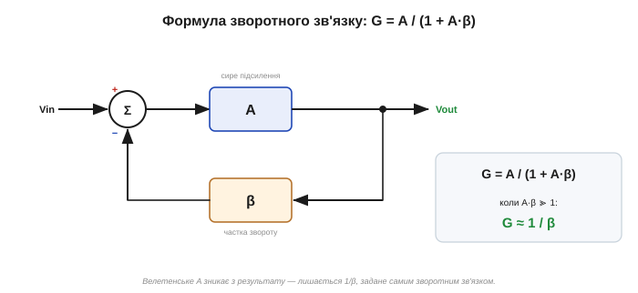
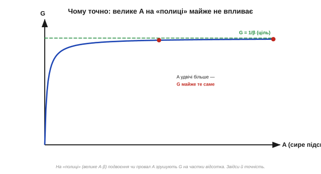

# 🧮 Формула зворотного зв'язку A/(1+A·β): чому велике підсилення робить схему точною

> Це математична вставка про [від'ємний зворотний зв'язок](book:electronics/negative-feedback) в операційному підсилювачі. Головний обмін словами такий: зворотний зв'язок виміняє велетенське, але примхливе підсилення A на скромне, зате точне, задане резисторами. Тут — формула, що стоїть за цією магією, і відповідь на питання, **чому** мільйонне підсилення «зникає» з результату, а 50-відсоткове коливання A змінює відповідь на частки відсотка.

### Дві величини

Усе тримається на двох числах. **A** — підсилення розімкненого [ОП («сире»)](book:electronics/ideal-opamp): велетенське (сотні тисяч), але примхливе — різне в екземплярах, повзе з температурою й частотою. **β** — **частка зворотного зв'язку**: яку долю виходу повертають на вхід (дільник віддає β = R2/(R1+R2)). А **G = Vout/Vin** — підсилення всієї замкненої схеми, те, що нам потрібне.

> ⚠️ Тут **β — це частка зворотного зв'язку**, а не [коефіцієнт підсилення біполярного транзистора](book:electronics/bjt-gain). Та сама грецька буква, різні величини — так склалося історично; не плутайте їх.

### Формула й короткий вивід

ОП підсилює різницю між входом і поверненою часткою виходу. Запишімо це й розв'яжімо відносно G:

```
Vout = A · (Vin − β·Vout)
Vout + A·β·Vout = A·Vin
Vout·(1 + A·β) = A·Vin
G = Vout/Vin = A / (1 + A·β)
```


*Сигнал іде вперед крізь підсилення A, а частка β повертається й віднімається на вході. Розв'язавши петлю, дістаємо G = A/(1+A·β). Добуток A·β — «петльове підсилення», що його сигнал набирає, обійшовши все коло.*

### Інтуїція: коли A·β ≫ 1

Уся сіль — у добутку **A·β** (петльовому підсиленні). Коли воно велике — а з мільйонним A воно завжди величезне — одиницею в знаменнику можна знехтувати:

```
G = A / (1 + A·β)  ≈  A / (A·β)  =  1 / β
```

A **скорочується** й зникає! Підсилення замкненої схеми залежить тепер **тільки від β** — тобто тільки від резисторів. Ось і вся магія зворотного зв'язку в одному рядку. Для неінвертуючого підсилювача β = R2/(R1+R2), тож G = 1/β = 1 + R1/R2 — рівно формула [неінвертуючого підсилювача](book:electronics/inverting-noninverting). А [«віртуальне коротке»](book:electronics/virtual-short) — це просто межа A·β → ∞, де входи зрівнюються точно.

### Десенсибілізація: чому це **точно**

Тепер найкрасивіше — у числах. Візьмімо A = 200 000 і ціль «підсилити в 10 разів» (β = 0.1, тобто A·β = 20 000):

```
G = 200000 / (1 + 20000) = 9.9995
```

А тепер хай A **обвалиться вдвічі** — до 100 000 (величезна зміна, від примірника чи нагріву!):

```
G = 100000 / (1 + 10000) = 9.9990
```

A впало на **50 %**, а G зрушилося на **0.005 %** — практично ніяк.


*Залежність G від A виходить на «полицю» 1/β. На ній навіть подвоєння чи провал A зрушують G на частки відсотка. Що більше петльове підсилення A·β, то рівніша полиця — то менше схемі діла до примх A.*

Це й зветься **десенсибілізацією**: чим більше петльове підсилення A·β, то менше результат зважає на A. Точність береться **не всупереч** марнотратно великому підсиленню, а **завдяки** йому: саме надлишок A·β «поглинає» всю його ж примхливість.

### Ціна: петльове підсилення спадає з частотою

Є й розплата. A не вічно велике — воно [**падає з частотою**](book:electronics/real-opamp-limits). А меншає A — меншає й петльове A·β, тож на високих частотах полиця «провисає», і точність гіршає. Звідси й компроміс «підсилення↔смуга»: що більше підсилення G ти просиш у замкненої схеми, то менший лишається запас A·β — а з ним і смуга, і твердість на верхніх частотах. Добуток підсилення на смугу приблизно сталий.

### Де ця формула працює

Ця одна формула — підмурок усієї схемотехніки зі зворотним зв'язком. [Неінвертуючий підсилювач](book:electronics/inverting-noninverting) — це прямо G = 1/β. [«Віртуальне коротке»](book:electronics/virtual-short) — її граничний випадок A·β → ∞. [Лінійний стабілізатор](book:electronics/ldo-internals) тримає вихід точним тим самим механізмом. А зухвала думка Гарольда Блека [«викинути підсилення заради якості»](book:electronics/negative-feedback/hist-harold-black.md) — це і є те, що формула пояснює числом.

> 🔧 **Навіщо це.** Запам'ятайте одну річ: **G ≈ 1/β, коли A·β велике**. Звідси все практичне. Підсилення схеми задають **резистори** (β), а не примхливий ОП, — тому воно точне й стабільне. Щоб так було, потрібен **запас** петльового підсилення A·β: його тим менше, чим більше підсилення ви просите й чим вища частота. Тому прецизійні схеми роблять із помірним підсиленням (аби A·β лишалося величезним), а на високих частотах пам'ятають, що точність уже не та.
