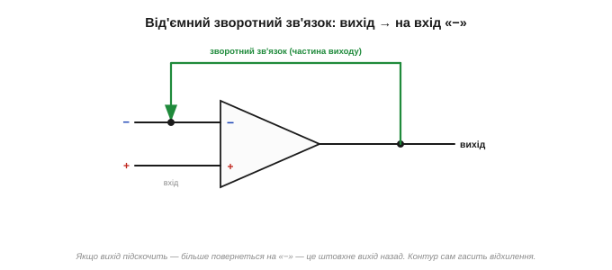
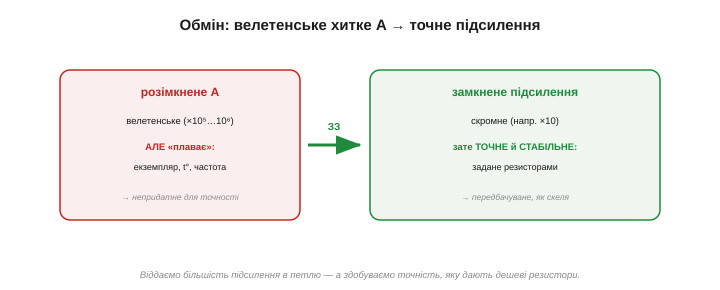

# Від'ємний зворотний зв'язок: магія стабільності

Сам по собі [операційний підсилювач](book:electronics/ideal-opamp) лишається в незручному стані: підсилення велетенське, та некероване — найменша різниця на входах кидає вихід на рейку. Цей шалений мільйон підсилення треба **приборкати**. Робить це один прийом — **від'ємний зворотний зв'язок** *(negative feedback)*. Це одна з найважливіших ідей в усій електроніці, тож розберімо її повільно й до кінця.

### Ідея: повернути частину виходу на вхід

Зворотний зв'язок — це коли частину **виходу** повертають назад на **вхід**. У випадку ОП — повертають на **інвертуючий** вхід («−»). І ось чому це творить диво.

ОП підсилює різницю, Vout = A·(V₊ − V₋), і A — величезне. Тепер з'єднаймо вихід (через якісь резистори) назад із входом «−». Що буде? Якщо вихід чомусь **підскочить** зависоко, частина цього підвищення повернеться на «−», збільшить V₋ — а більший V₋ (бо вхід **інвертуючий**!) **штовхне вихід назад униз**. І навпаки: просів вихід — поверталося менше, V₋ упав, і вихід підняло вгору. Прилад **сам себе виправляє**, безперервно гасячи будь-яке відхилення. Звідси й «від'ємний»: зворотний сигнал **протидіє** змінам.


*Замкнений контур. Частину виходу повертають на інвертуючий вхід «−». Якщо вихід підскочить — зворотний зв'язок підніме V₋ і штовхне вихід назад. Контур сам гасить відхилення; вихід приходить у рівновагу.*

Простежмо це покроково. Хай через якусь заваду вихід на мить **підскочив** на 0.1 В вище, ніж слід. Частина цього стрибка повертається на «−», тож V₋ трохи зросла. Але ОП множить (V₊ − V₋) на велетенське A — і навіть мікроскопічне зростання V₋ дає **велике** зниження виходу. Вихід падає назад — рівно настільки, щоб погасити початковий стрибок. Усе це стається за частки мікросекунди, само собою, без жодного втручання. Контур безперервно «ловить» вихід і повертає на місце.

### Що це означає: ОП тримає входи рівними

До чого ж приходить ця рівновага? До дивовижно простого стану. Підсилення A таке велике, що навіть мікроскопічна різниця V₊ − V₋ дала б величезний вихід. Отже, щоб вихід НЕ зашкалив, а застиг на якомусь розумному значенні, різниця V₊ − V₋ мусить бути **майже нульовою**. Виходить, у рівновазі:

```
V₋  ≈  V₊
```

Операційний підсилювач, охоплений від'ємним зворотним зв'язком, **робить усе можливе** зі своїм виходом, аби втримати свої входи **на однаковій напрузі**. Він не «знає» наперед, яку напругу видати, — він просто крутить вихід туди-сюди, поки V₋ не зрівняється з V₊, і на тому заспокоюється. Це і є серце роботи ОП: він — слухняний виконавець, чия єдина мета — **зрівняти власні входи**.


*Самобалансування. Через велетенське A навіть крихітна різниця входів дала б зашкалений вихід. Тож у рівновазі різниці майже нема: ОП доганяє вихід до значення, за якого V₋ = V₊, і тримає його там.*

Зверніть увагу: V₋ = V₊ лише **майже** — мікроскопічна різниця все ж лишається, бо саме її, помножену на A, ОП і перетворює на свій вихід. Цю крихітну різницю звуть **сигналом похибки** *(error signal)*: вона — те «неузгодження», яке ОП безперервно намагається звести до нуля. Що більше A, то меншою може бути похибка за того самого виходу, то точніше тримається рівність. Тож «V₋ = V₊» — не буквальна правда, а напрочуд добре наближення; саме на ньому будуються всі розрахунки через [віртуальне коротке](book:electronics/virtual-short). Наскільки добре? За A = 100 000 і виході 10 В різниця входів — лише 0.1 мВ; вважати її нулем — похибка в тисячні частки відсотка, якою сміливо нехтують.

> 🔧 **Навіщо це.** Образ термостата. Ви ставите бажану температуру (це «+»), а термостат **робить що завгодно** з обігрівачем, аби фактична температура (це «−») зрівнялася з бажаною. Йому байдуже, наскільки сильний обігрівач, — він просто доводить кімнату до заданого. Так само ОП із від'ємним зворотним зв'язком — це «термостат для напруги»: ти задаєш бажане співвідношення (зовнішніми резисторами), а він жене свій вихід туди, де його входи зрівняються. Не «підсилювач, що множить», а **слуга, що вирівнює**.


*ОП із зворотним зв'язком — «термостат для напруги». Ти задаєш бажане («+»), він безперервно підправляє свій вихід, аж поки фактичне («−») не зрівняється з бажаним, — і тримає. Йому байдуже власне підсилення; його мета — звести різницю входів до нуля.*

Та сама ідея — у круїз-контролі авто: ти задаєш бажану швидкість, а система сама то піддає газу, то відпускає, аби втримати її, хай дорога йде вгору чи вниз. Їй байдуже, який мотор, — її робота звести різницю між заданою й фактичною швидкістю до нуля. ОП — такий самий **слідкувальний** пристрій (сервопривід), тільки для напруги, і діє він не секундами, а мільйонними частками секунди.

### Чому саме «від'ємний» — і що було б інакше

Чому зв'язок треба вести саме на **інвертуючий** вхід? Бо тоді він **протидіє** змінам — і це дає **стабільність**. А якби ми повернули вихід на **неінвертуючий** «+», вийшов би **додатний** зворотний зв'язок: підскочив вихід → підняв V₊ → ще дужче підняв вихід → і так лавиною, поки той не вгатиться в рейку й там не залипне. Додатний зв'язок не вгамовує, а **розгойдує**.

Тому правило: **від'ємний** зворотний зв'язок (на «−») — для стабільних підсилювачів; **додатний** (на «+») — для приладів, що мають «перекидатися» й залипати, як-от [тригер Шмітта](book:electronics/schmitt-trigger). Сплутати їх — класична й болюча помилка: замість рівного підсилювача дістанеш генератор або «залипайло».


*Дві долі зворотного зв'язку. На «−» — протидіє змінам, контур приходить у рівновагу (стабільний підсилювач). На «+» — підсилює зміни, вихід лавиною летить на рейку й залипає (тригер, генератор). Знак входу вирішує все.*

Практично це дає просте правило читання схем: перш ніж щось рахувати, **знайди, куди йде зворотний зв'язок**. Веде на «−» — перед тобою лінійний підсилювач, до нього застосовне правило V₋ = V₊. Веде на «+» (або зв'язку нема зовсім) — це компаратор чи тригер, і поводиться він зовсім інакше. Один погляд на петлю — і вже ясно, як читати всю схему.

### Головний обмін: підсилення на точність

А тепер — найважливіший наслідок, заради якого все й робиться. Що ми **отримуємо** натомість, віддавши велетенське підсилення в петлю зворотного зв'язку?

**Точність і стабільність.** Підсилення розімкненого ОП (A) — велетенське, але **примхливе**: воно різне в різних екземплярах, повзе з температурою, спадає з частотою. Будувати на ньому точну схему годі. Та щойно ми замикаємо від'ємний зворотний зв'язок, **підсилення всієї схеми задають уже зовнішні резистори**, а не примхливе A. А резистори — дешеві, точні й стабільні. Отже, ми **виміняли** хитке велетенське підсилення на скромніше, зате **передбачуване** й тверде, як скеля.

Це той самісінький обмін, що працює і в [транзисторному підсилювачі](book:electronics/bjt-amplifier): там підсилення задає не примхливий β, а відношення резисторів Rc/Re — теж завдяки зворотному зв'язку. ОП доводить цю ідею до досконалості.


*Чесний обмін. Розімкнене A — величезне, але «плаває» (екземпляр, температура, частота). Зворотний зв'язок виміняє його на менше, зате **точне й стабільне** підсилення, задане зовнішніми резисторами. Втрачаємо величину — здобуваємо передбачуваність.*

> 🧮 **Чому саме точне.** У формулі G = A/(1 + A·β): чому велетенське A «скорочується» й лишає підсилення 1/β від самих резисторів, і чому навіть 50-відсотковий провал A зрушує результат на частки відсотка — у математичній вставці [«Формула зворотного зв'язку»](book:electronics/negative-feedback/math-feedback-formula.md).

Цю ідею — навмисне «викинути» підсилення заради якості — подав **Гарольд Блек** ще 1927 року. Кажуть, осяяння прийшло до нього на поромі дорогою на роботу, і він нашвидку накидав схему просто на сторінці газети. Тоді думка віддавати дорогоцінне підсилення здавалася мало не безглуздям — а виявилася підмурком усієї точної електроніки на сто років уперед.

> 📜 **Ціла історія.** Як Блек дійшов до цього на поромі через Гудзон і накидав схему на сторінці New York Times, чому патентне бюро дев'ять років вважало ідею неможливою (як вічний двигун), і хто з Bell Labs — Найквіст і Боде — перетворив зухвалу думку на надійний інструмент — в [історичній вставці «Гарольд Блек»](book:electronics/negative-feedback/hist-harold-black.md).

### Чому резистори, а не A: інтуїція

Як це можливо — щоб підсилення схеми не залежало від A самого приладу? Інтуїція така: завдяки величезному A зворотний зв'язок працює **майже бездоганно**, і фактичне співвідношення «вихід/вхід» визначається лише тим, **яку частину виходу** ми повертаємо назад, — а це задають резистори. Хай A буде 100 000 чи 2 000 000, хай повзе вдвічі з нагрівом — поки воно лишається «достатньо велетенським», зворотний зв'язок **проковтує** всю цю різницю, і вихід тримається там, де велять резистори.

Покажемо на числах. Хай A = 100 000, а резистори задають підсилення 10. Щоб дістати на виході, скажімо, 5 В, різниця входів має бути лише Vout/A = 5/100 000 = 0.05 мВ — мізер. Якщо A раптом подвоїться до 200 000, ця різниця стане 0.025 мВ — теж мізер; на виході практично ті самі 5 В. Зміна A удвічі майже не зачепила результат — бо весь «надлишок» підсилення йде на те, щоб міцніше тримати V₋ = V₊. Ось чому ОП роблять із таким абсурдно великим A: **не щоб сильно підсилювати, а щоб було чим платити за точність**.


*Чому стабільно. Хай власне A приладу гуляє вдвічі — підсилення схеми майже не змінюється, бо його тримає відношення зовнішніх резисторів. Надлишок A витрачається на те, щоб тугіше дотримувати V₋ = V₊. Резистори правлять, A лише «служить».*

І це ще не все, що дарує від'ємний зворотний зв'язок. Окрім стабільного підсилення, він **зменшує спотворення** (нелінійності самого ОП теж потрапляють у петлю й гасяться), **розширює смугу** рівної роботи й дає змогу **задавати наперед** вхідний та вихідний опір схеми. Одним прийомом — ціла жменя чеснот. Тому від'ємний зворотний зв'язок — не вузька хитрість для ОП, а наріжний принцип усієї якісної аналогової техніки: підсилювачі звуку, стабілізатори напруги, точні джерела струму тримаються на ньому.

Маленький приклад на відчуття. Підсилювач звуку без зворотного зв'язку, на самих транзисторах, неминуче трохи **спотворює** сигнал — його підсилення не зовсім однакове на гучних і тихих місцях. Охопи його від'ємним зв'язком — і петля сама вирівняє ці нерівності, бо будь-яке відхилення виходу від ідеалу вона тлумачить як похибку й гасить. Тому чистий, «прозорий» звук сучасної техніки — теж заслуга цього скромного принципу. Або стабілізатор напруги в кожному блоці живлення: усередині він порівнює свій вихід із внутрішнім еталоном і від'ємним зв'язком тримає напругу незмінною — хай струм навантаження стрибає, хай просідає вхід, — той самий «термостат», лише для вольтів. Куди не глянь у точній аналоговій техніці — скрізь працює ця сама петля.

Силу цього вгамовування інженери міряють **підсиленням у контурі** *(loop gain)* — тим, скільки власного A лишається «в запасі» після того, як частину віддали на потрібне підсилення схеми. Що більший запас, то тугіше зворотний зв'язок тримає бажане й то меншою стає похибка. Велетенське A приладу — це й є та комора, з якої черпають запас. А коли на високих частотах A спадає, тане й запас, і зворотний зв'язок слабшає — звідси й [межі реального ОП](book:electronics/real-opamp-limits).

У цьому й «магія» з назви теми: ми навмисне **викинули** майже все підсилення приладу — і саме завдяки цьому дістали точність, якої з самого підсилення годі було б домогтися. Звучить як парадокс: щоб зробити надійний підсилювач, треба мати підсилення **з надлишком** і більшість його **роздати**. Та саме на цьому парадоксі тримається вся точна електроніка — від студійного мікрофона до прецизійного давача в супутнику.

### Принцип у двох рядках

Отже, від'ємний зворотний зв'язок перетворює некерований ОП на точний, передбачуваний прилад: повертаючи частину виходу на «−», ми змушуємо ОП тримати свої входи рівними, а підсилення схеми задають зовнішні резистори, а не примхливе A. Цей принцип згортається у зручне **правило для розрахунку** — [віртуальне коротке](book:electronics/virtual-short): у схемі з від'ємним зв'язком вважай, що V₋ = V₊, а у входи струм не тече. З цих двох рядків випливають усі практичні схеми на ОП.
