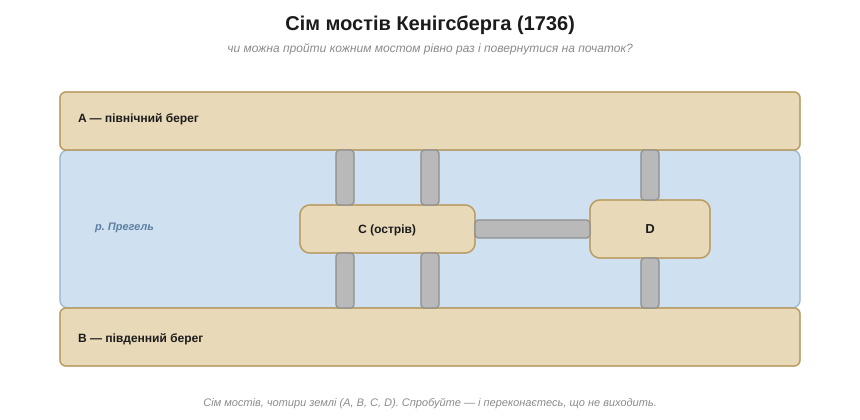
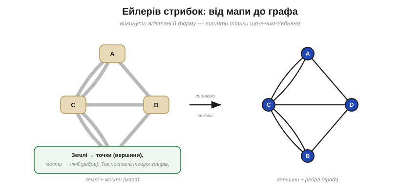
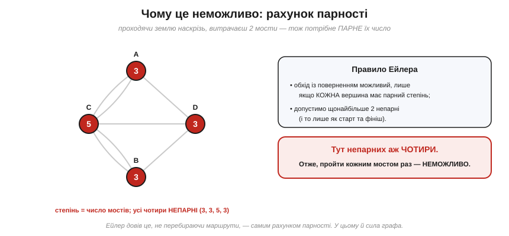
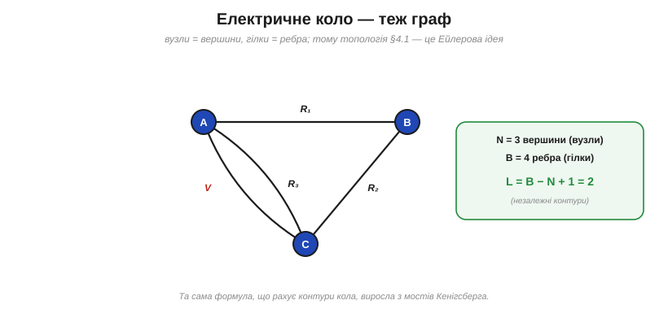

# 📜 Сім мостів Кенігсберга: як прогулянка народила теорію графів

> Історія за ідеєю [вузлів, гілок і контурів](book:electronics/nodes-branches-loops). В аналізі кіл важлива **топологія** (що з чим з'єднано), а не «географія» (де намальовано елемент). Думка ця здається очевидною — але колись її треба було **винайти**. Зробив це 1736 року **Леонард Ейлер**, розв'язуючи кумедну задачу про прогулянку містом. З тієї прогулянки виросла ціла **теорія графів** — математика, що лежить в основі аналізу кіл, карт метро, мереж і самого інтернету. А формула контурів L = B − N + 1, що рахує незалежні контури кола, — теж її пряме дитя.

---

## Топологія кіл та її витоки

Щоб зрозуміти коло, треба бачити **зв'язки**, а не рисунок. Та сама ідея — «лишити тільки що-з-чим-з'єднано, відкинувши форму й відстані» — звучить просто, але для математики XVIII століття була **революційною**. Доти геометрія міряла довжини й кути; ніхто не вивчав фігур, де довжини не мають значення.

Перший крок до такої «геометрії зв'язків» зробив **Леонард Ейлер** (*Leonhard Euler*, 1707–1783), і поштовхом стала не висока наука, а **міська забавка** про сім мостів.

---

## Задача про сім мостів

Місто **Кенігсберг** (тоді Пруссія, нині Калінінград) стояло на річці **Прегель**, яка розгалужувалася, охоплюючи два **острови**. Чотири частини суходолу — два береги й два острови — з'єднували **сім мостів**. Містяни бавилися загадкою: чи можна вийти на прогулянку так, щоб пройти **кожним мостом рівно раз**? (Дехто додавав і умову **повернутися додому**; для Кенігсберга безнадійні обидва варіанти — і з поверненням, і без.)

Це була справжня недільна розвага: кенігсбержці прогулювалися набережними й щиро шукали такий маршрут. Сім мостів мали власні імена — Крамарський, Ковальський, Зелений, Медовий та інші, — і кожен поважний городянин не раз пробував обійти їх усі без повторів. Та хоч як крути, одна переправа щоразу лишалася «зайвою»: або непройденою, або такою, що нею доводилось іти двічі.

*Чотири землі — північний берег A, південний берег B, острів C (Кнайпгоф) і східний острів D — з'єднані сімома мостами. Загадка городян: пройти кожним мостом рівно раз і повернутися на початок. Скільки не пробуй — не виходить.*

Хоч скільки бюргери блукали — нікому не щастило. Та одна річ — не зуміти, і зовсім інша — **довести**, що це взагалі неможливо. Перебрати всі маршрути? Їх безліч. Потрібен був інший погляд.

---

## Ейлерів стрибок: лишити тільки з'єднання

Ейлер зробив хід, який сьогодні здається очевидним, а тоді був проривом. Він зрозумів: **розміри островів, довжини мостів, форма річки — усе це не має значення**. Важить лише одне — **що з чим з'єднано** і **скількома мостами**. Тож він викинув карту й лишив від неї скелет: кожну землю замінив **точкою** (вершиною), а кожен міст — **лінією** (ребром) між точками.

*Ейлерів стрибок: відкинути відстані й форму, лишити тільки зв'язки. Землі стають **точками** (вершинами), мости — **лініями** (ребрами). Там, де між землями два мости, — дві лінії. Так народилася теорія графів.*

Те, що лишилося, ми тепер звемо **графом** (*graph*): набір **вершин** (*vertices*) і **ребер** (*edges*), що їх з'єднують. Ейлер назвав цей новий розділ «геометрією положення» (*geometria situs*) — згодом із нього виросли і **теорія графів**, і **топологія**. А головне — це рівно та сама абстракція, на якій стоїть [аналіз кіл через вузли й гілки](book:electronics/nodes-branches-loops): схема байдужа до «географії», важать тільки вузли й гілки. Ейлер винайшов цей спосіб думати за двісті з гаком років до наших плат.

---

## Доказ неможливості: рахунок парності

Звівши мости до графа, Ейлер міркував так. Уявімо, що прогулянка вдалася. Тоді щоразу, коли ми **заходимо** на якусь землю одним мостом, ми мусимо з неї **вийти** іншим. Отже, мости кожної землі розбиваються на пари «зайшов–вийшов», а значить, їх має бути **парне** число. Виняток — хіба що землі, де ми **стартуємо** й **фінішуємо** (а якщо маршрут замкнений, то й їх нема).

*Степінь вершини — це число мостів, що до неї підходять. Щоб пройти кожним мостом раз, майже всі вершини мусять мати ПАРНИЙ степінь. А в Кенігсбергу всі чотири — непарні (3, 3, 5, 3). Отже, такий обхід неможливий — і це доведено самим лиш рахунком, без перебору маршрутів.*

Тепер погляньмо на Кенігсберг. Число мостів кожної землі (мовою графів — **степінь вершини**) виходить таким: A — 3, B — 3, острів C — 5, D — 3. **Усі чотири — непарні!** А правило вимагає, щоб непарних було щонайбільше дві (старт і фініш). Висновок невблаганний: пройти кожним мостом рівно раз **неможливо**. Ейлер довів це не перебором, а **самим рахунком парності** — і тим показав силу нового погляду.

Заразом він сформулював і загальне правило (для будь-якого **зв'язного** графа — усі ребра в одному «шматку»): обхід усіма ребрами **з поверненням** (його тепер звуть **ейлеровим циклом**) існує тоді й лише тоді, коли **кожна** вершина має парний степінь; а просто пройти всіма ребрами (**ейлерів шлях**) можна, якщо непарних вершин рівно **нуль або дві**. (Без зв'язності сама парність не рятує: ребра в розрізнених «острівцях» одним розчерком не обійти.)

Варто спинитися й оцінити красу цього міркування. Замість блукати незліченними маршрутами, Ейлер звів усе до одного крихітного підрахунку — порахувати мости кожної землі й глянути на парність. Безнадійний перебір обернувся **арифметикою** на пальцях. У цьому й весь дух теорії графів: правильно дібрана абстракція перетворює «неможливо перевірити все» на «достатньо порахувати одне».

---

## Чому це наша історія: коло — це граф

А тепер найголовніше для нас. **Електричне коло — це теж граф.** Вузли — то вершини, гілки — то ребра. Увесь [аналіз кола через вузли й гілки](book:electronics/nodes-branches-loops) — порахувати вузли й гілки, знайти незалежні контури — це мовою Ейлера операції над графом.

*Просте коло як граф: вузли A, B, C — вершини, гілки V, R₁, R₂, R₃ — ребра. Та сама формула, що рахує незалежні контури кола, L = B − N + 1, виросла саме з графів — нащадок Ейлерової «геометрії положення».*

Навіть формула числа контурів **L = B − N + 1** — це факт теорії графів (його звуть **цикломатичним числом** графа). Вона — близька родичка знаменитої **Ейлерової формули для многогранників** V − E + F = 2, де вершини, ребра й грані пов'язані тим самим балансом. Іншими словами, рахуючи незалежні контури кола, ми несвідомо повторюємо Ейлера.

І є гарний збіг, що замикає коло історій: місто **Кенігсберг** — батьківщина не лише цієї задачі, а й самого **Кірхгофа** (про нього — окрема [історія законів кіл](book:electronics/nodes-branches-loops/hist-kirchhoff.md)). Той самий математичний дух міста, де Ейлерові мости започаткували теорію графів, виховав і людину, що дала графам-колам їхні два закони. Топологія кіл — пряма спадщина обох.

---

## Хто був Ейлер

Аби відчути масштаб, варто знати, що мости були для Ейлера дрібним епізодом. **Леонард Ейлер** — імовірно, **найплідніший математик в історії**: по ньому лишилося близько 870 праць, десятки томів, і він торкнувся майже кожної ділянки математики свого часу. Це йому ми завдячуємо позначеннями, якими користуємось і досі: **f(x)** для функції, **e** для основи натурального логарифма, **i** для √−1, **Σ** для суми, він же закріпив **π**.

Його ім'я носить найкрасивіша формула математики — **тотожність Ейлера** e^(iπ) + 1 = 0, що сплела п'ять головних сталих. А найдивовижніше: останні роки життя Ейлер працював **сліпим** — і саме наосліп, диктуючи помічникам, створив чи не половину свого доробку. Людина такого ґатунку, мимохідь розв'язавши міську забавку, заклала цілий розділ математики — і не помітила в тому подвигу.

---

## Чим це відгукнулося

Із прогулянки сімома мостами народилася **теорія графів** — і подарувала спосіб думати, на якому стоїть увесь аналіз кіл:

- **Граф** — вершини (точки) і ребра (лінії); важать лише **зв'язки**, не форма й відстані.
- Це і є **топологія кола**: коло — граф, вузли — вершини, гілки — ребра.
- Формула контурів **L = B − N + 1** — факт теорії графів, родич Ейлерової V − E + F = 2.
- Правило парності розв'язало задачу **доказом**, а не перебором, — у цьому й сила абстракції.

Сьогодні графи — усюди: схеми й друковані плати, карти метро й доріг, соцмережі, маршрутизація інтернету, хімічні молекули. Усе це — нащадки кенігсберзької прогулянки.

Наостанок — гарна примха історії. Під час Другої світової війни Кенігсберг зазнав руйнувань, частину мостів знищили, а саме місто стало Калінінградом. Конфігурацію переправ відтоді змінили — і, кажуть, тепер потрібний обхід уже можливий. Задача, яку Ейлер оголосив нерозв'язною, «розв'язалася» сама — щойно змінилася **топологія**. Що вкотре підтверджує його урок: усе вирішують зв'язки, а не каміння й вода.

А головне просте: щойно ви бачите схему як **граф із вузлів і гілок**, складне плетиво стає зрозумілим — і готовим до законів Кірхгофа.
