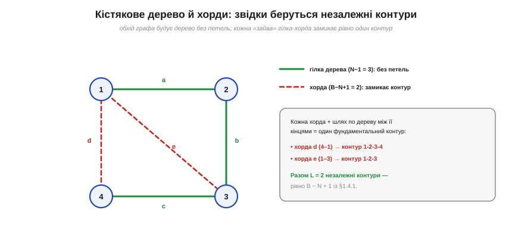
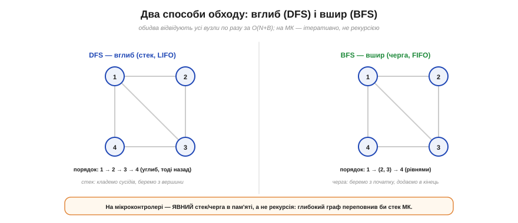

# ⚙️ Обхід графа: DFS/BFS і пошук незалежних контурів

> Коло зручно бачити як **граф**: [вузли й гілки, що утворюють контури](book:electronics/nodes-branches-loops), дають формулу L = B − N + 1 — скільки незалежних контурів має коло. Топологію такого графа можна записати матрицями, але тут нас цікавить **алгоритм**: як програма реально **знаходить** ці контури. Відповідь — **обхід графа**, той самий прийом, що лежить в основі мільйона задач на графах.

### Задача

Маємо коло як граф (вузли + гілки). Щоб скласти [рівняння кола](book:electronics/circuit-analysis), машині треба: переконатися, що граф **зв'язний**, побудувати **кістякове дерево** (N−1 гілок, які з'єднують усі вузли **без жодної петлі**), а решту B−(N−1) гілок — **хорди** — оголосити такими, що кожна замикає рівно один незалежний контур. Як це зробити автоматично?

### Ідея: систематичний обхід

Представмо граф **списком суміжності**: кожному вузлу — перелік його сусідів разом із гілкою, що веде до них. Тепер пройдімо граф, **позначаючи відвідані** вузли. Гілки, якими ми вперше потрапляємо в **новий** вузол, утворюють кістякове дерево. А гілка, що веде у **вже відвіданий** вузол, — це **хорда**: вона замикає контур.


*Рис. Обхід будує кістякове дерево (зелені гілки a, b, c — N−1=3, без петель). Дві гілки лишилися «зайвими» — це хорди (червоні d, e). Кожна хорда разом зі шляхом по дереву між її кінцями дає один фундаментальний контур; разом їх B−N+1 = 2, як і обіцяє формула для [числа незалежних контурів](book:electronics/nodes-branches-loops).*

Обходити можна двома способами. **DFS** (*depth-first*, вглиб) лізе якомога глибше, тоді відкочується назад — працює на **стеку** (LIFO). **BFS** (*breadth-first*, вшир) розходиться рівень за рівнем — працює на **черзі** (FIFO). Обидва відвідують кожен вузол по разу й дають кістякове дерево; різниця лише в **порядку**.


*Рис. Той самий граф двома обходами: DFS іде вглиб (1→2→3→4) на стеку, BFS — рівнями (1, потім 2 і 3, потім 4) на черзі. Для пошуку контурів годиться будь-який; на мікроконтролері обидва роблять ітеративно, явним стеком чи чергою.*

### Псевдокод

Ітеративний DFS, що одразу збирає дерево й хорди:

```
visited ← ∅;  tree ← ∅;  chords ← ∅;  стек ← [start]
поки стек не порожній:
    v ← стек.pop()
    якщо v ∈ visited: продовжити
    visited.add(v)
    для кожного (u, гілка) у adj[v]:
        якщо u ∉ visited:
            parent[u] ← v;  tree.add(гілка);  стек.push(u)
        інакше якщо гілка ∉ tree:
            chords.add(гілка)        # хорда → один контур

# контур для хорди (u,v): шлях за parent[] від u до v + сама хорда
```

Замінивши стек на **чергу** (брати з початку, додавати в кінець), дістанемо BFS — решта коду та сама. Кожна знайдена хорда плюс шлях по дереву між її кінцями (ідемо за вказівниками `parent`) і є один фундаментальний контур; хорд рівно B−N+1.

### Складність і пастки на МК

**Складність** — лінійна, **O(N+B)**: кожен вузол і кожну гілку торкаємось по разу. Пам'ять: список суміжності O(N+B) плюс масиви `visited`, `parent` по O(N).

А ось пастки, специфічні для мікроконтролера:

- **Рекурсія = переповнення стека.** Рекурсивний DFS гарний у підручнику, та глибокий граф вичерпає крихітний апаратний стек МК і завалить програму. Тому на МК DFS пишуть **ітеративно**, з **явним** стеком-масивом у пам'яті (а BFS — з явною чергою).
- **Пам'ять під контролем.** Замість динамічних структур беруть **фіксовані** масиви, розраховані на максимальні N і B, а `visited` тримають **бітовою** мапою (1 біт на вузол), щоб заощадити RAM.
- **Незв'язний граф.** Один обхід покриває лише одну зв'язну частину. Якщо в схемі є окремі «острови», треба запускати обхід **наново** з кожного ще не відвіданого вузла — і тоді працює загальна формула L = B − N + **C** (C — число [зв'язних компонент](book:electronics/nodes-branches-loops)).
- **Що роздувається.** У BFS черга може розростись на широкому графі (тримає цілий рівень), а в DFS глибина стека дорівнює найдовшому шляху. Вибір між ними — за формою графа й наявною пам'яттю.

Саме цей обхід і стоїть за фразою «комп'ютер знайшов незалежні контури»: дерево дає N−1 гілок для опорного вузла, хорди — L контурів для KVL, і далі симулятор просто [складає та розв'язує систему рівнянь](book:electronics/circuit-analysis).
