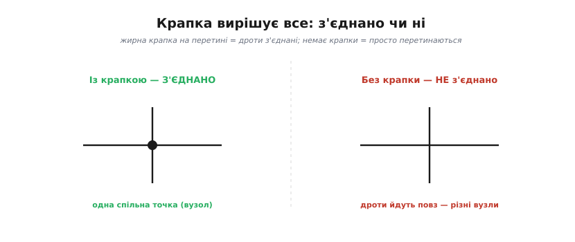
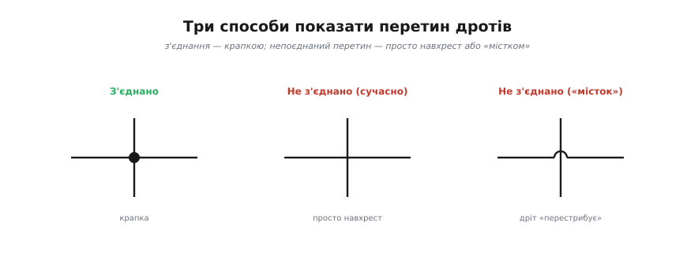
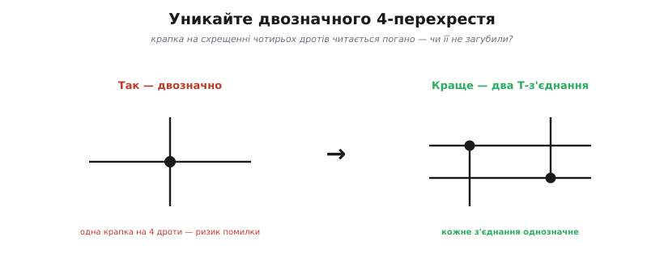
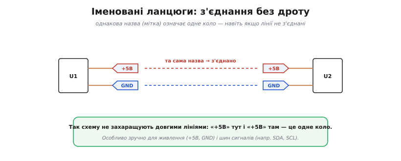

# Вузли й з'єднання

Лінії на схемі — це **дроти**, ідеальні з'єднання без опору. Та щойно дві лінії перетнулися, постає питання на копійку, від якого залежить уся схема: вони **з'єднані** чи просто **перетинаються**? Електрично це дві геть різні речі, а на папері вони виглядають однаково — різницю несе одна крихітна деталь. Розберімо, що таке вузол, як на схемі показують з'єднання, і чому одна загублена крапка перетворює робочу схему на непрацездатну.

### Вузол — одна електрична точка


*Вузол — це **одна** електрична точка, хоч як розкидана по схемі: усі виводи, сполучені суцільним дротом, мають однаковий потенціал — те саме поняття [вузла](book:electronics/nodes-branches-loops), що й у топології кіл.*

Почнімо з головного поняття. **Вузол** (англ. *node*, від лат. *nodus* — «вузол, сплетіння»; те саме слово, що й «вузол» на мотузці) — це всі точки схеми, сполучені суцільним дротом. Ключова їхня властивість: оскільки ідеальний дріт не має опору, на ньому нема падіння напруги, тож **усі точки вузла мають однаковий потенціал**. Тому вузол — не «місце», а **одна електрична точка**, хай як широко вона розповзлася по аркушу.

На схемі вузол буває розкиданий: до нього під'єднано кілька деталей у різних кутах, лінії розгалужуються — та доки все сполучено дротом (через крапки-з'єднання), це **один** вузол. Читаючи схему, корисно подумки «зафарбовувати» кожен вузол одним кольором: усі дроти того кольору — то одна точка з єдиним потенціалом. Саме так на схемі прямо видно ті вузли, до яких застосовують [закон струмів Кірхгофа](book:electronics/kcl): струм у вузол дорівнює струмові з нього.

> 🔧 **Навіщо це.** Поняття вузла прямо стає в пригоді при **налагодженні**. Якщо дві точки належать одному вузлу, між ними завжди **нуль вольтів** (ідеальний дріт), і мультиметр у будь-якій із них покаже однакову напругу відносно «землі». Тож, шукаючи обрив, дивляться саме туди, де очікуваний «один вузол» раптом розпався на дві точки з різними потенціалами, — там і розрив.

### Крапка вирішує: з'єднання чи перетин


*Крапка вирішує: жирна **крапка** на перетині означає, що дроти **з'єднані** (одна спільна точка). Немає крапки — дроти просто перетинаються й належать різним вузлам.*

Тепер до тієї крихітної деталі. Правило просте й залізне: **жирна крапка** на місці перетину означає, що дроти тут **з'єднані** — це один спільний вузол. Якщо крапки **немає** — лінії лише перетинаються на папері, а електрично це **різні** вузли (як дві дороги на естакаді: перетинаються в плані, та не сполучені). Крапка — найважливіший знак пунктуації на схемі: загубив її або поставив зайву — і коло стало іншим.

Наслідки бувають драматичні, і обидві помилки тихі — схема виглядає правильною. **Забута** крапка означає, що два дроти, які мали стати одним вузлом, насправді роз'єднані, і частина схеми не живиться або «висить у повітрі». **Зайва** крапка, навпаки, закорочує те, що мало лишитися окремим. Тому перше, що перевіряють у незрозумілій схемі, — чи всі крапки на місці й чи немає зайвих.

### Три способи показати перетин


*Три способи: з'єднання показують **крапкою**; непоєднаний перетин — або **просто навхрест** (сучасно), або **«містком»**, де один дріт перестрибує другий (старіший стиль).*

З'єднання завжди показують **крапкою**. А непоєднаний перетин зображають двома способами. У сучасному стилі — **просто навхрест**: немає крапки, отже, не з'єднано. У старішому (і досі вживаному) — **«містком»**: один дріт малюють із маленькою дугою, що «перестрибує» другий, наочно показуючи, що вони не торкаються. Обидва означають одне — **немає з'єднання**; «місток» лише прибирає будь-який сумнів, коли крапку легко проґавити.

### Двозначне 4-перехрестя


*Крапка на схрещенні **чотирьох** дротів двозначна: легко не помітити чи сплутати з випадковою. Краще розвести з'єднання на **два Т-з'єднання** — кожне читається однозначно.*

Є одна небезпечна ситуація — **чотири** дроти, що сходяться в одній точці з крапкою. Така крапка читається погано: чи це справді з'єднання всіх чотирьох, чи хтось випадково лишив зайву, чи, навпаки, забув її? Щоб не плодити сумнівів, гарні схеми **уникають** 4-перехресть: те саме з'єднання розводять на **два Т-з'єднання** (трійники), трохи зміщені одне від одного. Кожен трійник із крапкою однозначний, і помилитися ніде. Це не педантизм, а захист від реальних багів — недарма редактори схем за замовчуванням **не** ставлять крапку на чистому 4-перехресті, а кілька дротів дозволяють зводити без крапки лише там, де вони сходяться на **піні** деталі.

### Іменовані ланцюги


*Іменовані ланцюги: однакова **назва-мітка** (як «+5В» чи «GND») означає одне коло, навіть якщо лінії не намальовані з'єднаними. Так схему не захаращують довгими дротами.*

Коли схема велика, тягнути дроти через увесь аркуш незручно — лінії плутаються. Тут рятує прийом «з'єднання за іменем»: точки сполучають не лінією, а однаковою **міткою ланцюга** (англ. *net label*; *net* — «мережа», бо ланцюг сполучає багато виводів у одну мережу). Скажімо, «+5В» тут і «+5В» там означає, що ці точки **електрично з'єднані**, хоч дроту між ними й не намальовано. Так роблять насамперед для **живлення** (+5В, GND, VCC) і для **шин сигналів** (наприклад, SDA, SCL у популярній шині I²C). Схема стає чистою: замість плутанини проводів — кілька зрозумілих імен.

Окремий випадок таких міток — **символи живлення**: значки «+5В», «+3.3В», «GND» (часто у вигляді стрілочки чи планки) — це, по суті, ті самі іменовані ланцюги, лише стандартизовані. Побачивши на схемі кілька значків «GND» у різних місцях, пам'ятайте: усі вони — **один** спільний ланцюг, навіть якщо лінією не з'єднані. Серед усіх ланцюгів цей стоїть осібно — спільна точка відліку, від якої міряють усі напруги, тобто [«земля»](book:electronics/ground-power-rails).

### Від схеми до плати: ланцюг стає міддю

На папері вузол — це домовленість зі знаків. Та схему малюють, щоб виготовити **плату**, і там «вузол» набуває фізичного тіла. Кожен вузол схеми — це один **ланцюг** (*net*): перелік усіх пінів, що мусять бути сполучені. На платі такий ланцюг утілюється **мідними доріжками**, що з'єднують ці піни. Перш ніж їх прокласти, редактор показує ланцюги тонкими сірими прямими «пін-до-піна» — це **сітка з'єднань** (англ. *ratsnest*, букв. «щуряче гніздо» — за сплутаний вигляд); завдання розведення в тому й полягає, щоб замінити кожну сіру лінію реальною доріжкою. Доти, доки два піни в одному ланцюзі, вони обов'язково мають опинитися сполученими на готовій платі — байдуже, накреслено між ними дріт, поставлено спільну мітку чи проведено доріжку вручну.

### Як це порахувати

Уявімо вузол живлення +3.3 В, до якого на схемі підходять чотири лінії: від стабілізатора (джерело) і до трьох споживачів — мікроконтролера, давача й світлодіода з резистором. На схемі це може бути показано двома трійниками, а в нетлисті — одним рядком. Перевірити, що це справді **один** вузол, можна на платі мультиметром у режимі «продзвонювання»: торкнувшись будь-яких двох із цих чотирьох виводів, маємо почути писк (опір ≈ 0). А струми в цьому вузлі зводить [закон Кірхгофа](book:electronics/kcl):

```
I_рег = I_мк + I_давач + I_світлодіод       # струм у вузол = струм із вузла
80 мА = 30 мА + 10 мА + 40 мА               # баланс сходиться
```

**Прошивка теж «бачить» вузли через піни.** Якщо мітку ланцюга `LED_EN` заведено на вивід порту, увімкнення світлодіода — це задати високий рівень на тому піні; весь ланцюг `LED_EN` (хоч куди розведений) підхопить цей потенціал:

```c
#define LED_EN_PIN  5            // пін, на який заведено ланцюг LED_EN

gpio_set_direction(LED_EN_PIN, GPIO_OUT);
gpio_set_level(LED_EN_PIN, 1);  // +3.3 В на весь вузол LED_EN
```

> 🔧 **Навіщо це.** Крапка-з'єднання — найдрібніший, але найкритичніший знак на схемі: **загублена або зайва крапка** — класична причина, чому «схема правильна, а не працює». Тому: ставте крапку **всюди**, де дроти справді з'єднані; **уникайте** 4-перехресть (розводьте на трійники); для живлення й шин користуйтеся **мітками ланцюгів**, а не довжелезними лініями. Сучасні редактори (KiCad та інші) самі ставлять крапки й часто забороняють двозначні з'єднання — та звичка читати схему **вузол за вузлом** (зафарбовуючи кожен) лишається головним умінням. Побачили скупчення дротів — спершу розберіть, що з чим **справді** з'єднано.

> ⚙️ **Як це робить програма.** Те «зафарбовування вузлів», що ви робите оком, редактор схем виконує алгоритмічно: будує **нетлист** (пошуком зв'язних компонент графа) і перевіряє його на помилки (**ERC**). Покроково — у вставці [Нетлист і ERC](book:electronics/nodes-connections/proj-netlist-erc.md).
