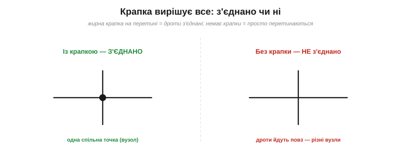
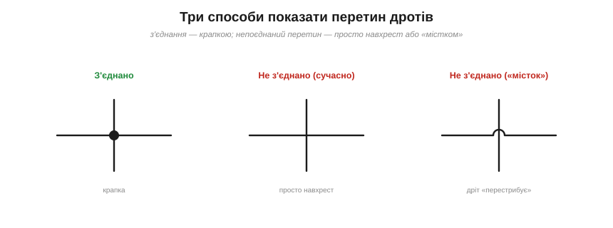
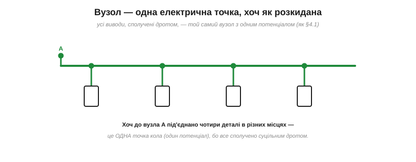
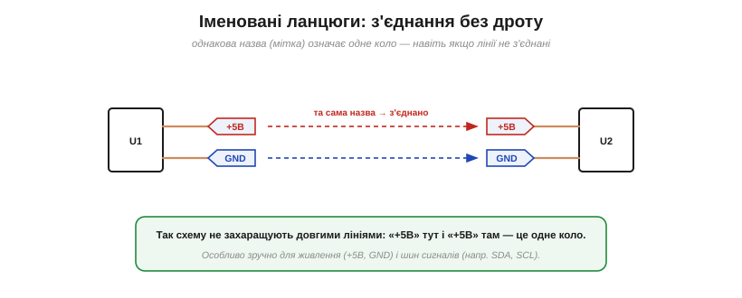

# Вузли, з'єднання й перетини

Лінії на схемі — це **дроти** (ідеальні з'єднання). Та коли дві лінії перетинаються, постає питання на копійку, від якого залежить уся схема: вони **з'єднані** чи просто **перетинаються**? Відповідь дає одна крихітна деталь.

### Крапка = з'єднання

*Рис. Крапка вирішує: жирна **крапка** на перетині означає, що дроти **з'єднані** (одна спільна точка). Немає крапки — дроти просто перетинаються й належать різним вузлам.*

Правило просте й залізне: **жирна крапка** на місці перетину означає, що дроти тут **з'єднані** — це один спільний **вузол**. Якщо крапки **немає** — лінії лише перетинаються на папері, а електрично це **різні** вузли (як дві дороги на естакаді: перетинаються, та не сполучені). Крапка — то найважливіший знак пунктуації на схемі: загубив її або поставив зайву — і коло стало іншим.

Наслідки бувають драматичні. **Забута** крапка означає, що два дроти, які мали бути одним вузлом, насправді роз'єднані — і частина схеми просто не живиться або «висить у повітрі». **Зайва** крапка, навпаки, закорочує те, що мало лишитися окремим. Тому перше, що перевіряють у незрозумілій схемі, — чи всі крапки на місці й чи немає зайвих.

### Три способи показати перетин

*Рис. Три способи: з'єднання показують **крапкою**; непоєднаний перетин — або **просто навхрест** (сучасно), або **«містком»**, де один дріт перестрибує другий (старіший стиль).*

З'єднання завжди показують **крапкою**. А ось непоєднаний перетин зображають двома способами. У сучасному стилі — **просто навхрест** (немає крапки — отже, не з'єднано). У старішому (і досі вживаному) — **«містком»**: один дріт малюють із маленькою дугою, що «перестрибує» другий, наочно показуючи, що вони не торкаються. Обидва означають одне — **немає з'єднання**; «місток» лише прибирає будь-який сумнів.

### Уникайте двозначного 4-перехрестя

*Рис. Крапка на схрещенні **чотирьох** дротів двозначна: легко не помітити чи сплутати з випадковою. Краще розвести з'єднання на **два Т-з'єднання** — кожне читається однозначно.*

Є одна небезпечна ситуація — **чотири** дроти, що сходяться в одній точці з крапкою. Така крапка читається погано: чи це справді з'єднання всіх чотирьох, чи хтось випадково лишив крапку, чи, навпаки, забув її? Щоб не плодити сумнівів, гарні схеми **уникають** 4-перехресть: те саме з'єднання розводять на **два Т-з'єднання** (трійники), трохи зміщені одне від одного. Кожен трійник із крапкою однозначний, і помилитися ніде. Це не педантизм, а захист від реальних багів у схемах.

### Вузол — одна електрична точка

*Рис. Вузол — це **одна** електрична точка, хоч як розкидана по схемі: усі виводи, сполучені суцільним дротом, мають однаковий потенціал — те саме поняття [вузла](book:electronics/nodes-branches-loops), що й у топології кіл.*

У топології кіл **вузол** — це всі точки, сполучені суцільним дротом, тобто [одна електрична точка з єдиним потенціалом](book:electronics/nodes-branches-loops). На схемі вузол може бути розкиданий: до нього під'єднано кілька деталей у різних місцях, лінії розгалужуються — та доки все сполучено дротом (через крапки-з'єднання), це **один** вузол. Читаючи схему, корисно подумки «зафарбовувати» кожен вузол: усі дроти одного кольору — то одна точка. Саме так на схемі прямо видно ті вузли, до яких застосовують [закон струмів Кірхгофа](book:electronics/kcl).

Це знання прямо стає в пригоді при **налагодженні**: якщо дві точки належать одному вузлу, між ними завжди **нуль вольтів** (ідеальний дріт), і мультиметр у будь-якій із них покаже однакову напругу відносно «землі». Тож, шукаючи обрив, дивляться саме туди, де очікуваний «один вузол» раптом розпався на дві точки з різними потенціалами.

### Іменовані ланцюги

*Рис. Іменовані ланцюги: однакова **назва-мітка** (як «+5В» чи «GND») означає одне коло, навіть якщо лінії не намальовані з'єднаними. Так схему не захаращують довгими дротами.*

І нарешті — зручний прийом, що рятує складні схеми від плутанини дротів. Замість тягнути довгу лінію через увесь аркуш, точки з'єднують **за іменем**: ставлять однакову **мітку ланцюга** (*net label*) — скажімо, «+5В» тут і «+5В» там, — і це означає, що вони **електрично з'єднані**, хоч лінія між ними й не намальована. Так роблять насамперед для **живлення** (+5В, GND, VCC) і для **шин сигналів** (наприклад, SDA, SCL у популярній шині I²C). Схема стає чистою й читаною: замість плутанини проводів — кілька зрозумілих імен.

Окремий випадок таких міток — **символи живлення**: значки «+5В», «+3.3В», «GND» (часто у вигляді стрілочки чи планки) — це, по суті, ті самі іменовані ланцюги, лише стандартизовані. Побачивши на схемі кілька значків «GND» у різних місцях, пам'ятайте: усі вони — **один** спільний ланцюг, навіть якщо лінією не з'єднані.

> 🔧 **Навіщо це.** Крапка-з'єднання — найдрібніший, але найкритичніший знак на схемі: **загублена або зайва крапка** — класична причина, чому «схема правильна, а не працює». Тому: ставте крапку **всюди**, де дроти справді з'єднані; **уникайте** 4-перехресть (розводьте на трійники); для живлення й шин користуйтеся **мітками ланцюгів**, а не довжелезними лініями. Сучасні програми (KiCad та інші) самі ставлять крапки й часто забороняють двозначні з'єднання — та звичка читати схему **вузол за вузлом** (зафарбовуючи кожен) лишається головним умінням. Побачили скупчення дротів — спершу розберіть, що з чим **справді** з'єднано.

> ⚙️ **Як це робить програма.** Те «зафарбовування вузлів», що ви робите оком, редактор схем виконує алгоритмічно: будує **нетлист** (пошуком зв'язних компонент графа) і перевіряє його на помилки (**ERC**). Покроково — у вставці [Нетлист і ERC](proj-netlist-erc.md).

Серед усіх іменованих ланцюгів один стоїть осібно — спільна точка відліку, від якої міряють усі напруги, тобто [«земля»](book:electronics/ground-power-rails). Її значки розкидані по всій схемі, але електрично це один-єдиний ланцюг, і саме він задає нуль, відносно якого набувають сенсу решта потенціалів.
