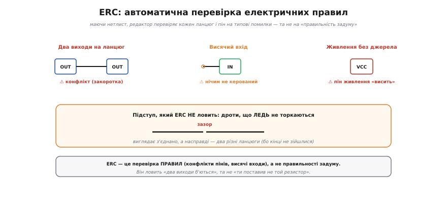

# ⚙️ Нетлист і ERC: як редактор схем «бачить» вузли

> Читаючи схему, корисно подумки «зафарбовувати кожен вузол» — простежувати, що з чим сполучено суцільним дротом. А коли ви креслите схему в редакторі (KiCad, EAGLE…), цю саму роботу за вас робить **програма**: будує **нетлист** і перевіряє його на помилки (**ERC**, англ. *Electrical Rule Check* — перевірка електричних правил). Розберімо, як саме — бо в основі лежить класичний алгоритм на графах.

### Задача

Ви намалювали символи деталей і з'єднали їхні **піни** дротами та крапками. Тепер комп'ютерові треба самотужки з'ясувати, **які піни електрично сполучені** — тобто згрупувати їх у **ланцюги** (*nets*). Кожен ланцюг — це один **вузол**: усі піни в ньому мають спільний потенціал. Список усіх ланцюгів і пінів у кожному й називають **нетлистом** — і саме він, а не картинка, є справжнім описом схеми для програми (а далі — і для розведення плати).

### Ідея: ланцюг — це зв'язна компонента графа


*Редактор будує граф: піни й кінці дротів — вершини, дроти й крапки — ребра. Потім шукає **зв'язні компоненти** — групи, усе всередині яких сполучене. Кожна компонента стає одним ланцюгом — одним [вузлом](book:electronics/nodes-branches-loops). Праворуч — готовий нетлист: перелік ланцюгів і пінів у кожному.*

Те «зафарбовування вузлів» — насправді класична задача на графах. Уявімо схему **графом**: піни й кінці дротів — це вершини, а кожен дріт (і кожна крапка-з'єднання) — ребро, що сполучає дві вершини. Тоді «всі точки, сполучені суцільним дротом» — це **зв'язна компонента** графа, а знайти всі ланцюги означає знайти всі зв'язні компоненти — той самий [обхід графа в глибину чи в ширину (DFS/BFS)](book:electronics/nodes-branches-loops/proj-graph-traversal.md).

Найзручніший інструмент тут — **система неперетинних множин** (*union-find*). Спершу кожен пін — окрема множина; далі проходимо всі дроти й крапки й **зливаємо** (`union`) множини тих пінів, що сполучені; наприкінці кожна множина, що лишилась, — це один ланцюг. Окремо обробляють **іменовані** ланцюги: усі піни з однаковою міткою («+5В», «GND») теж зливають в один ланцюг — навіть якщо дроту між ними не намальовано.

### Робоче ядро: union-find

Сам алгоритм будування нетлиста короткий. Ось робоче ядро на C++: кожен пін спершу окрема множина, далі зливаємо множини сполучених пінів, наприкінці групуємо за коренем.

:::tabs
```cpp
// Система неперетинних множин зі стисненням шляхів і об'єднанням за рангом.
struct DSU {
    std::vector<int> parent, rank_;
    explicit DSU(int n) : parent(n), rank_(n, 0) {
        for (int i = 0; i < n; ++i) parent[i] = i;   // makeset: кожен пін — сам собі корінь
    }
    int find(int x) {                                // корінь множини піна x
        while (parent[x] != x) x = parent[x] = parent[parent[x]];  // зі стисненням
        return x;
    }
    void unite(int a, int b) {                       // злити два ланцюги в один
        a = find(a); b = find(b);
        if (a == b) return;
        if (rank_[a] < rank_[b]) std::swap(a, b);
        parent[b] = a;
        if (rank_[a] == rank_[b]) ++rank_[a];
    }
};

// Кожен дріт, крапка-з'єднання й однакова мітка дають по виклику unite():
DSU dsu(pin_count);
for (auto [a, b] : wires)          dsu.unite(a, b);          // дроти й крапки
for (auto& g : named_nets)         for (int p : g) dsu.unite(g[0], p);  // мітки-імена

// find(корінь) для кожного піна — і піни з однаковим коренем складають один ланцюг.
std::map<int, std::vector<int>> nets;
for (int p = 0; p < pin_count; ++p) nets[dsu.find(p)].push_back(p);
```
```python
from collections import defaultdict

# Система неперетинних множин зі стисненням шляхів і об'єднанням за рангом.
class DSU:
    def __init__(self, n):
        self.parent = list(range(n))   # makeset: кожен пін — сам собі корінь
        self.rank = [0] * n

    def find(self, x):                 # корінь множини піна x
        while self.parent[x] != x:
            self.parent[x] = self.parent[self.parent[x]]   # зі стисненням
            x = self.parent[x]
        return x

    def unite(self, a, b):             # злити два ланцюги в один
        a, b = self.find(a), self.find(b)
        if a == b:
            return
        if self.rank[a] < self.rank[b]:
            a, b = b, a
        self.parent[b] = a
        if self.rank[a] == self.rank[b]:
            self.rank[a] += 1

# Кожен дріт, крапка-з'єднання й однакова мітка дають по виклику unite():
dsu = DSU(pin_count)
for a, b in wires:                     # дроти й крапки
    dsu.unite(a, b)
for g in named_nets:                   # мітки-імена
    for p in g:
        dsu.unite(g[0], p)

# find(корінь) для кожного піна — і піни з однаковим коренем складають один ланцюг.
nets = defaultdict(list)
for p in range(pin_count):
    nets[dsu.find(p)].append(p)
```
:::

Маючи готовий нетлист (`nets`), ERC робить ще один прохід по ланцюгах і застосовує **правила**:

```
для кожного ланцюга:  глянути типи пінів (вхід/вихід/живлення/пасив)
   два ВИХОДИ в одному ланцюгу        → конфлікт (закоротка джерел)
   ВХІД, якого ніхто не «жене»        → висячий вхід
   пін ЖИВЛЕННЯ без джерела           → не запитано
   ланцюг з одного піна               → нікуди не під'єднано
```

### Складність і пастки

**Складність.** Union-find зі стисненням шляхів працює майже **лінійно** від числа пінів і дротів, тож нетлист будується миттєво навіть для величезних схем; ERC — це ще один лінійний прохід по ланцюгах.

А ось пастки — суто **схемотехнічні**, і про них варто знати:

- **Дроти, що ЛЕДЬ не торкаються.** Якщо кінці двох дротів розійшлися на піксель, граф їх **не** з'єднає — вийдуть два різні ланцюги, хоч на око «все сполучено». Це класичний прихований баг; редактори тому **притягують** кінці до сітки.
- **Забута крапка.** Перетин без крапки — це **не** з'єднання, і це **коректна** топологія, тож ERC помилки не побачить. Забули крапку там, де хотіли з'єднати, — матимете тихий обрив, якого перевірка не зловить.
- **Випадково однакове ім'я.** Дали двом незв'язаним ланцюгам одну мітку — і union злив їх в один: закоротка, якої ви не малювали.
- **ERC — це перевірка ПРАВИЛ, а не задуму.** Він ловить «два виходи б'ються за один ланцюг» чи «вхід висить», але **не** скаже, що ви поставили не той резистор чи переплутали логіку. Це радше орфографічний контроль, ніж коректор змісту.


*ERC перевіряє електричні правила: два виходи на ланцюг (конфлікт-закоротка), вхід, якого ніхто не жене (висячий), пін живлення без джерела. Але «дроти, що ледь не торкаються» він не ловить — то окремі ланцюги, що виглядають з'єднаними. ERC стереже правила, а не задум.*

Отож програма робить ту саму роботу, що й ви оком, — лише алгоритмічно: зводить схему до графа, знаходить вузли як зв'язні компоненти й перевіряє правила. Знаючи це, ви розумієте і чому варто слухатись ERC, і чому він **не** замінює уважного читання схеми вузол за вузлом.
