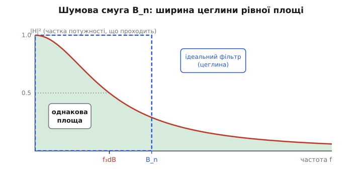
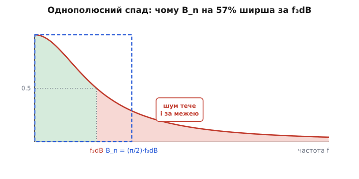
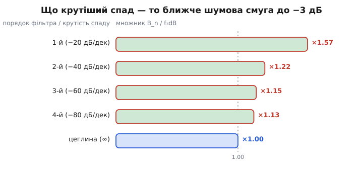

# Шумова смуга

Шум у тракті живиться частотами. Поставте перед чутливим підсилювачем фільтр, що пропускає менший діапазон, — і шуму на виході стане менше; розширте діапазон — шуму побільшає. Звідси проста, на перший погляд, бухгалтерія: «зібраний шум = густина шуму × ширина смуги». Її пишуть на серветках, нею оцінюють чутливість приймачів, нею виправдовують кожен фільтр у сигнальному тракті.

Проблема в слові «ширина». Яка саме? Та [смуга −3 дБ](book:electronics/bandwidth-3db), що в даташиті? Але реальний фільтр не обриває частоти, як ножем: за точкою зрізу його крива спадає поступово, і трохи шуму просочується далі — на тих частотах, де корисний сигнал давно згас, а шум іще ні. Якщо в бухгалтерію підставити −3 дБ, відповідь вийде заниженою: ви недорахуєте шуму, який реально приходить хвостом фільтра. Щоб формула «густина × смуга» була чесною, потрібна не смуга пропускання, а особлива, ширша величина — **шумова смуга** (*equivalent noise bandwidth*, ENBW, B_n). Вона перетворює складну криву фільтра на одне число, з яким уся арифметика шуму стає точною.

### Чому шум множиться на смугу

Спершу — звідки взагалі береться добуток «густина × смуга». Найпоширеніший шум в електроніці — [тепловий](book:electronics/resistor-noise): хаотичний рух носіїв заряду в кожному резисторі породжує дрібну випадкову напругу. Його ключова риса — він **рівномірний за частотою**: на кожен герц смуги припадає однакова порція потужності шуму, від найнижчих частот до десятків гігагерц. Через цю рівність спектр теплового шуму називають **білим** (за аналогією з білим світлом, де всі частоти видимого діапазону присутні порівну).

> 📜 Тепловий шум першим **виміряв** Джон Бертран Джонсон у лабораторії Белла 1928 року, а **теоретично пояснив** того ж року його колега Гаррі Найквіст, вивівши, що доступна потужність шуму резистора дорівнює k·T·B. Обидва — шведи за народженням, що працювали в США; саме тому шум звуть «джонсон-найквістівським» — за іменами того, хто поставив дослід, і того, хто дав формулу. Докладніше — у [темі про тепловий шум](book:electronics/resistor-noise).

Якщо на кожен герц припадає однакова порція, то загальна потужність шуму — це порція, помножена на кількість герців, які система пропускає. Звідси й добуток. Зручно рахувати в **густині шуму** — скільки шуму припадає на один герц смуги. Для напруги її міряють не у вольтах на герц, а у вольтах на корінь із герца (В/√Гц), і ось чому: складаються (бо незалежні) не самі випадкові напруги, а їхні **потужності**, тобто квадрати. Потужність росте лінійно зі смугою, а напруга — як її корінь:

```
P_шум  = e_n²  · B_n            потужність ∝ смузі
U_шум  = e_n · √B_n             діюча напруга ∝ √смуги
```

де e_n — спектральна густина напруги шуму (В/√Гц), B_n — шумова смуга (Гц). Корінь у другому рядку — не примха запису, а пряме віддзеркалення того, що незалежні шуми додаються потужностями. Він пояснює, чому подвоєння смуги збільшує діючу напругу шуму лише в √2 ≈ 1.41 раза, а не вдвічі: учетверо ширша смуга — і тільки тоді вдвічі більший шум за напругою.

> 🔧 **Навіщо це.** Корінь зі смуги — причина, чому за шум так вигідно платити фільтром. Звузивши смугу вчетверо (наприклад, поставивши фільтр під реальну швидкість сигналу), ви ріжете шумову напругу вдвічі — задарма, самим лише пасивним RC. А якщо хочете покращити сигнал/шум удесятеро тільки звуженням смуги, готуйтеся стиснути її в сто разів: ось чому одним фільтром далеко не заїдеш і доводиться братися ще й за саме джерело шуму.

### Чесна ширина: цеглина рівної площі

Тепер головне питання: чим заповнити в цих формулах B_n? Підставити смугу −3 дБ спокусливо, та невірно. Уявімо ідеальний фільтр — **цеглину** (*brick-wall*): від нуля до якоїсь межі він пропускає все без утрат, а далі обриває намертво. Для такого фільтра питання «яка смуга» не має двозначності: уся смуга працює на повну, за межею — нуль. Зібраний шум дорівнював би просто густині, помноженій на ширину цеглини.

Але реального фільтра-цеглини не існує. Справжня крива має полицю, плавний злам коло частоти зрізу й похилий хвіст, що тягнеться далеко за неї. На полиці фільтр пропускає шум на повну. Трохи нижче за зрізом — уже наполовину (саме там точка −3 дБ). А ще далі, на хвості, він пропускає мало, але **не нуль**, і цей залишок усе одно додає шуму, бо білий шум присутній і там.

Ось і вся хитрість шумової смуги: ми питаємо не «де крива впала на 3 дБ», а **«цеглина якої ширини зібрала б рівно стільки ж шуму, скільки збирає наш реальний фільтр»**. Прирівнюємо площі. Площа під реальною кривою передачі потужності (під |H|², бо шум рахується за потужністю) — це весь шум, що проходить, з усіма хвостами. Прирівнюємо її до площі прямокутника заввишки в повну полицю. Ширина цього прямокутника і є шумова смуга:


*Реальний спад (червона крива) пропускає шум площею під собою — з усім хвостом за частотою зрізу. Шумова смуга B_n — це ширина ідеальної цеглини (синій пунктир) такої самої висоти й такої самої площі. Помітьте: B_n лежить правіше за f₃dB — бо хвіст реальної кривої треба кудись умістити.*

Висота прямокутника — повна полиця (одиниця, бо в смузі фільтр пропускає на повну), а площа задана. Тоді його ширина однозначна. Математично це інтеграл квадрата модуля передачі за всіма частотами, поділений на значення на полиці:

```
            ∫ |H(f)|² df       (від 0 до ∞)
   B_n  =  ──────────────────
                |H₀|²           |H₀| — передача на полиці
```

Чисельник збирає весь шум під реальною кривою; ділення на полицю переводить його у «ширину еквівалентної цеглини». Інтеграл бере **всі** частоти — і саме тому шумова смуга бачить хвіст, якого смуга −3 дБ не помічає.

### Однополюсний спад: рівно π/2 від −3 дБ

Підставмо в цей інтеграл найпоширеніший у схемах фільтр — простий [RC-фільтр низьких частот](book:electronics/rc-low-pass), один полюс, спад 6 дБ на октаву. Його передача потужності — це 1/(1 + (f/f_c)²): на f_c вона дорівнює ½ (ось вам −3 дБ), а далі плавно сповзає до нуля. Інтеграл такої кривої за всіма частотами має точну відповідь:

```
   ∫ 1/(1 + (f/f_c)²) df  =  (π/2) · f_c      (від 0 до ∞)
```

Звідки тут π/2 — той самий, що в геометрії кола? Він приходить з арктангенса: первісна функція до 1/(1+x²) — це arctan(x), а від нуля до нескінченності арктангенс пробігає рівно π/2. Та сама стала, що ховається в куті прямого кута, виринає тут як міра площі під хвостом фільтра — гарне нагадування, що π живе не лише в колах.

Поділивши на полицю (тут вона одинична), дістаємо коротке й надзвичайно вживане правило:

```
   B_n  =  (π/2) · f₃dB  ≈  1.57 · f₃dB        (один полюс)
```

Шумова смуга однополюсного фільтра на **57% ширша** за його смугу −3 дБ. Ця надбавка — не похибка й не недогляд; це той самий шум із хвоста, що тече за частотою зрізу й який чесна бухгалтерія мусить урахувати:


*Зелена площа — шум до частоти зрізу; рожевий хвіст — шум, що просочується за неї, бо фільтр обриває не намертво. Саме цей хвіст і робить шумову смугу (синя цеглина) ширшою за f₃dB рівно в π/2 раза.*

Тепер видно пастку наївної бухгалтерії: візьми ви смугу −3 дБ замість шумової, недорахували б 57% потужності шуму — а це чималий шмат бюджету в чутливому тракті.

**Приклад (шум на виході RC-фільтра).** Перед АЦП стоїть RC-фільтр зі смугою −3 дБ f₃dB = 10 кГц. На вхід приходить білий шум густиною e_n = 20 нВ/√Гц. Скільки шуму на виході?

```
B_n   = 1.57 · 10 000 Гц            = 15 700 Гц       шумова смуга
U_шум = e_n · √B_n
      = 20·10⁻⁹ · √15 700
      = 20·10⁻⁹ · 125.3             = 2.51·10⁻⁶ В     ≈ 2.5 мкВ (rms)
```

Якби ми полінувалися і взяли в корінь самі 10 кГц замість 15.7 кГц, вийшло б 2.0 мкВ — заниження на чверть. У бюджеті, де борються за кожен мікровольт, такий недооблік шуму означає прилад, що в полі шумить дужче, ніж обіцяв розрахунок.

### Що крутіший фільтр — то ближче до цеглини

Множник 1.57 — для одного полюса, найпохилішого з фільтрів. Що крутіший спад, то менше шуму просочується хвостом, то ближча реальна крива до ідеальної цеглини — і то ближчий множник до одиниці:


*Що вищий порядок фільтра (крутіший спад), то коротший його хвіст і то ближча шумова смуга до смуги −3 дБ. Від 1.57 в одного полюса множник збігає до 1.00 ідеальної цеглини, якої насправді не буває.*

Числа для пам'яті (множник B_n / f₃dB для фільтрів Баттерворта):

```
   1-й порядок  (−20 дБ/дек)   B_n = 1.57 · f₃dB
   2-й порядок  (−40 дБ/дек)   B_n = 1.22 · f₃dB
   3-й порядок  (−60 дБ/дек)   B_n = 1.15 · f₃dB
   4-й порядок  (−80 дБ/дек)   B_n = 1.13 · f₃dB
   цеглина      (∞)            B_n = 1.00 · f₃dB
```

Логіка проста: чим стрімкіше фільтр обриває частоти за зрізом, тим менший залишок шуму встигає просочитися, тим менша надбавка над смугою −3 дБ. Цеглина з нескінченно крутим спадом не пропускає нічого зайвого — її шумова смуга дорівнює смузі пропускання, множник 1.00. На практиці навіть фільтра другого порядку досить, щоб надбавка з 57% впала до 22%; а для грубих прикидок інженери часто беруть 1.57 на будь-який фільтр — бо шум входить у відповідь під коренем, і похибка в самому множнику стискається вдвічі (√1.57 проти √1.22 — різниця менша, ніж здається).

### Не за смугу сигналу

Тонкий, але частий промах: рахувати шум за смугою корисного **сигналу**, а не за смугою **фільтра**, що стоїть у тракті. Це різні речі. Сигнал може займати 1 кГц, а фільтр перед підсилювачем мати смугу 100 кГц — і тоді в тракт зайде шум усіх ста кілогерців, хоч сигналу там лише на один. Шумову смугу завжди визначає **те, що обмежує тракт** на шляху шуму до точки, де ви його міряєте: фільтр, скінченна смуга самого підсилювача, ланка інтегрування. Якщо нічого вузького в тракті немає, шумова смуга може виявитися лякаюче великою — її задасть власна смуга підсилювача в мегагерцах, і весь цей діапазон чесно набере шуму.

Звідси й головна практична думка про шумову смугу: вона показує, **скільки коштує зайва ширина**. Кожен герц, який тракт пропускає понад потрібне сигналу, приносить свою порцію шуму й нічого корисного. Тому найдешевший фільтр шуму — це фільтр, що звужує шумову смугу до реальних потреб сигналу: пасивний RC за копійки, поставлений у правильному місці, ріже шум коренем зі свого внеску в смугу.

**Приклад (фільтр під сигнал давача).** Давач видає сигнал зі смугою 100 Гц, але підсилювач має власну смугу 1 МГц, і весь цей мегагерц зараз набирає тепловий шум густиною 30 нВ/√Гц.

```
Без фільтра:
  B_n   = 1.57 · 1 000 000 Гц       = 1.57·10⁶ Гц
  U_шум = 30·10⁻⁹ · √(1.57·10⁶)     = 30·10⁻⁹ · 1253   = 37.6 мкВ

З RC-фільтром на f₃dB = 100 Гц (під сигнал):
  B_n   = 1.57 · 100 Гц             = 157 Гц
  U_шум = 30·10⁻⁹ · √157            = 30·10⁻⁹ · 12.5    = 0.38 мкВ
```

Один RC-ланцюжок під смугу сигналу зрізав шум майже в сто разів (корінь зі стократного звуження смуги). Сигнал при цьому не постраждав — його 100 Гц фільтр пропускає повністю. Це і є та сама арифметика, через яку інженери ставлять фільтр якомога раніше й вужче: вона прямо випливає з того, що шум росте як корінь зі смуги, а смугу тут задає B_n.

> 🔧 **Навіщо це.** Шумова смуга — це число, яким ви перекладаєте даташитну густину шуму (нВ/√Гц) у реальний шум вашого тракту (мкВ або мВ rms). Без неї будь-яка оцінка чутливості висить у повітрі: «20 нВ/√Гц» саме собою не каже, скільки шумітиме прилад, поки ви не помножите на корінь із B_n. І навпаки — щоб вписатися в заданий рівень шуму, ви через цю формулу рахуєте, **наскільки вузьким** має бути обмежувальний фільтр. Це перший крок будь-якого шумового бюджету.

### Пастки

- **Смуга −3 дБ замість шумової.** Підставите f₃dB у бухгалтерію шуму — недорахуєте 57% потужності (для одного полюса). Множте на 1.57 (чи на потрібний порядку множник).
- **Шум за смугою сигналу, а не фільтра.** Шумову смугу задає те, що обмежує тракт, а не те, скільки займає корисний сигнал. Немає вузького фільтра — смуга шуму дорівнює власній смузі підсилювача, а вона буває величезна.
- **Додавання шумів напругами.** Незалежні шуми складаються потужностями (квадратами), не напругами: U = √(U₁² + U₂² + …). Через це й смуга входить під корінь.
- **Один множник на всі фільтри без оглядки.** 1.57 — лише для одного полюса; для крутіших фільтрів він менший. Для грубих прикидок це терпимо (корінь згладжує), для точного бюджету — беріть множник свого порядку.
- **«Звужу смугу й виграю скільки завгодно».** Шум падає лише як корінь зі смуги: виграш у 10 разів коштує звуження в 100. Самим фільтром далеко не заїдеш — треба ще тихіше джерело.

> 🔧 **Навіщо це.** Шумова смуга стоїть у фундаменті [відношення сигнал/шум](book:electronics/signal-noise-ratio) і чутливості приймача: рахуючи, чи «побачить» прилад слабкий сигнал, ви рахуєте шум саме через B_n. Вона ж диктує, де поставити фільтр і якої смуги, щоб не задушити сигнал, але зрізати зайвий шум. Пара «густина × √смуга» з цієї теми — одна з найуживаніших оцінок «на серветці» в усій аналоговій техніці й перший рядок кожного шумового бюджету.

**Шумова смуга** B_n — це ширина ідеального фільтра-цеглини, що зібрав би стільки ж шуму, скільки збирає реальний фільтр з усіма його хвостами; формально — інтеграл |H|² за всіма частотами, поділений на полицю. Вона потрібна тому, що білий шум присутній і за частотою зрізу, тож смуга −3 дБ занижує зібраний шум. Для одного полюса B_n = (π/2)·f₃dB ≈ **1.57·f₃dB**; що крутіший фільтр, то ближчий множник до 1.00. Зібраний шум росте як **корінь** зі смуги (U = e_n·√B_n), бо незалежні шуми додаються потужностями. Звідси головне правило: звужуй шумову смугу до потреб сигналу — це найдешевший спосіб виграти в шумі, але виграш лише кореневий, тож одним фільтром усього не вирішиш.

---
