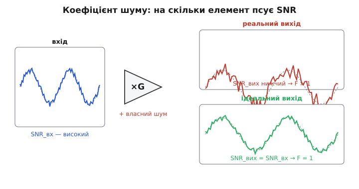
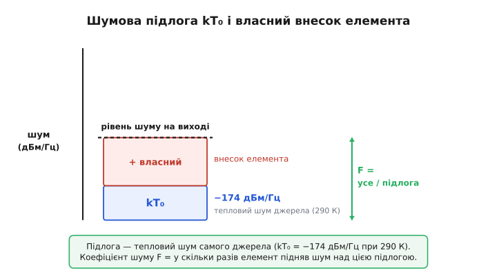
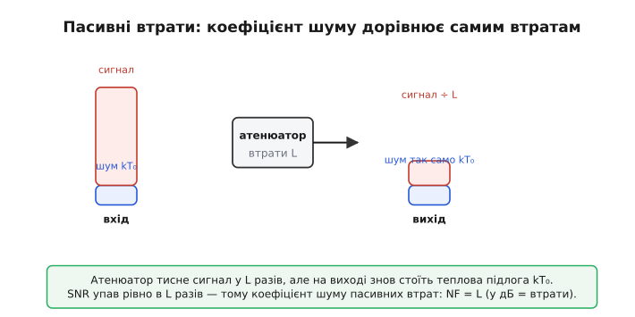
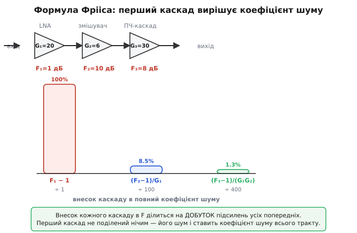

# Коефіцієнт шуму: на скільки елемент псує те, що бачить

Уявіть, що ви передаєте по черзі ту саму крихку фразу через кількох людей. Перший почув її чисто, але переказує трохи тихіше й додає від себе кашель і шепіт. Другий чує вже цю суміш — і теж щось домішує. Питання, яке вас цікавить, не «який гучний голос у кожного», а інше: **наскільки кожен зіпсував те, що почув** — наскільки фраза, чиста на вході, потьмяніла на виході саме через нього. Ось рівно це питання й ставлять про електронний елемент. Сигнал заходить у підсилювач із якимось запасом над шумом; виходить — із меншим, бо підсилювач домішав власного шуму. **Коефіцієнт шуму** — це одне число, що каже: у скільки разів цей елемент погіршив відношення сигнал/шум, поки сигнал крізь нього проходив.

> 🔧 **Навіщо це.** Коли ви будуєте радіоприймач, давач слабких сигналів чи будь-який тракт, де корисне ледь видно над шумом, вам треба вибирати елементи. Два підсилювачі мають однакове підсилення й однакову смугу — котрий брати? Той, що менше псує сигнал. Без єдиної мірки цього не порівняти: «власний шум» одного даного в нановольтах на корінь із герца, другого — у температурі, третього взагалі не вказано. Коефіцієнт шуму зводить усе до однієї цифри в децибелах, яку можна прочитати в даташиті й одразу зіставити. Він же — той параметр, за яким радіоінженер судить, чи дотягне приймач до потрібної чутливості, і де в тракті битися за тишу, а де вже байдуже.

### Спершу — що саме ми міряємо

Відношення сигнал/шум (SNR) описує одну точку тракту: наскільки в ній корисне вище за шум. Але тракт — це послідовність елементів, і кожен щось зі SNR робить. Ідеальний, уявний елемент **нічого не псує**: що зайшло над шумом, те й вийшло над шумом — він однаково підсилює і сигнал, і шум, що приніс із собою, а свого не додає. Реальний так не вміє: усередині нього живуть власні джерела шуму — теплове ворушіння електронів у резисторах, дробовий шум переходів, — і цей шум підсилювач домішує до сигналу. На виході корисне піднялося в G разів, але шуму тепер не тільки той, що зайшов, а ще й власний. Відстань між сигналом і шумом скоротилася.

> Чому підсилення множить сигнал і шум на той самий коефіцієнт і **саме по собі** SNR не покращує, чому тиша вирішується в найпершому елементі тракту й чому SNR зручно рахувати зведеним до входу — у статті [відношення сигнал/шум](topic:electronics/signal-noise-ratio). Тут ми беремо SNR як готову мірку якості точки й питаємо інше: на скільки конкретний елемент її погіршує.

Це погіршення й ловить **коефіцієнт шуму** (англ. *noise factor* для відношення в разах, *noise figure* для нього ж у децибелах; обидва від лат. *figura* — обрис, міра). Означення пряме до самого нерва:

```
F = SNR_вх / SNR_вих        (відношення в разах, «noise factor»)
NF = 10 · log₁₀ F           (те саме в децибелах, «noise figure»)
```

Читається це буквально: на скільки разів вхідний SNR кращий за вихідний. Якщо елемент ідеальний — SNR не змінився, F = 1, NF = 0 дБ. Це нижня межа: краще за нуль децибел не буває, бо додати сигналу понад те, що зайшло, елемент не може, а шуму менше нуля не домішаєш. Реальний підсилювач завжди дає F > 1: SNR на виході гірший, NF додатний. Чим тихіший елемент — тим ближче його NF до нуля; чим бруднішого власного шуму він підсипає — тим NF більший.


*На вході сигнал стоїть високо над тонким шумом. Ідеальний елемент (унизу) лишає той самий запас — SNR_вих = SNR_вх, F = 1. Реальний (угорі) домішує власний шум, запас падає — SNR_вих нижчий, F > 1. Коефіцієнт шуму міряє саме цю різницю.*

> 🔧 **Навіщо це.** Нуль децибел — це чесний орієнтир, проти якого читають будь-який даташит. Бачите «NF = 0.8 дБ» у малошумного підсилювача — означає, що він майже ідеальний, забирає менш ніж децибел запасу. Бачите «NF = 10 дБ» у змішувача — він з'їдає цілий порядок SNR за потужністю. Одне число одразу каже, скільки тиші коштує поставити цей елемент у тракт.

### Звідки взялася стала температура 290 кельвінів

Тут ховається тонкість, без якої коефіцієнт шуму був би безглуздим. Щоб порахувати, на скільки елемент **погіршив** SNR, треба знати, який шум був **на вході**. Але вхідний шум залежить від того, що до елемента під'єднано: гарячий резистор шумить більше, холодний менше, опір більший — шуму більше. Якщо мірити F при будь-якому вхідному шумі, який заманеться, то один і той самий підсилювач дасть різні цифри в різних умовах — і порівнювати даташити стане неможливо.

Вихід один: **домовитися про стандартний вхідний шум** — однаковий для всіх вимірів. За таку опору взяли тепловий шум звичайного резистора-джерела при фіксованій температурі. А температуру обрали **T₀ = 290 кельвінів** — це 16.85 °C, майже кімната. Вибір не випадковий і не суто фізичний: 290 К близьке до реальних умов наземної техніки, а ще на ньому зручно рахувати — добуток сталої Больцмана на цю температуру дає круглі числа.

Порахуймо ту опору в одиницях, у яких живуть радіоінженери. Теплова потужність шуму, яку джерело при T₀ віддає в смугу 1 герц, дорівнює k·T₀ — і це фундаментальна підлога, нижче якої не опуститися:

```
k·T₀ = 1.38×10⁻²³ · 290 ≈ 4.00×10⁻²¹ Вт/Гц
у децибелах відносно мілівата:  10 · log₁₀(4.00×10⁻²¹ / 1×10⁻³) ≈ −174 дБм/Гц
```

Ось воно — **−174 дБм/Гц**, число, яке радіоінженер знає напам'ять, як столяр знає, що в метрі сто сантиметрів. Це шумова підлога будь-якого входу при кімнатній температурі, віднесена до одного герца смуги. Коефіцієнт шуму відлічують саме від неї: F каже, **у скільки разів** елемент підняв шум на виході вище за цю неминучу теплову підлогу, перераховану на його вхід.


*Синя підлога — тепловий шум самого джерела, kT₀ = −174 дБм/Гц при 290 К, нижче не буває. Червоне згори — власний шум елемента, доданий до підлоги. Коефіцієнт шуму F — це відношення всієї висоти до підлоги: у скільки разів елемент підняв шум над неминучим тепловим мінімумом.*

> Звідки взагалі береться теплова потужність kTB, чому кожен резистор у схемі — джерело шумової напруги √(4kTRB) і чому шум росте з опором і смугою — у статті [тепловий шум](topic:electronics/resistor-noise). Тут ця підлога нам потрібна як готовий нуль відліку: kT₀ при 290 К — те, від чого міряють коефіцієнт шуму.

> Чому в шумові розрахунки підставляють не звичайну смугу за рівнем −3 дБ, а трохи ширшу **еквівалентну шумову смугу** (плавний спад фільтра пропускає більше шуму, ніж ідеальна прямокутна межа) — окрема тонкість у темі [шумова смуга](topic:electronics/noise-bandwidth). На самий коефіцієнт шуму вона не впливає — F нормований на герц, — але потрібна, щойно переходимо до повної потужності шуму в каналі.

Чому походження саме цього числа й вибору 290 К варто знати — окрема історія, бо мірку придумала конкретна людина з конкретної потреби. У 1944 році данський інженер [Гаральд Фрііс](topic:electronics/noise-figure/hist-friis.md) у Bell Labs зіткнувся з тим, що радіоприймачі нічим чесно порівнювати, і ввів коефіцієнт шуму та формулу його накопичення в ланцюгу — обидва досі стоять у кожному підручнику й даташиті.

### Чому коефіцієнт шуму — це власний шум елемента, і нічого більше

Зведімо означення F до того, що насправді в ньому сидить, бо саме тут інтуїція стає міцною. Розпишімо вихідний SNR через вхідний. Сигнал на виході — це вхідний сигнал, помножений на підсилення G. Шум на виході — це вхідний шум, теж помножений на G, **плюс** власний шум елемента, що народився всередині. Підставмо й поділімо:

```
SNR_вх = S / N_вх
SNR_вих = (G·S) / (G·N_вх + N_власний)

F = SNR_вх / SNR_вих = (G·N_вх + N_власний) / (G·N_вх) = 1 + N_власний / (G·N_вх)
```

Ось і вся суть. **F = 1 + (власний шум елемента, зведений до входу) / (тепловий шум джерела).** Одиниця — це внесок ідеального елемента, який лише чесно пропустив вхідний шум. А все понад одиницю — це **власний шум**, поділений на підсилення (тобто зведений до входу) і виміряний у частках теплової підлоги. Якби елемент не додавав нічого свого, N_власний = 0, і F = 1 точно. Кожен реальний доданок власного шуму штовхає F вище одиниці.

Звідси видно, чому коефіцієнт шуму — це характеристика **самого елемента**, а не сигналу крізь нього: у формулі немає ані рівня сигналу, ані SNR — лише власний шум елемента проти стандартної теплової підлоги. Тому-то F можна один раз зміряти, записати в даташит числом і користуватися ним за будь-якого сигналу. Сигнал прийде який завгодно — а на скільки цей підсилювач його зіпсує, уже відомо наперед.

**Скільки SNR з'їдає підсилювач із NF = 3 дБ.** На вхід малошумного підсилювача приходить сигнал із запасом SNR = 50 дБ. Підсилювач має коефіцієнт шуму 3 дБ. Який SNR буде на виході?

:::tabs
```c
// NF — це просто скільки децибел SNR елемент відбирає
float snr_in_db = 50.0f;   // запас на вході, дБ
float nf_db     = 3.0f;    // коефіцієнт шуму підсилювача, дБ

float snr_out_db = snr_in_db - nf_db;   // 50 - 3 = 47 дБ
```
```python
# NF — це просто скільки децибел SNR елемент відбирає
snr_in_db = 50.0   # запас на вході, дБ
nf_db     = 3.0    # коефіцієнт шуму підсилювача, дБ

snr_out_db = snr_in_db - nf_db   # 50 - 3 = 47 дБ
```
:::

Сорок сім децибел — рівно на коефіцієнт шуму менше, ніж було. У децибелах усе складається до банальної віднімки: **SNR_вих = SNR_вх − NF**. Три децибели — це вдвічі гірший SNR за потужністю; підсилювач відібрав половину запасу. Саме тому за малошумними каскадами полюють: кожен зекономлений децибел NF — це децибел запасу, який лишається корисному сигналу.

### Несподіванка: проста втрата — теж коефіцієнт шуму, і дорівнює вона самій втраті

Дотепер ми думали про активні елементи — ті, що підсилюють. Та коефіцієнт шуму має й **пасивний** елемент: кабель, атенюатор, фільтр, роз'єм — усе, що сигнал лише послаблює. Здавалося б, що тут псувати: пасивна деталь нічого свого не генерує, тихо собі гріється. Проте її коефіцієнт шуму не нульовий, і це одна з найкорисніших несподіванок теми, тож проживімо її повільно.

Пропустимо сигнал через атенюатор із втратами L (скажімо, L = 10 разів, тобто −10 дБ). Сигнал на виході впав у L разів — це очевидно. А що з шумом? Здавалося б, шум теж упав у L разів, і SNR лишився той самий. Але ні. На виході атенюатора знову стоїть **теплова підлога kT₀** — бо сам атенюатор має температуру 290 К і його опір шумить рівно настільки, щоб поставити на виході ту саму теплову підлогу, яка була на вході. Сигнал упав у L разів, а шум на виході лишився kT₀ — як був. Відстань між ними скоротилася рівно в L разів:

```
сигнал на виході:  S / L
шум на виході:     kT₀   (теплова підлога, та сама)
SNR_вих = SNR_вх / L     →     F = L
```

Коефіцієнт шуму пасивних втрат **дорівнює самим втратам**. Атенюатор −10 дБ має NF = 10 дБ. Метр кабелю з втратами 3 дБ має NF = 3 дБ. Це не метафора й не наближення — це точна рівність: скільки децибел сигналу втратив, стільки децибел SNR і віддав, бо шум униз за тобою не пішов.


*На вході сигнал високо над тепловою підлогою kT₀. Атенюатор тисне сигнал у L разів, але на виході знову стоїть та сама теплова підлога — атенюатор гріється й шумить рівно настільки. SNR упав у L разів, тому коефіцієнт шуму пасивних втрат: NF = втрати в децибелах.*

> 🔧 **Навіщо це.** Звідси випливає правило, яке рятує приймачі: **усе, що стоїть перед першим підсилювачем, додає свій NF до всього тракту — у повну силу.** Поставили довгий кабель від антени до приймача з втратами 3 дБ — увесь приймач одразу погіршився на 3 дБ NF, і жоден малошумний підсилювач усередині цього вже не виправить. Тому малошумний підсилювач ставлять **якомога ближче до антени** — часто прямо на ній (так звана «активна антена»), щоб втрати кабелю йшли вже **після** підсилення, де вони майже не шкодять. Інженер, що це засвоїв, не тягне сигнал слабким по довгому кабелю, а спершу його підсилює — і аж тоді жене кудись.

Чому ж саме перші втрати такі дорогі, а ті самі втрати десь усередині тракту майже не помітні — це вже про те, як коефіцієнти шуму окремих ланок складаються в один.

### Як коефіцієнти шуму ланок складаються: формула Фрііса

Радіоприймач — це завжди ланцюг: антена, малошумний підсилювач, змішувач, фільтр, підсилювач проміжної частоти, далі детектор. Кожна ланка має свій коефіцієнт шуму й своє підсилення. Як із них дістати **повний** коефіцієнт шуму всього тракту — і чому, хоч би скільки ланок ми поставили, перша важить так непомірно?

Логіка та сама, що рятує будь-який шумовий розрахунок: **звести шум кожної ланки до входу**. Власний шум першої ланки заходить у вхід як є — перед ним нічого немає. Власний шум другої ланки народжується вже **після** першого підсилення; щоб порівняти його з вхідним сигналом, його треба поділити на підсилення першої ланки — а воно велике, тож на вході шум другої ланки виглядає вже маленьким. Шум третьої ділиться на добуток підсилень першої й другої — і майже зникає. Складемо всі внески, зведені до входу, — і дістанемо формулу, яку 1944 року вивів Фрііс:

```
F = F₁ + (F₂ − 1)/G₁ + (F₃ − 1)/(G₁·G₂) + (F₄ − 1)/(G₁·G₂·G₃) + …
```

Тут F₁, F₂, … — коефіцієнти шуму ланок **у разах** (не в децибелах!), а G₁, G₂, … — їхні підсилення **в разах**. Кожна ланка, окрім першої, входить як (Fₙ − 1) — лише її **власний надлишок** над ідеалом, — і цей надлишок поділений на добуток підсилень **усіх ланок перед нею**. Перша ланка стоїть у формулі повністю, нічим не поділена: її коефіцієнт шуму лягає на тракт у повну силу.


*Угорі — типовий приймальний тракт: малошумний підсилювач, змішувач, каскад проміжної частоти. Унизу — внесок кожного в повний коефіцієнт шуму. Перший каскад входить повністю; внесок другого поділений на підсилення першого, третього — на добуток перших двох. Перший стовпчик панує — він і ставить коефіцієнт шуму всього приймача.*

Звідси — головний практичний висновок усієї слабкосигнальної радіотехніки: **повний коефіцієнт шуму тракту майже цілком задає перша ланка, якщо вона добре підсилює.** Поставте на вхід малошумний підсилювач (LNA) з малим NF і великим підсиленням — і він зробить дві речі заразом: своїм малим NF не зіпсує вхід, а великим підсиленням «утопить» шум усіх наступних ланок, бо вони діляться на його велике G. Тому навіть якщо змішувач за ним має NF цілих 10 дБ — після підсилення на 20 дБ його внесок у повний F стискається в сто разів і майже не чути.

**Повний коефіцієнт шуму двокаскадного входу.** LNA: NF₁ = 1 дБ, підсилення G₁ = 20 дБ. За ним змішувач: NF₂ = 10 дБ. Який коефіцієнт шуму пари — і наскільки змішувач його зіпсував?

:::tabs
```c
#include <math.h>

// дБ → рази
static float db2lin(float db) { return powf(10.0f, db / 10.0f); }
// рази → дБ
static float lin2db(float x)  { return 10.0f * log10f(x); }

float F1 = db2lin(1.0f);    // NF LNA: 1 дБ  → F₁ ≈ 1.259
float G1 = db2lin(20.0f);   // підсилення LNA: 20 дБ → G₁ = 100
float F2 = db2lin(10.0f);   // NF змішувача: 10 дБ → F₂ = 10

// формула Фрііса для двох каскадів
float F  = F1 + (F2 - 1.0f) / G1;   // 1.259 + 9/100 = 1.349
float NF = lin2db(F);               // 10·log₁₀(1.349) ≈ 1.30 дБ
```
```python
import math

# дБ → рази
def db2lin(db): return 10.0 ** (db / 10.0)
# рази → дБ
def lin2db(x):  return 10.0 * math.log10(x)

F1 = db2lin(1.0)     # NF LNA: 1 дБ  → F₁ ≈ 1.259
G1 = db2lin(20.0)    # підсилення LNA: 20 дБ → G₁ = 100
F2 = db2lin(10.0)    # NF змішувача: 10 дБ → F₂ = 10

# формула Фрііса для двох каскадів
F  = F1 + (F2 - 1.0) / G1   # 1.259 + 9/100 = 1.349
NF = lin2db(F)              # 10·log₁₀(1.349) ≈ 1.30 дБ
```
:::

Повний коефіцієнт шуму — **близько 1.3 дБ**, хоч сам по собі змішувач має цілих 10 дБ. Підсилення LNA на 20 дБ (×100) поділило надлишок змішувача (F₂ − 1 = 9) на сто — і той вніс лиш 0.09 до F замість дев'яти. Поставте ті самі дві ланки **навпаки** — змішувач попереду — і повний NF підскочить майже до тих 10 дБ. Порядок ланок у тракті вирішує більше, ніж їхня якість окремо.

> Повне виведення формули Фрііса з першопричини — чому надлишок (Fₙ − 1), а не сам Fₙ, чому ділиться на добуток підсилень і як вона переходить у мову шумових температур (де додаються прямо самі температури, поділені на підсилення) — у вставці [виведення формули Фрііса](topic:electronics/noise-figure/math-friis-cascade.md). Там цей самий результат проживається крок за кроком і доводиться до робочого розрахунку багатокаскадного приймача.

### Той самий шум, інша мова: шумова температура

У формулі вище майнуло: коефіцієнт шуму можна переписати через **температуру**. Це не примха, а часто зручніший спосіб, особливо там, де NF замалий, щоб бути зручним. Ідея проста до краси: будь-який власний шум елемента можна вдати тепловим шумом уявного резистора на вході — треба лише підібрати тому резисторові потрібну температуру. Цю температуру звуть **еквівалентною шумовою температурою** Te: вона каже, до скількох градусів довелося б нагріти вхідний опір, щоб самий лише його тепловий шум пояснив увесь власний шум елемента.

Зв'язок із коефіцієнтом шуму випливає прямо з означення F = 1 + N_власний/(G·N_вх), якщо власний шум записати як теплову потужність при Te, а вхідний — при T₀:

```
F = 1 + Te / T₀        (T₀ = 290 К)
Te = (F − 1) · T₀
```

Ідеальний елемент: Te = 0 К (нічого свого не додає, F = 1). Підсилювач із NF = 3 дБ (F = 2): Te = (2 − 1)·290 = 290 К — він додає стільки ж шуму, скільки кімнатний резистор. Підсилювач із NF = 0.5 дБ (F ≈ 1.122): Te ≈ 35 К — зовсім тихий.

> 🔧 **Навіщо це.** Шумова температура виграє там, де елементи **дуже** тихі, а різниці між ними — крихітні. Для приймачів космічного зв'язку чи радіотелескопів NF ходить у межах десятих часток децибела: 0.3 проти 0.4 дБ на око однакові, а в температурах це 21 проти 28 К — різниця в третину, видно одразу. Тому в радіоастрономії й супутниковому зв'язку шумність майже завжди задають температурою, а не децибелами: дрібні відмінності помітніші, та й температури в каскадах **додаються** прямо (поділені на підсилення), що для розрахунку охолоджуваних приймачів зручніше.

І ще тут видно, чому 290 К — лише **умовність**, прив'язана до Землі. У формулі F = 1 + Te/T₀ температура T₀ — це опора порівняння, а не реальна температура чогось. Коли антена радіотелескопа дивиться в холодне небо, шум, що приходить із неба, відповідає кільком кельвінам, а не 290 — і коефіцієнт шуму, нормований на 290 К, перестає чесно описувати, скільки тиші лишилося. Тому для таких систем рахують **системну шумову температуру** — суму температур антени, втрат і приймача, — а не коефіцієнт шуму. Коефіцієнт шуму — мова наземної техніки, де вхід і справді близький до кімнатних 290 К; шумова температура — мова всюди, де це не так.

### Що варто винести

Коефіцієнт шуму відповідає на одне питання про елемент: **на скільки він псує відношення сигнал/шум**, поки сигнал крізь нього проходить. Означення пряме — F = SNR_вх / SNR_вих у разах, NF = 10·log₁₀F у децибелах; ідеальний елемент дає F = 1 (NF = 0 дБ), реальний завжди більше. Розписавши означення, бачимо, що F = 1 + (власний шум, зведений до входу)/(тепловий шум джерела) — тобто коефіцієнт шуму це **власний шум елемента**, виміряний у частках стандартної теплової підлоги, і ні від чого, крім самого елемента, не залежить. Тому його й нормують на сталу опору — тепловий шум джерела при T₀ = 290 К, що дорівнює −174 дБм/Гц. У децибелах SNR на виході просто SNR на вході мінус NF. Пасивна втрата — теж коефіцієнт шуму, рівний самій втраті (атенюатор −10 дБ має NF = 10 дБ), бо сигнал падає, а теплова підлога ні; тому втрати **перед** першим підсилювачем найдорожчі. У ланцюгу каскадів повний коефіцієнт шуму дає формула Фрііса F = F₁ + (F₂−1)/G₁ + (F₃−1)/(G₁G₂) + …: внесок кожної ланки поділений на добуток підсилень усіх попередніх, тож **перша ланка вирішує** — малошумний підсилювач із великим підсиленням на вході ставить тишу всього тракту. А той самий шум можна задати й температурою: Te = (F−1)·T₀ — мова дуже тихих приймачів, де децибели вже надто грубі. Хто бачить тракт очима коефіцієнта шуму, той знає, який елемент брати, куди його ставити й де закінчується чесність числа, нормованого на земні 290 кельвінів.

---
