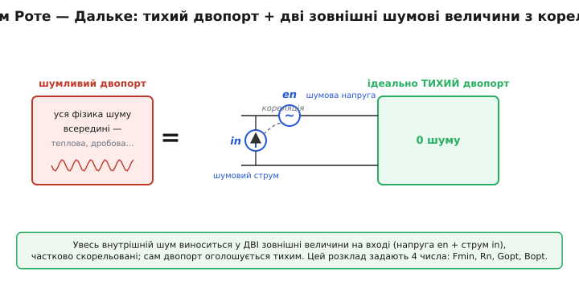

# 📜 Звідки взялися чотири числа в рядку шуму даташита

Розгорніть даташит будь-якого малошумного транзистора — і на сторінці характеристик шуму ви побачите завжди ту саму четвірку: **Fmin**, **Rn**, **Gopt**, **Bopt** (останні два часто разом як **Γopt** чи **Yopt**), і так для кожної частоти окремим рядком. Четвірка ця настільки звична, що здається законом природи — мовляв, шум двопорту просто *такий* і описується саме чотирма числами. Але це не закон природи. Це винахід двох німецьких інженерів, зроблений у конкретний рік, у конкретній фірмі, і до того дня ніхто не знав, як коректно порівняти шумливість двох приладів, не прив'язавшись до випадкового джерела, на якому їх міряли. Ця стаття — про те, як народилася сама мова, якою сьогодні розмовляє вся слабкосигнальна радіотехніка.

## Що бентежило: шумливість, яку не вдавалося відірвати від схеми

Уявіть інженера початку 1950-х, який тримає в руках два підсилювальні прилади — скажімо, дві лампи чи два перші германієві транзистори — і хоче чесно відповісти на просте питання: котрий із них **тихіший**? Питання здається тривіальним. Виміряй коефіцієнт шуму того й того та порівняй число з числом.

Пастка в тому, що **коефіцієнт шуму — не властивість приладу**. Він залежить від того, який опір джерела ви підсунули на вхід. Той самий транзистор на одному джерелі дасть 2 дБ, а на іншому — 5 дБ, і обидва числа правдиві. Виміряйте перший прилад на джерелі 50 Ом, другий — на джерелі 200 Ом, і порівняння нічого не варте: ви порівнюєте не прилади, а дві різні комбінації «прилад плюс джерело». А золотої середини — того опору джерела, де коефіцієнт шуму найменший, — ніхто наперед не знав, бо й самого поняття «оптимальний за шумом опір» ще не існувало як величини, яку можна виписати в таблицю.

> 🔧 **Навіщо це.** Без міри, відірваної від джерела, неможливі ні даташит, ні чесний вибір приладу, ні розрахунок приймача наперед. Поки шумливість прив'язана до конкретної схеми вимірювання, кожен виробник міг показати свій транзистор у вигідному світлі, обравши «зручне» джерело, а інженер-схемотехнік не міг передбачити, як прилад поведеться в *його* схемі з *його* антеною. Чотири параметри Роте — Дальке прибрали цю сваволю: вони описують сам прилад, а не сеанс вимірювання, і дають формулу, що передбачає шум за будь-якого джерела.

Спроби обійти це були. Найвідоміша — поняття **коефіцієнта шуму**, яке 1944 року ввів данський інженер Гаральд Фрііс (дан. *Harald T. Friis*), що працював у Bell Labs: він означив, на скільки разів прилад псує відношення сигнал/шум, і дав формулу каскаду, де шум кожної ланки ділиться на підсилення попередніх. Це був величезний крок — нарешті з'явилося одне число для «шумливості». Та число Фрііса все одно прив'язане до джерела: воно каже, наскільки прилад зіпсував SNR *на цьому* джерелі, але не пророкує, що буде на іншому, і не виділяє найкращу точку.

> Що таке коефіцієнт шуму строго, і чому у формулі каскаду вирішує перший каскад — у статті [коефіцієнт шуму](topic:electronics/noise-figure). Тут важливо лише, що до 1956-го це число вміли означити, але не вміли відірвати від конкретного джерела сигналу.

Бракувало кроку вглиб: треба було не просто *виміряти* шумливість на одному джерелі, а **розкласти сам прилад** на щось ідеально тихе плюс кілька зовнішніх шумових величин, які належать приладу й тільки йому. Тоді коефіцієнт шуму на будь-якому джерелі вийшов би **обчисленням**, а не новим вимірюванням. Саме цей крок і зробили Роте з Дальке.

## Хто: Хорст Роте, Вальтер Дальке і школа Telefunken

Розв'язок народився не випадково й не будь-де, а в німецькій ламповій школі — там, де культуру вимірювання й теорію шуму електронних приладів плекали ще з 1920-х.

Старший із двох, **Хорст Роте** (нім. *Horst Rothe*, 1899–1974), був не молодим інженером-практиком, а зрілим фізиком зі статусом. Народився під Дрезденом, у Гостервіці; докторат захистив у Дрезденській вищій технічній школі під керівництвом **Гайнріха Баркгаузена** (нім. *Heinrich Barkhausen*) — того самого, чиїм ім'ям названо ефект Баркгаузена й хто фактично заснував німецьку наукову електроніку слабких струмів. Уже 1926–27 років Роте разом із **Вальтером Шотткі** (нім. *Walter Schottky* — автором теорії дробового шуму) писав том «Довідника з експериментальної фізики» про електронну емісію та електронні лампи. До Telefunken в Ульмі він прийшов 1927-го й присвятив десятиліття високочастотним лампам — серед іншого долучився до славетної універсальної пентоди RV12P2000. Тобто на момент роботи про шумливі двопорти Роте мав за плечима тридцять років роботи саме з шумом ламп і саме з вимірюванням. Він знав цю кухню зсередини.

Молодший, **Вальтер Е. Дальке** (нім. *Walter E. Dahlke*), був його співробітником у Telefunken і саме той, хто разом із Роте довів якісну ідею «розщепити шумливий двопорт» до строгого матричного апарату з кореляцією. Важлива деталь, бо в технічній літературі його ім'я іноді спотворюють: правильно — **Вальтер**, не «Вольфґанг»; так само старшого звати **Хорст**, не «Ганс». Дрібниця, але якщо вже віддавати належне авторам, то під правильними іменами.

> Тут варто застерегтися від типового спотворення атрибуції. Цей розв'язок справді **німецький** — Telefunken, Ульм, школа Баркгаузена й Шотткі, — і приписувати його комусь іншому підстав немає; веб-звірка дає однозначно Роте й Дальке. Водночас це **не означає**, що шумом займалися лише німці: фундамент клали в багатьох країнах паралельно (про це нижче). Належне авторство — це не «німці винайшли шум», а «конкретний чотирипараметричний опис двопорту вперше строго подали саме ці двоє».

Робота вийшла спершу німецькою: «Theorie rauschender Vierpole» («Теорія шумливих чотириполюсників») у журналі AEÜ 1955 року. А наступного, 1956-го, англомовна версія — та, на яку відтоді посилається весь світ.

## Що саме вони зробили: тихий двопорт плюс дві шумові величини з кореляцією

Стаття «Theory of Noisy Fourpoles» («Теорія шумливих чотириполюсників») вийшла в *Proceedings of the IRE* — журналі американського Інституту радіоінженерів — у червні 1956 року, том 44, номер 6, сторінки 811–818. (Назва «fourpole», чотириполюсник, — калька з німецького *Vierpol*; це той самий двопорт, чотири затискачі: два на вхід, два на вихід.)

Серце роботи — один прийом, гарний своєю остаточністю. Будь-який лінійний двопорт із внутрішнім шумом, хоч би яким складним був його нутрощ, Роте й Дальке запропонували подати так:

```
   шумливий двопорт  =  ідеально ТИХИЙ двопорт
                        + зовнішнє джерело шумової напруги  (en, послідовно з входом)
                        + зовнішнє джерело шумового струму   (in, паралельно входу)
```

Уся фізика шуму — теплове борсання носіїв, дробовий шум переходів, усе разом — виноситься назовні й зосереджується у **двох зовнішніх джерелах на вході**, а сам двопорт оголошується ідеально тихим. Це і є той розклад, якого бракувало: тепер шум — властивість двох винесених джерел, які належать приладу, а не схемі вимірювання.

Але два джерела самі собою ще не дали б правильної відповіді. Ключова тонкість, яку Роте з Дальке провели до кінця строго, — **кореляція**. Напруга en і струм in народжуються з тих самих фізичних процесів усередині приладу, тож вони не незалежні: частина шумового струму «знає» про шумову напругу. Математично це означає, що середнє від їхнього добутку en·in* не нуль — є **кореляційний адмітанс** Ycor, який зв'язує одне з одним. Саме врахування цієї кореляції відрізняє правильну теорію від наївної «просто два джерела» і саме воно робить можливим часткове **взаємне гасіння** шумів за правильної фази джерела — те, завдяки чому мінімум коефіцієнта шуму взагалі існує.


*Уся фізика шуму виноситься у дві зовнішні величини на вході — шумову напругу en і шумовий струм in, частково скорельовані (бо народжені з тих самих процесів). Сам двопорт оголошується ідеально тихим. Чотири дійсні числа цього опису — Fmin, Rn, Gopt, Bopt — і є тим, що стоїть у даташиті.*

З цього розкладу — двох джерел плюс їхньої кореляції — далі чисто алгебраїчно випливає, що коефіцієнт шуму як функція провідності джерела Ys набуває вигляду «чаші» з єдиним дном, і вся ця чаша задається **рівно чотирма дійсними числами**. Не трьома й не п'ятьма — чотирма, бо саме стільки незалежних дійсних величин ховається в парі скорельованих джерел (інтенсивність напруги, інтенсивність струму, дійсна й уявна частини кореляції). Ці чотири числа Роте й Дальке й виписали як ту мову, що дожила до сьогодні:

- **Fmin** — мінімально можливий коефіцієнт шуму приладу, дно чаші; межа, яку не перебити жодним узгодженням;
- **Rn** — шумовий опір (нім. *Rauschwiderstand*); каже, наскільки круто росте шум, коли джерело відходить від оптимуму;
- **Yopt = Gopt + j·Bopt** — оптимальна провідність джерела (адмітанс), за якої коефіцієнт шуму сягає Fmin.

І все це стягується в одну формулу, яку інженери відтоді знають напам'ять:

```
F(Ys) = Fmin + (Rn / Gs) · |Ys − Yopt|²
```

де Gs — дійсна частина провідності джерела. Чотири числа праворуч повністю задають шум приладу; підставляєш будь-яке джерело Ys — отримуєш коефіцієнт шуму без жодного нового вимірювання. Саме це й шукали: опис, що належить **приладу**, а не сеансу на лабораторному столі.

> Звідки ця формула береться від першопричини — як дві скорельовані величини en, in зводяться до Fmin, Rn і Yopt і чому штраф виходить квадратичним — виведено в [математиці чотирьох шумових параметрів](topic:electronics/noise-matching/math-noise-parameters.md). Тут нам важить не саме виведення, а те, що **вперше** його довели до кінця Роте з Дальке.

> 🔧 **Навіщо це.** Поняття **оптимальної провідності Yopt** — це і є та сама «золота середина», народжена з двох винесених джерел: за неї шумовий струм і шумова напруга разом дають найменший внесок, а кореляція ще й трохи гасить їх взаємно. До 1956-го цієї точки не вміли ні назвати, ні обчислити. Після — вона стала першим, що шукає проєктувальник LNA: не спряжений опір за рефлексом силовика, а саме Yopt із даташита.

## Чому саме провідність, а не опір — і чому це не дрібниця

Дрібна на позір деталь форми запису насправді теж частина спадку Роте — Дальке: чашу пишуть через **провідність** джерела Ys, а не через опір Zs. Чому?

Бо два винесені джерела стоять на вході **паралельно** до джерела сигналу (шумовий струм in тече в вузол паралельно), а коли елементи паралельні, природна величина — провідність: вони додаються, струм ділиться на повну провідність вузла. Записати ту саму фізику через опір можна, але формула вийде кострубата, з дробами замість сум. Тому в даташитах стоїть Gopt, Bopt (або еквівалентний Γopt), а не Ropt, Xopt — це слід того, що джерела винесли саме на вхід і саме паралельно. Перехід від опору Z до провідності Y = 1/Z тут не косметика, а правильна система координат для задачі.

> Сам перехід «опір ↔ провідність» і чому паралельні кола природно описувати провідністю — у темі [адмітанс](topic:electronics/admittance). У контексті історії досить розуміти: вибір провідності — не примха, а наслідок того, де стоять винесені джерела.

## Як чотири числа стали стандартом: від статті до даташита

Гарна теорія не стає стандартом сама собою — її має ще ухвалити спільнота. І тут історія має чіткий слід.

Уже за чотири роки, 1960-го, у тому самому *Proceedings of the IRE* (том 48, сторінки 69–74) вийшла стаття «Representation of Noise in Linear Twoports» («Подання шуму в лінійних двопортах») — і це був не приватний доробок, а **звіт підкомітету IRE 7.9 з шуму** під головуванням **Германа Гауса** (нім.-амер. *Hermann A. Haus*) з MIT, із десятком співавторів. Підкомітет фактично канонізував підхід Роте — Дальке: переписав чотирипараметричний опис у стандартних позначеннях і поклав його в основу офіційних «IRE Standards on Methods of Measuring Noise» — стандартів на методи вимірювання шуму. Відтоді чотири параметри — це вже не «теорія двох німців», а **галузева норма**, обов'язкова мова, якою виробник зобов'язаний описати прилад, а лабораторія — його виміряти.

Заслуги Роте при цьому не забули: його обрали членом (Fellow) американського IRE — і саме за роботу з матричним поданням шумливих чотириполюсників. Тобто американська професійна спільнота офіційно визнала німецький доробок основою свого стандарту — рідкісно чистий випадок, коли пріоритет не загубився й не переписався.

З цього моменту все вкладається на місця. Виробник транзистора міряє чотири числа на сітці частот — і друкує їх у даташиті. Інженер бере ці числа й формулою F(Ys) передбачає шум у своїй схемі ще до того, як щось спаяв. Кореляція, що колись була тонкою теоретичною добавкою, тепер тихо сидить усередині Yopt і Fmin, і користувач навіть не мусить про неї думати. Уся слабкосигнальна техніка — від супутникових приймачів до GPS у телефоні — стоїть на цьому розкладі шістдесятилітньої давності.

> Підхід Роте — Дальке — пряма основа практики проєктування LNA: див. [узгодження за шумом у LNA](topic:electronics/noise-matching), де ці самі Fmin, Rn, Yopt працюють як інструмент вибору вхідного узгоджувача. Історія тут пояснює, *звідки* взялися числа, якими там користуються як готовими.

## Чого не варто приписувати лише цим двом

Належне авторство — це й уміння не перебільшити. Чотири параметри двопорту — справді доробок Роте й Дальке, але **теорія шуму взагалі** — праця багатьох рук і багатьох країн, і чесно назвати сусідів по фундаменту:

- **Дробовий шум** (флуктуації струму через дискретність заряду) теоретично описав **Вальтер Шотткі** ще 1918 року — той самий, із ким молодий Роте писав довідник.
- **Тепловий шум** резистора виміряв **Джон Джонсон** (швед.-амер. *John B. Johnson*) і пояснив **Гаррі Найквіст** (швед.-амер. *Harry Nyquist*) у Bell Labs 1928 року — звідси формула √(4kTRB).
- **Коефіцієнт шуму** та формулу каскаду дав **Гаральд Фрііс** (Bell Labs) 1944-го.
- Систематику шуму **електронних ламп** і ранні еквівалентні схеми будували в багатьох лабораторіях; великий звід — у книжках **Алдерта ван дер Зіла** (нідерл.-амер. *Aldert van der Ziel*), що став класикою шумової фізики приладів.

> Чому кожен резистор — водночас джерело шумової напруги √(4kTRB), і звідки беруться kT — у статті [тепловий шум](topic:electronics/resistor-noise). Це той фундамент Джонсона — Найквіста, на якому стоїть і теорія Роте — Дальке.

Внесок Роте з Дальке на цьому тлі точний і обмежений: вони не «відкрили шум» і не першими винесли його у зовнішні джерела (двома еквівалентними джерелами на вході оперували й раніше). Вони **перші довели до строгого, замкненого, чотирипараметричного опису двопорту** — з кореляцією, з єдиним мінімумом, з формулою для будь-якого джерела — той опис, який можна покласти в стандарт і в даташит. Це і є та межа, яку коректно за ними закріпити: не вся теорія шуму, а саме **мова чотирьох спот-параметрів**, якою донині розмовляють характеристики шуму кожного LNA.

## Що варто винести

До середини 1950-х шумливість приладу не вдавалося відірвати від джерела, на якому її міряли: те саме число залежало від опору джерела, і чесно порівняти два прилади чи передбачити шум у новій схемі було неможливо. Двоє інженерів Telefunken — **Хорст Роте** й **Вальтер Дальке** — 1955-го німецькою, а 1956-го в *Proceedings of the IRE* (том 44, с. 811–818) показали, як **розщепити** будь-який шумливий двопорт на ідеально тихий двопорт плюс дві зовнішні шумові величини на вході (напругу й струм) з **кореляцією** між ними. З цього розкладу строго випливли **чотири дійсні параметри** — Fmin, Rn, Yopt = Gopt + j·Bopt — і єдина формула F(Ys) = Fmin + (Rn/Gs)·|Ys − Yopt|², що передбачає коефіцієнт шуму за будь-якого джерела. 1960-го підкомітет IRE під головуванням Германа Гауса канонізував цей опис у галузевому стандарті, і відтоді ці чотири числа — стандартна мова даташитів LNA. Належне авторство тут точне: не вся теорія шуму (її клали Шотткі, Джонсон, Найквіст, Фрііс, ван дер Зіл та інші), а саме **чотирипараметрична мова двопорту** — доробок Роте й Дальке, і приписувати її іншим підстав немає.
