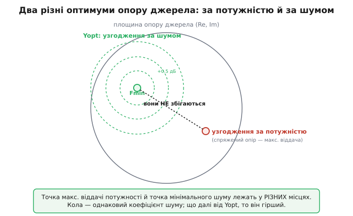
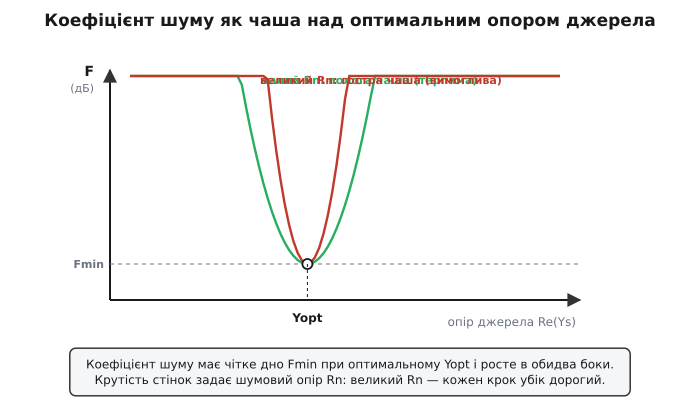
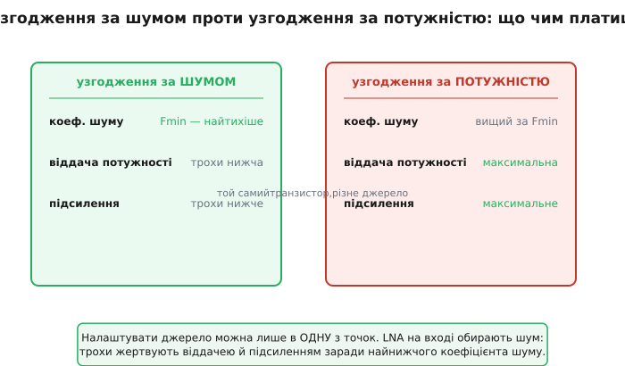
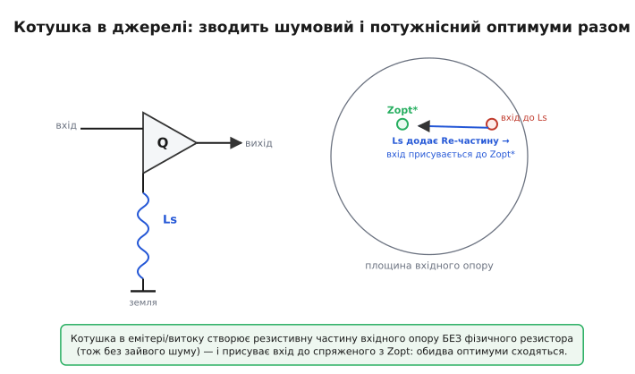

# Узгодження за шумом у LNA: чому найтихіше джерело — не те, що віддає найбільше потужності

Уявімо, що ви зібрали малошумний підсилювач (англ. *low-noise amplifier*, скорочено LNA) — перший каскад радіоприймача, той, що бачить кволий сигнал з антени ще до будь-якого підсилення. Вибрали добрий транзистор, у даташиті чорним по білому: мінімальний коефіцієнт шуму 0.6 дБ. Далі вмикається звичний інженерний рефлекс: щоб антена віддала підсилювачу всю наявну потужність, входу треба підсунути **спряжений опір** — класичне узгодження, на якому стоїть уся високочастотна техніка. Ви ретельно його робите, вмикаєте прилад — і коефіцієнт шуму виходить 2.1 дБ. Не 0.6. Транзистор справний, монтаж чистий, а півтора децибела шуму взялися нізвідки.

Вони не взялися нізвідки. Ви налаштували вхід на **максимальну віддачу потужності** — а це, як виявляється, зовсім не те саме, що налаштувати його на **мінімальний шум**. Шумлива схема має не один оптимальний опір джерела, а **два різні**, і вони, як правило, не збігаються. Уся слабкосигнальна радіотехніка живе у цьому розриві, а ремесло проєктування LNA — це мистецтво вибрати правильний оптимум або хитро звести обидва докупи.

> 🔧 **Навіщо це.** Перший каскад приймача ставить шумову підлогу всього тракту — після нього SNR можна лише погіршити. Помилитися тут найдорожче: накручене не там узгодження коштує приймачу реальної чутливості, тобто дальності зв'язку, висоти орбіти супутника, глибини, з якої чути GPS. Інженер, що плутає узгодження за потужністю з узгодженням за шумом, віддає ці децибели задарма — і дивується, чому хороший транзистор працює як посередній. Хто розрізняє два оптимуми, той витискає з кристала рівно те, що в ньому закладено.

### Звідки беруться два оптимуми

Щоб зрозуміти розрив, треба чесно подивитися, чим шумить підсилювач. Усередині транзистора живуть власні джерела шуму: теплове борсання носіїв у каналі, дробовий шум на переходах, а на високих частотах ще й наведений шум на затворі. Зручно винести їх назовні — звести весь внутрішній галас до **двох еквівалентних джерел на вході**: однієї шумової напруги послідовно з входом і одного шумового струму паралельно йому. Тоді сам підсилювач можна вважати ідеально тихим, а весь його шум сидить у цій парі на вході.

Тепер ключове спостереження. Ці два джерела бачать опір вашого джерела сигналу по-різному. Шумова **напруга** діє так, ніби вона послідовна з джерелом: чим **більший** опір джерела, тим менше вона важить проти корисного сигналу. Шумовий **струм** натомість тече в опір джерела й створює на ньому паразитну напругу: чим **менший** опір, тим менше шкоди. Один тягне опір угору, другий — униз. Між ними є золота середина — опір, за якого сумарний внесок цих двох джерел найменший. До того ж вони частково **скорельовані** (народилися з тих самих фізичних процесів у кристалі), тож за правильного опору й фази джерела їхні шуми частково гасять одне одного. Цей особливий опір джерела і є **оптимальний за шумом** — той, що дає мінімальний коефіцієнт шуму.

А тепер придивіться: у цьому міркуванні **жодного слова про корисний сигнал і його передачу**. Шумовий оптимум визначають внутрішні джерела шуму транзистора — їхня величина, співвідношення й кореляція. Опір же для максимальної віддачі потужності визначає геть інша річ: вхідний опір самого підсилювача, до якого треба підібрати спряжений. Дві різні фізичні задачі, дві різні відповіді. Те, що вони інколи опиняються поруч, — щаслива випадковість конкретного транзистора, а не закон.

> Чому максимум потужності віддається саме за спряженого опору навантаження, і чому при цьому половина потужності неминуче гріє внутрішній опір джерела — у статті [узгодження потужності](book:electronics/power-matching). Тут ми беремо цей результат як готовий «другий оптимум», з яким сперечається шумовий.


*Точка максимальної віддачі потужності (спряжений опір) і точка мінімального шуму лежать у різних місцях площини опору джерела. Кола навколо шумового оптимуму — лінії сталого коефіцієнта шуму: що далі від Yopt, то він гірший.*

### Чотири числа, що описують шум підсилювача

Щоб із цією картиною працювати числами, шум двопорту описують **чотирма дійсними параметрами** — рівно стільки, скільки треба, щоб задати «чашу» коефіцієнта шуму над площиною опору джерела. Цей опис увели німецькі інженери [Ганс Роте й Вольфґанг Дальке 1956 року](book:electronics/noise-matching/hist-noise-parameters.md), і відтоді він — стандартна мова шумової техніки; саме ці чотири числа стоять у даташиті будь-якого LNA для кожної частоти.

Ось вони:

- **Fmin** — мінімально можливий коефіцієнт шуму цього підсилювача. Дно чаші. Менше за нього не вичавиш жодним узгодженням; це межа, закладена самим транзистором і режимом.
- **Yopt = Gopt + j·Bopt** — оптимальна **провідність джерела** (адмітанс), за якої коефіцієнт шуму сягає Fmin. Та сама золота середина двох внутрішніх джерел; провідністю, а не опором, її записувати зручніше, бо формула виходить простіша.
- **Rn** — **шумовий опір** (англ. *noise resistance*). Він каже, **наскільки круто** росте шум, коли джерело відходить від Yopt. Великий Rn — гостра, вимоглива чаша: ступив убік на крок, і шум підскочив. Малий Rn — полога чаша, узгодження некритичне.

Чому провідність, а не опір? Бо так апарат теорії кіл лягає рівно: коли елементи паралельні, додаються їхні провідності, і шумовий струм природно ділиться на повну провідність вузла. Сам перехід від опору Z до провідності Y = 1/Z — окрема дрібна, але потрібна тут операція; нею описують паралельні кола так само, як опором — послідовні. Докладніше про неї — у темі [адмітанс](book:electronics/admittance).

Ці чотири числа стягуються в одну формулу — серце всієї шумової техніки. Коефіцієнт шуму як функція провідності джерела Ys:

```
F(Ys) = Fmin + (Rn / Gs) · |Ys − Yopt|²
```

де Gs = Re(Ys) — дійсна частина провідності джерела. Прочитаймо її, як читають хорошу формулу — не як набір літер, а як готову думку. Доданок Fmin — дно: коли джерело сидить точно в Yopt, другий доданок зникає (бо |Ys − Yopt|² = 0), і F = Fmin. Щойно джерело відходить — з'являється штраф, пропорційний **квадрату** відстані |Ys − Yopt| на комплексній площині. Квадрат — тому й «чаша»: біля дна вона полога (мала відстань у квадраті — зовсім мало), а далі круто йде вгору. А множник Rn/Gs каже, **наскільки** дорого коштує кожна одиниця цієї відстані: великий шумовий опір Rn робить стінки чаші крутими.

> Звідки ця формула береться від першопричини — як два внутрішні джерела шуму (напруги й струму) з їхньою кореляцією зводяться до Fmin, Rn і Yopt, і чому штраф виходить саме квадратичним — виведено у [математиці чотирьох шумових параметрів](book:electronics/noise-matching/math-noise-parameters.md). Тут ми користуємося формулою як готовим інструментом.


*Коефіцієнт шуму має чітке дно Fmin при оптимальній провідності Yopt і росте в обидва боки квадратично. Крутість стінок задає шумовий опір Rn: за великого Rn кожен крок убік від оптимуму дорогий, за малого — узгодження не критичне.*

### Скільки коштує промах повз оптимум

Формула одразу дає інженерові те, чого голе «два оптимуми різні» не дає, — **ціну в децибелах**. Подивімося на типову ситуацію: транзистор хочемо найтихіший, але джерело трохи не там, де Yopt.

**Штраф за неоптимальне джерело.** LNA на 1 ГГц має Fmin = 0.6 дБ, шумовий опір Rn = 30 Ом, оптимальну провідність Yopt = (8 − j·6) мСм (тобто Gopt = 8 мСм, Bopt = −6 мСм). Антена через узгоджувач дає на вхід провідність Ys = (12 − j·2) мСм. На скільки погіршиться коефіцієнт шуму проти Fmin?

:::tabs
```cpp
#include <cmath>
#include <complex>

using cplx = std::complex<float>;

// Коефіцієнт шуму за провідністю джерела (формула Роте — Дальке).
// Fmin задано в РАЗАХ (не дБ); провідності — у сименсах.
float noise_factor(float Fmin, float Rn, cplx Yopt, cplx Ys) {
    float Gs = Ys.real();                   // дійсна частина провідності джерела
    cplx d = Ys - Yopt;                     // відхід від оптимуму
    float dist2 = std::norm(d);             // |Ys − Yopt|²
    return Fmin + (Rn / Gs) * dist2;
}

// 0.6 дБ у разах:  10^(0.6/10) = 1.148
float Fmin = 1.148f;
float Rn   = 30.0f;
cplx Yopt{ 8e-3f, -6e-3f};                  // (8 − j6) мСм
cplx Ys  {12e-3f, -2e-3f};                  // (12 − j2) мСм

float F  = noise_factor(Fmin, Rn, Yopt, Ys);  // ≈ 1.228 (разів)
float dB = 10.0f * std::log10(F);              // ≈ 0.89 дБ
```
```python
import cmath, math

# Коефіцієнт шуму за провідністю джерела (формула Роте — Дальке).
# Fmin задано в РАЗАХ (не дБ); провідності — у сименсах.
def noise_factor(Fmin, Rn, Yopt, Ys):
    Gs = Ys.real                        # дійсна частина провідності джерела
    d = Ys - Yopt                       # відхід від оптимуму
    dist2 = abs(d)**2                   # |Ys − Yopt|²
    return Fmin + (Rn / Gs) * dist2

# 0.6 дБ у разах:  10^(0.6/10) = 1.148
Fmin = 1.148
Rn   = 30.0
Yopt = 8e-3  - 6e-3j                    # (8 − j6) мСм
Ys   = 12e-3 - 2e-3j                    # (12 − j2) мСм

F  = noise_factor(Fmin, Rn, Yopt, Ys)  # ≈ 1.228 (разів)
dB = 10.0 * math.log10(F)              # ≈ 0.89 дБ
```
:::

Порахуймо руками, щоб побачити, де народжується штраф:

```
відхід:    Ys − Yopt = (12−8) + j(−2−(−6)) = (4 + j4) мСм
|відхід|²: 4² + 4² = 32  (мСм)² = 32×10⁻⁶ См²
штраф:     (Rn/Gs)·|відхід|² = (30 / 12×10⁻³) · 32×10⁻⁶
           = 2500 · 32×10⁻⁶ = 0.080
F = Fmin + штраф = 1.148 + 0.080 = 1.228   ... у разах
F[дБ] = 10·log₁₀(1.228) ≈ 0.89 дБ
```

Результат говорить сам за себе: джерело промахнулося повз Yopt усього на кілька мілісименсів — і замість обіцяних 0.6 дБ маємо близько 0.9 дБ. Третина децибела з'їдена тим, що антену не довели до шумового оптимуму. А якби ми, ганяючись за віддачею потужності, відсунулися ще далі — штраф зростав би квадратично, і ті 2.1 дБ із зачину перестали б дивувати.

### Розвилка: на вході приймача вибирають шум, а не потужність

Отже, маємо два бажані опори джерела й одне джерело. Налаштувати його можна лише в **одну** точку. Куди?

Відповідь залежить від того, де в тракті стоїть каскад. На **вході приймача**, де сигнал кволий і ще нічим не підсилений, вирішує шум — і тільки шум. Тут жертвують усім заради найнижчого коефіцієнта шуму: налаштовують джерело в Yopt, навіть якщо віддача потужності й підсилення трохи просядуть. Логіка та сама, що й золоте правило входу взагалі: перший каскад ставить шумову підлогу всього приймача, тож кожен його зайвий децибель шуму потім нічим не вибереш. Трохи втраченого підсилення легко надолужити наступним каскадом, де шум уже не критичний, — а втрачену чутливість не надолужить ніщо.

Глибше в тракті пріоритети міняються. Каскад потужного підсилювача передавача, навпаки, узгоджують за **потужністю** (а часто й за іншими критеріями — лінійністю, віддачею) — там шум кількох децибел нікого не турбує, бо сигнал уже могутній. Тому «яке узгодження правильне» не має універсальної відповіді: на вході приймача — за шумом, у силовому тракті — за потужністю. Сплутати ці два світи — і означає взятися робити LNA за рефлексом силовика.


*Один і той самий транзистор, два можливі узгодження джерела. За шумом — найнижчий коефіцієнт шуму ціною трохи меншої віддачі й підсилення; за потужністю — максимальна віддача, але шумніше. На вході приймача обирають перше.*

> 🔧 **Навіщо це.** Це і є головне практичне рішення в проєктуванні LNA: ти свідомо **не** робиш звичне спряжене узгодження на вході, а ведеш джерело до Yopt із даташита. На практиці це означає інший вхідний узгоджувач — не той, що дав би максимальну передачу. Інженер, який цього не знає, ставить «правильне» за підручником узгодження й псує найдорожчий каскад приймача; той, хто знає, дивиться в рядок Yopt і будує вхід під нього.

### Як примирити два оптимуми: котушка, що додає опір без шуму

Жертвувати віддачею прикро. Чи не можна влаштувати так, щоб шумовий і потужнісний оптимуми **збіглися** — і одне узгодження вдовольнило обидва? Можна, і це один з найгарніших прийомів високочастотної схемотехніки.

Проблема в розриві між двома точками. Якби вхідний опір підсилювача сам собою сидів так, що спряжений до нього збігається з Zopt (опором, відповідним Yopt), розриву б не було. Та зазвичай не сидить: у польового транзистора вхід — майже чиста ємність, його опір майже без дійсної (резистивної) частини, а шумовий оптимум Zopt дійсну частину має. Перша думка — додати на вхід резистор, щоб дорівняти дійсні частини. Думка згубна: будь-який резистор сам **тепловий шум** — крихітну випадкову напругу на виводах від борсання електронів — додає, і ним ми б отруїли той самий вхід, тишу якого бережемо.

> Чому кожен резистор у схемі — водночас і джерело шумової ЕРС √(4kTRB), і чому це шкодить саме на вході, де сигнал кволий, — у статті [тепловий шум](book:electronics/resistor-noise). Тут важливо одне: резистивну частину вхідного опору треба отримати **без** фізичного резистора.

Хитрість — поставити **котушку в емітер** (для біполярного) чи **виток** (для польового), послідовно з виводом землі. Маленька індуктивність Ls разом із внутрішньою прохідною ємністю транзистора створює на вході **дійсну, резистивну складову опору — але без жодного фізичного резистора**. А реактивний (індуктивний) елемент сам теплового шуму не породжує: котушка не гріється струмом шуму так, як резистор. Виходить чарівна на перший погляд річ: вхід набуває потрібного резистивного опору задарма, у сенсі шуму. Підібравши Ls (і другу котушку послідовно з затвором — для реактивної частини), вхідний опір присувають туди, де спряжений до нього лягає на Zopt. Тепер **одне** узгодження вдовольняє обидва оптимуми — і шумовий, і потужнісний. Цей прийом називають одночасним узгодженням за шумом і опором (англ. *simultaneous noise and input matching*, SNIM), а його основу — індуктивна виродженість витоку (англ. *inductive source degeneration*).


*Котушка Ls в емітері (або витоку) створює резистивну частину вхідного опору без фізичного резистора, тож без зайвого шуму. Вона присуває вхідний опір до спряженого з Zopt — і шумовий та потужнісний оптимуми збігаються в одній точці.*

Платня все ж є — не в шумі, а в підсиленні: виродженість трохи його з'їдає, тож на дуже малих струмах усе одно доводиться шукати компроміс. Тонкощі (як саме Ls породжує дійсну частину, як вибрати обидві котушки, де межі прийому) — це вже глибший шар; для базового розуміння досить ідеї: **реактивний елемент дає на вході потрібний резистивний опір без шумового штрафу, і цим зводить два оптимуми в один.**

### Те саме одним числом: коефіцієнт шуму

Усе сказане — про те, **наскільки** підсилювач псує співвідношення сигнал/шум залежно від джерела. Це псування зручно міряти одним числом — **коефіцієнтом шуму** F: на скільки разів SNR на виході гірший за SNR на вході. Ідеальний тихий елемент має F = 1 (0 дБ) — нічого не псує; реальний LNA у найкращій своїй точці має F = Fmin. Уся наша чаша F(Ys) — це і є коефіцієнт шуму як функція джерела; «узгодити за шумом» означає посадити джерело туди, де ця функція мінімальна.

> Що таке коефіцієнт шуму строго, як він рахується для каскадів (формула Фрііса, де шум кожної ланки ділиться на підсилення попередніх — тому перший каскад і вирішує все), і чим F відрізняється від просто власного шуму — у статті [коефіцієнт шуму](book:electronics/noise-figure). Там видно, чому битва за Fmin саме на вході приймача важить більше за все інше в тракті.

І ще одна ниточка назад до основ. Усе це має сенс лише тому, що корисний сигнал на вході сидить **поряд із шумом джерела** — і їхнє відношення, [сигнал/шум](book:electronics/signal-noise-ratio), вирішується в найпершому елементі, а далі лише гіршає. Узгодження за шумом — це і є боротьба за те, щоб перший елемент додав до цього відношення якнайменше: не накрутити підсилення (воно SNR не покращує), а посадити джерело в ту єдину точку, де власний шум підсилювача найтихіший.

### Що варто винести

Шумлива схема має **два різні оптимальні опори джерела**: один — для максимальної віддачі потужності (спряжений опір), другий — для мінімального шуму (Yopt). Вони визначаються різною фізикою — потужнісний вхідним опором підсилювача, шумовий внутрішніми джерелами шуму транзистора — і, як правило, не збігаються. Шум двопорту описують чотирма числами: Fmin (дно — мінімальний коефіцієнт шуму), Yopt (де воно досягається) і Rn (наскільки круто шум росте при відході), стягнутими у формулу F(Ys) = Fmin + (Rn/Gs)·|Ys − Yopt|² — «чашу» з квадратичними стінками. На вході приймача вибирають **шум, а не потужність**: налаштовують джерело в Yopt, бо перший каскад ставить шумову підлогу всього тракту й кожен його зайвий децибель потім невибірний. Примирити обидва оптимуми дає котушка в емітері чи витоку: вона створює резистивну частину вхідного опору **без фізичного резистора**, тож без зайвого шуму, і присуває вхід до спряженого з Zopt — одне узгодження вдовольняє обидва. Хто бачить ці два оптимуми окремо, той не плутає LNA із силовим каскадом і не віддає чутливість приймача задарма.

---
