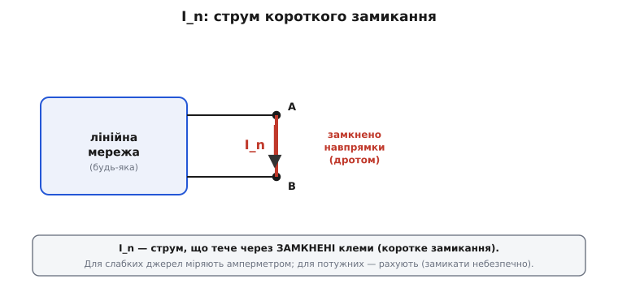
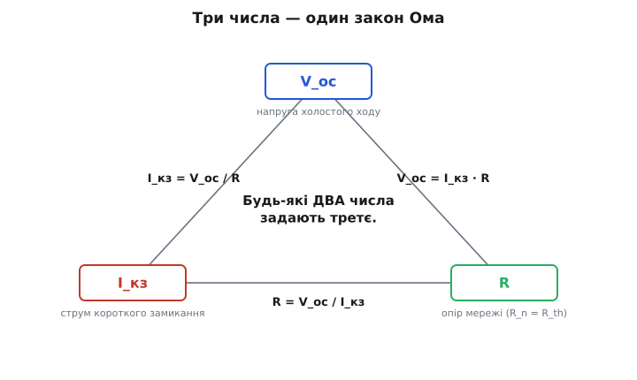
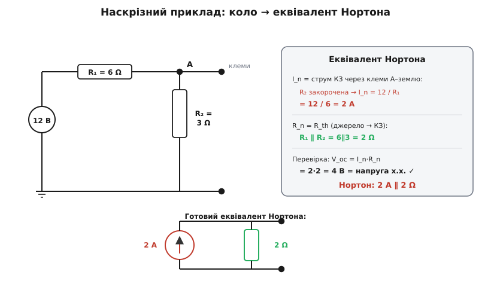

# Як знайти I_n, R_n

[Теорема Нортона](topic:electronics/norton) обіцяє багато: будь-який лінійний двополюсник — хоч ціла плата живлення, хоч давач із обвʼязкою — ззовні поводиться як одне **джерело струму** I_n з одним опором R_n паралельно йому. Обіцянка гарна, та лишається приземлене питання: маючи перед собою конкретне коло (чи чорну скриньку на столі), **як саме** добути ці два числа? Тут і починається практика.

Назва двох чисел проста. **I_n** (струм Нортона) — той струм, що джерело віддало б у коротке замикання. **R_n** (опір Нортона) — внутрішній опір тієї самої мережі. Знайти кожне можна кількома шляхами, і вибір шляху — це не формальність: для кола на папері зручний один спосіб, для запаяного блока на лабораторному столі — зовсім інший, безпечніший. Розберімо обидва числа окремо.

### I_n — це струм короткого замикання

З I_n усе однозначно, як було однозначно з напругою холостого ходу у [Тевеніна](topic:electronics/thevenin). **I_n завжди дорівнює струмові, що тече через замкнені клеми.** Беремо клеми мережі, зʼєднуємо їх навпрямки — дротом, перемичкою, амперметром, — і той струм, що крізь них піде, і є струм Нортона.


*I_n знаходять у режимі короткого замикання: клеми A і B зʼєднують навпрямки, і весь струм, що мережа віддає в нульовий опір, — це і є I_n. Для слабких джерел його міряють амперметром (він майже коротке замикання); для потужних — рахують, бо реально замикати небезпечно.*

Чому саме короткого замикання? Подивімося на сам еквівалент Нортона зсередини. Це джерело струму I_n, до якого паралельно підвішено опір R_n. Замкнімо його клеми дротом. Дріт — це нульовий опір; поряд із ним паралельний R_n має скінченний, тобто **набагато більший** опір. Струм завжди тече туди, де легше, тож практично весь I_n піде крізь дріт, а в R_n — майже нічого. Отже, у короткому замиканні через клеми тече рівно I_n. А раз еквівалент і реальна мережа ззовні **нерозрізнимі**, то й реальна мережа в короткому замиканні віддасть той самий струм. Звідси правило: замкни клеми — побачиш I_n.

> 🔧 **Навіщо це.** Багато реальних джерел *самі* живуть у режимі, близькому до струмового, і їхній паспорт уже подає Нортонове число. Запобіжник характеризують струмом спрацювання; драйвер світлодіода — вихідним струмом; струмова петля 4–20 мА передає сигнал саме струмом. Коли пристрій думає струмом, його I_n (струм короткого замикання, у документації часто `I_SC`) — це перше число, яке хочеться знати: воно каже, скільки джерело віддасть у найважчому навантаженні й чого очікувати в аварії.

Тепер засторога, без якої не можна. «Замкнути клеми» — здебільшого операція **розрахункова**, а не лабораторна. Якщо джерело потужне (мережевий блок, заряджений акумулятор), коротке замикання пускає величезний струм, обмежений лише крихітним [внутрішнім опором](topic:electronics/internal-resistance) — звідси іскри, перегрів, зварений дріт, а то й вибух. Тому для сильних кіл I_n **рахують** на папері, а замикають хіба що в думках. Для слабких джерел інша річ: там амперметр і є майже коротким замиканням (його опір дуже малий), тож I_n спокійно вимірюють просто увімкнувши амперметр між клемами. Фотодіод, термопара, слабкий давач — їхній струм короткого замикання знімають приладом без жодної небезпеки.

Як саме порахувати I_n у колі на папері? Замикаємо клеми дротом і знаходимо струм крізь цей дріт звичайними методами [аналізу кіл](topic:electronics/kcl) — законами Кірхгофа, згортанням, [поділом струму](topic:electronics/current-divider). Часто це навіть простіше, ніж шукати напругу холостого ходу: замкнувши клеми, ми нерідко закорочуємо й частину кола, і вона випадає з розрахунку.

### R_n — це той самий опір, що й R_th

Друге число дарує приємну несподіванку: **опір Нортона дорівнює опору Тевеніна.** R_n = R_th — те саме число, той самий внутрішній опір тієї самої мережі. Це не випадковість: Тевенін і Нортон описують одну скриньку у двох формах, і «внутрішній опір» у скриньки один незалежно від того, яку етикетку ми наклеїли. Тому всі прийоми пошуку опору, що працювали для Тевеніна, без жодної зміни працюють і для Нортона. Нагадаю ці три способи коротко, бо володіти треба всіма — кожен зручний у своїй ситуації.

**Спосіб «вимкнути й згорнути»** — найшвидший для звичайних кіл. За [суперпозицією](topic:electronics/superposition) вимикаємо всі **незалежні** джерела (джерело напруги стає коротким замиканням, джерело струму — розривом) і дивимося з клем на те, що лишилося. А лишаються самі опори — згортаємо їх [послідовно](topic:electronics/series-connection) й [паралельно](topic:electronics/parallel-connection) до одного числа. Це робочий кінь, коли джерела звичайні (батареї, блоки живлення).

**Спосіб «холостий хід ÷ коротке»** — універсальний. Знаходимо обидва граничні режими: напругу холостого ходу V_oc (клеми розімкнені) і струм короткого замикання I_кз (клеми замкнені), — і ділимо.

```
R_n = V_oc / I_кз
```

Він діє майже завжди, навіть із залежними джерелами, аби лиш I_кз ≠ 0. Зверніть увагу на приємний бонус: I_кз нам **усе одно потрібен**, бо це і є I_n. Тобто, шукаючи Нортона цим способом, ми за одну роботу дістаємо **обидва** числа — і I_n, і (поділивши на нього V_oc) опір R_n. Нічого зайвого.

**Спосіб «пробне джерело»** — для кіл із залежними джерелами, які не можна просто «вимкнути» (їх дають [транзистори](topic:electronics/transistor-idea) та [операційні підсилювачі](topic:electronics/ideal-opamp), де керований [залежний](topic:electronics/dependent-sources) елемент живе власним життям). Власні незалежні джерела зануляють, до клем прикладають пробне джерело — скажімо, напругу V_проб — і міряють струм I_проб, який воно жене. Відношення дає опір:

```
R_n = V_проб / I_проб
```

Це той самий закон Ома, лиш застосований до всієї мережі з клем. Марудніше, зате працює там, де перші два безсилі.

### Три числа — один закон Ома

Тут варто зупинитися й побачити суть, бо вона звільняє від механічного зубріння. Біля будь-якого лінійного двополюсника крутяться **три** числа: напруга холостого ходу V_oc, струм короткого замикання I_кз і внутрішній опір R. І вони не незалежні — їх повʼязує один-єдиний закон Ома.


*Три числа двополюсника — V_oc, I_кз і R — звʼязані законом Ома по колу: знаючи будь-які два, третє дістаєш без вимірювання. Тевенін бере пару (V_oc, R), Нортон — (I_кз, R), а перетворення джерел переходить між ними.*

```
V_oc = I_кз · R       (напруга = струм · опір)
I_кз = V_oc / R
R    = V_oc / I_кз
```

Це той самий звʼязок, що в [перетворенні джерел](topic:electronics/norton): V_th = I_n·R. Дивіться, як зручно: **знаючи будь-які два числа, третє дістаєш без зайвого вимірювання.** Тевенін — це пара (V_oc, R). Нортон — пара (I_кз, R). Спільне в них — той самий R, а напруга й струм переходять одне в одне через нього. Тому добути еквівалент Нортона можна **трьома** маршрутами, і всі рівноправні:

- **прямо** — порахувати I_n (струм КЗ) і R_n (= R_th, будь-яким із трьох способів вище);
- **через Тевеніна** — якщо вже маєш V_th і R_th, просто переведи: I_n = V_th/R_th, R_n = R_th;
- **з двох граничних режимів** — зміряти V_oc й I_кз, тоді I_n = I_кз напряму, а R_n = V_oc/I_кз.

Жодного з маршрутів не треба боятися чи запамʼятовувати окремо — це одна трикутна картинка з законом Ома по сторонах. Який бік тобі дано, з того й заходиш.

> 🔧 **Навіщо це.** Ця трикутна звʼязка — щоденний інструмент, а не теорія. На столі ти рідко маєш «готовий еквівалент»; ти маєш **те, що зміг безпечно зміряти**. Слабкого давача — зняв V_oc вольтметром і I_кз амперметром, поділив — маєш повний Нортонів опис. Потужного блока живлення коротити не можна, тож береш V_oc й одну робочу точку під навантаженням — і дістаєш R, а з ним і все інше. Уся хитрість у тому, щоб зрозуміти, **які два числа** в цій ситуації дістаються безпечно й точно, а третє долічити.

### Наскрізний приклад

Зведімо все в один розрахунок — від кола до готового еквівалента Нортона.


*Наскрізний приклад: I_n беремо як струм короткого замикання (R₂ закорочена, тож I_n = 12/R₁ = 2 А); R_n — як R_th, вимкнувши джерело (R₁∥R₂ = 2 Ω). Перевірка V_oc = I_n·R_n = 4 В сходиться з напругою холостого ходу. Еквівалент: 2 А паралельно з 2 Ω.*

**Приклад. Джерело 12 В через R₁ = 6 Ω приходить у вузол A; від A до землі ввімкнено R₂ = 3 Ω. Клеми — на A й землі. Знайти еквівалент Нортона.**

```
I_n — струм короткого замикання. Замикаємо клеми (A на землю) дротом.
      Тоді R₂ закорочена (паралельна нульовому опору) і випадає,
      а весь струм іде від джерела через R₁ у перемичку:
      I_n = 12 / R₁ = 12 / 6                       = 2 А
R_n — той самий R_th. Спосіб «вимкнути й згорнути»: джерело 12 В → КЗ,
      і R₁ з R₂ опиняються паралельними:
      R_n = R₁ ∥ R₂ = (6·3)/(6+3) = 18/9            = 2 Ω
Перевірка через холостий хід:
      V_oc (дільник, без навантаження) = 12·R₂/(R₁+R₂) = 12·3/9 = 4 В
      I_n·R_n = 2 А · 2 Ω = 4 В = V_oc              ✓
Еквівалент Нортона:  I_n = 2 А,  R_n = 2 Ω
```

Зверніть увагу, як замикання клем **спростило** пошук струму: R₂ закоротилася й узагалі випала з гри, лишивши елементарне 12/R₁. Це типово для Нортона — короткому замиканню часто «зручніше» рахуватися, ніж холостому ходу. А перевірка через напругу холостого ходу зійшлася: I_n·R_n дало рівно ті 4 В, що ми незалежно отримали дільником. Дві дороги — один результат, як і має бути для одного кола.

Тепер коло описане парою **2 А / 2 Ω**, і будь-яке навантаження рахується миттю. Підвісимо, скажімо, R_н = 2 Ω до Нортонового джерела: струм 2 А ділиться між двома рівними опорами (R_n і R_н) порівну, тож у навантаження піде 1 А. Перевірте по-Тевенінівськи (4 В на 2+2 Ω → 1 А) — те саме число. У цьому й уся вигода еквівалента: раз звів вузол до двох чисел — далі граєшся з навантаженнями скільки завгодно, кожне коштує один рядок.

Той самий розрахунок легко перекласти на прошивку: якщо мікроконтролер уміє зняти кілька точок (струм, напруга) з невідомого джерела, він обчислить I_n і R_n самотужки й навіть стежитиме за «здоровʼям» батареї в часі — [Нортонів еквівалент на мікроконтролері](topic:electronics/norton-equivalent/proj-norton-from-measurements.md): два навантаження дають пряму V = V_oc − I·R, з якої програма дістає обидва Нортонові числа без жодного небезпечного короткого замикання.

> 🔧 **Навіщо це.** Тримай у голові, який маршрут коли брати. Якщо джерело за природою **струмове** (фотодіод, давач, транзисторний каскад, драйвер) — заходь **прямо**: I_n береш як струм короткого замикання (часто його дає вже паспорт), R_n — згортанням чи з пробного джерела. Якщо ти вже зробив [Тевеніна](topic:electronics/thevenin-equivalent) — не повторюй роботу, **переведи** одним діленням. Якщо перед тобою чорна скринька на столі — зніми **два безпечні числа** (V_oc й або I_кз для слабкого, або робочу точку для потужного) і долічи решту. Маючи ці три заходи, ти дістанеш еквівалент Нортона для будь-якого реального вузла — і далі вся схема навколо нього рахується тривіально.

---

Підсумок: щоб знайти еквівалент Нортона, треба два числа. **I_n** — це завжди струм короткого замикання (через замкнені клеми); для слабких джерел його міряють амперметром, для потужних рахують. **R_n** дорівнює R_th і знаходиться тими ж трьома способами: вимкнути джерела й згорнути (найшвидше), V_oc/I_кз (універсально, заразом дає й I_n), пробне джерело (для залежних джерел). Усі три числа двополюсника — V_oc, I_кз, R — звʼязані одним законом Ома (V_oc = I_кз·R), тож знаючи будь-які два, третє дістаєш без вимірювання; заходити до Нортона можна прямо, через готового Тевеніна або з двох граничних режимів. У наскрізному прикладі коло 12 В / 6 Ω / 3 Ω звелося до еквівалента 2 А ∥ 2 Ω, і перевірка через холостий хід зійшлася.

---
