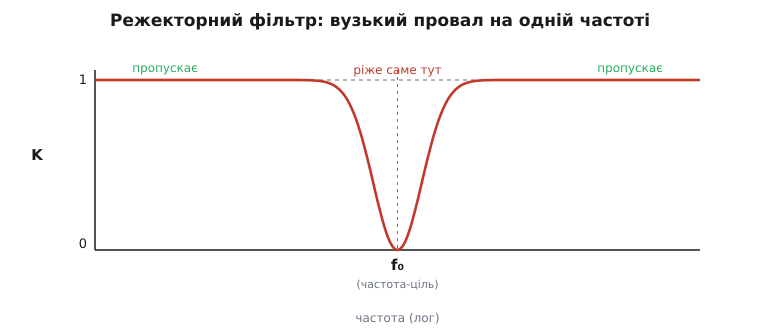
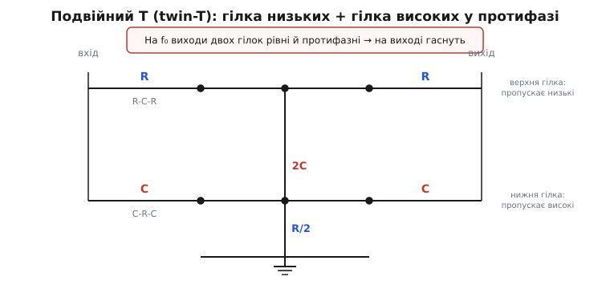
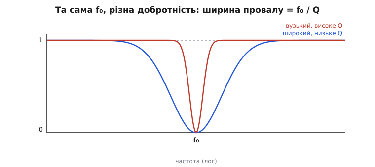

# Режекторний фільтр (notch)

Уявіть запис голосу, у який крізь усі дроти проліз настирливий гул мережі — рівне 50-герцове гудіння від розетки, що псує кожну паузу. Хочеться прибрати **саме його** — ту одну частоту, — не зачепивши ні голосу під нею, ні приголосних над нею. Звичайний фільтр так не вміє: фільтр нижніх частот зріже все, що вище порога (заразом і половину звуку), фільтр верхніх — усе, що нижче. Потрібен інструмент іншого крою: пропустити **весь** діапазон, окрім вузької смужки навколо однієї частоти, де зробити глибокий провал. Це і є **режекторний фільтр** (від лат. *rejectus* — відкинутий; англ. *notch filter* — фільтр-«зарубка»).

Назва-«зарубка» влучна: його частотна характеристика рівна майже скрізь, а на частоті-цілі має різкий виріз униз — наче хтось зробив зарубку сокирою рівно в одному місці. Усе, що по боках, проходить, як було; усе, що потрапило в зарубку, гасне. Розберімо, **чому** так узагалі можна, як це збирають із трьох резисторів і трьох конденсаторів і де ховається підступ.


*Що робить режекторний фільтр: пропускає весь діапазон, а на одній частоті f₀ має глибокий вузький провал. Ліворуч і праворуч від f₀ сигнал проходить майже без втрат — ріже лише вузьку смужку довкола цілі. Це дзеркальна протилежність смугового фільтра, який, навпаки, лишає тільки смужку навколо f₀.*

## Навіщо вирізати одну частоту

Здавалося б, дрібниця — одна частота. Але в реальному світі завад рівно такої форми повно, і кожна сидить **точно** на відомому місці. Мережеве живлення гуде на 50 герцах (у Європі) чи 60 (у США) і лізе наведенням у будь-який чутливий підсилювач — у звукову апаратуру, у [кардіограф](topic:electronics/transimpedance-amplifier), у вимірювальний тракт. Радіоприймач ловить сусідню потужну станцію, яка глушить слабку. Механічний привід має паразитний резонанс на конкретній частоті обертання, від якого треба позбутися в петлі керування. У всіх цих випадках завада **вузька й передбачувана** за частотою — і марно різати широку смугу, коли вистачить однієї зарубки.

> 🔧 **Навіщо це.** Найчастіша робота режекторного фільтра — викинути мережевий гул із вимірювального сигналу. Корисний сигнал кардіографа чи давача лежить і нижче, і вище за 50 Гц, тож ні ФНЧ, ні ФВЧ його не врятують — вони відріжуть половину корисного разом із завадою. Режектор вирізає **лише** смужку довкола 50 Гц, а решту спектра лишає недоторканою. Тому в приладобудуванні «notch на 50/60 Гц» — майже стандартна цеглинка вхідного тракту.

Суть задачі: треба характеристика, яка майже скрізь дорівнює одиниці (пропускає), а в одній точці падає до нуля (ріже). Як таку зробити з простих елементів — резисторів і конденсаторів, у яких самих по собі жодного «провалу» немає?

## Інтуїція: відняти сигнал сам від себе

Ключ — у відніманні. Якщо взяти сигнал і **відняти його від себе самого**, вийде нуль. Дрібниця, доки ми не зробимо так, щоб віднімання було точним **лише на одній частоті**, а на решті — ні. Тоді на тій частоті сигнал сам себе вб'є, а скрізь інде вціліє. Ось і весь принцип режектора: дві копії сигналу, які на частоті-цілі однакові за розміром і протилежні за знаком, а на інших частотах — ні.

Звідки взяти «протилежний за знаком»? Зі зсуву фази. Конденсатор і резистор разом **зсувають фазу** сигналу [залежно від частоти](topic:electronics/phase-shift): на одних частотах вихід трохи запізнюється за входом, на інших — випереджає. Якщо побудувати два різні шляхи від входу до виходу — один зі своїм зсувом, другий зі своїм — то знайдеться частота, де їхні зсуви розійшлися рівно на півхвилі (180°). На тій частоті два шляхи дають **протифазу**: один тягне вихід угору саме тоді, коли другий тягне вниз. Зробимо ще так, щоб на цій частоті їхні розміри (амплітуди) збіглися, — і вони повністю погасять один одного. Вихід — нуль. А на всіх інших частотах зсуви не рівно протилежні, амплітуди різні, повного гасіння немає — сигнал проходить.

Лишається зібрати схему з двох таких шляхів. Найкласичніша — **подвійне T**.

## Подвійне T (twin-T): дві гілки в протифазі

Назва походить від форми: на схемі два однакові з вигляду відтинки, кожен — літера T (горизонтальна перекладина з ніжкою-шунтом униз, у землю). Дві такі T-перекладини під'єднані паралельно між тим самим входом і тим самим виходом, тільки зроблені з різних елементів.

Верхня гілка — **R—C—R**: два резистори вздовж сигналу, а конденсатор шунтом у землю. Це по суті [фільтр нижніх частот](topic:electronics/rc-low-pass): низькі частоти він пропускає легко (конденсатор для них — майже розрив, струм іде вздовж резисторів на вихід), а високі зливає в землю крізь конденсатор. Низькі проходять, високі гаснуть.

Нижня гілка — **C—R—C**: дзеркально, два конденсатори вздовж сигналу, а резистор шунтом у землю. Це [фільтр верхніх частот](topic:electronics/rc-high-pass): високі частоти конденсатори пропускають легко, а низькі впираються в них (для низьких конденсатор — майже розрив) і стікають у землю крізь шунтовий резистор. Високі проходять, низькі гаснуть.


*Подвійне T. Верхня гілка R-C-R — це ФНЧ: пропускає низькі, гасить високі. Нижня гілка C-R-C — це ФВЧ: пропускає високі, гасить низькі. На частоті f₀ обидві віддають сигнал однакового розміру, але з протилежним знаком (бо ФНЧ і ФВЧ зсувають фазу в різні боки), тож на спільному виході вони складаються в нуль. Шунти обох гілок сходяться на землі. Значення підібрані: бічні резистори R і R, шунт R/2; бічні конденсатори C і C, шунт 2C.*

Тепер найцікавіше — **що між ними спільного**. Кожна гілка поодинці нічого не «вирізає»: одна просто ріже верх, друга низ. Але на виході вони **складаються**. На дуже низькій частоті працює лише верхня гілка (нижня замкнула все в землю) — сигнал проходить. На дуже високій — лише нижня — теж проходить. А **посередині**, на f₀, обидві гілки віддають потроху, і саме там їхні внески рівні за розміром і **протилежні за знаком**: фільтр нижніх частот на цій частоті вже завертає фазу в один бік, фільтр верхніх — у другий, різниця сягає півхвилі. Дві однакові протифазні копії складаються в нуль. Це і є зарубка.

Щоб гасіння було повним, елементи беруть у строгій пропорції. Якщо бічні резистори дорівнюють R, а бічні конденсатори C, то шунтовий резистор має бути **R/2**, а шунтовий конденсатор — **2C**. За такого підбору обидві гілки виходять симетричними навколо однієї спільної частоти, і провал стає найглибшим саме на ній.

## Де сидить провал: формула й приклад

Частота-ціль задається тими самими R і C, що й у будь-якому RC-ланцюжку — добутком опору на ємність:

```
f₀ = 1 / (2 · π · R · C)
```

Це місце, де [реактивний опір](topic:electronics/capacitive-reactance) конденсатора дорівнює омічному опору резистора, — природна «точка повороту» RC-кола. На ній фазові зсуви двох гілок розходяться рівно на півхвилі, і провал сідає сюди.

**Worked-приклад: режектор на мережевий гул 50 Гц.** Хочемо вирізати 50 герців. Виберемо зручний конденсатор C = 100 нФ і порахуємо потрібний резистор:

```
R = 1 / (2 · π · f₀ · C)
R = 1 / (2 · π · 50 · 100·10⁻⁹)
R = 1 / (3.1416·10⁻⁵)
R ≈ 31830 Ом   →   беремо 31.8 кОм (точний ряд E96)
```

Тоді шунтові елементи: R/2 ≈ 15.9 кОм і 2C = 200 нФ. Перевіримо, що на цих номіналах провал справді на 50 Гц, і заразом матимемо готову функцію проєктування:

:::tabs
```cpp
#include <numbers>

// Розрахунок twin-T режектора під задану частоту-ціль.
// Задаємо ємність бічних конденсаторів C (Ф); повертаємо
// бічний резистор R (Ом). Шунти: R_shunt = R/2, C_shunt = 2*C.
float twint_R_from_f0(float f0_hz, float c_side_f)
{
    return 1.0f / (2.0f * std::numbers::pi_v<float> * f0_hz * c_side_f);
}

// Зворотна перевірка: яка частота провалу вийде на цих R, C.
float twint_f0(float r_side_ohm, float c_side_f)
{
    return 1.0f / (2.0f * std::numbers::pi_v<float> * r_side_ohm * c_side_f);
}
// twint_R_from_f0(50.0f, 100e-9f) -> ~31831 Ом
// twint_f0(31830.0f, 100e-9f)     -> ~50.0 Гц  ✓
```
```python
import math

# Розрахунок twin-T режектора під задану частоту-ціль.
# Задаємо ємність бічних конденсаторів C (Ф); повертаємо
# бічний резистор R (Ом). Шунти: R_shunt = R/2, C_shunt = 2*C.
def twint_R_from_f0(f0_hz, c_side_f):
    return 1.0 / (2.0 * math.pi * f0_hz * c_side_f)

# Зворотна перевірка: яка частота провалу вийде на цих R, C.
def twint_f0(r_side_ohm, c_side_f):
    return 1.0 / (2.0 * math.pi * r_side_ohm * c_side_f)
# twint_R_from_f0(50.0, 100e-9) -> ~31831 Ом
# twint_f0(31830.0, 100e-9)     -> ~50.0 Гц  ✓
```
:::

Беручи R = 31.8 кОм і C = 100 нФ, дістаємо зарубку рівно там, де гуде розетка. Решта спектра — і бас голосу під 50 Гц, і все, що вище, — проходить майже недоторканим.

## Глибина й ширина: добротність і точність деталей

Дві речі визначають, наскільки добра вийшла зарубка: **як глибоко** вона провалюється і **наскільки вузька** смужка довкола f₀ при цьому страждає.

**Ширину** задає добротність Q. Це те саме поняття [гостроти, що й у резонансних колах](topic:electronics/rlc-selectivity): чим вище Q, тим вужча смужка зарубки і тим менше зачіпає сусідні частоти. Ширину провалу на рівні половинної потужності зв'язує з f₀ просте співвідношення:

```
ширина смужки = f₀ / Q
```

Звичайне пасивне подвійне T має Q приблизно 0.25 — провал виходить **широкий** і пологий: вирізаючи 50 Гц, він помітно притлумлює й сусідів — 40 і 60 Гц. Для грубого приглушення гулу годиться, але корисний сигнал поряд із завадою теж просідає.


*Добротність керує шириною зарубки. Низьке Q (синя крива) дає широкий пологий провал — вирізаючи f₀, він зачіпає й сусідні частоти. Високе Q (червона крива) дає вузьку гостру зарубку: ріже майже виключно f₀, лишаючи сусідів цілими. Частота провалу в обох та сама — відрізняється лише ширина, яка дорівнює f₀ / Q.*

**Глибину** провалу визначає, наскільки **точно збіглися** деталі. Повне гасіння на f₀ настає лише тоді, коли амплітуди двох гілок рівні **до останнього відсотка**, а для цього пропорція R/2 і 2C має витримуватися ідеально. Реальні резистори й конденсатори мають розкид (±1%, ±5%), і щойно гілки розбалансувалися, протифазні копії вже не однакові за розміром — повністю не гасяться, на дні провалу лишається залишок. Тому глибока зарубка (скажімо, придушення в тисячу разів) вимагає **дібраних, точних** деталей; із дешевими ±10% конденсаторами дно «спливає», і провал виходить мілким.

> 🔧 **Навіщо це.** Звідси два практичні висновки. Перший: у подвійному T **конденсатори вирішують усе** — їх беруть точними (±1% або краще) і однакового типу, бо саме їхній розкид найдужче зриває баланс гілок і піднімає дно провалу. Другий: пасивне T ріже **широко**, тож якщо треба вирізати рівно 50 Гц, не чіпаючи 45 і 55, самого пасивного T замало — Q доводять активною схемою.

## Активне подвійне T: піднімаємо Q операційним підсилювачем

Низьке Q пасивного T — не вирок. Якщо охопити подвійне T [операційним підсилювачем](topic:electronics/opamp) і повернути частину виходу назад на «землю» T не до справжньої землі, а через повторювач, то ту шунтову точку можна змусити «гойдатися» в такт сигналу. Це підпирає схему [додатним зворотним зв'язком](topic:electronics/negative-feedback) рівно настільки, щоб **звузити** провал, не зрушивши його частоти. Дозою цього підпору задають Q — від тих самих 0.25 до десятків, роблячи зарубку як завгодно гострою.

Платою за гостроту стає чутливість: чим вище Q, тим прискіпливіше схема до точності деталей і стабільності, і тим легше, перебравши зворотного зв'язку, дістати замість фільтра [генератор](topic:electronics/relaxation-oscillator). Тому Q піднімають рівно до потрібного — не вище. Як саме увімкнути подвійне T в активну обгортку й до чого тут [активні фільтри](topic:electronics/active-filters) загалом — то вже окрема, ширша тема; для розуміння самого режектора досить знати, що **активна обгортка керує гостротою, не чіпаючи частоти провалу**.

Подвійне T — не єдиний спосіб зробити зарубку. Ту саму характеристику дають міст Віна з відніманням, мостові T-схеми, а в цифровому світі — кілька рядків коду, що віднімають затриману копію сигналу. Але саме пасивне подвійне T лишається найнаочнішим: у ньому видно очима, як дві протифазні гілки складаються в нуль.

## Звідки воно взялося

Подвійне T з'явилося не як «фільтр гулу», а як **вимірювальний** прийом. Інженери шукали схему, яка дає точний нуль на заданій частоті, щоб ловити баланс не складним мостом із трансформатором, а простим колом зі спільною землею. Перші патенти на паралельне T як фільтр і як елемент аналізатора з'явилися наприкінці 1930-х, а ширшу популярність схемі дав огляд нуль-кіл для радіочастотних вимірювань на початку 1940-х. Цікаво, що від вимірювального нуля до приладового «викидача гулу» — один крок: те, що для вимірювача було робочою точкою балансу, для підсилювача стало місцем, де гасне завада. [Як подвійне T народилося з вимірювальних нуль-кіл](topic:electronics/notch-filter/hist-twin-t.md) і хто з інженерів його запатентував — в окремій історичній вставці.

А чому пропорція саме R/2 і 2C дає найглибший провал і звідки береться Q ≈ 0.25 у пасивної схеми — це коротке, але повчальне [виведення умови нуля подвійного T](topic:electronics/notch-filter/math-twint-null.md): видно, як вимога рівних протифазних гілок сама диктує і частоту, і пропорцію деталей.

## Де живе зарубка

Раз упізнавши режектор, ви бачитимете його там, де треба викинути одну конкретну частоту.

**Мережевий гул.** Найперше — придушення 50/60 Гц у звуковій і вимірювальній апаратурі: мікрофонних трактах, кардіографах, давачевих підсилювачах. Зарубку ставлять на наведення від мережі, лишаючи корисний сигнал по обидва боки недоторканим.

**Звук і радіо.** У радіоприймачі режектор вирізає несучу сусідньої станції-перешкоди; у звуці — конкретний свист чи «дзвін» на відомій частоті. Гострий режектор на одну ноту прибирає паразитний тон, не глушачи музику довкола.

**Керування рухом.** У сервоприводах механічна частина має паразитний резонанс на конкретній частоті; режектор у петлі регулювання вирізає саме її, не даючи приводу «розгойдатися», і не чіпає робочу смугу керування.

**Дзеркальна рідня.** Перевернути зарубку — і дістанемо **смуговий** фільтр, що, навпаки, лишає тільки смужку навколо f₀. Та сама пара RC-гілок, тільки беремо не їхню різницю, а суму чи саму f₀-складову. Тому подвійне T зустрічається й «навиворіт» — як вибірковий підсилювач однієї частоти.

Уся хитрість режектора, хоч би в якій схемі він трапився, тримається на одній думці: дві копії сигналу з різним зсувом фази на якійсь частоті виходять рівними й протилежними — і там, де вони складаються, лишається нуль. Усе інше — пропорція деталей, добротність, активна обгортка — лише уточнює, **наскільки глибоко** й **наскільки вузько** ця зарубка ріже. Сама ж зарубка — це сигнал, відрахований сам від себе рівно на одній частоті.
