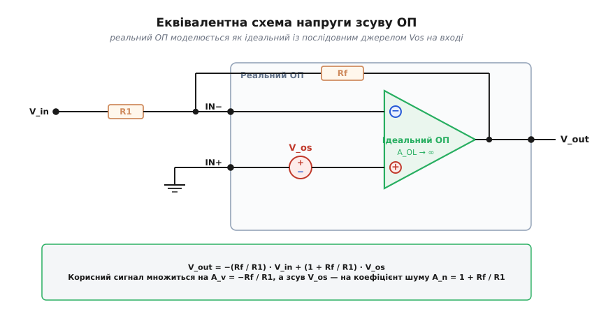
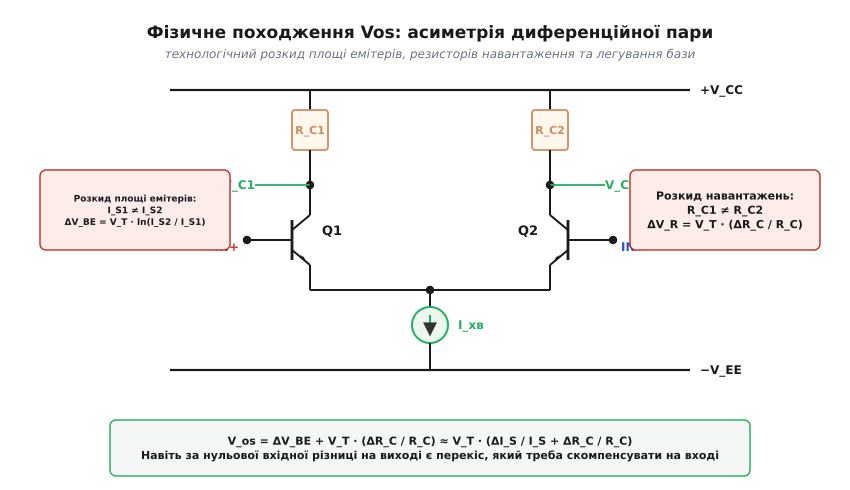
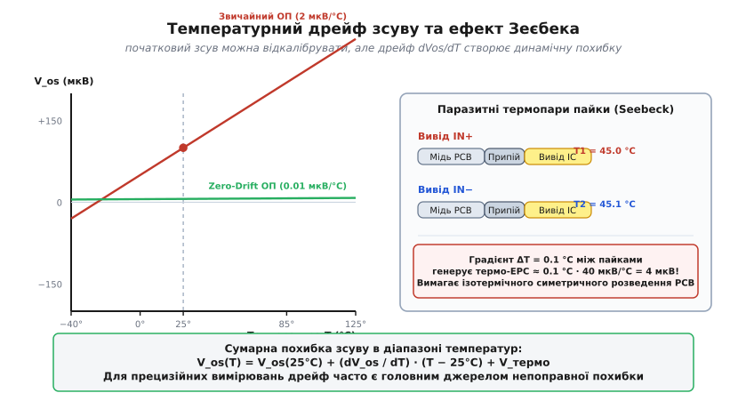
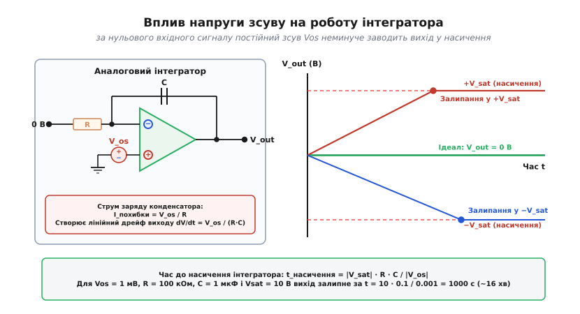

# Напруга зсуву операційного підсилювача (Vos)

<preknowlist>
- [Оппідсилювач](topic:electronics/opamp) — підсилює різницю двох вхідних напруг із величезним коефіцієнтом підсилення.
- [Диференційна пара](topic:electronics/opamp-input-stage) — вхідний каскад із двох транзисторів, симетрія якого визначає баланс схеми.
- [Від'ємний зворотний зв'язок](topic:electronics/negative-feedback) — змушує вихід підлаштовуватися так, щоб різниця між входами прямувала до нуля.
- [Інвертуючий і неінвертуючий підсилювачі](topic:electronics/inverting-noninverting) — базові схеми підсилювачів і формування їхнього коефіцієнта підсилення.
</preknowlist>

Якщо з'єднати обидва входи операційного підсилювача разом і посадити їх на спільну шину землі, напруга між ними строго дорівнюватиме нулю. Якщо цей підсилювач увімкнути за схемою з коефіцієнтом підсилення 1000, теорія ідеального ОП вимагає побачити на виході нуль вольтів. На практиці вимірювальний прилад покаже на виході плюс півтора вольта або вихідна напруга взагалі намертво залетить у верхню рейку живлення. Причина криється у внутрішній несиметрії вхідного каскаду: жодна технологія виготовлення мікросхем не здатна створити два абсолютно ідентичні транзистори. Цю внутрішню асиметрію кількісно описують еквівалентною різницею потенціалів на входах, яка має назву **напруга зсуву** (англ. *input offset voltage*, позначається як `V_os` від англійського *offset* — зсув, зміщення).

Напруга зсуву — це не додатковий сторонній сигнал, а фундаментальна похибка постійного струму самого підсилювача. Вона визначає ту теоретичну межу, нижче якої схема принципово не здатна розрізнити слабку постійну напругу датчика від власного апаратного перекосу.

### Еквівалентна модель: джерело зсуву на вході

Аналізувати роботу підсилювача з внутрішніми асиметріями на рівні окремих кристалічних структур складно й незручно. Тому в інженерній практиці реальний неідеальний ОП представляють у вигляді бездоганно симетричного ідеального підсилювача, перед одним із входів якого послідовно ввімкнено фіксоване джерело постійної напруги `V_os`.


*Реальний операційний підсилювач моделюється як ідеальний ОП із нескінченним власним підсиленням і послідовним джерелом напруги зсуву V_os на неінвертуючому вході. У схемі інвертуючого підсилювача корисний вхідний сигнал множиться на відношення опорів −Rf/R1, тоді як напруга зсуву множиться на коефіцієнт шуму 1 + Rf/R1.*

За фізичним змістом `V_os` — це та диференційна напруга, яку необхідно штучно прикласти між зовнішніми виводами підсилювача від зовнішнього джерела, щоб компенсувати внутрішній перекіс і змусити вихідну напругу стати точно рівною нулю.

Знак напруги зсуву є статистично випадковим: для одного екземпляра мікросхеми потенціал неінвертуючого входу виявляється зміщеним вище інвертуючого (`V_os > 0`), а для сусіднього екземпляра з тієї ж виробничої пластини — нижче (`V_os < 0`). У технічній документації на підсилювачі загального призначення (наприклад, TL072 або LM358) значення `V_os` наводять за модулем і воно зазвичай лежить у межах від 1 до 7 мВ. Для прецизійних біполярних ОП (таких як OP07 або OPA227) типовий зсув становить від 10 до 50 мкВ, а для підсилювачів із динамічною автокомпенсацією нуля опускається нижче 1 мкВ.

> 🔧 **Навіщо це.** Якщо ви розробляєте мілівольтметр, вимірювач струму на шунті або передпідсилювач термопари, напруга зсуву додається безпосередньо до вимірюваного сигналу. Якщо сигнал датчика становить 2 мВ, а паспортний зсув підсилювача дорівнює 3 мВ, покази приладу без калібрування матимуть похибку понад 150 %.

### Фізична природа: кремнієва асиметрія диференційної пари

Щоб зрозуміти, чому напруга зсуву взагалі виникає, необхідно зазирнути у вхідний каскад операційного підсилювача. Майже кожен аналоговий підсилювач починається з [диференційної пари](topic:electronics/opamp-input-stage) — двох транзисторів, емітери або витоки яких з'єднані разом і живляться від спільного генератора стабільного струму, а колектори чи стоки навантажені на узгоджені резистори або струмове дзеркало.


*Вхідний каскад ОП містить диференційну пару транзисторів Q1 та Q2 зі спільним струмом хвоста. Технологічний розкид площі емітерів, профілю легування бази та опорів навантажувальних резисторів призводить до того, що за однакових вхідних напруг струми плечей і спади напруг на колекторах виявляються різними.*

У біполярній диференційній парі колекторний струм кожного транзистора жорстко підпорядковується експоненційній залежності від напруги база-емітер:

```
I_C = I_S · exp(V_BE / V_T)
```

де `I_S` — зворотний струм насичення переходу емітер-база, який прямо пропорційний фізичній площі емітерного вікна `A_E`, а `V_T = k_B · T / q` — температурний потенціал кремнію (`≈ 25.9 мВ` при кімнатній температурі).

Під час фотолітографії, травлення вікон в оксиді та дифузії домішок неможливо отримати геометричні розміри двох транзисторів із абсолютною точністю. Розкид площ емітерів `ΔA_E` або локальні флуктуації концентрації акцепторів у базі породжують неминучу різницю струмів насичення `ΔI_S = I_S1 − I_S2`. Одночасно колекторні інтегровані резистори мають технологічний розкид номіналів `ΔR_C = R_C1 − R_C2`.

Аналітичне виведення взаємозв'язку між розкидом компонентів і результуючим зсувом дає компактну лінеаризовану формулу:

```
|V_os| ≈ V_T · (ΔI_S / I_S + ΔR_C / R_C)
```

Повний математичний ланцюжок перетворень із рівнянь Еберса-Молла наведено у [🧮 виведенні напруги зсуву та температурного дрейфу диференційного каскаду](topic:electronics/offset-voltage/math-offset-drift.md).

З цієї формули видно ключову закономірність: напруга зсуву прямо пропорційна температурному потенціалу `V_T`. Навіть мікроскопічна технологічна похибка площі емітерів у 2 % (`ΔI_S / I_S = 0.02`) та розкид колекторних резисторів у 1 % (`ΔR_C / R_C = 0.01`) при `V_T = 25.9 мВ` генерують вхідний зсув:

```
|V_os| = 25.9 мВ · (0.02 + 0.01) = 25.9 мВ · 0.03 ≈ 0.78 мВ = 780 мкВ
```

Для польових транзисторів (MOSFET) картина ще жорсткіша. У режимі насичення струм стоку залежить від квадрата напруги перевантаження затвора: `I_D = (β / 2) · (V_GS − V_TH)²`. Розкид порогових напруг двох транзисторів `ΔV_TH`, зумовлений неоднорідністю товщини підзатворного оксиду та флуктуаціями фіксованого заряду на межі поділу кремній-діелектрик, безпосередньо входить у формулу зсуву:

```
|V_os(MOS)| ≈ |ΔV_TH| + (V_OV / 2) · (Δ(W/L) / (W/L) + ΔR_D / R_D)
```

Оскільки розкид порогової напруги `ΔV_TH` на кристалі зазвичай становить від 2 до 10 мВ, стандартні ОП із польовим входом (наприклад, КМОН-підсилювачі) без спеціального підрізання мають значно більшу власну напругу зсуву, ніж біполярні підсилювачі, хоча й виграють у них за вхідним струмом витоку на кілька порядків.

### Коефіцієнт шуму: чому зсув підсилюється інакше за сигнал

Поширена інженерна помилка полягає у припущенні, що напруга зсуву на виході підсилювача завжди дорівнює вхідному зсуву `V_os`, помноженому на коефіцієнт підсилення корисного сигналу схеми. Для інвертуючого підсилювача та суматора це твердження категорично хибне.

Поведінку схеми визначають два принципово різні параметри:
1. **Коефіцієнт підсилення сигналу (`A_v`)** — відношення зміни вихідної напруги до зміни корисного вхідного сигналу `V_in`.
2. **Коефіцієнт підсилення шуму (`A_n` або `Noise Gain`)** — коефіцієнт передачі для еквівалентного джерела, підключеного послідовно з неінвертуючим входом ОП.

Розглянемо схему інвертуючого підсилювача з вхідним резистором `R1` та резистором зворотного зв'язку `Rf`. Знайдемо вихідну напругу за методом накладання ([суперпозиції](topic:electronics/superposition)), враховуючи напругу зсуву `V_os` як друге незалежне джерело живлення.

**Крок 1. Дія лише корисного сигналу (`V_in ≠ 0`, `V_os = 0`):**

Неінвертуючий вхід сидить на нулі. Через [від'ємний зворотний зв'язок](topic:electronics/negative-feedback) на інвертуючому вході утворюється [віртуальне коротке замикання](topic:electronics/virtual-short), струм через `R1` дорівнює `I = V_in / R1`, і цей самий струм протікає через `Rf`:

```
V_вих(сигнал) = −(Rf / R1) · V_in
```

**Крок 2. Дія лише напруги зсуву (`V_in = 0`, `V_os ≠ 0`):**

Заземлимо вхідне джерело `V_in = 0`. Тепер резистор `R1` виявляється підключеним між інвертуючим входом і землею. Джерело зсуву `V_os` подає потенціал на неінвертуючий вхід. Завдяки зворотній дії виходу на інвертуючому вході встановлюється потенціал `V_in− = V_os`.

Струм через резистор `R1` дорівнює:

```
I_R1 = (V_os − 0) / R1 = V_os / R1
```

Оскільки вхід ідеального ОП струму не споживає, весь цей струм вимушений текти через резистор зворотного зв'язку `Rf` від виходу до вузла інвертуючого входу:

```
V_вих(похибка) = V_in− + I_R1 · Rf
= V_os + (V_os / R1) · Rf             [підставили струм через R1]
= V_os · (1 + Rf / R1)                [винесли спільний множник V_os]
```

**Крок 3. Повна вихідна напруга:**

Складаючи обидві складові за принципом суперпозиції:

```
V_вих = −(Rf / R1) · V_in + V_os · (1 + Rf / R1)
```

Звідси випливає фундаментальний висновок: **у будь-якій лінійній схемі на ОП похибка від напруги зсуву завжди множиться на коефіцієнт неінвертуючого підсилення `1 + Rf / R1`, незалежно від того, інвертує схема сигнал чи ні**.

Для неінвертуючого підсилювача коефіцієнт підсилення сигналу збігається з коефіцієнтом шуму:

```
A_v = 1 + Rf / R1 = A_n
```

Для інвертуючого підсилювача сигнал підсилюється з коефіцієнтом `A_v = −Rf / R1`, а зсув — із коефіцієнтом `A_n = 1 + |A_v|`.

Це створює небезпечну пастку при побудові атенюаторів (послаблювачів сигналу). Нехай необхідно послабити вхідний сигнал у 10 разів за допомогою інвертуючого каскаду: `R1 = 100 кОм`, `Rf = 10 кОм`, отже коефіцієнт підсилення сигналу становить `A_v = −0.1`. Проте коефіцієнт підсилення шуму та зсуву для цієї схеми дорівнює:

```
A_n = 1 + 10 кОм / 100 кОм = 1 + 0.1 = 1.1
```

Якщо підсилювач має `V_os = 5 мВ`, на виході з'явиться постійна напруга похибки `5 мВ · 1.1 = 5.5 мВ`. Сигнал був ослаблений у 10 разів, а паразитна напруга зсуву навпаки підсилена в 1.1 раза — відносна похибка вимірювання зросла в 11 разів.

Ще яскравіше цей ефект проявляється в багатоканальних аналогових суматорах. Якщо на інвертуючий вхід через однакові резистори `R` подано `N` вхідних сигналів, а в ланцюзі зворотного зв'язку встановлено резистор `Rf = R` (підсилення кожного каналу дорівнює одиниці), еквівалентний паралельний опір вхідної сітки становить `R / N`. Коефіцієнт шуму для такого суматора різко зростає:

```
A_n = 1 + Rf / (R / N) = 1 + N
```

Для 8-канального суматора напруга зсуву ОП множиться на виході на `1 + 8 = 9`. Зсув мікросхеми в 2 мВ створить на виході постійну сходинку похибки у 18 мВ, навіть якщо на всі вісім входів подано чистий нуль вольтів.

> 🔧 **Навіщо це.** Під час розрахунку точності аналогового тракту завжди визначайте саме коефіцієнт шуму `A_n`. Якщо для підвищення стабільності або зменшення смуги ви додаєте в коло зворотного зв'язку ємнісні чи резистивні дільники, ви автоматично піднімаєте `A_n`, що багаторазово підсилює вихідний дрейф постійного струму.

### Температурний дрейф dVos/dT та ефект Зеєбека

Якби напруга зсуву була абсолютно незмінною в часі, її можна було б один раз виміряти під час виробництва приладу та програмно відняти в коді мікроконтролера. Головна проблема полягає в тому, що напруга зсуву неперервно пливе зі зміною температури навколишнього середовища та в процесі прогріву самої плати.

Швидкість зміни зсуву від температури називається **температурним дрейфом напруги зсуву** (позначається `dV_os / dT` або `TCV_os` від англ. *Temperature Coefficient of Vos*):

```
dV_os / dT = lim(ΔT → 0) [ ΔV_os / ΔT ]
```


*Зліва: залежність напруги зсуву від температури для звичайного підсилювача (дрейф ~2 мкВ/°C) та прецизійного Zero-Drift ОП (дрейф ~0.01 мкВ/°C). Справа: паразитна термопара, утворена стиком міді друкованої плати, свинцево-олов'яного припою та виводу корпусу мікросхеми; градієнт температури в 0.1 °C між виводами породжує термо-ЕРС у 4 мкВ.*

У напівпровідниковій структурі диференційного каскаду температурний потенціал `V_T = k_B · T / q` зростає лінійно з абсолютною температурою з крутизною:

```
dV_T / dT = k_B / q ≈ 86.17 мкВ / К
```

Оскільки початковий зсув `V_os` пропорційний величині `V_T`, власний теоретичний дрейф біполярної пари жорстко пов'язаний із величиною її початкового зсуву:

```
dV_os / dT ≈ V_os / T_0
```

де `T_0 ≈ 300 К` — температура калібрування.

Для біполярного підсилювача зі зсувом `V_os = 1 мВ` мінімально можливий теоретичний дрейф становить `1000 мкВ / 300 К ≈ 3.3 мкВ / °C`. Якщо прилад працює в промисловому температурному діапазоні від −40 до +85 °C (`ΔT = 125 °C`), зміна напруги зсуву від нагрівання сягне:

```
ΔV_os(дрейф) = 3.3 мкВ / °C · 125 °C ≈ 412 мкВ
```

Навіть якщо за температури +25 °C ви ідеально обнулили похибку калібрувальним коефіцієнтом, на морозі або в літню спеку зсув у пів мілівольта спотворить покази датчика.

Додатковим джерелом похибки, яке часто ігнорують, є **термоелектричний ефект Зеєбека**. Будь-яке механічне та електричне з'єднання двох різнорідних металів утворює мікроскопічну термопару. На друкованій платі вхідний сигнал проходить крізь ланцюжок таких контактів:

```
Мідна доріжка плати (Cu)  →  Припій (Sn-Pb або SAC305)  →  Вивід корпусу мікросхеми (Kovar / Cu-сплав)
```

Коефіцієнт Зеєбека для пари «мідь — ковар» або «мідь — оксидований припій» становить від 35 до 45 мкВ на кожен градус Цельсія температурної різниці.

Якщо на платі поруч із вхідними виводами ОП розташований потужний стабілізатор напруги, вихідний силовий транзистор або процесор, тепловий потік створює на текстоліті просторовий температурний градієнт. Якщо вхідний контакт `IN+` виявляється всього на 0.1 °C теплішим за сусідній контакт `IN−`, між ними виникає суто фізична паразитна постійна напруга:

```
V_термо = 40 мкВ / °C · 0.1 °C = 4 мкВ
```

Для сучасних підсилювачів класу Zero-Drift, власний зсув яких становить менше 1 мкВ, неправильне топологічне розміщення деталей на платі та протяги всередині корпусу приладу можуть створити похибку, яка в рази перевищує паспортні характеристики мікросхеми.

> 🔧 **Навіщо це.** Входи прецизійних підсилювачів розводять на платі строго симетрично, використовуючи ізотермічне компонування: обидві вхідні доріжки роблять однакової довжини та ширини, розташовують їх паралельно на мінімальній відстані, а тепловиділяючі компоненти виносять на протилежний бік плати перпендикулярно до осі симетрії входів.

### Внутрішні теплові зворотні зв'язки кристала

Окрім зовнішнього нагріву від сусідніх елементів на платі, найпідступнішим джерелом дрейфу є **саморозігрів вихідного каскаду мікросхеми**.

Коли операційний підсилювач віддає в навантаження `R_L` струм `I_вих`, на вихідних транзисторах розсіюється миттєва теплова потужність:

```
P_розс = (V_CC − V_вих) · I_вих
```

Якщо підсилювач живиться від двополярної напруги ±15 В і видає на вихід +10 В при навантаженні 1 кОм (`I_вих = 10 мА`), потужність розсіювання на вихідному n-p-n транзисторі становить `(15 В − 10 В) · 10 мА = 50 мВт`.

Ця потужність виділяється на площі крихітного кремнієвого острівця розміром у соті частки міліметра. Від вихідного транзистора крізь кремнієву підкладку в усі боки поширюється теплова хвиля. Кремній є хорошим провідником тепла, проте на кристалі виникає просторовий градієнт температури.

Якщо диференційна пара розміщена асиметрично щодо вихідного транзистора, один із вхідних транзисторів (наприклад, `Q1`) нагріється на крихітну частку градуса сильніше за інший (`Q2`):

```
ΔT_кристал = T_Q1 − T_Q2 ≈ 0.002 °C
```

Оскільки напруга база-емітер біполярного транзистора має температурний коефіцієнт близько `−2 мВ / °C`, різниця температур у дві тисячні градуса створює на вході паразитну напругу:

```
ΔV_os(тепло) = −2 мВ / °C · 0.002 °C = −4 мкВ
```

Виникає паразитний тепловий зворотний зв'язок: вихідна напруга створює вихідний струм → вихідний струм нагріває вихідний транзистор → тепловий потік нагріває вхідний транзистор → змінюється вхідна напруга зсуву → вихідна напруга коригується.

Цей ефект призводить до двох негативних наслідків:
1. **Зниження статичного коефіцієнта підсилення без зворотного зв'язку (`A_OL`):** На наднизьких частотах (до 5–10 Гц) тепловий зв'язок діє як додатковий паразитичний зворотний зв'язок, що деформує характеристику передачі та викликає видиму нелінійність (викривлення форми синусоїди).
2. **Затягування перехідних процесів (Thermal Tails):** При стрибку вихідної напруги електричний перехідний процес закінчується за частки мікросекунди, проте вихідна напруга продовжує повільно «повзти» ще кілька мілісекунд, поки температура кристала не прийде у новий тепловий баланс.

У прецизійних мікросхемах для боротьби з цим ефектом вхідну пару розбивають на чотири перехрещені квадранти (хрестоподібна топологія common-centroid), а вихідний каскад розташовують суворо на осі теплової симетрії між ними.

### Взаємодія струмів зсуву з імпедансом джерела сигналу

Окрім напруги зсуву `V_os`, вхідний каскад ОП характеризується вхідними струмами зміщення (англ. *input bias current*, `I_B1` та `I_B2`) і їхньою різницею — вхідним струмом зсуву (англ. *input offset current*, `I_os = |I_B1 − I_B2|`).

Коли вхідний сигнал надходить від джерела з високим внутрішнім опором `R_дж`, протікання вхідних струмів через резистори схеми створює додаткові спади напруг, які додаються до власної напруги зсуву ОП.

Розглянемо неінвертуючий підсилювач із внутрішнім опором джерела сигналу `R_дж` на неінвертуючому вході та резисторами зворотного зв'язку `R1` і `Rf` на інвертуючому вході.

Повна еквівалентна напруга зсуву, зведена до входу схеми, становить:

```
V_os_повна = V_os + I_B1 · R_дж − I_B2 · (R1 || Rf)
```

Якщо величини опорів не узгоджені (наприклад, `R_дж = 100 кОм`, а `R1 || Rf = 1 кОм`), для біполярного ОП зі струмом зміщення `I_B = 100 нА` паразитна напруга від струму дорівнюватиме:

```
V_похибка(струм) = 100 нА · 100 кОм = 10 мВ
```

Ця похибка у 10 разів перевищує власну напругу зсуву мікросхеми (`V_os ≈ 1 мВ`).

Щоб усунути цей внесок, опори кіл обох входів вирівнюють:

```
R_IN+ = R_IN−  →  R_дж = R1 || Rf
```

При такому узгодженні однакові складові струмів `I_B` створюють однакові спади напруг на обох входах, які взаємно віднімаються диференційним каскадом. Залишається лише похибка від струму зсуву:

```
V_похибка_залишкова = I_os · R_дж
```

Оскільки струм зсуву `I_os` зазвичай у 5–10 разів менший за струм зміщення `I_B`, узгодження опорів істотно знижує сумарний дрейф схеми.

### Зсув від синфазної напруги (CMRR) та нестабільності живлення (PSRR)

Паспортне значення `V_os` у технічній документації наводять для строго визначених умов: напруга на обох входах дорівнює точно середині діапазону живлення, а напруга джерела живлення стабільна й номінальна. У реальній роботі вхідна синфазна напруга та напруга живлення постійно коливаються, викликаючи додатковий динамічний зсув робочої точки.

Коли обидва входи одночасно піднімаються або опускаються на величину синфазної напруги `V_cm`, через кінцевий вихідний опір джерела струму в емітерному хвості диференційного каскаду та асиметрію колекторних напруг виникає додатковий вхідний зсув:

```
ΔV_os(CMR) = ΔV_cm / CMRR_(рази)
```

Зв'язок між децибелами та зміною зсуву визначається через логарифмічну шкалу: `CMRR_(дБ) = 20 · log₁₀(CMRR_(рази))`. Якщо підсилювач має коефіцієнт придушення синфазного сигналу `CMRR = 80 дБ` (що відповідає послабленню в 10 000 разів), то зміна синфазної напруги на входах на 5 В викличе додатковий зсув:

```
ΔV_os(CMR) = 5 В / 10 000 = 0.5 мВ = 500 мкВ
```

Детальний аналіз фізики придушення синфазного сигналу та частотної залежності наведено в статті [Коефіцієнт придушення синфазного сигналу (CMRR)](topic:electronics/cmrr).

Аналогічно працює механізм проникнення пульсацій шини живлення (**PSRR**, англ. *Power Supply Rejection Ratio*). При просіданні чи пульсаціях напруги живлення на величину `ΔV_живлення` (наприклад, через розряд акумулятора або роботу імпульсного перетворювача) напруга зсуву зазнає додаткового відхилення:

```
ΔV_os(PSR) = ΔV_живлення / PSRR_(рази)
```

При паспортному `PSRR = 90 дБ` (31 622 рази) пульсація живлення амплітудою 1 В перетворюється на паразитний стрибок напруги зсуву на вході величиною `1 В / 31 622 ≈ 31.6 мкВ`.

Повний найгірший бюджет напруги зсуву з урахуванням температури, синфазного сигналу та живлення описується рівнянням:

```
V_os_max = |V_os(25°C)| + |dV_os / dT| · ΔT + |ΔV_cm| / CMRR + |ΔV_живлення| / PSRR
```

### Вплив напруги зсуву на роботу типових вузлів

Напруга зсуву спотворює роботу майже кожного аналогового каскаду, проте є кілька критичних застосувань, де вона повністю руйнує функціональність схеми.

#### 1. Аналоговий інтегратор на ОП

У схемі інтегратора вхідний резистор `R` підключено до інвертуючого входу, а в колі зворотного зв'язку встановлено конденсатор `C`. Якщо подати на вхід нуль вольтів (заземлити вхідний резистор), ідеальний інтегратор мав би нескінченно довго утримувати нульову вихідну напругу.


*При заземленому вході напруга зсуву Vos створює постійний струм заряду конденсатора I = Vos/R. Вихідна напруга лінійно зростає з часом, поки вихідний каскад підсилювача не заллється у верхню чи нижню рейку насичення ±V_sat.*

Реальний ОП має зсув `V_os`. Оскільки неінвертуючий вхід сидить на землі, на інвертуючому вході за рахунок зворотного зв'язку підтримується напруга `V_in− = V_os`. Через вхідний резистор `R` починає неперервно протікати паразитичний струм заряду конденсатора:

```
I_похибки = V_os / R
```

Цей струм викликає лінійне зростання або спадання вихідної напруги в часі:

```
V_вих(t) = −(1 / C) · ∫ I_похибки dt = −(V_os / (R · C)) · t
```

Вихідна напруга неминуче дрейфує доти, доки не досягне максимальної межі вихідного каскаду — напруги насичення `+V_sat` або `−V_sat`. Час, через який інтегратор повністю вийде з ладу (залипне в рейку живлення), дорівнює:

```
t_насичення = |V_sat| · R · C / |V_os|
```

Розрахуємо конкретний стенд: інтегратор із постійною часу `R · C = 100 кОм · 1 мкФ = 0.1 с`, напругою насичення `V_sat = 12 В` та стандартним ОП зі зсувом `V_os = 2 мВ`:

```
t_насичення = 12 В · 0.1 с / 0.002 В = 600 с = 10 хв
```

Без вхідного сигналу підсилювач за 10 хвилин повністю втрачає працездатність. У практичних схемах паралельно до інтегруючого конденсатора обов'язково встановлюють високоомний резистор витоку (bleeder resistor), який обмежує коефіцієнт підсилення постійного струму, або використовують періодичне скидання заряду електронним ключем.

#### 2. Вимірювальний шунт струму

При вимірюванні струму в ланцюгах живлення (наприклад, моніторинг струму батареї) використовують низькоомний резистивний шунт. Щоб мінімізувати втрати потужності та просідання напруги, опір шунта обирають малим, наприклад `R_шунт = 10 мОм = 0.01 Ом`.

При протіканні малого струму `10 мА` корисний спад напруги на шунті дорівнює:

```
V_сигнал = 10 мА · 10 мОм = 100 мкВ
```

Якщо для підсилення цього сигналу застосувати стандартний підсилювач із `V_os = 1 мВ` (1000 мкВ), напруга власного зсуву виявиться вдесятеро більшою за сам вимірюваний сигнал. Вимірювач струму покаже `110 мА` замість реальних `10 мА` (похибка 1000 %). Для таких задач придатні виключно спеціалізовані прецизійні або струмовимірювальні підсилювачі зі зсувом менше 10 мкВ.

#### 3. Компаратори та детектори нульового рівня

У порогових детекторах та прецизійних [компараторах](topic:electronics/comparator) напруга зсуву безпосередньо зміщує точку перемикання: схема спрацьовує не тоді, коли вхідний сигнал перетинає нуль, а коли він досягає рівня `V_in = V_os`. У схемах вимірювання фазового зсуву та детекторах переходу синусоїди через нуль (Zero-Crossing Detector) це призводить до фазової похибки та спотворення часових інтервалів.

### Спеціалізовані архітектури: композитний підсилювач та вимірювальний міст

Коли від підсилювача одночасно вимагаються дві взаємовиключні властивості — наприклад, субмікровольтовий зсув і гігагерцова смуга пропускання або надвисока швидкість наростання вихідної напруги — один ОП не здатний вирішити задачу. У таких випадках застосовують спеціальні схемотехнічні структури.

#### Композитний підсилювач (Composite Amplifier)

Композитна схема об'єднує два різних ОП в єдиний замкнений контур:
* **Перший ОП (прецизійний помічник):** повільний підсилювач класу Zero-Drift з ультранизьким зсувом `V_os < 1 мкВ` (наприклад, OPA333).
* **Другий ОП (швидкісний виконавець):** широкосмуговий швидкодіючий ОП із високою швидкістю наростання (наприклад, THS4031 або OPA656 зі смугою 200 МГц), але з великим власним зсувом `V_os ≈ 5–10 мВ`.

Прецизійний ОП неперервно відстежує потенціал на сумувальному вузлі високошвидкісного підсилювача, порівнює його з нулем і формує повільну керуючу напругу, яка компенсує внутрішній перекіс швидкісного каскаду. У результаті готова схема володіє точністю першого підсилювача за постійним струмом та динамічною швидкістю другого підсилювача на високих частотах.

#### Інструментальний підсилювач для мостових схем

При підключенні тензометричних мостів Вітстона сигнал формується як мілівольтова різниця між двома плечима моста, які водночас підняті на синфазний рівень у половину напруги живлення (наприклад, +2.5 В).

Звичайний однокаскадний віднімач на одному ОП навантажує міст своїми резисторами зворотного зв'язку, що порушує баланс моста та погіршує CMRR. Тому стандартним рішенням є трьохопераційний [інструментальний підсилювач](topic:electronics/instrumentation-amp). Його перший каскад на двох ОП має нескінченний вхідний опір і підсилює суто диференційний сигнал із коефіцієнтом `1 + 2·R1/Rg`, передаючи синфазну напругу з одиничним коефіцієнтом. Завдяки цьому вплив напруги зсуву другого (вихідного) каскаду, зведений до первинного входу, зменшується в `1 + 2·R1/Rg` разів.

### Методи мінімізації та компенсації напруги зсуву

В інженерній практиці застосовують комплекс схемотехнічних, технологічних і алгоритмічних методів боротьби зі зсувом:

#### 1. Лазерне підрізання на кристалі (Laser Trimming)
Під час виготовлення кремнієвої пластини на етапі автоматизованого тестування лазерний промінь випаровує мікроскопічні ділянки тонкоплівкових нікель-хромових (NiCr) або танталових резисторів колекторного навантаження. Опір резисторів підганяється доти, доки вихідний перекіс каскаду не впаде майже до нуля. Це дозволяє отримати біполярні підсилювачі зі зсувом 10–25 мкВ без погіршення температурного дрейфу.

#### 2. Цифрове калібрування за допомогою полікремнієвих перемичок (e-Fuse / Zener-Zap)
На кристал інтегрують матрицю дрібних коригувальних резисторів із паралельними стабілітронами або транзисторними перемичками (fuse/antifuse). Під час заводського калібрування через відповідні виводи пропускають імпульс струму, який назавжди закорочує або розриває потрібні ланки, встановлюючи оптимальний баланс струмів.

#### 3. Підсилювачі з періодичною автокомпенсацією (Zero-Drift: Auto-Zero та Chopper)
Найефективніший спосіб боротьби зі зсувом та його температурним дрейфом — періодичне вимірювання та віднімання власного зсуву в реальному часі на високій частоті перемикання (від десятків кілогерців до мегагерца).
* У [Auto-zero ОП](topic:electronics/auto-zero-opamp) підсилювач періодично відключається від зовнішнього джерела, замикає свої входи, фіксує власний зсув на внутрішньому накопичувальному конденсаторі та віднімає цю напругу на робочій фазі підсилення.
* У [чопперних підсилювачах](topic:electronics/chopper-amplifier) вхідний сигнал модулюється на високу частоту, підсилюється змінним трактом (де постійний зсув не передається), після чого синхронно демодулюється назад на низьку частоту.

Підсилювачі класу Zero-Drift (наприклад, OPA333, ADA4528, AD8628) мають типовий зсув менше `1–5 мкВ` і фантастично малий дрейф порядку `0.005–0.02 мкВ / °C`.

#### 4. Розв'язка за постійним струмом (AC Coupling)
Якщо оброблюваний сигнал є суто змінним (звуковий сигнал, радіочастота, імпульси давача ходу), постійну складову напруги зсуву повністю відсікають за допомогою послідовного роздільного конденсатора на вході або в ланцюзі зворотного зв'язку. У цьому випадку коефіцієнт підсилення схеми для постійного струму падає до одиниці (`A_n(DC) = 1`), і напруга зсуву не накопичується в наступних каскадах.

### Розрахунок найгіршого бюджету похибки та програмна реалізація

При проектуванні вимірювальних систем інженер зобов'язаний розрахувати максимальну сумарну похибку постійного струму в усьому діапазоні температур, напруг живлення та синфазних сигналів.

**Сценарій розрахунку:** Прецизійний струмовимірювальний каскад на ОП із паспортними даними:
* Початковий зсув за 25 °C: `V_os = 50 мкВ`;
* Температурний дрейф: `dV_os/dT = 0.5 мкВ / °C`;
* Придушення синфазного сигналу: `CMRR = 100 дБ` (послаблення у 100 000 разів);
* Придушення пульсацій живлення: `PSRR = 110 дБ` (послаблення у 316 228 разів);
* Умови експлуатації: робоча температура від +25 °C до +75 °C (`ΔT = 50 °C`), синфазна напруга змінюється на `ΔV_cm = 12 В`, напруга живлення нестабільна на `ΔV_живлення = 1.5 В`.

Розрахуємо внесок кожного чинника, зведений до входу:

```
1. Початковий зсув:       V_os(25°C)  = 50 мкВ
2. Температурний дрейф:   0.5 мкВ/°C · 50 °C = 25 мкВ
3. Синфазна похибка:      12 В / 100 000 = 120 мкВ
4. Пульсація живлення:    1.5 В / 316 228 = 4.74 мкВ
```

Сумарна найгірша похибка (найгірший випадок при збігу всіх знаків):

```
V_похибка_макс = 50 + 25 + 120 + 4.74 = 199.74 мкВ ≈ 0.20 мВ
```

Статистична середньоквадратична похибка (Root-Sum-Square, RSS):

```
V_похибка_RSS = √(50² + 25² + 120² + 4.74²) = √(2500 + 625 + 14400 + 22.5) = √17547.5 ≈ 132.5 мкВ
```

У вбудованому програмному забезпеченні розрахунок максимальної похибки каналу дозволяє динамічно визначати межі достовірності вимірювання:

:::tabs
```c
#include <math.h>
#include <stdio.h>

// Параметри ОП для розрахунку бюджету постійного струму
typedef struct {
    double vos_base_uv;    // Початковий зсув за 25°C (мкВ)
    double drift_uv_per_c; // Температурний дрейф (мкВ/°C)
    double cmrr_db;        // CMRR (дБ)
    double psrr_db;        // PSRR (дБ)
} OpAmpOffsetSpecs;

// Результат розрахунку бюджету похибки
typedef struct {
    double worst_case_uv;  // Найгірша адитивна похибка (мкВ)
    double rss_uv;         // Статистична середньоквадратична похибка (мкВ)
} OffsetBudgetResult;

// Розрахунок сумарної напруги зсуву, зведеної до входу
OffsetBudgetResult calculate_offset_budget(const OpAmpOffsetSpecs* specs,
                                           double delta_t_c,
                                           double delta_vcm_v,
                                           double delta_vsupply_v) {
    OffsetBudgetResult res;

    double temp_error_uv = specs->drift_uv_per_c * fabs(delta_t_c);
    
    // Переведення дБ у лінійний коефіцієнт послаблення
    double cmrr_ratio = pow(10.0, specs->cmrr_db / 20.0);
    double psrr_ratio = pow(10.0, specs->psrr_db / 20.0);

    // Зведення до мікровольтів (1 В = 1e6 мкВ)
    double cmrr_error_uv = (fabs(delta_vcm_v) / cmrr_ratio) * 1.0e6;
    double psrr_error_uv = (fabs(delta_vsupply_v) / psrr_ratio) * 1.0e6;

    // Найгірший випадок (пряме додавання модулів)
    res.worst_case_uv = specs->vos_base_uv + temp_error_uv + cmrr_error_uv + psrr_error_uv;

    // Статистичне підсумовування (RSS)
    res.rss_uv = sqrt(specs->vos_base_uv * specs->vos_base_uv +
                      temp_error_uv * temp_error_uv +
                      cmrr_error_uv * cmrr_error_uv +
                      psrr_error_uv * psrr_error_uv);

    return res;
}
```
```cpp
#include <cmath>
#include <iostream>

struct OpAmpOffsetSpecs {
    double vos_base_uv{0.0};    // Початковий зсув за 25°C (мкВ)
    double drift_uv_per_c{0.0}; // Температурний дрейф (мкВ/°C)
    double cmrr_db{0.0};        // CMRR (дБ)
    double psrr_db{0.0};        // PSRR (дБ)
};

struct OffsetBudgetResult {
    double worst_case_uv{0.0};  // Найгірша адитивна похибка (мкВ)
    double rss_uv{0.0};         // Статистична середньоквадратична похибка (мкВ)
};

// Розрахунок сумарної напруги зсуву, зведеної до входу
[[nodiscard]] constexpr OffsetBudgetResult calculate_offset_budget(
    const OpAmpOffsetSpecs& specs,
    double delta_t_c,
    double delta_vcm_v,
    double delta_vsupply_v) noexcept {
    
    const double temp_error_uv = specs.drift_uv_per_c * std::abs(delta_t_c);

    const double cmrr_ratio = std::pow(10.0, specs.cmrr_db / 20.0);
    const double psrr_ratio = std::pow(10.0, specs.psrr_db / 20.0);

    const double cmrr_error_uv = (std::abs(delta_vcm_v) / cmrr_ratio) * 1.0e6;
    const double psrr_error_uv = (std::abs(delta_vsupply_v) / psrr_ratio) * 1.0e6;

    const double worst_case = specs.vos_base_uv + temp_error_uv + cmrr_error_uv + psrr_error_uv;

    const double rss = std::sqrt(specs.vos_base_uv * specs.vos_base_uv +
                                 temp_error_uv * temp_error_uv +
                                 cmrr_error_uv * cmrr_error_uv +
                                 psrr_error_uv * psrr_error_uv);

    return {worst_case, rss};
}
```
:::

### Підсумкові орієнтири для вибору підсилювача

| Клас підсилювача | Типовий `V_os` | Дрейф `dV_os/dT` | Основна технологія | Типове застосування |
| :--- | :--- | :--- | :--- | :--- |
| **Загального призначення** (LM358, TL072) | 1–7 мВ | 5–20 мкВ/°C | Стандартний біполярний / JFET процес | Звукові тракти, компаратори, базові фільтри |
| **Прецизійні біполярні** (OP07, OPA227) | 10–50 мкВ | 0.2–1 мкВ/°C | Лазерне підрізання резисторів на кристалі | Прецизійні ваги, медичні монітори, вольтметри |
| **Прецизійні польові** (OPA140, ADA4622) | 100–500 мкВ | 1–3 мкВ/°C | JFET / e-Trim КМОН технологія | Електрометричні підсилювачі, оптичні фотодіоди |
| **Zero-Drift (Auto-Zero / Chopper)** (OPA333, ADA4528) | 0.5–5 мкВ | 0.005–0.05 мкВ/°C | Періодична комутація та фільтрація | Моніторинг струму на шунтах, термопари, тензомости |

> 🔧 **Навіщо це.** Обираючи підсилювач для схеми постійного струму, оцінюйте не лише першу цифру `V_os` у заголовку документації. Перемножте робочий діапазон температур на `dV_os/dT`, перевірте коефіцієнт шуму схеми `A_n` та додайте похибки від коливань синфазного рівня й живлення. Тільки такий інтегральний бюджет покаже, чи зможе ваш прилад забезпечити заявлену розрядність вимірювання.
