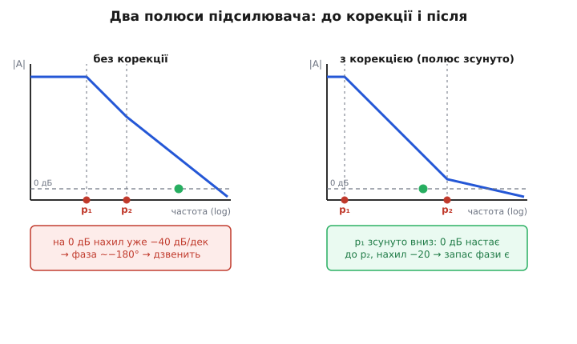
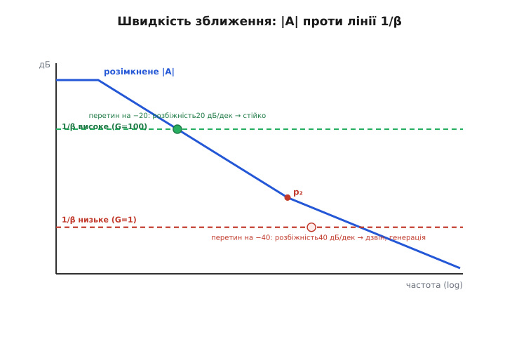
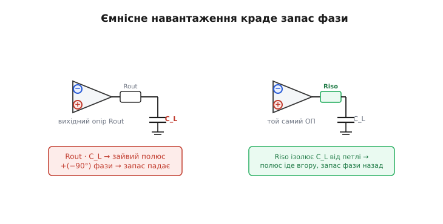

# Стійкість ОП: запас фази і компенсація

Операційний підсилювач сам по собі майже непридатний: його власне підсилення сягає сотень тисяч, тож щонайменший дрейф на вході жене вихід у рейку живлення. Корисним його робить [від'ємний зворотний зв'язок](topic:electronics/negative-feedback) — частину виходу повертають на інвертуючий вхід, і коло саме приборкує своє підсилення до потрібної, передбачуваної величини. Та в цьому ж прийомі сидить прихована загроза. Той самий зв'язок, що мав **заспокоювати**, за певних умов починає **розгойдувати**: вихід зривається в незатухаючі коливання на сотнях кілогерц чи мегагерцах, і замість чистого підсилювача ви маєте генератор, якого не просили. Інженери кажуть — підсилювач **«заспівав»**.

Питання цієї теми вузьке й дуже практичне: **чому операційний підсилювач узагалі схильний зірватися**, коли його замикають зворотним зв'язком, і **що з ним роблять усередині й зовні**, щоб цього не сталося. Відповідь — поняття **компенсації** (лат. *compensatio* — зрівноваження): навмисна переробка частотної поведінки підсилювача так, щоб петля лишалася стійкою навіть у найнезручнішому ввімкненні. Розберімо, звідки береться схильність до зриву, як її гасять «домінантним полюсом», і чому через це доводиться платити швидкодією.

### Чому петля хоче зірватися: затримка обертає знак

Корінь біди — у тому, що жоден реальний підсилювач **не передає сигнал миттєво**. Усередині повно ємностей, кожен каскад має скінченну швидкодію, і через це на високих частотах сигнал не просто слабшає — він **запізнюється**, набуває **зсуву фази**. Кожен внутрішній вузол, що накопичує заряд (а отже дає спад −20 дБ на декаду в [частотній характеристиці](topic:electronics/frequency-response)), додає на високих частотах до −90° зсуву. Такий вузол інженери звуть **полюсом** (бо в математиці передавальної функції на цій частоті знаменник прямує до нуля). Двоступеневий операційний підсилювач — а саме така будова класична — має щонайменше **два** таких полюси: один на вході (на високоомному вузлі першого каскаду), другий — на виході другого каскаду.

Простежмо, що з двох полюсів виходить. Згадаймо, що зв'язок зветься від'ємним, бо сигнал повертають на вхід **у протифазі** — щоб він віднімався. А протифаза — це вже зсув на **180°**. Тепер піднімаймо частоту. Перший полюс докручує до −90°, другий — ще до −90°, разом **−180°** власної затримки підсилювача. Додаймо до них ті «вбудовані» 180° знака мінус — і виходить **360°**, тобто рівно **0°**. Сигнал, обійшовши петлю, повертається **точно у фазі** з тим, що вже є на вході. Віднімання непомітно обернулося на **додавання**: зв'язок, що мав гасити, тепер підсилює сам себе.

Чи зірветься коло насправді — вирішує друга умова: **скільки лишилося підсилення** на тій небезпечній частоті. Якщо сигнал, обійшовши контур, повертається у фазі **й не меншим**, ніж вийшов, — кожен оберт додає, амплітуда росте лавиною аж до рейки. Це і є самозбудження. Якщо ж він повертається у фазі, але вже **ослаблений**, сплеск згасає сам. Уся гра стійкості точиться навколо цих двох умов одночасно — фази, що дійшла −180°, і підсилення в петлі, що там ще не впало нижче одиниці. Точне визначення двох «запасів», якими цю відстань міряють, — у темі [запас підсилення і запас фази](topic:electronics/stability-margins); тут нам важливо інше — **що з підсилювачем робить виробник**, щоб ці запаси наперед були здорові.

> 🔧 **Навіщо це.** Це не теоретична страшилка, а найчастіша причина, чому свіжозібрана плата «дзвенить» на осцилографі або гріється без видимої причини. Підсилювач, що жене сигнал на довгий кабель чи на вхід АЦП, активний фільтр, схема джерела струму на ОП — усі мають петлю, і всі можуть зірватися там, де простим вольтметром нічого не побачиш. Розуміння компенсації — це різниця між «чомусь дзвенить, поміняю мікросхему навмання» і «знаю, який полюс винен і яким резистором його прибрати».

### Лік: один полюс роблять домінантним

Якби обидва полюси підсилювача лежали близько по частоті, фаза докручувала б −180° якраз там, де підсилення ще велике — і коло зривалося б у найпростішому ввімкненні. Тому виробник навмисне **псує** підсилювач: один полюс **відтягують далеко вниз по частоті**, роблячи його **домінантним** (лат. *dominans* — панівний). Решта полюсів лишаються там, де були, на високих частотах, а домінантний бере на себе всю поведінку задовго до них.

Подивімося, чому це рятує. Доти, доки в спаді підсилення «головує» один-єдиний полюс, крива котиться рівно **−20 дБ на декаду**, а фаза тримається коло **−90°** — далеко від фатальних −180°. Якщо зробити цей домінантний полюс настільки низьким, що підсилення в петлі встигне впасти **до одиниці (0 дБ) ще до того, як другий полюс почне додавати свої −90°**, — то на найнебезпечнішій частоті (де підсилення доходить до межі) фаза ще десь коло −90°, а до −180° лишається добрих 90° запасу. Коло стійке з великим запасом, хай би як його замкнули.


*Уся суть компенсації в одному русі. Без корекції (ліворуч) два полюси близько: коли підсилення падає до 0 дБ, крива вже котиться круто −40 дБ/дек, обидва полюси докрутили фазу майже до −180° — коло на межі зриву. Корекція (праворуч) відтягує перший полюс далеко вниз по частоті; тепер підсилення сходить до 0 дБ ще на пологому −20 дБ/дек, не діставшись другого полюса, — і запас фази здоровий.*

Технічно цей зсув роблять **конденсатором корекції** між входом і виходом другого каскаду. Мала ємність (десятки пікофарад) на тому високоомному вузлі вже сама знизила б полюс, але є дешевший і потужніший хід: вмикають конденсатор там, де його **багаторазово збільшує** [ефект Міллера](topic:electronics/miller-effect) — конденсатор, перекинутий через каскад із підсиленням, для входу виглядає у багато разів більшим, ніж він є. Тож фізично крихітні 30 пФ діють як величезна ємність і відтягують полюс аж у район одиниць чи десятків герц. Цей прийом так і звуть — **міллерова компенсація**. Чому саме перекинутий через каскад конденсатор не просто зсуває один полюс, а ще й корисно **розсуває** обидва (низький — ще нижче, високий — ще вище), розібрано у вставці [розщеплення полюсів](topic:electronics/opamp-stability/math-pole-splitting.md).

### Плата за стійкість: швидкість, віддана задарма

Дармового тут нема. Відтягнувши домінантний полюс у район одиниць герц, ми **обвалили смугу** розімкненого підсилення: тепер підсилення починає спадати майже від постійного струму. Прямий наслідок — підсилювач стає **повільним**. Саме звідси береться скромний [добуток підсилення на смугу](topic:electronics/gain-bandwidth-product): компенсаційна ємність задає ту єдину спадну пряму, по якій котиться підсилення, а отже й сталу площу «підсилення × смуга». Чим більший конденсатор корекції (надійніша стійкість), тим нижче лежить пряма — тим менша смуга й тим менша [швидкість наростання](topic:electronics/real-opamp-limits) виходу. Стійкість і швидкодія тут — два кінці одного важеля.

Класичний приклад — той самий конденсатор корекції на 30 пФ у легендарному µA741: він робить підсилювач стійким **у будь-якому ввімкненні аж до повторювача**, але обмежує добуток підсилення на смугу всього мільйоном герц. Хто хоче більше швидкодії, мусить пожертвувати частиною цієї «залізобетонної» стійкості — і саме звідси ростуть два сорти підсилювачів.

> 🔧 **Навіщо це.** Коли в даташиті ви бачите «unity-gain stable, GBW = 1 МГц» проти «min gain = 5, GBW = 80 МГц» — це не два різні рівні якості, а **той самий компроміс**, по-різному розв'язаний. Перший зручний і дурнестійкий, але повільний; другий швидкий, але вимагає від вас тримати підсилення не нижче порога. Вибір залежить від того, що вам дорожче в конкретній схемі — простота чи швидкість.

### Два сорти підсилювачів: повністю компенсований і декомпенсований

Якщо виробник заклав ємність корекції з запасом — такий, щоб коло було стійким аж до **одиничного підсилення** (повторювач, де на вхід повертається всі 100% виходу), — підсилювач звуть **повністю компенсованим**, або **стійким на одиничному підсиленні** *(unity-gain stable)*. Це найбезпечніший і найпоширеніший сорт: його можна ввімкнути будь-як, навіть простим повторювачем, і він не зірветься. Платня — найбільший конденсатор корекції, а отже найменші смуга й швидкодія з можливих.

Та для багатьох схем повторювач і не потрібен — підсилення тримають, скажімо, не нижче ×10. Тоді величезний конденсатор корекції — марнотратство: він гасить швидкодію заради стійкості, якою ви не скористаєтесь. Звідси **декомпенсований** підсилювач *(decompensated)*: у нього ємність корекції навмисне **менша**, тож смуга й швидкість наростання в рази більші — але стійкий він лише **вище певного мінімального підсилення** (типово ×5 чи ×10). Замкнете його повторювачем — заспіває. Цей сорт, його паспортний «мінімальний стійкий коефіцієнт підсилення» та правила безпечного застосування розібрано у вставці [декомпенсовані операційні підсилювачі](topic:electronics/opamp-stability/comp-decompensated-opamps.md).

Чому менший конденсатор вимагає більшого підсилення — стає зрозуміло з простого правила, яке зв'язує стійкість не з самим підсиленням підсилювача, а з тим, **як круто** дві криві сходяться на діаграмі Боде.

### Правило швидкості зближення

Є напрочуд простий спосіб з одного погляду на [діаграму Боде](topic:electronics/bode-plot) сказати, чи буде коло стійким, — і він пояснює, чому декомпенсований підсилювач треба тримати на високому підсиленні. Накладімо на спадну криву розімкненого підсилення `|A|` горизонтальну лінію **1/β** — це рівень, на якому зворотний зв'язок тримає замкнене підсилення (для повторювача β = 1, лінія на 0 дБ; для ×100 — лінія на 40 дБ). Точка, де крива `|A|` сходиться з лінією 1/β, і є частота зрізу петлі. Уся стійкість — у тому, **під яким кутом** вони там зустрічаються.

```
швидкість зближення = (нахил |A|) − (нахил 1/β)   у точці перетину

20 дБ/дек  →  фаза ~−90°  →  запас фази ~90°  →  стійко
40 дБ/дек  →  фаза ~−180° →  запас фази ~0°   →  дзвін / генерація
```

Лінія 1/β пласка (нахил 0), тож швидкість зближення дорівнює просто нахилу кривої `|A|` у точці перетину. Якщо вони сходяться там, де `|A|` котиться пологим **−20 дБ/дек**, — у петлі «головує» один полюс, фаза коло −90°, запас фази великий. Якщо ж перетин припадає на ділянку, де вже вступив другий полюс і крива пішла круто **−40 дБ/дек**, — фаза під −180°, запас злизаний, коло дзвенить.


*Те саме коло, два різні підсилення. Висока полиця 1/β (G=100) сходиться з кривою на ділянці −20 дБ/дек, до другого полюса: розбіжність нахилів 20 дБ/дек, запас фази здоровий. Низька полиця (G=1) сідає на криву вже за другим полюсом, на −40 дБ/дек: розбіжність 40 дБ/дек, запас фази коло нуля — коло на межі зриву. Те саме залізо: вище підсилення — вище й безпечніше місце перетину.*

Тепер ясно, чому декомпенсований підсилювач вимагає високого підсилення: його менший конденсатор корекції лишає другий полюс ближче, тож пологий відтинок −20 дБ/дек короткий. Висока лінія 1/β (велике підсилення) ще встигає перетнути криву на цьому пологому відтинку — стійко; низька лінія (повторювач) уже не встигає й сідає на круте −40 — зрив. Виробник вказує мінімальне підсилення саме як ту межу, нижче якої перетин зісковзує на небезпечну круть.

### Найчастіша пастка на практиці: ємнісне навантаження

Усе сказане стосувалося полюсів **усередині** підсилювача. Та найпідступніший зрив у реальній схемі додає полюс **зовні** — і робить це саме навантаження. Варто повісити на вихід ОП ємність (а це довгий екранований кабель, п'єзодавач, вхідна ємність АЦП чи просто конденсатор для «фільтрації»), як вона разом із **вихідним опором** підсилювача утворює ще одну RC-ланку — **ще один полюс у петлі**, з ще одними −90° фази. Запас фази, що був здоровими 60°, провалюється мало не в нуль, і підсилювач, бездоганний без навантаження, починає дзвеніти або генерувати, щойно його під'єднали до реального світу.


*Чому ємнісне навантаження валить стійкість і як це лікують. Вихідний опір ОП разом із C_L (ліворуч) додає в петлю полюс і −90° фази — запас провалюється. Невеликий розв'язувальний резистор Riso (праворуч), увімкнений послідовно у вихід, ізолює ємність від виходу підсилювача: зайвий полюс зсувається вгору по частоті, петля знову бачить лише свої внутрішні полюси, запас фази повертається. Платня — мале падіння сигналу на Riso.*

Найгостріше цей зовнішній полюс б'є саме по [повторювачу](topic:electronics/voltage-follower). Чим менше замкнене підсилення, тим вище лягає частота зрізу петлі — а отже тим менший запас фази лишається на зустріч зайвому полюсу; повторювач тримає підсилення рівно ×1, найменше можливе, із найтугішим зворотним зв'язком, тож його частота зрізу найвища, і ємнісний полюс кабелю дістає її найлегше. Підсилювач із підсиленням ×10 чи ×100 крутить цю частоту нижче й до тієї самої ємності куди терплячіший. Ось чому саме буфер на довгий кабель — найсуворіший іспит на стійкість, і чому «стійкий аж до повторювача» в даташиті означає найвищий сорт компенсації.

Найпростіший і найпоширеніший лік видно прямо з механізму: між виходом ОП і ємністю ставлять **невеликий розв'язувальний резистор** (десятки ом, *isolation resistor*). Він відсуває ємнісний полюс по частоті туди, де він уже нешкідливий, і петля знову «бачить» лише свої внутрішні полюси. Розплата — мале падіння сигналу на цьому резисторі, що для багатьох застосувань зовсім не критично. Окрема властивість, яку зловживають як «лік», — додавати конденсатор на вихід «для стійкості»: іноді це й справді допомагає, але частіше **погіршує**, бо додає полюс, а не прибирає; правильний інструмент майже завжди — резистор у вихід або повертання запасу корекцією.

> 🔧 **Навіщо це.** Це сценарій номер один, через який «робоча на столі» схема дзвенить у виробі. Зібрали повторювач на ОП, він ідеальний; повісили на вихід метр кабелю до давача — і осцилограф показує синусоїду на 2 МГц поверх сигналу. Причина не в монтажі й не в «поганій мікросхемі» — це ємність кабелю плюс вихідний опір ОП додали полюс. Знаючи це, ви не міняєте деталі навмання, а ставите 22–50 Ом у вихід і дивитеся в даташит на графік «допустима ємність навантаження проти послідовного опору».

### Worked-приклад: чи влізе перетин на пологий нахил

Найшвидша перевірка стійкості ще на стадії вибору мікросхеми — переконатися, що лінія 1/β перетинає криву `|A|` **до** другого полюса, тобто на пологому −20 дБ/дек. Маючи з даташита частоту другого полюса й добуток підсилення на смугу, цю частоту перетину легко порахувати й порівняти.

**Декомпенсований ОП, замкнений на ×4: безпечно чи зірветься?** Беремо підсилювач із GBW = 50 МГц і другим полюсом на f_p2 = 6 МГц. Перевіримо два ввімкнення: бажане ×4 і повторювач ×1.

:::tabs
```cpp
#include <stdio.h>

// Частота, де розімкнене |A| падає до заданого замкненого підсилення G:
//   на ділянці одного полюса |A|·f = GBW (стала площа),
//   тож перетин лінії 1/β настає на f_cross = GBW / G.
static float crossover_hz(float gbw, float gain) {
    return gbw / gain;            // частота зрізу петлі для цього G
}

int main(void) {
    float gbw   = 50.0e6f;        // 50 МГц з даташита
    float f_p2  =  6.0e6f;        // другий полюс — 6 МГц

    float gains[2] = { 4.0f, 1.0f };
    for (int i = 0; i < 2; i++) {
        float fc = crossover_hz(gbw, gains[i]);
        // перетин безпечний, лише якщо він НИЖЧЕ за другий полюс
        // (тоді крива там ще на пологому −20 дБ/дек)
        int safe = (fc < f_p2);
        printf("G=%.0f: f_cross=%.1f MHz  ->  %s\n",
               gains[i], fc / 1e6f,
               safe ? "перетин до p2 -> стійко"
                    : "перетин ЗА p2 -> дзвін!");
    }
    return 0;
}
```
```python
# Частота, де розімкнене |A| падає до заданого замкненого підсилення G:
#   на ділянці одного полюса |A|·f = GBW (стала площа),
#   тож перетин лінії 1/β настає на f_cross = GBW / G.
def crossover_hz(gbw, gain):
    return gbw / gain             # частота зрізу петлі для цього G


gbw  = 50.0e6                     # 50 МГц з даташита
f_p2 =  6.0e6                     # другий полюс — 6 МГц

for gain in (4.0, 1.0):
    fc = crossover_hz(gbw, gain)
    # перетин безпечний, лише якщо він НИЖЧЕ за другий полюс
    # (тоді крива там ще на пологому −20 дБ/дек)
    safe = fc < f_p2
    verdict = "перетин до p2 -> стійко" if safe else "перетин ЗА p2 -> дзвін!"
    print(f"G={gain:.0f}: f_cross={fc / 1e6:.1f} MHz  ->  {verdict}")
```
```js
// Частота, де розімкнене |A| падає до заданого замкненого підсилення G:
//   на ділянці одного полюса |A|·f = GBW (стала площа),
//   тож перетин лінії 1/β настає на f_cross = GBW / G.
function crossoverHz(gbw, gain) {
  return gbw / gain;              // частота зрізу петлі для цього G
}

const gbw  = 50.0e6;              // 50 МГц з даташита
const fP2  =  6.0e6;              // другий полюс — 6 МГц

for (const gain of [4.0, 1.0]) {
  const fc = crossoverHz(gbw, gain);
  // перетин безпечний, лише якщо він НИЖЧЕ за другий полюс
  // (тоді крива там ще на пологому −20 дБ/дек)
  const safe = fc < fP2;
  const verdict = safe ? "перетин до p2 -> стійко"
                       : "перетин ЗА p2 -> дзвін!";
  console.log(`G=${gain.toFixed(0)}: f_cross=${(fc / 1e6).toFixed(1)} MHz  ->  ${verdict}`);
}
```
:::

Покрокова арифметика:

```
G = 4:  f_cross = 50 МГц / 4  = 12.5 МГц
        12.5 МГц > 6 МГц  →  перетин ВЖЕ за другим полюсом → НЕстійко?
```

Стоп — для ×4 перетин (12.5 МГц) лежить **вище** за другий полюс (6 МГц), тобто крива там уже круто пішла. Виходить, навіть ×4 для цього підсилювача замало:

```
G = 4:  f_cross = 12.5 МГц  > 6 МГц  →  на −40, ризик дзвону
G = 1:  f_cross = 50.0 МГц  ≫ 6 МГц  →  глибоко на −40, певна генерація
```

Висновок: цей декомпенсований ОП не можна вмикати ні повторювачем, ні навіть на ×4 — обидва перетини зісковзують за другий полюс на круте −40 дБ/дек. Щоб перетин ліг **нижче** 6 МГц, потрібне підсилення хоча б G = 50 МГц / 6 МГц ≈ **8.3**, тобто практично ×10 — рівно те «мінімальне стійке підсилення», яке такий підсилювач і вимагає в даташиті. Один рядок ділення наперед каже, що схему на ×4 паяти марно: або беріть повністю компенсований ОП, або підніміть підсилення до ×10.

### Корінь історії: підсилювач, що навчився не співати сам

До 1968 року операційні підсилювачі продавали **без** вбудованої корекції: інженер мусив сам вішати конденсатори на спеціальні виводи, і будь-яка похибка в їхньому доборі оберталася генерацією. Популярний µA709 був горезвісний саме цією примхливістю. Усе змінив один хід: інженер Fairchild Semiconductor **Дейв Фуллагар** (Dave Fullagar) запропонував у середині 1967-го вбудувати конденсатор корекції **прямо на кристал**. У травні 1968-го вийшов µA741 — перший повністю внутрішньо компенсований операційний підсилювач, із 30-пікофарадним міллеровим конденсатором, стійкий у будь-якому ввімкненні без жодної зовнішньої деталі. Саме ця простота зробила 741 однією з найтиражніших мікросхем в історії: аналогова техніка раптом перестала вимагати від кожного користувача розуміння теорії стійкості.

> 📜 **Ціла історія.** Як примхливий µA709 змушував інженерів воювати із зовнішньою корекцією, як Дейв Фуллагар у Fairchild придумав вбудувати компенсацію на кристал заради боротьби з нестабільністю 709, чому 30 пФ і міллерів прийом, і як 741 через цю «дурнестійкість» став легендою, — в [історичній вставці про народження внутрішньої компенсації](topic:electronics/opamp-stability/hist-741-compensation.md).

### Що з цього винести

Операційний підсилювач схильний зриватися тому, що має кілька внутрішніх полюсів, і на високих частотах їхні затримки докручують −180° фази; разом із 180° знака мінус зворотного зв'язку це обертає від'ємний зв'язок на додатний, і якщо там лишилося підсилення — коло співає. Лік — **компенсація**: один полюс роблять домінантним, відтягуючи його далеко вниз по частоті міллеровим конденсатором, так щоб підсилення в петлі впало до одиниці ще на пологому −20 дБ/дек, до того, як вступлять інші полюси. Платять за це смугою й швидкодією — звідси добуток підсилення на смугу й поділ підсилювачів на повністю компенсовані (стійкі аж до повторювача, але повільні) та декомпенсовані (швидкі, але лише вище мінімального підсилення). З одного погляду на діаграму Боде стійкість читають правилом швидкості зближення: лінія 1/β мусить перетнути криву підсилення на −20, а не на −40 дБ/дек. А найчастіша пастка на практиці — ємнісне навантаження, що додає полюс **зовні**; лікують її невеликим розв'язувальним резистором у вихід.
