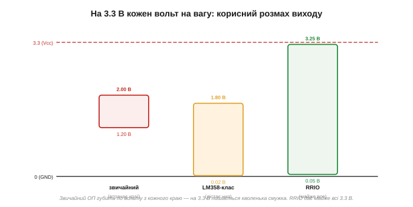
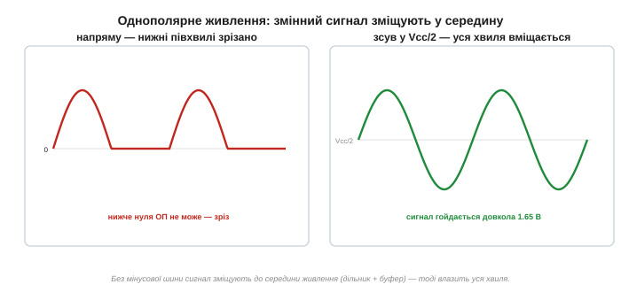

# Операційний підсилювач на 3.3 В: rail-to-rail і однополярне живлення

Операційний підсилювач (лат. *operatio* — дія, бо ним колись виконували математичні дії в аналогових обчислювачах; англ. *op-amp*) — це підсилювач із дуже великим коефіцієнтом, два входи якого порівнюються, а різниця множиться. На низьковольтній однополярній платі його вибір упирається не в підсилення, а в інше питання: чому звичайний ОП марнує більшість діапазону на живленні 3.3 В, що означають RRO/RRI/RRIO і як упоратися зі змінним сигналом, коли мінусової шини нема. Розмах виходу — це лише одна з [меж реального ОП](topic:electronics/real-opamp-limits), зате на 3.3 В вона стає головною.

### Клас задачі: одна низька шина

Сучасні плати живляться від **одної** низької шини — 3.3 чи 5 В, без мінусового джерела. Звідси два клопоти одразу: ОП мусить працювати **однополярно** (англ. *single-supply* — його «мінус» це земля), та ще й ощадливо розпоряджатися тими кількома вольтами, що є.

Звідки взагалі ця проблема? Класичний операційний підсилювач народився у світі ±15 В: лабораторні прилади, аудіо, аналогові обчислювачі. Там сигнал природно гойдається довкола нуля, а «голова» й «ноги» діапазону — за тридцять вольтів одна від одної. Embedded-світ інший: один літій-іонний елемент дає ~3.0…4.2 В, регулятор зрізає це до жорстких 3.3 В, і весь аналог мусить уміститися в цю вузьку щілину поряд із цифрою. Те, що на ±15 В було похибкою округлення, тут стає головним обмеженням. Тому перше питання, коли вибираєш ОП на плату, — не «який у нього коефіцієнт підсилення», а «скільки з моїх 3.3 В він узагалі віддасть».

> 🔧 **Навіщо це.** На платі з ESP32 аналогова частина (давачі, підсилювачі, опорні напруги) ділить ті самі 3.3 В із логікою. Якщо ОП губить третину діапазону на краях, ти втрачаєш третину роздільності АЦП ще до того, як сигнал доїде до перетворювача. Вибір rail-to-rail тут — не розкіш, а спосіб не викинути біти.

### Чому звичайний ОП марнує діапазон


*Звичайний вихідний каскад не дотягується до рейок — губить по вольту-півтора з кожного боку. На ±15 В (розмах 30 В) це дрібниця; а на 3.3 В катастрофа: лишається кволенька смужка. LM358-клас дістає до самого низу, але не до верху. RRIO віддає майже всі 3.3 В.*

Щоб зрозуміти, чому каскад не дотягується до рейок, треба заглянути в його вихід. У класичному ОП вихідний каскад зроблено на **двох біполярних транзисторах** (BJT), увімкнених повторювачами по схемі «push-pull»: верхній — NPN-емітерний повторювач, що «тягне» вихід угору до плюсової рейки, нижній — PNP, що «стягує» вниз. Емітерний повторювач за побудовою не може вивести емітер ближче до рейки, ніж на одне пряме падіння бази-емітера **V_BE ≈ 0.6–0.7 В**: щоб транзистор провідний, його база мусить сидіти на V_BE від емітера, а база живиться з тієї самої рейки. Додай сюди падіння на резисторах зміщення та струмовому дзеркалі — і верхівка губить близько вольта, низ — стільки ж. Ось звідки беруться ті «вольт-півтора з кожного боку»: це фізична плата за схему повторювача, а не недбалість виробника.

Rail-to-rail вихід будують інакше — на **транзисторах із спільним емітером/витоком** (common-source/common-emitter), увімкнених у режим «ключа на рейку». Тут між виходом і рейкою лишається не V_BE, а лише **напруга насичення**: для біполярного це **V_CE(sat)**, для MOSFET — спад на каналі **V_DS(on) = I·R_DS(on)**. На холостому ході це одиниці мілівольтів — вихід практично торкається рейки. Але насичення тримається лише доти, доки струм малий: щойно навантаження тягне більше, спад росте. Для біполярного V_CE(sat) повзе з десятків мВ до ~0.2–0.3 В; для MOSFET-виходу спад чесно лінійний — V_DS = I·R_DS(on), і саме тому даташит дає «output swing» завжди при конкретному струмі навантаження. «Rail-to-rail» означає «майже до рейки», а не «точно на рейці» — і та «майже» залежить від того, скільки ти з нього качаєш.

На ±15-вольтовому живленні втратити вольт-два — байдуже, бо їх там тридцять. А на 3.3 В той самий класичний каскад губить, скажімо, 1.2 В унизу й 1.3 В угорі — і з 3.3 В лишається менш ніж вольт корисного розмаху. Гірше того: чимало класичних ОП (741, TL072) взагалі **не запустяться** від 3.3 В — їхні внутрішні струмові дзеркала й опорні джерела складають по кілька V_BE «у стовпчик» і потребують щонайменше ~9–10 В між рейками; завжди перевіряй мінімальне живлення (V_S(min)) у даташиті.

### Що означає «rail-to-rail»

Є три різновиди, і їх легко переплутати:

- **RRO** *(rail-to-rail output)* — **вихід** гойдається майже до обох рейок;
- **RRI** *(rail-to-rail input)* — **входи** приймають увесь діапазон, аж до обох рейок;
- **RRIO** — і те, й те. Саме його зазвичай хочеться на низьковольтній однополярній платі.

Чому це різні речі? Бо вихідний і вхідний каскади ОП обмежені незалежно, кожен своєю фізикою. Вихід впирається в насичення вихідних транзисторів. А вхід обмежений тим, що [диференційна вхідна пара](topic:electronics/opamp-input-stage) (англ. *input differential pair*) сама потребує запасу напруги, щоб працювати. Класична вхідна пара — скажімо, на PNP-транзисторах — приймає сигнали від мінусової рейки і трохи вище, але «вгорі» їй бракує місця: щоб пара та її струмове джерело лишались у активному режимі, вхід мусить сидіти на 1–1.5 В нижче плюсової рейки. NPN-пара має дзеркальну ваду — добре дістає верх, але не доходить до землі. Тому LM358-клас із PNP-парою «бачить» землю, але не плюс.

Популярний **LM358-клас** — однополярний, вихід дістає майже до землі, але **не** до плюса; входи теж включають землю, та не верх. Це краще за «лише-двополярні» прилади, але ще не повний розмах — і тепер видно чому: і його вхідна PNP-пара, і його вихідний каскад мають запас лише з одного боку.

### Як RRI дістає обох рейок: дві вхідні пари

Якщо одна вхідна пара принципово не дістає однієї з рейок, як же RRI-вхід приймає **весь** діапазон? Хитрість у тому, що всередині таких ОП стоять **дві комплементарні вхідні пари** одночасно: PNP-пара, що добре працює біля землі, і NPN-пара, що добре працює біля плюса. Їхні виходи додаються. Поки вхідна напруга низька, тягне PNP-пара; коли вхід піднімається у верхню третину діапазону, до неї підключається (а нижня поступово гасне) NPN-пара. Десь у середині є зона, де працюють **обидві** — звідси й «rail-to-rail» по входу.

Але за це є плата, і саме вона породжує неприємний побічний ефект. Дві пари ніколи не бувають ідеально однаковими: у них трохи різний **вхідний зсув** (англ. *input offset*, V_OS) і різний напрямок вхідних струмів зміщення. У точці, де керування переходить від однієї пари до іншої (зазвичай ~1.2 В нижче плюсової рейки), ефективний V_OS стрибком змінюється — на десятки чи навіть сотні мікровольтів. Для логіки чи грубого вимірювання це невидимо; для точного підсилювача давача це раптовий злам передавальної характеристики саме посеред діапазону. Тому в прецизійних RRI застосовують або **схему компенсації** (англ. *compensation* — підгін зсуву другої пари), або **зарядову помпу** (англ. *charge pump*), що піднімає внутрішнє живлення вхідної пари вище плюсової рейки — тоді вистачає однієї пари на весь діапазон і стрибка нема зовсім.

> 🔧 **Навіщо це.** Якщо ти підсилюєш сигнал давача, що проходить через усю верхню частину діапазону (наприклад, повний хід тензодавача чи струмового шунта high-side), стрибок V_OS у точці переходу пар вилазить як «коліно» в калібрувальній кривій. Для логіки байдуже; для 16-бітного вимірювання бери RRI з charge-pump-входом або тримай робочу точку сигналу подалі від зони переходу.

### Як вибирати

Орієнтир простий — за тим, **куди** має дістати сигнал. Гнати в АЦП повні 0…3.3 В чи вихід має сягати обох країв — треба **RRO** (або RRIO). Міряти сигнал, що підходить і до землі, і до плюса, — треба **RRI** (або RRIO). Батарейна 3.3-В схема з повним розмахом — **RRIO** з низьким мінімальним живленням і мікроспоживанням. А якщо ваш сигнал спокійно живе в **середині** діапазону, далеко від рейок, — дешевого LM358-класу цілком досить, рейок-до-рейок не потрібно.

Інакше кажучи: rail-to-rail коштує грошей, шуму й іноді швидкості, тож купуй рівно стільки розмаху, скільки реально потребує сигнал. Питання «де живе мій сигнал відносно рейок» — головне; усе решта вторинне.

**Скільки розмаху я насправді втрачаю?**

```
Дано: ОП у схемі підсилення, живлення Vcc = 3.3 В, опір навантаження R_L = 2 кΩ.
Хочемо подати вихід на АЦП 12 біт із входом 0…3.3 В.

— Класичний (не R-R) вихід: губить ~1.1 В угорі + ~1.0 В унизу
    корисний розмах = 3.3 − 1.1 − 1.0          = 1.2 В
    частка діапазону                            = 1.2 / 3.3 ≈ 36 %
    ефективна роздільність АЦП = 4096 · 0.36    ≈ 1475 кодів  (~10.5 біта)

— RRIO з MOSFET-виходом, R_DS(on) ≈ 60 Ω при цьому струмі:
    струм у навантаження при розмаху до краю:
        I = (Vcc/2) / R_L = 1.65 / 2000           ≈ 0.83 мА
    спад до рейки      V_DS = I · R_DS(on)
                            = 0.00083 · 60          ≈ 0.05 В  (з кожного боку)
    корисний розмах = 3.3 − 0.05 − 0.05         = 3.20 В
    частка діапазону                            = 3.20 / 3.3 ≈ 97 %
    ефективна роздільність АЦП = 4096 · 0.97    ≈ 3973 коди   (~11.95 біта)
```

Висновок: на тих самих 3.3 В класичний каскад віддає лише ~36 % шкали — це фактично 10.5-бітний тракт на 12-бітному АЦП, понад біт викинуто на крайові втрати. RRIO віддає ~97 % і зберігає майже всю роздільність. Ось чому на низьковольтній платі вибір каскаду — це безпосередньо біти на виході перетворювача.

### Однополярний сигнал: зсув у середину

Окрема пастка однополярного живлення — **змінний** сигнал. Він природно гойдається і вгору, і вниз від нуля, але ОП без мінусової шини нижче землі вийти не може — і нижня півхвиля зрізається.


*Ліворуч: змінний сигнал напряму — усе, що нижче нуля, зрізано. Праворуч: сигнал зміщують до **середини** живлення (Vcc/2), і тоді вся хвиля вміщається між 0 і Vcc. Цю «віртуальну землю» роблять дільником, підпертим повторювачем.*

Чому саме зрізається? Бо вихід ОП фізично не має звідки взяти напругу нижче своєї найнижчої рейки — а тут найнижча рейка це земля, 0 В. Коли математика підсилювача вимагає від виходу, скажімо, −0.5 В, транзистори вже впираються в землю й далі не йдуть: вихід «прилипає» до нуля, і вся нижня півхвиля стає плоскою. Лікування класичне: сигнал **зміщують** (англ. *level-shift*) до середини живлення Vcc/2 — створюють «віртуальну землю» (англ. *virtual ground*) й коливаються вже довкола неї. Тепер «нуль» сигналу — це 1.65 В, і півхвиля, що раніше йшла в мінус, тепер просто опускається до 1.65 − амплітуда, лишаючись вище реальної землі.

Саму Vcc/2 роблять дільником із двох однакових резисторів, а щоб вона була жорсткою — підпирають [повторювачем](topic:electronics/voltage-follower). Тепер уся хвиля вкладається в діапазон 0…Vcc.

> 🔧 **Навіщо це.** Будь-який мікрофон, давач вібрації чи струмовий давач зі змінною складовою на 3.3-В платі мусить пройти через цей зсув до Vcc/2, інакше АЦП побачить лише верхні півхвилі, а низ — обрізаною «підлогою» нулів. Половину сигналу втрачено ще до оцифрування.

### Типові граблі

**«Вихід не дістає рейки»** — прилад не rail-to-rail; а навіть R-R падає на V_DS(on) чи V_CE(sat) від рейки під навантаженням, і цей спад росте зі струмом, бо це I·R_DS(on). Дивись «output voltage swing» у даташиті завжди при твоєму R_L. **Мінімальне живлення** — частина ОП від 3.3 В не запускається взагалі, бо її внутрішні каскади складають кілька V_BE у стовпчик; перевіряй V_S(min). **Стрибок на вході RRI** — у точці переходу між двома вхідними парами ефективний зсув V_OS змінюється стрибком на десятки-сотні мкВ; для точності біля цієї точки бери прилад із charge-pump-входом (одна пара на весь діапазон) або тримай сигнал подалі від зони переходу. **Квола віртуальна земля** — неперепертий дільник Vcc/2 просідатиме під будь-яким струмом навантаження, бо опір дільника не нульовий; буферуй його повторювачем. **Rail-to-rail не задарма** — за нього іноді платять зсувом, шумом чи швидкістю, тож не вимагай його там, де не треба.

### Варіації

LM358-клас — копійчаний однополярний для невибагливих сигналів у середині діапазону: PNP-вхід бачить землю, вихід дістає низ, верху бракує обом. Класичні двополярні (TL072, 741) — лише з ± рейками, інакше втратиш розмах, а часто й узагалі не запустяться від 3.3 В. Сучасний **RRIO** — типовий вибір для плат на 3.3/5 В, де потрібен повний розмах; усередині комплементарні вхідні пари й common-source-вихід. Мікроспоживні RRIO — для батарейних давачів, де важить кожен мікроампер струму спокою.

> 🔧 **Навіщо це.** Обираючи ОП на низьковольтну однополярну плату, спершу спитай: **куди має дістати сигнал?** До обох рейок — бери **RRIO**; лишається в середині — досить дешевого LM358-класу. Завжди перевір **мінімальне живлення** (чи запуститься від 3.3 В) і пам'ятай: для змінного сигналу без мінусової шини його зміщують до **Vcc/2** (буферованої віртуальної землі), інакше нижні півхвилі зріжуться.
