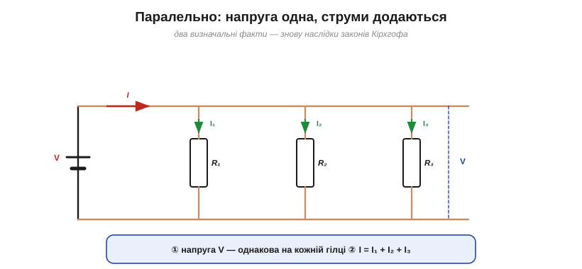
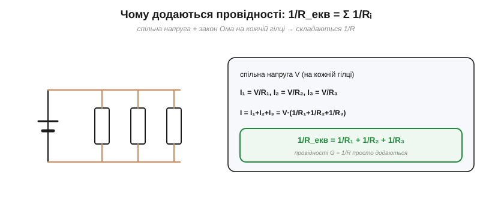
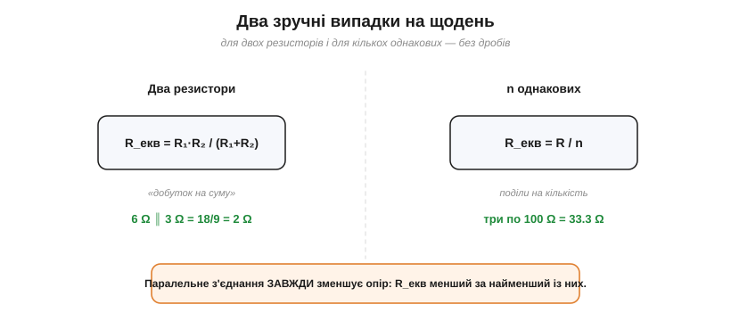
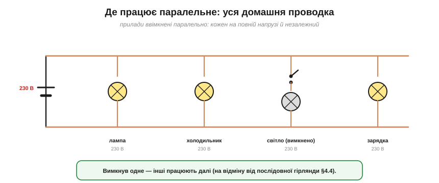

# Паралельне з'єднання

Друге наріжне з'єднання — **паралельне**: елементи ввімкнені між [тими самими двома вузлами](book:electronics/nodes-branches-loops), як сходинки драбини між двома поручнями. Це повна **протилежність** [послідовному](book:electronics/series-connection), і вся пара законів тут «дзеркалиться»: якщо в послідовному колі спільним є струм, то в паралельному спільною буде **напруга**.

### Два факти: спільна напруга, струми додаються


*Рис. Паралельне коло: усі елементи ввімкнені між тими самими двома вузлами. Звідси два факти — ① напруга V однакова на кожній гілці (закон напруг), ② повний струм дорівнює сумі гілкових, I = I₁ + I₂ + I₃ (закон струмів).*

**Перше: напруга на всіх однакова.** Кінці кожної гілки — це [ті самі два вузли](book:electronics/nodes-branches-loops), а між двома точками напруга одна (це випливає із [закону напруг](book:electronics/kvl)); тож на всіх паралельних елементах **однаковий** V. **Друге: струми додаються.** Загальний струм, дійшовши до вузла, **розгалужується** по вітках, а потім знову зливається: I = I₁ + I₂ + I₃ — це [закон струмів](book:electronics/kcl). Дзеркальна пара, що визначає паралельне з'єднання: **спільна напруга, сумарний струм**.

### Опір: провідності додаються

Тепер головне питання — який опір у всього пучка гілок? Відповідь теж «дзеркальна» до послідовної, тільки складаються вже не опори, а їхні **обернені величини**.


*Рис. Чому додаються провідності: напруга спільна, тож I = I₁+I₂+I₃ = V/R₁ + V/R₂ + V/R₃ = V·(1/R₁+1/R₂+1/R₃). Порівнявши з I = V/R_екв, дістаємо 1/R_екв = Σ1/Rᵢ — складаються обернені опори (провідності).*

Виведення коротке. Струм кожної гілки — за [законом Ома](book:electronics/ohms-law): I₁ = V/R₁, I₂ = V/R₂, I₃ = V/R₃ (напруга V **спільна**). Сума дає повний струм:

I = I₁ + I₂ + I₃ = V·(1/R₁ + 1/R₂ + 1/R₃).

Порівнявши з I = V/R_екв, дістаємо правило:

1/R_екв = 1/R₁ + 1/R₂ + 1/R₃ + …

Тобто складаються **обернені опори**. Зручно ввести **провідність** G = 1/R (одиниця — сименс, См): тоді паралельно провідності **просто додаються**, G_екв = G₁ + G₂ + …, — так само красиво, як опори в послідовному колі.

Тут добре видно повну **двоїстість** двох з'єднань: [у послідовному](book:electronics/series-connection) додаються опори (R_екв = ΣR), у паралельному — провідності (G_екв = ΣG); там спільний струм — тут спільна напруга; там напруга ділиться прямо — тут струм ділиться обернено. Знаючи одне з'єднання, ви фактично знаєте й друге — досить подумки поміняти місцями струм із напругою, а опір із провідністю.

### Зручні випадки: добуток/сума і R/n

Формула з дробами незручна для усного рахунку, тож варто знати два короткі випадки.


*Рис. Два зручні випадки: для **двох** резисторів R_екв = R₁·R₂/(R₁+R₂) («добуток на суму»); для **n однакових** R_екв = R/n. І головне правило: паралельне з'єднання завжди **зменшує** опір — R_екв менший за найменший із резисторів.*

Для **двох** резисторів дроби згортаються в зручну формулу **«добуток на суму»**: R_екв = R₁·R₂/(R₁ + R₂). Наприклад, 6 Ω і 3 Ω дають 18/9 = 2 Ω. Для **n однакових** резисторів — ще простіше: R_екв = R/n (три по 100 Ω — це 33.3 Ω). І запам'ятайте головне правило-перевірку: **паралельне з'єднання завжди зменшує опір**, тож R_екв виходить **меншим за найменший** із резисторів. Якщо у вас вийшло більше — десь помилка.

Чому опір неодмінно падає? Бо кожна нова паралельна гілка — це **додатковий шлях** для струму, а більше шляхів означає, що джерелу легше «проштовхнути» заряд. Додати гілку — однаково що розширити трубу: потік росте, спротив падає. Тому навіть величезний опір, поставлений паралельно до малого, трохи, але **зменшує** загальний.

### Струм ділиться обернено до опору

У [послідовному колі](book:electronics/series-connection) напруга ділиться **прямо** пропорційно опорам; у паралельному струм ділиться **обернено**: що менший опір гілки, то **більший** струм вона бере.


*Рис. Струм ділиться обернено до опору: менший опір (ширша «труба») бере більший струм. Тут 3 Ω і 6 Ω ділять 9 А як 6 А і 3 А. Зверніть увагу: у формулі частки стоїть опір ЧУЖОЇ гілки — це подільник струму.*

Інтуїція — водогінна: ширша труба (менший опір) пропускає більший потік. Формально для двох гілок I₁ = I · R₂/(R₁ + R₂) — зверніть увагу, що в чисельнику стоїть опір **сусідньої** гілки, тому поділ і виходить оберненим. Цей [**подільник струму**](book:electronics/current-divider) — дзеркало [подільника напруги](book:electronics/voltage-divider).

### Паралельні джерела

Дзеркально до [послідовних джерел](book:electronics/series-connection), які **додають** напруги, **паралельні** однакові джерела напруги її не підвищують, а **ділять навантаження** й продовжують час роботи. Два однакові акумулятори на 12 В, увімкнені паралельно, дають ті самі 12 В, а **за добре підібраної пари** — приблизно вдвічі більшу ємність і вдвічі більший віддаваний струм. Важлива пересторога: паралелити варто лише **справді однакові** джерела (та сама напруга, хімія, стан заряду, близькі внутрішні опори) — інакше між ними потече **зрівнювальний струм** (сильніше «тисне» на слабше), а це перегрів і шкода обом. Тому, скажімо, не варто з'єднувати паралельно стару й свіжу батарейки.

### Приклад і де це працює

**Приклад. Резистори 6 Ω і 3 Ω з'єднані паралельно під 12 В. Знайти еквівалентний опір і струми.**

```
Еквівалентний опір:  R_екв = 6·3/(6+3) = 18/9  = 2 Ω   (менший за 3 Ω!)
Струм у кожній:      I₁ = V/R₁ = 12/6  = 2 А
                     I₂ = V/R₂ = 12/3  = 4 А
Повний струм:        I = I₁ + I₂ = 2 + 4         = 6 А
Перевірка:           I = V/R_екв = 12/2          = 6 А  ✓
```

Менший опір (3 Ω) узяв **удвічі більший** струм (4 А проти 2 А) — як і має бути за оберненим поділом.


*Рис. Уся домашня проводка — паралельна: кожен прилад дістає повну напругу (230 В) і працює незалежно. Вимкнув світло — холодильник і зарядка працюють далі, на відміну від послідовної гірлянди.*

Найважливіше застосування паралельного з'єднання — **уся побутова й автомобільна проводка**. Розетки, лампи, прилади ввімкнені **паралельно**: кожен дістає повну напругу мережі (230 В) і працює **незалежно** від інших. Саме тому, вимкнувши світло, ви не гасите холодильник, а додавши ще один прилад, не змінюєте напруги на решті. Це пряма протилежність крихкій [послідовній гірлянді](book:electronics/series-connection), де обрив однієї ланки гасить усе.

Та сама логіка — у машині (усі споживачі паралельно на 12 В бортової мережі) і в розподільчому щитку, де кожну групу розеток боронить свій автомат. А коли споживачеві треба пропустити **великий струм**, ставлять кілька **паралельних** провідників: разом вони мають менший опір і витримують більший струм, ніж один тонкий дріт.

> 🔧 **Навіщо це.** Паралельне з'єднання — це **незалежність** і **більша пропускна здатність**. Незалежність: кожна гілка на повній напрузі, вимкнення однієї не чіпає інших (звідси вся проводка). Більша здатність: кожна додана гілка — це новий шлях для струму, тож загальний опір **падає**, а сумарний струм росте (тому товсті споживачі — це багато паралельних провідників). Паралельні резистори ще ставлять, щоб дістати **нестандартний** опір або **розподілити потужність** (тепло) між кількома деталями. Бачите елементи «між двома спільними точками» — одразу думайте «спільна напруга, струми й провідності додаються».

---

Отже, у **паралельному** колі напруга **спільна**, струми **додаються** (I = ΣIᵢ), а опір рахують через **провідності**: 1/R_екв = Σ(1/Rᵢ), причому R_екв завжди **менший за найменший**. Для двох гілок зручна формула «добуток на суму», для n однакових — R/n. Струм ділиться **обернено** до опору ([подільник струму](book:electronics/current-divider)). Паралельно ввімкнено всю проводку — заради незалежності й пропускної здатності.

---
