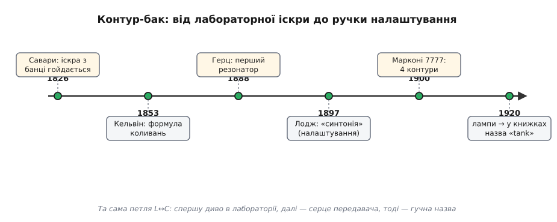

# 📜 Звідки взявся «бак»: як налаштований контур став серцем радіо

Слово незвичне для електроніки. Конденсатор, котушка, опір — усе це звучить технічно, по-науковому. А тут раптом **бак** (англ. *tank* — резервуар, цистерна). Парова машина має бак, водогін має бак, навіть військова машина зветься tank, бо перші такі возили під виглядом цистерн із водою. До чого тут пара паяних деталей, що дзвенить на одній частоті?

Назва не випадкова й не жартівлива. Вона народилася тоді, коли інженери вперше **відчули руками**, що цей контур поводиться як справжній резервуар — тримає в собі запас енергії, що плескається з боку в бік, і віддає його порціями. Щоб зрозуміти, чому саме «бак», а не якесь сухіше слово, треба пройти весь шлях: від іскри, що дзвенить у скляній банці, до ручки, якою крутять налаштування приймача. Шлях довгий — майже сто років — і повний суперечок про те, хто перший, чия ідея і як це взагалі назвати.


*Та сама замкнена петля L↔C проходить три життя: спершу — диво в лабораторії (іскра в банці Лейдена дзвенить туди-сюди), далі — серце іскрового передавача й приймача, і лише наприкінці, в епоху ламп, за нею закріплюється гучна назва «tank». Дати — за документованими публікаціями й патентами.*

## Іскра, що не хотіла гаснути одразу

Усе почалося з банки Лейдена — першого [конденсатора](book:electronics/capacitor), скляної банки з фольгою всередині й зовні, що могла накопичити заряд і боляче вдарити струмом. У 1820-х її розряджали залюбки: торкнули дротом — пробігла іскра, і начебто все.

> 🔧 **Навіщо це.** Банка Лейдена — це і є C нашого контуру, тільки в первісному, грубому вигляді. А дріт, яким її розряджають, — це L. Тобто перший «контур-бак» в історії склався випадково, з того, що було під рукою: банка плюс петля дроту. Хто це зрозумів, той тримав у руках майбутнє радіо, навіть не підозрюючи.

1826 року француз **Фелікс Савари** (фр. Félix Savary, 1797–1841) помітив дивне. Він розряджав банку Лейдена крізь дріт, обмотаний навколо сталевої голки, — і голка намагнічувалася. Але напрям намагнічення стрибав: то так, то інак, без видимої причини. Савари правильно здогадався, **чому**: розряд іде не одним поштовхом, а **гойдається** — струм біжить дротом туди, потім назад, потім знову туди, дедалі слабше, аж поки згасне. Кожен прохід перемагнічував голку у свій бік, і яким лишиться останній — справа випадку. (Статус: усталено — Савари вважають першим, хто описав коливальний характер розряду, хоч сам термін «коливання» він не вживав.)

Це був перший непрямий доказ, що пара «банка + дріт» **не просто розряджається**, а **дзвенить**. Голка слугувала первісним вимірником там, де ще не було ні осцилографа, ні навіть стрілкового приладу на такі швидкості. Геніально просто: магнітний слід замість миттєвого спостереження.

1842 року американець **Джозеф Генрі** (англ. Joseph Henry) незалежно повторив і підтвердив це: розряд банки — коливальний. А справжню ясність дав 1853 року **Вільям Томсон** (англ. William Thomson, згодом лорд Кельвін). Він вивів математично, що банка, розряджаючись крізь індуктивність, **мусить** коливатися, і знайшов частоту цих коливань — ту саму формулу, на якій ми стоїмо досі:

```
f₀ = 1 / (2π · √(L·C))
```

Відтоді стало зрозуміло: коливання — не примха, а **закон**. Частота задана геометрією — скільки ємності, скільки індуктивності. (Статус: усталено; цю залежність часто звуть формулою Томсона.) Сам [резонанс L·C](book:electronics/lc-resonance) — рівність реактивних опорів котушки й конденсатора — це і є фізичне серце всього, що буде далі.

Та поки що це лишалося лабораторним дивом. Іскра дзвенить — і що? Нікому ще не спадало на думку, що в цьому дзвоні можна **передати думку через простір**.

## Герц: іскра, яку почули за стіною

Перелам стався наприкінці 1880-х, і зробив його німецький фізик **Генріх Герц** (нім. Heinrich Hertz, 1857–1894). Він не шукав радіо — він перевіряв теорію Максвелла, що електромагнітні хвилі взагалі існують. Але для цього йому довелося побудувати перший у світі **навмисний** контур-випромінювач.

Герцова установка — це по суті наш контур, розпрямлений у простір. Два металеві стрижні з кульками на кінцях (кульки — ємність, стрижні — індуктивність), а посередині **іскровий проміжок**. Котушка Румкорфа подавала тисячі вольтів, проміжок пробивало іскрою — і в цю мить контур починав дзвеніти на своїй частоті, випромінюючи хвилю. (Герц отримав частоти від десятків до сотень мегагерців.) А за кілька метрів стояв **приймач** — проста дротяна петля з мікроскопічним проміжком. Коли петлю налаштовували на ту саму частоту, у ній проскакувала своя іскорка. Енергія перелетіла простір.

Найважливіше для нашої історії — **дрібниця**, яку легко проґавити. Іскра в приймачі проскакувала **тільки тоді**, коли його петля була налаштована **в лад** із передавачем. Розладнаєш розміри — і нічого. Це й був перший наочний доказ, що контур **вибирає** свою частоту й глухий до чужих. Уся майбутня радіоручка вже сиділа тут, у цій вибірковості, — лишалося її приручити.

> 🔧 **Навіщо це.** Те, що Герц побачив між двома петлями — «відгукується лише на свою частоту», — це і є та сама властивість, заради якої ми ставимо паралельний контур у приймач. Без неї всі станції злилися б в одну кашу. Вибірковість контуру — не зручність, а сама **умова** того, що радіо взагалі може працювати, коли в ефірі більше ніж один передавач.

Герц виміряв швидкість цих хвиль — і вона збіглася зі швидкістю світла. Теорію Максвелла було доведено. Сам Герц, кажуть, не бачив у своєму відкритті жодної користі: для нього це була чиста фізика. Користь побачили інші — і дуже швидко.

## Іскровий передавач: контур як насос енергії

Коли стало ясно, що іскрою можна слати сигнали, почалася гарячкова доба **іскрових передавачів** (англ. spark-gap transmitter). І саме тут наш контур із лабораторного дива перетворюється на **робочий вузол** — той, що працює день і ніч, а не раз на демонстрацію.

Розберімо, як він качає. Трансформатор накачує банку (конденсатор) високою напругою. Поки проміжок не пробитий, конденсатор тихо заряджається — енергія збирається. Коли напруга доросла до пробою, проміжок **спалахує іскрою** й перетворюється на провідник — і в цю мить замикається петля «конденсатор → котушка → іскра → назад». Накопичений заряд кидається крізь котушку, перезаряджає конденсатор у зворотний бік, той кидає його назад — і пішло гойдання з частотою f₀, поки іскра тримає проміжок відкритим. Котушка віддає це в антену, антена випромінює.

Ось ключ до назви. Інженери побачили, що контур поводиться **рівно як резервуар**:

- Спершу його **наповнюють** повільно (конденсатор заряджається від трансформатора) — як наливають бак.
- Потім **відкривають кран** (іскра замикає петлю) — і запас бурхливо **гойдається** туди-сюди, віддаючись в антену.
- А коли запас вичерпано, гойдання **згасає** саме собою — хвиля спадає до нуля. Це так звана **згасальна хвиля** (англ. damped wave): різкий сплеск, що швидко тане, точно як вода, виплеснута з бака, поступово заспокоюється.

Енергія в контурі обмежена тим, що встигли накопичити в конденсаторі, — далі тільки витрачання. Резервуар, який наповнили й вичерпали. Звідси й уся метафора: **бак запасає, бак віддає порцією, бак спорожнюється**.

А поряд народилася й точніша картина для **налаштованого** контуру, що дзвенить безперервно. Тут джерело (його звали **збудником**, англ. exciter) працює на нижчій частоті, лише **підштовхуючи** контур, а контур сам тримає високочастотні коливання, як бак тримає рівень води, поки в нього потроху доливають. Джерелу не треба наповнювати бак щоразу заново — лишається доливати ту краплину, що «випаровується» (покривати втрати). Контур виступає **накопичувачем-посередником** між повільним збудником і швидкою радіочастотою. (Статус: ця «резервуарна» інтуїція — стала пояснювальна модель раннього радіо; її переказують у багатьох технічних джерелах того часу.)

## Чому саме «бак», а не «маятник»

Тут варто чесно сказати, **що відомо, а що ні**. Точного дня, коли хтось уперше написав «tank circuit», і прізвища того, хто це слово вигадав, документально **не зафіксовано** — це не той випадок, де є патент чи стаття з датою. (Статус: правдоподібно-але-недоведено щодо конкретного авторства; усталено лише те, що термін усталився в англомовній радіотехніці й закріпився в епоху ламп, у 1920-х, коли іскрові передавачі вже поступалися ламповим.) Тому не приписуймо «бак» жодному окремому винахіднику — це було б вигадкою.

Зате походження **самої метафори** простежується ясно, і воно подвійне.

Перше — **фізична аналогія коливань**. Контур математично — той самий **гармонічний осцилятор**, що й маятник чи вода, яка хлюпає в посудині з боку в бік. Хитни маятник — він гойдатиметься зі своєю частотою, заданою довжиною; плесни воду в баку — вона колихатиметься зі своєю, заданою розмірами бака. Контур робить точно те саме: гойдає енергію між полем конденсатора й полем котушки зі своєю f₀, заданою L і C. Вода в баку — найнаочніший образ цього коливання, бо її **видно очима**. Тому «бак».

Друге — **поведінка резервуара енергії**, яку ми щойно розібрали на іскровому передавачі: наповнили, відкрили кран, гойднулося, спорожніло. Це не про частоту, а про **запас**: контур тримає енергію, як цистерна тримає рідину.

Обидва образи показують на одне й те саме — і саме тому назва прижилася. Але корисно бачити, **де аналогія ламається**. Справжній бак із водою має тертя об стінки, рідина в'язка, гойдання швидко глухне без підкачки — і це навіть **збігається** з реальним контуром, де опір проводу з'їдає енергію. А от чого в баку немає — це **двох різних коморах** для енергії. У контурі вона перетікає між **двома** сховищами зовсім різної природи: електричним полем конденсатора (запас у напрузі) і магнітним полем котушки (запас у струмі). Вода ж в одному баку має лише одну форму запасу. Тому «бак» добре передає **гойдання й резервуар**, але не передає того, що всередині — два танці, електричний і магнітний, по черзі. Як гострий цей резонанс, як довго бак тримає дзвін без підкачки — це міра [добротності Q](book:electronics/quality-factor): висока Q — бак майже без протікань, дзвенить довго.

## Хто приручив налаштування: Лодж, Марконі, суперечка про синтонію

Поки був один передавач, вибірковість нікого не турбувала — приймай що є. Біда прийшла, коли передавачів стало багато: їхні **згасальні хвилі** були широкосмугові, «брудні», вони перекривали одна одну, і в ефірі зчинявся хаос. Один сигнал глушив усі решта. Радіо ризикувало захлинутися ще до того, як стати на ноги.

Розв'язок був той самий, що Герц бачив між двома петлями: **зробити кожен передавач і приймач гострими на своїй частоті**, щоб вони чули лише «свій лад» і були глухі до чужого. Англійський фізик **Олівер Лодж** (англ. Oliver Lodge, 1851–1940) узявся за це впритул. Ще 1889 року він показав публіці досвід із **синтонічними банками** (англ. syntonic jars): два контури з банок Лейдена з підлаштовними котушками стояли поряд, і коли в одному збуджували іскру, у другому проскакувала своя — **тільки** якщо їх налаштовано в лад. Розладнаєш — мовчанка.

Лодж навіть наполягав на власному слові для цього явища — **синтонія** (англ. *syntony*, від гр. *syn* — разом, *tonos* — тон; буквально «співзвуччя»), на противагу «резонансу». Слово не прижилося — лишився **резонанс**, — але саму ідею Лодж 1897 року **запатентував**: налаштовані контури, що дають змогу вибрати один передавач із багатьох за частотою. (Статус: усталено; Лодж подав британські патенти на «синтонічне» налаштування 1897 року.) Це й була перша **ручка налаштування** в зародку: крути контур — обирай станцію.

Далі почалася доба патентних воєн, і тут треба бути точним, бо саме навколо налаштування зчинилося найбільше суперечок про першість. **Гульєльмо Марконі** (іт. Guglielmo Marconi) 1900 року отримав знаменитий британський патент **№ 7777** — «четвірка сімок» — на систему **чотирьох налаштованих контурів**: по два на передавачі й приймачі, що різко поліпшувало вибірковість і давало кільком станціям працювати поряд, не глушачи одна одну. Патент став основою комерційного радіо Марконі.

Та **ідея була не його одного**. Принцип налаштованих контурів виходив із роботи Лоджа (а ще раніше — з фізики Герца). 1911 року компанія Марконі **викупила** синдикат Лоджа-Мюрхеда, головним активом якого був саме Лоджів патент 1897 року на налаштування, — після судової справи, де визнали, що Марконі користувався Лоджевими методами. (Статус: усталено.) А ще раніше, на іншому боці океану, свої контури на налаштовану передачу патентував **Нікола Тесла** (серб. Nikola Tesla, народжений у тодішній Австрійській імперії, на території сучасної Хорватії). 1943 року **Верховний суд США** у справі *Marconi Wireless Telegraph Co. v. United States* визнав ключові «налаштувальні» претензії патенту Марконі **недійсними**, бо їх випереджали патенти Тесли (а також роботи Лоджа й Джона Стоуна). (Статус: усталено — це документоване судове рішення; **важлива тонкість** — суд вирішував питання **першості й чинності патенту на налаштовані контури**, а не оголошував «хто винайшов радіо». Радіо — колективний винахід, де поряд стоять Герц, Лодж, Марконі, Тесла, Браун, Попов, Бозе.)

> 🔧 **Навіщо це.** Уся ця бійка точилася саме навколо **нашого паралельного контуру** — за право робити приймач і передавач гострими на одній частоті. Тобто паралельний резонанс — не академічна тонкість, а той вузол, за який судилися найбільші імена доби. Коли ви ставите контур у вхідний каскад приймача, щоб вибрати канал, ви користуєтеся рівно тим, що Лодж назвав синтонією, а суди ділили десятиліттями.

## Браун, «вільне зчеплення» й чистіший дзвін

Лишалася ще одна біда. Згасальна хвиля іскрового передавача була надто широка частотою — навіть налаштований контур не міг зробити її по-справжньому вузькою, бо сама іскра щоразу різко збурювала контур і так само різко гасила його. Дзвін виходив коротким і «розмазаним» по спектру.

Тут вагомий внесок зробив німець **Карл Фердинанд Браун** (нім. Karl Ferdinand Braun, 1850–1918). Наприкінці 1899 року він показав: щоб дзвін був чистіший і довший (тобто хвиля — вужча частотою), контур з іскрою треба **слабко зчепити** з антеною — так зване **вільне зчеплення** (англ. loose coupling), коли два контури зв'язані не намертво, а ледь-ледь. Тоді енергія перетікає в антену **поступово**, контур дзвенить довше, а спектр звужується. (Статус: усталено; за цей і суміжні внески Браун розділив із Марконі Нобелівську премію з фізики 1909 року.)

Це довело інтуїцію «бака» до краю: добрий резервуар має **не виливатися весь одразу**, а віддавати запас плавно. Слабке зчеплення — це наче вузький кран на баку: вода (енергія) витікає поволі, рівень тримається довше, дзвін чистіший. Уся техніка налаштованих, слабко зчеплених контурів — це наука про те, **як правильно наповнювати й спорожняти бак**, щоб хвиля виходила вузькою й чистою.

## Попов, гроза й чесна межа внеску

Варто згадати ще одне ім'я, але **точно**, без перебільшень. Російський фізик **Олександр Попов** (рос. Александр Попов) 7 травня 1895 року показав Російському фізико-хімічному товариству прилад, що **виявляв** радіохвилі — спершу від грозових розрядів (грозовідмітник із когерером). (Статус: усталено щодо дати демонстрації приймача-детектора.) Попов — справжній піонер радіоприймання, і його місце в історії заслужене.

Але треба розрізняти **виміри внеску**. Попов будував чутливий **детектор** на когерері (трубка з ошурками, що змінює опір під дією хвилі) — це історія **приймального** боку. До **налаштованого паралельного контуру**, до тієї «резонансної ручки», що відрізняє станцію від станції за частотою, його ранній грозовідмітник прямого стосунку не має: він ловив будь-який достатньо сильний сплеск, а не **обирав** частоту. Тому, віддаючи Попову належне як піонерові приймача, не приписуймо саме йому контур-бак — це були б різні гілки історії, штучно зведені докупи. (Це окремий урок: радіо складалося з багатьох незалежних шматків — випромінювач, детектор, налаштування, — і їх давали різні люди в різних країнах.)

## Що лишилося від «бака» в нашому контурі

Іскрові передавачі відійшли в 1920-х — їх витіснили лампові, що давали **незгасальну**, чисту синусоїду замість «бризок» згасальної хвилі. Лампа сама підкачувала контур щоразу, тримаючи дзвін рівним і безкінечним. Бак уже не виливався — у нього **постійно доливали** рівно стільки, скільки витікало. І саме в цю, ламповоту добу назва **tank circuit** остаточно прижилася в книжках і креслениках.

Образ виявився живучим, бо влучний. У ламповому генераторі, у контурі колектора резонансного підсилювача, у супергетеродинному приймачі — усюди той самий бак: запас енергії, що гойдається в петлі L↔C, а активний прилад лише доливає краплину на втрати. Те, що сто років тому було загадковим перестрибуванням намагніченості голки Савари, стало буденною ручкою, якою кожен крутив налаштування свого приймача.

І коли тепер у схемі трапляється підпис **tank**, за ним стоїть уся ця історія: іскра, що дзвеніла в банці; хвиля, яку Герц почув за стіною; синтонія Лоджа; «четвірка сімок» Марконі й суди про першість; вузький кран Брауна. Сухе слово «паралельний контур» нічого цього не несе. А «бак» — резервуар, що набирає, гойдає й віддає енергію порціями — несе. Тому назва й лишилася.
