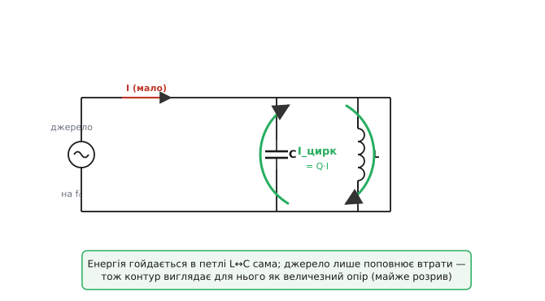
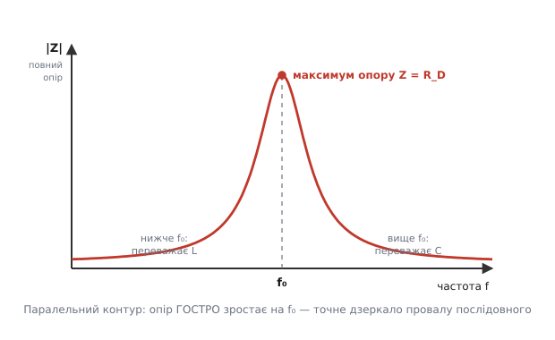
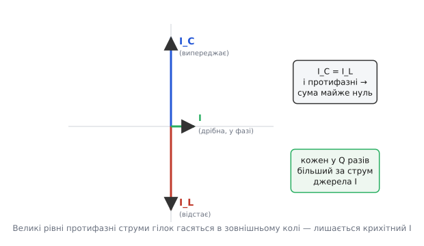
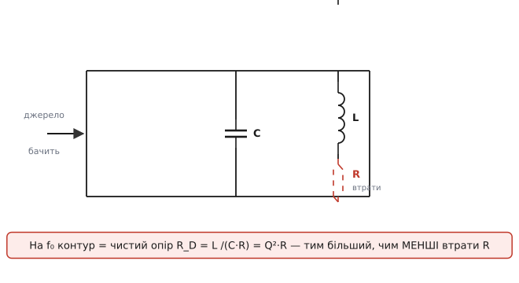

# Паралельний резонанс: контур-бак, що відштовхує свою частоту

З'єднаймо конденсатор і котушку **паралельно** й під'єднаймо до джерела змінного струму. На більшості частот це звичайне коло: щось крізь нього тече. Та є одна-єдина частота, де відбувається дивовижне — струм, який джерело **віддає** в контур, майже зникає, хоча всередині самого контуру струм у цей час величезний. Контур наче відмовляється брати енергію ззовні, а сам при цьому бурхливо «дзвенить». Цю частоту звуть **резонансною**, а саме явище — **паралельним резонансом**. На ньому стоять налаштовані каскади приймачів, генератори, [фільтри-пастки](topic:electronics/rlc-selectivity) — усе, де треба, щоб коло **вирізнило** одну частоту з-поміж усіх інших.

Парадокс — позірний, і коли його розкрутити до причини, паралельний резонанс стане прозорим. Розберімо, чому на одній частоті паралельний контур виглядає для джерела майже як **розрив**, звідки беруться оті величезні внутрішні струми й чому це робить контур ідеальним «ситом» для частот.

### Дзеркало послідовного резонансу

Сам [резонанс L·C](topic:electronics/lc-resonance) — це коли [реактивний опір конденсатора](topic:electronics/capacitive-reactance) і [реактивний опір котушки](topic:electronics/inductive-reactance) зрівнюються за величиною (Xc = XL) і, маючи [протилежні фази](topic:electronics/phase-shift), гасять одна одну. Частота, де це стається, та сама для будь-якого з'єднання:

```
f₀ = 1 / (2π · √(L·C))
```

Але **як саме** виявляється цей збіг — залежить від того, з'єднані C і L послідовно чи паралельно. І ці два випадки — точні дзеркала один одного.

У **послідовному** контурі обидва елементи стоять на шляху одного спільного струму. На f₀ їхні реактивності гасяться, сумарна реактивність падає до нуля, і коло перетворюється майже на **коротке замикання**: опір мінімальний, струм максимальний. Послідовний контур на резонансі **пропускає** свою частоту найкраще.

У **паралельному** все навпаки. Тут C і L — це дві окремі гілки під спільною **напругою**, кожна зі своїм струмом. На f₀ ці два струми виходять рівними за величиною й протилежними за фазою — і в зовнішньому колі вони **знищують** один одного. Джерело бачить, що з нього майже нічого не береться, тобто контур поводиться як **величезний опір** (майже розрив): опір максимальний, струм із джерела мінімальний.

Тож одна й та сама умова Xc = XL дає протилежні наслідки: послідовний контур стає «дротом», паралельний — «розривом». Це не випадковість, а глибока дуальність — те, що для струму є коротким замиканням в одній топології, для нього ж є розривом в іншій. Звідси й назви: послідовний резонанс часто звуть **резонансом напруг** (на елементах підскакує напруга), а паралельний — **резонансом струмів** (усередині підскакує струм). А ще паралельний контур звуть **загороджувальним** (англ. *rejector* — той, що відкидає): на своїй частоті він не пропускає струм, а відштовхує його.

### Контур-бак: енергія гойдається сама

Чому ж на f₀ джерело раптом майже перестає віддавати струм? Бо контур у цей момент **живиться сам із себе**.

Згадаймо, що таке резонанс по суті: енергія **гойдається** між полем конденсатора й полем котушки. Конденсатор розряджається в котушку, та перезаряджає його у зворотний бік, і так туди-сюди з частотою f₀ — точно як маятник перекидає енергію між висотою й рухом. У паралельному контурі ця гойданина замкнена в саму петлю L↔C: заряд біжить колом з однієї гілки в другу й назад, **не виходячи** в зовнішнє коло.


*На f₀ заряд гойдається в замкненій петлі між C і L — енергія перетікає з поля конденсатора в поле котушки й назад, не виходячи назовні. Зовнішньому джерелу лишається тільки поповнювати дрібні втрати, тож воно віддає крихітний струм. Для нього контур виглядає як величезний опір — майже розрив.*

Саме тому паралельний контур англійською зветься **tank circuit** — «бак», «резервуар». Він тримає в собі запас енергії, що плескається з боку в бік, як вода в баку. Джерелу не треба наповнювати цей бак щоразу заново — вода вже там гойдається; лишається лише доливати ту краплину, що випаровується (тобто покривати втрати в опорі). А якщо джерело віддає лише краплину струму на повну прикладену напругу — то для нього контур і є **великим опором** за законом Ома: малий струм при тій самій напрузі означає високий опір.

> 🔧 **Навіщо це.** Саме цей «бак» робить паралельний контур навантаженням резонансного підсилювача. Поставте контур у колектор транзистора замість звичайного резистора — і каскад дасть величезне підсилення **тільки** на f₀ (де опір контуру величезний), а на всіх інших частотах опір малий і підсилення нікчемне. Так одним контуром перетворюють широкосмуговий підсилювач на **вузькосмуговий**, налаштований на потрібний канал. Це серце кожного супергетеродинного приймача.

### Опір контуру: гострий пік на f₀

Накреслімо повний опір (модуль імпедансу) паралельного контуру від частоти — і побачимо точне дзеркало послідовного випадку.


*Повний опір паралельного контуру злітає до гострого максимуму рівно на f₀, а обабіч швидко спадає. Нижче f₀ переважає менший опір котушки, вище — менший опір конденсатора; обидві гілки шунтують контур і притискають опір донизу. Лише на f₀ вони гасять одна одну, і опір сягає вершини. Це дзеркало провалу опору в послідовному контурі.*

Прочитаймо картину причинно. Поза резонансом одна з гілок завжди має **малий** реактивний опір — і саме вона, як менший опір у [паралельному з'єднанні](topic:electronics/parallel-connection), визначає поведінку: контур шунтований, його сумарний опір малий. Нижче f₀ менший опір у котушки (її XL росте від нуля), вище f₀ менший опір у конденсатора (його Xc спадає до нуля) — і там, і там одна гілка «закорочує» іншу, тримаючи повний опір низьким. І лише в точці f₀ обидві реактивності рівні: жодна гілка не закорочує контур, їхні струми взаємно гасяться — і опір стрімко злітає до максимуму.

На самій вершині реактивна частина зникає (струми гілок гасяться), тож контур на f₀ поводиться як **чистий опір** — струм і напруга знову [в фазі](topic:electronics/phase-shift), як у резисторі. Цей опір на резонансі має власну назву — **динамічний опір** (англ. *dynamic resistance*), і до його величини ми зараз дійдемо. Поки що головне: чим гостріший цей пік, тим краще контур відрізняє свою частоту від сусідніх — а це і є [частотна вибірковість](topic:electronics/rlc-selectivity), основа фільтрів. Наскільки гострий пік, задає [добротність Q](topic:electronics/quality-factor): висока Q — вузький високий шпиль, низька — широкий пологий горб.

### Резонансна частота — і чесна тонкість про опір

Для ідеального контуру (без втрат) резонансна частота — та сама знайома:

```
f₀ = 1 / (2π · √(L·C))
```

Вона залежить **тільки** від добутку L·C. Більші L чи C — нижча f₀, менші — вища; під коренем, тож щоб подвоїти частоту, треба зменшити L·C учетверо. Опору в цій формулі немає.

Але реальна котушка завжди має опір обмотки R, увімкнений послідовно з її індуктивністю. У послідовному контурі цей опір впливає лише на гостроту (на Q), а саму f₀ не зсуває. А от у паралельному контурі, де R сидить у гілці котушки, він **трохи** зсуває точку, де струми гілок ідеально гасяться. Точна резонансна частота такого «реального бака» виходить дещо нижчою:

```
f₀ = (1 / 2π) · √( 1/(L·C) − R²/L² )
```

Не лякаймося цього виразу — у ньому проста думка. Якщо опір малий (а в добротних контурах він малий), доданок R²/L² мізерний проти 1/(L·C), і формула зводиться до звичної f₀ = 1/(2π√(LC)). Поправка стає помітною лише за **великих** втрат (низької Q). Тобто практичне правило незмінне: для будь-якого пристойного контуру беремо f₀ = 1/(2π√(LC)), а повну формулу тримаємо в пам'яті як чесне нагадування, що за дуже «брудного» контуру резонанс трохи сповзає вниз. Виведення цього зсуву й точний зв'язок із Q — окрема [математична викладка](topic:electronics/parallel-resonance/math-parallel-resonance.md).

**Приклад (контур приймача).** Котушка L = 100 мкГн з опором обмотки R = 5 Ом і конденсатор C = 250 пФ. Де резонанс?

```c
// f0 = 1/(2*pi*sqrt(L*C)) — ідеальна формула, бачимо чи годиться
double L = 100e-6;          // 100 мкГн
double C = 250e-12;         // 250 пФ
double R = 5.0;             // опір обмотки
double f0 = 1.0 / (2*M_PI*sqrt(L*C));   // ≈ 1.007 МГц

// перевіримо поправку на R: член R^2/L^2 проти 1/(L*C)
double a = 1.0/(L*C);                    // 4.0e13
double b = (R*R)/(L*L);                  // 2.5e9  — у ~16000 разів менший
double f0_real = (1.0/(2*M_PI))*sqrt(a - b);  // теж ≈ 1.007 МГц
```

Доданок R²/L² = 2.5×10⁹ проти 1/(L·C) = 4.0×10¹³ — менший у шістнадцять тисяч разів. Поправка губиться в п'ятому знаку: і ідеальна, і точна формула дають ту саму ≈ 1.01 МГц. Ось чому на практиці опором обмотки в розрахунку f₀ просто нехтують — він важить для гостроти, а не для самої частоти.

### Резонанс струмів: усередині все вирує

Тепер — найдивовижніше. Якщо джерело віддає крихітний струм, **звідки** в контурі великі струми, про які весь час ідеться?

Згадаймо, що C і L увімкнені паралельно, тобто під **спільною напругою** U. Кожна гілка несе свій струм за законом Ома для реактивності: через конденсатор тече Ic = U / Xc, через котушку — IL = U / XL. На резонансі Xc = XL, тож обидва ці струми **рівні за величиною**. А оскільки [конденсатор зсуває струм на чверть періоду вперед, а котушка — на чверть назад](topic:electronics/phase-shift), ці рівні струми ще й **протифазні** — спрямовані строго назустріч.


*Струм конденсатора Ic випереджає напругу на чверть періоду, струм котушки IL — на стільки ж відстає. На f₀ вони рівні за величиною й точно протилежні, тож у зовнішньому колі їхня сума майже нуль — джерело віддає лише крихітний синфазний струм I на покриття втрат. Але самі Ic та IL при цьому в Q разів більші за цей I: великий струм просто циркулює по петлі між C і L.*

Ось і розв'язка парадокса. Два великі рівні протифазні струми **циркулюють по петлі** між C і L, перетікаючи з гілки в гілку. У зовнішнє коло вони майже не виходять, бо в кожну мить один тече «туди», а другий «звідти» — вони замикаються самі на себе всередині контуру. Джерелу лишається доливати тільки ту дещицю, що губиться в опорі. Тому струм **усередині** контуру величезний, а струм **ззовні** мізерний — це не суперечність, а два різні струми.

У скільки ж разів внутрішній струм перевищує зовнішній? Рівно в **Q** разів — це і є [добротність](topic:electronics/quality-factor) контуру:

```
I_цирк / I_джерела = Q
```

Це явище звуть **підсиленням струму** (current magnification), і воно — точне дзеркало того, як у послідовному контурі напруга на елементах перевищує вхідну в Q разів. Там Q множить напругу, тут — струм. Контур із Q = 100, що бере 1 мА із джерела, ганяє всередині по петлі L↔C цілих 100 мА.

> 🔧 **Навіщо це.** Цей циркулюючий струм у Q разів — не абстракція, а те, на що проєктувальник дивиться щодня. Дроти, доріжки й самі компоненти контуру мусять витримувати **повний** внутрішній струм Q·I, а не дрібний струм живлення. У потужному резонансному перетворювачі чи в [генераторі](topic:electronics/pierce-oscillator) це означає товщий дріт котушки, конденсатори на більший струм пульсацій і реальний нагрів елементів — хоча ватметр на вході показує небагато. Проґавите підсилення струму — і котушка перегріється, а конденсатор здеградує, попри «скромне» споживання.

### Динамічний опір: чим менші втрати, тим вищий пік

Лишилося поставити число на висоту піка — на той самий **динамічний опір** R_D, що його контур показує джерелу на f₀. Він виходить навдивовижу простим:

```
R_D = L / (C · R)
```

де R — опір втрат (головно опір обмотки котушки). Прочитаймо цю формулу — вона дуже промовиста. Опір R стоїть у **знаменнику**: що менші втрати, то **вищий** динамічний опір, тобто гостріший і вищий пік. Ідеальний контур без втрат (R → 0) мав би R_D → нескінченність — на резонансі він був би справжнім розривом. Реальні втрати притискають пік до скінченної висоти.

Той самий R_D можна записати ще красномовніше — через [добротність](topic:electronics/quality-factor):

```
R_D = Q² · R = Q · X₀     (де X₀ = ω₀·L = 1/(ω₀·C) — реактивність на f₀)
```

Опір контуру на резонансі в **Q² разів** більший за опір втрат! Ось чому навіть звичайна котушка з кількома омами обмотки дає на резонансі контур із опором у десятки кілоом: добротність входить у квадраті. Це робить паралельний контур таким сильним вибірковим навантаженням.


*У реальному контурі опір втрат R сидить послідовно з котушкою (опір обмотки). На f₀ контур поводиться як чистий опір R_D = L/(C·R) = Q²·R, який джерело й бачить. Менші втрати R дають вищий R_D і гостріший пік: добротність входить у квадраті, тож навіть кілька омів обмотки обертаються на десятки кілоом опору контуру.*

**Приклад (динамічний опір і підсилення струму).** Той самий контур: L = 100 мкГн, C = 250 пФ, опір обмотки R = 5 Ом, f₀ ≈ 1.01 МГц. Яким контур постане перед джерелом і який струм вирує всередині?

```c
double L = 100e-6, C = 250e-12, R = 5.0;
double w0 = 1.0 / sqrt(L*C);        // кутова частота, ≈ 6.32e6 рад/с
double X0 = w0 * L;                  // реактивність на f0: ≈ 632 Ом

double Q  = X0 / R;                  // добротність: 632/5 ≈ 126
double Rd = L / (C * R);             // динамічний опір: 100e-6/(250e-12*5)
//        = 1e-4 / 1.25e-9 ≈ 80 000 Ом  (= Q^2*R = 126^2*5 ≈ 79 000 Ом)

// якщо джерело на f0 віддає в контур I = 1 мА:
double I_src  = 1e-3;
double I_circ = Q * I_src;           // циркулюючий струм ≈ 126 мА
double U_tank = I_src * Rd;          // напруга на контурі ≈ 80 В
```

Розгляньмо результат. Опір обмотки лише 5 Ом — а контур показує джерелу аж **80 кОм** (бо Q ≈ 126, і Q² множить ті 5 Ом). Струм живлення 1 мА розгойдує всередині петлі **126 мА** — у Q разів більше. І ця ж дещиця струму на велетенському динамічному опорі піднімає на контурі **80 В** з мізерного входу. Усе це — на одній-єдиній частоті f₀; зсуньтеся вбік — і опір обвалиться, струми вщухнуть, напруга спаде. Саме так контур виокремлює свою частоту: він озивається на неї всім — високим опором, великим внутрішнім струмом, високою напругою, — і майже мовчить на решту.

### Що з усього цього випливає

Зведімо причинно-наслідковий ланцюг у єдину картину. Паралельний контур на f₀ — це **бак** із гойданою енергією: великі струми циркулюють у петлі L↔C самі по собі, із джерела беручи лише дещицю на втрати. Тому для джерела він виглядає як **чистий і дуже високий опір** R_D = L/(C·R) = Q²·R — гострий пік, дзеркальний до провалу опору в послідовному контурі. Усередині струми в **Q разів** більші за вхідний (підсилення струму). Резонансна частота — та сама f₀ = 1/(2π√(LC)), а опір лише **трохи** зсуває її вниз, і то помітно тільки за низької Q.

Найкоротше так: послідовний контур на своїй частоті **пропускає** (стає дротом), паралельний — **відштовхує** (стає розривом). Обидва однаково вибіркові до f₀, просто з різних боків. Який обрати — диктує задача: треба **виокремити** частоту як навантаження підсилювача чи **загородити** її від проходження — берімо паралельний; треба **пропустити** свою частоту крізь себе або **закоротити** чужу в землю — берімо послідовний.

> 🔧 **Навіщо це.** Де ви зустрінете паралельний резонанс на практиці. По-перше, **налаштоване навантаження** підсилювачів і генераторів: контур у колекторі дає величезний опір (тобто велике підсилення) тільки на f₀ — так роблять вузькосмугові каскади приймачів і задавальні контури [генераторів](topic:electronics/pierce-oscillator). По-друге, **загороджувальний фільтр** (notch / trap): паралельний контур, увімкнений у розрив сигнального тракту, не пропускає свою частоту — ним «вирізають» заваду чи небажану несучу. По-третє, паразитний паралельний резонанс **сам заводиться** там, де його не кликали: будь-яка котушка (дросель живлення, обмотка) має власну ємність між витками, і на якійсь високій частоті ця пара дзвенить — звідси несподіваний пік опору дроселя й «дзвін» у вимикальних колах. Побачили на високій частоті незрозумілий горб імпедансу — підозрюйте паразитний LC-бак і шукайте його f₀ за тією самою формулою.

> 🧮 **Математична вставка:** [паралельний резонанс через [адмітанс](topic:electronics/admittance) — виведення R_D, точної f₀ і Q](topic:electronics/parallel-resonance/math-parallel-resonance.md). Через провідності гілок: умова нульової реактивної частини адмітансу дає f₀ зі зсувом −R²/L², звідки чисто виходять R_D = L/(C·R) = Q²·R і зв'язок підсилення струму з Q; плюс чому за низької Q пік не лише нижчий, а й трохи зсунутий.

> 📜 **Історична вставка:** [контур-бак і «tank circuit» — звідки назва й перші налаштовані кола](topic:electronics/parallel-resonance/hist-tank-circuit.md). Як паралельний контур став серцем іскрових передавачів і перших приймачів, чому інженери прозвали його «баком», і як резонанс струмів із лабораторної цікавинки перетворився на ручку налаштування радіо.
