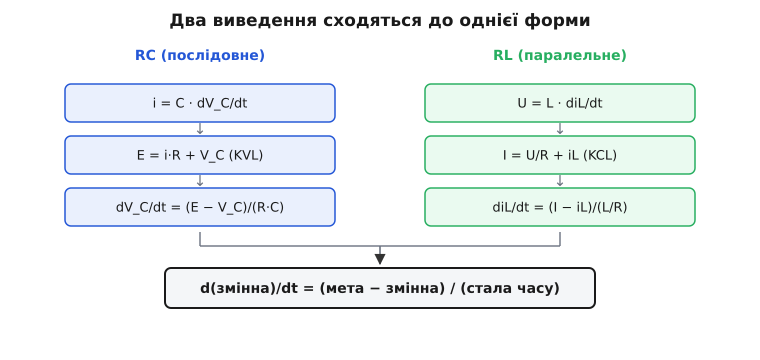
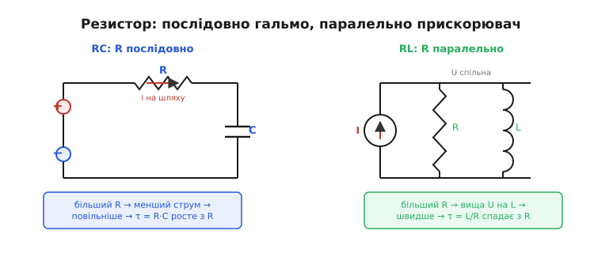

# 🧮 Двоїстість RL ↔ RC: одне рівняння, переставлені літери

Чому згасання струму в паралельному RL-колі виглядає **точнісінько** як розряд конденсатора через резистор — та сама спадна експонента, та сама стала часу, ті самі 37% за один крок? Відповідь не в схожості картинок, а глибша: обидва кола підкоряються **буквально одному й тому ж** диференціальному рівнянню першого порядку. Не схожому — тому самому, з точністю до того, які літери стоять на місцях. Тут ми виведемо це рівняння для кожного кола окремо, від рівнянь котушки й конденсатора, покладемо обидва виведення поряд і побачимо, що різниця між ними — суто **перейменування символів**. Звідси випаде повний словник перекладу (струм ↔ напруга, L ↔ C, паралельно ↔ послідовно), і стане зрозуміло, чому стала часу τ = L/R перетворюється на τ = R·C, а роль резистора при цьому **вивертається навиворіт**.

Це не самоціль і не математичний фокус. Двоїстість — це інструмент економії думки: довівши щось одне про RC-кола раз, ви безкоштовно дістаєте дзеркальне твердження про RL-кола, не повторюючи жодного кроку. Половину електроніки можна тримати в голові, бо друга половина — її точне відображення.

---

## Що означає «двоїстість» точно

Слово двоїстість (лат. *dualis* — той, що з двох, парний) у фізиці й математиці означає не просто «схожість». Воно означає, що існує **строге правило заміни** — словник, — який перетворює кожне правдиве твердження про одну систему в правдиве твердження про іншу, і навпаки. Не «приблизно схоже», а взаємно-однозначна відповідність: кожному поняттю тут відповідає рівно одне поняття там, кожному рівнянню — рівно одне рівняння, кожному висновку — рівно один висновок.

Якщо такий словник існує, то він робить дивовижну річ. Вам не треба окремо вивчати другу систему. Ви берете будь-який доведений факт про першу, механічно замінюєте кожне слово за словником — і дістаєте доведений факт про другу, без жодного нового доведення. Доведення «переноситься» разом зі словами, бо структура міркування не змінилася, змінилися лише назви.

Саме такий словник пов'язує паралельне RL-коло з послідовним RC. І щоб довести, що він справді працює — що це не випадковий збіг двох графіків, — треба зробити дві речі. По-перше, вивести рівняння кожного кола **з нуля**, від означень котушки й конденсатора, не підглядаючи у відповідь. По-друге, покласти два рівняння поряд і показати, що вони **тотожні за формою**: відрізняються лише іменами величин. Якщо форма одна — словник доведено, і вся решта випливає сама.

> 🔧 **Навіщо це.** Розробник, який зрозумів двоїстість, удвічі швидший. Побачивши паралельне RL із гасним резистором на котушці реле, він не починає аналіз спочатку — він каже собі «це дзеркало розряду RC» і миттєво знає форму спаду, сталу часу й те, як її змінити. І навпаки: знаючи, як підібрати RC-затримку, він тим самим знає, як підібрати RL-затримку. Один вивчений шаблон обслуговує два сімейства схем.

---

## Спершу — рівняння конденсатора (бік RC)

Почнімо з боку, який більшість людей знає краще, — зарядки конденсатора через резистор. Конденсатор і резистор стоять **послідовно**, увімкнені до джерела напруги E. Через них тече **спільний струм** i (послідовне коло не дає струмові куди розгалузитися). Випишемо три факти, кожен — означення, не здогад.

Перший факт — про конденсатор. [Заряд конденсатора пропорційний напрузі на ньому](topic:electronics/capacitance): Q = C·V_C. Струм — це швидкість зміни заряду (i = dQ/dt), тож, продиференціювавши, дістаємо означальне рівняння конденсатора:

```
i = C · dV_C/dt
```

Прочитайте його як висловлювання про темп: струм у колі **диктує швидкість зростання напруги** на конденсаторі. Більший струм — швидше росте V_C. Нульовий струм — напруга стоїть. Саме тому напруга на конденсаторі не може стрибнути: стрибок означав би нескінченну швидкість dV_C/dt, а для неї потрібен нескінченний струм, якого джерело дати не може.

Другий факт — [закон напруг Кірхгофа](topic:electronics/kvl) для контуру: сума напруг по замкненому колу дорівнює нулю, тобто напруга джерела розкладається на спад на резисторі плюс напругу на конденсаторі:

```
E = i·R + V_C
```

Третій факт — [закон Ома](topic:electronics/ohms-law) для резистора, уже вбудований вище як i·R.

Тепер з'єднаймо їх в одне рівняння на одну невідому. Підставимо вираз струму i = C·dV_C/dt у рівняння контуру:

```
E = R·C · dV_C/dt + V_C
```

Перегрупуймо, виразивши похідну окремо:

```
dV_C/dt = (E − V_C) / (R·C)
```

Зупинімося й прочитаймо це вголос, бо тут уся суть. Зліва — **темп зміни** напруги на конденсаторі. Справа — **залишок** (E − V_C), тобто скільки ще бракує до кінцевого значення E, поділений на сталу R·C. Рівняння каже буквально: **швидкість наближення пропорційна тому, скільки лишилося пройти**. Що ближче V_C до мети E, то менший залишок, то повільніше зміна — тому наближення сповільнюється, ніколи різко не обриваючись. Це і є форма, що породжує експоненту.

---

## Тепер — рівняння котушки (бік RL)

Зробімо те саме для паралельного RL, не підглядаючи в попередній результат. Резистор і котушка стоять **паралельно**, увімкнені до джерела струму I. На обох гілках — **спільна напруга** U (паралельне коло підвішує їх до однієї пари вузлів). Знову три факти-означення.

Перший факт — про котушку. [Котушка опирається зміні свого струму](topic:electronics/inductance): напруга на ній пропорційна швидкості зміни струму крізь неї. Це означальне рівняння котушки:

```
U = L · diL/dt
```

Прочитайте його дзеркально до конденсаторного: напруга на котушці **диктує швидкість зростання струму** крізь неї. Більша напруга — швидше росте iL. Нульова напруга — струм стоїть. Тому струм крізь котушку не може стрибнути: стрибок вимагав би нескінченної diL/dt, а отже нескінченної напруги, якої взяти нізвідки.

Другий факт — [закон струмів Кірхгофа](topic:electronics/kcl) для вузла: сума струмів, що сходяться у вузол, дорівнює нулю, тобто струм джерела розходиться на струм резистора плюс струм котушки:

```
I = iR + iL
```

Третій факт — [закон Ома](topic:electronics/ohms-law) для резистора, тепер у формі провідності: струм резистора — це напруга, поділена на опір, iR = U/R.

З'єднаймо. Котушка задає напругу U, ця ж напруга стоїть на резисторі, тож iR = U/R = (L·diL/dt)/R. Підставимо це у вузлове рівняння:

```
I = (L/R) · diL/dt + iL
```

Виразимо похідну окремо:

```
diL/dt = (I − iL) / (L/R)
```

І прочитаймо так само вголос. Зліва — **темп зміни** струму котушки. Справа — **залишок** (I − iL), скільки ще бракує струмові котушки до кінцевого значення I, поділений на сталу L/R. Дослівно: **швидкість наростання струму пропорційна тому, скільки струму ще не перейшло в котушку**. Що ближче iL до мети I, то менший залишок, то повільніше наростання.

Зверніть увагу, що ми ні разу не озирнулися на конденсаторне виведення. Ми йшли від означення котушки, закону струмів і закону Ома — і прийшли до тієї самої граматичної конструкції «темп = залишок / стала». Збіг? Покладімо їх поряд.

---

## Два виведення поряд: та сама форма

Випишемо обидва підсумкові рівняння одне під одним і вирівняймо по структурі:

```
RC (послідовне):   dV_C/dt = (E − V_C) / (R·C)
RL (паралельне):   diL/dt  = (I − iL)  / (L/R)
```

Це **одне рівняння**, написане двічі. Структура в обох однакова до останнього символу:

```
d(ЗМІННА)/dt = (МЕТА − ЗМІННА) / (СТАЛА ЧАСУ)
```

Тепер — пряме зіставлення, член за членом. Що грає роль «змінної, яка не стрибає»? У RC це **напруга** V_C; у RL це **струм** iL. Що грає роль «мети, яку нав'язує джерело»? У RC — **напруга** E джерела напруги; у RL — **струм** I джерела струму. Що грає роль сталої часу? У RC — добуток **R·C**; у RL — частка **L/R**. Випишемо ці відповідності в стовпчик:

```
RC                  RL
─────────────────────────────────
V_C   (напруга)  ↔  iL   (струм)
E     (напруга)  ↔  I    (струм)
C                ↔  L
R·C              ↔  L/R
послідовно       ↔  паралельно
KVL (контур)     ↔  KCL (вузол)
```


*Дві колонки виведення сходяться до однієї формули. Ліворуч (RC) — від i = C·dV/dt через закон напруг Кірхгофа до dV_C/dt = (E−V_C)/RC. Праворуч (RL) — від U = L·di/dt через закон струмів Кірхгофа до diL/dt = (I−iL)/(L/R). Нижній рядок однаковий для обох: темп зміни дорівнює залишку до мети, поділеному на сталу часу.*

Ось і доведено головне. Два кола описуються **тотожним за формою** рівнянням, у якому досить замінити кожен символ лівої колонки на парний справа — і виведення RC дослівно перетворюється на виведення RL. Словник перекладу не вигаданий і не підігнаний: він **випав сам** із двох незалежних виведень, бо означальні рівняння котушки (U = L·di/dt) і конденсатора (i = C·dV/dt) — самі дзеркальні, з переставленими U та i, L та C.

> 🔧 **Навіщо це.** Це той момент, заради якого варто було рахувати. Тепер будь-яка формула, яку ви знаєте для RC, читається як формула для RL простою заміною за словником — і навпаки. Не треба пам'ятати дві таблиці; досить однієї та правила перекладу. На практиці це означає, що інженер, який звик до RC-затримок у таймерах, миттєво володіє RL-затримками в драйверах котушок, бо це той самий апарат «іншою мовою».

---

## Розв'язок — теж один, перекладений

Раз рівняння одне, то й розв'язок один. Розв'яжімо абстрактну форму один-єдиний раз, а тоді перекладемо в обидва боки.

Маємо рівняння d**x**/dt = (X∞ − **x**)/τ, де **x** — змінна, X∞ — її кінцеве (усталене) значення, τ — стала часу. Заміна змінної на «залишок» y = X∞ − **x** спрощує його до чистого вигляду: оскільки X∞ — стала, dy/dt = −d**x**/dt = −y/τ, тобто

```
dy/dt = − y/τ
```

Це найвідоміше рівняння природознавства: **швидкість зменшення пропорційна самій величині**. Його розв'язок — спадна експонента y = y₀·e^(−t/τ), бо саме в експоненти похідна пропорційна їй самій. Повернувшись до **x** = X∞ − y, дістаємо загальний розв'язок:

```
x(t) = X∞ − (X∞ − x₀)·e^(−t/τ)
```

де x₀ — початкове значення. Тепер просто підставмо словник у кожен бік.

**Бік RC** (x = V_C, X∞ = E, τ = R·C). Зарядка від нуля (x₀ = 0):

```
V_C(t) = E · (1 − e^(−t/RC))
```

**Бік RL** (x = iL, X∞ = I, τ = L/R). Наростання струму котушки від нуля (x₀ = 0):

```
iL(t) = I · (1 − e^(−t/(L/R))) = I · (1 − e^(−Rt/L))
```

Те саме й для згасання, коли джерело прибрали (мета X∞ = 0, початок x₀ = I₀):

```
RC-розряд:   V_C(t) = V₀ · e^(−t/RC)
RL-згасання: iL(t)  = I₀ · e^(−Rt/L)
```

Один розв'язок, два прочитання. Орієнтири теж спільні, бо вони — властивість самої експоненти e^(−t/τ), а не конкретного кола: за один τ змінна проходить 1 − 1/e ≈ 63% шляху до мети (а залишок падає до 1/e ≈ 37%), за 5τ — понад 99%, тобто «практично готово». Ці числа однакові для напруги конденсатора й для струму котушки, бо обчислюються з тієї самої e в той самий спосіб.

**Приклад (та сама арифметика, два кола).** Візьмемо RC з R = 10 кОм, C = 100 нФ і RL з R = 100 Ом, L = 10 мГн та порахуймо τ обома формулами:

```
RC:  τ = R·C = (10 × 10³ Ом) · (100 × 10⁻⁹ Ф) = 1 × 10⁻³ с = 1 мс
RL:  τ = L/R = (10 × 10⁻³ Гн) / (100 Ом)       = 1 × 10⁻⁴ с = 0.1 мс
```

Формули різні на вигляд (добуток проти частки), але обидві дають секунди й обидві працюють у тому самому розв'язку. За 1 мс напруга на конденсаторі досягне 63% від E; за 0.1 мс струм котушки досягне 63% від I. Однакова сходинка прогресу, лише годинник цокає з різним кроком.

---

## Чому стала часу перевертається: R·C проти L/R

Найдивніше в словнику — рядок про сталу часу. Чому в RC це **добуток** R·C, а в RL — **частка** L/R? Чому R опинилася в чисельнику там і в знаменнику тут? Це не примха алгебри; за цим стоїть фізичний сенс, і варто його витягти, бо саме звідси випливе вивертання ролі резистора.

Подивімося, **де** в кожному рівнянні сидить опір. У RC-виведенні ми мали i = C·dV_C/dt, а спад напруги на резисторі — i·R; підставивши, дістали член R·C·dV_C/dt. Опір помножився на ємність, бо резистор **обмежує струм**, що заряджає конденсатор: чим більший R, тим менший струм при тій самій напрузі, тим повільніше накопичується заряд — більший R **сповільнює**. R стоїть у чисельнику τ, бо він гальмо на шляху наповнення.

У RL-виведенні ми мали U = L·diL/dt, а струм резистора — U/R; підставивши, дістали член (L/R)·diL/dt. Тут опір **поділив** індуктивність, і причину видно, якщо простежити, що визначає напругу на вузлі. У кожну мить струм, який ще не перейшов у котушку, тече крізь резистор, тож напруга на вузлі — U = R·iR = R·(I − iL). Ось ключ: при тому самому «залишку» струму (I − iL) **більший R дає вищу напругу** на вузлі. А напруга на котушці й керує темпом наростання її струму, бо diL/dt = U/L. Більший R — вища U — більша diL/dt — струм наростає **швидше**. Тому в RL більший опір процес не гальмує, а **пришвидшує**, і R сидить у знаменнику сталої часу.

Зверніть увагу, наскільки це симетрично до RC, варто лише стежити за правильною величиною. У RC резистор обмежує **струм** заряду (i = (E−V_C)/R), і більший R той струм душить — сповільнює. У RL резистор задає **напругу** на вузлі (U = R·(I−iL)), і більший R ту напругу піднімає — пришвидшує. Та сама буква R, протилежний наслідок, бо в одному колі вона керує струмом, що живить реактивний елемент, а в другому — напругою на ньому. Це рівно заміна «струм ↔ напруга» зі словника, застосована до ролі резистора.

Корінь перевороту — у тому, що **резистор увімкнено по-різному відносно реактивного елемента**. Зведімо обидва випадки строго:

```
RC, резистор ПОСЛІДОВНО з C:
   через C тече i = (E − V_C)/R   — більший R даває МЕНШИЙ струм заряду
   → повільніше росте V_C  → τ росте з R  → τ = R·C

RL, резистор ПАРАЛЕЛЬНО з L:
   на L стоїть U = R·iR, а в усталенні весь струм піде в L
   опір визначає, яку напругу резистор «дозволяє» при відведенні струму
   більший R → вища напруга на вузлі при тому ж струмі → швидше diL/dt
   → швидше наростає iL  → τ спадає з R  → τ = L/R
```

Згорнімо це в один образ. У RC резистор стоїть **на шляху** струму, що живить реактивний елемент, тому він — гальмо: більший опір душить струм і **розтягує** процес, R множиться. У RL резистор стоїть **збоку** від реактивного елемента, паралельно йому; він не на шляху, а як альтернативний приймач напруги, тому більший опір дозволяє вищу напругу на котушці й **прискорює** процес, R ділить.


*Протилежна роль резистора. Ліворуч (RC): R послідовно з C, на шляху зарядного струму — більший R душить струм, сповільнює, тому τ = R·C росте з R. Праворуч (RL): R паралельно з L, збоку — більший R лишає котушці вищу напругу, прискорює наростання струму, тому τ = L/R спадає з R. Той самий символ R, протилежний наслідок, бо різне ввімкнення.*

Це повністю узгоджено зі словником. Адже «послідовно ↔ паралельно» стоїть прямо в таблиці перекладу, а «множення на R ↔ ділення на R» — це його арифметичний наслідок. Двоїстість не лише міняє місцями струм і напругу — вона перевертає й **топологію включення резистора**, а разом з нею й те, у чисельнику чи знаменнику опиниться R. Перевірмо узгодженість розмірностей, щоб переконатися, що обидві сталі справді в секундах:

```
[R·C] = Ом · Ф = (В/А)·(А·с/В) = с          ✓   (бо Ф = Кл/В = А·с/В)
[L/R] = Гн / Ом = (В·с/А)/(В/А) = с          ✓   (бо Гн = В·с/А)
```

Обидві дають секунди, але різними шляхами: у R·C опір множить ємність, у L/R індуктивність ділиться на опір. Розмірність сходиться в обох — і це остаточно підтверджує, що R·C і L/R — справді дуальна пара, кожна по-своєму складає секунду з різних будівельних блоків.

---

## Глибший корінь: енергія і яка величина «неперервна»

Чому взагалі котушка з конденсатором виявилися двоїстими? Можна сказати «бо їхні рівняння U = L·di/dt та i = C·dV/dt дзеркальні» — і це правда, але це опис, а не причина. Причина — фізична, і вона в тому, **яку величину кожен елемент робить неперервною** і **де він тримає енергію**.

Конденсатор накопичує енергію в **електричному** полі між обкладками, і ця енергія — функція напруги: [W = ½·C·V²](topic:electronics/capacitor-energy). Енергія не може стрибнути (для стрибка потрібна нескінченна потужність), тому **напруга** на конденсаторі неперервна. Конденсатор — «зберігач напруги»: він опирається зміні V.

Котушка накопичує енергію в **магнітному** полі навколо витків, і ця енергія — функція струму: [W = ½·L·i²](topic:electronics/inductor-energy). Так само не може стрибнути, тому неперервний **струм** крізь котушку. Котушка — «зберігач струму»: вона опирається зміні i.

Ось де народжується вся двоїстість. Електричне поле живе на **напрузі**, магнітне — на **струмі**; це дві сторони того самого електромагнетизму, дзеркальні через заміну «електричне ↔ магнітне», що зовні проявляється як «напруга ↔ струм». Конденсатор згладжує напругу, котушка згладжує струм — тому в кожному колі «величина, яка не стрибає» (та сама **x** у нашому рівнянні) у них різна, і саме її підставляють у дуальні позиції. Усе решта — закони Кірхгофа, роль резистора, вид сталої часу — лише розгортає цю первинну симетрію полів у конкретні рівняння кіл.

```
електричне поле  ↔  магнітне поле
енергія ½·C·V²   ↔  енергія ½·L·i²
неперервна V_C   ↔  неперервний iL
конденсатор      ↔  котушка
```

Тому двоїстість RL ↔ RC — не математичне сумісництво, а тінь фундаментальної симетрії електрики й магнетизму. Рівняння кіл лише переказують її мовою вольтів і амперів.

---

## Той самий словник у частотній області

Словник не вичерпується перехідними процесами. Та сама заміна перекладає й **частотну** поведінку, що корисно перевірити, бо це незалежне підтвердження: якщо двоїстість справжня, вона має працювати скрізь, не лише на сходинці.

[Опір конденсатора змінному струмові](topic:electronics/capacitive-reactance) спадає з частотою: X_C = 1/(2πf·C). [Опір котушки](topic:electronics/inductive-reactance) навпаки росте: X_L = 2πf·L. Уже видно дзеркало — C у знаменнику там, L у чисельнику тут, рівно як у нашому словнику C ↔ L. Частоти злому, де реактивний опір зрівнюється з R, виходять прирівнюванням:

```
RC-фільтр:  X_C = R  →  1/(2πf·C) = R  →  f = 1/(2π·R·C)
RL-вузол:   X_L = R  →  2πf·L = R       →  f = R/(2π·L)
```

Знову та сама пара R·C ↔ L/R, лише в знаменнику частоти. У RC межу задає 1/(R·C), у RL — R/L; перекладіть одну формулу словником (C → L, добуток → частка) і дістанете другу. Стала часу τ і частота злому пов'язані однаково в обох колах простим f = 1/(2π·τ), бо τ для них — R·C і L/R відповідно. Та сама симетрія, що керувала експонентами в часі, керує й точкою перелому в частоті — бо це одне коло, описане двома мовами.

---

## Підсумок: одне рівняння на двох

Зведімо весь хід думки. Ми взяли два зовні різні кола — паралельне RL під джерелом струму й послідовне RC під джерелом напруги — і вивели рівняння кожного з нуля, від означальних співвідношень котушки (U = L·di/dt) і конденсатора (i = C·dV/dt). Обидва виведення, незалежно одне від одного, привели до **тотожної форми** «темп зміни = залишок до мети / стала часу». Звідси випав повний словник перекладу:

```
струм iL    ↔  напруга V_C        (величина, яка не стрибає)
струм I дж  ↔  напруга E дж        (мета від джерела)
котушка L   ↔  конденсатор C
L/R         ↔  R·C                 (стала часу)
паралельно  ↔  послідовно
закон струмів (вузол) ↔ закон напруг (контур)
```

Раз форма одна — розв'язок один: спадна (чи наростаюча) експонента з орієнтирами 63% за τ і 99% за 5τ, спільними для обох кіл, бо вони — властивість самої e. Стала часу перевертається з R·C на L/R не випадково: резистор у RC стоїть **послідовно**, на шляху струму, як гальмо (більший R сповільнює, R у чисельнику), а в паралельному RL — **паралельно**, збоку, як прискорювач (більший R пришвидшує, R у знаменнику). А глибше за все стоїть фізична причина: конденсатор тримає енергію в електричному полі й згладжує напругу, котушка — у магнітному полі й згладжує струм; двоїстість кіл — це тінь симетрії «електричне ↔ магнітне», що зовні читається як «напруга ↔ струм».

Тому, опанувавши будь-яке з цих двох кіл по-справжньому — до рівняння, а не до формули напам'ять, — ви безкоштовно володієте й другим. Не як схожим, а як тим самим, переказаним дуальною мовою. У цьому й уся користь: половину перехідних процесів електроніки достатньо зрозуміти раз, бо друга половина — їхнє точне відображення в дзеркалі, де струм і напруга помінялися ролями.
