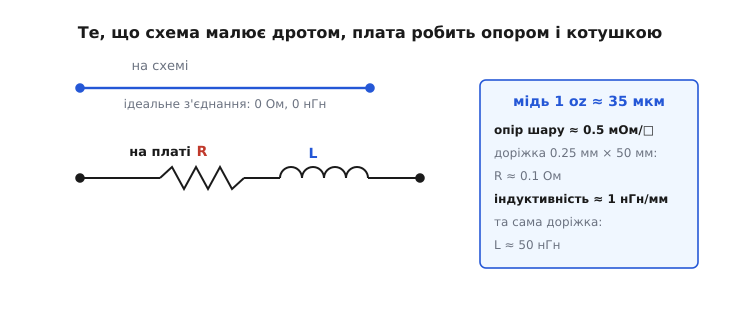
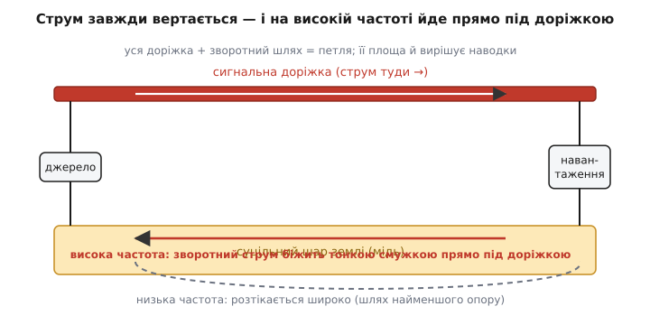
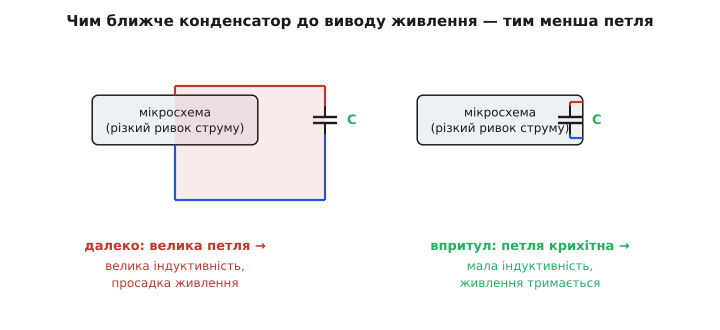

# Друкована плата (PCB layout)

Намалювати схему — це сказати, що з чим з'єднано. Розвести плату — це вирішити, **де насправді побіжить струм**. І ось тут ховається пастка, об яку спотикається кожен, хто вперше переносить робочу схему на залізо: схема, бездоганна на папері, на готовій платі гуде, гріється не там, де мала б, або просто не вмикається. Жодну деталь не переплутано, всі з'єднання на місці — а працює погано. Причина майже завжди одна: **мідь, якою ви з'єднали деталі, сама виявилася деталлю**, і ви про неї забули.

Друкована плата (англ. *printed circuit board*, PCB — «друкована» бо мідні з'єднання колись справді **друкували** на ізоляторі, як фарбу на папір) — це не просто механічний тримач для компонентів. Кожна доріжка міді — це маленький [опір](topic:electronics/resistor) і маленька [котушка](topic:electronics/inductance). Кожна пара доріжок поряд — крихітний [конденсатор](topic:electronics/capacitor). Зазор між шарами, отвір між сторонами, ділянка суцільної міді під схемою — усе це електричні елементи зі своїм опором, ємністю та індуктивністю, яких **немає на схемі, але які є насправді**. Розвести плату добре — означає тримати ці приховані елементи малими там, де вони шкодять, і використати їх там, де вони допомагають. Розберімо, звідки вони беруться і як на них впливати.

## Доріжка — це опір і котушка, а не дріт

На схемі дріт ідеальний: нуль опору, нуль усього, миттєво переносить потенціал з кінця в кінець. На платі дроту немає — є смужка міді завтовшки з фольгу. Стандартна мідь «1 oz» (одна унція міді, розплющена на квадратний фут — так історично міряють її товщину) — це шар приблизно **35 мкм**, тонший за людську волосину. Така фольга має цілком відчутний опір.

Зручна міра — **опір шару** (англ. *sheet resistance*): опір квадратного клаптика фольги, байдуже якого розміру (бо в ширшого квадрата більший переріз, але й довший шлях — і це скорочується). Для міді 1 oz він близько **0.5 мОм на квадрат**. Доріжка — це низка таких квадратів уздовж: скільки її довжина вкладається в її ширину, стільки квадратів і додається.

**Опір доріжки живлення.** Доріжка завширшки 0.25 мм веде струм на 50 мм через плату.
```
кількість квадратів = довжина / ширина = 50 / 0.25 = 200
R = 200 квадратів × 0.5 мОм = 0.1 Ом
```
Десята частина ома — наче дрібниця. Але пустіть цією доріжкою 2 А, і на ній **упаде 0.2 В**, а **розсіється 0.4 Вт** прямо в платі. Для шини на 3.3 В згубити 0.2 В по дорозі — це вже помітно; для сигналу від давача, де важливі мілівольти, така просадка все спотворить.

> 🔧 **Навіщо це.** Опір доріжки — причина, чому живлення до ненажерливого вузла (мотор, потужний світлодіод, радіопідсилювач) ведуть **широкою заливкою міді**, а не тонкою лінією. Ширша доріжка — менше квадратів на ту саму довжину — менший опір, менший нагрів, менша просадка. Коли треба погнати кілька ампер, доріжку роблять не в півміліметра, а в кілька міліметрів — або взагалі окремою мідною заливкою (англ. *copper pour*).

Опором справа не вичерпується. Будь-який провідник зі струмом створює навколо себе магнітне поле, а отже має **[індуктивність](topic:electronics/inductance)** — опір **зміні** струму. Для типової доріжки над шаром землі це грубо **1 нГн на міліметр** довжини. Наша 50-мм доріжка несе в собі близько **50 нГн**. На постійному струмі це невидимо. Але індуктивність озивається напругою на **швидку зміну** струму за законом `U = L · dI/dt`, і коли струм смикається різко — а цифрова мікросхема смикає його за наносекунди — навіть наногенрі стають важливими.

**Викид напруги на індуктивності доріжки.** Мікросхема за 2 нс ривком бере додаткові 0.5 А крізь доріжку живлення з індуктивністю 50 нГн.
```
dI/dt = 0.5 А / 2 нс = 0.5 / (2·10⁻⁹) = 2.5·10⁸ А/с
U = L · dI/dt = 50·10⁻⁹ · 2.5·10⁸ ≈ 12.5 В
```
Дванадцять вольтів просадки на шматочку міді, який «нічого не важить»! Звісно, реально таку просадку не дають — її гасять конденсатором поряд, — але саме ця цифра пояснює, **чому** його туди ставлять.


*Те, що схема показує ідеальним дротом (угорі), плата реалізує як опір R послідовно з індуктивністю L (внизу). Праворуч — порядок величин для звичайної доріжки в міді 1 oz: опір — десяті частки ома, індуктивність — десятки наногенрі. Обидва малі, але оживають: опір — на великому струмі, індуктивність — на швидкій його зміні.*

## Струм завжди вертається — і його шлях вирішує все

Тепер найважливіше, що відрізняє того, хто розводить плати інтуїтивно, від того, хто розуміє. Струм не «доходить до навантаження» — він **тече по колу й вертається до джерела**. Завжди. Скільки витекло з плюсового виводу, стільки ж мусить повернутися в мінусовий. А отже, у кожного сигналу є **дві** доріжки, не одна: та, якою він іде, і та, якою повертається зворотний струм. І ця друга — зазвичай по землі — на схемі майже не видна, бо «земля» намальована одним символом, наче спільна точка. На платі вона не точка, а конкретна мідь зі своїм шляхом, опором та індуктивністю.

Куди тече зворотний струм по суцільному [шару землі](topic:electronics/ground-plane)? Тут криється краса, яку варто відчути. На **низькій** частоті струм розтікається широко — шукає шлях найменшого **опору**, тобто розливається по всій міді. А на **високій** частоті він робить інакше: тулиться **тонкою смужкою прямісінько під сигнальною доріжкою**. Чому? Бо на високій частоті головне вже не опір, а **індуктивність**, а індуктивність петлі тим менша, чим менша її **площа**. Зворотний струм «хоче» якомога меншу петлю — а найменша петля виходить, коли він біжить точно під доріжкою, що йде туди. Природа сама притискає його до сигналу, бо так дешевше за енергією.

> 🔧 **Навіщо це.** Це не теоретична тонкість, а керівництво до дії. Якщо зворотний струм іде точно під доріжкою, то петля «сигнал–повернення» крихітна — а маленька петля **мало випромінює й мало ловить завад**. Але варто прорізати в землі під доріжкою щілину (дірою, вирізом, розривом заливки), і струм мусить її **обходити** — петля роздувається, індуктивність стрибає, плата починає гудіти на радіо й ловити перешкоди. Звідси золоте правило розведення: **ніколи не розривай землю під швидким сигналом**. Цілісність зворотного шляху важливіша за красу доріжок.


*Сигнал іде верхньою доріжкою, зворотний струм вертається нижнім шаром землі. На високій частоті (суцільна стрілка) він збирається прямо під доріжкою — так площа петлі найменша. На низькій (пунктир) розтікається широко шляхом найменшого опору. Уся фігура «доріжка + повернення» — це петля, і саме її площа задає, скільки плата випромінює й скільки завад ловить.*

Звідси випливає, чому **суцільний шар землі** — найкращий винахід у розведенні плат. Дайте сигналам цілий мідний шар під ними — і кожен сам знайде собі найкоротший зворотний шлях, без вашого клопоту. Не треба вручну тягнути «дроти землі» до кожної деталі й боятися, що десь утвориться велика петля: суцільна площа дозволяє зворотному струму текти **точно там, де треба**. Саме тому навіть прості двосторонні плати намагаються робити так, щоб **один цілий бік був землею**, а сигнали йшли іншим. Як саме розкладають мідь по кількох шарах і чому порядок шарів важливий — окрема тема [шарування плати (stackup)](topic:electronics/pcb-stackup).

## Петлі, які випромінюють і ловлять

Чому ми так вчепилися в площу петлі? Бо петля зі струмом — це **рамкова антена**. Змінний струм у петлі випромінює магнітне поле тим сильніше, чим **більша площа петлі**, — і навпаки, зовнішнє змінне поле наводить у петлю напругу тим сильніше, чим вона більша. Петля працює в обидва боки: велика — і галасує в ефір (плата не проходить норми на завади), і збирає чужий шум (плату «глушить» сусідній імпульсний перетворювач). Маленька петля тиха з обох боків.

Тому все розведення зводиться до простої думки: **тримай струмові петлі маленькими**. Передусім — петлі швидких сигналів і петлі живлення, де струм смикається різко. Сигнал і його повернення — поряд. Конденсатор живлення — впритул до споживача. Швидкі лінії — над суцільною землею, не над розривом.

Класичний винуватець великих петель — недбало розкидана **земля живлення**. Якщо повертати струм від двох далеких вузлів через одну тонку спільну доріжку, обидва зворотні струми пораховуються на її опорі та індуктивності й починають **заважати один одному**: ривок струму потужного вузла піднімає потенціал «землі», і тихий вузол бачить це як завалу на своєму нулі. Це джерело так званих [перехресних завад (crosstalk)](topic:electronics/crosstalk) — коли один сигнал підмішується в інший не тому, що їх з'єднали, а тому, що в них **спільний зворотний шлях**. Ліки знов ті самі: суцільна земля, де кожен струм вертається своїм коротким шляхом, не штовхаючись із чужим.

## Конденсатор живлення мусить стояти впритул

Найчастіша порада в розведенні — «постав [блокувальний конденсатор](topic:electronics/decoupling) якнайближче до виводу живлення мікросхеми». Тепер ми вже бачимо, **чому** саме впритул, а не просто «десь поряд».

Цифрова мікросхема споживає струм не рівно, а **ривками**: щоразу, коли всередині перемикаються вентилі, вона за наносекунди вимагає порцію заряду. Тягти цей ривок через усю плату від джерела не можна — на дорозі та сама індуктивність доріжки (наші 50 нГн), яка на швидкій зміні струму дає величезну просадку (ми порахували — десяток вольтів). Тому поряд із мікросхемою ставлять маленький конденсатор: він **тримає запас заряду під самим виводом** і віддає його миттєво, зблизька, не змушуючи струм бігти здалеку.

Але — і це суть — конденсатор допомагає рівно настільки, наскільки **мала петля між ним і мікросхемою**. Бо в цій петлі теж є індуктивність, і чим довша доріжка від конденсатора до виводу, тим більша індуктивність, тим повільніше конденсатор віддає заряд — і весь сенс губиться. Поставите конденсатор за два сантиметри — він майже марний на швидких ривках; поставите впритул, із короткими товстими доріжками й [перехідним отвором](topic:electronics/via-inductance) одразу в землю — він працює.


*Та сама пара «мікросхема + конденсатор», розведена двома способами. Ліворуч конденсатор далеко: петля живлення велика, її індуктивність гасить швидку віддачу заряду, живлення просідає на ривку. Праворуч конденсатор упритул: петля крихітна, індуктивність мала, заряд приходить миттєво. Деталі ті самі — різниця лише в тому, де їх покласти.*

> 🔧 **Навіщо це.** Ось чому в правилах розведення кажуть не просто «додай конденсатор», а «**коротка й широка** доріжка до нього, отвір у землю поряд із отвором конденсатора». Електрично конденсатор бездоганний — псує його **дорога до мікросхеми**. Інженер бореться не за номінал ємності (його беруть із головою), а за **геометрію підключення**: мінімум довжини, мінімум площі петлі.

## Деталь має сісти на своє місце

Доріжки — половина справи; друга половина — **посадкові місця** (англ. *footprint*) під самі деталі: малюнок мідних площадок, на які лягають виводи. Якщо площадки не збігаються з реальними розмірами корпуса, деталь або не припаюється, або відірветься. Тому посадкове місце завжди беруть із паспорта компонента, а не «на око» — це окрема акуратна тема [проєктування посадкових місць (footprint)](topic:electronics/footprint-design).

Особлива річ — **тепло**. Силова деталь (регулятор, потужний транзистор, драйвер мотора) гріється, і це тепло мусить кудись піти. Часто єдиний шлях — **через плату**: під деталлю роблять мідну площадку й пронизують її кількома [тепловими отворами (thermal vias)](topic:electronics/thermal-vias), які проводять тепло на нижній шар і в усю мідь плати, що працює радіатором. Тобто плата відводить не лише струм, а й **жар**, і це теж частина розведення.

Окрема висока школа — розведення **імпульсних перетворювачів**, де великі струми смикаються на сотнях кілогерц у малих петлях; там геометрія міді важить більше, ніж номінали деталей, і помилка на міліметр псує всю роботу. Як саме компонують такі вузли — у [розведенні перетворювача](topic:electronics/converter-layout).

## Як це складається докупи

Зведімо нитку. Плата здається пасивним тримачем, але кожен її мідний штрих — це електричний елемент: доріжка має опір (б'є на великому струмі просадкою й нагрівом) та індуктивність (б'є на швидкій зміні струму викидом напруги). Струм завжди вертається до джерела, і його зворотний шлях — повноцінна частина схеми, хоч на ній і написано одне слово «земля»; на високій частоті він сам тулиться під сигналом, мінімізуючи петлю, якщо ви не заважаєте йому розривом міді. Петля «сигнал–повернення» — це антена: маленька тиха, велика галаслива в обидва боки. Тому суцільний шар землі, короткі шляхи, конденсатори впритул і непорушна земля під швидкими лініями — не ритуал, а пряме слідство з фізики струмових петель.

Звідси й проста перевірка доброго розведення: за кожним сигналом подумки простежте, **куди й по чому повертається його струм**, і чи мала вийшла петля. Якщо зворотний шлях короткий і непорушний, а петлі тісні — плата працюватиме так само чисто, як виглядала схема. Якщо ж зворотний струм мусить кудись далеко обходити — саме там плата вас і підведе, хоч би якою правильною була принципова схема.

Винайшов цей спосіб з'єднувати деталі — друкований малюнок міді замість пучка дротів — австрійський інженер Пауль Айслер; як він до цього дійшов, утікаючи від нацизму, і чому світ це підхопив лише через війну — у [короткій історії друкованої плати](topic:electronics/pcb-layout/hist-eisler-pcb.md).
