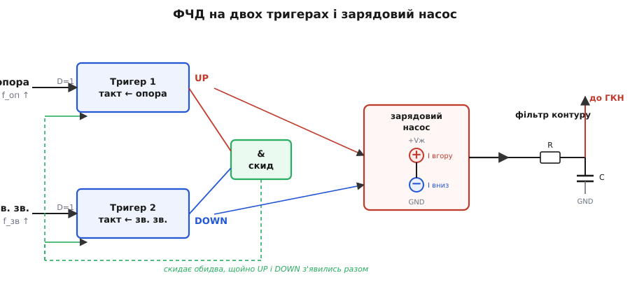
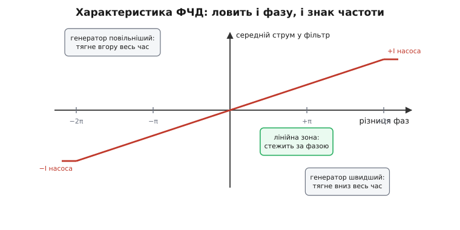
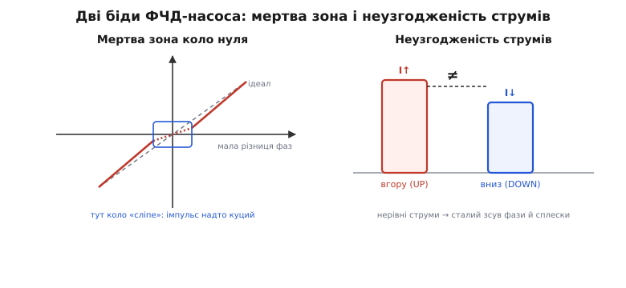

# 🔌 Фазочастотний детектор із зарядовим насосом: чому коло ловить чужу частоту майже з порога

Найпростіший фазовий детектор — перемножувач — має ваду, через яку вся ідея [фазового автопідстроювання](book:electronics/phase-locked-loop) ледь дихає, поки генератор не біля цілі. Поки його частота далеко від опорної, перемножувач видає не плавну похибку, а швидкі **биття**, які фільтр контуру згладжує мало не в нуль. Коло «не чує» далеку опору й нікуди не повзе — смуга захоплення виходить вузька, прикра, ненадійна. Замінити цей вузол на хитріший — фазочастотний детектор із зарядовим насосом — і коло раптом ловить опору майже з усієї смуги, де воно здатне її втримати. Це той самий стрибок якості, що відрізняє іграшковий синтезатор від справжнього. Розберімо, **як** цей вузол улаштований, **чому** він стежить не лише за фазою, а й за знаком різниці частот, і де в нього граблі, на які наступає кожен, хто бере його вперше.

Цей клас вузла — те, що стоїть усередині майже кожного сучасного синтезатора частоти, від радіомодуля до тактового дерева процесора. Він настільки типовий, що його малюють однаково в довідниках усіх виробників: дві мікросхеми різних фірм поводяться тут однаково аж до дрібниць. Тому й говоримо про **клас**, без жодного партномера — суть скрізь та сама.

### Що це за клас вузла

**Фазочастотний детектор** (англ. *phase-frequency detector*, скорочено PFD; українською — ФЧД) — це цифровий вузол, що порівнює два сигнали й видає не плавну напругу, а **дві логічні команди**: «пришвидшити» (UP) і «сповільнити» (DOWN). До нього в парі ставлять **зарядовий насос** (англ. *charge pump*) — крихітне джерело струму, що за командою UP підливає заряд у фільтр контуру, а за командою DOWN — відливає. Разом вони замінюють класичний фазовий детектор PLL, але роблять його роботу набагато краще.

Ключове слово в назві — **частотний**. Простий перемножувач бачить лише фазу: якщо два сигнали мають різну частоту, він губиться. ФЧД натомість дивиться, **який із двох сигналів прийшов першим**, — а це міра не лише фази, а й того, **чия частота вища**. Коли генератор повільніший за опору, його фронти стабільно запізнюються, і ФЧД майже весь час кричить «пришвидшити». Коли швидший — навпаки, майже весь час «сповільнити». Тобто далеко від синхронізму ФЧД працює як **частотний** детектор: упевнено тягне генератор у правильний бік, хоч би як далеко той блукав. А коли частоти зійшлися, він плавно перетворюється на **фазовий** детектор і доводить фази до збігу. Звідси й подвійна назва.

> 🔧 **Навіщо це.** Саме ця властивість — чути не тільки фазу, а й знак різниці частот — розширює **смугу захоплення** PLL майже до **смуги втримання**. Простими словами: коло з ФЧД захоплює опору майже з усього діапазону, де воно взагалі здатне її тримати. У синтезаторі це означає, що після зміни множника (перемикання каналу) контур упевнено й швидко в'їжджає в нову частоту, а не «зривається» лише тому, що ціль трохи задалеко. Без ФЧД синтезатор довелося б «підштовхувати» вручну ближче до цілі — з ним він ловить сам.

### Блок-схема: два тригери, скид і насос

Тепер сама будова. Вона напрочуд економна — лише два **тригери** (англ. *D flip-flop*, D-тригер) і один вентиль збігу. Розгляньмо її поетапно, бо вся хитрість саме в тому, як ці три деталі взаємодіють.


*ФЧД на двох тригерах. Кожен тригер тактується фронтом свого сигналу (опорного чи зворотного) і піднімає свій вихід — UP або DOWN. Щойно обидва підняті, вентиль збігу скидає їх разом. Зарядовий насос за командою UP ллє струм у фільтр контуру (вгору), за командою DOWN — відсмоктує (вниз); фільтр перетворює це на керівну напругу для генератора.*

Почнімо з **тригерів**. D-тригер — це найпростіша комірка пам'яті: на тактовий вхід приходить фронт — тригер «защіпає» те, що було на вході даних, і тримає на виході до скидання. У нашому ФЧД обидва тригери ввімкнено хитро: їхні входи даних намертво прив'язані до логічної **одиниці**. Це означає, що тригерові байдуже, *що* защіпати, — він защіпає одиницю **щоразу**, коли на його тактовий вхід приходить фронт. Іншими словами, кожен тригер — це проста пастка: «надійшов мій фронт → підняв вихід в одиницю й тримаю».

Тепер під'єднаймо сигнали. На тактовий вхід **першого** тригера заводимо **опору** — той сигнал, що ловимо. На тактовий вхід **другого** — сигнал **зворотного зв'язку** (вихід генератора, звичайно вже поділений дільником). Виходи називаємо за їхньою роллю: вихід першого тригера — **UP** («пришвидшити»), вихід другого — **DOWN** («сповільнити»).

Простежмо, що буде. Хай опорний фронт прийшов **раніше** за фронт зворотного зв'язку (генератор запізнюється). Опорний фронт защіпає першу одиницю — піднімається **UP**. DOWN поки лежить унизу, бо другий фронт ще не надійшов. Отже, від моменту опорного фронту й доти, доки не прийде фронт зворотного зв'язку, активний **лише UP** — рівно стільки, наскільки генератор спізнився. Команда «пришвидшити» триває саме той проміжок, на який треба пришвидшити. Гарно й чесно.

Але чогось бракує. Що зупинить UP? Якби нічого, перший тригер так і висів би в одиниці вічно. Тут і вступає **третя деталь** — вентиль збігу, **логічне І** (англ. *AND gate*). Його входи — UP і DOWN, а вихід заведено назад на **скид обох** тригерів. Працює воно так: щойно **обидва** виходи опиняться в одиниці одночасно, вентиль І видає одиницю на лінію скиду — і обидва тригери миттю обнуляються. Тобто схема живе так:

```
опорний фронт   → UP = 1   (почали «пришвидшувати»)
… чекаємо …
фронт зв. зв.   → DOWN = 1  (тепер обидва підняті)
обидва в 1      → вентиль І скидає → UP = 0, DOWN = 0
```

Отже, **той сигнал, що прийшов першим, тримає свою команду активною рівно доти, доки не прийде другий**. Коли надходить другий, обидва на мить піднімаються, вентиль збігу їх гасить — і схема готова до наступної пари фронтів. Тривалість UP (або DOWN) — це **точна** міра того, на скільки один фронт випередив інший. Не косинус, не добуток — пряма часова відстань між фронтами, перекладена на тривалість імпульсу.

> 🔧 **Навіщо це.** Зверніть увагу на елегантність: вузол **цифровий**, з двох тригерів і вентиля, без жодного аналогового множника. Це означає, що ФЧД легко вмонтувати в кремній поряд із рештою цифрової логіки синтезатора, він не боїться розкиду параметрів транзисторів, не дрейфує з температурою. Уся «аналоговість» PLL зосереджена далі — у насосі й фільтрі, — а серце детектора лишається чистою логікою. Саме тому ФЧД-синтезатор так дешево інтегрується в будь-яку мікросхему.

### Чому насос, а не просто напруга

Тригери видають дві логічні команди — UP і DOWN. Але фільтр контуру й генератор хочуть **напругу**, плавну й аналогову. Як перекласти куці логічні імпульси на керівну напругу? Тут і потрібен **зарядовий насос**.

Уявімо найгрубіший варіант: під'єднати UP і DOWN просто до логічних виходів і завести їх у фільтр. Біда в тому, що логічний вихід має цілком певну напругу (скажімо, рівень живлення для одиниці) і цілком певний внутрішній опір. Поки команда активна, він **жорстко притягує** вузол фільтра до своєї напруги; коли неактивна — теж жорстко притягує до нуля. Фільтр не може спокійно «запам'ятати» проміжне значення між імпульсами: логічний вихід безперервно нав'язує йому свою напругу. Контур виходив би смиканий і неточний.

Насос розв'язує це красиво. Замість того, щоб **притягувати напругою**, він **впорскує струм**. Усередині насоса — два мініатюрні джерела струму однакової сили: верхнє ллє струм **у** вузол (заряджає), нижнє відсмоктує струм **з** вузла (розряджає). UP вмикає верхнє джерело, DOWN — нижнє. А головне — коли **жодна** команда не активна, **обидва джерела вимкнено**, і вихід насоса повисає у **високоомному** стані: він ні до чого не притягує вузол, ні вгору, ні вниз.

Ось чому це важливо. Між імпульсами насос **відпускає** фільтр — і конденсатор фільтра спокійно тримає накопичену напругу, ніщо її не смикає. Кожен імпульс UP **додає** до конденсатора крапельку заряду (підіймає напругу), кожен імпульс DOWN — **знімає** крапельку (опускає). Напруга на фільтрі стає **інтегралом** усіх команд: накопиченою сумою «пришвидшити мінус сповільнити» за весь час. А накопичувати похибку — саме те, що треба, щоб у синхронізмі тримати **точно нульову** залишкову різницю фаз. Перемножувач так не вміє: у нього в синхронізмі завжди лишається крихітний фазовий зсув, бо він тримає напругу пропорційно фазі, а не її інтегралу.

```
UP активний   →  верхнє джерело ллє струм  → заряд конденсатора росте → напруга вгору
DOWN активний →  нижнє джерело відсмоктує  → заряд спадає           → напруга вниз
обидва вимкнені → насос «відпускає» вузол   → конденсатор тримає напругу
```

> 🔧 **Навіщо це.** Те, що насос між імпульсами відпускає фільтр у високоомний стан, дає PLL із ФЧД властивість, якої немає в простіших схем: **нульову залишкову похибку фази** в синхронізмі. Контур доводить різницю фаз практично до нуля й там тримає. Для синтезатора це означає, що вихідна частота прив'язана до опорної **без сталого зсуву**, а сама керівна напруга стоїть спокійно. На практиці саме така прив'язка дає чисту, передбачувану частоту, на яку можна покладатися в радіотракті.

### Передавальна характеристика: чому до ±2π — пряма, а далі — поличка

Тепер найцікавіше — **чому** цей вузол ловить і знак частоти. Намалюймо його передавальну характеристику: по горизонталі — різниця фаз між опорою і зворотним зв'язком, по вертикалі — середній струм, що насос віддає у фільтр за період. Вийде форма, що пояснює все.


*Характеристика ФЧД. У межах від −2π до +2π середній струм у фільтр прямо пропорційний різниці фаз — це фазовий режим. За цими межами струм упирається в полицю: насос ллє (чи смокче) на повну весь час. Полиця не нульова, а максимальна — тому далеко від синхронізму, де фази «обертаються», середній струм лишається ненульовим і однознаковим: вузол перетворюється на частотний детектор і впевнено тягне генератор у правильний бік.*

Розберімо форму по ділянках. Поки різниця фаз мала — від мінус до плюс одного повного оберту (−2π … +2π) — усе просто: що більший зсув між фронтами, то довший імпульс UP (чи DOWN), то більший середній струм у фільтр. Це **пряма лінія** через нуль: середній струм пропорційний різниці фаз. Чистий фазовий детектор, рівно те, що треба біля синхронізму.

Зверніть увагу на **ширину** цієї прямої: цілих **чотири π** (від −2π до +2π). Це вшестеро більше, ніж у перемножувача, чия чесна лінійна ділянка — лише вузенький окіл коло чверті періоду (приблизно ±π/2). Ширша лінійна зона означає, що ФЧД не «перекидається» і не плутається на великих фазових зсувах — він спокійно відпрацьовує навіть зсув мало не на повний оберт.

А тепер — ключ до частотного режиму. Що буде, коли частоти **різні**, скажімо, генератор стабільно повільніший за опору? Тоді опорні фронти приходять **частіше**, ніж фронти зворотного зв'язку: між двома сусідніми фронтами зворотного зв'язку встигає прослизнути не один, а кілька опорних. Кожен опорний фронт піднімає UP, а скидається UP лише фронтом зворотного зв'язку — тож UP активний майже **весь час**. Середній струм у фільтр упирається в **горизонтальну полицю**: насос ллє вгору на повну, безперервно. І це полиця **не нульова** — вона **максимальна**.

Ось чому це працює там, де перемножувач здається. У перемножувача на великій різниці частот вихід — швидкі биття, чий **середній** рівень близький до нуля: туди-сюди, у сумі нічого, контур стоїть. У ФЧД на великій різниці частот середній струм — **максимальний і однознаковий**: він невпинно тягне генератор до опори, поки той не наблизиться. Полиця має знак: генератор повільніший — полиця «вгору» (пришвидшуй), швидший — полиця «вниз» (сповільнюй). Тобто навіть здалеку вузол **знає напрямок** і веде туди генератор без вагань. А коли той підповзе досить близько, система сповзає з полиці на похилу пряму — і доводить уже самі фази до збігу.

```
|Δчастоти| велике, генератор повільніший  → UP майже весь час  → струм на полиці «вгору»
|Δчастоти| велике, генератор швидший       → DOWN майже весь час → струм на полиці «вниз»
частоти близькі                            → працює лінійна зона → доводить фази до нуля
```

Саме ця проста зміна — від «середнє биття ≈ нуль» до «середнє ≈ максимум зі знаком» — і перетворює мляве захоплення перемножувача на впевнене захоплення ФЧД майже з усієї смуги втримання.

### Типове підключення до фільтра контуру

Тепер як цей вузол вмикають у коло. Вихід насоса — це той самий вузол, де народжується керівна напруга генератора, і до нього під'єднують **фільтр контуру** (англ. *loop filter*). Найтиповіший фільтр — навіть не один конденсатор, а **резистор послідовно з конденсатором**, і ця дрібниця принципова.

Чому не самий конденсатор? Якби насос лив струм у голий конденсатор, керівна напруга росла б рівно й гладко — але контур вийшов би на межі стійкості, схильний нескінченно розгойдуватися (математично — два чисті інтегратори поспіль, а це класична нестійкість). Резистор у парі з конденсатором додає те, що інженери звуть **нулем** характеристики: коли крізь резистор біжить імпульс струму від насоса, на резисторі одразу схоплюється **сходинка** напруги, пропорційна струму, а вже потім конденсатор поволі накопичує свою плавну складову. Ця миттєва сходинка — то випереджальна реакція, що **демпфує** контур, гасить розгойдування. Конденсатор дає повільну точність (інтеграл, що зводить похибку до нуля), резистор — швидке заспокоєння.

```
вихід насоса ──[ R ]──┬──→ керівна напруга на ГКН
                      │
                    [ C ]
                      │
                     GND
```

Часто поряд із цим конденсатором ставлять **другий**, дрібніший, прямо з виходу насоса на землю (поза резистором). Його завдання — згладити різкі **сплески струму** від насоса, щоб імпульси не «дзвеніли» на керівній напрузі. Виходить фільтр **третього порядку**, який ще краще чистить вузол від слідів окремих імпульсів. Але кістяк незмінний: послідовні R і C задають характер контуру, дрібний конденсатор згладжує сплески.

> 🔧 **Навіщо це.** Підбір цих R і C — головна інженерна робота при налаштуванні синтезатора, і саме тут найлегше зіпсувати готову мікросхему. Завеликий конденсатор — контур реагує повільно, довго захоплює частоту, мляво відробляє зміну каналу. Замалий — швидко, але дзвенить і шумить. Резистор задає демпфування: замалий — контур розгойдується з перельотом, завеликий — пропускає у вузол сплески насоса. Виробники синтезаторів дають калькулятори й приклади номіналів саме тому, що від цих кількох деталей залежить, чи буде вихідна частота чистою. Глибше, як рахувати ці номінали під потрібну смугу й демпфування, — у [математичній вставці про динаміку контуру](book:electronics/phase-locked-loop/math-pll-dynamics.md).

### «Перший байт»: що тут налаштовувати

ФЧД із насосом майже завжди сидить усередині готової мікросхеми-синтезатора разом із дільниками, і «перший байт» — це не команда тригерам, а кілька регістрів, що задають режим. Перелічімо, що реально доводиться чіпати, не прив'язуючись до жодного партномера.

**Сила струму насоса.** Майже всі синтезатори дають задати струм насоса регістром — від часток міліампера до кількох міліампер, звичайно сходинками. Це число прямо множиться на коефіцієнт підсилення контуру: більший струм — швидший, ширший контур; менший — повільніший, вужчий, чистіший. Його обирають **у парі** з номіналами фільтра: змінив струм — перерахуй фільтр, інакше зіпсуєш демпфування.

**Полярність.** Контур мусить тягнути генератор у правильний бік. Якщо генератор влаштований так, що більша напруга дає **вищу** частоту, — одна полярність; якщо навпаки (буває) — протилежна. Помилка тут фатальна: контур із переплутаною полярністю не захоплює **ніколи**, бо жене генератор геть від цілі замість до неї. У більшості мікросхем полярність задається бітом у регістрі.

**Частота порівняння.** Дільник опори задає, з якою частотою фронти приходять на ФЧД, — це й є частота, на якій працює детектор. Вона задає крок сітки частот синтезатора й сильно впливає на чистоту виходу. Зазвичай її ставлять якомога вищою, наскільки дозволяє потрібний крок.

:::tabs
```cpp
// Узагальнене налаштування синтезатора з ФЧД-насосом (псевдорегістри).
// Конкретні адреси й біти — у паспорті мікросхеми; тут — лише сенс полів.
void synth_init(void) {
    pll_set_ref_divider(R);          // дільник опори → частота порівняння f_оп
    pll_set_feedback_divider(N);     // множник: f_вих = N * f_оп
    pll_set_cp_current(CP_2MA);      // струм насоса — у парі з фільтром!
    pll_set_phase_polarity(POL_POS); // напрям: більша напруга → вища частота
    pll_enable();                    // запуск контуру
    while (!pll_locked())            // чекати захоплення (прапорець lock-detect)
        ;                            // доти на виході частота ще не точна
}
```
```micropython
# Узагальнене налаштування синтезатора з ФЧД-насосом (псевдорегістри).
# Конкретні адреси й біти — у паспорті мікросхеми; тут — лише сенс полів.
def synth_init(pll):
    pll.set_ref_divider(R)           # дільник опори → частота порівняння f_оп
    pll.set_feedback_divider(N)      # множник: f_вих = N * f_оп
    pll.set_cp_current(CP_2MA)       # струм насоса — у парі з фільтром!
    pll.set_phase_polarity(POL_POS)  # напрям: більша напруга → вища частота
    pll.enable()                     # запуск контуру
    while not pll.locked():          # чекати захоплення (прапорець lock-detect)
        pass                         # доти на виході частота ще не точна
```
:::

Тонкість одна, зате важлива: після запуску чи зміни множника контур захоплює частоту **не миттєво** — йому треба час «втягнутися». Тому в мікросхемах є **детектор захоплення** (англ. *lock detector*): він піднімає прапорець, коли UP і DOWN стали достатньо короткими й рідкими (тобто фази зійшлися). У коді **обов'язково** чекають цей прапорець, перш ніж покладатися на вихідну частоту, — точно як чекають готовності будь-якого PLL.

### Граблі №1: мертва зона

А тепер про те, на чому спотикається кожен, хто вперше зустрічає цей вузол, — і про що мовчить наївна блок-схема. Біля самого синхронізму, коли фази майже збіглися, у ФЧД відкривається **мертва зона** (англ. *dead zone*) — діапазон крихітних фазових різниць, які детектор **не помічає**. І щоб зрозуміти, звідки вона, треба глянути на реальні джерела струму насоса.


*Дві біди реального ФЧД-насоса. Зліва — мертва зона: коло нуля характеристика стає пласкою, бо куций імпульс не встигає по-справжньому ввімкнути джерело струму, і коло «не бачить» дрібної похибки. Справа — струмова неузгодженість: верхнє і нижнє джерела насоса насправді не однакові, тож навіть у синхронізмі лишається сталий зсув фази й періодичні сплески.*

Звідки береться мертва зона? Згадаймо, як скидаються тригери: щойно **обидва** виходи піднялись, вентиль збігу їх гасить. Тепер уявіть, що фази майже збіглися: опорний фронт і фронт зворотного зв'язку приходять майже **одночасно**. Обидва тригери піднімаються майже разом, вентиль миттю їх скидає — і команда UP (чи DOWN) виходить **надзвичайно куца**, лічені наносекунди.

А реальне джерело струму насоса не вмикається миттєво. Йому теж треба час, щоб транзистори розкачались і струм піднявся до повного. Якщо команда коротша за цей час розкачки, джерело просто **не встигає** ввімкнутись по-справжньому — крапелька заряду виходить мізерна, набагато менша, ніж «належить» за тривалістю імпульсу. Виходить, що коло **не реагує** на дрібні фазові похибки: вони дають такі куці імпульси, що насос їх «не чує». Характеристика коло нуля стає **пласкою** — то і є мертва зона.

Чому це погано? Бо в мертвій зоні контур **не керує**: генератор може вільно гуляти в цьому вузенькому діапазоні, а коло його не підправляє. На виході це обертається **тремтінням фази** (джитером): частота не стоїть твердо, а злегка плаває в межах мертвої зони, бо зворотний зв'язок там фактично розімкнений. Для синтезатора, від якого хочуть чистої частоти, це пряма втрата якості.

Як із цим борються? Хитро й просто: у лінію скиду навмисне **додають затримку**. Тепер навіть коли фази збіглися ідеально, обидва тригери піднімаються — і скид приходить **не одразу**, а трохи згодом. За цей навмисний проміжок **обидва** джерела (UP і DOWN) встигають увімкнутись на повну, разом. Виходить, що навіть при нульовій похибці насос щоразу видає коротку пару повноцінних імпульсів — угору і вниз однакової тривалості, які в сумі **гасять одне одного**. Поки похибки нема, ці імпульси рівні й нічого не зсувають. А щойно з'явиться крихітна похибка, один із них стане трохи довшим — і ця **різниця** вже не куца, бо обидва імпульси й так тривають довше за мертвий час. Детектор знову бачить навіть найдрібнішу похибку. Мертву зону прибрано ціною того, що насос тепер «дихає» короткими парними імпульсами навіть у повному синхронізмі.

> 🔧 **Навіщо це.** Затримку скиду закладає виробник усередині мікросхеми, тож вам її не налаштовувати — але знати про неї критично, щоб **читати наслідки**. По-перше, через цю затримку насос навіть у синхронізмі дає короткі парні сплески — і саме вони, якщо джерела не зовсім однакові, лізуть у вихідний спектр (про це далі). По-друге, якщо в чужій схемі чи саморобному ФЧД джитер у синхронізмі підозріло великий — перша підозра падає саме на мертву зону: затримки скиду або нема, або замала. Це класичний діагноз «коло начебто захопило, а частота брудна».

### Граблі №2: струмова неузгодженість

Друга біда того ж класу глибша, бо в ідеалізованій схемі її взагалі не видно. Ми досі вважали, що верхнє і нижнє джерела насоса **однакові**: ллють і смокчуть струм однакової сили. У кремнії це не так — і ніколи не буде точно так.

Верхнє джерело зроблено на транзисторах одного типу (що тягнуть струм від плюса живлення), нижнє — на транзисторах іншого типу (що тягнуть до землі). Ці два сорти транзисторів фізично різні, по-різному залежать від напруги на вузлі, від температури, від розкиду при виготовленні. Тому **струм угору й струм униз неминуче трохи відрізняються** — це звуть **струмовою неузгодженістю** (англ. *current mismatch*). Скажімо, UP ллє 1.00 мА, а DOWN смокче 0.95 мА — дрібниця, та наслідки відчутні.

Простежмо їх. Згадаймо, що завдяки затримці скиду насос навіть у синхронізмі видає в **кожному** періоді коротку пару імпульсів: однакової тривалості вгору й униз. Якби джерела були рівні, ці імпульси гасили б одне одного начисто — нуль заряду за період. Але якщо вони нерівні, за кожен період у фільтр **затікає крихітний нескомпенсований заряд**. Контур цього не любить — і реагує єдиним доступним способом: він **зсуває фазу** генератора рівно настільки, щоб імпульси UP і DOWN стали **різної** тривалості й цей нерівний заряд скомпенсувався неоднаковою тривалістю. Тобто в синхронізмі лишається **сталий фазовий зсув** — невеличкий, але систематичний. Прив'язка частоти лишається, а от фаза «сідає» не точно в нуль, а трохи збоку.

Гірша частина — **сплески в спектрі**. Та сама пара куцих імпульсів щоперіоду — це збурення, що повторюється рівно з **частотою порівняння**. Періодичне збурення керівної напруги модулює генератор і породжує в його спектрі **бічні складові** — паразитні «гострі» лінії, віддалені від несучої рівно на частоту порівняння. Їх звуть **опорними сплесками** (англ. *reference spurs*). Що більша неузгодженість струмів, то товщі ці імпульси-залишки, то вищі сплески. Для радіоприймача це пряма біда: опорний сплеск — це фальшива частота поряд із корисною, яка псує сусідні канали й чутливість.

```
джерела рівні       →  пара імпульсів гаситься  →  нуль заряду  →  фаза точно в нулі, спектр чистий
джерела нерівні      →  залишковий заряд щоперіоду → контур зсуває фазу → сталий зсув + сплески на f_оп
```

> 🔧 **Навіщо це.** Боротьба зі струмовою неузгодженістю — головна турбота розробників синтезаторів, бо саме вона ставить стелю чистоти спектра. Усередині мікросхем ставлять хитрі насоси з вирівнюванням струмів, додаткові підстроювальні джерела, симетричні схеми. Вам, користувачеві готового синтезатора, лишається **знати симптом**: якщо в спектрі вихідної частоти стирчать сплески рівно на віддалі частоти порівняння — це майже напевно неузгодженість насоса (часто вкупі з наведенням на керівну лінію). Лікують зменшенням струму насоса, кращим фільтром, чистішою розводкою керівного вузла — і **вищою** частотою порівняння, щоб відсунути сплески далі від несучої, де фільтр їх краще притисне.

### Варіації класу

Узагальнений «ФЧД із зарядовим насосом» існує в кількох різновидах — корисно знати, чим вони різняться, без жодного партномера.

**Класичний тристановий ФЧД** — рівно той, що ми розібрали: два тригери, вентиль збігу, три стани (тільки UP, тільки DOWN, обидва вимкнені). Це **базовий** і найпоширеніший варіант, кістяк майже кожного синтезатора. Усе сказане вище — про нього.

**ФЧД зі зменшеною мертвою зоною** — той самий, але з ретельно вивіреною затримкою скиду (а часом і кількома послідовними елементами затримки), щоб мертва зона зникла начисто, не роздуваючи опорних сплесків. Тут уся хитрість у тому, щоб затримка була **рівно** достатня, щоб увімкнути джерела, але не довша, бо зайва затримка лише збільшує куці парні імпульси й сплески. Це постійний компроміс між мертвою зоною і чистотою спектра.

**Насос із вирівнюванням струмів** — варіація не детектора, а самого насоса: до нього додають схему, що активно зрівнює верхнє й нижнє джерела (наприклад, допоміжний підсилювач, що тримає однаковою напругу на обох джерелах). Це прямо б'є по струмовій неузгодженості й знижує і сталий зсув фази, і сплески. Складніший кремній — чистіший спектр.

**Диференційний насос** — той, що ллє струм не в один вузол щодо землі, а в **пару** проводів симетрично. Симетрія добре глушить наведення й парні перешкоди, тому такі насоси беруть там, де над усе чистота: у малошумних радіосинтезаторах. Ціна — складніший фільтр на два проводи.

**Поєднання з дробовим синтезом.** Коли ФЧД-насос ставлять у [дробовий синтезатор](book:electronics/phase-locked-loop) (де дільник швидко перемикається між сусідніми цілими, щоб у середньому вийшло дробове число), на детектор лягає додаткове навантаження: фронти зворотного зв'язку постійно «гуляють» туди-сюди, тож насос безперервно видає чималі імпульси корекції. Тут вимоги до лінійності насоса й малої неузгодженості ще жорсткіші, бо будь-яка нелінійність насоса перетворює це «гуляння» на шум. Тому в дробових синтезаторах насос — найвідповідальніший аналоговий вузол, і саме його якість визначає, наскільки чистим вийде дробовий синтез.

Спільне в усіх різновидах — суть незмінна: **два тригери ловлять, хто з фронтів прийшов першим, а насос перекладає це на крапельки заряду у фільтр**. Звідси й обидва таланти вузла: лінійна зона завширшки в чотири π робить його точним фазовим детектором біля синхронізму, а полиці насичення зі знаком — упевненим частотним детектором здалеку. Разом це й дає головну вигоду класу: смуга захоплення PLL розтягується майже до смуги втримання, і коло ловить чужу частоту майже звідусіль, звідки воно взагалі здатне її тримати. А дві вічні граблі — мертва зона і струмова неузгодженість — це та ціна, яку платить за цифрову елегантність детектора реальний, недосконалий кремній насоса.
