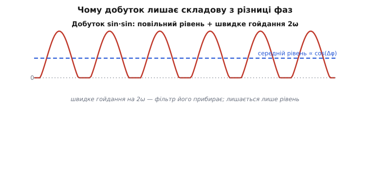
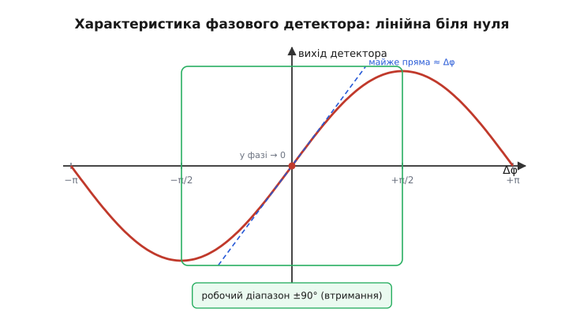
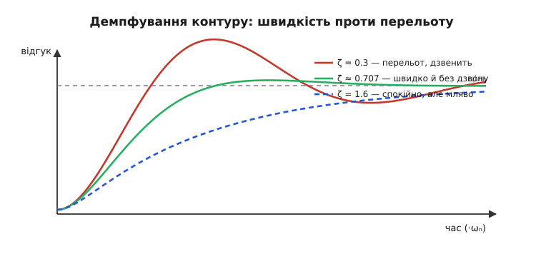

# 🧮 Математика контуру PLL: від добутку двох синусоїд до перельоту й дзвону

Словесний опис фазового автопідстроювання тримається на трьох обіцянках, які поки що звучать як магія. Перша: добуток опорного сигналу й сигналу генератора чомусь дає напругу, що залежить від **різниці фаз**. Друга: ця напруга росте з розузгодженням лише до чверті періоду, а далі поводиться дивно — звідки беруться ті горезвісні «±90°». Третя: підбір фільтра контуру визначає, чи коло плавно підповзе до синхронізму, чи стрибне з перельотом і дзвенітиме. Усі три обіцянки — не магія, а наслідки кількох рядків тригонометрії та однієї фундаментальної форми зворотного зв'язку. Виведемо їх по черзі, кожну на очах, без жодного кроку, узятого «бо так у книжках».

Мета не в тому, щоб накопичити формули. Мета — щоб, побачивши в довіднику синтезатора слова «смуга контуру 100 кГц, демпфування 0.7», ви точно розуміли, **звідки** ці числа, що вони обіцяють і чим доведеться платити, якщо їх посунути.

## Добуток двох синусоїд: де ховається різниця фаз

Найпростіший фазовий детектор — це перемножувач: пристрій, що бере миттєве значення опори й миттєве значення генератора і видає їхній **добуток**. Аналогова реалізація — звичайний змішувач (балансний модулятор); але зараз нам байдуже залізо, важлива сама операція множення. Питання: чому добуток двох коливань однакової частоти несе в собі їхній фазовий зсув?

Запишімо обидва сигнали. Хай опора коливається як

```
u_оп(t) = A · sin(ω·t)
```

а генератор — у тому ж темпі ω, але зсунутий за фазою на Δφ:

```
u_ген(t) = B · sin(ω·t + Δφ)
```

де Δφ — це і є фазове розузгодження, та сама величина, яку контур хоче загнати в нуль. Перемножимо:

```
u_оп · u_ген = A·B · sin(ω·t) · sin(ω·t + Δφ)
```

Сам по собі добуток двох синусів — річ непрозора, доки не згадати тотожність добутку синусів. Її варто не визубрити, а **побачити**, бо в ній уся суть. Розкладімо `sin(ω·t + Δφ)` за формулою суми:

```
sin(ω·t + Δφ) = sin(ω·t)·cos(Δφ) + cos(ω·t)·sin(Δφ)
```

Підставмо й розкриймо дужки:

```
sin(ω·t) · sin(ω·t + Δφ)
  = sin²(ω·t)·cos(Δφ) + sin(ω·t)·cos(ω·t)·sin(Δφ)
```

Тепер два шкільні факти. Перший: `sin²x = (1 − cos2x)/2`. Другий: `sin·x·cos·x = (sin2x)/2`. Підставмо обидва:

```
= cos(Δφ)·(1 − cos2ω·t)/2 + sin(Δφ)·(sin2ω·t)/2
= ½·cos(Δφ) − ½·cos(Δφ)·cos2ω·t + ½·sin(Δφ)·sin2ω·t
```

Зупинімося й роздивімося цей результат уважно, бо тут видно **геть усе**, заради чого затівалося множення. У добутку рівно три доданки, і вони бувають двох сортів:

- **Перший доданок `½·cos(Δφ)`** — сталий у часі. Він не коливається взагалі: у ньому немає `t`. Його величина залежить **тільки** від різниці фаз Δφ. Це й є шукана повільна складова — постійний рівень, що несе інформацію про розузгодження.
- **Решта два доданки** коливаються на частоті `2ω` — **подвоєній** частоті сигналів. Це швидке гойдання, в якому корисної інформації для контуру немає.

Помножимо на амплітуди й випишемо повний результат:

```
u_оп · u_ген = (A·B/2)·cos(Δφ)  −  (A·B/2)·cos(Δφ)·cos2ω·t  +  (A·B/2)·sin(Δφ)·sin2ω·t
                └── повільна, ∝ cos(Δφ) ──┘   └──────── швидке гойдання на 2ω ────────┘
```

Ось чому перемножувач — фазовий детектор. У добутку **завжди** сидить постійна складова, пропорційна `cos(Δφ)`: вона велика й додатна, коли фази збігаються (Δφ ≈ 0, cos ≈ 1), спадає до нуля, коли сигнали розходяться на чверть періоду (Δφ = π/2, cos = 0), і стає великою від'ємною в протифазі (Δφ = π, cos = −1). А все швидке гойдання сидить окремо, на частоті 2ω.


*Добуток двох рівночастотних синусоїд. Швидке гойдання — складова на 2ω; її прибирає фільтр контуру. Залишається сталий середній рівень (синя лінія), що дорівнює cos(Δφ) — готова міра фазового розузгодження.*

Тепер зрозуміло, **навіщо потрібен фільтр контуру** — і це не випадкова деталь, а математична необхідність. Перемножувач видає корисну сталу складову, але «забруднену» сильним гойданням на 2ω. Контурові потрібна лише стала частина. Тож одразу за детектором ставлять фільтр низьких частот, який пропускає повільне й давить швидке. Частота 2ω — дуже висока (для радіо це гігагерци), а корисний сигнал майже сталий, тож розділити їх легко: навіть скромний фільтр, що пропускає кілогерци, прибере гойдання на гігагерцах майже без сліду. Після фільтра лишається чистий рівень:

```
u_д = K · cos(Δφ)
```

де `K` увібрало в себе амплітуди й коефіцієнт пів. Саме цей рівень `u_д` і йде далі по контуру як напруга похибки.

> 🔧 **Навіщо це.** Ось чому в даташиті аналогового множника-детектора (як-от класичний змішувач на чотирьох транзисторах) завжди пишуть, що на виході присутня складова подвоєної частоти, і радять фільтр. Якщо фільтр контуру зробити надто широким — він пропустить це гойдання на 2ω до входу генератора, і той «задрижить» у такт йому: на чистій частоті виходу з'являться паразитні бічні складові за ±2ω від несучої. Розуміння, що детектор фізично домішує 2ω, рятує від цієї пастки на етапі вибору смуги фільтра.

## Чому характеристика — це cos, а діапазон — лише ±90°

Маємо `u_д = K·cos(Δφ)`. Накреслімо цю залежність виходу детектора від фазового розузгодження. Косинус: при Δφ = 0 вихід максимальний, далі плавно спадає, при Δφ = π/2 перетинає нуль, при Δφ = π — мінімум. Це і є **характеристика фазового детектора**.

Тут ховається важлива тонкість про **робочу точку**. Контур зі зворотним зв'язком прагне привести напругу похибки до певного **сталого** значення, при якому генератор крутиться рівно з частотою опори. Якщо за «нульове розузгодження» взяти точку Δφ = 0 (де cos максимальний), то біля неї характеристика **плоска**: похідна косинуса в нулі дорівнює нулю. Плоска характеристика — це детектор, що **не відчуває** малих зсувів: фази трохи розійшлися, а вихід майже не змінився. Кепський детектор. Тому насправді контур замикають так, щоб робоча точка сиділа не на вершині косинуса, а на його **найкрутішому схилі** — там, де похідна максимальна за модулем, тобто біля Δφ = π/2 (чверть періоду зсуву). Зручно ввести нову змінну — відхилення від цієї робочої точки, φ = Δφ − π/2; тоді

```
cos(Δφ) = cos(φ + π/2) = −sin(φ)
```

і характеристика стає синусоїдою від φ — нуль у робочій точці, з найбільшою крутістю саме там. Часто детектор так і зображають одразу як `u_д ∝ sin(φ)`, де φ — відхилення фази від робочої точки. Знак мінус — то лише напрям зворотного зв'язку (його завжди можна вибрати правильним), тож працюймо з `sin(φ)`.


*Характеристика фазового детектора відносно робочої точки. Біля нуля синус майже прямий — там вихід пропорційний фазовій похибці, і контур поводиться лінійно. Крутість гасне на краях; за межами ±90° похідна змінює знак, зворотний зв'язок стає додатним і синхронізм рветься.*

Тепер видно, **звідки ті ±90°**. Синус росте монотонно лише на ділянці від −π/2 до +π/2 (тобто ±90° навколо робочої точки). На цій ділянці: фаза розійшлася сильніше — вихід зріс — контур реагує сильніше, у правильний бік. Це **від'ємний** зворотний зв'язок, який стягує систему до синхронізму. Але щойно φ переходить за ±90°, синус **завертає назад**: похідна змінює знак. Тепер більше розузгодження дає **менший** вихід — контур реагує слабше, а далі й у хибний бік. Зворотний зв'язок із від'ємного стає додатним, і коло вже не повертає генератор до опори, а **штовхає геть**. Синхронізм рветься.

Звідси фундаментальне обмеження: **простий перемножувальний детектор здатний утримувати фазову похибку лише в межах ±90°**. Це не вада конкретної мікросхеми, а математика косинуса. Якщо умови вимагають, щоб у синхронізмі сиділа стала фазова похибка (а так буває, коли треба компенсувати сталий розлад частоти, — про це нижче), то ця похибка має вкластися в ±90°; вийшла за межу — втримання неможливе.

Біля робочої точки, де `sin(φ) ≈ φ` (синус малого кута майже дорівнює самому куту в радіанах), характеристику можна вважати **прямою**:

```
u_д ≈ K_d · φ        (для малих φ)
```

Коефіцієнт `K_d` — **крутість фазового детектора**, нахил його характеристики в робочій точці, з одиницею вольт на радіан (В/рад). Це перший із двох ключових параметрів контуру. Уся подальша лінійна теорія PLL — це теорія для **малих** відхилень, коли система вже близько до синхронізму й синус можна випрямити в пряму. Для великих зсувів (саме там живе захоплення з далекої частоти) лінійна модель не годиться — там працює вже нелінійна картина биттів, до якої повернемося наприкінці.

> 🔧 **Навіщо це.** Коли в синтезаторі бачите, що в синхронізмі між опорою й поділеним виходом стоїть невеликий **сталий** фазовий зсув, — це не дефект. Детектор мусить видавати ненульову сталу напругу, щоб тримати генератор на потрібній частоті (бо вільна частота генератора рідко точно дорівнює цілі), а ненульовий вихід синусного детектора означає ненульову фазу. Цей сталий зсув і є «ціна», яку платить контур за втримання розладженого генератора, — і він мусить лишатися в ±90°, інакше захоплення зірветься. У синтезаторах із фазочастотним детектором і зарядовим насосом цей сталий зсув у ідеалі прагне нуля — у тім і одна з причин їхньої переваги.

## Другий параметр: крутість генератора

З детектором розібралися. Друга дійова особа — **керований напругою генератор** (ГКН). Його властивість, що нас цікавить, гранично проста: керівна напруга на вході задає частоту на виході, і поблизу робочої точки ця залежність лінійна. Кожен зайвий вольт на вході зсуває вихідну частоту на стільки-то радіан за секунду:

```
ω_ген = ω_0 + K_o · u_кер
```

де `ω_0` — вільна частота (при нульовій керівній напрузі), а `K_o` — **крутість генератора**, з одиницею радіан за секунду на вольт (рад/с/В). Це другий ключовий параметр. Великий `K_o` — генератор «нервовий», ледь смикнув напругу — частота поскакала; малий — генератор «флегматичний».

А тепер найважливіше для всієї динаміки, і про це часто забувають. Контур стереже не частоту, а **фазу**. Як вони пов'язані? Фаза — це накопичений кут, інтеграл частоти за часом:

```
φ_ген(t) = ∫ ω_ген dt
```

Отже, відносно фази генератор поводиться як **інтегратор**: керівна напруга задає швидкість обертання фази, а сама фаза — це проінтегрована швидкість. Це не дрібниця, а **серце** всієї динаміки PLL. Інтегратор у контурі означає, що генератор реагує на керування не миттєво, а з накопиченням: подав напругу — фаза не стрибнула, а **поповзла**, і що довше тримаєш напругу, то далі вона заїде. Саме ця інтегрувальна природа генератора робить найпростіший PLL контуром **другого порядку** і дарує йому всі знайомі риси: перельот, дзвін, демпфування. Запам'ятаймо: **детектор міряє фазу, генератор інтегрує частоту у фазу** — і між ними замкнене кільце.

> Фаза як інтеграл частоти — наріжний для всієї картини зв'язок. Якщо частота стала, фаза росте рівномірно; якщо частота на мить підскочила, фаза дістала сталий зсув-«сходинку», що лишається назавжди. Саме тому пильнувати фазу строгіше, ніж пильнувати частоту: однакова частота допускає будь-який сталий фазовий зсув, а однакова фаза вимагає й однакової частоти. Детальніше про сам зв'язок фази, частоти й зсуву — у статті [фазовий зсув](topic:electronics/phase-shift).

## Лінеаризований контур: збираємо кільце в одну формулу

Маємо три блоки, кожен описаний простим лінійним правилом для малих відхилень. З'єднаймо їх у кільце й подивімося, як поводиться вся система. Зручно вести всі сигнали в термінах **фаз** (а не миттєвих коливань) — повільних величин, що описують, наскільки генератор зсунутий відносно опори.

Простежмо ланцюг для малого відхилення. Хай опора має фазу `φ_оп`, генератор — `φ_ген`. 

**Детектор** бачить різницю й видає пропорційну напругу:

```
u_д = K_d · (φ_оп − φ_ген)
```

**Фільтр контуру** перетворює цю напругу на керівну. Поки що візьмімо найпростіший фільтр з коефіцієнтом передачі `F` (для постійного сигналу — просто число; загалом — залежить від швидкості зміни, до цього дійдемо):

```
u_кер = F · u_д
```

**Генератор** перетворює керівну напругу на швидкість обертання своєї фази, а фаза — інтеграл цієї швидкості:

```
dφ_ген/dt = K_o · u_кер
```

Підставмо одне в одне. Швидкість, з якою змінюється фаза генератора:

```
dφ_ген/dt = K_o · F · K_d · (φ_оп − φ_ген)
```

Ось ціле кільце в одному рядку. Прочитаймо його як фізику, не як формулу: швидкість, з якою генератор підкручує свою фазу, пропорційна тому, **наскільки він зараз відстає від опори** (φ_оп − φ_ген). Відстає сильно — наздоганяє швидко; майже зрівнявся — майже зупинив підкручування. Це класичне рівняння **затягування до рівноваги**: величина сама себе жене до стану, де `φ_ген = φ_оп`. Добуток `K_o·F·K_d` — повне **підсилення контуру** (петльове підсилення); назвімо його `K = K_o·K_d·F`. Що більше K, то жвавіше кільце стягує розузгодження.

Розгляньмо найпростіший випадок — **фільтр-число** (F стале, контур **першого порядку**). Тоді рівняння

```
dφ_ген/dt = K · (φ_оп − φ_ген)
```

має знайому всім розв'язку: розузгодження `(φ_оп − φ_ген)` згасає **експоненційно**, зі сталою часу `τ = 1/K`. Велике K — швидке згасання, контур хапко доганяє; мале K — повільне. Жодного перельоту, жодного дзвону: контур першого порядку завжди підповзає до синхронізму плавно, як заряд конденсатора. Здавалося б, ідеал — бери велике K і радій. Але за цю простоту платять дорого, і саме тут починається справжня інженерія.

## Чому фільтра-числа замало: розлад частоти й перехід до другого порядку

Перевірмо контур першого порядку на реальній задачі. Хай опора не просто має сталу фазу, а коливається на частоті, що **відрізняється** від вільної частоти генератора на Δω. Це звичайнісінька ситуація: вільна частота генератора `ω_0` ніколи не дорівнює цілі точно. Контур мусить **постійно** тримати генератор розігнаним (чи пригальмованим) на цей Δω. А розгін генератора дає лише керівна напруга `u_кер = Δω/K_o`. Звідки береться ця стала керівна напруга? Тільки з детектора: `u_кер = F·K_d·φ`. Прирівняймо:

```
F · K_d · φ_ст = Δω / K_o
звідки
φ_ст = Δω / (K_o · K_d · F) = Δω / K
```

Ось халепа контуру першого порядку: щоб тримати генератор розладженим на Δω, доводиться сидіти зі **сталою фазовою похибкою** `φ_ст = Δω/K`. Що більший розлад — то більший сталий зсув. А ми вже знаємо: цей зсув не може перевищити ±90°, інакше синхронізм рветься. Виходить пряма формула для **смуги втримання**:

```
Δω_втрим = K · (π/2)        (для синусного детектора, |φ| ≤ π/2)
```

тобто контур утримує опору, лише поки розлад не виштовхнув фазову похибку за чверть періоду. І тут видно перший конфлікт: щоб **широко** втримувати (великий Δω_втрим) і щоб мало похибки на даному розладі (мале φ_ст = Δω/K), хочеться велике K. Але велике K — це широка смуга, а широка смуга пропускає всередину шум детектора (зокрема те гойдання на 2ω) і робить контур чутливим до завад. Знов компроміс.

Аналогія, що тут точно лягає: контур першого порядку — це як утримувати важкі двері відчиненими, просто **впираючись** у них рукою. Сила пружини (розлад) тягне двері зачинитися, ваша рука (детектор через підсилення) тисне назад. Рівновага настає, лише коли двері трохи **прочинені** — рівно настільки, щоб ваш тиск зрівноважив пружину. Хочете тримати двері майже зачиненими попри сильну пружину — тисніть дужче (більше K). Але є межа сили руки (±90°), за якою двері вирвуться. Сталий зсув — невіддільна ціна способу «тиснути пропорційно».

Як прибрати сталу похибку зовсім? Поставити у фільтр **інтегратор**. Інтегратор накопичує: поки на його вході є хоч крихітна похибка, його вихід **повзе вгору**, аж поки не дасть рівно ту керівну напругу, що тримає потрібний розлад, — і тоді похибка може впасти **до нуля**, бо керівну напругу далі тримає вже накопичена в інтеграторі величина, а не поточна похибка. У термінах дверей: інтегратор — це **клин**, який ви тихенько підсуваєте під двері, поки вони не стануть рівно там, де треба, і відпускаєте руку; клин тримає сам, прочиняти більше не доводиться. Фільтр контуру з інтегральною ланкою (на практиці — резистор послідовно з конденсатором, інтегратор плюс прямий шлях) усуває сталу фазову похибку на сталому розладі. Але інтегратор додає в кільце **другу** інтегрувальну ланку — на додачу до тієї, що вже сидить у генераторі. Дві інтегрувальні ланки в кільці зворотного зв'язку — це й є контур **другого порядку**, а з ним приходять перельот і дзвін.

## Контур другого порядку: ωₙ і ζ, перельот і дзвін

Дійшли до серця динаміки. Коли в кільці дві інтегрувальні ланки (інтегратор генератора плюс інтегратор фільтра, врівноважений прямим, пропорційним шляхом), поведінка системи описується тим самим рівнянням, що й коливальний контур чи вантаж на пружині з тертям — **класична ланка другого порядку**. Її прийнято характеризувати двома величинами, і обидві мають прозорий фізичний зміст.

**Власна частота `ωₙ`** (рад/с) — наскільки **прудко** контур реагує, його природний темп. Це масштаб швидкості: великий ωₙ — контур жвавий, хапає й перебудовується за мікросекунди; малий — неквапний, тягнеться мілісекунди. Власна частота приблизно задає **смугу контуру** — діапазон частот збурень, за якими контур ще встигає стежити.

**Демпфування `ζ`** (дзета, безрозмірне) — наскільки контур **стриманий**, чи схильний розгойдуватися. Це найважливіше число всього проєктування. Воно ламає поведінку на три якісно різні режими, точно як тертя в підвісці автомобіля:

- **ζ < 1 — слабке демпфування.** Контур летить до цілі **прудко, але з перельотом**: проскакує потрібну частоту, вертається, знову проскакує — і **дзвенить** загасаючими коливаннями, перш ніж заспокоїтися. Що менше ζ, то більший перельот і довший дзвін. У краю `ζ → 0` контур узагалі не вгамовується — чистий генератор.
- **ζ = 1 — критичне демпфування.** Межовий випадок: контур виходить на ціль **найшвидше з можливих** способів **без жодного перельоту**. Підповзає впритул і зупиняється.
- **ζ > 1 — сильне демпфування.** Контур повзе до цілі **повільно й вайлувато**, без перельоту, але «з лінню». Що більше ζ, то млявіше.


*Як контур виходить на нову частоту залежно від демпфування. Слабке (ζ = 0.3) — прудко, але з перельотом і дзвоном. Проміжне (ζ ≈ 0.7) — швидко і майже без перельоту. Сильне (ζ = 1.6) — спокійно, та помітно повільніше. Вибір ζ — це і є компроміс «швидкість проти стійкості».*

Звідки взагалі береться перельот? Знов через інтегрувальну природу генератора. Коли контур женеться за новою частотою, детектор «бачить» велику похибку й тисне на повну. Генератор розганяється — але як інтегратор він набирає **інерцію** фази: навіть коли частота вже зрівнялася з ціллю (похибка миттєво нульова), накопичена «швидкість підкручування» ще лишається, і генератор **проскакує** ціль за інерцією, точно як вантаж на пружині пролітає положення рівноваги. Тоді похибка міняє знак, контур гальмує, тягне назад — і починається коливання. Демпфування — це «тертя», що гасить цю інерцію; замало тертя — довго гойдається, забагато — повзе як у меді.

Передавальну характеристику контуру другого порядку (як вихідна фаза стежить за вхідною) у стандартному вигляді записують через ці дві величини:

```
H(s) = (2·ζ·ωₙ·s + ωₙ²) / (s² + 2·ζ·ωₙ·s + ωₙ²)
```

де `s` — оператор швидкості зміни (комплексна частота; на постійному сигналі s = 0). Не лякаймося запису — прочитаймо, що він каже. На дуже повільних збуреннях (s → 0) вираз дає `ωₙ²/ωₙ² = 1`: контур **точно** повторює повільні зміни вхідної фази — стежить за опорою як приклеєний. На дуже швидких збуреннях (велике s) знаменник із `s²` пригнічує вираз до нуля: контур **не встигає** за надто швидкими сіпаннями вхідної фази й **ігнорує** їх. Між цими краями — перехідна область шириною близько ωₙ, де й живе вся динаміка. Саме тому контур чистить **швидкий** джитер опори (він за смугою — давиться), але слухняно йде за **повільним** дрейфом (він у смузі — відтворюється). А коефіцієнти `2ζωₙ` і `ωₙ²` у формулі — це безпосередньо те, що задають елементи фільтра контуру: підбираючи резистор і конденсатор, інженер ставить потрібні ωₙ та ζ.

Тут і захований головний інженерний компроміс PLL, тепер уже строго. **Власну частоту ωₙ** (смугу) хочеться: великою — щоб контур швидко захоплював, швидко перебудовувався між частотами й добре давив шум **власного** генератора (його коло встигає підправляти лише в межах смуги); і водночас малою — щоб краще чистити шум **опори** та джитер і не пропускати всередину завади детектора. Дві бажаності тягнуть у різні боки — смугу обирають як зважений компроміс під конкретну задачу. А **демпфування ζ** ставлять майже завжди близько до `0.707` (це `1/√2`), бо при такому значенні перехідна характеристика виходить **максимально швидкою з прийнятним, невеликим перельотом** і найрівнішою смугою: трохи менше — задзвенить сильніше, трохи більше — без потреби сповільниться. Значення `0.707` — не магія, а та сама точка максимально-плоского відгуку, що й у фільтрі Баттерворта; тому в довідниках синтезаторів воно стоїть мало не за замовчуванням.

> 🔧 **Навіщо це.** Коли налаштовуєте PLL у синтезаторі й бачите регістри, що задають смугу контуру та демпфування (або опір/ємність зовнішнього фільтра), — тепер зрозуміло, що ви насправді крутите. Поставите смугу надто широкою задля швидкого захоплення — впустите всередину шум і дістанете брудний спектр виходу з паразитними складовими. Зробите демпфування малим задля швидкості — отримаєте перельот: після перемикання каналу частота на мить вискочить за ціль і «дзвенітиме», а в радіо це означає, що ви на коротку мить вилізли в сусідній канал. Класичні `ζ ≈ 0.7` і смуга в кілька разів вужча за частоту порівняння — це і є той золотий компроміс, із якого виходять, лише коли є вагома причина.

## Втримання, захоплення, затягування: чому три різні смуги

Лінійна теорія вище справедлива, **коли контур уже близько до синхронізму** — там, де синус детектора випрямлений у пряму `K_d·φ`. Але є питання, на яке лінійна модель відповісти не може: а як коло поводиться, коли генератор спершу **далеко** за частотою від опори? Тут синус уже не випрямиш, і саме звідси беруться три різні «смуги», які так легко переплутати.

**Смуга втримання** (hold-in) — найширша. Це діапазон розладу, у якому коло, **вже** перебуваючи в синхронізмі, його не відпускає. Ми її вже вивели: розлад тримається доти, доки сталий вихід детектора здатний дати потрібну керівну напругу, тобто доки фазова похибка не виповзла за ±90°. Для синусного детектора межа `Δω_втрим = K·(π/2)`, а з ідеальним інтегральним фільтром її обмежує вже не фаза, а діапазон самого генератора. Втримання — про **стійкість уже досягнутого** стану.

**Смуга захоплення** (capture, або lock-in) — вужча. Це діапазон, з якого коло здатне **само втягтися** в синхронізм із розсинхронізованого стану. Чому вона вужча — видно з нелінійної картини. Коли генератор далеко від опори (різниця частот Δω велика), детектор-перемножувач видає не плавну похибку, а **биття**: його вихід коливається на різницевій частоті Δω (це та сама складова, що тепер уже не сидить на місці, бо частоти різні). Якщо ці биття **швидші**, ніж устигає пропускати фільтр контуру, фільтр їх просто **згладжує в нуль** — і до генератора не доходить жодного спрямованого поштовху. Коло «не чує» далеку опору й нікуди не повзе. Захоплення стає можливим, лише коли частоти зблизяться настільки, що биття вповільняться й пролізуть крізь фільтр, — тому смуга захоплення приблизно дорівнює смузі **пропускання фільтра контуру** і завжди ≤ смуги втримання. Захоплення — про **здатність увійти** в синхронізм, і воно завжди важче за втримання. Звідси й практичне правило: спіймати важче, ніж тримати спіймане.

Між ними є ще **смуга затягування** (pull-in) — ширша за захоплення, але вужча за втримання: діапазон, з якого коло **зрештою** втягнеться, але не миттєво, а через повільний дрейф (за рахунок асиметрії биттів накопичується невеликий середній поштовх, що поволі підтягує генератор у зону швидкого захоплення). Затягування може тривати довго — це й є той «час стабілізації PLL», що його закладають у код ініціалізації.

Тут варто чесно зробити застереження, бо тема історично заплутана. Класичні наближені формули для цих смуг (через ωₙ, ζ і K), що десятиліттями кочують підручниками, насправді є саме **наближеннями** з обмеженою областю придатності; строге означення кожної смуги вимагає нелінійного аналізу, і сучасні роботи (зокрема дослідження групи Леонова й Кузнєцова, що дали строгі означення hold-in, pull-in і lock-in діапазонів) показали, що деякі ходові формули та інтуїції тут хибні або неточні. Тож числа з підручника беріть як **орієнтир порядку величини**, а не як точну істину; за точними межами для конкретної схеми йдіть у строгий нелінійний розрахунок чи моделювання.

> 📐 **Статус доказовості.** Лінійна модель контуру (ωₙ, ζ, передавальна функція другого порядку) — усталений, надійно перевірений апарат для поведінки **поблизу** синхронізму. Наближені формули для смуг захоплення й затягування — корисні орієнтири, але **не строгі**: межі застосовності класичної теорії й точні нелінійні означення — предмет сучасних публікацій (Leonov, Kuznetsov та ін., IEEE, 2015). Це чесна межа простої теорії, а не дрібниця: для критичних застосувань покладатися лише на підручникові формули смуг не варто.

## Підсумок: дві крутості, два інтегратори, один компроміс

Звідки що береться у динаміці PLL, тепер видно до самого дна. **Добуток** опори й генератора несе сталу складову `∝ cos(Δφ)` — бо тотожність добутку синусів механічно виділяє доданок без часу плюс гойдання на 2ω; фільтр лишає саме цю сталу. Звідси **характеристика** детектора — синусоїда від фазової похибки, лінійна біля робочої точки з крутістю `K_d`, але монотонна лише в межах **±90°**, бо далі синус завертає й зворотний зв'язок із від'ємного стає додатним. Генератор додає свою крутість `K_o` й, головне, **інтегрує** частоту у фазу — і ця інтегрувальна інерція робить найпростіший повноцінний контур системою **другого порядку**.

Звідси все інше. Контур **першого порядку** (фільтр-число) простий і завжди стійкий, але платить **сталою фазовою похибкою** `Δω/K` на сталому розладі — і ця похибка мусить уміститися в ±90°, що й задає смугу втримання `K·π/2`. **Інтегратор** у фільтрі прибирає сталу похибку, але робить контур **другим порядком** з його `ωₙ` (прудкість, смуга) і `ζ` (стриманість): мале демпфування — перельот і дзвін, велике — млявість, а `ζ ≈ 0.707` — золота середина максимально-плоского відгуку. А **захоплення** — окремий, нелінійний талан: далеку опору коло «не чує» через биття швидші за фільтр, тож смуга захоплення завжди вужча за смугу втримання.

Уся ця математика зводиться до однієї інженерної напруги, яку ви бачитимете щоразу, відкривши розділ PLL у будь-якому даташиті: **широка смуга** ловить швидко й давить шум власного генератора, але впускає завади й схильна дзвеніти; **вузька** спокійна й чиста, та доганяє ліниво. Між цими полюсами й живе кожне реальне коло фазового автопідстроювання — від крихітного блоку тактування в мікроконтролері до гігагерцового синтезатора в радіо.
