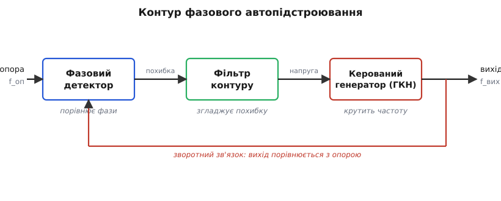
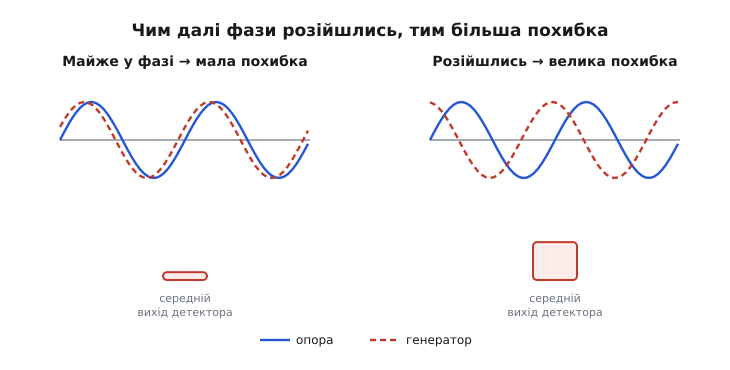
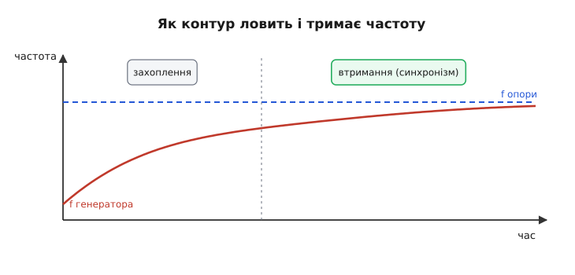
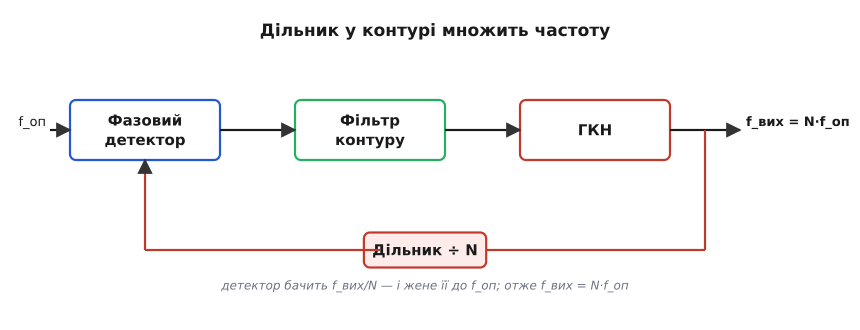

# Фазове автопідстроювання частоти (PLL): як коло саме ловить чужий ритм

Уявіть, що вам треба зробити власний генератор, який не просто видає «приблизно ту саму» частоту, що й чужий сигнал, а тримається його **намертво**: коливається в тому ж темпі, в тому ж такті, гойдається вгору-вниз пліч-о-пліч із ним — і не відпускає, навіть коли той сигнал ледь чутний у шумі чи трохи зсувається. Як кінь у запрягу, що йде нога в ногу з другим. Саме це робить **фазове автопідстроювання частоти** *(англ. phase-locked loop, PLL — «контур, замкнений за фазою»)*: коло, що саме підлаштовує свій генератор так, щоб іти в ногу з опорним сигналом.

Це одна з тих ідей, що спершу здаються вузькою хитрістю радіоінженерів, а потім виявляється, що вони сидять усередині майже кожної цифрової мікросхеми, кожного радіоприймача, кожного процесора. Розберімо повільно, **чому** така штука взагалі потрібна і **як** коло саму себе заганяє в синхронізм.

## Навіщо ганятися за чужою частотою

Почнімо з реальної потреби, бо без неї решта — порожні слова.

Перша потреба — **приймання слабкого сигналу**. Радіохвиля, що долетіла до антени, тоне в шумі. Якби ви знали **точно**, з якою частотою і в якій фазі вона коливається, ви могли б множити прийняте на свій, місцевий, ідеально синхронний сигнал — і шум, який «не в такт», у середньому погасився б, а корисний сигнал, який «у такт», накопичився. Але звідки взяти той ідеально синхронний місцевий сигнал? Передавач десь за тисячу кілометрів, його кварц трохи відрізняється від вашого, та й хвиля по дорозі зсувається. Потрібне коло, яке **само** піймає чужу частоту й фазу і триматиметься їх. Це і є початкова, історична задача PLL.

Друга потреба — **зробити багато точних частот з одного еталона**. У вас є один дуже стабільний [кварцовий генератор](topic:electronics/reference-frequency) на, скажімо, 10 МГц. А процесору треба 1200 МГц, радіомодулю — 2440 МГц, звуковому тракту — 12.288 МГц. Купувати окремий точний кварц на кожну частоту безглуздо. Натомість беруть один еталон і змушують PLL **помножити** його в потрібну кількість разів. Майже всі тактові частоти всередині сучасного процесора чи мікроконтролера народжуються саме так: один кварц на десяток мегагерців і ціла родина PLL, що розганяють його до гігагерців.

Третя потреба — **вичистити тремтливий такт**. Цифровий сигнал, що пройшов довгий провід, приходить пошарпаний: фронти «дрижать» у часі (це звуть джитером). PLL, налаштований повільним, бере середній ритм цього сигналу й видає свій, рівний як струна, у тому ж темпі, але без дрожі. Так відновлюють тактову частоту з потоку даних.

> 🔧 **Навіщо це.** Відкрийте будь-який сучасний мікроконтролер — і в його довіднику обов'язково буде розділ «PLL» у блоці тактування. Ви задаєте зовнішній кварц 8 чи 16 МГц, а в регістрах множника й дільника PLL виставляєте, у скільки разів його розігнати, щоб дістати робочу частоту ядра. Без розуміння PLL ви не налаштуєте тактування плати — а від нього залежить швидкодія геть усього на ній.

## Три блоки і одна петля

Тепер сама ідея. Вона напрочуд струнка: щоб коло «доганяло» чужу частоту, потрібні **три** частини, з'єднані в **кільце зворотного зв'язку**.


*Контур із трьох блоків. Фазовий детектор порівнює опорний сигнал зі своїм генератором і видає похибку; фільтр її згладжує у плавну керівну напругу; генератор підкручує частоту. Вихід повертається на детектор — і кільце саме гасить розузгодження.*

Пройдімо по колу.

**Фазовий детектор** *(phase detector)* — «суддя», що порівнює **фази** двох сигналів: опорного (того, який ловимо) і власного генератора. Він видає напругу, **тим більшу, чим далі ці два сигнали розійшлися в часі**. Якщо вони йдуть нога в ногу — на виході майже нуль. Якщо генератор відстає чи забігає — детектор кричить про це напругою похибки. Це той самий принцип, що й [порівняння двох сигналів у компараторі](topic:electronics/comparator), тільки тут на виході не «так/ні», а плавна міра неузгодженості.

**Фільтр контуру** *(loop filter)* — звичайний повільний [фільтр низьких частот](topic:electronics/rc-low-pass), часто всього лиш резистор із конденсатором. Він бере смикану, шарпану похибку від детектора й **згладжує** її в плавну, неквапну керівну напругу. Саме фільтр вирішує, наскільки **прудко** чи **ліниво** коло реагує: швидкий фільтр хапає чужу частоту жваво, але пропускає всередину шум і сам схильний розгойдуватися; повільний — спокійний і чистий, зате доганяє неквапно. Це найтонше місце всього кола.

**Керований напругою генератор** *(voltage-controlled oscillator, ГКН)* — серце контуру. Це генератор, чию частоту задає **напруга** на його вході: більша напруга — вища частота, менша — нижча. Сам по собі він гуляв би вільно; але ми під'єднали до його входу плавну напругу з фільтра — і тепер коло **крутить** його частоту в потрібний бік.

А тепер — ключ до всього — **замкнімо кільце**. Вихід генератора заводимо назад на фазовий детектор, поряд з опорою. І простежмо, що станеться.

Хай генератор спершу трохи **відстає** — коливається повільніше за опору. Фази розповзаються: з кожним тактом генератор усе більше позаду. Детектор це бачить і видає напругу похибки. Фільтр згладжує її в керівну напругу, яка **підвищується**. Вища напруга на вході генератора — **вища** його частота. Генератор пришвидшується й починає доганяти. Щойно він порівнявся з опорою — похибка спадає, керівна напруга застигає на тому значенні, що тримає потрібну частоту, і коло заспокоюється в **синхронізмі**. Якщо ж генератор почне забігати наперед — усе дзеркально: похибка зміниться знаком, напруга трохи впаде, частота сповільниться. Кільце **само** ловить будь-яке відхилення й гасить його, точно як [від'ємний зворотний зв'язок](topic:electronics/negative-feedback) у підсилювачі — тільки тут регулюється не напруга, а **частота й фаза**.

Ось чому це «фазове автопідстроювання»: коло безперервно, само собою, підстроює фазу свого генератора під фазу опори.

## Чому детектор дивиться саме на фазу

Може скластися враження, що логічніше було б порівнювати **частоти**: виміряти, скільки коливань за секунду в опори й у генератора, і підганяти одне під одне. Але є тонкість, заради якої вся хитрість і затівалася.

Дві частоти можна зробити **однаковими в середньому**, а сигнали все одно «плистимуть» один відносно одного — як два майже однакові годинники, що поволі розходяться. Для синхронного приймання чи чистого такту цього мало: потрібно, щоб гребені хвиль **збігалися**, тримались разом постійно. А це і є **фаза** — наскільки один сигнал зсунутий у часі відносно іншого. Хто пильнує фазу, той автоматично пильнує й частоту: бо якщо фази тримаються разом і не розходяться, значить, частоти **точно** рівні — інакше зсув накопичувався б. [Фаза](topic:electronics/phase-shift) — це строгіша, жорсткіша вимога, ніж частота, і саме її стереже PLL.

А чому детектор видає напругу, що **росте** з фазовим розузгодженням? Найпростіший фазовий детектор — це просто перемножувач: він множить опору на сигнал генератора. Коли два синусоїдні сигнали однакової частоти перемножити, у добутку є складова, що **залежить від різниці їхніх фаз**: збігаються фази — складова велика й додатна, розійшлися на чверть періоду — нуль, протифаза — велика й від'ємна. Фільтр відсіює все швидке й лишає саме цю повільну складову — готову міру розузгодження. (Точне виведення, чому добуток дає косинус різниці фаз, і чим це обертається для діапазону втримання — у [математичній вставці](topic:electronics/phase-locked-loop/math-pll-dynamics.md).)


*Фазовий детектор як міра розузгодження. Поки опора (суцільна) і генератор (пунктир) ідуть майже разом, середній вихід малий. Розійшлися фази — вихід зростає. Саме цю напругу контур і жене до нуля.*

## Захоплення і втримання: два різні таланти

У роботі PLL є два різні режими, і плутати їх — типова помилка.

**Втримання** *(lock)* — стан, коли коло вже піймало опору й тримає синхронізм. Поки опора лишається в певній смузі частот навколо вільної частоти генератора, контур її **не відпускає**, посуваючи свою керівну напругу слідом. Ширину цієї смуги звуть **смугою втримання**: за її межами керівна напруга вже не може дотягнути генератор до опори, і синхронізм рветься.

**Захоплення** *(capture)* — складніший момент: коло ще **не** в синхронізмі й тільки намагається піймати опору. Тут є халепа. Поки генератор далеко за частотою від опори, фазовий детектор видає не плавну похибку, а швидкі биття — і повільний фільтр їх просто згладжує в нуль. Виходить, контур «не чує» далеку опору й нікуди не повзе. Тому **смуга захоплення** — діапазон, з якого коло здатне втягнутися в синхронізм, — звичайно **вужча** за смугу втримання: піймати важче, ніж утримати вже піймане. Це як наздогнати потяг, що вже рушив: доки далеко — марно бігти, але якщо вже біжиш поруч, триматися легко.


*Дві фази роботи. Спершу захоплення: частота генератора підтягується до опори, часом із невеликим перельотом, поки коло «втягується». Далі втримання: контур тримає частоту синхронною, відробляючи будь-який зсув опори.*

Як коло поводиться під час захоплення — чи плавно підповзе, чи стрибне з перельотом і покойдається, перш ніж заспокоїтися, — залежить від **фільтра контуру**. Це той самий компроміс стійкості, що й у будь-якому колі зі зворотним зв'язком: занадто прудкий контур розгойдується, занадто млявий — повзе вічність. Підбір фільтра під потрібну швидкість і стійкість — окрема інженерна робота, яку детально розбирає [математична вставка про динаміку контуру](topic:electronics/phase-locked-loop/math-pll-dynamics.md).

> 🔧 **Навіщо це.** Коли в довіднику мікроконтролера пишуть «час стабілізації PLL — 200 мкс», ідеться саме про захоплення: після ввімкнення живлення чи зміни множника контур не одразу видає точну частоту, йому треба час «втягнутися». Тому в коді ініціалізації тактування **обов'язково** є цикл очікування прапорця «PLL ready» — поки коло не захопило частоту, на ньому не можна тактувати ядро, інакше дістанете брудний, нестабільний такт і випадкові збої.

## Дільник: як з одного кварца зробити будь-яку частоту

Тепер — найкорисніший трюк, заради якого PLL стоїть у кожному процесорі. Поки що наш контур заганяє генератор у **ту саму** частоту, що й опора. Користі від копії опори небагато. А що, як змусити генератор крутитися **в N разів швидше** за опору?

Хитрість елегантна до зухвалості. Поставмо у зворотний зв'язок, між виходом генератора й фазовим детектором, **дільник частоти** — просту цифрову схему, що видає один імпульс на кожні N імпульсів входу (поділити частоту на ціле число цифрова логіка вміє легко — лічильник). Тепер детектор порівнює з опорою не сам вихід генератора, а вихід, **поділений на N**.

Контур, як і раніше, працює, щоб зрівняти те, що бачить детектор, з опорою. А детектор бачить f_вих/N. Отже, коло жене систему до стану:

```
f_вих / N  =  f_оп
```

звідки одразу

```
f_вих  =  N · f_оп
```

Генератор крутиться **рівно в N разів швидше** за опору — а стабільність частоти лишається кварцовою, бо саме кварцову опору контур і стереже. Змінив N у регістрі — змінив вихідну частоту. Так один еталон на 10 МГц при N = 244 дає 2440 МГц для радіо, а при N = 120 — 1200 МГц для ядра. Цей вузол звуть **синтезатором частоти** *(frequency synthesizer)*, і це найпоширеніше застосування PLL у світі.


*Синтез частоти. Дільник ÷N у зворотному зв'язку дає детекторові f_вих/N. Контур жене цю величину до опори, тож вихідна частота виходить рівно в N разів вищою — з кварцовою стабільністю.*

**Скільки множити, щоб дістати 1200 МГц з кварца 8 МГц?**

:::tabs
```cpp
// Кварц 8 МГц, цільова частота ядра 1200 МГц.
// Знаходимо ціле N для дільника у зворотному зв'язку PLL:
//   f_core = N * f_ref  =>  N = f_core / f_ref

#include <stdint.h>

uint32_t f_ref_hz  = 8000000u;     // 8 МГц кварц
uint32_t f_core_hz = 1200000000u;  // 1.2 ГГц ціль

uint32_t N = f_core_hz / f_ref_hz; // = 150
uint32_t actual = N * f_ref_hz;    // 150 * 8e6 = 1 200 000 000 Гц

// Перевірка, що ділиться націло (інакше точної частоти не буде):
// 1200000000 % 8000000 == 0  -> так, N=150 дає рівно 1.2 ГГц.
```
```python
# Кварц 8 МГц, цільова частота ядра 1200 МГц.
# Знаходимо ціле N для дільника у зворотному зв'язку PLL:
#   f_core = N * f_ref  =>  N = f_core / f_ref

f_ref_hz  = 8_000_000      # 8 МГц кварц
f_core_hz = 1_200_000_000  # 1.2 ГГц ціль

N = f_core_hz // f_ref_hz  # = 150
actual = N * f_ref_hz       # 150 * 8e6 = 1 200 000 000 Гц

# Перевірка, що ділиться націло (інакше точної частоти не буде):
# 1_200_000_000 % 8_000_000 == 0  -> так, N=150 дає рівно 1.2 ГГц.
```
:::

Висновок простий: множник дільника N — це і є те число, яке ви вписуєте в регістр PLL, щоб задати робочу частоту. Якщо ціль не ділиться на опору націло, ставлять дробовий дільник (про це нижче), але ідея незмінна: **частота виходу = опора, помножена на коефіцієнт зворотного зв'язку**.

## Маленький PLL у програмі: відновлення такту

Щоб ідея перестала бути абстракцією, зберімо найпростіший **цифровий** PLL — не з резисторів і транзисторів, а в коді мікроконтролера. Така річ реально потрібна, коли треба відновити рівний такт із трохи нерівного потоку імпульсів (наприклад, із сигналу давача чи лінії даних).

Логіка та сама, що й у залізному контурі. У нас є власний рахівник фази, що біжить зі своєю «частотою» (кроком). На кожен прихід опорного фронту ми дивимося, **наскільки наша фаза розійшлася** з очікуваною, і трішки підправляємо свій крок — то пришвидшуємо, то сповільнюємо, аж поки не підемо в ногу з опорою.

:::tabs
```cpp
// Програмний PLL: підлаштовує власну фазу під опорні імпульси.
// phase — поточна фаза (0..PHASE_MAX), накопичується щотакту.
// step  — приріст фази за такт (це і є наша "частота").
// Викликаємо tick() щотакту таймера; on_ref_edge() — на кожен опорний фронт.

#include <stdint.h>

#define PHASE_MAX 65536u            // повний оберт фази = 2^16

static uint32_t phase = 0;          // акумулятор фази генератора
static int32_t  step  = 1000;       // приріст фази за такт (керована "частота")

void tick(void) {
    phase = (phase + step) & (PHASE_MAX - 1);   // фаза біжить по колу
}

void on_ref_edge(void) {
    // Опорний фронт мав би приходити, коли наша фаза = 0 (початок оберту).
    // Похибка фази: де ми насправді відносно очікуваного нуля.
    int32_t err = (int32_t)phase;
    if (err > (int32_t)(PHASE_MAX / 2))
        err -= PHASE_MAX;           // зводимо до діапазону [-32768 .. +32767]

    // Фільтр контуру: підправляємо крок пропорційно похибці (малий коеф.).
    // err>0 — ми забігли наперед, треба сповільнитись; звідси мінус.
    step -= err / 64;

    // Тримаємо крок у розумних межах (смуга втримання генератора):
    if (step < 800)  step = 800;
    if (step > 1200) step = 1200;
}
```
```python
# Програмний PLL: підлаштовує власну фазу під опорні імпульси.
# phase — поточна фаза (0..PHASE_MAX), накопичується щотакту.
# step  — приріст фази за такт (це і є наша "частота").
# Викликаємо tick() щотакту таймера; on_ref_edge() — на кожен опорний фронт.

PHASE_MAX = 65536           # повний оберт фази = 2^16

phase = 0                   # акумулятор фази генератора
step  = 1000                # приріст фази за такт (керована "частота")

def tick():
    global phase
    phase = (phase + step) & (PHASE_MAX - 1)    # фаза біжить по колу

def on_ref_edge():
    global step
    # Опорний фронт мав би приходити, коли наша фаза = 0 (початок оберту).
    # Похибка фази: де ми насправді відносно очікуваного нуля.
    err = phase
    if err > PHASE_MAX // 2:
        err -= PHASE_MAX        # зводимо до діапазону [-32768 .. +32767]

    # Фільтр контуру: підправляємо крок пропорційно похибці (малий коеф.).
    # err>0 — ми забігли наперед, треба сповільнитись; звідси мінус.
    step -= err // 64

    # Тримаємо крок у розумних межах (смуга втримання генератора):
    if step < 800:  step = 800
    if step > 1200: step = 1200
```
:::

Тут видно всі три блоки наживо. `on_ref_edge` рахує похибку фази — це **фазовий детектор**. Ділення `err / 64` і повільне накопичення поправки в `step` — це **фільтр контуру** (малий коефіцієнт = повільна, спокійна реакція; великий = прудка, але схильна розгойдатися). Сам `step`, що задає швидкість обертання фази, — це **керований генератор**. А обмеження `step` між 800 і 1200 — це і є **смуга втримання**: за ці межі контур генератор не пустить.

Чому ділимо похибку на 64, а не віднімаємо цілком? Бо різке коригування на повну похибку — це той самий прудкий контур, що розгойдується: коло перестрибне ціль, потім перестрибне назад і ніколи не заспокоїться. Малий коефіцієнт робить контур неквапним і стійким — він підповзає до синхронізму плавно. Це **той самий компроміс** «швидкість проти стійкості», що й у залізному фільтрі: число `64` тут грає роль сталої фільтра.

## Що ще варто знати

Кілька важливих штрихів, без яких картина неповна.

**Дробові дільники.** Цілий дільник дозволяє множити лише на цілі N, тож вихідні частоти йдуть «сходинками» завширшки в опору. Коли треба тонша сітка (скажімо, точно налаштуватися на радіоканал), застосовують **дробовий синтез** *(fractional-N)*: дільник швидко перемикається між N і N+1 так, що в **середньому** виходить дробове значення. Це дає майже будь-яку частоту з того ж кварца, ціною трохи більшого шуму.

**Фазочастотний детектор.** Простий перемножувач має ваду: на великій різниці частот він губиться (видає биття замість похибки), тож захоплення кволе. У сучасних синтезаторах ставлять **фазочастотний детектор** *(phase-frequency detector, PFD)* разом із зарядовим насосом *(charge pump)*. Він стежить не лише за фазою, а й за тим, **яка частота вища**, тому впевнено підтягує генератор навіть здалеку й розширює смугу захоплення майже до смуги втримання. Це окремий клас вузла, що заслуговує власного розбору як [компонент](topic:electronics/phase-locked-loop/comp-pfd-charge-pump.md).

**Джитер і фазовий шум.** Жоден реальний PLL не видає ідеально рівної частоти — фронти трохи дрижать. Звідки ця дрож береться, як її міряють і чому повільний контур чистить шум опори, але пропускає шум власного генератора (а швидкий — навпаки), — це питання якості синтезу, важливе скрізь, де частота має бути чистою.

**Знайомий родич — синхронний двигун.** Та сама ідея «тримати фазу» працює й поза електронікою: фазою стереже й система синхронізації енергомережі, і деякі двигуни. Скрізь, де щось має йти **строго в такт** із зовнішнім ритмом, у глибині сидить контур, замкнений за фазою.

Підсумуймо суть. PLL — це коло зі зворотним зв'язком, у якому **фазовий детектор** міряє розузгодження свого генератора з опорою, **фільтр** згладжує цю похибку, а **керований генератор** підкручує частоту, аж поки не піде в ногу з опорою. Поставивши у зворотний зв'язок **дільник на N**, із одного кварцового еталона дістають цілу родину точних частот — і саме тому PLL тихо працює всередині майже кожної цифрової мікросхеми, перетворюючи скромний кварц на гігагерци, які тактують увесь сучасний світ.

> 📜 **Звідки взялося.** Ідею синхронного приймання з підстроюванням місцевого генератора під чужу хвилю описав ще 1932 року французький інженер Анрі де Беллескіз; масовою ж річчю PLL став аж наприкінці 1960-х, коли його вмістили в одну дешеву мікросхему. Як це народилося, хто стояв біля витоків і чому ідея сорок років чекала свого часу — в [історичній вставці](topic:electronics/phase-locked-loop/hist-bellescize-pll.md).
