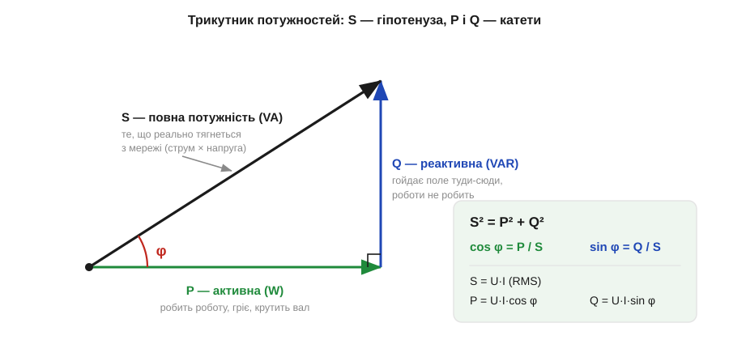
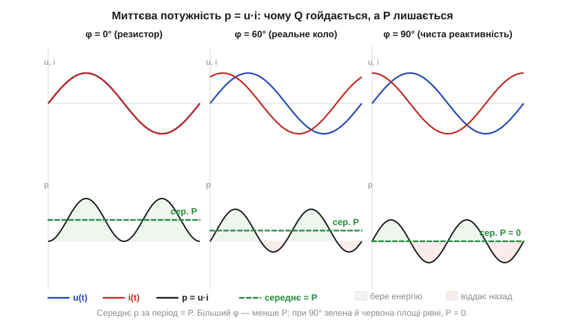

# 🧮 Активна, реактивна й повна потужність: P, Q, S, cosφ

> Це математична вставка про коефіцієнт потужності. Коли струм і напруга в колі [зсунені на кут φ](topic:electronics/phase-shift), середня потужність дорівнює ½·V₀·I₀·cos φ, а множник cos φ зветься коефіцієнтом потужності. Тут ми розкладемо цю одну формулу на **три потужності** — активну, реактивну й повну — і покажемо, що вони складаються в прямокутний трикутник. А заодно з'ясуємо те, що дивує кожного, хто вперше бачить шильдик трансформатора: чому його рейтингують у **вольт-амперах (VA)**, а не у звичних ватах.

### Три потужності: означення

Формула з амплітудами V₀, I₀ зручна для графіків, та в енергетиці працюють із **діючими** (середньоквадратичними, *RMS — root mean square*) значеннями U = V₀/√2 та I = I₀/√2: саме їх показує вольтметр у розетці (230 V — це RMS). У цих позначеннях середня потужність стає компактнішою, бо двійка ховається в перерахунок:

```
P = ½·V₀·I₀·cos φ = U·I·cos φ      [Вт, W]
```

Це **активна потужність** (*active / real power*, P) — та частка, що справді робить роботу: гріє, світить, крутить вал. Поряд із нею вводять ще дві.

```
Q = U·I·sin φ      реактивна (reactive power, Q)   [вар, VAR]
S = U·I            повна     (apparent power, S)    [вольт-ампер, VA]
```

**Реактивна потужність** Q — це та сама «холоста» потужність, що [гойдається між джерелом і полем](topic:electronics/phase-shift), не роблячи роботи (звідси й окрема одиниця — вар, щоб не плутати з ватом). **Повна потужність** S — це просто добуток того, що показують вольтметр і амперметр: «видима» потужність, яку насправді тягне навантаження з мережі. Усі три мають однакову розмірність, та позначають їх різними одиницями (W, VAR, VA) навмисне — це сигнал інженерові, *яку саме* потужність мають на увазі.

### Інтуїція: чому це прямокутний трикутник

Звідки взаємозв'язок між трьома? Він схований у [фазорній картині кола зі зсувом фаз](topic:electronics/phase-shift). Струм навантаження можна подумки розкласти на дві складові: одну **в фазі** з напругою (вона й переносить активну потужність) і одну **під 90°** (вона дає реактивну). Перпендикулярні складові не додаються арифметично — вони складаються за теоремою Піфагора. Те саме переноситься на потужності: помножимо кожну складову струму на ту саму напругу U — і дістанемо P уздовж осі, Q перпендикулярно, а їхня сума-гіпотенуза — це S.


*Активна P (горизонталь), реактивна Q (вертикаль) і повна S (гіпотенуза) утворюють прямокутний трикутник. Кут між P і S — той самий зсув фаз φ. Звідси cos φ = P/S — частка «корисної» потужності у «видимій».*

```
S² = P² + Q²        →   S = √(P² + Q²)
cos φ = P / S        (коефіцієнт потужності, power factor, PF)
```

Тепер коефіцієнт потужності cos φ читається геометрично: це косинус кута трикутника, тобто **частка** повної потужності, що дісталася активній. У чистого резистора Q = 0, трикутник «лягає» в горизонтальну лінію, cos φ = 1 — уся видима потужність корисна. У чистої реактивності навпаки: P = 0, трикутник «стоїть» вертикально, cos φ = 0 — енергія лише гойдається. Реальне навантаження — десь між: що «косіша» гіпотенуза, то більше струму витрачається даремно.

Трикутник пояснив, як три потужності пов'язані між собою, але не звідки в активній узявся сам множник cos φ. А його видно, якщо повернутися до миттєвої потужності p = u·i. Перемноживши дві синусоїди, зсунені на φ, дістанемо криву, що гойдається вгору-вниз навколо деякого середнього рівня — і саме цей рівень і є активна потужність P.


*Миттєва потужність p = u·i для трьох зсувів. При φ = 0° (резистор) p ніколи не від'ємна — середнє максимальне. При φ = 60° з'являються від'ємні «провали» (елемент частину часу віддає енергію), середнє падає. При φ = 90° зелена («бере») і червона («віддає») площі рівні — середнє нуль. Середній рівень дорівнює ½·cos φ — звідси й множник cos φ у P.*

### Чому трансформатори рейтингують у VA

Тепер — обіцяна загадка шильдика. Чому на трансформаторі пишуть «500 VA», а не «500 W»? Бо два механізми, що його руйнують, реагують на **різні** половинки добутку U·I, і жоден із них не бачить кута φ.

Перше обмеження — **нагрів обмоток**. Втрати в міді ростуть як I²·R (це [джоулеве тепло](topic:physics/electric-power)) і залежать **лише від струму**, незалежно від того, у фазі він з напругою чи ні. Реактивний струм гріє провід точнісінько так само, як активний. Друге обмеження — **насичення осердя**: магнітний потік задається прикладеною **напругою** (V = L·di/dt, із [означення індуктивності](topic:electronics/inductance)), і перевищиш граничну U — осердя ввійде в насичення, хоч би яким був cos φ.

Отже, межі трансформатора — це «не більше за такий струм» і «не більше за таку напругу» **окремо**. Їхній добуток U·I — це і є повна потужність S. А скільки з неї дістанеться активній (cos φ), вирішує **навантаження**, якого виробник не знає наперед:

```
Шильдик «500 VA, 230 V»  →  I_max = 500 / 230 ≈ 2.17 A
        активна потужність залежить від cos φ навантаження:
        cos φ = 1.0  →  P = 500 W   (резистор)
        cos φ = 0.7  →  P ≈ 350 W   (мотор)   ← струм той самий 2.17 A!
```

Якби на шильдику стояло «500 W», воно було б правдою лише для одного конкретного cos φ. Тож виробник чесно вказує те єдине, що він **контролює**, — добуток гранично допустимих напруги й струму, тобто **S у вольт-амперах**. Та сама логіка діє на джерела безперебійного живлення (UPS), генератори й стабілізатори: їхній «розмір» — це повна потужність, бо мідь і залізо коштують на струм і напругу, а не на фазу.

### Навіщо це на практиці

Трикутник потужностей зводить усе до одного кута: [зсув фаз](topic:electronics/phase-shift) керує розподілом енергії на корисну (P) і холосту (Q). Реактивна потужність Q — це кількісна міра тієї «гойдалки», що пояснює, чому конденсатор і котушка не гріються. На ній тримається й **компенсація cos φ** батареями конденсаторів: це буквально віднімання індуктивної Q моторів конденсаторною Q протилежного знаку, поки гіпотенуза S не «ляже» ближче до P — і завод перестане платити за струм, який лише гойдається туди-сюди. А множник sin φ, що дає Q, — рідний брат cos φ із розбору [похідних синуса](topic:electronics/phase-shift/math-sine-derivative.md), де поворот на 90° і пояснює, звідки в реактивностях береться саме синус кута.
